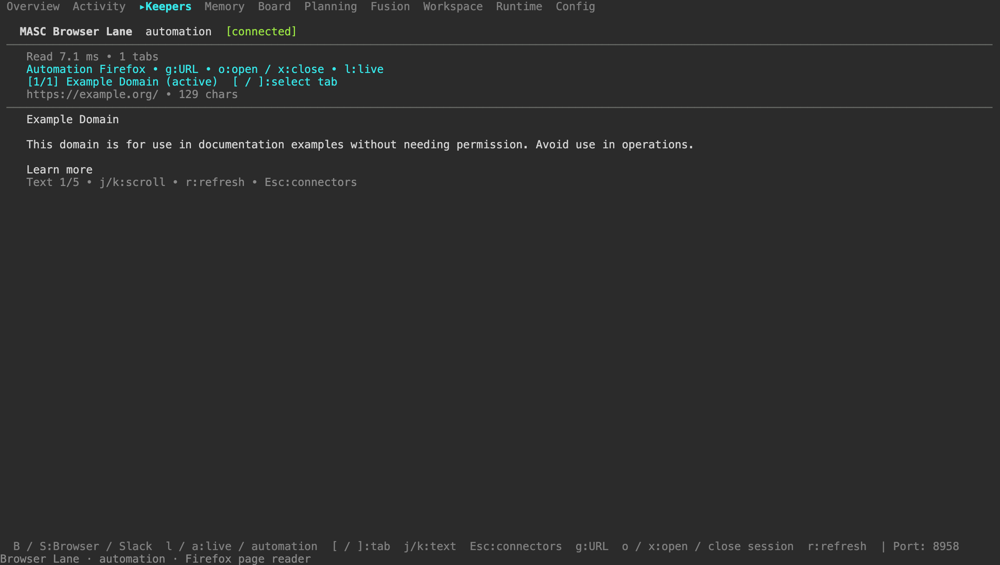
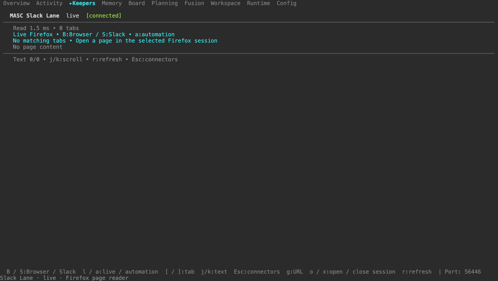

# Browser and Slack Lane: measured scratch-runtime proof

On 2026-09-07, CI-built macOS arm64 binaries served Browser and Slack views
in the real TUI against the isolated HTTP server on **port 8958**. The browser
fixture contained public Example Domain content. Slack had no authenticated
tab, so its measured behavior is **empty-state selection and automatic
refresh**, not reading Slack conversations. This bundle does not establish a
deployment or runtime result on the production server at port 8935.

## Results

The checked-in [automation capture script](../../../scripts/capture-browser-slack-proof.py)
completed 13 HTTP observations and four full-width screenshots. Its SHA-256
matches the executed script recorded in [measurement.json](measurement.json).

| Observation | Measured result |
| --- | --- |
| New automation Firefox session | HTTP 200, 1377.5 ms |
| Navigate to Example Domain | HTTP 200, 151.2 ms |
| Five consecutive automation reads | 6.5, 5.2, 4.7, 4.6, 4.1 ms; all HTTP 200 |
| Read median / range | 4.7 ms / 4.1–6.5 ms, five samples |
| Slack automation without a matching tab | HTTP 200, 2.9 ms; empty tabs and no page |
| Read after closing the automation session through the TUI | HTTP 400 with the explicit closed-session error |
| Reopen and enter the URL through the TUI | Fresh API read confirmed Example Domain and `?q=qq-browser-lane` |
| Final session cleanup | HTTP 200, 273.9 ms |

These are warm reads of one small public page, not a general browser or Slack
performance benchmark. The timings in screenshots are additional TUI-triggered
requests and therefore differ from the five API samples above.

The [live refresh script](../../../scripts/capture-browser-live-refresh-proof.py)
observed **four completed HTTP 200 / `ok:true` Slack live reads in seven
seconds**, with the TUI refresh setting at two seconds. Its
[receipt](live-refresh.json) records successful responses, not merely started
requests. The TUI connected through a temporary loopback logging proxy; the
proxy port shown in those screenshots forwards to the same upstream **8958**.
The proxy recorded app/source/timing/status fields and no headers or bodies.

After restarting the owned Firefox proof connection with the fixed OCaml host,
a [fresh API probe](live-api-fixed-host.json) measured Browser live at **16.9 ms**
and Slack live empty state at **2.1 ms**, both HTTP 200.

## Component identity

| Component | Source commit | SHA-256 |
| --- | --- | --- |
| Scratch server, embedded source identity | `a1dcd40acca7b43d34ee761afcf165d35b943c0c` | `c3298982f9ac9e665e7caee83b7ea64e598ab496073c70e2c1ac35ac2c797843` |
| TUI artifact | `a1dcd40acca7b43d34ee761afcf165d35b943c0c` | `b1fcc25f1a2c9e6c2e3134f1cbe5791fa4222d9449734789723c23a239164ce3` |
| Fixed Firefox native host | `75157f4786c5ee268e08dfa4ea348364638f44aa` | `a5587b8e6ac9f8d2177b00ddfc5014a310bcd86c1e71e449789a06472a9d0e62` |

The server reports its embedded commit through `/health`. The TUI source is
artifact provenance supplied to the capture script; the script independently
hashes its executable. Both came from the
[server/TUI artifact run](https://github.com/jeong-sik/masc/actions/runs/34085955481).
The host source and checksum were checked against its
downloaded `SOURCE_COMMIT` and `SHA256SUMS`; see [host-artifact.json](host-artifact.json).
[Process evidence](fixed-host-process.json) identifies the fixed executable
running as Firefox's child without collecting argv or environment values.
The main capture receipt deliberately does not claim to verify that host
binary itself; these separate host receipts supply that evidence.

The fixed-host [CI run](https://github.com/jeong-sik/masc/actions/runs/34086992976)
passed nine protocol tests in 23.442 seconds. The downloaded executable then
passed nine tests locally in 24.029 seconds, including blocked native stdout
and EOF cancellation. The short [CI log](native-host-ci-tests.log) and
[local execution log](native-host-local-tests.log) are included. No local
OCaml build was performed.

## Screenshots





Additional frames and their text snapshots:

- [Slack automation empty state](02-slack-empty.png)
- [Explicit closed-session error](04-session-closed.png)
- [Session reopened and URL editor navigation verified](05-session-recovered.png)
- [Live Firefox through the fixed native host](06-browser-live-full-width.png)

The captured TUI source still highlights the top-level Keepers tab. Its
`[connected]` badge is shared connection state: it also appears in the frame
where the browser session is closed, while the page correctly displays the
closed-session error. The later source fix
[#33907](https://github.com/jeong-sik/masc/pull/33907) is not represented by a
newer TUI executable in this bundle. These images prove the displayed lane
content and full-width layout, not that later header behavior.

## Reproduce

Prepare an isolated temporary base directory with the documented
[native Firefox configuration](../../design/native-firefox-lane.md), an admin
bearer file, CI-built server/TUI artifacts, and a loopback geckodriver. Start
the scratch server on its own port. Keep the live extension disconnected or
use an isolated Firefox profile with only `https://example.org/` open. The
automation script refuses to take over an already-open automation session.

```sh
python3 scripts/capture-browser-slack-proof.py \
  --base-path /tmp/masc-browser-proof-runtime \
  --api-port 8958 \
  --executable /path/to/masc-tui-macos-arm64 \
  --token-file /tmp/masc-browser-proof-runtime/.masc/auth/masc-tui.token \
  --tui-source-commit "$ARTIFACT_SOURCE_COMMIT" \
  --out /tmp/browser-slack-proof
```

For live refresh, install the checksum-verified native host using
[the host installer](../../../connectors/browser/host/README.md), restart the
owned proof extension connection, and keep only Example Domain open:

```sh
python3 scripts/capture-browser-live-refresh-proof.py \
  --base-path /tmp/masc-browser-proof-runtime \
  --api-port 8958 \
  --executable /path/to/masc-tui-macos-arm64 \
  --token-file /tmp/masc-browser-proof-runtime/.masc/auth/masc-tui.token \
  --refresh-seconds 2 --observation-seconds 7 \
  --out /tmp/browser-slack-live-proof
```

Both reproduction scripts were executed successfully for this bundle. Only
selected public screenshots, text snapshots and small receipts are committed.
Token files, native manifests, full health output, vendor session responses
and server logs are excluded. Authenticated Slack content, Slack history
completeness and multi-hour continuity remain unmeasured.
