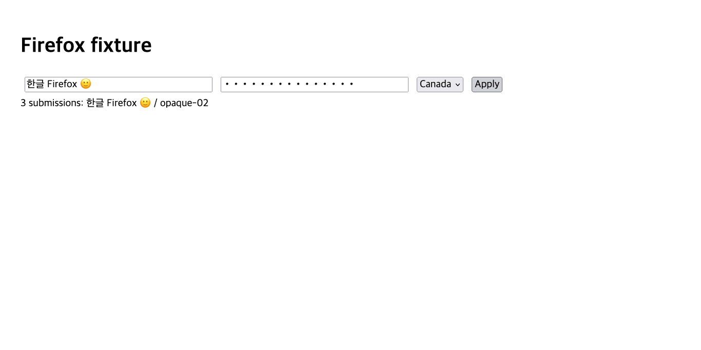

# Firefox controls: measured native-browser evidence

Production `Browser_webdriver` and `Browser_action` source was evaluated with
the OCaml interpreter, using a small curl HTTP adapter against stock Firefox
and geckodriver on an isolated loopback fixture. No local MASC build was used.
The adapter supplies transport only; tab mapping, selection/interaction locking,
WebDriver requests, input, history and error classification come from the
production source. `sources.json` records the measured source hashes.

[Probe log](probe.log): 12 assertions passed, including Unicode fill, exact
option values, native click, tab targeting, ambiguous-selector refusal, history,
closed targets, and ID non-reuse after closing/reopening Firefox. Native Enter,
scroll, reload, tab creation and close also completed in the scenario.

The screenshot comes from WebDriver's screenshot endpoint in the probe. It is
not evidence of a model-visible screenshot tool, an installed MASC binary, or
a Keeper turn. Password characters shown are from the synthetic fixture;
password values are omitted from element observations. The form has no remote
submission destination and prevents its default navigation.

DOM fixtures separately execute both shipped element observation scripts.
Full repository typechecking and Keeper integration run in CI.

Reproduce with `python3 scripts/probe-firefox-controls.py --geckodriver
/path/to/geckodriver --firefox /path/to/firefox --out /tmp/firefox-proof`.
Requires installed OCaml interpreter packages eio_main/yojson/uri and curl.
The probe opens only a newly owned Firefox session and closes it on exit.
