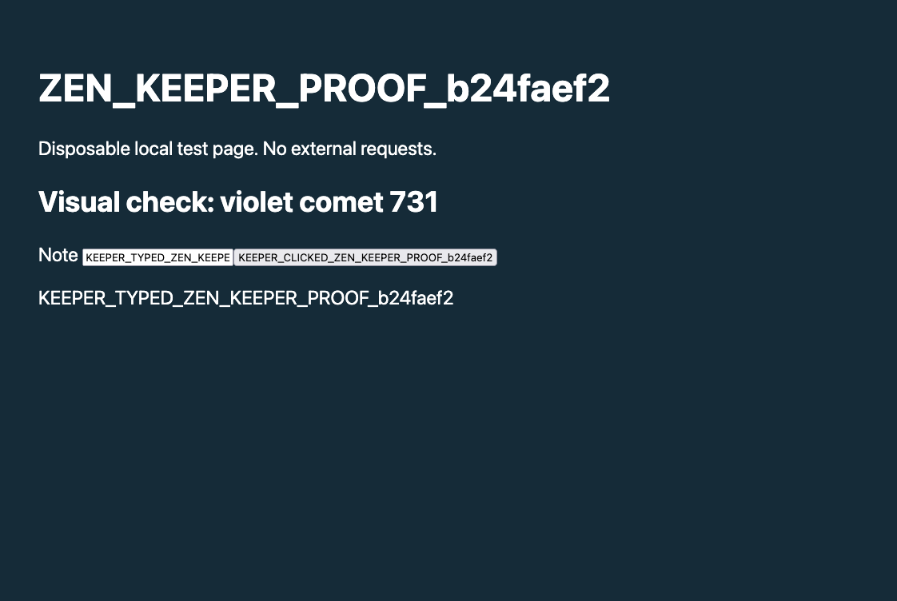

# Actual Keeper → Zen browser proof

A real Keeper on the CI-built `3f80b0bef240373abdcbef8e0a668e8130b5fbbe`
server completed one cloud GLM turn in 41.751 seconds. Its recorded model was
`glm-5.3-flash`; all seven tool receipts identify runtime
`ollama_cloud.ollama-cloud-glm-5-3-flash`. The provider identifier is the configured
runtime identity, not a separately captured HTTP provider response. The specific
vision subcall model was not recorded in these scoped receipts and is left null.

The actual seven calls, including inputs and outputs, are in [tool-trace.json](tool-trace.json):
BrowserTabs, BrowserRead(text), BrowserInteract(fill), BrowserInteract(click),
BrowserRead(text), BrowserRead(image), and keeper_analyze_image. All succeeded.
The Keeper used the discovered Zen client UUID and tab ID for every later browser
call, and exact expectedUrl guards for both mutations. This test had one disposable
Zen connection; it does not duplicate the separate two-client/reconnect proof.

Independent post-turn Browser Lane reads confirmed the typed note and clicked
button. The persisted Keeper PNG artifact's SHA-256 matches its returned handle,
and its bytes equal the independently captured post-turn screenshot shown here.
The vision tool actually received that artifact handle and returned
`Visual check: violet comet 731`.

**Vision scope:** that line is ordinary DOM text and was already present in the
Keeper's earlier BrowserRead text result. Its full value was absent from the
operator prompt and the vision query, but this is not a blind visual recognition
benchmark. The measured claims are image capture, durable artifact linkage, a real
vision-tool invocation, and the matching response.

The Keeper explicitly declared microvm/apple_container with the existing local
sandbox image; browser tools run inside the OCaml server by design. No host
sandbox fallback or VM shell execution was used. No external websites, Board,
messages to other actors, filesystem tools, or Execute calls appear in the trace.

Official keeper_down reached finalized, with registry unregistration and
accumulator cleanup. The Keeper is paused with autoboot/proactive disabled; no
owned VM remains. Its disposable Zen/WebDriver process, temporary browser profile,
and unique native manifest were removed. The scratch native-client inventory is
empty. The generated evidence and stopped Keeper records are retained.

[receipt.json](receipt.json) records hashes of the private original receipts. Only selected
fields and the seven actual tool outputs are published; full prompts, system
metadata, provider configuration/credentials, paths and unrelated state are omitted.
No local build was performed, and these receipts do not claim production deployment.

