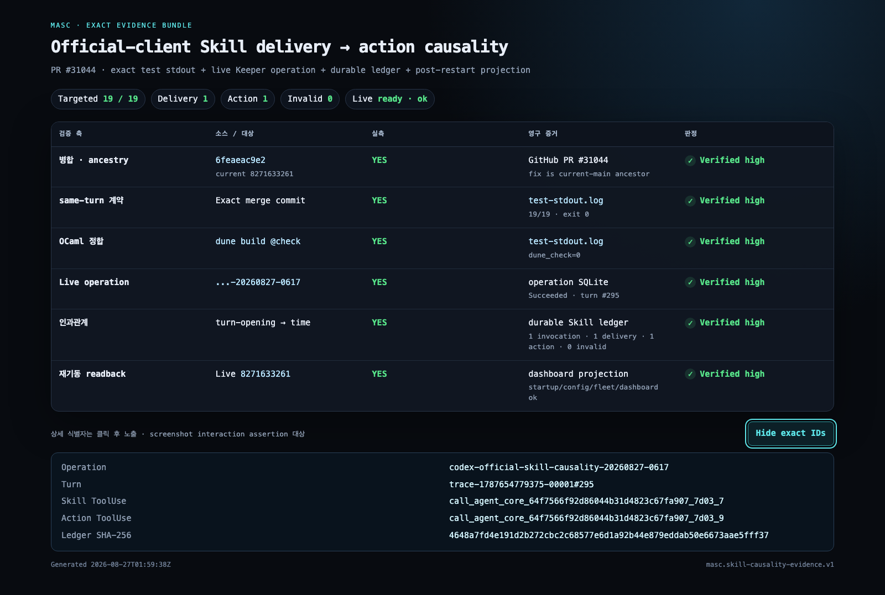

# Official-client Skill causality evidence

PR [#31044](https://github.com/jeong-sik/masc/pull/31044)의 official-client Skill delivery/action 인과관계를 소스, exact-commit 테스트, live operation, durable ledger, 재기동 후 projection으로 교차 검증한 증거 묶음이다.

## 판정 매트릭스

| 검증 축 | 소스/대상 | 실측 여부 | 영구 증거 | 결과 | 신뢰도 |
|---|---|---:|---|---|---|
| 병합과 ancestry | merge `6feaeac9e2`, current main `8271633261` | 예 | GitHub PR + `evidence.json` | fix는 current main의 조상 | Verified high |
| same-turn ledger 계약 | exact merge `6feaeac9e2` | 예 | `test-stdout.log` + 회귀 테스트 소스 | 19/19, exit 0 | Verified high |
| 전체 OCaml 정합 | exact merge `6feaeac9e2` | 예 | `test-stdout.log` | `dune build @check`, exit 0 | Verified high |
| live Keeper operation | `codex-official-skill-causality-20260827-0617` | 예 | operation SQLite + API projection | `Succeeded`, turn `#295` | Verified high |
| Skill delivery causality | `turn-opening` → `keeper_time_now` | 예 | durable Skill ledger + dashboard projection | invocation 1 / delivery 1 / action 1 / invalid 0 | Verified high |
| 재기동 후 readback | current live `8271633261` | 예 | `/health`, dashboard projection, supervisor log | startup/config/fleet/dashboard `ok` | Verified high |
| 시각 증거 | 브라우저에서 상세 행 펼치기 | 예 | `evidence-matrix.png` | exact IDs와 행 판정 렌더 확인 | Verified high |

## 파일

- `evidence.json` — machine-readable SSOT
- `test-stdout.log` — exact merge commit에서 재실행한 targeted test와 `@check` stdout
- `evidence-matrix.html` — 사람이 읽는 매트릭스 화면
- `capture-evidence.mjs` — 상세 행을 실제로 펼치고 assertion 후 PNG를 찍는 Playwright 스크립트
- `evidence-matrix.png` — 브라우저 실측 스크린샷
- `SHA256SUMS` — 묶음 파일 무결성

## 핵심 식별자

- Fix merge: `6feaeac9e2abcc9ca3c44c7fb21da272f040082b`
- Current main/live at bundle creation: `82716332612ab5c49e0715a22f3f66ed9ba88a63`
- Operation: `codex-official-skill-causality-20260827-0617`
- Turn: `trace-1787654779375-00001#295`
- Skill tool use: `call_agent_core_64f7566f92d86044b31d4823c67fa907_7d03_7`
- Action tool use: `call_agent_core_64f7566f92d86044b31d4823c67fa907_7d03_9`
- Durable ledger SHA-256: `4648a7fd4e191d2b272cbc2c68577e6d1a92b44e879eddab50e6673aae5fff37`

