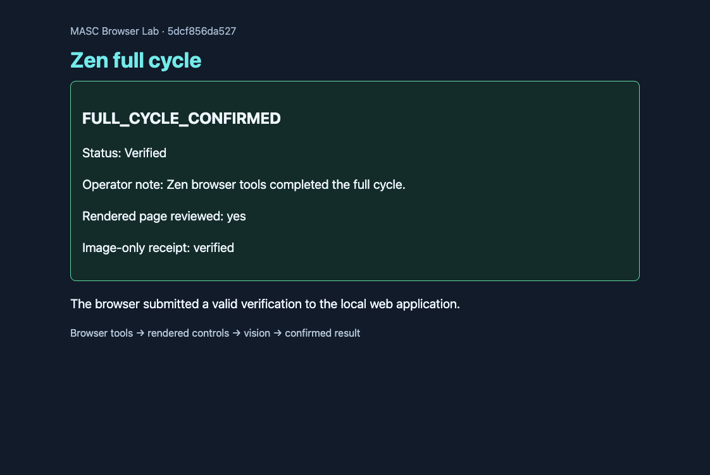

# Zen full cycle — 2026-09-08 KST

A Keeper opened a fresh headless Zen session, found the **Zen full cycle** check in
a generated local web application, selected a status, filled a note, checked the
review box, read an image-only receipt code through `keeper_analyze_image`, and
submitted the form. The web application accepted exactly one POST. The Keeper read
and captured the confirmation, the actual TUI displayed the same PNG payload, and
a second Keeper turn closed the browser session.

**Browser cycle PASS:** 19 successful tool calls, 6 selector actions grounded in
previously observed controls, 2 vision calls, 2 model turns, 98.488 seconds from
workflow start through TUI verification and browser closure. This is one run,
not a performance benchmark. The generated code was absent from the prompt, DOM
text and pre-vision tool/trace records. Its first appearance in the model's history
was the image tool's answer; the accepted POST occurred inside the save-click call.

[Open the standalone HTML report](index.html), inspect [tool-trace.json](tool-trace.json)
and [receipt.json](receipt.json). The final 59,575-byte PNG is byte-identical across
the Keeper artifact, independent browser HTTP capture, and actual TUI Kitty APC
payload. These are viewport images, not terminal desktop screenshots. TUI exited
normally without a tty override; termios restoration was not measured separately.

## Shutdown recovery

The initial Keeper shutdown blocked when its Librarian drain exceeded 30 seconds.
The Librarian subsequently committed its memory snapshot, but the original lane's
recorded cleanup error remained. No pending chat operations existed. An explicit
same-Keeper update superseded that blocked shutdown through the supported lifecycle
API, preserving runtime/instructions and leaving model turns at two. A new shutdown
then finalized with terminal stopped, no cleanup error, registry unregistered,
accumulator dropped, admission fence cleared, and Keeper paused. Both operation
receipts are retained: this is **success with shutdown recovery**, not a clean
first-attempt Keeper shutdown. No state files were manually edited to mark success.

## Runtime identity and limits

The run used an isolated MASC process pinned to installed source
`bb51897c55132d0ef007f3f26ff2d29e29c2a0b8`, with server SHA-256
`571c0f14b3922983e47e0932d44cfabce03a0983a5f58ed00038c9c3740ac467`.
Source, executable digest and runtime instance were checked across phases. The
configured browser executable was Zen; geckodriver logs also record Zen's session
manager startup. This probe does not establish CI provenance or a TUI source
revision. Parent model `glm-5.3-flash` is observed in the completed snapshot; the
vision tool result does not record its selected model, so that field is not claimed.

The browser writes targeted only the generated local application. Existing logged-in
user tabs and external services were not exercised. This single image-only check is
evidence of the capture/vision/action linkage, not a general vision benchmark.

After the Keeper shutdown audit, the owned scratch server and geckodriver were
gracefully stopped with exact listener PID checks. The driver had no browser
children before stopping. Existing user browser processes were not stopped.
