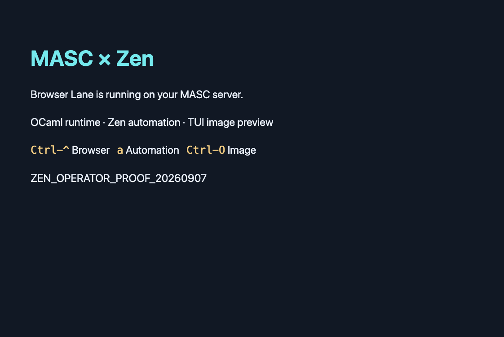

# Zen operator runtime — 2026-09-07 KST

Production automation and the installed TUI read the owned
`ZEN_OPERATOR_PROOF_20260907` page successfully. This was one **headless** Zen
session on a loaded host, not a benchmark: session open took **52.0604 s**, text
read **211.3 ms**, and capture **386.6 ms**. The owned session was closed.

The image below is the **45,099-byte PNG decoded from the TUI's actual Kitty APC
payload**, verified byte-for-byte against the browser capture. It is not a desktop
compositor screenshot. The installed TUI exited normally without a tty override;
this run did not separately measure termios restoration.

## Identity and limits

The server reported source `0799f02f796a647b4ef1fac57f54a064d7d3c6db` and executable
SHA-256 `7bb2bc118c0d56fe0f9c71e0920b60c16edcbd926dee36fab4c05423f16bd003`.
A concurrent actor built/replaced that installed file: this is observed runtime
identity, **not established CI provenance**. The installed TUI's verified SHA-256
is `a2324d99eca6971a6dd44ebc6a5aa3c8d869ae7f0ebcdb550c83dc2ae400b53f`;
its source revision was not established by this probe.

An earlier headed request returned HTTP 400, but its response body was not captured,
so the cause is unknown. GUI extension reload was not performed because Accessibility
windows were unavailable. The native-host manifest is installed, but the Browser Lane extension still needs
to be loaded manually in the operator's GUI browser; the final live client list
was empty. Overall fleet status was `warning`, not a healthy-fleet proof.

## Deployment gate and retained data

The full deployment preflight reported OK using the corrected gate from
[PR #34101](https://github.com/jeong-sik/masc/pull/34101), source `caed2eb289`,
and the CI helper from `b8d66cb8bef37d27e1fee411a645a598ed5f8f24`.
The public receipt preserves that successful line with private paths redacted.

Five dormant experimental schema-5 ledgers (**581 rows, 17 pending**) were retained
outside the active scan root, with no conversion or record deletion. Each archived
file's SHA-256 and row/pending counts match the private preservation receipt. Ledger
names and contents are omitted. [receipt.json](receipt.json) contains the selected
measurements, identities, hashes and limits; no full health, raw TUI, environment or
configuration data is included.
