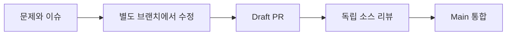

<p align="center">
  
</p>

# 저장소 전략과 기여 절차

[English](CONTRIBUTOR-WORKFLOW.md) · [기여 안내](../../CONTRIBUTING.md)

문제 제기부터 검증과 인계까지, MASC에 변경을 기여하는 순서입니다.

| 지금 하려는 일 | 시작점 |
|---|---|
| **첫 기여** | [문서 수정 · fork · 첫 PR](#1-처음-기여하기) |
| **AI와 개발** | [세션 준비 · 책임 · 실행 경계](#2-ai-개발-세션-시작하기) |
| **팀 작업** | [Issue · Goal · Task · Board](#3-작업-조율하기) |
| **변경 검증** | [CI](#4-검증하고-ci-요청하기) · [리뷰와 통합](#5-리뷰하고-통합하기) · [증거와 재개](#6-증거-제출과-재개) |

> [!NOTE]
> 개발 계약의 기준은 [헌법](../constitution.xml)의 `execution_protocol`입니다.
> 이 문서는 적용 방법을 설명하며, 실제 검사 동작은 workflow와 스크립트에서 확인합니다.



## 기본 저장소 전략

- Stacked PR로 작업합니다. 맨 아래 PR은 `main`을, 이후 PR은 직전 브랜치를 대상으로 합니다.
  PR 하나에는 구체적인 결과 하나를 담고 스택 아래부터 통합합니다.
- GitHub Native Stack은 REST `stack`을 먼저 읽고 [전용 절차](NATIVE-GITHUB-STACKS.md)를 따릅니다.
  선택한 PR 아래의 미병합 PR도 함께 병합되므로 전체 범위를 검토합니다. non-main base만으로
  부모 선행 병합이나 수동 retarget을 요구하지 않습니다.
- 동시 작업은 별도 worktree로 격리합니다. Task claim은 담당을 조율하며 파일을 잠그거나
  다른 체크아웃을 수정할 권한을 주지는 않습니다.
- README는 제품 소개, CONTRIBUTING은 개발 시작, 매뉴얼은 사용법, 명세는 인터페이스,
  RFC는 설계 제안을 담습니다. 사실 주장은 소스와 측정한 동작으로 뒷받침합니다.
- 지침은 기준이 되는 곳에 둡니다. `AGENTS.md`는 진입 안내, 헌법은 코딩 에이전트 규칙을
  맡습니다. 런타임 프롬프트는 별도 파일입니다.
- 변경 범위, 실제 효과, 증거와 남은 한계를 함께 제출합니다. 컴파일 성공, 설치된 바이너리,
  실제 동작 관측은 각각 다른 것을 증명합니다.

## 1. 처음 기여하기

[CONTRIBUTING](../../CONTRIBUTING.md)에서 시작합니다. 문서 수정에는 OCaml 개발 환경이
필요하지 않습니다. 사실을 설명하는 문장을 바꾸기 전에 관련 소스와 매뉴얼을 읽으세요.
코드를 변경한다면 [README 소스 설치](../../README.md#from-source)의 준비물을 확인합니다.

### 문제와 중복 확인

기존 이슈를 고르거나 문제, 기대 결과, 확인 방법을 적습니다. 이슈, 열린·닫힌 PR과
현재 소스를 검색한 뒤 시작하세요.

```bash
gh issue list --repo jeong-sik/masc --state all --search "your topic"
gh pr list --repo jeong-sik/masc --state all --search "your topic"
rg "relevant_symbol" lib bin dashboard config docs
```

위 명령에는 GitHub CLI 인증과 ripgrep이 필요합니다. GitHub의 이슈·PR 검색과 에디터
검색을 사용해도 됩니다. 작은 수정은 연결된 이슈에 재현 방법을 적습니다. 공개 계약이나
넓은 구조를 바꾸려면 구현 전에 해당 이슈에서 논의하세요. 이미 해결하는 PR이 있으면
그 변경의 리뷰를 도울 수 있습니다.

### 브랜치 준비

쓰기 권한이 있다면 기존 clone에서 시작합니다.

```bash
git fetch origin main
git worktree add -b docs/your-topic ../masc-your-topic origin/main
cd ../masc-your-topic
```

쓰기 권한이 없다면 GitHub에서 fork를 먼저 만듭니다. `YOUR-LOGIN`을 자신의 GitHub
계정으로 바꾸세요. 다음은 새 clone에서 시작하는 순서입니다.

```bash
git clone https://github.com/YOUR-LOGIN/masc.git
cd masc
git remote add upstream https://github.com/jeong-sik/masc.git
git fetch upstream main
git worktree add -b docs/your-topic ../masc-your-topic upstream/main
cd ../masc-your-topic
```

기존 clone에서는 `git remote -v`로 확인하여 같은 remote를 중복 추가하지 않습니다.
아직 사용하지 않은 경로를 고르세요. 실행 테스트는 별도 base path와 빈 포트를 사용합니다.
소스 체크아웃과 `.masc`가 들어 있는 작업 공간은 다릅니다.

### 첫 문서 PR

첫 문서 수정은 사실을 설명하는 문장 하나부터 고쳐보세요. 번역이 있다면 함께 고칩니다.
변경한 주장과 링크를 소스로 확인하고 `git diff --check`로 공백 오류를 확인합니다.
Commit 후 `git push -u origin docs/your-topic`으로 올리고 템플릿을 사용하여
`jeong-sik/masc:main`으로 draft PR을 엽니다.
[CONTRIBUTING](../../CONTRIBUTING.md#pull-requests)의 설명대로
`changelog.d/<PR number>.md`를 추가하여 push한 뒤 ready로 전환합니다. 요약에는 잘못된
안내, 수정 내용, 확인한 것을 적습니다. CI는 4절, fork 통합은 maintainer가 담당합니다.

### 수정 전에 소스 찾기

| 변경 | 먼저 읽을 내용 | 소스 / 검증 진입점 |
|---|---|---|
| 제품 문서 | [README](../../README.md), 연결된 매뉴얼 | `docs/`, 변경한 주장과 링크의 소스 |
| Keeper 동작·지침 | [Keeper 매뉴얼](../KEEPER-USER-MANUAL.md), 헌법 | `lib/keeper/`, `config/prompts/keeper.md`, `test/` |
| Goal·Task·Board·완료 | 헌법의 도메인 규칙 | `lib/workspace/`, `config/tools/`, `test/` |
| Provider·레인 동작 | 관련 인터페이스와 설정 | `lib/runtime/`, `lib/runtime_model/`, `test/` |
| TUI·브라우저 UI | 기존 상호작용과 payload 계약 | `bin/masc_tui*.ml`, `lib/tui_decode.ml`, `dashboard/`, `test/` |
| CI·개발 정책 | 헌법의 execution protocol | `.github/workflows/`, `scripts/ci/`, `scripts/review/` |

시작 위치를 안내하는 표이며 영향받는 파일 전체 목록은 아닙니다. 호출 경로와 테스트를
따라가고 해당 영역에 적용되는 지침도 읽으세요. 계약 변경과 Keeper 런타임 프롬프트 변경은
각각의 이유와 증거가 필요합니다.

## 2. AI 개발 세션 시작하기

계획하거나 수정하기 전에 [AGENTS.md](../../AGENTS.md)와 [헌법](../constitution.xml)
전체를 읽습니다. 그다음 다음 순서로 진행합니다.

1. 체크아웃, 브랜치, 기존 변경, 최신 main을 확인합니다. 사용 중인 공유 체크아웃에는
   별도 worktree를 사용하고 기존 작업을 보존합니다.
2. 요청한 결과, 범위와 증거 조건을 적습니다. 실제 소스, 현재 리뷰와 실패 로그를 읽습니다.
3. 범위를 정한 변경을 구현합니다. 외부 코딩 세션은 로컬 Dune 빌드를 하지 않습니다.
   일반 스택은 소스 리뷰로 판단합니다. 구체적인 필요가 있을 때만 범위를 좁힌 개발 검사를
   요청하고 전체 CI는 Release/Tag 경계에서 실행합니다. CI를 기다리거나 반복 조회하지 않습니다.
4. 다음 작업 단위로 넘어갈 때 이전 작업에 적대적 리뷰 에이전트를 붙입니다. 발견한 내용을
   직접 판단하고 대응합니다. 서브에이전트 리뷰가 곧 다른 모델의 리뷰나 GitHub 승인은 아닙니다.
5. 인계할 때는 다음 행동과 그 근거를 남깁니다.

AI를 활용한 기여도 환영합니다. 제출한 작성자는 diff를 이해하고 인증 정보와 비공개
런타임 데이터를 보호하며 리뷰에 대응하고 증거를 정확하게 설명할 책임을 가집니다.
무엇을 누가 또는 어떤 에이전트가 확인했고 무엇은 확인하지 못했는지 적으세요.
생성된 결과와 셀프 리뷰만으로 런타임 동작이나 독립 승인을 증명할 수는 없습니다.

**Commit 경계.** `.githooks`가 활성화되어 있으면 코드 commit의 pre-commit이 로컬
Dune 빌드를 실행합니다. 로컬 빌드를 하지 않는 외부 코딩 세션은 해당 commit에
`git -c core.hooksPath=/dev/null commit -m "your message"`를 사용합니다. 이 명령에서만
hook을 끄며 이후 push에는 적용되지 않습니다. pre-push의 trace 유출 검사는 유지하고
독립 소스 리뷰를 받으세요. 빌드를 피하려고 clone의 영구 hook 설정을 바꾸지는 않습니다.

Keeper 레인은 도구 체인이 있으면 로컬에서 빌드·테스트할 수 있습니다. 해당 결과가 독립
소스 리뷰나 Release/Tag 전체 CI를 대신하지는 않습니다. 세션 권한, MCP 인증의
에이전트 이름, Keeper 이름은 별개입니다. 공용 Task 소유자 이름으로 다른 세션의 작업을 해제하지 마세요.

## 3. 작업 조율하기

GitHub Issue·PR은 공개 변경을 추적합니다. MASC는 공유 목표와 실행 기록을 더합니다.

| 기록 | 용도 |
|---|---|
| Issue | 문제, 기대 결과, 재현 증거와 논의 |
| Goal | 측정 지표, 읽을 수 있는 측정 출처와 목표값을 가진 공동 목표 |
| Task | 범위가 정해진 구현·리뷰 작업, 담당과 완료 조건 |
| Board | 팀이 볼 결정, 질문, 의존성과 진행 상황 |
| PR | 실제 diff, 검증, 리뷰와 main 통합 |

외부 기여자에게 MASC 참여는 선택 사항입니다. 공개 이슈와 PR은 운영자의 비공개 작업
공간에 접근하지 않아도 이해할 수 있어야 합니다. Goal에 속하는 작업은 Goal을 먼저
만들고 Task 생성 시 `goal_id`로 연결합니다. 독립 Task도 정상이며 나중에 Goal에 연결할 수 있습니다.
구현 전에 `claim`, 이어서 `start`를 사용합니다. 다른 사람이 맡았다면 논의하거나 다른 작업을
고릅니다. 자신의 `Claimed`·`InProgress` Task를 인계할 때는 요약, 증거와 다음 행동을 적어
`release`합니다. `AwaitingVerification`은 release할 수 없으므로 검증을 유지하고 인계
기록을 남깁니다. 자신의 Task를 포기한다면 검증 대기 중에도 사유와 함께 `cancel`할 수
있습니다. 취소는 완료로 계산하지 않습니다.

현재 세션이 제공하는 `masc_goal_upsert`, `masc_add_task`, `masc_transition`,
`masc_board_post` 스키마를 사용하세요. 이 문서는 변하는 도구 payload를 다시 정의하지
않습니다. 공개·비공개 진행 글에 관련 ID를 남기세요. Board 계획은 증거가 있을 때까지 계획입니다.

## 4. 검증하고 CI 요청하기

변경한 동작과 구체적인 위험에 맞는 증거를 고릅니다. 문서는 변경한 주장의 소스를 읽고
링크·앵커·명령을 확인합니다. `git diff --check`는 공백 오류를 찾지만 동작을 증명하지
않습니다. 사람은 로컬 focused 검사를 사용할 수 있고 외부 코딩 세션은 2절을 따릅니다.
문구, 과거 개수와 소스 스타일 목록은 승인 조건이 아닙니다.

[scripts/pr-open.sh](../../scripts/pr-open.sh) 또는 GitHub fork PR 흐름으로 초안을 엽니다.
[PR 템플릿](../../.github/pull_request_template.md)을 채우고 이슈를 연결합니다.
diff와 증거가 준비되면 ready for review로 바꿉니다. PR 생성, push와 ready 전환은
CI를 자동으로 시작하지 않습니다.

[pr-check.yml](../../.github/workflows/pr-check.yml)은 소스·설정 문법과 credential 검사를
명시적 요청으로 실행합니다. [ci.yml](../../.github/workflows/ci.yml)은 스택
맨 아래 PR의 Core만 빌드합니다. 필요할 때만 짧고 가벼운 검사를 요청하세요.
헌법의 "2분 정도"는 검사 규모의 예시이며 강제 종료 시간이나 성공·실패 기준이 아닙니다.
의존성 캐시가 준비되지 않으면 더 오래 걸릴 수 있습니다. 실제로 성공한 완료 결과만
빌드 증거로 사용합니다.

PR, 일반 push와 정기 CI는 없습니다. `release/vX.Y.Z`에서는 먼저
[Release freeze](RELEASE-FREEZE.md)에 따라 포함 범위와 후보 SHA를 고정합니다.
이후에는 리뷰된 출시 차단 결함의 수리만 반영하며, main의 새 변경은 다음 버전으로
보냅니다. main이 갱신됐다는 이유로 고정 후보에 병합하지 않습니다. 그다음
[release-candidate.yml](../../.github/workflows/release-candidate.yml)을 명시적으로 요청하여
같은 head의 전체 빌드·타입 검사·동작 테스트·설치 검증을 실행합니다. 태그 발행에도 전체
검사와 테스트가 필요합니다. 정확한 절차는 [CI와 리뷰 안내](../CI-REVIEW-WORKFLOW.md)를 따릅니다.

Dispatch에는 저장소 권한이 필요하며 fork 기여자는 maintainer에게 필요한 실행을 요청할 수
있습니다. CI를 기다리거나 반복 조회하지 않고 다음 작업을 진행합니다. 작업 경계에서 실제
결과를 확인하고 diff, base와 환경 실패를 구분하세요. 무관한 수정은 별도 스택에서 처리합니다.

필요한 focused 검사는 변경 파일에서 바뀐 인터페이스와 직접 소비자를 따라 선정합니다.
기록에는 `파일 → 변경 인터페이스 → 직접 소비자 → 실제 검증 타깃 → 명령과 결과`를
연결합니다. 해당 소비자를 검사하지 않은 초록 결과로 대신하지 않습니다. 이 기록은
위험별 검사 선택을 돕는 것이며 모든 일반 PR에 Core 빌드나 전체 CI를 추가하는 승인
조건이 아닙니다.

## 5. 리뷰하고 통합하기

리뷰어는 계약과 현재 head의 diff를 기능·논리·코드 청결도 관점에서 독립적으로 검토합니다.
P0/P1/P2가 없으면 승인하고 P3는 모아서 나중에 처리합니다. 일반 리뷰에는 CI run이 필요하지
않습니다. 실행하지 않은 검사를 실행했다고 쓰지 않고 미확인 동작을 명시합니다. 지적마다
수정하거나 소스로 설명하고 문제가 해결된 스레드만 닫습니다. 범위·증거·남은 위험이 바뀌면
PR 본문도 갱신합니다.

Push하면 head가 바뀌므로 이전 리뷰가 새 변경을 증명하지 않습니다. REQUEST_CHANGES를
남긴 리뷰어는 수정된 코드가 자신의 지적을 해결했으면 변경 요청을 해제합니다. CI 통과만으로
리뷰 지적이 해결되지는 않습니다.

일반 소스 리뷰 판정에는 실제 값을 적습니다.

```text
verdict: PASS|FAIL head: <40-character-current-SHA> by: <Keeper-name>
```

APPROVE에는 [approve-guard.sh](../../scripts/review/approve-guard.sh)를 사용합니다.
`--check`는 리뷰 가능 여부를 검사합니다.

소스 리뷰를 시작하기 **전에** base SHA와 전체 diff 식별자를 캡처하고, 리뷰한 head와
증거에 함께 보관하세요. 인증된 `gh`, Git, Python 3, `jq`가 있는 저장소 checkout에서
아래 명령을 실행합니다. diff 도구는 없는 객체를 `gh` 인증으로 가져오며 대화형 입력을
요구하지 않습니다.

```bash
# Set repo and pr to the pull request being reviewed.
snapshot=$(gh api "repos/$repo/pulls/$pr")
head=$(printf '%s' "$snapshot" | jq -r '.head.sha')
review_base=$(printf '%s' "$snapshot" | jq -r '.base.sha')
review_diff=$(python3 scripts/review/review-diff.py \
  --repo "$repo" --base "$review_base" --head "$head")
# Read the complete diff and its source context, then write review-body.md.
scripts/review/approve-guard.sh --repo "$repo" --pr "$pr" --head "$head" \
  --review-base "$review_base" --review-diff "$review_diff" --body review-body.md
```

게시에는 `--body`, `--review-base`, `--review-diff`가 모두 필요합니다. guard는 검사 중
변경된 범위를 거부합니다. 변경 내용이 달라지면 다시 리뷰하고 증거를 캡처하세요.
읽지 않은 변경을 승인하기 위해 digest만 갱신하지 마세요.

작성하거나 push한 세션은 그 PR을 독립 승인할 수 없습니다. Release 판정에는 같은 head의 완료된 전체
검증을 가리키는 `run: <full-CI-run-id>`를 추가합니다. 위는 형식이며 판정이 아닙니다.
선택지와 placeholder를 실제 값으로 바꾸세요.

병합 전에 현재 리뷰와 댓글을 다시 읽습니다. 미해결 차단 리뷰나 이후의 FAIL/HOLD 판정이
있으면 통합하지 않습니다. 스택 아래부터 통합하며 base와 head의 변경을 검토한 뒤 진행합니다.
통합 조건은 [merge-guard](../../scripts/review/merge-guard.sh)와 현재
[CI·리뷰 안내](../CI-REVIEW-WORKFLOW.md)를 따릅니다. 일반 스택은 소스 리뷰,
Release head는 완료된 전체 CI가 필요합니다. Fork 기여자는 maintainer에게 통합을 맡깁니다.
소스 승인을 관측하지 않은 빌드·런타임 동작의 성공으로 기록하지 않습니다.

정리 전에 병합된 커밋과 PR 상태를 확인합니다. 제출하지 않은 작업이 없는지 확인한 뒤
끝난 worktree와 브랜치만 정리합니다. 병합된 PR 브랜치에는 다시 push하지 않고 새 PR을 엽니다.

리뷰 재사용은 검토한 head·base·전체 diff identity와 변경 범위에 묶습니다. 코드 파일이
같더라도 base의 인터페이스나 소비자가 달라졌으면 그 영향을 다시 확인합니다. 판정은
기존 일반/Release 정책을 따르며 새 실행 결과를 읽지 않은 범위의 성공으로 확대하지 않습니다.

## 6. 증거 제출과 재개

MASC Task는 요약과 증거를 담아 `submit_for_verification`으로 제출합니다. `done`은
스스로 완료하는 방법이 아닙니다. 현재 도구 스키마와
[증거 캡처 계약](../../lib/workspace/workspace_verification_store.mli)을 따르세요.
문장에 적은 경로·커밋·PR이 곧 파일 snapshot은 아닙니다. 변하는 테스트 출력은 크기가
정해진 artifact로 저장하고, 검증자가 읽어야 하는 공개 URL이나 고정된 Board/Fusion 참조를 제공합니다.

Goal의 측정 출처는 완료 판정자가 읽을 수 있어야 하며 목표값은 측정값과 비교할 수 있어야
합니다. 끝난 Task나 완료를 알리는 글만으로 Goal을 증명하지 않습니다. 증거와 함께 완료를
요청하고 검증과 사람의 최종 확인을 별도 단계로 둡니다.

인계에는 Goal·Task·Issue·PR ID, 브랜치와 worktree, 현재 SHA, 실행한 검사, 미해결 리뷰,
막힌 조건과 다음 행동을 적습니다. 재개하면 변경을 반복하기 전에 현재 상태부터 읽으세요.
중단된 명령이 이미 적용됐을 수 있습니다. 저장된 기록에서 이어가고 런타임 소유 파일을 직접 바꾸지 않습니다.

계약과 현 정책이 충돌하면 원계약·정책 조항·과거 판정·권한 있는 변경 결정의 좌표를
함께 남기고 유지/개정/종결을 결정합니다. 결정 전에는 새 정책의 증거를 옛 계약 충족으로
제출하지 않습니다.

상태 전이 기록은 실행 종료, 결과 수신 확인, 원장 현재 요약 갱신을 구분합니다. 각 시각과
원문 좌표를 남기고 기록이 없으면 미확인으로 표시합니다. 이전 실패·결정은 역사로 보존하며
현재 대기 목록에는 남은 항목만 둡니다. 재개 시 예약·인계 문구보다 대상의 현재 Task·PR·run
상태를 먼저 읽습니다. ready→리뷰, 수정→재심, 후보고정→검증, 종료→원장반영은 서로 다른
구간으로 측정하고, 전후 비교에는 같은 정의·표본 범위·미완료 표본 수를 사용합니다.

## 절차 문서 유지하기

Workflow, 스크립트, 도구 계약이나 실행 경계가 바뀌면 관련 절차도 같은 변경에서 고칩니다.
명령 예시는 실행 가능하게 쓰고 준비물을 표시합니다. 번역 문서도 함께 검토하세요.
정책 충돌은 헌법, 구현 주장은 소스를 기준으로 판단합니다. 빠진 구현은 빠졌다고 기록합니다.
