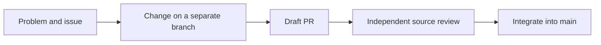

<p align="center">
  
</p>

# Repository strategy and contributor workflow

[한국어](CONTRIBUTOR-WORKFLOW.ko.md) · [Contributing](../../CONTRIBUTING.md)

From a problem to a reviewed change, with evidence and a clear handoff.

| What brings you here? | Start here |
|---|---|
| **First contribution** | [Documentation · fork · first PR](#1-make-a-first-contribution) |
| **Develop with AI** | [Session setup · responsibility · execution boundaries](#2-start-an-ai-development-session) |
| **Team work** | [Issue · Goal · Task · Board](#3-coordinate-the-work) |
| **Verify a change** | [CI](#4-validate-and-request-ci) · [review and integration](#5-review-and-integrate) · [evidence and resume](#6-submit-evidence-and-resume-later) |

> [!NOTE]
> The [constitution](../constitution.xml), especially `execution_protocol`, owns
> the development contract. This guide explains how to apply it; workflow YAML
> and scripts show what is currently enforced.



## Repository strategy

- Work in stacked PRs. The bottom PR targets `main`; each later PR targets the
  preceding branch. Give each PR one concrete outcome and land the stack bottom first.
- Keep concurrent changes in separate worktrees. Task claims coordinate who is
  doing the work; they do not lock files or authorize editing another checkout.
- For GitHub Native Stacks, inspect REST `stack` metadata and follow [Native GitHub Stacks](NATIVE-GITHUB-STACKS.md). Merging a selected PR includes its open downstack PRs; a non-main direct base is not a parent-merge blocker. Review the whole included scope.
- Document the feature where readers look for it. README introduces the product,
  CONTRIBUTING starts development, manuals explain use, specs define interfaces,
  and RFCs record design proposals. Source and measured behavior support claims.
- Keep instructions close to their authority. `AGENTS.md` is a thin entrypoint;
  the constitution owns coding-agent rules. Runtime prompts are separate files.
- A reviewable change includes its scope, effects, evidence and remaining limits.
  A passing compile, an installed binary and observed behavior prove different things.

## 1. Make a first contribution

Start at [CONTRIBUTING](../../CONTRIBUTING.md). For a documentation change, you do
not need the OCaml toolchain. Read the relevant source and linked manual before
editing a factual claim. For code, use the source prerequisites in
[README](../../README.md#from-source).

### Check the problem and existing work

Choose an existing issue or write down the problem, expected result and how it
will be checked. Search issues, open/closed PRs and current source before starting:

```bash
gh issue list --repo jeong-sik/masc --state all --search "your topic"
gh pr list --repo jeong-sik/masc --state all --search "your topic"
rg "relevant_symbol" lib bin dashboard config docs
```

These commands require GitHub CLI authentication and ripgrep. GitHub's issue/PR
search and your editor's search work too. For a small fix, describe the reproduction
in the linked issue. Discuss a new public contract or broad architecture change
there before implementing it. If a PR already solves the problem, help review it.

### Prepare a branch

With repository write access, use your existing clone:

```bash
git fetch origin main
git worktree add -b docs/your-topic ../masc-your-topic origin/main
cd ../masc-your-topic
```

Without write access, create a fork on GitHub first. Replace `YOUR-LOGIN` with your
GitHub account; the following starts from a new clone:

```bash
git clone https://github.com/YOUR-LOGIN/masc.git
cd masc
git remote add upstream https://github.com/jeong-sik/masc.git
git fetch upstream main
git worktree add -b docs/your-topic ../masc-your-topic upstream/main
cd ../masc-your-topic
```

Use `git remote -v` to check an existing clone instead of adding a duplicate remote.
Choose an unused directory. Keep runtime tests under a separate base path and
use a free port; the checkout and the workspace containing `.masc` are different.

### Your first documentation PR

For a first documentation patch, edit one factual claim and its translation where
present, check claims and changed links against source, and use `git diff --check`.
Commit it, then `git push -u origin docs/your-topic`. Open a draft PR
to `jeong-sik/masc:main` using the template. Add `changelog.d/<PR number>.md` as
[CONTRIBUTING](../../CONTRIBUTING.md#pull-requests) describes, then push it before
marking ready. A useful summary explains the incorrect instruction, the correction,
and what was checked. Section 4 explains CI; maintainers handle fork integration.

### Find the source before editing

| Change | Read first | Source / verification entrypoints |
|---|---|---|
| Product documentation | [README](../../README.md), linked manual | `docs/`, source for changed claims and links |
| Keeper behavior or instructions | [Keeper manual](../KEEPER-USER-MANUAL.md), constitution | `lib/keeper/`, `config/prompts/keeper.md`, `test/` |
| Goal, Task, Board or completion | Constitution's domain rules | `lib/workspace/`, `config/tools/`, `test/` |
| Provider or lane behavior | Relevant interfaces and configuration | `lib/runtime/`, `lib/runtime_model/`, `test/` |
| TUI or browser UI | Existing interaction and payload contracts | `bin/masc_tui*.ml`, `lib/tui_decode.ml`, `dashboard/`, `test/` |
| CI or development policy | Constitution's execution protocol | `.github/workflows/`, `scripts/ci/`, `scripts/review/` |

This is a starting map, not a list of all affected files. Follow callers and tests,
and read any applicable scoped instructions before changing their area. Contract
changes and Keeper runtime prompt changes need separate reasoning and evidence.

## 2. Start an AI development session

Read [AGENTS.md](../../AGENTS.md) and the complete
[constitution](../constitution.xml) before planning or changing MASC. Then:

1. Confirm the checkout, branch, clean/dirty state and current main. Preserve
   existing work; use an isolated worktree when the shared checkout is in use.
2. Record the requested outcome, scope and required evidence. Read the actual
   source, current review comments and failing logs instead of relying on summaries.
3. Implement a bounded change. External coding sessions do not run local Dune
   builds. Ordinary stacks use source review. Request a development check only
   for a concrete need and keep its scope small; full CI belongs to the
   Release/Tag boundary. Do not watch or poll CI.
4. When moving to the next work unit, assign an adversarial review agent to the
   previous one. Review the findings yourself and address them. A subagent review
   is not automatically a cross-model review or a GitHub approval.
5. Leave the next concrete action and evidence when handing off.

AI-assisted contributions are welcome. The submitting author remains responsible
for understanding the diff, protecting credentials and private runtime data,
addressing reviews, and accurately describing the evidence. Identify what was
checked, by whom or by which agent, and what remains unverified. Generated output
and self-review alone do not establish runtime behavior or independent approval.

**Commit boundary.** If `.githooks` is active, code commits run a local Dune
build in pre-commit. An external coding session following the no-local-build
rule uses `git -c core.hooksPath=/dev/null commit -m "your message"` for that
commit. This disables hooks for that command only, not future pushes: keep the
pre-push trace-leak guard active and obtain independent source review. Do not
change the clone's persistent hook configuration to avoid a build.

Keeper lanes may build/test locally if their toolchain exists. Those results do
not replace independent source review or full Release/Tag CI. A session's
permissions, an MCP bearer identity and a Keeper's name are separate identities.
Do not reuse a shared Task owner to release another session's work.

## 3. Coordinate the work

GitHub Issues/PRs track the public change. MASC adds shared intent and execution:

| Record | Use |
|---|---|
| Issue | Problem, expected outcome, reproducible evidence and discussion |
| Goal | Shared outcome with a metric, observable measurement source and target |
| Task | Bounded implementation or review work, owner and completion contract |
| Board | Decisions, questions, dependencies and updates visible to the team |
| PR | Actual diff, validation, review and integration into main |

MASC participation is optional for an outside contributor. A public issue and PR
must be understandable without access to an operator's private workspace.
For goal-linked MASC work, create the Goal before its Tasks and pass `goal_id`
explicitly. Standalone Tasks are valid and can be linked to a Goal later.
Use `claim`, then `start` before implementation. If another owner holds work,
discuss or choose another Task. For your `Claimed` or `InProgress` Task, a handoff
uses `release` with a summary, evidence and next step. `AwaitingVerification`
cannot be released; leave its verification pending and record the handoff. If
abandoning a Task you own, `cancel` ends it with a reason, including while awaiting
verification. Cancellation does not count as completion.

Use the live session's tool schemas: `masc_goal_upsert`, `masc_add_task`,
`masc_transition` and `masc_board_post`. Tool schemas change; this guide does not
provide a second payload schema. Include IDs in public/private updates so readers
can follow the relationship. Treat a Board plan as a plan until it has evidence.

## 4. Validate and request CI

Choose evidence from the changed behavior and its concrete risks. For documentation,
read the source behind changed claims and check file links, anchors and commands.
`git diff --check` identifies whitespace errors; it does not establish behavior.
Human contributors can run focused local checks; external coding sessions follow
section 2. Prose wording, historical counts and source-style inventories are not
approval gates.

Open a draft using [scripts/pr-open.sh](../../scripts/pr-open.sh) or GitHub's fork
PR flow. Fill the [PR template](../../.github/pull_request_template.md), including
an issue link. Mark the PR ready when its diff and evidence are ready for review.
PR creation, pushes and ready transitions do not automatically start CI.

[pr-check.yml](../../.github/workflows/pr-check.yml) provides explicit source,
configuration and credential checks.
[ci.yml](../../.github/workflows/ci.yml) builds only Core for the bottom PR,
with a focused build. Request these only when needed. The constitution's
"about two minutes" describes the intended scale, not a timeout or a pass/fail
threshold. A cold dependency cache can take longer; only an actual successful
completion is build evidence.

There is no PR, general push or scheduled CI. At `release/vX.Y.Z`, explicitly
freeze the included scope under [Release freeze](RELEASE-FREEZE.md); admit only
reviewed release-blocking repairs afterwards. Main updates belong to the next
version and do not require merging main into this candidate. Then explicitly
request [release-candidate.yml](../../.github/workflows/release-candidate.yml)
for full builds, type checks, behavior tests and installation verification on
that head. Tag publication also requires full checks and tests. See the
[CI and review workflow](../CI-REVIEW-WORKFLOW.md) for the authoritative procedure.

Dispatch requires repository permission; fork contributors can ask a maintainer
for an appropriate run. Continue useful work instead of watching or polling CI.
At a work boundary, read actual results and distinguish failures in the diff,
base or environment. Keep unrelated repairs in their own stack.

Choose focused checks by tracing changed files through the changed interface and
its direct consumers. Record `file → changed interface → direct consumer → actual
verification target → command and result`. A passing check that does not exercise
that consumer is not a substitute. This helps risk-based check selection; it does
not add a Core build or full CI admission requirement to every ordinary PR.

## 5. Review and integrate

Review the contract and current-head diff from independent function, logic and
code-cleanliness perspectives. Approve when no P0/P1/P2 issue remains and collect
P3 findings for later. Ordinary review needs no CI run. State unverified behavior;
do not claim checks that were not run. Address each finding with a change or a
source-backed explanation and resolve a thread only when its concern is handled.
Update the PR description when scope, evidence or remaining risks change.

A push creates a new head, so earlier review does not certify new changes.
Reviewers clear their own REQUEST_CHANGES when the corrected code resolves their
findings. A green CI run alone does not resolve a finding.

The ordinary source-review verdict uses actual values:

```text
verdict: PASS|FAIL head: <40-character-current-SHA> by: <Keeper-name>
```

Use [approve-guard.sh](../../scripts/review/approve-guard.sh) for APPROVE; its
`--check` mode checks review eligibility.

Capture the base SHA and complete diff identity **before source review** and
keep them with the reviewed head and evidence. Run these commands from the repository
checkout with authenticated `gh`, Git, Python 3 and `jq` available. The diff helper
fetches missing exact objects using `gh` credentials without interactive prompts.

```bash
# Set repo and pr to the pull request being reviewed.
snapshot=$(gh api "repos/$repo/pulls/$pr")
head=$(printf '%s' "$snapshot" | jq -r '.head.sha')
review_base=$(printf '%s' "$snapshot" | jq -r '.base.sha')
review_diff=$(python3 scripts/review/review-diff.py \
  --repo "$repo" --base "$review_base" --head "$head")
# Read the complete diff and its source context, then write review-body.md.
scripts/review/approve-guard.sh --repo "$repo" --pr "$pr" --head "$head" \
  --review-base "$review_base" --review-diff "$review_diff" --body review-body.md
```

Publishing requires `--body`, `--review-base` and `--review-diff`. The guard rejects
scope changes during admission. If the change differs, review it again and capture
new evidence; do not refresh the digest merely to approve unreviewed changes.

An author or a session that pushed the PR cannot independently
approve it. Release verdicts additionally cite `run: <full-CI-run-id>` for
completed full verification of the same head. These are formats, not decisions;
replace placeholders and alternatives with actual values.

Read current reviews and comments again before integration. Outstanding blocking
reviews and later FAIL/HOLD decisions prevent integration. Land stacks bottom
first and review changes to both base and head before landing. Use
[merge-guard](../../scripts/review/merge-guard.sh) and the current
[CI and review workflow](../CI-REVIEW-WORKFLOW.md) for admission. Ordinary stacks
use source review; release heads require completed full CI. Fork contributors
hand integration to a maintainer. Source approval does not claim unobserved
build success or runtime behavior.

Verify the merged commit and PR state before cleanup. Remove only the finished
worktree and branch after confirming they contain no unsubmitted work. Never push
a follow-up to a branch whose PR has merged; use a new branch and PR.

Reuse review only within its recorded head, base, complete diff identity and scope.
Unchanged source files do not establish unchanged behavior when the base's
interfaces or consumers have changed. Keep ordinary and Release assessments under
the existing policy and do not extend execution evidence to unobserved scope.

## 6. Submit evidence and resume later

For a MASC Task, use `submit_for_verification` with a handoff summary and evidence;
`done` is not a self-service completion action. Follow the live tool schema and
[evidence capture contract](../../lib/workspace/workspace_verification_store.mli)
for accepted references. A path/commit/PR mentioned in prose is not a snapshotted artifact.
Keep volatile test output as a bounded artifact, and provide a public URL or a
frozen Board/Fusion reference when the verifier needs to inspect it.

A Goal's measurement source must be something its completion judge can read.
The target must be comparable with that measurement. Finished Tasks or posts
announcing completion do not prove the Goal. Request completion with evidence;
verification and final human confirmation are separate stages.

A handoff records the Goal/Task/Issue/PR IDs, branch/worktree, current SHA, checks
already run, unresolved findings, blockers and next action. On resume, reread live
state before repeating mutations. Interrupted commands may already have applied.
Restore progress from saved records instead of changing runtime-owned files by hand.

When a contract conflicts with current policy, record the original contract,
policy clause, prior verdict and authorized change decision together before
deciding to retain, amend or retire it. Until that decision, do not submit evidence
for the new policy as satisfaction of the old contract.

Record execution completion, receipt acknowledgement and the current ledger
summary update separately, with timestamps and original evidence references.
Mark absent records unverified. Keep historical failures and decisions, but list
only remaining work as current pending state. On resume, read the actual Task, PR
and run before relying on a schedule or handoff. Measure ready-to-review,
fix-to-re-review, candidate-freeze-to-verification and completion-to-ledger-update
separately; before/after comparisons use the same definitions, sample scope and
count of unfinished samples.

## Maintaining these instructions

When a workflow, script, tool contract or runtime boundary changes, update the
relevant procedure in the same change. Keep command examples executable and
identify their prerequisites. Review the translated guide with the English guide.
Use the constitution to settle policy conflicts and source to settle implementation
claims; record an implementation gap rather than documenting an imagined guarantee.
