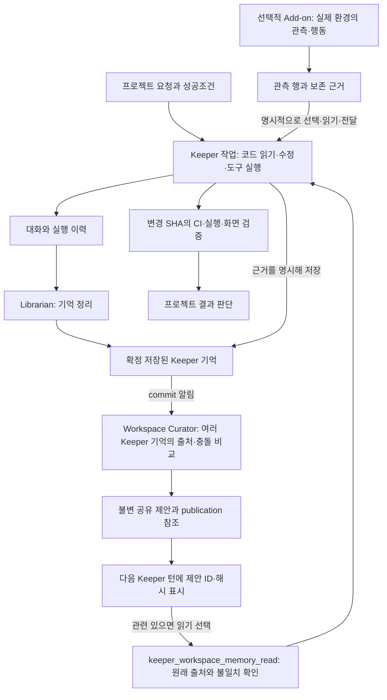

# 실제 프로젝트에서 Keeper, Curator, Add-ons 사용하기

프로젝트 작업의 중심은 Keeper에게 맡긴 구체적인 변경과 검증이다. Lane을 많이 켜는
것이 성공조건은 아니다. 예를 들어 "이 저장소에서 펼친 도구 결과가 새로고침 중 사라지는
문제를 고치고, 변경 SHA의 CI와 실제 터미널 조작 결과를 남겨라"처럼 결과와 증거를 함께 정한다.

Librarian은 개별 Keeper의 기억을 정리한다. Workspace Curator는 이미 저장된 여러 Keeper의
기억에서 공유 주장·충돌·제외 사유를 만든다. 현재 입력은 이 workspace의 기억 전체이며
프로젝트별로 자동 격리하거나 현재 저장소 내용으로 사실을 재검증하지 않는다.
공유 제안은 `model_proposed`이고 의미 검증은 수행되지 않았다. 다음 작업에서 출처를
확인하고 현재 코드·테스트 결과와 대조해야 한다.

## TUI에서 확인할 위치

| 질문 | 조작 |
|---|---|
| 이 Keeper는 무엇을 알고 이 답을 했나? | Keeper 채팅에서 Ctrl-X. `1` 구성, `2` 실제 요청, `3` 입력 근거 매핑. |
| Curator가 실제로 돌았나? | `:` → Lanes → Workspace Curator → Enter → 실행 선택 → Enter. 입력·출력·실패를 확인한다. |
| Curator는 무슨 모델을 쓰나? | Lanes에서 해당 행의 `e` 설정, `a` 실행 후보 추가. |
| Add-on이 어떤 값을 내놓나? | `:` → Lane Add-ons. 기본 화면의 관측값, `o` 새 관측. |
| Add-on으로 어떻게 행동하나? | 인스턴스 선택 → `a` → 행동 선택 → Enter. 결과 자동 조회, `t` 수동 조회. |
| Add-on 연결은 어떻게 이어지나? | Add-ons에서 `f`. 현재 선언의 upstream 의존성과 제공 output을 확인한다. |
| 원래 스키마·ID·근거가 필요한가? | Add-ons의 `D`. |

`f`의 프로젝트 흐름 부분은 아키텍처 안내이며 현재 실행 성공을 의미하지 않는다.
아래 Add-on 연결은 현재 서버 snapshot의 선언과 binding에서 읽는다.
Config Prompts의 `i`는 현재 Librarian 입력 전용이므로 Curator 입력은 Lanes에서 확인한다.

## 한 프로젝트를 시작하는 순서

1. Keeper에게 저장소, 변경 범위, 기대 동작, 실패 재현 절차를 전달한다.
2. 채팅 Ctrl-X에서 필요한 코드·이전 결정·작업 맥락이 실제 입력에 들어갔는지 확인한다.
3. 재사용할 발견은 경로·변경 SHA·검증 방법과 함께 Keeper 기억에 저장하도록 요청한다.
4. 다른 Keeper가 반대되는 결과를 발견했다면 출처와 조건을 함께 남긴다. Curator가
   두 주장을 하나로 단정하지 않고 충돌 또는 조건 차이로 남겼는지 실행 결과를 확인한다.
5. 후속 작업에는 "공유 제안 중 이 변경에 관련된 것을 원래 출처까지 읽고,
   현재 코드와 검증 결과에 대조하라"고 요청한다. 제안 게시만으로 Keeper가 깨어나거나
   도구를 호출한 것은 아니다.
6. 최종 결과는 CI와 실제 실행으로 판단한다. 기억·제안·Add-on 관측은 판단 근거다.

## Add-on이 필요한 경우

DOS 카운터는 조작 학습용이며 프로젝트 생산성의 증거가 아니다. Output Statistics도
공급된 관측 행을 세는 패키지이며 완료 작업 수나 생산성을 측정하지 않는다.

실제 웹 배포 프로젝트에서는 `web-project`가 기대 배포 revision, 실제 브라우저의
같은 문서에서 읽은 revision, 기능 probe를 비교할 수 있다. 정확한 Browser 대상과
`masc-revision`/`masc-revision-namespace` 문서 표식이 필요하다. 이 정보가 없는 사이트는
unknown이며, 코드 SHA나 HTTP 상태만으로 브라우저 성공을 대신하지 않는다.
현재 프로젝트에 필요한 관측 source가 없는 경우 그 source 연결부터 구현해야 한다.

성공조건 예시는 "이전 결정 재설명 없이 후속 Keeper가 올바른 출처를 찾았는가",
"배포 대상 착오를 실행 전에 발견했는가", "행동 요청에 ID/JSON 수작업 없이 실제
효과와 근거를 확인했는가"다. 각각 실제 작업 기록으로 측정하며 서로의 증명을 대체하지 않는다.
