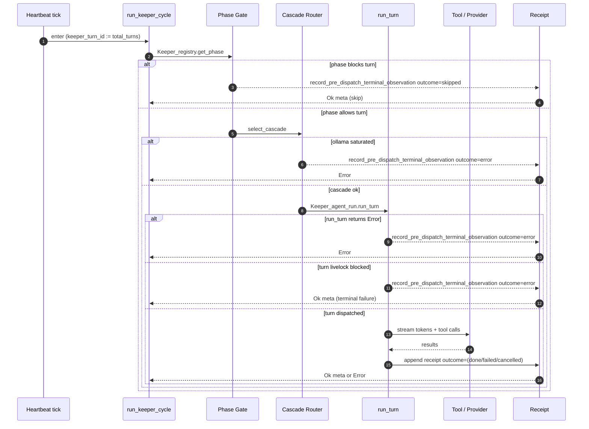
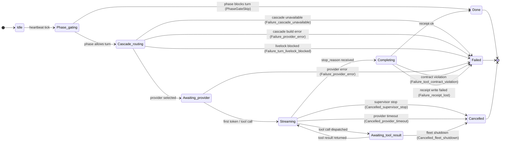

# Keeper Turn Lifecycle

> Foundation diagram for the bloodflow restoration plan (Step 8).
> Mirrors the actual code path through `lib/keeper/keeper_unified_turn.ml`
> and the `record_pre_dispatch_terminal_observation` receipt path
> after Step 0a wired `keeper_turn_id` into every silent skip site.

## Sequence

## State machine

The typed FSM ADT in `lib/keeper/keeper_turn_fsm.mli` (Step 4a, #11184)
fixes the vocabulary; the diagram below mirrors the variants verbatim.
Step 4b will adopt these transitions at the implicit edges currently
spread across `keeper_unified_turn.ml` and `keeper_agent_run.ml`.

## State table

| State | Entered when | Receipt outcome | turn_id carried |
|---|---|---|---|
| Phase_gating (skip) | phase non-executable | `skipped` | ✓ (#11154) |
| Cascade_routing | provider selection in flight | (transient) | ✓ |
| Ollama_saturated | local provider over budget | `error` | ✓ (#11154) |
| Cascade_error | run_turn returns Error early | `error` | ✓ (#11154) |
| Turn_livelock | livelock guard caught loop | `error` | ✓ (#11154) |
| Streaming | provider yielding tokens | (active) | ✓ |
| Awaiting_tool_result | tool call in flight | (active) | ✓ |
| Done | response_text present + receipt ok | `done` | ✓ |
| Failed | contract violation or stop_reason | `failed` | ✓ |
| Cancelled | supervisor stop / fleet shutdown | (Step 5 wires explicit) | partial |

## Silent fail points (closed by Step 0a)

Pre Step 0a, four pre-dispatch paths emitted INFO logs without a `turn_id`
correlator, so a turn that died before dispatch left no row anyone could
look up by id. The four paths and the lines that now carry `keeper_turn_id`:

1. Phase gate skip — `keeper_unified_turn.ml:1062` (#11154)
2. Ollama saturated — `keeper_unified_turn.ml:1162` (#11154)
3. Cascade error — `keeper_unified_turn.ml:1242` (#11154)
4. Turn livelock blocked — `keeper_unified_turn.ml:1276` (#11154)

PR #11154 added `?keeper_turn_id` to `record_pre_dispatch_terminal_observation`
and threaded the value through all four call sites.  PR #11156 widened the
`Log.Make` functor surface so every `Log.<Module>.<level>` call accepts
`?keeper_name`/`?turn_id`; PR #11159 adopted the new arguments at the
silent-skip log lines so the structured log entry carries the same
correlator the receipt does.

## Tooling

- **`bin/masc-trace <base-path> <keeper> <turn_id>`** (#11168) — reads
  `~/.masc/keepers/<keeper>/execution-receipts/*.jsonl` and prints every
  row that matches the turn id.  First source the receipt path already
  populates; subsequent stacks widen to `tool_calls/` and `system_log_*`.

- **`Auth_resolve.emit_resolution_trace`** (#11161, #11162) — every
  bearer-token resolution attempt at the runtime-MCP boundary now emits
  a structured outcome before the cascade fires HTTP.  401-after-silent-
  fall-back is no longer the first signal an operator sees.

- **`Cascade_catalog_validator.codex_with_bound_actor_only_issue`** (#11164)
  — boot-time warn for cascades that include `codex_cli` without a
  bound-actor-tolerant fallback.  Surfaces the misconfiguration once
  instead of paying per-turn `no_tool_capable_provider` events.

- **`masc_keeper_turn_fsm_transitions_total`** (#11326) — Prometheus
  counter bumped inside `Keeper_turn_fsm.emit_transition`.  Labels
  `from`/`to`/`keeper` carry the typed ADT vocabulary (e.g.
  `to=failed:turn_livelock_blocked`) so PromQL can chart turn-state
  distribution per keeper without ETL on the log line.  Distinct from
  `masc_keeper_fsm_edge_transitions_total`, which encodes the cross
  sub-FSM edges (`ksm_to_kcl_routing`, etc.) used by
  `docs/keeper-fsm-graph.dot`.

## Open work

| Plan step | Adds | Status |
|---|---|---|
| Step 4a | `Keeper_turn_fsm` ADT (state / cancel_reason / failure_reason) | merged (#11184) |
| Step 4b | `emit_transition` wired at the 4 pre-dispatch silent-skip sites | merged (#11269) |
| Step 4c | `emit_transition` at run_keeper_cycle entry + success exit (`Idle → Phase_gating`, `Completing → Done`) | merged (#11288) |
| Step 4d | `emit_transition` `Streaming → Completing` on stop_reason | merged (#11308) |
| Step 4e | Prometheus counter `masc_keeper_turn_fsm_transitions_total` for typed turn-state aggregation | merged (#11326) |
| Step 4f | `Failure_turn_livelock_blocked` variant + cascade-build redirect to `Failure_provider_error` | merged (#11340) |
| Step 4g | `emit_transition` `Phase_gating → Cascade_routing → Awaiting_provider` middle of dispatch lane | merged (#11347) |
| Step 4 (run_turn side) | `Awaiting_provider → Streaming` + `Streaming ⇄ Awaiting_tool_result` from inside `keeper_agent_run.run_turn` | pending |
| Step 5 | Replace `safe_emit_turn_end` catch-all with `Switch.on_release` so `Cancelled_*` reaches the FSM | pending (RISKY) |
| Step 7 | TLA+ spec mirroring this diagram | merged (#11190, #11198, #11199, #11225) |
| Step 6b-1 | `Keeper_contract_classifier.classify_actionable_signal` helper (additive) | merged (#11217) |
| Step 6b-2 | Replace `String_util.contains_substring_ci` heuristic at `keeper_agent_run.ml:2285-2298` with the typed helper (RISKY — turn-accept distribution change, needs dual-emit window) | pending |

## References

- `lib/keeper/keeper_unified_turn.ml` — turn entry, pre-dispatch gates, receipts
- `lib/keeper/keeper_agent_run.ml` — `run_turn` body, completion contract
- `lib/keeper/keeper_execution_receipt.ml` — receipt I/O
- `lib/keeper/keeper_contract_classifier.ml` — typed contract status (#11172)
- `lib/auth_resolve.ml` — typed token resolution (#11161)
- `bin/masc_trace.ml` — turn timeline CLI (#11168)
- `planning/claude-plans/me-workspace-yousleepwhen-masc-mcp-hashed-pretzel.md`
  — Phase 1-4 of the bloodflow restoration plan
