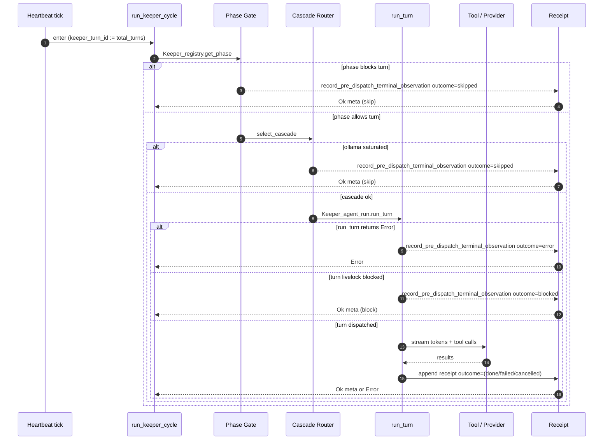

# Keeper Turn Lifecycle

> Foundation diagram for the bloodflow restoration plan (Step 8).
> Mirrors the actual code path through `lib/keeper/keeper_unified_turn.ml`
> and the `record_pre_dispatch_terminal_observation` receipt path
> after Step 0a wired `keeper_turn_id` into every silent skip site.

## Sequence

## State table

| State | Entered when | Receipt outcome | turn_id carried |
|---|---|---|---|
| Phase_gating (skip) | phase non-executable | `skipped` | ✓ (#11154) |
| Cascade_routing | provider selection in flight | (transient) | ✓ |
| Ollama_saturated (skip) | local provider over budget | `skipped` | ✓ (#11154) |
| Cascade_error | run_turn returns Error early | `error` | ✓ (#11154) |
| Turn_livelock (block) | livelock guard caught loop | `blocked` | ✓ (#11154) |
| Streaming | provider yielding tokens | (active) | ✓ |
| Awaiting_tool_result | tool call in flight | (active) | ✓ |
| Done | response_text present + receipt ok | `done` | ✓ |
| Failed | contract violation or stop_reason | `failed` | ✓ |
| Cancelled | supervisor stop / fleet shutdown | (Step 5 wires explicit) | partial |

## Silent fail points (closed by Step 0a)

Pre Step 0a, four pre-dispatch paths emitted INFO logs without a `turn_id`
correlator, so a turn that died before dispatch left no row anyone could
look up by id. The four paths and the lines that now carry `keeper_turn_id`:

1. Phase gate skip — `keeper_unified_turn.ml:1062` (#11154)
2. Ollama saturated — `keeper_unified_turn.ml:1162` (#11154)
3. Cascade error — `keeper_unified_turn.ml:1242` (#11154)
4. Turn livelock blocked — `keeper_unified_turn.ml:1276` (#11154)

PR #11154 added `?keeper_turn_id` to `record_pre_dispatch_terminal_observation`
and threaded the value through all four call sites.  PR #11156 widened the
`Log.Make` functor surface so every `Log.<Module>.<level>` call accepts
`?keeper_name`/`?turn_id`; PR #11159 adopted the new arguments at the
silent-skip log lines so the structured log entry carries the same
correlator the receipt does.

## Tooling

- **`bin/masc-trace <base-path> <keeper> <turn_id>`** (#11168) — reads
  `~/.masc/keepers/<keeper>/execution-receipts/*.jsonl` and prints every
  row that matches the turn id.  First source the receipt path already
  populates; subsequent stacks widen to `tool_calls/` and `system_log_*`.

- **`Auth_resolve.emit_resolution_trace`** (#11161, #11162) — every
  bearer-token resolution attempt at the runtime-MCP boundary now emits
  a structured outcome before the cascade fires HTTP.  401-after-silent-
  fall-back is no longer the first signal an operator sees.

- **`Cascade_catalog_validator.codex_with_bound_actor_only_issue`** (#11164)
  — boot-time warn for cascades that include `codex_cli` without a
  bound-actor-tolerant fallback.  Surfaces the misconfiguration once
  instead of paying per-turn `no_tool_capable_provider` events.

## Open work

| Plan step | Adds | Status |
|---|---|---|
| Step 4 | Explicit `Keeper_turn_fsm.transition` at every edge | pending |
| Step 5 | `Cancelled` reason variant + `Switch.on_release` cleanup | pending |
| Step 7 | TLA+ spec mirroring this diagram | pending |
| Step 6b | Replace `String_util.contains_substring_ci` heuristic with `Keeper_contract_classifier` (#11172 added types, caller rewrite pending) | partial |

## References

- `lib/keeper/keeper_unified_turn.ml` — turn entry, pre-dispatch gates, receipts
- `lib/keeper/keeper_agent_run.ml` — `run_turn` body, completion contract
- `lib/keeper/keeper_execution_receipt.ml` — receipt I/O
- `lib/keeper/keeper_contract_classifier.ml` — typed contract status (#11172)
- `lib/auth_resolve.ml` — typed token resolution (#11161)
- `bin/masc_trace.ml` — turn timeline CLI (#11168)
- `planning/claude-plans/me-workspace-yousleepwhen-masc-mcp-hashed-pretzel.md`
  — Phase 1-4 of the bloodflow restoration plan
