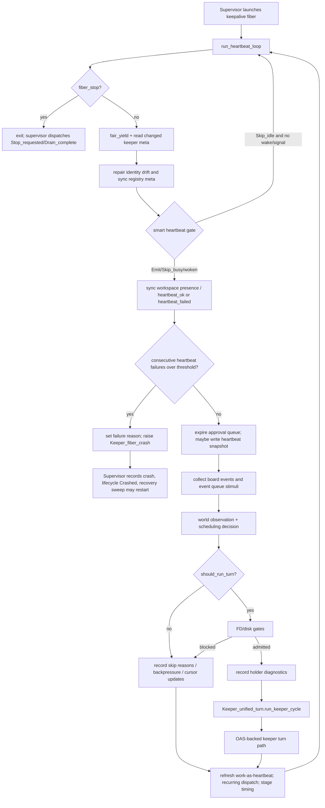
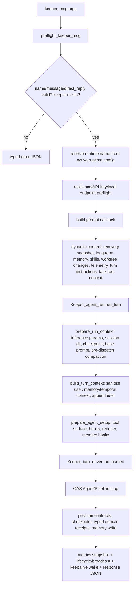
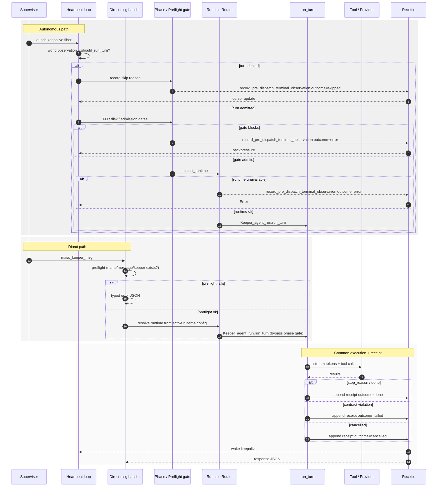
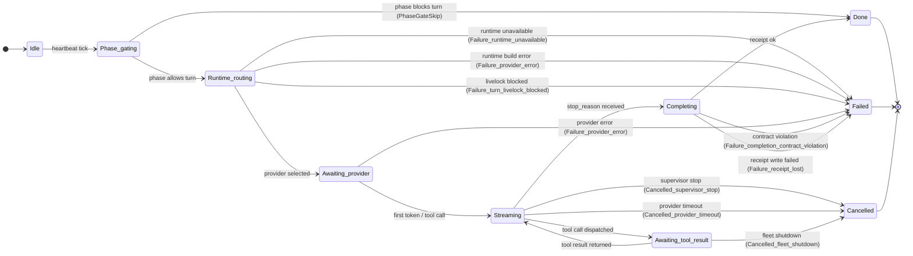

# Keeper Turn Lifecycle

> **Superseded by [`docs/spec/04-turn-lifecycle.md`](./spec/04-turn-lifecycle.md).**
> This file now serves as historical context, tooling notes, and the open-work
> table for the bloodflow restoration plan. For the authoritative turn lifecycle
> specification, see `docs/spec/04-turn-lifecycle.md`.
>
> Foundation diagram for the bloodflow restoration plan (Step 8).
> Mirrors the actual code path through `lib/keeper/keeper_unified_turn.ml`
> and the `record_pre_dispatch_terminal_observation` receipt path
> after Step 0a wired `keeper_turn_id` into every silent skip site.

## Autonomous cycle sequence

This is the heartbeat-scheduled path. The supervisor launches a keepalive fiber that loops until `fiber_stop` is set.

## Keepalive autonomous cycle flow

The scheduling loop that sits above the lifecycle phase FSM. Presence, snapshot, event intake, world observation, admission, and dispatch run in order until the fiber is stopped.

## Direct keeper message turn

This path bypasses the heartbeat scheduling loop entirely. `masc_keeper_msg` family calls enter through `Keeper_turn.handle_keeper_msg`, run preflight, and then call `Keeper_agent_run.run_turn` directly. The same OAS/runtime/tool/context engine is used internally.

## Tool Surface Vocabulary

The Keeper no longer carries a per-turn tool surface as an observable contract.
The SDK receives a local schema filter for execution, while operator evidence
comes from requested, reported, observed, and materialized tool-use records.

## Unified turn swimlane

The two admission paths converge on the same execution engine. The diagram below places supervisor, heartbeat, direct message, and the shared `run_turn` + receipt path in a single sequence so the boundary between scheduling and dispatch is explicit.

**Invariant**: Both paths set `oas_dispatch_mode = Single_provider_agent_run` on the keeper-managed runtime engine. The keeper hot path never delegates provider fallback to an OAS internal runtime. This is enforced at runtime by `Keeper_runtime_engine.guard_keeper_hot_path` and pinned in `test/test_keeper_runtime_engine_guard.ml`.

## Autonomous vs Direct comparison

| Dimension | Autonomous cycle | Direct keeper message turn |
|---|---|---|
| Trigger | Heartbeat tick / scheduling decision | `masc_keeper_msg` direct request |
| Scheduling | `run_heartbeat_loop` admits turn after world observation | Immediate preflight then dispatch |
| Entry point | `Keeper_unified_turn.run_keeper_cycle` | `Keeper_turn.handle_keeper_msg` |
| Phase gate | Yes — skipped if phase blocks turn | No — direct turn is phase-agnostic but still checks keeper existence |
| Runtime selection | Same `runtime.toml` based resolution | Same `runtime.toml` based resolution |
| OAS dispatch mode | `Single_provider_agent_run` (enforced) | `Single_provider_agent_run` (enforced) |
| Tool surface | Same `compute_tool_surface` + OAS hooks | Same `compute_tool_surface` + OAS hooks |
| Receipt | Same `Keeper_execution_receipt` append | Same `Keeper_execution_receipt` append |
| Lifecycle wake | Returns into keepalive loop | Wakes keepalive so next cycle picks up state change |

Both paths share `Keeper_agent_run.run_turn` as the common execution engine. The difference is strictly in admission: heartbeat-scheduled vs request-triggered.

## Task / Execute / PR Visibility Audit

For the Keeper-eye view of a full work turn - task claim/start, repo/worktree
`Execute`, branch/commit/PR, task evidence submission, receipt, and memory
writeback - see `docs/audit/2026-06-04-keeper-task-execution-visibility-audit.md`.

That audit also tracks the current missing teeth in the contract:
`tool_access` naming versus execution semantics, active goal scope, verification
evidence not being automatic from `gh pr create`, post-Execute git delta
visibility, first-class worktree selection observation, and per-turn tool
disclosure detail.

## State machine

The typed FSM ADT in `lib/keeper/keeper_turn_fsm.mli` (Step 4a, #11184)
fixes the vocabulary; the diagram below mirrors the variants verbatim.
Step 4b will adopt these transitions at the implicit edges currently
spread across `keeper_unified_turn.ml` and `keeper_agent_run.ml`.

## State table

| State | Entered when | Receipt outcome | turn_id carried |
|---|---|---|---|
| Phase_gating (skip) | phase non-executable | `skipped` | ✓ (#11154) |
| Runtime_routing | provider selection in flight | (transient) | ✓ |
| Ollama_saturated | local provider over budget | `error` | ✓ (#11154) |
| Runtime_error | run_turn returns Error early | `error` | ✓ (#11154) |
| Turn_livelock | livelock guard caught loop | `error` | ✓ (#11154) |
| Streaming | provider yielding tokens | (active) | ✓ |
| Awaiting_tool_result | tool call in flight | (active) | ✓ |
| Done | response_text present + receipt ok | `done` | ✓ |
| Failed | contract violation or stop_reason | `failed` | ✓ |
| Cancelled | supervisor stop / fleet shutdown | (Step 5 wires explicit) | partial |

## Silent fail points (closed by Step 0a)

Pre Step 0a, four pre-dispatch paths emitted INFO logs without a `turn_id`
correlator, so a turn that died before dispatch left no row anyone could
look up by id. The four paths and the lines that now carry `keeper_turn_id`:

1. Phase gate skip — `keeper_unified_turn.ml:1062` (#11154)
2. Ollama saturated — `keeper_unified_turn.ml:1162` (#11154)
3. Runtime error — `keeper_unified_turn.ml:1242` (#11154)
4. Turn livelock blocked — `keeper_unified_turn.ml:1276` (#11154)

PR #11154 added `?keeper_turn_id` to `record_pre_dispatch_terminal_observation`
and threaded the value through all four call sites.  PR #11156 widened the
`Log.Make` functor surface so every `Log.<Module>.<level>` call accepts
`?keeper_name`/`?turn_id`; PR #11159 adopted the new arguments at the
silent-skip log lines so the structured log entry carries the same
correlator the receipt does.

## Tooling

- **`bin/masc-trace <base-path> <keeper> <turn_id>`** (#11168) — reads
  `<base-path>/.masc/keepers/<keeper>/execution-receipts/*.jsonl` and prints every
  row that matches the turn id.  First source the receipt path already
  populates; subsequent stacks widen to `tool_calls/` and `system_log_*`.

- **`Auth_resolve.emit_resolution_trace`** (#11161, #11162) — every
  bearer-token resolution attempt at the runtime-MCP boundary now emits
  a structured outcome before the runtime fires HTTP.  401-after-silent-
  fall-back is no longer the first signal an operator sees.

- **runtime validation issue carrier** (#11164)
  — boot-time warn for runtimes that include `cli-tool-a` without a
  bound-actor-tolerant fallback.  Surfaces the misconfiguration once
  instead of paying per-turn `no_tool_capable_provider` events.

- **`masc_keeper_turn_fsm_transitions_total`** (#11326) — OTel metric-store
  counter bumped inside `Keeper_turn_fsm.emit_transition`.  Labels
  `from`/`to`/`keeper` carry the typed ADT vocabulary (e.g.
  `to=failed:turn_livelock_blocked`) so telemetry queries can chart turn-state
  distribution per keeper without ETL on the log line.  Distinct from
  `masc_keeper_fsm_edge_transitions_total`, which encodes the cross
  sub-FSM edges (`ksm_to_kcl_routing`, etc.) used by
  `docs/keeper-fsm-graph.dot`.

## Open work

> OAS hardening checklist #6 — Direct vs autonomous turn docs refresh — completed by adding the Unified turn swimlane and the `oas_dispatch_mode` invariant note.
> Checklist #18 — OAS internal runtime regression guard test — completed in `test/test_keeper_runtime_engine_guard.ml`.

| Plan step | Adds | Status |
|---|---|---|
| Step 4a | `Keeper_turn_fsm` ADT (state / cancel_reason / failure_reason) | merged (#11184) |
| Step 4b | `emit_transition` wired at the 4 pre-dispatch silent-skip sites | merged (#11269) |
| Step 4c | `emit_transition` at run_keeper_cycle entry + success exit (`Idle → Phase_gating`, `Completing → Done`) | merged (#11288) |
| Step 4d | `emit_transition` `Streaming → Completing` on stop_reason | merged (#11308) |
| Step 4e | OTel metric-store counter `masc_keeper_turn_fsm_transitions_total` for typed turn-state aggregation | merged (#11326) |
| Step 4f | `Failure_turn_livelock_blocked` variant + runtime-build redirect to `Failure_provider_error` | merged (#11340) |
| Step 4g | `emit_transition` `Phase_gating → Runtime_routing → Awaiting_provider` middle of dispatch lane | merged (#11347) |
| Step 4 (run_turn side) | `Awaiting_provider → Streaming` + `Streaming ⇄ Awaiting_tool_result` from inside `keeper_agent_run.run_turn` | pending |
| Step 5 | Replace `safe_emit_turn_end` catch-all with `Switch.on_release` so `Cancelled_*` reaches the FSM | pending (RISKY) |
| Step 7 | TLA+ spec mirroring this diagram | merged (#11190, #11198, #11199, #11225) |
| Step 6b-1 | `Keeper_contract_classifier.classify_actionable_signal` helper (additive) | merged (#11217) |
| Step 6b-2 | Replace `String_util.contains_substring_ci` heuristic at `keeper_agent_run.ml:2285-2298` with the typed helper (RISKY — turn-accept distribution change, needs dual-emit window) | pending |

## External comparison

MASC sits in a different product category from general-purpose agent SDKs. Keeping the positioning explicit prevents design decisions from drifting toward runner-centric or workspace-centric assumptions that do not fit an operator-governed control plane.

| Product family | Center of gravity | Turn model | Runtime ownership | Memory model | Operator surface |
|---|---|---|---|---|---|
| Agent-LLM-A Agent SDK | Runner / session | `Agent.run` loop with tool callbacks | OAS internal runtime | Session-scoped context + optional memory | Weak — run-level events only |
| Provider-D Agents SDK | Runner / session | `Runner.run` pipeline with handoffs | OAS internal runtime | Thread + vector store | Weak — run-level traces |
| Google ADK | Runner / agent graph | Event-loop with stateful agents | Model routing per agent | Session memory + artifacts | Medium — deployment + evaluation |
| OpenClaw | Workspace / orchestrator | Plan-execute with tool registry | Workspace-level fallback | Long-term memory bank + compression | Strong — workspace governance |
| Hermes | Workspace / skills | Skill-based execution graph | Provider fallback per skill | Context files + skill memory | Medium — provider + skill management |
| **MASC** | **Supervisor / runtime** | Heartbeat-scheduled autonomous cycle + direct `masc_keeper_msg` | **MASC-owned** `Keeper_runtime_engine` selects single-provider OAS runs | Three-layer: OAS checkpoint, MASC receipt/snapshot, memory hooks | **Strong** — registry phase, FSM, runtime manifest, receipt, lens, audit ring |

**Design implication**: When a feature request sounds like "add session memory" or "enable automatic provider fallback", the first question is which layer owns it. Session memory belongs to the OAS checkpoint layer. Automatic provider fallback belongs to the OAS runtime layer. MASC adds value by supervising, governing, and receipting those layers, not by reimplementing them.

## References

- `lib/keeper/keeper_unified_turn.ml` — turn entry, pre-dispatch gates, receipts
- `lib/keeper/keeper_agent_run.ml` — `run_turn` body, completion contract
- `lib/keeper/keeper_execution_receipt.ml` — receipt I/O
- `lib/keeper/keeper_contract_classifier.ml` — typed contract status (#11172)
- `lib/auth_resolve.ml` — typed token resolution (#11161)
- `bin/masc_trace.ml` — turn timeline CLI (#11168)
- `planning/claude-plans/me-workspace-yousleepwhen-masc-hashed-pretzel.md`
  — Phase 1-4 of the bloodflow restoration plan
