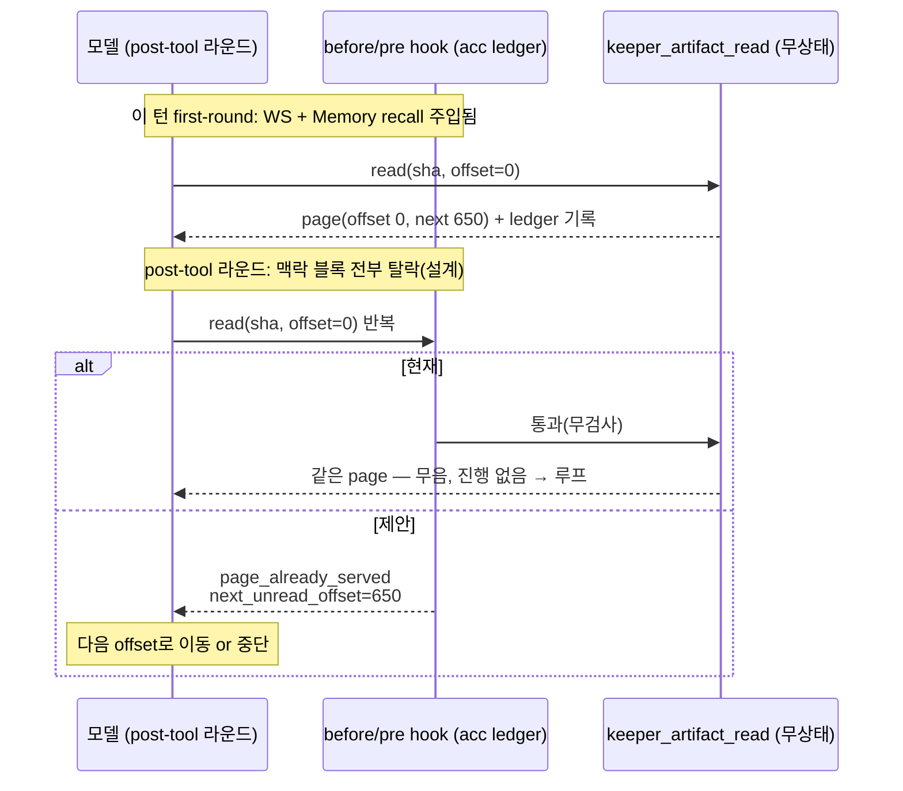
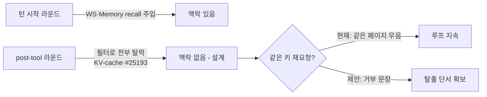

# RFC: 동일 페이지 재독출은 거부 문장으로 답한다 (artifact-read-repeat-signal)

## 0. Summary

`keeper_artifact_read`가 **같은 (sha256, offset, max_bytes) 요청에 같은 페이지를
조용히 다시 돌려주는 것**을, "이 턴에서 이미 제공한 페이지"라는
policy_rejection 문장으로 바꾼다. 문장에는 다음 미읽 offset이 함께 실린다.
규칙 준수나 맥락 주입에 의존하지 않고, 도구 출력 자체가 루프 탈출의 단서를
준다.

## 1. 배경 (2026-09-02 실측)

analyst(`deepseek-v4-flash:0731`)가 같은 blob 2개(sha `e9721cade`,
`c27f5994`)를 16초에 14회 재독출하는 루프에 빠졌다. 조사로 밝혀진 구조:

1. **도구는 무상태 순수 함수**다(`keeper_artifact_read.ml:163 page_of_slice`).
   같은 키 → 같은 응답. 서버 캐시도 부수효과도 없다. 응답에 `next_offset`·
   `eof`가 이미 있지만, "직전 응답과 같다 = 제자리걸음"이라는 해석은
   응답 단독에는 없다.
2. **루프 라운드는 맥락을 받을 수 없다(설계)**. 매 라운드 `before_turn_params`
   hook이 블록을 조립하되, `post_tool_round`면 `Dynamic_context`·
   `Temporal_summary`·`Memory_os_recall` 전부를 탈락시키고 Memory recall은
   계산 자체를 skip한다(`prompt_block_id.ml:42-44`,
   `keeper_run_tools_hooks.ml:708-1056`). 근거는 KV-cache prefix 안정성과
   #25193(프레임 재급급)으로, 이 스코핑 자체는 유지한다.
3. analyst의 교훈 카드("동일 sha 재요청 금지", 2026-09-01 기록)는 Memory
   recall 블록에 실리는데, 2번 때문에 루프가 도는 post-tool 라운드에는
   **설계상 도달하지 않는다**. wire 실측: 루프 창구 12 라운드 중 7개에서
   World State·메모리 팩트 부재("World State 깜빡임"은 이 스코핑의 관측
   결과였다).

결론: post-tool 라운드에서 도는 모델은 외부(주입 맥락)도 내부(규칙 기억)
도 없고, 도구 출력만 남는데 그 출력이 무음이다. 그러므로 도구 출력이
신호를 줘야 한다.

## 2. 문제 정의

- 같은 키 재요청의 응답이 첫 응답과 **바이트 동일**하다 — 모델이 응답
  비교로 제자리걸음을 감지하려면 두 응답을 정확히 대조해야 하는데, 루프에
  빠진 모델은 정확히 그것을 못 한다.
- 도구는 무상태라 스스로 "이미 줬다"를 알 수 없다. 신호를 추가하려면
  **턴 스코프의 제공 이력**이 필요하다.

## 3. 제안

### 3.1 턴 스코프 제공 ledger

`before_turn_params`의 accumulator(`acc`)에 이번 턴에 제공한
`keeper_artifact_read` 키 집합 `(sha256, offset, max_bytes)`를 유지한다.
라이프사이클는 `acc.prompt_blocks`와 같다 — 턴 시작 시 비고, continuation
checkpoint로 논리 턴이 새로 시작하면 새 ledger. hook이 대화 배열을 이미
받으므로, 정확히는 **"그 키의 결과 메시지가 아직 리플레이 창에 있는가"**로
판정해 compaction으로 창에서 사라진 페이지의 재독출은 정상 요청으로 둔다.

### 3.2 반복 감지 시의 응답

리플레이 창에 결과가 남아 있는데 같은 키가 다시 오면, 실행 대신
policy_rejection 한 문장으로 답한다(`keeper_memory_write`의
오류 분류 체계와 같은 문화 — 교정 가능한 입력에 대한 형식화된 거부):

```json
{"ok": false,
 "error_kind": "page_already_served",
 "detail": "offset 0 of sha256:e9721cade… was served this turn and its result is still in your window; re-reads make no progress",
 "next_unread_offset": 650,
 "total_bytes": 8813,
 "eof": false}
```

거부가 아니라 결과를 계속 주되 마커를 붙이는 변형도 가능하지만, post hook의
결과 개편 가능 여부가 구현에 달렸고, "동일 성공 응답 + 알림"은 성공 경로에
경고를 섞어 모델이 마커를 무시할 여지를 남긴다. **거부 문장이 무조건적**이다.

### 3.3 Ledger는 도구가 아니라 hook이 소유한다

`keeper_artifact_read` 핸들러(`base_path -> args -> t`)는 무상태를 유지한다.
상태와 판정은 `pre_tool_use` hook 계층에 둔다 — 읽기 도구에 부수효과를
만들지 않는다.

## 4. 도식

현재(무음 재독출)와 제안(거부 문장)의 라운드 흐름:



라운드 스코핑과의 관계(왜 맥락 주입으로는 못 고치는가):



## 5. 검증

- 단위: 같은 키 2회 요청이 2번째에 `page_already_served`로 답하는지;
  결과 메시지가 창에서 사라진 뒤의 재요청은 정상 페이지로 답하는지;
  continuation 경계에서 ledger가 비는지.
- 회귀: 서로 다른 offset/max_bytes는 즉시 통과. `max_bytes`만 다른 재요청은
  다른 키로 본다(응답 내용이 달라지므로).
- 실측 재판: 적용 후 analyst의 keeper_artifact_read 중
  직전 라운드 동일 키 재독출 비율이 0에 수렴하는지(turn-records로 측정).

## 6. 비교안

- **post-tool 라운드에 소형 circuit-breaker 블록 허용**: #25193의 재방송
  금지 정신과 충돌하고, 블록이 매 라운드 붙으면 KV-cache prefix도 흔든다.
- **모델 교체**: 루프 원인이 인터페이스 무음성이라 모델 불문 효과가 없다.
  sibling 모델 대조로 "deepseek가 더 취약한가"는 별도 측정 과제.
- **실패 카운터 가시화**: 텔레메트리-as-fix. 거부한다.

## 7. 비목표

- 페이지 실효 크기(~650B) 예산 변경 — 별도 계약.
- post-tool 라운드 스코핑 변경 — 유지한다(이 RFC의 전제).
- artifact가 아닌 도구의 반복 감지 일반화 — 사례가 쌓이면 별도 RFC.

## 8. 리스크

- 거부 문장을 무시하고 계속 같은 키를 부르는 모델: 최소한 매 라운드
  명시적 거부가 찍히므로 현재(무음 성공)보다 진단 가능하다. 턴 종료
  사유로 이어지는 것은 기존 terminal_tool_effect_failed 경로를 그대로
  탄다.
- ledger 오버헤드: 턴당 수십 키의 집합 연산 — 무시 가능.
