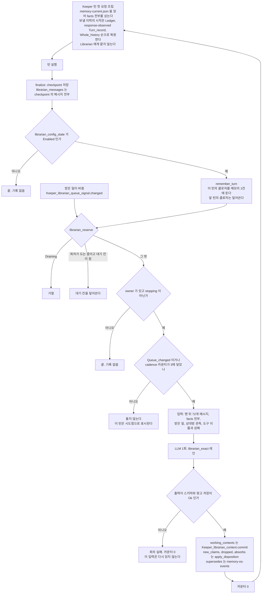
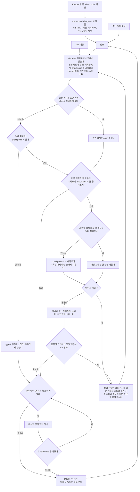

# RFC: Librarian 생명주기

- 상태: Draft
- 작성: 2026-09-18, 고침: 2026-09-20. 코드는 origin/main `84fb520c34`, 실측은 작성일 라이브 `<base-path>/.masc`. 뒤에 더한 실측은 문장마다 잰 날을 적었다.
- 관련: 창 RFC(`keeper-context-window-in-tokens`) §13 개정 Draft #37008, Memory OS RFC(`memory-os-bounded-context-and-librarian-curator`), RFC-0456, RFC-0363, 이슈 #37004·#36979
- 구현 상태(2026-09-20, main `3affdf3463`): 턴 끝 기록과 진행 파일 저장소, 순수 범위 선택 함수, 읽기 전용 오프라인 replay 하네스까지 들어왔다. 하네스는 실제 턴 끝 기록과 checkpoint에 범위 선택 규칙을 적용하지만 진행 위치는 메모리에서만 옮기고 아무 파일도 쓰지 않는다. 현재 Keeper/server의 Librarian 회차는 진행 파일을 읽거나 쓰지 않는다. §4의 서버 루프와 §4.9의 밀림 표시는 §8의 4~6단계 계획이다. 현재 서버 동작은 §2를 따르며, 이 구분은 #37104에서 추적한다.

## 읽기 전에 — 말의 뜻

이 문서는 message, atom, 이력, trace, 턴을 구분해서 쓴다. 짧은 정의는 `docs/spec/00-glossary.md` 에 있고, 여기에는 이 문서를 읽는 데 필요한 만큼을 풀어 적는다. 큰 것부터 적는다.

```
Keeper
└─ trace                    Keeper 의 한 generation. 한 번에 하나다
   └─ checkpoint 파일        <trace 디렉터리>/<trace id>.json. trace 당 하나
                            (checkpoint 안의 session_id 필드가 이 trace id 다. 이름만 둘이고 값은 하나다)
      ├─ system_prompt, tools, 모델 설정 …
      └─ messages  ← 이 문서가 "이력"이라 부르는 것
         ├─ message = { role, content }
         │    role    : System, User, Assistant, Tool
         │    content : content_block 의 목록 — Text, Thinking, ReasoningDetails, RedactedThinking,
         │              ToolUse, ToolResult, Image, Document, Audio 아홉 종(types.mli)
         └─ atom = message 를 묶는 단위
              User 메시지 하나                              → atom 하나
              Assistant 메시지와 그것에 답한 Tool 메시지들   → atom 하나
```

- **atom** 은 따로 저장되지 않는다. `messages` 를 앞에서부터 세면 나오는 묶음이다(`runtime_model_input_tail_window.mli`). 도구 호출과 그 결과를 한 묶음으로 두는 이유는 이력을 잘라 보낼 때 결과만 남고 호출이 빠지면 provider 가 거절하기 때문이다. 그래서 자르는 자리는 atom 경계에만 온다. atom 의 무게는 고르지 않다(같은 파일의 머리말: 0.3KB~8.7KB). 이 문서는 atom 번호를 **위치**로만 쓰고 크기를 재는 데는 쓰지 않는다.
- **턴** 은 위 나무 안에 없다. Keeper 가 깨어나서 끝낼 때까지의 실행 한 번이고 이름은 `Turn_ref`(trace id, 몇 번째 턴)다. 턴 하나가 돌면 이력 끝에 atom 몇 개가 덧붙으므로 턴은 이력 안의 연속된 구간 하나에 대응한다. 그 구간이 어디인지는 어디에도 적히지 않는다(§2.5 의 D5). 턴 기록(`Turn_record`)에는 "몇 atom 을 보냈나"는 있어도 "이 턴의 메시지가 이력의 몇 번부터 몇 번인가"는 없다.
- 코드에는 "턴"이 둘이다(용어집의 Keeper Turn, agent core Turn). 이 문서의 턴은 **Keeper 턴**(깨어나서 끝날 때까지)이다. checkpoint 의 `turn_count` 가 세는 것은 **agent core 턴**(LLM 왕복 한 번)이고 Keeper 턴 하나 안에서 도구를 부를 때마다 는다.
- atom 을 하나도 남기지 않는 턴이 있고(§4.3 의 빈 범위), atom 이력이 아예 없는 턴이 있다(§4.8 의 공식 클라이언트).

이 문서가 쓰는 나머지 말이다. 같은 것은 끝까지 같은 말로 부른다.

| 말 | 뜻 | 코드 이름 |
|---|---|---|
| 회차 | Librarian 이 LLM 을 한 번 불러 기억을 고치는 일 하나 | `run_best_effort`, `librarian_exact` 레인의 run |
| 슬롯 | 레인에 등록된 모델 후보 하나. 앞 슬롯이 안 되면 다음 슬롯을 쓴다 | exact-output slot |
| facts | Keeper 의 기억 항목들. 파일 하나(스냅숏)에 전부 들어 있고, Keeper 턴의 첫 요청에 전부 실린다 | `<keeper>.memory-current.json`, `Memory_os_recall` 블록 |
| 받은 일 | Keeper 에게 들어왔고 아직 처리되지 않은 요청들 | working-context 의 `sources` |
| 받은 일 정리 | 받은 일을 묶어 맥락과 다음 할 일을 적은 것 | `working_contexts`, pocket |
| 읽은 위치 | Librarian 이 이력의 어디까지 읽었는가. atom 번호다 | `keepers/<keeper>/librarian-progress.json` (선택한 cluster runtime root 아래) |
| 창이 보는 위치 | Keeper 요청이 이력의 어디서부터 실리는가. 지금 코드의 `front` | §7 (라) |
| 밀림 | 끝났는데 아직 안 읽은 턴이 있는 상태. 그 범위가 밀린 구간이다 | |

기억(fact) 쪽의 말이다. 이 RFC 는 이 부분을 바꾸지 않는다(RFC-0456, RFC-0418 의 계약). 회차의 출력이 어디로 가는지 읽으려면 필요하다.

| 말 | 뜻 | 코드 이름 |
|---|---|---|
| fact | 기억 하나. 문장(`claim`), 분류(`category`), 처음·마지막으로 본 시각, 누가 적었나(`origin`), 무엇에 근거하나(`basis`)로 이뤄진다. id 필드는 없다. id 는 `claim` 글자의 SHA-256 이라 글자가 하나라도 다르면 다른 fact 다 | `Keeper_memory_os_types.fact`, `memory_id` |
| `authored` / `injected` | 누가 적었나. `authored` 는 Keeper 가 `keeper_memory_write` 도구로 직접 적은 것이고 `injected` 는 Librarian 이 대화에서 뽑아 넣은 것이다. "주입"이 아니라 "Librarian 이 뽑음"으로 읽는다 | `origin.kind` |
| `observed` / `derived` | 무엇에 근거하나. `observed` 는 어디서 읽었는지(자기 대화, Board 글)를 갖고 `derived` 는 유도(derivation)를 하나 이상 갖고 유도마다 전제가 된 다른 fact 의 id 를 갖는다. 전제가 모두 살아 있는 유도가 하나라도 남아 있으면 `derived` fact 는 유효하다(`keeper_memory_os_current.ml` 의 `derivations_supported`) | `basis` |
| `dropped` | 회차가 "이 기억을 버린다"고 말한 것. 이유를 같이 적는다. 스냅숏에서 빠지고, 저널 커밋 줄에 id·이유와 원문이 남는다 | `dropped_statement`, 저널의 `dropped`·`change.removed` |
| `supersedes` | 옛 기억 하나를 새 claim 하나가 고쳐 쓴다(1:1). 옛 id 는 같은 답의 `dropped` 에도 있어야 한다. 기억 이벤트에 `revised`(옛 id → 새 id)가 남아 거슬러 올라갈 수 있다 | `revision`, `Keeper_memory_os_events.Revised` |
| `absorbs` | 기억 여러 개를 새 claim 하나가 대신 말한다(N:1). 흡수된 id 는 `dropped` 에 있으면 안 된다. 스냅숏에서 빠지고 원문은 "어느 claim 으로 들어갔나"와 함께 남아 검색으로 다시 찾을 수 있다 | `absorbed_statement`, `<keeper>.memory-absorbed.jsonl` |
| `retrieved` | 이 fact 가 `keeper_memory_search` 결과에 나온 횟수 | `Keeper_memory_os_events.Retrieved` |
| `retracted` | Keeper 가 `keeper_memory_retract` 로 이 fact 를 id 로 지목해 철회에 성공한 사건이다. 같은 claim 이 다시 추가되면 과거 철회 이력이 다시 보인다 | `Keeper_memory_os_events.Retracted` |

회차가 말하지 않은 fact 는 그대로 남는다. 규칙을 하나라도 어긴 답(모르는 id, `supersedes` 의 id 가 `dropped` 에 없음, `absorbs` 의 id 가 `dropped` 에 있음)은 회차 전체가 거절되고 기억은 바뀌지 않는다. 2026-09-18 라이브 20개 Keeper 의 fact 2,462개 가운데 `injected` 가 2,157개, `derived` 가 9개였고, 기억 이벤트는 `revised` 3,632건, `retrieved` 1,508건, 당시 wire 이름 `cited`(현재 `retracted`) 116건, 흡수 기록은 300줄이었다.

### 턴 하나를 따라가 보기

trace 하나에 atom 이 112개 쌓여 있고, 사람이 rondo 에게 말을 걸어 턴 41이 도는 경우다. 번호는 설명을 위해 1부터 센다. 코드의 `end_atom` 은 "몇 개 쌓였나"이므로 같은 값이 나온다.

| 순서 | 일어나는 일 | 이력 | 어디에 남나 |
|---|---|---|---|
| 1 | 턴 시작. checkpoint 를 불러온다 | 112 | atom 이 있는 이력에서 시작하므로 이 턴은 `Continued_history` 다. 이력에 atom 이 없었다면 여기서 `history_restarted` 줄을 쓴다(§4.6) |
| 2 | 첫 요청을 만든다: system, tools, 이력의 일부, facts 전부와 받은 일 참조, 새 user 메시지 | 113 (user) | facts 블록은 매 턴 새로 만들어 붙이는 것이라 atom 으로 세지 않는다(`is_extra_context`) |
| 3 | 모델이 도구를 부른다. 도구 결과가 돌아온다 | 114 (assistant + tool) | 결과는 새 atom 을 열지 않고 114 에 붙는다. 턴 도중에도 checkpoint 가 저장된다 |
| 4 | 3이 몇 번 되풀이된다 | 115 ~ 119 | agent core 턴이 그만큼 는다. Keeper 턴은 여전히 41 하나다 |
| 5 | 모델이 말로 답하고 끝낸다 | 120 (assistant) | |
| 6 | 저장. 이 턴의 꼬리를 다듬어 checkpoint 에 쓴다 | 120 | 사람이 말을 건 턴은 그대로 남는다. 내부 생각 턴은 끝의 assistant 가 빠지고, 도구를 안 썼으면 그 턴의 몫이 통째로 빠진다(`keeper_replay_checkpoint.ml`) |
| 7 | 턴 끝 기록에 한 줄 | | "턴 41, `Continued_history`, 120 에서 끝남, 120번 atom 의 digest" |
| 8 | Librarian 이 깬다. 읽은 위치는 112 다 | | 113 ~ 120 을 읽는다. 도구 결과 본문은 `[tool result omitted]` 로, thinking 은 빼고 읽는다 |
| 9 | 회차: Keeper 역할, facts 전부, 받은 일, 113 ~ 120 을 넣어 LLM 1회 | | 출력을 facts 와 받은 일 정리에 합친다 |
| 10 | 읽은 위치를 120 으로 옮긴다 | | |
| 11 | 턴 42 시작. 첫 요청에 새 facts 가 실린다 | | 창이 보는 위치가 읽은 위치를 따르게 된 뒤에는(§7 (라)) 이력은 121 부터 실린다 |

**Librarian 이 턴이 아니라 이력을 보는 이유.** 첫째, 오간 말이 남는 곳이 이력뿐이다. 턴은 실행이지 저장소가 아니다. 둘째, 줄이려는 것이 이력이다. Keeper 의 요청은 system, tools, 이력의 일부, facts, 새 입력으로 이뤄지고 그중 자라는 것이 이력이다. "여기서부터만 보낸다"는 이력 안의 위치로만 말할 수 있다. 셋째, Librarian 의 "여기까지 읽었다"와 창의 "여기서부터 보낸다"가 같은 자(atom 번호)를 써야 바꿔 읽을 필요가 없다. 턴이 쓰이는 곳은 하나다. 읽은 위치를 옮겨도 되는 자리가 턴 끝이다. 그래서 §4.6 의 턴 끝 기록은 "턴 41 이 끝났다"는 사건을 "이력 120 번"이라는 위치로 옮겨 적는 한 줄이다.

**앞머리는 Librarian 의 게이트가 아니다**(09-19 확인). 창의 앞머리(`keeper_carried_front.ml`)는 *요청이 싣는* 가장 오래된 atom 을 정할 뿐, 저장되는 이력을 자르지 않는다. 앞머리를 다루는 모듈 넷(`keeper_carried_front`, `keeper_turn_driver`, `keeper_turn_driver_try_provider`, `keeper_next_request_forecast`) 가운데 checkpoint 를 저장하는 것은 **하나도 없다**. 라이브가 같은 말을 한다 — 창은 100000 토큰인데 checkpoint 한 개가 73 MB 다. 앞머리가 지나간 구간도 이력에는 그대로 있고, Librarian 은 그 이력을 읽는다(`keeper_agent_run_finalize_response.ml` 이 `saved_checkpoint.messages` 를 넘긴다). 이력에서 실제로 지우는 것은 오프라인 purge 와 `masc_keeper_clear` 둘뿐이고, 읽은 위치와의 순서는 §10 의 2 가 정한다.

## 1. 결정 (운영자, 2026-09-18)

1. **Keeper 가 몸이면 Librarian 은 뇌에 기록하는 존재다.** Keeper 는 세상에서 움직인다. 뇌는 Keeper 가 생각할 때 쓰는 기억이다(facts, 받은 일 정리). Librarian 은 Keeper 가 겪은 것을 수시로 읽어 거기에 적는다. 생각을 대신하지 않는다. Librarian 은 Keeper 마다 따로다.
2. **고칠 것은 생명주기다.** 언제 깨어나는가, 무엇을 읽는가, 어디에 적는가, 어디까지 읽었는가. 프롬프트와 출력 스키마는 이 RFC 의 이행 범위에서 바꾸지 않는다.
3. **끝난 턴을 하나도 놓치지 않고, 읽지 못한 턴을 건너뛰지도 않는다.** Librarian 은 깰 때마다 읽은 위치부터 기록된 끝까지를 전부 읽는다. 밀린 구간이 있으면 다음에 깰 때 그 구간을 다 읽는다. 그래야 "여기까지 읽었다"가 참이 되고, 창이 그 위치부터 보낼 수 있다(창 RFC §13). 이미 읽힌 이력이 다음 요청에 다시 실리지 않게 하는 방법은 이것이다.
4. **이 경로에 고른 숫자, 계수, 타이머, 부분 문자열 검사를 두지 않는다.** 쓰는 비교는 §4.4 의 표가 전부다.
5. "수시로"는 세 가지를 뜻한다 — (가) 자기 루프로 돈다 (나) 턴 도중에도 읽는다 (다) 한가할 때도 정리한다. 셋 다 목표이고 **하나씩** 넣는다. 이 RFC 가 이행까지 다루는 범위는 (가)다.
6. 읽은 위치를 지나간 턴에서 살아남는 것은 **지식(facts)과 하던 일**이다. Librarian 이 하는 일은 셋으로 나눈다(턴 읽기, 기억 접기, 받은 일 정리). 둘 다 프롬프트와 출력 스키마를 바꾸는 일이다. 생명주기가 라이브에서 확인된 뒤에 연다(§7).
7. TypeSafe Jev 같은 판단 전용 모델은 **하네스의 채점자**로 먼저 쓴다. 운영 경로에는 넣지 않는다.

이 RFC 는 창 RFC §13.7 의 선행 조건("Librarian 이 어디까지 흡수했나를 물어볼 자리")을 채운다. 창 조립이 그 위치를 쓰는 일은 창 RFC 의 몫이고, §7 (라)가 끝난 뒤에 시작한다.

## 2. 이 RFC 를 쓸 때의 한 바퀴 (2026-09-19 실측, 5단계 전)

### 2.1 순서도



### 2.2 네 가지 질문

| 질문 | 지금 |
|---|---|
| 언제 깨어나나 | Keeper 턴 끝 경로가 제출할 때(`keeper_agent_run_post_turn_memory.ml` `run`)와 받은 일이 바뀔 때(`keeper_owner_registry.ml`, `keeper_registry_event_queue.ml` 의 `Keeper_librarian_queue_signal.changed`). 서버가 뜰 때는 돌지 않는다 |
| 무엇을 받나 | `config/prompts/librarian.md` 한 장. 변수는 받은 일, Keeper 역할, Goal 기준, facts 전부, 맨 뒤 72개 메시지, 상대방 관측, 도구 이름과 성패. 도구 결과 본문은 `[tool result omitted]` 로 바뀌고 thinking 은 빠진다(`keeper_librarian.ml` `text_of_content`). 공식 클라이언트 턴은 assistant 메시지 0~1개만 받는다 |
| 무엇을 내놓나 | `new_claims`(claim 마다 `absorbs`·`supersedes` 를 달 수 있다), `dropped`, `working_contexts`. 셋 다 있어야 한다(`keeper_librarian.ml` `selection_of_json_result`) |
| 어디에 합치고 무엇을 버리나 | 아래 표 |

| 출력 | 가는 곳 | 합치는 방법 |
|---|---|---|
| `new_claims` | `<keeper>.memory-current.json` | 파일 잠금 아래에서 그 순간의 스냅숏에 더한다(`apply_disposition`). id 가 claim 의 SHA256 이라 글자가 같은 claim 은 두 번 들어가지 않는다 |
| `dropped` | 같은 스냅숏에서 빠진다. 저널에 한 줄 | 회차 도중에 Keeper 가 같은 fact 를 다시 관측했어도 뺀다 |
| `absorbs` | 스냅숏에서 빠지고 `<keeper>.memory-absorbed.jsonl` 에 원문이 남는다 | 이 append 가 실패하면 아무것도 커밋하지 않는다(RFC-0456 §4.2) |
| `supersedes` | `memory-os-events` 에 Revised 한 줄 | 못 써도 회차는 성공이다 |
| `working_contexts` | `working-context.json`, 이어서 `working-context-recall.json` 색인 | generation+revision CAS. 주입 시에도 색인과 정본 버전을 다시 대조하며, 불일치/읽기 실패는 fail-closed 한다. publication 실패는 WARN 을 남기되 stale publisher가 더 새 색인을 삭제하지 않는다 |
| 회차가 말하지 않은 fact | 그대로 남는다 | |
| 버려지는 것 | 맨 뒤 72개 밖의 대화, 도구 결과 본문, thinking, §2.3 에 걸린 턴 | 버렸다는 기록이 없다 |

Keeper 는 다음 턴의 첫 요청에서 facts 전부를 `Memory OS Recall` 블록으로 받는다(`keeper_run_tools_hooks.ml`, `keeper_memory_os_recall.ml` `render_if_enabled`). 받은 일 정리는 `artifact_read` 도구가 그 턴에 있을 때만 sha256 참조 한 줄로 받는다(`keeper_librarian_context_recall.ml` `render`).

### 2.3 턴을 잃는 자리

| # | 자리 | 무슨 일이 생기나 | 근거 |
|---|---|---|---|
| L1 | 턴 끝 1칸 | 턴이 끝날 때마다 그 턴의 클로저를 Keeper 당 1칸에 둔다. 앞 턴의 클로저는 덮어쓴다 | `keeper_librarian_queue_refresh.ml` `remember_turn` |
| L2 | 제출 거절 | lifecycle 이 Draining 이면 제출을 거절한다 | `keeper_memory_lane.ml` `librarian_reserve` |
| L3 | 대기 칸 1개 | 회차가 도는 동안 대기 칸은 하나다. 새 제출이 앞 제출을 덮어쓴다. 31시간에 5,211회 | 같은 함수 |
| L4 | owner 조회 | owner 가 없거나 stopping 이면 기록 없이 끝난다 | `keeper_librarian_queue_refresh.ml` `run` |
| L5 | cadence | 턴 끝 신호 세 번에 한 번만 돈다. 돌지 않은 턴도 "시도함"으로 표시된다 | `keeper_librarian_runtime.ml` `cadence_due`, `keeper_librarian_queue_refresh.ml` `attempt_remembered` |
| L6 | 실패 | 실패한 회차의 입력은 다시 읽지 않는다. 카운터가 0 이 되어 다음 회차는 세 턴 뒤다 | `keeper_librarian_runtime.ml` `cadence_record_attempt` |
| L7 | 서버 재시작 | 1칸과 카운터는 메모리에 있다. 돌던 회차는 `server_restarted` 로 끝난다. 31시간에 70건 | `exact_lane_run_registry.ml` `restart_reason` |

놓친 턴의 메시지는 checkpoint 에 남아 있다. 그래서 다음 회차의 "맨 뒤 72개"에 들어오면 읽히고, 못 들어오면 영영 읽히지 않는다. 어느 쪽이었는지는 어디에도 남지 않는다. 읽은 위치가 없으므로 창은 Librarian 에게 물을 것이 없다.

**이 스택(1~3)에 들어온 것** (09-20 확인). checkpoint 저장 결과를 확인한 뒤, Librarian에 턴 내용을 넘기기 전에 턴 끝 기록을 쓴다(`keeper_agent_run_finalize_response.ml`). 쓰기가 성공한 줄은 L2·L4의 제출 거절이나 L1·L3의 제출 덮어쓰기와 별개로 파일에 남는다. 진행 파일 저장소와 순수 범위 선택 함수도 있다. 공개 실행 파일 `masc-librarian-replay`는 `select`·`slice`·`progress_after`를 실제 턴 끝 기록과 checkpoint에 반복 적용한다. 다만 읽기 전용 오프라인 하네스라 진행 위치를 메모리에서만 옮기고 진행 파일·턴 끝 기록·checkpoint를 쓰지 않는다. 이 함수들을 부르는 소비자와 진행 파일 read/write 는 4단계가 넣었다(`keeper_librarian_durable_consumer.ml` 의 `consume_one`, #37208·#37213). `progress_after`는 다음 위치를 계산하는 함수이며, 회차의 기억 저장 성공이나 진행 파일 쓰기를 실행하지 않는다.

**5단계 전까지 회차가 읽은 것은 최근 메시지 창이었다.** 턴 끝 클로저 한 칸과 memory lane의 대기 한 칸을 거쳐, `prompt_input_for_librarian`이 `max_messages × cadence_turns`만큼 뒤에서 골랐다. 성공과 `Error` 결과로 끝난 회차는 cadence 카운터를 초기화했고, 취소·예외·Eio 실행 환경 누락은 이 초기화를 거치지 않았다. `attempt_remembered`는 저장 성공을 확인하지 않고 시도한 것으로 표시했다. 그래서 L5의 건너뛴 턴 따라잡기, L6의 저장 실패 후 같은 범위 재시도, L7의 재시작 후 읽던 위치 복원은 보장이 아니었다. 턴 끝 파일이 남는 것만으로 뒤의 회차가 그 내용을 읽었다고 말할 수 없었다.

registry의 `Succeeded`는 facts의 `apply_disposition` 성공을 뜻한다. working context는 별도로 저장하며 그 실패가 facts 저장을 막지 않는다. 이 성공 표시는 진행 파일 전진을 뜻하지 않는다. §8의 4단계가 루프를 연결하고 성공한 저장 뒤에만 위치를 쓰는지 검증했고, 5단계가 cadence 와 턴 끝 1칸을 지웠다. memory lane 의 대기 한 칸은 4단계의 레인 설계 그대로 남는다.

**L3 은 고장이 아니라 부하의 표시다**(09-19 실측). 대기 칸 덮어쓰기(`coalesced latest snapshot (lane=librarian)`)를 날짜별로 세면 이렇다.

| 날짜 | 덮어쓰기 | `missing_deadline` |
|---|---|---|
| 09-17 (회차가 정상으로 돌던 날) | **4,910** | 0 |
| 09-18 (레인이 죽기 시작한 날) | 387 | 933 |
| 09-19 (회차가 하나도 안 도는 날) | **4** | 222 |

덮어쓰기는 **회차가 도는 동안** 새 제출이 들어올 때 생긴다. 그래서 레인이 죽으면 덮어쓸 것도 없어 0 에 가까워진다. 즉 4,910 은 "망가졌다"가 아니라 **"회차가 턴 도착 속도를 못 따라간다"**는 수다. 읽은 위치가 생기면 덮어쓰인 제출이 아무것도 잃지 않으므로(다음 회차가 위치부터 다시 읽는다) 대기 칸 자체가 필요 없어진다.

### 2.4 이 경로의 고른 숫자와 휴리스틱

| 자리 | 무엇 | 이 RFC 에서 |
|---|---|---|
| `env_config_keeper.ml` `librarian_cadence_turns_default` | 3 | 지웠다(5단계) |
| 같은 파일 `librarian_max_messages_default`, `keeper_librarian_runtime.ml` `prompt_max_messages` | 24, 그리고 24 × 3 = 72. 서로 상관없는 두 값의 곱이다 | 지웠다(5단계). 읽는 범위는 턴 끝 기록이 정한다 |
| `keeper_librarian_runtime.ml` `fresh_counter` | -1. 숫자로 상태를 나타낸다 | cadence 와 같이 지웠다(5단계) |
| 같은 파일 `cadence_record_attempt` | 실패하면 세 턴 미룬다 | 지웠다(5단계). 위치가 안 움직이는 것이 곧 재시도다 |
| `keeper_memory_lane.ml` `librarian_drain_timeout_sec` | 30초 | 지웠다(4단계 ①, #37536). Keeper 생애주기에서 Librarian 을 떼면 기다릴 일이 없다 |
| `keeper_librarian_queue_refresh.ml` `policy_equal` | instructions 문자열이 같은지 보고 같은 턴을 다시 돌릴지 정한다 | 1칸과 같이 지운다. 읽은 턴은 다시 읽지 않는다(I9) |
| `keeper_librarian_runtime.ml` 의 `Keeper_librarian_queue_signal.changed` 호출 | 받은 일 정리가 진척되면 스스로를 다시 깨운다 | 깨우는 호출은 지운다. 진척 비교는 루프의 조건으로 남는다(§4.4 의 9) |
| 창: `runtime.toml` 의 `high_water_tokens`·`low_water_tokens`(라이브 값 100000·70000), `keeper_turn_driver_try_provider.ml` `context_overflow_shrink_divisor` = 2, `runtime_model_input_tail_window.ml` `atoms_per_window` = 60, `max-prompt-bytes` | 전부 고른 숫자 | 창 RFC §13 의 몫 |

**72 가 작아서 잃는 것이 아니다**(09-19 라이브 실측, 읽기만). 지금 checkpoint 28개에 메시지가 181,461개 있고, 어느 순간에도 창이 닿는 것은 Keeper 당 72개다.

이 창이 **몇 턴 치인지는 여기 적지 않는다 — 확인 필요**. 한때 "턴당 1.96개라 약 37턴 치"라고 적었는데, 분모를 안 적어 둔 탓에 다시 재현되지 않는다. 09-19 에 세 가지로 세 봤고 어느 것도 1.96 이 아니다: 9월 턴 기록 전체를 분모로 하면 62.09, 그중 agent core 턴만 세면 182.73, `absolute_turn` 의 최댓값을 생애 턴으로 보면 3.51. 분모가 정해지지 않은 채로는 "몇 턴을 쉬면 잃는가"의 문턱을 말할 수 없다. 이 절을 다시 쓸 때는 분자와 분모를 각각 한 문장으로 적는다.

분모와 무관하게 남는 것은 **잃는 방식**이다. 창은 회차가 돌 때만 앞으로 간다. 그래서 잃는 것은 창이 좁아서가 아니라 **회차가 한동안 안 돌아서**이고, 그걸 실제로 만드는 것이 §2.3 의 L3(31시간에 대기 칸 5,211회 덮어쓰기)·L5·L6, 그리고 09-18 부터 이어지는 정지(#37004)다. 그래서 고칠 것은 창의 크기가 아니라 **창이 회차 빈도에 묶여 있다는 것**이고, 읽은 위치가 그 묶임을 없앤다.

부분 문자열 검사가 아닌 것도 적어 둔다. agent_core 는 provider 의 종료 사유 토큰을 경계에서 한 번 variant 로 바꾼다(`packages/agent_core/lib/llm_provider/types.ml` `stop_reason_of_string`). HTTP 400 본문의 글을 읽어 overflow 를 추측하지 않으며, 그 사실을 고정하는 테스트가 있다(`retry.ml` 의 "HTTP 400 prose does not synthesize ContextOverflow"). 새 생명주기가 provider 거절을 다룰 때는 이 typed 값만 쓴다.

**새로 들어간 모듈 셋에 무엇이 없는지 세 봤다**(09-19). `keeper_turn_boundaries`, `keeper_librarian_progress`, `keeper_librarian_range` 에 고른 숫자가 **0개**, 시계·`sleep`·타임아웃이 **0개**다. 의미를 문자열로 추측하는 자리도 **0개**다 — 문자열 비교는 세 가지뿐이다. trace_id 와 digest 가 같은지(`keeper_librarian_range.ml` 4곳), 빈 문자열인지(`non_blank` 2곳), 그리고 JSON 토큰 해석인데 모르는 토큰은 기본값이 아니라 오류로 돌아간다(`Unknown_token`). JSON 모양을 가르는 match 도 `_ ->` 없이 생성자를 전부 적는다. 다시 세려면:

```bash
rg -n '\b[0-9]+\b' lib/keeper/keeper_turn_boundaries.ml lib/keeper/keeper_librarian_progress.ml lib/keeper/keeper_librarian_range.ml
rg -n 'Eio\.Time|Unix\.gettimeofday|Mtime|Ptime|Sys\.time|sleep|timeout|Time_compat' lib/keeper/keeper_turn_boundaries.ml lib/keeper/keeper_librarian_progress.ml lib/keeper/keeper_librarian_range.ml
rg -n 'String\.(equal|compare|starts_with|ends_with|contains)' lib/keeper/keeper_turn_boundaries.ml lib/keeper/keeper_librarian_progress.ml lib/keeper/keeper_librarian_range.ml
```

### 2.5 생명주기 밖의 결함

| # | 결함 | 근거 | 어디서 닫나 |
|---|---|---|---|
| D3 | 호출 한 번이 다 한다 — 대화 읽기, facts 전부 읽기, 쓰기, 접기, 받은 일 정리 | `config/prompts/librarian.md`, `keeper_structured_output_schema.ml` `librarian_current_output_schema` | §7 (마) |
| D4 | 프롬프트가 "오래 쓸 지식"만 남기라고 한다. 턴 진행과 현재 상태는 저장하지 말라고 한다. 읽은 위치를 지나간 "하던 일"은 어디에도 남지 않는다 | `config/prompts/librarian.md` §남길 지식과 증거 | §7 (라) |
| D5 | "이 턴이 이력의 어디까지인가"가 저장되지 않는다. 프롬프트의 `turn=%d` 는 턴 번호가 아니라 메시지 순번이다 | `keeper_turn_driver_try_provider.ml` `initial_message_index`, `keeper_librarian.ml` `format_messages_for_prompt` | §4.6 의 턴 끝 기록 |
| D6 | 도구 결과와 호출은 `[... omitted]` 로만 받고 thinking 은 빠진다. 공식 클라이언트 턴은 assistant 메시지 1개만 받는다 | `keeper_librarian.ml` `text_of_content`, `keeper_agent_run_finalize_response.ml` `librarian_messages` | 공식 클라이언트는 §4.8. 도구 결과 본문은 §6 |
| D8 | 어느 슬롯에서든 provider 가 Timeout, Network_error, Context_overflow, Overloaded, Server_error 같은 거절을 돌려주면 다음 슬롯으로 넘어가지 않고 회차가 끝난다 | `exact_output.ml` `execution_failure_may_advance` | #36979 |

이미 고쳐진 것은 다시 설계하지 않는다: 점호 제거와 `absorbs`(RFC-0456, #36936·#36937·#36948). 라이브에서 code-reviewer 의 facts 가 378개(09-16)에서 231개(09-18)로 줄었고 흡수 기록은 91건이다.

### 2.6 라이브 실측 (2026-09-17 00:00Z ~ 09-18 07:08Z, 31.1시간)

출처는 `exact-lane-runs-v6.jsonl`, `system_log_2026-09-17.jsonl`·`-18.jsonl`, `config/keepers/*.memory-journal.jsonl` 이다. 집계 스크립트는 작업 세션의 임시 파일이라 저장소에 없다. §9 의 하네스가 재현 가능한 형태로 다시 잰다.

| 관측 | 값 |
|---|---|
| Librarian 회차 | 시작 773 · 성공 659 · 실패 114 |
| 성공 회차가 받은 메시지 수 | 0개 24% (158) · 1~71개 35% (229) · 72개 상한 41% (272) |
| 성공 회차 사이 최대 간격 | won-chik 68턴 · lane-smith 65턴 · rondo 64턴 |
| 성공 회차 걸린 시간 | p50 21초 · p90 583초 · 최대 15,649초 |
| 서버 재시작에 끊긴 회차 | 70건 (`server_restarted`) |
| 밀린 제출을 덮어쓴 횟수 | 5,211회 (`memory lane coalesced latest snapshot`) |
| 09-18 06:15Z 재시작 이후 | 성공 0 · 실패 44 (`wire_admission_rejected:missing_deadline`, #37004). 그동안 남은 흔적은 WARN 로그뿐이다 |

claude_code·antigravity 턴 뒤의 회차는 메시지를 중앙값 1개 받았다(조인된 108건).

## 3. 사실과 다른 문장 (정정 요청)

| 어디 | 적힌 말 | 실제 |
|---|---|---|
| Memory OS RFC §3 | "librarian 이 올바르게 동작하는 한 overflow 상황은 존재하지 않는다" | 그렇게 만드는 장치가 코드에 없다. 창을 고르는 파일(`keeper_carried_front`·`keeper_carried_range`·`keeper_model_input_ledger`·`keeper_turn_driver_try_provider`·`keeper_unified_turn`)에 Librarian 참조가 0건이다 |
| Memory OS RFC §3.5 | 저널 줄에 `watermark` 를 남긴다 | 라이브 저널의 커밋 줄 키는 `change, dropped, outcome, recorded_at, revision, source` 뿐이다. 구현된 적이 없다 |
| 창 RFC §13.6 | "고를 것이 없고 틀릴 수도 없다" | 위치가 안 읽은 구간을 넘어가면 틀린다. 읽은 데까지만 옮길 때 참이다(§4.5 I1) |
| 창 RFC §13.6 | 도구 결과 마커는 "지금은 거절 경로의 `last_resort` 에서만 켜진다" | 끝난 턴의 도구 결과는 이미 조립 때 마커로 나간다(RFC-0363, 기본 켜짐). `last_resort` 가 바꾸는 것은 지금 턴의 결과다 |

Memory OS RFC 의 두 문장은 §8 의 문서 PR 에서 고친다. 창 RFC 의 세 문장은 아직 머지되지 않은 Draft #37008 의 것이라 그 소유자에게 요청한다.

**뒤집는 결정이 하나 있다.** Memory OS RFC §3.2 는 "절단-librarian 동기화 기제(watermark 류)는 지킬 대상이 없는 보증이며 도입하지 않는다"고 정했다. 틀린 사실이 아니라 결정이다. 이 RFC 의 읽은 위치는 바로 그런 장치이고, 창이 그 위치에 기대도록 만든다. 운영자의 2026-09-18 결정(§1 의 3, 창 RFC §13)이 그 결정을 대신한다. 같은 문서의 §3.5·§4 는 이미 `watermark` 가 있는 것처럼 적고 있어 §3.2 와 서로 어긋난다. §8 의 문서 PR 이 §3.2 에 이 RFC 를 가리키는 문장을 넣어 맞춘다.

## 4. 설계 — 바뀔 한 바퀴

### 4.1 순서도



### 4.2 네 가지 질문

| 질문 | 바뀔 모습 |
|---|---|
| 언제 깨어나나 | 서버가 뜰 때 한 번. 그 뒤로는 신호 둘(턴 끝이 기록됨, 받은 일이 바뀜). 깨어나면 디스크의 두 파일로 할 일을 직접 계산한다. 신호는 귀띔이라 놓쳐도 잃는 것이 없다 |
| 무엇을 받나 | 프롬프트와 변수는 지금과 같다. Keeper 역할(instructions)과 facts 전부도 지금처럼 실린다. 메시지만 "맨 뒤 72개"에서 "읽은 위치부터 기록된 마지막 턴 끝까지"로 바뀐다. 평소에는 한 턴이고, 밀렸으면 밀린 만큼 전부다 |
| 무엇을 내놓나 | 지금과 같다 |
| 어디에 합치나 | 지금과 같다(§2.2). 저장이 끝난 뒤 맨 마지막에 읽은 위치를 옮긴다 |

### 4.3 루프

- **Librarian 은 Keeper 마다 따로다.** 루프도, 읽은 위치도, facts 도 Keeper 별이다. Librarian 끼리는 상태를 나누지 않고 서로 기다리지 않는다.
- 루프의 수명은 서버가 쥔다. Keeper keepalive 가 아니라 서버 스위치에 매단다. 서버가 뜨면 같이 뜨고, 뜨자마자 한 번 돈다. 그래서 서버 재시작 뒤에도 읽던 자리에서 이어가고, Keeper 가 재기동해도 그 Keeper 의 Librarian 은 같이 죽지 않는다.
- Keeper 가 하는 일은 하나다. **턴이 끝났다는 사실을 기록한다**(§4.6). Librarian 입력을 만들거나 큐에 넣지 않는다.
- **한 회차는 읽은 위치부터 기록된 마지막 턴 끝까지를 전부 읽는다.** 평소에는 한 턴이다. Librarian 이 밀렸으면 밀린 구간 전부다. 범위의 끝은 일어난 일(기록된 턴 끝)이지 고른 숫자가 아니다.
- **성공하면 다시 본다. 실패하면 신호를 기다린다.** 회차가 도는 동안 끝난 턴이 있으면 성공 뒤에 이어서 읽는다. 실패 뒤에는 곧바로 다시 돌지 않고, 타이머도 두지 않는다. 다음 신호에 같은 위치부터 다시 읽는다. 기다리는 동안 온 신호는 잃지 않는다. 이미 와 있으면 바로 깬다.
- 한가한 Keeper 의 밀린 턴은 다음 신호까지 다시 읽히지 않는다. 그동안 그 Keeper 는 턴을 돌지 않으므로 요청도 커지지 않는다. 다음 턴이 끝나면 그 신호에 밀린 구간을 같이 읽는다.
- **읽기가 실패해도 받은 일 정리는 굶지 않는다.** 받은 일이 바뀌면 그 신호가 메시지 없는 회차를 Keeper 의 Librarian 레인에 바로 넣는다(`keeper_librarian_queue_refresh.ml` 의 `install`). 이 회차는 읽기 회차의 성패와 상관없이 돈다.
- 범위가 비어 있으면 LLM 을 부르지 않고 위치만 옮긴다. 내부 생각을 이력에 남기지 않는 턴(`keeper_replay_checkpoint.ml` 의 `exclude_thought_from_replay`)이 도구를 쓰지 않았으면, 저장할 때 그 턴의 몫이 통째로 빠져 끝이 앞 턴과 같다. 읽을 것이 없는 턴이다.
- **두 턴 이상을 읽다 실패했으면 가장 오래된 한 턴씩 읽어서 밀린 범위를 모두 비운다.** 좁힌 회차 하나가 성공했다고 곧바로 전부 읽기로 돌아가지 않는다. `Nothing_to_read`가 실제로 확인되거나 `All_unread`가 성공했을 때만 제한을 푼다. 범위가 커서 생긴 실패(모델 한도, 시간 초과, 출력 거절)를 숫자 없이 푸는 방법이다. 실패 표식은 루프의 메모리에만 둔다. 서버가 재시작하면 전부 읽기부터 다시 한다.
- **연속성 회차도 좁힌 폭을 다음 회차로 넘긴다.** 읽은 위치를 옮기는 durable 회차와, 스냅숏이 덮는 앞부분을 다시 쓰는 연속성 회차는 "회차가 실패했으면 다음엔 얼마나 읽나"라는 한 질문에 답한다. durable 쪽은 위 규칙대로 실패 표식을 루프에 두고 가장 오래된 한 턴으로 좁힌다(`keeper_librarian_durable_consumer.ml` 의 `failed_before` 와 `To_first_cut_point`). 연속성 쪽은 한 회차 안에서 범위를 반으로 접고(`keeper_librarian_continuity.ml` 의 `narrow`), 크기 때문에 거절당한 폭을 루프 메모리에 남겨 다음 회차가 그 폭에서 시작한다(`keeper_librarian_queue_refresh.ml` 의 `limited_widths`). 걸음이 크기 때문에 실패했는지는 `walk_shows_size`(`keeper_librarian_runtime.mli`)가 들고, 아래 표가 정한다.

  durable 회차는 실패 종류를 보지 않는다. 바닥이 한 턴이라, 일시적인 실패에 잘못 좁혀도 비용은 회차 하나이고 성공하면 제한이 풀린다. 한쪽으로만 안전하게 틀리므로 분류가 필요 없다.

  atom 사다리는 다르다. 바닥이 1 atom 이고 소진 전에는 폭을 늘리지 않으므로, 일시적인 실패가 이어지면 폭이 1 로 무너지고 남은 범위만큼의 회차가 든다(goo-yang-bong 이면 약 12,000). "안전한 방향으로만 틀린다"는 같지만 그 비용이 회차 하나가 아니라 O(N) 이다. 실제로 일어나는 일이다 — 2026-09-22 00~05Z 에 `glm-coding` 한 슬롯에서 `rate_limited` 173 건이 여덟 Keeper 에 걸쳐 터졌고 05Z 에 스스로 멎었다. 그래서 사다리에서만 갈래를 본다. 재시작이 폭 기억을 지워 다시 걷는 비용의 하루 실측(재시작 27번, 최대 폭에서 다시 시작 8회)은 [2026-09-23 감사 기록](../audits/2026-09-23-week-change-audit-evidence-record.md)에 있다. 이 비용은 받아들이고, 재시작 횟수를 줄이는 쪽을 레버로 본다.

  판정은 마지막 슬롯이 아니라 걸음 전체다. 모든 슬롯이 "기다린다"일 때만 기다리고, 하나라도 "접는다"이면 접는다. 후보 순서에 매이지 않는다. 갈래는 `Exact_output.provider_refusal` 의 exhaustive match 이고 `_` 를 쓰지 않는다. 거절 산문은 읽지 않는다.

  | 갈래 | 한다 | 왜 |
  |---|---|---|
  | `Context_overflow` · `Input_capacity` · `Request_body_refused` | 접는다 | 크기 때문이라고 공급자가 말했다 |
  | `Timeout` | 접는다 | §4.3 이 이미 "범위가 커서 생긴 실패"로 센 셋 중 하나다 |
  | `Invalid_request` | 접는다 | 이유를 모른다. 모르는 것은 진전을 내는 쪽으로 읽는다 |
  | `Refusal_body_not_received` | 접는다 | 같은 이유로 모른다 |
  | `Rate_limited` · `Overloaded` · `Server_error` · `Network_error` | 기다린다 | 요청 자체는 받아들여졌다. 접으면 폭만 잃는다 |
  | `Auth_failed` · `Authorization_refused` · `Payment_required` · `Not_found` | 기다린다 | 크기와 무관하고 운영자가 고쳐야 풀린다. 접어도 같은 거절이 온다 |

  HTTP 거절이 아닌 공급자 오류는 `Exact_output.Completion_failed` 로 오고, 그 안에 든 `Http_client.http_error` 갈래로 판정한다(#37899, `keeper_librarian_runtime.ml` 의 `transport_error_shows_size`). 접는 것은 크기를 말한 것뿐이다. 공급자가 context overflow 라고 말했거나, 응답 본문이 한도를 넘었거나, 요청 시간 초과(슬롯·용량을 기다린 시간 초과는 빼고)이거나, 빈 완료의 stop reason 이 `ContextWindowExceeded`·`MaxTokens` 일 때다. 연결 실패, DNS·TLS, 끊긴 연결, 하드 쿼터, 용량 소진, 설정 오류, 그 밖의 빈 완료는 기다린다.

  갈래를 보기 전에 무엇이 갈래를 가진 실패인지 먼저 가른다. 후보가 디스패치에 닿기 전에 걸러진 사전 거절(`Exact_output.Flow_advance_candidate_rejected`)은 요청을 보낸 적이 없으므로 접을지 기다릴지의 근거가 되지 못한다. 그 걸음은 아무 말도 하지 않은 것으로 둔다.

  회차가 자기 자리에서 낸 오류도 접지 않는다. 렌더 실패, clock 없음, setup 실패, transport 미선언, 스냅숏 쓰기 실패, CLI 프롬프트 없음은 작게 보낸다고 달라지지 않는다. 스냅숏 쓰기 실패에서 접으면 특히 나쁘다 — 커밋이 안 되니 백로그가 비지 않고, 좁힌 표식은 소진에서만 풀리므로 영영 안 풀린다. 이 자리에서 접는 것은 `Domain_output_invalid` 하나뿐이고, 그것이 §4.3 이 말한 "출력 거절"이다.

  마지막 줄이 없으면 자격증명 하나가 만료됐을 때 폭이 1 로 무너진다. 일시적인 실패와 원인은 다르지만 접어서 얻는 것이 없다는 점은 같다.

  이 표가 정하는 것은 접을지 기다릴지뿐이다. 바닥에서 지나갈지는 다른 문이 정한다(아래 바닥 규칙).

  2026-09-22 goo-yang-bong 라이브. 같은 `librarian-range-commit.json` 안의 영수증 둘이 갈라져 있었다 — durable 은 atom 12,887, 연속성은 7,694 이고 10:38:41Z 이후 움직이지 않았다. 회차마다 `12,756 → 6,378 → 3,189` 을 걷고 끝났으며 시작값이 매번 같다. 좁힌 값을 다음 회차가 모른다. 같은 날 실패 115건에서 `cannot be narrowed safely` 는 0건이다. 사다리를 다 써서 포기한 것이 아니라 한 걸음을 남기고 끊겼다(3,189 atom 이 1,751,800 토큰, 한도 1,048,576). 서버를 다시 띄워도 51초 뒤 같은 세 걸음을 다시 걸었다. 표식이 루프 메모리에만 있다는 위 문장은 연속성 회차에서는 지울 표식조차 없다는 뜻이었다.

- **자를 턴이 없는 구간에서는 atom 절반이 "한 턴" 노릇을 한다.** 턴 끝 줄의 위치가 `No_atom_history` 면 그 줄은 자르는 자리로 쓰이지 못한다. 2026-09-22 goo-yang-bong 의 턴 끝 줄 159 개 중 134 개가 그것이고, 위치가 붙은 25 개는 모두 atom 12,719 이상이다. 0~12,719 에는 좁힐 때 자를 자리가 하나도 없다.

  `No_atom_history` 를 쓰는 자리는 하나다. `keeper_agent_run_finalize_response.ml` 의 `turn_boundary_position` 은 저장된 checkpoint 가 있으면 `position_of_messages` 를 부르고, 그 함수는 `Empty_atom_history` 나 `Atom_history` 나 오류만 돌려준다. checkpoint 가 없을 때만 소유자를 보는데, 공식 클라이언트면 `No_atom_history` 이고 Agent Core 면 `Stale_noop` 이다. 그러므로 `No_atom_history` 줄은 공식 클라이언트 턴이다. 그 파일에 `Stale_noop` 은 0 개다.

  두 무리는 시각으로도 갈린다. `No_atom_history` 는 09-20 13:58Z~09-21 00:09Z 에 몰려 있고 `atom_history` 는 09-21 00:24Z 부터이며 경계 뒤의 `No_atom_history` 는 0 개다. 그 Keeper 가 그 시각에 레인을 바꾼 것으로 읽힌다. 다만 같은 구간에 Agent Core 턴이 돌았다면 그 턴들의 줄이 아예 없다는 뜻이 되고, 그것은 위치의 종류가 아니라 줄이 쓰이지 않은 문제다(#37102). 이 RFC 는 그 구간을 밝히지 않는다. 설계는 원인에 기대지 않는다 — 자를 자리가 없는 구간은 남아 있고, 좁히려면 다른 축이 필요하다. 그 구간에서만 범위를 반으로 접고 바닥은 1 atom 이다. 자를 자리가 있는 구간의 바닥은 위 규칙 그대로 가장 오래된 한 턴이다. 두 바닥은 다르고 섞지 않는다.

  바닥 아래에 한 겹이 더 있다. atom 하나가 들어가지 않으면 그 atom 안에서 메시지 단위로 나눠 읽는다. 스냅숏의 끝은 atom 경계로 두고, 부분까지 읽은 자리는 회차 메모리에만 둔다. 메시지 하나까지 내려가서도 들어가지 않으면, 그때만 그 메시지를 읽지 않은 것으로 typed 기록하고 지나간다. 기록은 구간과 이유를 담고, 다음 요청은 working state 와 함께 그 기록을 싣는다. durable 회차의 바닥(한 턴)도 같은 규칙을 쓴다.

  **내려가는 근거와 지나가는 근거는 다르다.** "모른다" 갈래(`Invalid_request`, `Refusal_body_not_received`)는 내려가는 근거는 되지만 지나가는 근거가 되지 못한다. 바닥에서 걸음의 어느 슬롯이든 typed 크기 거절(`Context_overflow`, `Input_capacity`, `Request_body_refused`)을 준 경우에만 기록하고 지나간다. 모르는 거절뿐이면 기록을 남기지 않고 다음 신호를 기다린다. 이 문이 없으면 우리가 만든 영구적인 400 하나에 Librarian 이 이력의 모든 메시지를 읽지 않은 것으로 적으며 지나간다. 한 줄로: 모름은 내려가고, 크기만 지나간다.

  이것은 I3 를 고치는 결정이다(2026-09-22 운영자). 연속성을 잃은 채 전부 멈추는 것보다, 읽지 못한 조각을 기록하고 연속성을 얻는 쪽이 낫다. 그 전까지는 읽지 못한 조각 하나 앞에 위치가 서고, 그동안 요청이 턴마다 자랐다 — #37793 의 성장이 그것이다. 판정의 근거는 구조(더 나눌 수 없는 바닥)와 typed 거절이지 문턱이 아니다. 바닥에 남는 것은 글뿐이다. 도구 호출과 결과는 `keeper_librarian.ml` 의 `text_of_content` 가 이미 한 줄 마커로 줄였다.

  잃는 것을 적어 둔다. "건너뛰는 코드 경로가 없다"는 보장이 사라지고 "손실은 typed 로 기록된다"가 그 자리를 대신한다. 일시적인 거절을 비일시로 잘못 읽는 결함이 생기면 조용히 내용을 잃는다. 그래서 지나가는 자리를 바닥의 메시지 하나로, 그것도 크기 거절이 있을 때로만 좁힌다.

  모델도 같이 바뀐다. `NoAtomPassedUnread` 는 지금 `progress.end` 까지의 atom 이 모두 `readIds` 에 있기를 요구한다(`specs/bug-models/LibrarianRead.tla`). 기록하고 지나간 조각을 담을 집합이 더해져야 한다. 그 뒤에 버그 모델 cfg 들이 여전히 위반하는지 다시 확인한다 — 약해진 불변식이 버그 모델까지 통과시키면 하네스가 판별력을 잃는다.

  CLI 로 끝난 걸음에는 typed cause 가 없어 일시인지 아닌지 가를 수 없다. 그 갈래가 생길 때까지 CLI 실패는 지나가는 근거로 쓰지 않는다(#37848).

  이 바닥 규칙은 결정이고 구현은 별 PR 이다. 그 PR 이 스냅숏을 읽는 모든 곳 — 요청 조립, 대시보드, TUI, purge — 에 구멍을 가르쳐야 한다. 읽지 않은 조각을 어디에 적을지도 그 PR 이 정한다. §5 가 엄격하게 디코딩되는 기존 저장소에 필드를 더하는 것을 막으므로 후보는 둘뿐이다: 새 파일, 또는 스냅숏 스키마의 판올림. 그때까지 회차는 atom 하나는 들어간다고 가정한 채 돈다.

  이 사다리가 필요한 경우는 둘뿐이다. 자를 자리가 없는 구간과, 스냅숏을 atom 0 부터 다시 쓰는 회차다. 뒤엣것은 흔하지 않다. #37751 뒤로 purge 는 이 이력에 맞는 연속성 스냅숏이 덮은 앞부분을 바이트 그대로 두므로 `Librarian_continuity_snapshot` 의 `prefix_sha256` 이 살아남는다(`keeper_checkpoint_purge.ml` 의 `fitting_continuity` 갈래, `test_a_fitting_working_state_keeps_its_prefix` 가 고정). 0 부터 다시 쓰게 되는 길은 그 규칙 전에 지워진 이력(2026-09-22 goo-yang-bong 이 그것이다), 이미 이력과 맞지 않던 스냅숏, 이력 세대가 실제로 바뀌는 경우다. 새 도구를 만들지 않는다.

  창 RFC §13.3 은 거절에 범위를 반씩 접는 것을 지웠다. 그 논거 셋 중 무엇이 여기로 옮겨지는지 갈라 적는다. (1) "반으로 접어도 범인이 남고 무관한 대화만 버려진다"는 옮겨지지 않는다. 턴 요청은 접은 만큼을 잃지만, 재구축은 0..N 의 앞부분을 덮는 일이라 접은 만큼이 다음 회차로 미뤄질 뿐이다. (2) "인자에 바이트가 없다"는 절반만 옮겨진다. §13.3 이 그린 그림은 큰 도구 결과 하나가 작은 atom 수천 개 사이에 숨어 접어도 남는 것이었다. `conversation_history` 에는 그 범인이 없다 — `keeper_librarian.ml` 의 `text_of_content` 가 도구 호출과 결과를 `[tool use omitted: …]`·`[tool result omitted: …]` 한 줄로 바꾸고, 생각 블록은 버리며, 이미지·문서·소리도 마커다. 그 칸만 보면 남는 것은 글이라 바이트가 atom 수를 대체로 따라간다.

  그러나 연속성 회차는 같은 atom 을 두 벌 싣는다. 접힌 `conversation_history` 와, 도구 본문이 그대로 든 `completed_conversation` 이다(`keeper_librarian_continuity.ml` 의 `prompt_json` 이 `Agent_core.Checkpoint.message_to_json` 을 그대로 넘기고, `config/prompts/librarian.md` 가 둘 다 읽게 한다). 2026-09-22 goo-yang-bong 의 checkpoint 실측으로 0..3,189 은 원문 3.5 MB 대 접힌 글 0.66 MB, 0..12,756 은 14.2 MB 대 2.87 MB 다. 그날 거절당한 1,751,800 토큰이 이것이다. 그러므로 §13.3 의 (2)는 이 회차에 **그대로** 옮겨진다. 두 벌을 한 벌로 만드는 것은 #37857 이고, 그때까지 이 절의 사다리는 바이트가 atom 수를 따라가지 않는 입력 위에서 걷는다. 남은 이 빚은 자를 자리가 생길 때 갚는다. 자리가 없는 이유가 둘이므로 removal target 도 둘이다: #37207 이 공식 클라이언트 턴의 원문을 durable 로 남기고, #37102 가 턴 끝 줄을 checkpoint 저장 결과에 걸지 않게 한다. 둘 다 닫히면 이 절의 atom 사다리를 지우고 가장 오래된 한 턴 하나로 합친다. (3) "한 번 틀릴 때마다 올려 보내고 거절받는다"는 표식이 없앤다. 좁힌 값이 회차를 넘어 남으면 사다리는 한 시작점당 한 번만 걷는다.

- **표식은 커밋이 아니라 소진에서 푼다.** 좁힌 회차 하나가 커밋했다고 전부 읽기로 돌아가지 않는다. 남은 범위가 다 읽혔을 때만 푼다. 커밋마다 풀면 다음 회차가 다시 넓은 범위에서 시작해 같은 사다리를 처음부터 걷는다(#37583).

- **선언된 창으로 한 걸음에 맞추는 길은 지금 없다.** CLI 레인은 한 걸음으로 맞춘다(`Runtime.fit_continuity`, 용량은 `runtime_codex_app_server.mli` 의 `input_capacity = { actual_chars; max_chars }`). 되는 이유는 한도와 우리 측정이 둘 다 글자이기 때문이다. HTTP 공급자는 한도가 토큰(`max-context`)이고 우리 측정은 글자라, 둘을 대려면 글자 대 토큰 비율이 필요하다. 그 비율이 창 RFC §13.2 가 지운 종류의 숫자다. `max-context` 자체는 카탈로그가 소유한 선언된 능력이지만(창 RFC §13.8), 그 단위로 잴 자가 우리에게 없다. 이 길은 공급자가 typed 토큰 측정을 줄 때 열린다 — agent-core 의 `Exact_output_plan.Token_measurement_required` 가 그 자리다. 그런 공급자부터 한 걸음 fit 으로 옮긴다. 거절 산문에서 숫자를 읽어 내지 않는다.

  2026-09-22 확인. `librarian_exact` 가 쓰는 두 공급자는 둘 다 `protocol = "openai-compatible-http"` 다(`<base-path>/.masc/config/runtime.toml` 의 `[providers.glm-coding]` 은 `https://api.z.ai/api/coding/paas/v4`, `[providers.ollama_cloud]` 는 `https://ollama.com/v1`). chat-completions 에는 보내기 전 토큰을 세는 엔드포인트가 없다. `Input_token_count.protocol` 의 갈래는 셋(`Anthropic_messages_count_tokens`, `Openai_responses_input_tokens`, `Gemini_count_tokens`)인데 트리에서 실제로 생성되는 것은 첫째 하나이고 나머지 둘은 생산자가 없다. 그래서 이 레인에는 지금 옮길 자리가 없다.
- "수시로"는 깨우는 사건을 늘리는 일이다. 깰 때 하는 일은 언제나 위와 같다. 이 RFC 의 범위에서 깨우는 사건은 서버 기동, 턴 끝, 받은 일 변경이다. §7 의 (나)가 턴 도중의 도구 경계를, (다)가 한가할 때를 더한다.
- 종료 때는 루프를 취소한다. 위치는 저장이 끝난 뒤에만 옮기므로 도중에 끊겨도 잃는 것이 없다. ①(#37536, 2026-09-21) 전에는 앞선 Librarian 작업이 남아 있으면 Keeper 기동이 거절되고(`Librarian_drain_still_active`) Keeper 종료는 30초 join 을 기다렸다. 둘 다 이유가 없어서 ①이 `begin_librarian_lifecycle`·`abort_librarian`·`drain_and_join_librarian` 과 그 호출자(`keeper_supervisor.ml`, `keeper_supervisor_supervise_keepalive.ml`, `keeper_keepalive_launch_transaction.ml`, `keeper_shutdown_prepare_join.ml`)를 걷어냈다.
- 루프의 몸은 새로 만들지 않는다(2026-09-21 결정, §8). Keeper 별로 직렬이고 서버 스위치에 매달린 실행 줄이 이미 있다 — `Keeper_memory_lane`(`init ~sw` 가 서버 기동 때 한 번). 신호가 오면 그 레인에 회차를 제출하고, 레인은 도는 것 하나와 대기 하나만 두어 이미 와 있는 신호를 곧바로 깨운다. 서버 소유 daemon 을 하나 더 두면 §5 의 "두 번째 실행 줄"이 된다. 바꾸는 것은 그 레인을 누가 쥐는가다: Keeper 생명주기가 쥐던 것(열기·중단·drain)을 떼어 서버만 쥐게 한다. `server_workspace_memory_curator.ml` 의 모양은 빌리지 않는다.
- 회차 수가 늘어난다. 5단계 전에는 턴 끝 신호 세 번에 한 번 돌았다. Librarian 이 Keeper 를 따라잡고 있으면 턴마다 한 번 돌므로 턴 끝 회차는 최대 3배다. 밀려 있을 때는 여러 턴을 한 회차가 읽으므로 그보다 적다. 실제 양은 1단계의 턴 끝 기록으로 센다.

### 4.4 비교는 이것뿐이다

새 생명주기가 쓰는 조건을 전부 적는다. 이 표에 없는 조건을 코드에 더하려면 이 RFC 를 먼저 고친다.

| # | 비교 | 종류 | 쓰는 곳 |
|---|---|---|---|
| 1 | 설정이 `Enabled` 인가 | variant | 루프 입구. 지금의 끄는 스위치 그대로다 |
| 1a | 회차가 읽는 trace: 디스크의 Keeper meta 가 말하는 지금 trace | 값 | 메모리의 owner projection 이 아니라 디스크에서 읽는다. 멈춘 Keeper 도 읽기 때문이다(§8 의 4단계 목록) |
| 1b | 진행 파일의 trace 가 지금 trace 와 같은가 | 같음 | 다르면 Keeper 가 같은 이름으로 다시 만들어진 것이다(아래 "trace 가 바뀐 Keeper"). 옛 trace 에 안 읽은 턴(2)이 있으면 옛 trace 를 읽는다. 없으면 옮기기 전 위치를 저널에 한 줄 남기고, 옛 trace 뒤에 시작한 trace 를 시작 줄이 나온 순서대로 읽은 위치 없이 읽는다(3 의 ①, ③). 읽을 것이 없는 trace 는 지나치고 지금 trace 에서 멈춘다. 상대방 발화의 아래 경계는 옛 위치의 경계를 그대로 쓴다(#37362) |
| 2 | 안 읽은 턴: 읽은 위치와 같은 trace 의 줄 가운데, 지금 이력의 줄(2a)이고 `end_atom` 이 범위의 시작(3)보다 큰 줄. 줄은 파일 위치가 아니라 `end_atom` 으로 줄 세운다 | 같음(trace), 정수 순서 | 안 읽은 턴 찾기. 읽은 위치는 줄이 아니라 값(trace, `end_atom`, digest)이다. 값은 줄이 파일에 언제 닿았는지에 기대지 않는다. `keeper_clear` 는 턴이 아니어서 턴이 도는 중에도 줄을 쓸 수 있다. `turn_ref` 의 턴 번호는 턴이 시작할 때 meta 에서 읽은 값이라, 이 파일 안에서 유일하다고 보장하는 것이 없다 |
| 2a | 지금 이력의 줄인가: 같은 trace의 마지막 재시작 줄(3d)부터 후보를 고르고, 줄의 `end_atom` 과 `last_atom_digest` 가 이번 회차가 불러온 checkpoint 의 그 자리(`end_atom - 1` 번 atom 을 여는 메시지)와 같은가 | 같음 | 자르는 자리로 쓸 줄 고르기. 같은 trace 의 이력은 새로 시작할 수 있고(3d) 파일은 덧붙이기만 하므로, 지난 이력에서 끝난 턴의 줄이 같은 trace 로 남는다. 같은 메시지가 반복되면 그 줄의 digest도 맞을 수 있으므로 마지막 재시작보다 앞선 후보는 버린다. `Fresh_history`인 끝 줄 자체는 새 후보에 포함한다. 저장되지 않은 이력을 말하는 줄도 있다(§4.6 의 `Reused`, #37018). 맞지 않는 줄은 자르는 자리로 쓰지 않고 오류로도 치지 않는다. 줄은 자르는 자리의 후보일 뿐이고 읽는 내용은 언제나 불러온 checkpoint 의 atom 이다. 그래서 후보가 빠져도 내용은 빠지지 않고, 다음에 맞는 줄이 그 구간을 같이 덮는다 |
| 2c | 턴 끝 기록에 못 읽는 줄이 있는가: 개행으로 끝났는데 디코더가 거절한 줄(`Not_json`, `Malformed`) | result | 있으면 그 Keeper 의 회차는 typed 오류로 선다(§4.10). 버리지 않는다. 그 줄이 재시작 줄일 수 있다. 재시작 줄로 치지도 않는다. 모르는 입력을 편한 값으로 읽는 것이다. 파일 끝의 개행 없는 조각(`Incomplete_line`)은 줄이 아니다. 쓰는 중이거나 잘린 끝이고, 줄 수에도 들지 않는다 |
| 2c' | 그 줄 **뒤에** 같은 trace 의 재시작 줄(3d)이 있는가 | bool | 있으면 서는 것을 그만둔다. 재시작은 시작점을 atom 0 으로 놓고, 그보다 앞선 시작점은 없다. 그 줄이 담았을 수 있는 자를 지점은 이미 번호가 다시 매겨진 이력의 것이다. 서는 것만 그만두고 시작점은 3c 가 정한다. 재시작 줄이 같은 trace 여야 하는 이유는, 못 읽는 줄이 어느 trace 것인지가 바로 못 읽는 부분이기 때문이다 |
| 3 | 범위의 시작. 차례대로 본다. ① 읽은 위치를 마지막으로 옮긴 뒤에 더해진 재시작 줄(3c, 3d)이 있으면 0. 읽은 위치가 아직 없는 trace 는 파일 전체에서 찾는다. ② 없으면 읽은 위치의 `end_atom`. 그 위치는 checkpoint 와 맞아야 한다(5). ③ 읽은 위치도 재시작 줄도 없으면 지금 이력의 줄 가운데 `end_atom` 이 가장 작은 줄을 읽지 않고 위치의 기준점으로만 쓴다(기록 전부터 있던 이력) | variant, 같음, 정수 순서 | 범위 계산 |
| 3c | 읽은 위치를 마지막으로 옮긴 뒤에 파일에 더해진 줄 가운데 같은 trace 의 재시작 줄(3d)이 있는가. "뒤에 더해진"은 진행 파일에 적어 둔 줄 수(§4.6)보다 뒤에 있는 줄이다 | 같음, variant, 줄 번호 순서 | 있으면 이번 회차는 0 부터 읽는다. 읽은 위치가 checkpoint 와 맞아 보여도 그렇다. digest 에는 번호도 시각도 들어 있지 않아서, 비운 뒤 같은 자리에 글자가 같은 메시지가 오면 옛 위치가 맞는 것처럼 보인다. 그때 위치를 믿으면 새 이력의 앞부분을 건너뛴다. 0 부터 읽으면 최악이 같은 구간을 한 번 더 읽는 것이고, 그 중복은 I2 가 이미 받아들였다. 0 부터로 정한 것만으로는 진행 파일을 쓰지 않는다. 읽은 위치는 새 이력의 범위를 읽고 저장이 `Ok` 인 회차에서만 옮긴다(8) |
| 3d | 재시작 줄인가: `history_at_start` 가 `Fresh_history` 인 `turn_ended` 줄이거나 `history_restarted` 줄 | variant | 둘 다 "이 trace 의 atom 번호가 0 에서 다시 시작했다"를 말한다. 앞의 것은 빈 이력에서 시작한 턴이 끝에 쓴다. 뒤의 것은 이력을 0 부터 다시 세게 만든 쪽이 쓴다(§4.6). 어느 줄도 재시작보다 앞서 쓰이지 않는다 |
| 3a | 바로 앞 회차가 실패했고 그 범위가 두 턴 이상이었나 | result, 한 줄인가 여러 줄인가 | 전부 읽을지 가장 오래된 한 턴만 읽을지 |
| 3b | 범위가 비었나: 시작과 끝의 atom 번호가 같은가 | 같음 | 비었으면 LLM 을 부르지 않고 위치만 옮긴다 |
| 4 | 위치의 종류: `Atom_history`, `Empty_atom_history`, `No_atom_history`, `Stale_noop` | variant, 전부 나열 | 읽는 방법 고르기(§4.6, §4.8) |
| 5 | 읽은 위치가 checkpoint 와 맞는가: 읽은 위치의 `end_atom - 1` 번 atom 을 여는 메시지의 digest 가 checkpoint 의 그 자리와 같은가. 그 atom 이 없으면 맞지 않는다 | 같음 | 3 의 ②. 맞지 않는데 재시작 줄도 없으면 설명이 없는 불일치다. typed 오류로 선다(§4.10). 범위의 끝은 2a 를 지난 줄이므로 따로 보지 않는다 |
| 6 | 상대방 관측의 시각이 앞 턴 끝 시각과 이 턴 끝 시각 사이인가 | 시각 순서 | 입력 만들기(§4.7) |
| 7 | 출력이 스키마와 맞는가 | typed 디코드 | 지금 그대로 |
| 8 | facts 저장이 `Ok` 인가 | result | 위치를 옮길지 |
| 9 | 받은 일: source reference 집합이 앞 정리와 다른가, pocket 이 `Needs_reconsideration` 인가, 방금 회차가 새 reference 를 다뤘는가 | 집합 같음, variant | 메시지 없는 회차를 돌릴지. 지금 코드의 조건 그대로다(`keeper_librarian_queue_refresh.ml` `run`, `keeper_librarian_runtime.ml` 의 `made_progress`) |

**trace 가 바뀐 Keeper(1b).** Keeper 의 trace id 를 새로 만드는 곳은 Keeper 를 만드는 자리 하나다(`keeper_turn_up_create.ml`). `keeper_turn_up.ml` 의 `handle_keeper_up` 은 meta 가 없을 때만 그 자리로 간다. 그래서 같은 이름의 trace 가 바뀌는 길은 meta 가 지워진 뒤 다시 만드는 것뿐이다. dashboard purge 는 턴 끝 기록과 진행 파일을 같이 지우므로 남는 것이 없다. meta 만 지우는 멈춤(`keeper_shutdown_types.ml` 의 `Operator_stop_remove_meta`)은 두 파일을 남긴다. 기억 파일은 이름 기준이라 새 trace 의 Keeper 가 그대로 이어받는다. 같은 뇌이므로 옛 trace 의 안 읽은 턴도 읽을 거리다. 옛 trace 에는 턴이 더 붙지 않으므로 마저 읽는 일은 끝이 있고, 기다리는 시간을 정할 필요가 없다. 옛 trace 의 checkpoint 가 지워졌으면 그 trace 의 줄은 모두 2a 에서 떨어져 읽을 턴이 없다. 그때는 `keeper_clear` 때와 같은 저널 줄을 남기고 넘어간다. 새 trace 는 첫 턴이 시작할 때 쓴 `history_restarted` 줄이 있어 0 부터 읽힌다(§4.6).

얼마나 자주 있는 일인지 재 봤다(09-19, 라이브 작업 공간 `<base-path>/.masc` 를 읽기만 했다). Keeper 17개의 meta trace 와 checkpoint 의 `session_id` 는 17/17 이 같다. 지금 1b 에 걸리는 Keeper 는 없다는 뜻이다. 그런데 **어느 Keeper 의 meta 도 가리키지 않는 trace 디렉터리가 9개**이고, 아홉 전부 checkpoint(합계 49.6 MB)와 history 파일을 아직 들고 있다. trace 가 바뀌는 일은 일어났고, 바뀔 때마다 옛 이력이 그대로 남았다. "지금 안 보인다"가 "안 일어난다"는 아니다.

### 4.5 지켜야 할 것

각 항목은 테스트로 증명한다.

**전제: 한 Keeper 의 턴은 겹치지 않는다.** Keeper Owner 가 child 턴을 하나씩만 돌린다(`keeper_owner.mli` 의 `turn_in_flight`, 이미 도는 child 가 있으면 `run_autonomous_if_idle` 이 `Busy` 를 돌려준다). §4.4 의 규칙은 이 전제 위에서만 성립한다. 턴이 겹치면 늦게 저장한 턴이 앞 턴의 이력을 갈아 끼울 수 있고, 그 턴의 재시작 줄은 그때 이미 지나간 뒤다. 읽는 쪽은 위치가 맞지 않아 서거나, 같은 자리에 글자가 같은 메시지가 오면 atom 을 건너뛴다. 이 전제를 깨는 변경(같은 base path 에 서버 둘, Owner 밖에서 도는 턴)은 이 RFC 를 먼저 고친다.

- **I1 순서·빠짐없음** — 턴 끝 기록에 있는 턴은 하나도 빠짐없이 이력의 순서대로 읽힌다. 지금 이력의 줄(§4.4 의 2a)은 `end_atom` 순서가 곧 이력의 순서다. Librarian 이 멈췄다 돌아오면 그 사이의 구간을 전부 읽는다.
- **I2 기억 먼저, 위치는 맨 끝** — facts 저장이 `Ok` 인 뒤에 위치를 옮긴다. Memory 저장과 진행 파일 사이에서 멈추면 완료 범위 영수증이 그 Memory snapshot의 SHA256을 증명한다. 재시작한 consumer는 모델에 같은 범위를 다시 제출하지 않고 위치만 복구한다. Memory 저장 전 실패는 같은 범위를 다시 읽는다. 위치만 옮겨지고 기억이 빠지는 일도, 저장된 범위를 두 번 합성하는 일도 없다. 공식 클라이언트 범위도 같은 WAL에 시작 위치와 순서대로 읽은 `(boundary_line, turn_ref)`를 남긴다. 혼합 회차는 atom·공식 범위를 같은 snapshot의 영수증으로 함께 저장한다. 다음 회차는 재시도 범위를 줄이기 전에 각 위치를 복구하며, 공식 턴 정체성이 로그와 다르면 진행하지 않는다.
- **I3 기록 없이 건너뛰지 않는다** — 위치는 읽은 턴만 지나간다. 읽지 못한 턴이 있으면 그 앞에 선다(§4.10). 읽을 원문이 없는 경우는 셋이고 셋 다 기록을 남긴다: 턴 끝 기록 전부터 있던 이력(§10), `keeper_clear` 가 원문을 지운 구간(§4.6), 그리고 바닥까지 나눠도 걸음의 모든 슬롯이 비일시 거절을 준 메시지(§4.3). 셋째는 2026-09-22 에 더해졌다. 그 전까지 이 불변식은 "건너뛰지 않는다"였고, 읽지 못한 조각 하나가 그 Keeper 의 기억을 영원히 세웠다.
- **I4 밀림이 보인다** — 읽은 위치 뒤에 끝난 턴의 수가 typed 값으로 TUI 와 대시보드에 뜬다. 루프가 회차마다 센 값이다(§4.4 의 2 로 고른 줄 수). checkpoint 없이 파일만 보고 세면 지난 이력의 줄이 영영 밀린 턴으로 남는다. Gate 가 아니다.
- **I5 실패 뒤에 혼자 돌지 않는다** — 실패한 회차 뒤에는 신호를 기다린다. 같은 실패를 쉬지 않고 되풀이하는 루프가 없다.
- **I6 고른 숫자 없음** — §2.4 의 값을 지우고 §4.4 밖의 조건을 더하지 않는다.
- **I7 Keeper 는 Librarian 을 기다리지 않는다** — Keeper 기동, 재기동, 턴 진행 어디에도 Librarian 완료를 기다리는 자리가 없다.
- **I8 Keeper 마다 따로** — 한 Keeper 의 Librarian 이 밀리거나 멈추거나 호출이 오래 걸려도 다른 Keeper 의 Librarian 과 턴은 늦어지지 않는다.
- **I9 읽은 턴은 다시 읽지 않는다** — 한 이력 안에서 위치는 앞으로만 간다. 0 으로 돌아가는 것은 재시작 줄이 있을 때뿐이고(§4.4 의 3c) 그때 읽는 것은 새 이력이다. 되돌려진 비우기(#37021) 뒤에는 같은 구간을 한 번 더 읽는다. Keeper 의 instructions 가 바뀌어도 지나간 턴을 다시 읽지 않는다.

### 4.6 새 파일 셋

기억 스냅숏과 턴 기록은 필드 이름이 정확히 일치해야 디코딩된다(`keeper_memory_os_current.ml` `of_json` 의 `exact_field_names_result`, `turn_record.ml` `of_json`). 스냅숏에 필드를 더하면 배포와 롤백 때 모든 Keeper 의 facts 가 격리된다. 턴 기록에 더하면 hard cut 이 배포 preflight, raw-trace 정리, 창의 첫 요청까지 번진다. 턴 기록은 보존 기간(`jsonl_retention_days`)이 지나면 정리 pass 가 지우기도 한다(`server_runtime_startup_maintenance.ml`). 그래서 둘 다 기존 저장소 밖에 둔다.

두 파일의 `keepers_dir`는 선택한 cluster의 `Workspace.keepers_runtime_dir`다.
공유할 수 있는 operator config 디렉터리가 아니다. 기존 Keeper runtime 하위
디렉터리를 사용하며 읽기와 경로 계산은 디렉터리를 만들지 않는다.

1. **턴 끝 기록** `<keepers_dir>/<keeper>/turn-boundaries.jsonl`
   - 끝난 턴마다 한 줄: `kind`, `turn_ref`, 시작할 때의 이력, 위치, 끝난 시각. trace id 는 `turn_ref` 안에 있으므로 따로 적지 않는다. `kind` 는 둘이다: 끝난 턴이 쓰는 `turn_ended`, 이력에 atom 이 없는 것을 본 쪽이 쓰는 `history_restarted`(아래). 첫날부터 구분자를 둔 이유는 이 파일도 필드 이름이 정확히 일치해야 읽히기 때문이다. 구분자가 있어서 두 번째 종류의 줄을 variant 로 더했고, 기존 줄에 필드를 더하는 hard cut 을 피했다.
   - 위치는 넷 가운데 하나다. `Atom_history { end_atom; last_atom_digest }`: `end_atom` 은 atom 수(마지막 atom 의 다음 번호)이고 `last_atom_digest` 는 atom `end_atom - 1` 을 여는 메시지의 digest 다. `Empty_atom_history`: atom 이 0개다. `No_atom_history`: 공식 클라이언트라 Agent-Core checkpoint 가 없다. `Stale_noop`: Agent-Core 턴인데 저장이 stale no-op 이었다(더 새 writer 가 파일을 쥐고 있었다). 그 턴의 메시지는 durable 이력에 없으므로 읽을 범위가 없는 줄이다. 줄을 빼지 않고 남기는 이유는 밀린 턴 수를 줄 수로 세기 때문이다.
   - 위치는 저장이 돌려준 checkpoint 로 계산한다. 저장은 그 턴의 꼬리를 자르므로(`keeper_replay_checkpoint.ml`) 런타임이 돌려준 checkpoint 로 계산하면 디스크와 어긋난다. 끝의 저장을 건너뛰는 턴도 있다. 턴 도중의 저장이 이미 같은 checkpoint 를 저장했으면 끝에서 다시 저장하지 않고(`keeper_agent_run_finalize_response.ml` 의 `Reused`) 그 checkpoint 로 계산한다. 디스크를 다시 읽지는 않는다. 그 저장과 줄 사이에 `keeper_clear` 가 끼면 줄은 디스크에 없는 이력을 말하게 되고, §4.4 의 2a 가 그 줄을 거른다.
   - 시작할 때의 이력은 `Fresh_history`(이 턴이 시작한 이력에 atom 이 없었다) 또는 `Continued_history` 다. "checkpoint 를 불러왔는가"가 아니라 "atom 이 있었는가"로 정한다. Keeper 는 메시지 0개짜리 checkpoint 를 갖고 만들어지고(`keeper_turn_up_create.ml`), `keeper_clear` 가 비운 이력에도 checkpoint 는 있다. 불러왔는지로 정하면 새 Keeper 의 첫 턴과 비운 직후의 턴이 `Continued_history` 가 되어, 그 trace 에는 이력이 0 에서 시작했다고 말하는 줄이 끝내 없다. checkpoint 를 못 읽었거나 버전이 바뀌었거나 purge 된 경우도 atom 이 없는 시작이라 같은 값이다. 읽는 쪽은 이 값을 재시작 줄로 쓴다(§4.4 의 3d).
   - checkpoint 저장 뒤에 쓰고(`keeper_agent_run_finalize_response.ml` 의 checkpoint 저장 바로 다음), 쓴 뒤 Librarian 을 깨운다. 쓰기가 실패해도, 쓰다가 예외가 나도 턴은 실패하지 않는다(취소만 예외다). checkpoint 가 이미 저장됐고 턴의 영수증은 아직 없는 자리이기 때문이다. ERROR 로그와 metric 을 남긴다. 일시적인 실패로 빠진 줄의 내용은 잃지 않는다. 범위는 읽은 위치에서 시작하므로 다음 줄이 두 턴을 같이 덮는다.
   - 서버가 append 도중에 죽으면 파일이 줄 중간에서 끝날 수 있다. 그 조각은 줄이 아니다(§4.4 의 2c). 2026-09-19 부터(#36999, 이 RFC 가 병합된 다음 날) 다음 append 가 그 조각을 마지막 `'\n'` 까지 잘라 fsync 하고 WARN 을 남긴 뒤 이어서 쓴다(`Fs_compat.append_private_jsonl_durable_locked_result`, `truncate_incomplete_jsonl_tail`). 이 저장소는 자르는 쪽 함수(`_result`; 거절하는 쪽은 `_at_end_offset_result`)를 부르므로(`keeper_turn_boundaries.ml` 의 `append`) 기동 때 따로 복구할 것이 없고, `recover_private_jsonl_durable_locked_result` 는 부르지 않는다. 잃는 것은 그 조각이 담으려던 한 줄이고, 다음 줄의 범위가 그 사이를 덮는다. 이 문단은 전에 "그 뒤의 append 가 전부 거절되고 4단계의 기동 복구가 고친다"고 적혀 있었다 — 그 문장은 지금 코드와 맞지 않아 지웠다.
   - checkpoint 저장이 복구 사본을 쓴 드문 경우(payload 인코딩 거절 뒤 문제 json 을 뺀 사본), 저장이 돌려주는 값은 디스크의 값과 다르다(#37018). 마지막 atom 을 여는 메시지에 그 json 이 있었으면 digest 가 디스크와 어긋나고, 그 줄은 §4.4 의 2a 에서 걸러진다. 다음 턴의 줄이 그 구간을 같이 덮으므로 내용은 빠지지 않는다. #37018 이 닫히면 사라지는 빈틈이다.
   - 모든 후보가 죽어 finalize 를 거치지 않은 턴은 끝의 줄이 없다. 그 턴이 턴 도중 저장으로 이력에 남긴 조각은 다음 줄의 범위에 들어가 읽힌다. 빈 이력에서 시작한 턴이 그렇게 죽어도 재시작은 기록에 남아 있다. 그 턴이 시작할 때 `history_restarted` 줄을 썼기 때문이다(아래).
   - 도구 결과를 기다리며 끝난 턴이 있으면, 다음 턴에 도착한 Tool 메시지는 이미 읽은 atom 에 붙는다(atom 은 User·Assistant 메시지가 열고 Tool 메시지는 앞 atom 에 붙는다). Librarian 은 도구 결과 본문을 읽지 않으므로 놓치는 것은 그 결과의 `is_error` 표시 하나다. 받아들인다.
   - `history_restarted` 줄(`kind`, 시각, trace id)은 "이 trace 의 atom 번호가 이 줄부터 0 에서 다시 시작한다"를 말한다. 이름은 읽는 쪽이 묻는 것이다. 쓴 쪽이 누구인지도, 쓴 쪽이 무엇을 보았는지도 아니다. 쓰는 곳 셋이 아는 것은 서로 다르고, 읽는 쪽에는 그 차이가 필요 없다. 읽는 쪽은 이 줄을 보는 즉시 0 부터 읽어도 되므로, 어느 쓰는 곳도 재시작보다 앞서 쓰지 않는다. (가) `keeper_clear` 도구는 checkpoint 의 메시지를 비우고 저장한 직후에 쓴다(`keeper_history_clear.ml`, §8 의 1b). (나) 빈 이력에서 시작하고 저장된 이력에 atom 이 없는 것을 아는 턴(빈 checkpoint 를 읽었거나 checkpoint 가 없음)은 시작할 때 쓴다(§8 의 1c). (다) checkpoint 버전 교체로 빈 이력을 시작한 턴은 처음 받아들여진 턴 도중 저장 바로 뒤에 쓴다(§8 의 1d). 쓰는 함수는 `keeper_agent_run_turn_helpers.ml` 의 `record_history_restart` 이고, (나)와 (다)를 가르는 것은 같은 파일의 `restart_notice` 다. System 메시지는 atom 이 아니므로 system prompt 를 남기든 말든 비운 이력은 atom 0개다. 그래서 이 줄에는 위치가 없다. 비운 뒤의 턴이 끝에 쓰는 `Fresh_history` 줄도 같은 말을 하지만, 그 턴이 끝을 못 내고 죽으면 그 줄은 없고, 비운 뒤 Keeper 가 한동안 돌지 않으면 그동안 읽는 쪽이 설명 없는 불일치로 서 있게 된다. 그래서 그 자리에서 바로 쓴다.
   - 턴이 이 줄을 쓰는 자리는 checkpoint 를 불러온 직후이고 이 턴의 입력을 이력에 붙이기 전이다(`keeper_agent_run.ml` 의 `run_turn`). `run_turn` 안의 어떤 저장보다 앞선다. 턴 도중의 저장, 끝의 저장, 승인 입력을 받아들이는 저장(`keeper_approval_input_checkpoint.ml` 의 `admit`), 공식 클라이언트 host 가 죽은 턴의 거절 기록을 덧붙이는 저장(`keeper_official_client_host.ml`) 가운데 어느 것이 그 이력에 처음 atom 을 써넣든 줄은 이미 있다. 이어 가는 턴(direct continuation)은 `run_turn` 전에 canonical checkpoint 를 다시 저장하지만(`keeper_turn.ml`) atom 이 있는 이력에서만 돌므로 이 줄과 만나지 않는다. 시작 이력은 넘겨받은 그 checkpoint 다. 그 턴이 끝까지 가면 끝의 줄이 `Fresh_history` 로 같은 말을 한 번 더 한다. 재시작 줄이 둘이어도 읽는 쪽의 답은 같다(0 부터). 줄을 못 써도 턴은 실패하지 않는다. ERROR 로그와 metric(`site="turn_start"`)을 남긴다. AGENT_CORE checkpoint 에 atom 이 없는 동안은 `run_turn` 을 부를 때마다 이 줄이 하나 더 남는다. 한 턴 안에서 런타임을 바꿔 다시 시도하면 시도마다다(`keeper_turn_runtime_budget.ml` 의 `run_attempt`). 공식 클라이언트 런타임만 쓰는 Keeper 가 그렇다. 그동안은 끝의 줄도 `Fresh_history` 라서 읽는 쪽의 답은 달라지지 않고, 파일이 그만큼 빨리 자란다. 죽은 턴의 거절 기록이 checkpoint 에 붙으면 그때부터는 atom 이 있으므로 이 줄을 쓰지 않는다.
   - checkpoint 버전 교체로 시작한 턴은 시작할 때 이 줄을 쓰지 않는다. 명시적인 버전 교체는 빈 이력으로 시작하지만, 저장된 이력을 본 것이 아니고 디스크의 이력은 그대로일 수 있다. 그 밖의 읽기·파싱 오류는 `prepare_run_context`에서 typed 오류로 반환하고 턴을 시작하지 않는다(#37029). 그때 줄을 쓰면 재시작보다 앞선 줄이 된다: 읽는 쪽이 그 줄을 보고 옛 이력을 0 부터 다시 읽으며 줄을 지나가고, 그 뒤에 그 턴의 저장이 받아들여져 이력을 갈아 끼운 채 턴이 죽으면 새 이력에는 지나가지 않은 재시작 줄이 없다. 그래서 읽기의 결과를 셋으로 가른다(`keeper_context_core.ml` 의 `load_context_from_checkpoint_classified`: 읽음, 없음, 원인이 있는 읽기 실패). 버전 교체로 시작한 턴은 턴 도중 저장(`keeper_agent_run.ml` 의 `checkpoint_sink`)이 처음 받아들여진 바로 뒤에 줄을 쓴다. 그 저장이 이력을 갈아 끼우는 저장이다(`keeper_checkpoint_store.ml` 은 `turn_count` 가 작을 때만 stale 로 본다). 처음 받아들여진 저장이 끝의 저장이면 그 턴의 `Fresh_history` 끝 줄이 같은 일을 한다. 받아들여진 저장이 하나도 없으면 이력은 그대로이고 줄도 없다.
   - 턴 도중 저장은 `checkpoint_sink` 말고도 두 곳에서 일어난다. 둘 다 이력을 갈아 끼우지 않으므로 줄을 빚지지 않는다(09-19 코드 확인). `keeper_official_client_host.ml` 의 `persist_pre_tool_rejects` 는 디스크에서 checkpoint 를 새로 읽고(`load_agent_core`), `Not_found` 면 아무것도 안 하고, 그 밖의 읽기 실패에는 오류로 끝난다. 못 읽는 checkpoint 를 가진 턴에서는 이 경로도 못 읽으므로 저장 자체가 없다. `keeper_approval_input_checkpoint.ml` 의 `admit` 도 같다. `Ref_not_found` 갈래가 유일하게 의심스러운데, 그 오류는 `load_canonical_bytes_strict` 가 파일 없음(`Ok None`)을 냈을 때만 나오고 있는데 못 읽는 경우는 `Ref_read_failed` 로 갈라진다(`keeper_checkpoint_store.ml` 의 `load_ref_locked`). 설령 그 갈래로 가도 `save_agent_core_if_absent` 는 `require_absent:true` 로 CAS 잠금 아래에서 다시 확인해 디스크에 무엇이든 있으면 `Source_changed` 로 거절한다.
   - **공식 클라이언트 레인(Codex app server, Antigravity CLI, Claude Code)에서는 (다)의 자리가 없다.** 근거는 호출 경로가 아니라 타입의 계약이다. `runtime_execution.mli` 의 `checkpoint_owner` 는 `Masc_agent_core | Official_client` 이고, 문서가 이렇게 적는다 — `Masc_agent_core` 는 성공한 턴마다 AGENT_CORE checkpoint 를 요구하고, **`Official_client` 는 클라이언트의 세션 상태를 AGENT_CORE checkpoint 로 옮기는 것을 금지한다**. 그래서 그 레인에는 파이프라인의 단계 저장이 없고, 단계 저장을 보는 `checkpoint_sink` 도 돌지 않는다. 턴 끝의 위치가 `No_atom_history` 인 것도 같은 이유다(`keeper_agent_run_finalize_response.ml` 의 `turn_boundary_position`).
   - 그 레인에서도 masc 자신의 저장 두 곳은 돈다(위 문단). 둘 다 덧붙이기여서 재시작이 일어나지 않고 줄도 빚지지 않는다. 그래서 지금은 문제가 없다. 다만 **4단계의 루프는 이 레인에서 재시작 줄이 온다고 가정하면 안 된다.** §10 의 3 과 같이 본다.
   - 줄은 비운 checkpoint 가 저장된 **뒤에만** 쓴다. 저장이 stale no-op 이거나 실패하면 줄을 쓰지 않고 도구는 오류를 돌려준다(전에는 둘 다 "N개 비움"으로 보고했다). Keeper meta 를 못 읽어 checkpoint 를 찾아보지도 못한 경우도 오류다. 줄을 먼저 쓰면 안 되는 이유: 표식은 보이는데 이력은 아직 그대로인 순간에 읽는 쪽이 회차를 끝내면, 옛 이력을 0 부터 다시 읽고 그 표식을 지나간 것으로 친다. 그 뒤에 이력이 비워지면 읽는 쪽은 설명 없는 불일치로 선다. 다음 턴이 시작하면서 같은 줄을 다시 쓰면 풀리지만, Keeper 가 돌지 않는 동안은 계속 서 있다. 잃는 atom 은 없다. 비운 이력에는 읽을 것이 없고, 그 뒤의 턴은 시작할 때 줄을 쓰기 때문이다.
   - 읽는 쪽도 순서를 지킨다. **턴 끝 기록을 먼저 읽고 checkpoint 를 그다음에 읽는다.** 그래야 읽은 줄에 표식이 있으면 비운 저장이 checkpoint 읽기보다 앞선다. 거꾸로 읽으면 비우기 전의 checkpoint 와 비운 뒤의 표식을 같이 보게 되고, 위와 같은 일이 난다.
   - 턴이 도는 중의 비우기는 2026-09-19 부터 거절된다(#37096, `Keeper_owner_registry.run_maintenance_if_idle` — Owner 가 바쁘면 `Conflict` 로 돌려주고 턴을 끊지 않는다; #37021 닫힘). 그 전에는 그 턴이 다음 저장에서 자기 이력을 다시 저장해 비우기가 되돌려졌는데, 그때도 표식은 남으므로 읽는 쪽은 0 부터 다시 읽고 이미 읽은 구간을 한 번 더 읽을 뿐 잃는 것은 없다 — 모델로 확인했다(경합 깊이 6에서 닿고, clean 전수 탐색 손실 0). 그 중복을 받아들이는 불변식은 I9 다.
   - 저장은 됐는데 줄을 못 쓰면 비우기는 그대로 성공이다. 턴 끝 줄과 같은 원칙이다: Librarian 을 위한 기록이 본래 동작을 실패시키지 않는다. ERROR 로그와 metric 을 남기고 도구 결과의 `history_restart_line_error` 에 이유를 싣는다. 그 뒤의 턴은 빈 이력에서 시작하므로 시작할 때 같은 줄을 쓴다. 일시적인 실패였다면 읽는 쪽은 그때 풀린다. 파일 끝이 잘려 있어도 다음 append 가 그 조각을 잘라내고 이어서 쓰므로(위), 그 턴의 줄과 다시 비운 줄은 쓰인다. 잃는 것은 잘린 조각 하나뿐이다.
   - 비우기 전의 안 읽은 턴은 원문이 지워졌으므로 읽을 수 없다. 읽는 쪽은 새 이력으로 위치를 옮기는 회차에 "이력이 새로 시작했다, 옮기기 전 위치는 여기였다"를 저널에 한 줄 남긴다. 지워진 양은 적지 않는다. 같은 trace 에 지난 이력이 여럿이면 줄만으로는 셀 수 없다.
   - 어휘는 기존 `Runtime_model_input_tail_window.atom_opening_digest` 를 그대로 쓴다. 창 조립의 `project_from_atom ~first_atom` 과 같은 단위다.
   - 턴의 시작은 적지 않는다. 직전 턴의 끝이 곧 시작이다. `demote_before` 는 resume·HITL 턴에서 안전한 하한이 아니다(그 턴들은 user 메시지가 이미 checkpoint 에 들어간 채로 시작한다).
   - 줄을 지우는 일은 이 RFC 의 범위가 아니다. 지난 이력의 줄과 이미 지나간 재시작 줄은 쌓이기만 한다. 2단계에서 파일 읽는 비용을 재고, 지우기로 하면 진행 파일의 줄 수(아래)와 재시작 줄을 같은 잠금 아래에서 같이 다룬다. 크기나 줄 수 문턱은 두지 않는다.
2. **진행 파일** `<keepers_dir>/<keeper>/librarian-progress.json`
   - 읽은 위치: trace id, `end_atom`, 그 자리 atom 의 digest. 줄을 가리키지 않고 값을 갖는다(§4.4 의 2).
   - 읽은 위치를 옮길 때, 그 회차가 checkpoint 를 읽기 **전에** 읽은 턴 끝 기록에서 개행으로 끝난 줄의 수도 같이 적는다. §4.4 의 3c 가 "위치를 옮긴 뒤에 더해진 줄"을 가리는 데 쓴다. 진행 파일을 쓸 때 다시 센 값을 적으면 안 된다. 회차가 도는 동안 더해진 표식을 보지도 않고 지나간 것으로 치게 된다. 파일에 더해진 순서는 턴 순서는 아니지만 줄이 보이기 시작한 순서이기는 하다. 3c 가 묻는 것은 뒤쪽이다.
   - 쓰는 곳은 그 Keeper 의 Librarian 루프 하나다.
   - 없으면 "아직 읽은 적 없음"이다. 추측이 아니라 사실이다.
   - 못 읽거나 턴 끝 기록과 맞지 않으면 typed 오류다. 빈 상태로 떨어뜨리지 않는다. 빈 상태가 되면 이력 전체가 밀린 것으로 보인다. 오류는 화면에 뜨고(§4.9), 푸는 방법은 그 Keeper 의 두 파일을 purge 로 같이 지우는 것이다. 다만 재시작 줄이 보이기 전에 턴 끝 기록을 읽고 재시작한 뒤의 checkpoint 를 불러와서 난 불일치는 다음 회차에 줄이 보이면서 저절로 풀린다. `keeper_clear` 의 저장과 줄 사이에 읽은 경우, 빈 이력에서 시작한 턴이 줄을 쓰기 전에 읽고 그 턴의 첫 저장 뒤에 checkpoint 를 불러온 경우가 그렇다.
   - 이력이 새로 시작하는 일은 줄이 말한다. 새로 만든 Keeper 의 첫 턴, checkpoint 를 못 읽었거나 버전이 바뀐 뒤의 턴(`keeper_context_core.ml` 의 `load_context_from_checkpoint` 가 `None` 을 돌려주는 모든 경우), purge 로 지워진 뒤의 턴은 빈 이력에서 시작하므로 시작할 때 `history_restarted` 줄을 쓰고 끝의 줄이 `Fresh_history` 다. `keeper_clear` 는 `history_restarted` 줄을 남긴다. 그래서 루프 말고는 누구도 이 파일을 고쳐 쓰지 않는다. 줄을 남기지 못하는 경우가 둘 알려져 있다(§6).
   - purge 는 두 파일을 같이 지운다. purge 가 회차 도중에 일어나면 루프가 옛 위치를 되살려 쓸 수 있다. 막는 것은 순서다. purge 는 그 Keeper 의 루프를 취소하고 끝난 것을 확인한 뒤에 두 파일을 지운다(§8 의 4단계). 잠금으로는 막지 못한다. purge 는 턴 끝 기록을 잠금 없이 지우므로(`server_dashboard_http_delete_actions.ml`), 잠금 아래에서 줄이 그대로인지 확인해도 그 확인과 진행 파일 쓰기 사이에 purge 가 낄 수 있다. 그래서 진행 파일 쓰기는 턴 끝 기록의 잠금과 엮지 않는다.
   - 이 파일이 갖는 것은 읽은 위치다. 창이 보는 위치는 §7 (라)의 파일이 따로 갖는다. 창 조립은 이 파일을 직접 쓰지 않는다.
3. **완료 범위 영수증** `<config keepers_dir>/<keeper>.librarian-range-commit.json`
   - 기존 Memory snapshot에는 필드를 더하지 않는다. 이 절 첫 문단의 strict codec과 배포·롤백 경계를 그대로 지킨다.
   - Memory snapshot을 바꾸기 전에 `prepared` 영수증을 먼저 원자적으로 쓴다. 영수증에는 trace, history 시작 boundary 줄, 시작·끝 atom, 끝 boundary 줄과 digest, 당시 전체 boundary 줄 수로 된 range identity와 Memory revision, 곧 쓸 snapshot 전체 바이트의 SHA256이 들어간다. snapshot 교체가 끝나면 같은 영수증을 `committed`로 바꾼다.
   - 프로세스가 두 쓰기 사이에서 멈춰 `prepared`만 남으면 현재 Memory snapshot의 SHA256과 비교한다. 같으면 이미 저장된 범위이므로 `committed`로 복구하고, 다르면 Memory 저장 전 실패이므로 영수증을 지운다.
   - 모든 Memory writer는 기존 `prepared`를 먼저 판정한 뒤 snapshot을 바꾼다. 따라서 범위를 저장한 뒤 다른 Memory write가 먼저 와도 완료 증거를 덮어쓰지 않는다.
   - `committed` 영수증은 현재 snapshot이 같은 revision·같은 SHA256이거나 더 큰 정상 revision일 때만 유효하다. snapshot이 없거나 revision이 뒤로 갔거나 같은 revision의 바이트가 다르면 지운다. consumer는 영수증 range가 현재 selection의 같은 history에 속한 정확한 prefix이고 그 endpoint 줄과 checkpoint digest가 모두 맞을 때 모델과 Memory commit을 건너뛰고 그 prefix의 진행 위치만 다시 쓴다. Keeper purge는 snapshot·journal·진행 파일과 함께 이 영수증도 지운다.

두 파일 모두 Keeper purge 변형(`keeper_shutdown_types.ml`, `server_dashboard_http_delete_actions.ml`)에 등록한다. 배포 preflight 의 저장소 목록(`bin/deployment_preflight_helper.ml`)에는 두 파일을 읽는 루프가 들어가는 4단계에서 등록한다. 그 목록의 `on_refusal` 칸은 "돌고 있는 서버가 못 읽는 줄을 어떻게 하는가"를 적는 자리다. 2단계의 고르는 함수는 그 답(§4.4 의 2c, §4.6 의 진행 파일 오류)을 구현하지만 부르는 곳이 없어서, 그때 적으면 돌고 있는 서버에 대한 거짓 문장이 된다. preflight lint 가 `exact_field_names_result` 로 읽는 저장소를 못 보는 빈틈(#37019)도 그때 같이 본다.

### 4.7 회차의 입력

지금 입력은 Keeper 턴 끝의 메모리에서 만든다. 바뀐 뒤에는 디스크에서 만든다.

| 입력 | 지금 | 바뀐 뒤 |
|---|---|---|
| 메시지 | 턴 끝 checkpoint 의 맨 뒤 72개 | durable checkpoint 의 `[읽은 위치, 범위의 끝)` |
| 도구 이름과 성패 | Keeper 메모리의 `tool_calls` | 그 범위 메시지의 ToolUse 이름과 ToolResult `is_error` |
| 상대방 관측 | 턴 끝 시각 이전의 최근 72개 | 읽은 위치의 시각과 범위 끝의 시각 사이 |
| facts, 받은 일, Keeper 역할 | 회차가 도는 순간의 값 | 같다 |
| Goal 기준 | closure: 회차가 도는 순간의 task. durable: 없음(`No_task`) | durable 회차는 턴 끝 줄에 task 정체성이 없어 싣지 않는다(§8 "멈춘 Keeper 의 역할과 task"). closure 는 범위가 기록된 마지막 턴에서 끝나면 같다. 지금 task 를 지나간 턴의 것으로 추측하지 않는다 |

- 지금 Keeper 메모리가 넘기는 도구 성패에는 `Unknown` 이 있다. 메시지에는 `is_error` 두 값뿐이다. 이 차이가 출력에 주는 영향은 하네스로 잰다.
- checkpoint 를 디스크에서 읽는 비용은 하네스와 라이브에서 잰다. 크면 깨우는 신호에 메모리 속 메시지를 귀띔으로 같이 넘기되, 범위 양 끝 digest 가 맞을 때만 쓴다.
- 읽은 위치부터만 읽으면 지금(맨 뒤 72개)보다 앞 맥락이 적다. 그 영향도 하네스로 잰다(§9).

**요청을 채우는 것이 무엇인지 재 봤다**(09-19, 턴 기록 1,317건의 `input_components` 합계 1.9 GB. 턴마다 다시 실리는 양을 더한 값이라 저장량이 아니라 **보낸 양**이다).

| 구성 | 합 | 몫 |
|---|---|---|
| `message_tool_result` | 650 MB | **32%** |
| `message_tool_use` | 611 MB | **30%** |
| `message_thinking` | 271 MB | 13% |
| `message_assistant_text` | 230 MB | 11% |
| `tool_schemas` | 108 MB | 5% |
| `prompt.memory_os_recall` | 58 MB | **2%** |
| `message_user` | 18 MB | 0% |

**도구가 오간 것이 62%** 이고, 사람과 모델이 주고받은 말은 11% 다. 회차가 읽는 것이 그 11% 이고(도구 결과 본문은 `[tool result omitted]` 로 뺀다), 회차가 만들어 다음 턴에 실리는 기억은 **2%** 다.

이 비율이 뜻하는 것 두 가지. 첫째, Librarian 의 값어치를 "요청을 얼마나 줄이나"로 재면 상한이 11% 다. 둘째, 이력이 커지는 이유는 대화가 아니라 **도구 트래픽**이므로, 창을 줄이는 일과 기억을 남기는 일은 **다른 문제**다. RFC-0351 의 오프라인 purge 가 R3 에서 도구 결과 본문을 지우는 것이 가장 큰 덩어리를 겨냥한다.

### 4.8 공식 클라이언트 턴

이 턴들은 checkpoint 가 없어 atom 이력이 없다(`No_atom_history`). 읽을 거리는 trace 디렉터리의 두 파일에 있다(`keeper_context_core_history.ml` `persist_message`, `classify_history_entry`).

**얼마나 되는지 재 봤다(09-19 라이브, 턴 기록 1,479건 / 09-16~19).** 공식 클라이언트 턴이 **829건, 56%** 다(`antigravity_subscription…` 455 + `claude_code…` 374). agent core 턴은 650건(43%)이다. 즉 **지금 도는 턴의 절반 이상이 이 절에 해당한다.** 이 턴들에는 turn boundary 줄이 남아도 자르는 자리가 없고(`No_atom_history`), 회차가 받는 메시지도 checkpoint 가 아니라 그 턴의 assistant 하나뿐이다(`keeper_agent_run_finalize_response.ml` 의 `None -> Option.to_list assistant_msg`).

그래서 1~2b 단계가 사는 것은 **agent core 턴에 대해서**다. 공식 클라이언트 레인을 어떻게 읽을지는 §10 의 3 이 정하고, 그 결정 전까지 "턴을 놓치지 않는다"는 이 43% 에 대한 문장으로 읽어야 한다.

**그런데 위 두 파일에 실제로 남는 양을 재 보면 적다**(09-19, 키퍼마다 그 키퍼의 공식 턴 첫 시각과 마지막 시각 사이만 세었다. `ts_unix` 가 없는 줄은 뺐다).

| 키퍼 | 공식 턴 | `history.jsonl` | `history.internal.jsonl` | 줄/턴 |
|---|---|---|---|---|
| `geek-scout` | 170 | **0** | 38 | 0.22 |
| `rondo` | 162 | **0** | 37 | 0.23 |
| `won-chik` | 148 | **0** | 62 | 0.42 |
| `msx-retro-mania` | 134 | 2 | 5 | 0.05 |
| `kidsnote-slack-context-collector` | 101 | **0** | **0** | **0.00** |
| `critic` | 79 | 1 | 41 | 0.53 |
| `masc-pro-builder` | 22 | 2 | 20 | 1.00 |
| `code-reviewer` | 22 | 9 | 95 | 4.73 |

여덟 중 여섯이 턴당 한 줄도 안 남기고, 한 키퍼는 101턴 동안 **두 파일 다 0줄**이다. 자율 턴이 user 줄을 안 남기고 도구 호출과 결과가 어디에도 안 남는 위 표의 결과다. `code-reviewer` 의 4.73 은 사람이 말을 거는 턴이 섞인 키퍼에서는 남는다는 뜻이므로, 레인의 성질이 아니라 **턴의 성질**이 정한다.

그래서 §10 의 3 에서 "이 두 파일을 읽는다"는 선택지는 지금 그대로는 성립하지 않는다. 읽을 것이 없는 턴이 대부분이다.

| 턴 | 남는 줄 |
|---|---|
| 사람이 말을 건 턴 | `history.jsonl` 에 user 줄과 assistant 줄 |
| 자율 턴 | user 줄은 어디에도 남지 않는다(`world_state_prompt` 는 버린다). assistant 줄은 `history.internal.jsonl` 에 남는다 |
| 응답이 비었거나 가려진 턴 | assistant 줄이 없다 |
| 도구 호출과 결과 | 두 파일 어디에도 없다 |

회차는 앞 턴 끝 시각과 이 턴 끝 시각 사이에 남은 두 파일의 줄을 읽는다. 한 구간에 Agent-Core 턴과 공식 클라이언트 턴이 섞여 있으면 줄마다 그 종류대로 읽어 시간 순으로 잇는다. `Stale_noop` 줄은 읽을 것이 없으므로 지나간다. 사람이 말을 건 턴에서는 지금(assistant 메시지 1개)보다 user 줄을 더 읽는다. 자율 턴에서는 지금과 같다. atom 위치는 움직이지 않는다. 이 레인의 창을 어떻게 볼지는 이 RFC 의 범위가 아니다.

### 4.9 보이는 것

TUI Memory 헤더, health JSON, 대시보드에 밀린 턴 수, 마지막 성공 시각, 마지막 실패 종류를 싣는다. 밀린 턴 수는 루프가 회차마다 센 값을 읽는다(I4). 마지막 성공 시각과 실패 종류는 저널의 마지막 줄에서 읽는다. 지금의 카운터는 서버 기동 이후 값이라 쓰지 못한다.

- 설정이 `Disabled` 나 `Invalid` 면 밀림이 아니라 "꺼짐"으로 보인다. 꺼져 있는 동안에도 Keeper 는 줄을 쌓으므로, 다시 켜면 그 구간을 전부 읽는다.
- 밀린 턴 수는 끝난 턴(`turn_ended` 줄)만 센다. `history_restarted` 줄은 끝난 턴이 아니므로 세지 않는다. 실패로 끝나 줄이 없는 턴의 조각은 다음 줄의 범위에 들어가므로 읽히기는 하지만 이 숫자에는 안 잡힌다. 지금 이력과 맞지 않는 줄(§4.4 의 2a)도 안 잡힌다.
- 서버 재시작에 끊긴 회차는 새 설계에서도 registry 에 `server_restarted` 행으로 남는다. 이 RFC 가 고치는 것은 그 행이 아니라, 끊긴 자리에서 이어 읽는 것이다.
- **밀림은 둘이고 지금 세는 것은 하나다.** I4 가 싣는 값은 durable 회차의 안 읽은 턴 수다(`Keeper_librarian_durable_consumer.unread_turns`). 연속성 회차의 밀림 — 스냅숏이 덮은 끝과 읽은 위치의 차이 — 은 세는 곳이 없다. 두 회차는 따로 밀리므로 한 숫자가 둘을 대신하지 못한다. 2026-09-22 goo-yang-bong 은 durable 12,887 · 연속성 7,694 로 5,193 밀려 있었는데 화면의 값은 0 이었다(같은 날 jazz-developer 777, lane-smith 244, won-chik 28). 창 RFC §13.7 은 "밀림 표시가 창이 그 위치에 기대기 전에 있어야 한다"를 선행 조건으로 걸었고, 창이 기대는 것은 연속성 스냅숏이다. 그래서 연속성 밀림도 같은 자리에 싣는다. 세는 것은 알람이지 고침이 아니다(§4.10).

### 4.10 읽지 못할 때

가장 오래된 한 턴도 읽지 못하면(§4.3) 위치는 그 턴 앞에 선다. 뒤의 턴도 기다린다. 건너뛰는 코드 경로는 없다(I3).

- Keeper 는 계속 돈다(I7). 밀린 턴 수와 마지막 실패 종류가 화면에 뜬다(I4).
- 다음 신호마다 같은 턴을 다시 읽는다. 일시적인 실패(네트워크, 시간 초과)는 이렇게 풀린다.
- 읽은 위치가 checkpoint 와 맞지 않는데 재시작 줄도 없으면(§4.4 의 5) 그 자리에 선다. 이력을 고쳐 쓴 쪽이 줄을 남기지 않은 경우다. 지금 알려진 것은 §6 에 있다.
- 못 읽는 줄에 선 것은(§4.4 의 2c) 다시 읽어서 풀리지 않는다. 파일은 고쳐 쓰지 않으므로 그 줄은 그대로 있고, 다음 회차도 같은 자리에 선다. 이 상태를 끝내는 것은 그 줄 뒤에 붙는 재시작 줄뿐이다(2c'). `keeper_clear`, 버전 컷, 빈 이력에서 시작하는 턴이 그 줄을 쓴다. 그때까지 그 Keeper 의 기억은 늘지 않으므로, 4단계의 루프는 이 정지를 세어야 한다. 밀린 턴 수만으로는 "읽을 것이 없어서 조용한 것"과 구분되지 않는다.

  이 정지는 이제 모델이 잡는다(09-19). 여기 적힌 것은 문장이었고 증거가 없었다 — `LibrarianRead` 의 cfg 아홉이 거는 불변식은 `TypeOK` 와 `NoAtomPassedUnread` 둘뿐인데, **영구 정지는 둘 다 만족시킨다.** 아무것도 건네지 않는 회차는 아무것도 건너뛰지 않기 때문이다. 그래서 생존 속성을 세웠다: 마지막 자르는 자리까지의 atom 은 언젠가 읽혀야 한다(`EveryReachableAtomEventuallyRead`). 저장하고 죽은 턴의 atom 은 자르는 자리가 없어 이 물음에서 빠진다. 그 예외를 빼고도 **여덟 걸음에 위반**한다: 턴 시작 줄이 안 읽히고 → 그 턴이 저장하고 죽고 → 다음 턴이 이어지는 이력으로 시작해 저장하고 정상으로 끝난다. 끝 줄이 `Continued_history` 라 재시작이 아니므로 첫 줄은 영영 안 풀리고, 자르는 자리가 있는데도 atom 둘이 영영 안 읽힌다. `specs/bug-models/LibrarianRead-stop-forever-buggy.cfg` 가 이 상태를 고정한다. 정지가 닫히면 그 cfg 가 위반을 멈춰 하네스가 실패한다. 이슈 #37061.

  세는 것은 알람이지 고침이 아니다. 고침은 못 읽는 줄의 정체를 뒤따르는 줄이 답할 수 있게 만드는 것이고, 그 선택지는 이슈에 적었다.
- 모든 모델 후보가 typed `Context_overflow` 로 거절하면 운영자가 `librarian_exact` 레인에 한도가 더 큰 후보를 더해야 풀린다. 입력에서 큰 것은 턴이 아니라 facts 전부이고 지금 회차도 그것을 싣는다. 새로 생기는 한도가 아니라 지금의 한도를 물려받는다. 턴 읽기에서 facts 를 떼는 §7 (마)가 이 가능성을 줄인다.
- 선행 조건: 한 후보의 `Context_overflow` 가 다음 후보로 넘어가야 한다(D8, #36979). 넘어가지 않으면 한도가 더 큰 다음 후보가 읽을 수 있는 턴도 앞 후보에서 막힌다. 2026-09-21 에 닫혔다(한 시간·4,791건에서 0건).
- 대가를 적어 둔다. 창이 읽은 위치에 기댄 뒤에는, Librarian 이 서 있는 동안 Keeper 의 요청이 턴마다 커지고 끝내 Keeper 의 provider 한도에서 거절된다. "읽은 위치부터 보낸다"와 "건너뛰지 않는다"를 같이 택한 결과다. 그래서 밀림 표시(I4)는 창이 위치에 기대기 전에 있어야 한다.

### 4.11 단위와 보장 — 구성으로 얻는 연속성 (2026-09-22 결정 초안)

§4.3 의 개정(사다리, #37846)은 지금 있는 이력을 소화하는 다리다. 이 절은 다리가 필요 없는 상태가 무엇이고, 거기까지 무엇을 바꾸는지 적는다.

**어디서 단위가 깨졌나.** 연속성 회차는 평소에는 §4.3 대로 턴 하나를 이어 쓴다. 턴이 아닌 단위를 쓰는 자리가 둘 있고, 탐색은 그 둘에서만 생겼다.

1. 스냅숏이 이력과 맞지 않게 되면 `[0, N)` 을 다시 읽는다. 이 크기를 묶는 물리 조건이 없다. 2026-09-22 goo-yang-bong 은 옛 규칙 purge 뒤 12,756 atom 을 읽으려 했고, 회차마다 `12,756 → 6,378 → 3,189` 를 걷고 끝났다. 10:38:41Z 이후 커밋이 없었다(§4.3).
2. 연속성 스냅숏이 덮을 atom 이 없는 턴이 있다. 공식 클라이언트 턴은 `No_atom_history` 다(§4.8). durable 회차에는 이 턴에도 단위가 있다 — `boundary_line` 과 `turn_ref`(§6, #37521·#37527). 없는 것은 연속성 스냅숏이 덮을 atom 이다. checkpoint 저장이 `Error` 로 끝난 Agent Core 턴은 줄이 아예 없다(#37102, #37851); stale no-op 저장은 `Stale_noop` 줄을 남긴다. 자를 자리가 없는 구간에서는 단위가 없고, 그래서 atom 을 반으로 접는 탐색이 생겼다. 탐색은 단위 없이 단위를 지어내는 일이다.

**왜 턴 끝 줄 사이의 구간이 물리적 단위인가.** 턴 끝 줄 사이의 구간에 든 atom 은 그 구간을 닫은 턴의 마지막 요청과 마지막 응답 안에 있었다. 창에 들어갔다는 것을 Keeper 자신이 증명한 크기다. 예외 둘: 뒤 턴에 도착해 앞 atom 에 붙는 도구 결과(§4.6; Librarian 은 마커로 읽어 크기에 들지 않는다), 경계를 못 읽어 가장 새 atom 부터 실은 요청(`Turn_boundary_unknown`; 여러 라운드 턴이면 첫 atom 이 뒤 요청에서 빠진다). Librarian 은 도구 호출과 결과를 한 줄로 읽으므로(`keeper_librarian.ml` 의 `text_of_content`) 그 구간의 렌더링은 요청보다 작다. 다만 지금 연속성 회차는 같은 atom 을 원문으로 한 벌 더 싣는다(#37857). 이 절의 보장은 그 벌이 사라진 뒤의 것이다.

**다른 제품은 무엇을 단위로 잡나 (2026-09-22 확인, 저장소 밖 출처).** Claude Code, Claude Developer Platform, Codex CLI, Letta/MemGPT, LangChain, Gemini CLI, Mem0 전부 "이미 창 안에 있던 조각"을 이전 요약과 접는다. 디스크의 원문을 0 부터 다시 읽어 요약을 재구축하는 곳은 없다. 넘치면 전부 유한한 손실을 택한다 — Codex 는 가장 오래된 항목을 하나씩 떼고, LangChain 은 요약 대상을 자르고, Gemini 는 truncation 으로 내려간다. 제품들은 "창 = 이력" 이라 턴 경계를 찾을 필요가 없다. 이 RFC 는 이력을 창 밖의 durable 원문으로 두고 별도 프로세스가 흡수하는 더 어려운 구조를 골랐고(§1), 그 대가가 "턴이 끝난 자리를 그 순간에 기록한다" 이다. 창 RFC §6.1 의 표가 같은 제품을 다루므로 그 표를 이 조사로 고치고 여기서는 가리키기만 한다. 출처: `code.claude.com/docs/en/how-claude-code-works`, `platform.claude.com/docs/en/build-with-claude/context-editing`, `github.com/openai/codex` `codex-rs/core/src/compact.rs`, arXiv 2310.08560, `docs.letta.com/v1-sdk/messages/compaction`, langchain `libs/langchain_v1/.../middleware/summarization.py`, gemini-cli `packages/core/src/context/chatCompressionService.ts`, arXiv 2504.19413.

**결정.**

1. **단위는 턴 끝 줄 사이의 구간이고, 끝난 자리를 그 순간에 남긴다.** 누가 돌렸든 같다. 공식 클라이언트 턴은 완료된 턴의 원문을 durable typed artifact 로 남긴다(#37207). 그것은 atom 위치를 주지 않으므로, 그 레인의 연속성 스냅숏이 무엇을 덮을지는 §5 대로 별도 RFC 다. checkpoint 저장이 `Error` 로 끝난 턴도 줄을 남긴다(#37102) — 그 턴의 내용은 durable 이력에 없으므로 읽을 단위가 아니라 셀 줄만 생긴다. "턴이 어디서 끝났나" 는 그 순간에만 아는 사실이라 나중에 복원할 수 없다. 이미 남기지 못한 구간은 그 Keeper 의 빚이고, §4.3 의 atom 사다리는 그 빚에만 남는다. 사다리는 빚이 남은 Keeper 가 없을 때(그 구간을 다 읽었거나 purge 했을 때) 지운다. 운영자가 시키는 0 부터 다시 쓰기도 턴 단위로 걷는다.
2. **working state 는 턴마다 이어 쓰는 fold 이고, 자동으로 다시 만들지 않는다.** 상태 n+1 = f(상태 n, 턴 n). 스냅숏의 뜻(요약)과 무결성 증거(digest)는 다른 것이다. 증거가 깨졌다고 요약을 버리지 않는다. #37751 은 맞는 스냅숏이 덮은 앞부분을 바이트 그대로 두어 digest 가 그대로 맞게 한다. 이 결정은 그 위에 하나를 더한다 — 바이트를 고쳐 쓰는 쪽(purge 같은 writer)이 atom 을 지켰을 때 digest 를 다시 쓴다. 읽는 쪽이 불일치를 보고 서명하지 않는다(모르는 것을 편한 값으로 접는 일이다). trace 나 이력 세대가 바뀌면 이전 상태를 물려받은 상태로 새 이력 첫 회차의 입력에 넣고, 위치는 새 이력의 0 에 둔다. `keeper_clear` 는 운영자의 명시적 비움이라 물려받지 않는다(I9). 물려받은 상태의 저장은 §4.6·§5 대로 기존 스냅숏에 필드를 더하지 않고, 새 파일 또는 스키마 판올림 중 하나로 그 PR 이 정한다. 0 부터 다시 쓰기는 운영자가 명시적으로 시키는 동작으로만 남긴다. 이 결정은 창 RFC §13.4 의 "`Prefix_changed` 인 스냅숏은 Librarian 이 다시 쓴다" 와 `catch_up_end_atom` 기전, 그리고 §10 의 2 를 지운다. 셋을 이 결정의 PR 에서 같이 고친다.
3. **들어감은 설정을 읽을 때 검사한다.** `librarian_exact` 레인의 모든 후보가 선언한 `max-context` 가 설정의 모든 Keeper 런타임이 선언한 `max-context` 이상인지 본다. 아니면 설정 로드를 거절한다. 고른 숫자가 아니라 선언된 능력 둘의 비교라 §5 와 충돌하지 않고, 창 RFC §13.8 이 바인딩 > 카탈로그를 로드에서 거절하는 것과 같은 모양이다. 이 검사가 잡는 것은 선언끼리의 역전뿐이다. 토크나이저 차이(같은 글이 모델마다 다른 토큰 수), facts 전부가 회차 입력에 실리는 크기(§4.10, §7 (마)가 뗀다), Keeper meta 의 `max_context_override` 는 잡지 않는다. 그 셋은 각자의 자리에 적는다.
4. **손실은 typed 로 기록되고 화면에 보인다.** 한 구간이 그래도 안 들어가면 §4.3 바닥 규칙대로 내려간다 — 사다리가 있는 동안은 atom 절반, 사다리가 사라진 뒤에는 가장 오래된 atom 하나씩, 그 아래는 메시지 하나씩. typed 크기 거절이 있을 때만 읽지 않은 조각을 기록하고 지나간다(#37850). 모름은 내려가되 건너뛰지 않는다. 연속성 밀림은 I4 가 센다(#37793).
5. **커밋 뒤에 잰다.** 연속성 커밋 뒤 스냅숏의 `end_atom` 은 커밋 전보다 커야 한다. 아니면 ERROR 로그를 남기고, 하네스는 같은 조건을 단언한다. 요청의 carried range 는 재지 않는다 — 두 요청 사이에 Keeper 가 atom 을 더하므로 비교 대상이 같지 않다. Gemini CLI 가 압축 뒤 토큰이 안 줄면 되돌리는 것과 같은 자리이되, 되돌리지는 않는다.

결정 3 과 5 의 비교는 §4.4 의 표 밖이다. 구현 PR 이 §4.4 에 두 행을 더한다("후보 max-context ≥ Keeper 런타임 max-context | 정수 순서 | 설정 로드", "커밋 뒤 스냅숏 끝 > 커밋 전 | 정수 순서 | 로그·하네스").

**보장.** 매 턴 상태가 앞으로 가거나, 못 간 조각이 기록된다. 기록 없이 버려지는 길이 없다. 어떤 읽기도 "이미 들어갔던 크기" 를 넘지 않는다(위 예외 둘과 #37857 이 닫힌 뒤). 보장하지 못하는 것은 셋이다. 기록된 유한한 손실. 이미 남기지 못한 옛 구간(사다리가 소화한다). atom 폭이 바이트로 정확하지 않은 것.

**하지 않는 것.** 요약으로 이력을 고쳐 쓰지 않는다(§5). 상태 텍스트에 토큰 상한을 두지 않는다 — 상태는 다시 쓰기라 작게 머문다(2026-09-22 라이브 실측, 기록 없음: 8 개 Keeper 1,487~2,567 자). 커지면 3 이 시끄럽게 거절한다.

**순서.**

1. §4.3 개정과 사다리 코드(#37846, #37855). 지금 이력을 소화한다.
2. 연속성 회차가 원문 벌을 싣지 않게 한다(#37857). 사다리가 소화할 크기를 5 배 줄인다.
3. 바닥 규칙(#37850). 영원한 정지를 없앤다.
4. I4 연속성 밀림(#37793, #37856). 정지가 보이게 한다.
5. 세대 전이의 물려받기와 writer 의 재서명(결정 2). 창 RFC §13.4·§10 의 2 를 같이 고친다.
6. 설정 검사(3)와 커밋 뒤 검사(5). 물려받기 뒤여야 커밋 뒤 검사가 재작성 첫 커밋에 걸리지 않는다.
7. #37207 과 #37102. 단위를 세운다.
8. 빚이 남은 Keeper 가 없으면 사다리를 지운다.

**검증.** 하네스: 한 구간의 Librarian 렌더링 크기가 그 구간을 닫은 턴의 마지막 요청 크기를 넘지 않는다. 비교값은 `turn-records` 의 `request_body_bytes` 인데, 그 값은 agent-core HTTP 요청에만 남고 system·tools·facts 까지 포함한 느슨한 상한이다. 그래서 이 하네스는 agent-core HTTP 턴만 덮는다. 라이브: 재시작 뒤 첫 회차가 한 구간만 읽고 커밋한다. 세대 전이 뒤 첫 요청에 물려받은 상태가 실린다. 설정 검사가 작은 후보를 가진 레인을 거절한다. 커밋 뒤 스냅숏 끝이 앞으로 간다.

## 5. 하지 않는 것

- **숫자 문턱, 가중치, confidence 게이트, "최근 K턴" 창, 재시도 간격.** 경계는 고른 숫자가 아니라 일어난 일이다(창 RFC §13.6).
- **컴팩션(LLM 요약으로 이력을 고쳐 쓰기).** 이력은 증거로 남는다.
- **엄격하게 디코딩되는 기존 저장소에 필드 더하기.** §4.6 의 이유다.
- **Keeper 하나에 두 번째 실행 줄.** lifecycle·취소·종료가 두 벌이 된다.
- **판단 전용 모델을 운영 경로에 넣기.** exact-output 경로는 chat 모양이라 공급자 종류를 더하는 비용이 크고, 모든 Keeper 대화가 외부로 나간다. 틀린 "남길 것 없음"은 조용한 기억 손실이다. 하네스 채점자로 먼저 쓴다.
- **공식 클라이언트 레인의 창.** 별도 RFC 다.

## 6. 이 RFC 가 닫지 않는 것

- 도구 결과 본문. 회차는 지금처럼 읽지 않는다. 끝난 턴의 도구 결과는 blob 마커로 다시 열 수 있다(RFC-0363).
- facts 와 고정 브리핑이 혼자 모델 한도를 넘는 경우(창 RFC §13.9). facts 블록의 크기는 코드가 숫자로 자르지 않는다. Librarian 의 `absorbs`·`dropped` 가 줄인다.
- 슬롯 넘김(#36979)과 exact 레인 deadline 선언(#37004). 이 RFC 가 고치지는 않았고, 둘 다 2026-09-21 에 닫혔다(§4.10).
- 재시작 줄을 하나도 못 쓴 채로 이력이 새로 시작한 경우. 줄 쓰기가 실패해도 턴과 비우기는 그대로 진행한다(§4.6). 빈 이력에서 시작한 턴이 시작할 때의 줄과 끝의 줄을 둘 다 못 쓰고(저장만 하고 죽은 턴은 끝의 줄이 원래 없다) 이력에 atom 을 남기면, 다음 턴은 `Continued_history` 라 그 trace 에는 재시작 줄이 끝내 없다. 재시작 줄의 append 도중에 서버가 죽은 Keeper 가 그렇다 — 다음 append 는 그 조각을 잘라내고 이어서 쓰지만(§4.6) 잘려 나간 재시작 줄은 돌아오지 않는다. 읽은 위치가 있던 Keeper 는 위치가 맞지 않아 서고(§4.4 의 5) 화면에 뜬다. 읽은 위치가 없던 Keeper 는 첫 구간이 기준점 앞에 놓여 읽히지 않는다(§4.4 의 3 ③). checkpoint 버전 교체로 시작한 턴은 저장 뒤에 줄을 쓰므로, 받아들여진 저장과 그 줄 사이에 프로세스가 죽어도 같은 일이 난다. 못 쓴 줄은 ERROR 로그와 `masc_keeper_turn_boundary_failures_total` 에 남는다.
- 공식 클라이언트 턴을 고르는 규칙과 읽은 곳을 적는 값. §4.4 의 2 는 `end_atom` 이 있는 줄만 안 읽은 턴으로 고르므로 `No_atom_history` 줄은 뽑히지 않는다. §4.8 은 그 턴을 턴 끝 시각 사이의 history 줄로 읽는다고 하면서 atom 위치는 움직이지 않는다고 한다. 그러면 읽었다는 것을 적는 값이 없고, 공식 클라이언트 런타임만 쓰는 Keeper 는 자르는 자리가 하나도 없어 회차가 돌지 않는다. **#37521·#37527(2026-09-21)이 채웠다**: history 줄이 `turn_ref` 를 싣고, durable 소비자가 `No_atom_history` 턴 끝 줄을 그 `turn_ref` 의 history 조각으로 읽으며, 읽은 곳은 `librarian-official-progress.json` 의 `boundary_line`(턴 끝 기록의 줄 번호)에, 커밋의 영수증은 `official_range_id { after_boundary_line; turns }` 에 적는다. 조각이 하나도 없는 줄은 경고를 남기고 지나간다. 4단계 때는 옛 경로(`remember_turn`·`attempt_remembered`)를 그대로 두었고(§2.5 의 D6) — durable 경로와는 `checkpoint_owner` 로 갈려 같은 턴을 읽을 수 없었다 — 그 위에서 5단계가 지웠다(§8 의 5 행).
- 오프라인 checkpoint purge(RFC-0351 S1, `keeper_checkpoint_purge.ml`). 같은 trace 의 이력을 고쳐 쓰지만 atom 을 지우지 않고, 기록이 가리키는 메시지는 바이트 그대로 둔다. 그래서 번호와 줄이 그대로 맞는다. 구조가 깨진 이력을 복구할 때는 깨진 곳부터 끝까지 버리므로 끝이 움직인다. §10 의 2 가 정한다.
- digest 에는 번호도 시각도 들어 있지 않다(role, content, name, tool_call_id, metadata). 재시작 줄 없이 이력이 새로 시작했는데 옛 위치의 자리에 글자가 같은 메시지가 오면 위치가 맞는 것으로 보인다. 재시작에 줄이 남지 않는 위의 경우(재시작 줄을 못 쓴 경우) 밖에서는 재시작 뒤에 언제나 줄이 있으므로 §4.4 의 3c 가 먼저 잡는다.
- Workspace Curator 마무리.

## 7. 나중 단계

§8 의 이행이 라이브에서 확인된 뒤 하나씩 연다.

- **(나) 턴 도중에도 읽는다.** 도구 경계 checkpoint 가 저장될 때도 Librarian 을 깨운다. 창이 보는 위치는 턴 끝에서만 옮긴다. 턴 도중에 옮기면 Keeper 가 방금 받은 결과를 잃고 접두사 캐시가 깨진다.
- **(다) 한가할 때도 정리한다.** 읽을 것이 없으면 아직 다시 보지 않은 기억 묶음을 하나씩 본다. 묶음마다 "이 revision 에서 봤다"를 남긴다. 새 정보 없이 같은 기억을 되풀이 판정하지 않기 위해서다. 통째 재작성은 내용이 무너진다(RFC-0456 §4.4, 창 RFC §6.4 의 ACE). 다 봤으면 쉰다.
- **(라) 하던 일과 창이 보는 위치.** 창이 읽은 위치부터 보내면 그 앞의 턴은 facts 와 받은 일 정리로만 남는다. 지금 프롬프트는 턴 진행과 현재 상태를 facts 에 넣지 말라고 하므로(D4) Keeper 가 방금 하던 일은 남지 않는다. 또 Keeper 의 다음 턴이 Librarian 회차보다 먼저 시작하면 앞 턴 원문이 실리고, 늦게 시작하면 실리지 않는다. 같은 Keeper 가 턴마다 다른 것을 보게 된다. 닫는 방법은 하나다. Librarian 이 "하던 일"을 적고, **(창이 보는 위치, 하던 일)을 한 파일에 한 번의 원자적 쓰기로** 남긴다. 창은 그 파일의 위치를 쓴다. 위치까지는 하던 일이 말하고 위치 뒤는 원문이 말하므로 둘은 겹치지도 비지도 않는다. 진행 파일(Librarian 이 읽은 곳)은 그대로 둔다. 하던 일은 pocket 저장소에 담지 않는다. pocket 은 미처리 source 가 있어야만 존재하고(`keeper_librarian_context.ml` `select`·`commit`), Keeper 에게는 작은 artifact 참조만 주기로 한 설계다(`docs/design/librarian-working-context.md`). 프롬프트와 출력 스키마가 바뀌므로 하네스로 잰 뒤에 연다.
  - 저장·복원 하네스의 첫 단위는 `masc-librarian-continuity capture/restore`다.
    `capture`는 명시적으로 받은 하던 일 후보와, 재시작 증거부터 완료 경계까지의
    atom 범위를 한 파일에 원자적으로 쓴다. `restore`는 같은 trace·history 시작
    경계와 원문 prefix 전체의 digest를 확인한 뒤, 그 저장본의 하던 일과 뒤쪽
    원문을 함께 내보낸다. 뒤에 턴이 추가되는 것은 허용하고, 같은 trace의
    restart·prefix 변경·손상된 파일은 거절한다. 마지막 atom까지 보존했으면
    과거 atom은 남기지 않으며 pinned context는 유지한다.
    이는 Agent Core checkpoint를 사용하는 offline 저장·조립 검증이다.
    후보 설명의 의미 보존과 공식 클라이언트 fragment 경계는 별도 검증이 필요하다.
    하네스가 semantic score나 운영 read position을 생성하지는 않는다.
    Agent Core 운영 입력은 별도의 `librarian-continuity.json` 쌍을 dispatch마다
    검증해 고정하고, 덮은 prefix 대신 하던 일을 전달한다. 미처리 suffix는
    원문 그대로 유지한다. 저장본 없는 경로와 공식 client는 적용 대상이 아니다.
    연결의 구현과 배포 후 연속 턴 검증은 구분한다(`docs/librarian-continuity-snapshot.md`).
- **(마) 일을 셋으로 나눈다.** 턴 읽기(facts 전부를 싣지 않는다), 기억 접기(facts 만 본다), 받은 일 정리(지금의 `working_contexts`). 일마다 프롬프트 키, 스키마, 디코더를 따로 둔다. 회차 시간과 실패율(§2.6 의 p90 583초, 실패 15%)을 줄이는 것이 목적이다. 나눌지와 나누는 모양은 하네스가 잰 값으로 정한다. 그때 같이 풀어야 하는 것이 셋 있다. 접기 회차의 커밋이 자기를 다시 깨우지 않아야 한다(`apply_disposition` 은 바뀐 것이 없어도 revision 을 올리고 알림을 낸다). `supersedes` 와 "대체할 말 없이 틀렸다고 밝혀진 사실"을 뺄 자리가 남아야 한다(턴 읽기는 facts 를 못 보고 접기는 대화를 못 본다). 일의 종류를 registry 행에 남기려면 그 행의 엄격한 디코드와 lane 단위 보존을 같이 봐야 한다.

## 8. 이행

스택 PR 로 나눈다. 각 PR 은 20k 토큰 이하다.

| 단계 | 내용 | 혼자 들어가도 안전한 이유 |
|---|---|---|
| 1 | 턴 끝 기록. 쓰기만 하고 읽는 곳은 없다. purge 등록 | 동작이 바뀌지 않는다 |
| 1b | `keeper_clear` 가 비운 checkpoint 를 저장한 뒤 `history_restarted` 줄을 남긴다(§4.6). 저장이 stale no-op 이거나 실패한 비우기는 성공이 아니라 오류로 보고한다. `Fresh_history` 를 "atom 이 없는 이력에서 시작했다"로 고쳐 정한다 | 줄을 읽는 곳이 없다. 도구의 보고가 사실과 맞게 바뀐다. 4단계 전에 있어야 한다 |
| 1c | 빈 이력에서 시작하는 턴이 시작할 때 `history_restarted` 줄을 쓴다. 그 턴이 저장만 하고 끝을 못 내도 재시작이 기록에 남는다(§4.6). 1b 와 같은 줄 종류다. 뜻이 겹치는 줄 종류를 하나 더 두지 않는다 | 읽는 곳이 없다. 4단계 전에 있어야 한다 |
| 1d | checkpoint 읽기의 결과와 실패 원인을 `run_turn` 까지 가져온다. 읽기·파싱 실패는 턴을 시작하지 않는다. 명시적인 버전 교체로 시작한 턴은 시작할 때 줄을 쓰지 않고, 처음 받아들여진 턴 도중 저장 바로 뒤에 재시작 줄을 쓴다(§4.6). 줄 종류의 이름은 읽는 쪽의 말로 정한다: `history_restarted` | 읽는 곳이 없다. 4단계 전에 있어야 한다 |
| 2a | 진행 파일 저장소. purge 에 등록한다 | 부르는 곳이 없다 |
| 2b | 순수 함수 둘(`keeper_librarian_range.ml` 의 `select`, `slice`): (턴 끝 기록, 진행 파일, checkpoint)에서 다음에 읽을 범위를 고르기, (checkpoint, 범위)에서 메시지를 자르기. §4.4 의 1b·2·2a·2c·3·3a·3c·3d·5 를 여기서 테스트한다. 회차가 실패하고 다시 도는 흐름(I2·I3·I5)은 루프가 있어야 하므로 4단계에서 테스트한다 | 부르는 곳이 없다 |
| 3 | 읽기 규칙 replay 하네스(§9). 공개 실행 파일 `masc-librarian-replay`가 실제 턴 끝 기록과 checkpoint를 읽어 범위·회차·중복을 재며, 진행 위치는 메모리에서만 옮기고 파일은 쓰지 않는다. 모델 호출과 출력·연속성 평가는 아직 하지 않는다 | 읽기 전용 저장소 밖 실행 |
| 4 | 서버 소유 루프. 회차는 지금의 프롬프트, 스키마, 레인, 저장 경로를 그대로 쓰고 입력은 §4.7 로 바꾸되 Goal 기준은 싣지 않는다(아래 "멈춘 Keeper 의 역할과 task"). **몸통은 #37181·#37208·#37213 이 넣었다**(#37213 은 #37208 브랜치 위의 stacked PR 이라 main 에는 #37208 의 squash `c1205e4333` 로 2026-09-21 00:23 KST 에 닿았다): durable 소비자(`keeper_librarian_durable_consumer.ml` 의 `consume_one`)가 신호(`Keeper_librarian_queue_signal`)로 깨어 진행 파일과 턴 끝 기록을 먼저, checkpoint 를 그다음에 읽고, Memory 커밋이 `Ok` 인 뒤에만 위치를 옮기며, 실패하면 가장 오래된 한 턴으로 좁히고, 성공하면 같은 깨움에서 이어 읽는다. Agent-Core 턴 끝의 옛 제출은 #37213 이 같은 PR 에서 끊었다. 루프는 새 daemon 이 아니라 Keeper 별 `Keeper_memory_lane` 이다 — 서버 스위치에 매달린 Keeper 별 직렬 실행 줄이 이미 있는데 하나 더 두면 §5 의 "두 번째 실행 줄"이 된다. 남은 셋은 아래 "4단계 PR 이 닫는 것"이 정했고, 그중 ①(#37536)·②(#37541)은 2026-09-21 에 병합됐다: Keeper 생명주기가 레인을 쥐고 있는 것(I7), 멈춘 Keeper 의 밀린 턴, purge 순서. 공식 클라이언트 direct closure(`remember_turn`·`attempt_remembered`)는 여기서 끊지 않는다 — `checkpoint_owner` 가 갈라 durable 경로와 같은 턴을 읽을 수 없고, 끊으면 공식 클라이언트만 쓰는 Keeper 의 Librarian 이 0 이 된다(2026-09-21 라이브: 그런 Keeper 7, 끝난 턴의 72.5%). 5단계가 2026-09-22 에 지웠다 — 그때는 이미 생산 호출자가 없었다(아래 5 행). #36979·#37004·#37021 은 닫혔다(2026-09-19~21). §10 의 2 는 #37538 이 구현했다 — 그 PR 이 풀어야 했던, 모델 밖의 코드 불변식이 §10 의 2 에 있다 | Agent-Core 쪽 두 경로는 #37213 이 한 PR 에서 바꿨다. 공식 클라이언트 closure 는 durable 경로와 읽는 턴의 메시지가 다르다(`Official_client` 는 `saved_checkpoint = None`, 끝 줄은 `No_atom_history`). 상대방 관측은 두 경로가 같은 저장소를 읽으므로 레인을 섞는 Keeper 에서 겹칠 수 있다 |
| 5 | 죽은 것을 지운다: cadence, 72, 턴 끝 1칸(`remember_turn`·`attempt_remembered`), 그 소비자들(설정, 런타임 설정 등록, TUI·대시보드 디코더, 저널의 `cadence_deferred`, 그 값을 핀한 테스트). memory lane 의 lifecycle 결합(30초 대기 포함)은 4단계 ①(#37536)이 지웠다. **2026-09-22 에 한 PR 로 지웠다.** 지우기 전날 라이브에서 셋 다 이미 죽어 있었다: `remember_turn` 과 `run_completed_turn` 의 생산 호출자가 0 이라 `Conversation_completed` 와 `cadence_due` 에 닿는 길이 없었고, `Recent_window` 는 `keeper_librarian_queue_refresh.ml` 의 Context_only 회차에서만 기본값으로 닿는데 그 입력의 messages 가 `[]` 라 자르는 것이 없었으며, 저널의 `cadence_deferred` 는 취소가 아닌 모든 실패에 `true` 로 적혔다(09-21 하루 1,167 true / 5 false). health JSON 에는 cadence 소비자가 없었다(`cadence_counter_entries` 호출자 0). 공식 클라이언트만 쓰는 Keeper 6개는 durable 공식 경로가 읽고 있었다 — `<keeper>.librarian-range-commit.json` 의 `official_range_id` 가 스냅숏 revision 과 같고 커서가 마지막 줄까지 갔다. `run_best_effort` 의 `trigger` 는 cadence 관문에만 쓰였으므로 타입째 지웠다 | 한 PR. hard cut 은 아래 |
| 6 | 밀림 표시(§4.9). **#37557(2026-09-21)이 넣었다**: 루프가 회차 끝마다 센 안 읽은 턴 수(`Keeper_librarian_durable_consumer.unread_turns`)를 health JSON(`librarian_unread_turns`), TUI Memory 화면, 대시보드 배지에 싣는다 | 읽기만 한다 |
| 7 | Memory OS RFC 와 docs-site 의 사실과 다른 문장 정리 | 문서만 |

**4단계 PR 이 닫는 것(2026-09-21 결정).** #37213 뒤에 남은 것은 세 PR 이고 순서가 있다. ① 레인에서 Keeper 생명주기 게이트를 뗀다 — `begin_librarian_lifecycle`·`abort_librarian`·`drain_and_join_librarian`·`Rejected_draining`·`Librarian_drain_still_active`, 30초 대기와 그 테스트 뒷문(`set_drain_timeout_sec`), 그리고 호출자(launch transaction, supervisor 둘, shutdown prepare_join). 같은 PR 에서 purge 가 레인을 취소·대기한 뒤 두 파일을 지운다. ② 서버가 뜰 때 안 띄운 Keeper 를 읽는다. ③ §10 의 2 의 purge 관문. ②가 ①보다 앞서면 안 되는 직접 이유는 I7 이다: ① 전의 `begin_librarian_lifecycle` 은 도는 unit 이 있으면 launch 를 `Librarian_drain_still_active` 로 거절했으므로, ②가 멈춘 Keeper 에 unit 을 제출해 둔 채 supervisor 가 그 Keeper 를 띄우면 Keeper 가 Librarian 을 기다리게 된다. purge 순서는 아래 "Keeper 를 지울 때의 순서". ①(#37536)·②(#37541)은 그 순서로 2026-09-21 에 병합됐고, ③은 #37538 이다.

- **서버가 뜰 때 Keeper 목록.** autoboot(`server_bootstrap_loops.ml` 의 `keeper_autoboot`)가 `Runtime_startup_state.await_available` 뒤에 `Keeper_meta_store.keeper_names` 로 디스크의 전체 목록을 이미 든다. 그 목록에서 autoboot 가 띄우지 않은 이름(제외·차단·기동 실패)마다 `submit_durable` 을 한 번 제출한다. 띄운 Keeper 는 launch transaction 이 catch-up 을 제출하므로(#37213) 겹치지 않는다. 나중에 만든 Keeper 는 만들어진 뒤 launch 를 거치므로 같은 길이다.
- **두 파일의 배포 preflight 등록.** 2026-09-21 확인: `bin/deployment_preflight_helper.ml` 의 `durable_stores` 에 두 파일이 없고, lint(`scripts/ci/check_exact_field_decoder_preflight.py`)는 `exact_field_names_result` 를 모른다(#37019). 읽는 쪽이 들어갔으므로 ①·②·③ 과 같은 스택의 작은 PR(④)로 등록한다.
- **Keeper 를 지울 때의 순서.** `purge_keeper_artifacts` 는 `Keeper_memory_lane.with_librarian_purge` 안에서 실행 중 작업을 취소·대기하고, 이전 health 관측을 지운 뒤 파일을 삭제한다. 이 구간에 들어온 wake 는 기록하고 버리며, 동시 purge 는 명시적인 오류를 받는다. 삭제가 성공하거나 실패·취소되면 해당 purge 소유자만 제외 상태를 해제한다. 따라서 대기 중 늦게 온 wake 가 새 작업을 시작해 삭제된 파일을 다시 만들 수 없다. `request_cancel` 은 다른 domain 의 요청을 거절하므로 bracket 전체를 owner domain 에서 실행한다. Keeper 의 일반 시작·중지는 이 상태를 바꾸지 않는다.
- **exact-output registry 가 공개되기 전.** 순서를 지키는 것은 `create_server_state` 의 프로그램 순서다 — `configure_exact_output_registry` 가 동기로 끝난 뒤에야 `start_keeper_loops` 가 불리고 그 안에서 `keeper_autoboot` 가 fork 된다. `Runtime_startup_state` 는 그 전에 이미 `Available` 일 수 있다(`note_runtime_loaded` 가 `Runtime.set_loaded` 에서 올린다). autoboot 의 `await_available` 이 실제로 막는 것은 setup-required 경로뿐이다. 그래서 ②는 autoboot 안에 두면 새 장치 없이 만족한다.
- **멈춘 Keeper 의 역할과 task.** `consume_one` 은 `Keeper_meta_store` 로 디스크의 meta 를 읽고 `meta.instructions` 를 싣는다(#37208). 공식 클라이언트 closure 는 owner projection 을 보지만, 그 경로는 방금 턴을 돈 Keeper 에만 있으므로 멈춘 Keeper 에는 닿지 않는다. task 는 싣지 않는다: durable 회차의 `goal_context` 는 `No_task` 로 고정이다(`keeper_librarian_durable_consumer.ml`). 턴 끝 기록에 그 턴의 task 정체성이 없고, 지금 task 는 나중 턴의 것일 수 있어 지나간 턴의 것으로 추측하지 않는다. §4.7 의 Goal 기준 행은 closure 경로(`goal_context_for_task`)에만 참이다. durable 회차에 task 를 실으려면 턴 끝 줄에 task 정체성을 싣는 생산자 변경이 먼저다 — 열린 항목이다.
- **취소.** 위에 있던 "밖에서 부른다"는 낡은 문장이었다. `keeper_librarian_runtime.ml` 의 `Cancelled` 갈래는 이미 `Eio.Cancel.protect` 안에서 완료 표시와 실패 저널을 쓴다(2026-08-07 실측을 인용한 주석이 그 자리에 있다). Curator 와 같은 자리이고, 서버 종료 때 Keeper 수만큼 한꺼번에 취소돼도 같다. 고칠 것이 없다.

**5단계의 hard cut(2026-09-22).** 저널의 실패 줄은 필드 이름이 정확히 일치해야 읽힌다(`keeper_memory_os_current.ml` `failed_entry_of_fields`). `cadence_deferred` 를 지웠으므로 그 필드가 있는 옛 실패 줄(2026-09-21 기준 전 기간 5,330개)은 새 코드가 읽지 못하고, 새 실패 줄은 롤백한 코드가 읽지 못한다. §5 가 스냅숏과 턴 기록에 대해 피한 그 일을 저널에서는 받아들였고, 저널 파일은 옮기지 않았다. 근거: reader 는 줄 단위 `result` 를 돌려주고(`read_journal_tail`), TUI 는 못 읽는 줄을 버리고 세며, dashboard 는 `undecodableLines` 로 세고, health 는 마지막 한 줄만 본다. 같은 상태의 줄이 이미 있었다 — 2026-07-31~08-06 에 `outcome` 없이 쓰인 2,770줄이 그렇게 세어지고 있었고 꼬리 창(기본 50, 최대 500줄)에서 밀려난 뒤였다. 저널은 관측용이다(스냅숏 커밋은 별도 파일). 배포 preflight 는 저널을 읽지 않으므로 바꾸지 않았다. 저장 스키마에서 wire 필드를 지우면 lint 의 `scripts/wire-field-removal-schema-gate.sh` 가 버전 bump·strip 스크립트·`schema-compat:` 줄 중 하나를 요구한다 — 이 hard cut 은 위 근거를 commit message 의 `schema-compat:` 줄로 적어 통과했다. RFC-0456 §5 는 저널 형식을 바꾸지 않는다고 적었으므로 이 RFC 가 그 부분을 대신한다.

## 9. 검증

**결정론으로 증명하는 것.** I1·I2·I3·I5·I9 와 §4.4 의 비교는 LLM 없이 테스트한다. 가짜 회차(항상 성공, 항상 실패, n번째에 실패, 두 턴 이상이면 실패)를 루프에 꽂아 본다: 턴 끝 기록 N 줄이 순서대로 빠짐없이 읽히는가, 실패 뒤에 위치가 그대로인가, 신호 없이 다시 돌지 않는가, 여러 턴을 읽다 실패한 다음 회차가 가장 오래된 한 턴만 읽는가, 도중에 취소하고 다시 띄우면 같은 위치부터 읽는가, `Fresh_history` 줄과 기준점 줄에서 범위의 시작이 맞는가, 위치를 옮긴 뒤에 더해진 재시작 줄이 있으면 위치가 맞아 보여도 0 부터 읽는가, 재시작 줄이 없고 위치가 맞지 않으면 서는가, 0 부터로 정했지만 읽을 것이 없으면 진행 파일을 쓰지 않는가, 이미 지나간 재시작 줄이 다시 쓰이지 않는가, 한 번의 재시작에 재시작 줄이 둘이어도(턴 시작의 `history_restarted` 줄과 그 턴 끝의 `Fresh_history` 줄) 0 부터 한 번만 읽는가, checkpoint 를 못 읽은 채 시작한 턴이 이력을 갈아 끼우고 죽어도 건너뛰는 atom 이 없는가, 지난 이력의 줄이 범위의 끝으로 뽑히지 않는가, 진행 파일의 줄 수가 checkpoint 를 읽기 전의 값인가.

**모델로 증명하는 것.** 위의 테스트는 정해 둔 순서를 확인한다. 쓰는 쪽과 읽는 쪽이 섞이는 **모든** 순서는 `specs/bug-models/LibrarianRead.tla` 가 확인한다. §4.4 의 규칙을 그대로 옮기고, 쓰는 쪽(턴 시작·저장·끝·죽음, 비우기 두 걸음, checkpoint 를 못 읽은 턴, 읽히지 않게 씌어진 줄)과 읽는 쪽(줄 세기 → checkpoint 읽기)을 두 걸음으로 쪼갠다. 불변식은 하나다 — 위치가 지나간 atom 은 어떤 회차가 읽었거나, 위치가 세지 않은 재시작 줄이 있어 다음 회차가 0 부터 다시 읽는다.

atom digest 는 전부 겹치는 것으로 둔다. 2a 와 5 에는 그것이 최악이다. 확인한 것: clean 215,012 상태 전수 탐색에 오류 없음. 버그 모델 둘은 반드시 위반한다 — 못 읽는 줄을 건너뛰면(6,048 상태) 읽히지 않은 재시작 줄 뒤의 첫 구간을 잃고, 맞아 보이는 위치를 재시작 줄보다 앞세우면(29,745 상태) 갈아 끼운 이력의 앞부분을 잃는다. 둘 중 하나라도 통과하면 불변식이 약한 것이다.

다루지 않는 것: 한 회차가 얼마나 가져가는가(3a)와 어느 trace 를 읽는가(1b). 둘 다 atom 을 잃는지가 아니라 회차 수와 헛 정지 수를 정한다.

**하네스로 재는 것.** 현재 `masc-librarian-replay`는 1단계가 쌓은 실제 턴 끝과 라이브 checkpoint를 읽어 범위 선택, 회차 수, atom 중복을 모델 없이 잰다. 진행 파일을 읽거나 쓰지 않고 한 실행 안에서만 위치를 옮긴다. 아래의 모델 출력·연속성 측정은 이 범위 replay 위에 지금 프롬프트를 오프라인으로 돌리는 다음 하네스 단계다.

| 재는 것 | 뜻 |
|---|---|
| 회차 수, 회차당 시간, checkpoint 읽는 시간 | 턴마다 도는 Librarian 이 Keeper 를 따라잡는가. **못 따라간다(09-19 실측)**: 회차가 정상으로 돌던 09-17 에 스냅숏 커밋이 484건, 같은 날 대기 칸 덮어쓰기가 4,910건이다. **회차 하나가 도는 동안 제출 열 개가 덮인다.** 그 484건 중 **173건(35%)은 fact 를 하나도 더하거나 빼지 않았다**(그날 합계는 더함 870·뺌 2,101). **빼는 쪽이 더하는 쪽보다 많은 것은 설계대로다**: 저널 전체에서 회차가 버린 기억 27,190건이 모두 `memory_id` 와 **글로 쓴 이유**를 달고 있고, 그 이유의 92%(25,259개)가 서로 다르다(길이 p50 81자). 가장 많이 반복된 이유 셋은 버리는 내용 자체가 반복적인 것들이다 — "중복 생성된 일시적 종료 및 대기 안내"(284회), "턴 진행·체크포인트 안내가 반복 누적된 일시적 상태"(252회). 즉 회차가 조용히 잃는 것이 아니라 **위에서 들어온 일시적 상태를 지우고 있다**. 지금은 p50 21초·p90 583초. 읽을 양은 재 볼 것: 09-19 라이브 17 Keeper 의 checkpoint 합계가 04시 517 MB → 09시 548.8 MB 였고 한 개 최대는 69.6 → 75.1 MB 다. 회차마다 checkpoint 를 통째로 읽으면 그 비용이 이 속도로 는다. **재 봤다(09-19)**: 가장 큰 73 MB checkpoint 를 읽고 파싱하는 데 0.46초다(바이트 0.01 + 파싱 0.45, Python `json` 기준이라 OCaml 쪽은 다를 수 있다). 같은 기간 Keeper 턴은 129건에 p50 152초·p90 920초·최대 4,745초였으므로, 통째로 읽는 비용은 지금 **턴의 0.3% 수준**이다. 지금 문제는 이 비용이 아니다 |
| 출력 거절률 | 입력 범위가 바뀌어도 모델이 스키마를 지키는가. 밀린 구간이 길 때는 어떤가 |
| 읽은 위치부터 읽을 때와 맨 뒤 72개를 읽을 때의 claim 차이 | 앞 맥락이 줄어든 영향 |
| 같은 지식을 되풀이해 넣는 양 | I2 의 중복이 실제로 얼마나 생기는가 |
| 연속성 | 턴 t 의 내용으로 질문을 만들고, (facts + 위치 뒤 원문)만 본 답이 그 내용을 담는지 본다. 채점은 Jev Noul 로 한다. 문턱으로 가르지 않고 분포를 기록한다. §7 (라)를 열 근거가 된다 |

연속성 채점은 대화를 외부 업체로 보낸다. 대상 Keeper 는 실행 전에 운영자가 고른다.

**라이브.**

- 1단계 뒤: `turn-boundaries.jsonl` 에서 턴 N 의 끝 다음에 턴 N+1 이 이어지는지 본다. 일반, resume, HITL, 재시도, failover, 재시작 턴을 모두 본다. digest 가 재시작을 넘는지 본다.
- 4단계 뒤: 진행 파일이 턴마다 움직이는지(2026-09-21 라이브에서 확인, #37213), 서버를 재시작해도 읽던 자리에서 이어가는지, Librarian 을 껐다 켠 뒤 그 사이의 구간을 전부 읽는지 본다. ① 뒤: Keeper 기동이 `Librarian_drain_still_active` 로 거절되지 않고(로그 0건), Keeper 종료가 Librarian 을 기다리지 않으며(30초 대기 없음), purge 뒤에 진행 파일이 다시 생기지 않는지. ② 뒤: 서버를 재시작했을 때 autoboot 가 띄우지 않은 Keeper 의 밀린 구간이 읽히는지 — 진행 파일이 움직이는 Keeper 집합이 띄운 Keeper 집합보다 큰지로 본다.
- 6단계 뒤: Librarian 슬롯을 비워 멈춘 뒤 밀림이 한 턴 안에 화면에 뜨는지 TUI 와 브라우저 스크린샷으로 남긴다.

## 10. 열어 둔 결정

1. **기록 전부터 있던 이력.** 턴 끝 기록이 시작되기 전의 이력에는 턴 끝이 없다. 0번 atom 부터 읽기로 하면 수천 atom 이 한 덩어리가 되어 첫 회차부터 읽지 못한다. 그래서 그런 trace 의 첫 줄은 읽지 않고 위치의 기준점으로만 쓴다(§4.4 의 3). 그 앞의 구간은 지금 경로가 맨 뒤 72개 방식으로 읽던 구간이다. 권고는 그 구간을 다시 읽지 않고, "이 Keeper 는 여기서부터 새 생명주기로 읽는다"를 저널에 한 줄 남기는 것이다. 다른 선택은 이력을 비우고 새 trace 로 시작하는 것이다. constitution `legacy_residue`("과거 데이터 호환에 시간을 쓰지 않는다. 바닥부터 다시 쌓아도 된다")는 둘 다 허용한다. 옛 구간을 읽으려고 코드를 더하는 것만 허용하지 않는다. 새로 생기는 trace 는 이 문제가 없다. 첫 턴이 빈 이력에서 시작하므로 시작할 때 `history_restarted` 줄을 쓰고(§4.6), 그 trace 는 0번부터 읽힌다. 그 줄을 못 쓴 경우는 §6 에 있다.
2. **오프라인 checkpoint purge 뒤에 어떻게 이어 읽을지.** 운영자가 내려가 있는 Keeper 의 checkpoint 를 줄이는 기능이다(RFC-0351 S1). atom 을 여는 메시지를 걷어 내면 atom 번호가 밀리고 읽은 위치가 맞지 않게 된다. 같은 대화를 줄인 것이라 0 부터 다시 읽으면 전부가 중복이고, 옛 줄이 모두 맞지 않게 되어 고쳐 쓴 이력 전체가 자르는 자리 없는 한 범위가 된다. 선택지는 셋이다. (가) purge 가 줄을 남기고 읽는 쪽은 고쳐 쓴 이력의 끝을 기준점으로 삼는다. 그때 안 읽은 구간이 있었다면 읽지 못하고 저널에 남는다. (나) 0 부터 다시 읽는다. (다) Librarian 이 다 읽은 Keeper 에만 purge 를 허용한다. 권고는 (다)와 (가)를 같이 쓰는 것이었다. 밀린 턴이 있으면 purge 를 거절하고, 없으면 끝을 기준점으로 삼는다.

   **그 권고는 성립하지 않는다(09-19 측정, `specs/bug-models/LibrarianRead.tla`).** 네 가지를 같은 경계에서 재 봤다.

   | purge 방식 | 결과 |
   |---|---|
   | 방어 없음 | 잃는다(최단 10단계) |
   | 밀린 **턴**이 없을 때만 — 위 권고 | **잃는다**(최단 10단계) |
   | 안 읽은 **atom** 이 없을 때만 + 센 줄 수를 지금 줄 수로 올림 | **잃는다**(최단 12단계) |
   | 안 읽은 atom 이 없을 때만 + 센 줄 수는 그대로 | **잃지 않는다**(157,827 상태 전수) |

   **"내려가 있는 Keeper"라는 전제는 코드가 지킨다**(09-19 확인). purge 를 부르는 곳은 둘이다 — CLI `bin/masc_checkpoint_purge.ml` 과 대시보드 HTTP. 뒤쪽은 돌고 있는 Keeper 에 적용을 거절한다(`server_dashboard_http_keeper_api_checkpoints.ml` 의 `Purge_keeper_active`). 그래서 이 결정은 내려가 있는 Keeper 만 다루면 된다.

   결정이 나기 전까지 `LibrarianRead-purge-trim*` 버그 모델 셋은 **코드에 대응물이 없다**. 증명은 있는데 그 증명을 지키는 검사가 아직 없다는 뜻이다. 함께 삭제하는 쪽(`-purge-split-buggy`)은 `keeper_shutdown_types.ml` 의 purge 계획과 `test_keeper_librarian_progress.ml` 의 검사가 지킨다.

   자르기는 이력의 아무 자리에서나 atom 하나를 떼는 것으로 모델링했다. atom 을 떼는 purge 라면 어디서 떼든 그 뒤의 번호가 밀리는 것이 같은 위험이다.

   권고가 틀린 자리는 **턴과 atom 을 같은 것으로 본 것**이다. 저장하고 죽은 턴은 끝 줄을 남기지 않으므로 그 atom 에는 자르는 자리가 없고, 그래서 "밀린 턴 없음"이 참인 채로 안 읽은 atom 이 남는다. purge 가 위치를 끝으로 옮기면 그 atom 을 지나간다. 반례는 열 걸음이다 — 턴이 atom 하나를 저장하고 끝나고, 다음 턴이 atom 하나를 더 저장하고 **죽고**, 회차가 첫 atom 만 읽고, 자르는 자리가 하나뿐이라 방어가 통과한다.

   두 번째 자리는 방어가 아니라 그 뒤다. purge 가 위치를 다시 쓰면서 센 줄 수를 지금 줄 수로 올리면, 아직 아무 회차도 세지 않은 재시작 줄이 같이 삼켜진다. 그 줄 하나가 다음 회차를 0 부터 읽게 했을 것이다. **purge 는 회차가 어디를 읽을지는 옮겨도 되지만, 회차가 무엇을 이미 보았는지는 정하면 안 된다.**

   그래서 고쳐 쓴 권고는 이렇다: **읽은 위치의 `end_atom` 이 고쳐 쓸 이력의 atom 수와 같을 때만 purge 를 허용하고, 위치의 `end_atom` 만 새 끝으로 옮기며 `boundary_lines_seen` 은 건드리지 않는다.** 앞 조건은 저장소가 턴 끝 기록을 읽지 않고도 답할 수 있다 — checkpoint 의 atom 수와 진행 파일의 `end_atom` 둘뿐이다. 이 규칙으로 정한다(2026-09-21). 구현은 #37538 이고, 들어오면 `LibrarianRead-purge-*` 버그 모델 여섯이 코드 대응물을 갖는다.

   **모델 밖의 코드 불변식 둘(2026-09-21, #37538·#37543 의 적대 리뷰가 각각 찾음).** (1) 소비자는 위치를 기록의 줄이 증언해야 읽는다 — `turn_boundary_for_position ~through:boundary_lines_seen` 이 `boundary_lines_seen` 이하 줄 가운데 위치와 같은 `(end_atom, digest)` 의 줄을 찾고, 없으면 `Progress_boundary_missing` 으로 선다(그 줄의 `recorded_at` 이 상대방 관측 구간의 하한이다). purge 가 위치만 옮기고 줄을 안 쓰면 seen 이하 줄은 전부 옛 번호라 증인이 없고, 다음 턴이 끝난 뒤 첫 회차부터 매 회차 선다. 모델에는 증인 줄 개념이 없어 `PurgeTrimAtEnd` 통과가 이것을 말해 주지 않는다. purge 가 줄을 쓰는 것은 답이 아니다 — seen 너머 줄은 `~through` 가 안 받고, seen 을 올리면 `PurgeTrimAtEndCountingLines`(잃는다)다. 남는 길은 둘이다: 소비자가 증인 없는 위치를 받아들이거나(관측 하한 없음), 위치가 안 움직일 때만 purge 를 허용하는 것. (2) 위치는 `end_atom` 과 함께 마지막 atom 의 digest 를 들고 있고 `matches_checkpoint` 가 그 digest 로 위치와 checkpoint 를 맞추므로, 위치를 옮기면 digest 도 고쳐 쓴 이력의 마지막 atom 것으로 옮겨야 한다(모델에는 digest 가 없다). 여는 메시지가 반복되면(`"(autonomous wake)"`) digest 의 변별력이 없어서, "checkpoint 를 먼저 설치하고 위치를 나중에 쓰면 실패해도 mismatch 로 설 뿐"이라는 주장은 Keeper 가 그 뒤 atom 을 `before − after` 개 이상 덧붙이기 전까지만 참이다. 또 "이 trace 의 위치가 없으면 거절"은 Librarian 을 끈 배치에서 턴을 한 번이라도 돈 Keeper 의 purge 를 영구히 막는다 — 규칙대로지만 비용이다.

   **purge 는 atom 을 지우지 않는다(2026-09-22, #37739).** 위 규칙은 읽은 위치 하나만 옮겼다. 그런데 atom 번호로 자리를 가리키는 기록은 넷이다 — 턴 끝 기록, 읽은 위치, 연속성 스냅숏, 앞머리 씨앗. goo-yang-bong 은 09-22 purge 로 atom 13,550 개가 12,719 개가 됐다(같은 wake 825 개, 추론만 있던 답 6 개). 읽은 위치만 새 번호로 옮겨지고 나머지 셋은 옛 번호로 남아 요청 앞머리 후보가 전부 맞지 않았고, 매 턴 이력 전체 16 MB 를 보내다 공급자 타임아웃으로 실패했다. 턴이 끝나야 새 번호의 줄이 생기는데 그 턴이 끝나지 못했다.

   옮기는 기록을 늘리는 대신 purge 가 atom 을 지우지 않게 했다. 추론 제거는 비게 될 메시지를 그대로 두고, 반복 메시지를 접는 규칙은 없다 — 접을 수 있던 메시지는 전부 atom 을 연다.

   번호만 지켜서는 모자라다. 위치는 atom 번호와 그 atom 을 여는 메시지의 digest 다. 끝난 턴은 대개 assistant 답으로 끝나는데, 추론 제거가 그 답을 고쳐 쓰면 그 턴의 끝 줄이 맞지 않게 된다. 그래서 기록이 가리키는 메시지는 바이트 그대로 둔다.
   - 마지막 atom. 꼬리와 함께 돌려준다. 끝에 있는 읽은 위치가 가리킨다.
   - 각 턴 끝 줄이 가리키는 atom 을 여는 메시지. 실패한 턴은 마지막 끝 줄 뒤에 메시지를 남길 수 있어서, 끝만 지키면 마지막 끝 줄이 빠진다. 맞는 작업 상태도, 맞는 읽은 위치도 없는 Keeper 는 요청을 마지막으로 끝난 턴부터 싣는데, 끝 줄이 하나도 맞지 않으면 가장 오래된 atom 부터 싣는다.
   - 지금 이력에 맞는 연속성 스냅숏이 덮은 앞부분. 아래 문단이 이유다.

   그래서 읽은 위치, 턴 끝 줄, 요청 앞머리가 purge 뒤에도 그대로 맞는다. 읽은 위치의 증인 줄(`Keeper_turn_boundaries.witness_line`)도 그대로 있어 `Progress_boundary_missing` 이 생기지 않는다. `purge_messages` 는 atom 수, 지킨 여는 메시지의 digest, 스냅숏이 여전히 맞는지(`Librarian_continuity_snapshot.restore`)를 확인하고, 하나라도 다르면 설치하지 않는다. 앞머리 씨앗은 앞머리가 옮겨 간 아무 atom 이나 가리키므로 지키지 않는다. 그 atom 을 여는 메시지가 바뀌면 씨앗이 맞지 않고, 요청은 마지막 끝난 턴에서 시작한다.

   위치가 끝에 있을 때만 purge 한다는 위 조건은 그대로 둔다. 이제 이유는 번호가 아니라 내용이다. purge 는 도구 결과와 추론을 비우는데, Librarian 이 아직 읽지 않은 atom 에서 그러면 그 내용은 흡수되지 못한다.

   연속성 스냅숏은 덮은 구간의 바이트 digest(`prefix_sha256`)를 들고 있고, 요청은 그 구간 대신 스냅숏의 작업 상태를 보낸다. 그 구간을 고쳐 쓰면 스냅숏은 `Prefix_changed` 로 맞지 않게 되고, 요청은 스냅숏 없이 읽은 위치나 턴 경계부터 나간다(#37762). 스냅숏을 새로 쓰게 하면 Librarian 이 atom 0 부터 끝난 턴 하나씩 다시 쓰고, 다 따라잡을 때까지 요청에는 작업 상태가 실리지 않는다(아래 「기존 checkpoint의 continuity 초기화」). 아직 따라잡는 중인 스냅숏이었다면 재작성이 atom 0 부터 다시 시작된다. 그래서 purge 는 그 구간을 건드리지 않는다. 그 구간은 요청에 실리지 않으니, 남겨 두는 비용은 디스크뿐이다.

   구조가 깨진 이력의 복구는 깨진 곳부터 끝까지 버리므로 끝이 움직이고, 그때는 위 규칙대로 위치를 새 끝으로 옮긴다. 스냅숏이 버린 꼬리까지 덮고 있었다면 복구 뒤에는 맞지 않으므로 복구를 거절한다. `LibrarianRead-purge-trim*` 모델이 그리는 자르는 purge 는 이 복구 경로에만 남는다.

   **이 결정이 증명 더미의 절반을 붙들고 있다**(09-19). `LibrarianRead` 의 cfg 열둘 중 **여섯**이 여기서 정할 규칙을 모델링한다(`purge-split`, `purge-trim`, `purge-trim-by-turns`, `purge-trim-counting-lines`, `purge-trim-at-end` 둘). 그 여섯은 지금 코드에 대응물이 없다 — purge 경로에서 진행 파일은 **지울 대상**으로만 등록돼 있고(`keeper_shutdown_types.ml` 의 `Keeper_librarian_progress_artifact`), 읽은 위치를 보고 purge 를 거절하는 자리는 없다. 코드를 지키는 것은 다섯이다: clean 둘과, 코드에 실제로 있는 규칙을 변형한 버그 모델 셋(refused 줄 버리기, 첫 줄만 묻기, 위치를 재시작보다 앞세우기). 나머지 하나는 열린 결함을 고정한다(#37061).
3. **공식 클라이언트 턴을 어떤 자로 읽을지.** 그 턴의 내용은 trace 디렉터리의 `history.jsonl` 과 `history.internal.jsonl` 에 있다(§4.8). 줄마다 `ts_unix` 가 있고 turn ref 는 없다(`keeper_context_core_history.ml` 의 `persist_message`). 선택지는 셋이다. (가) 읽은 곳을 시각으로 적는다. 벽시계에 기대므로 시계가 뒤로 가면 줄을 놓친다. (나) 읽은 곳을 턴 끝 기록의 줄 번호로 적는다. 줄 번호는 잠금 아래에서 매겨져 뒤로 가지 않는다. 다만 파일에 쌓인 순서는 턴 순서가 아니고(§4.4 의 2), 내용은 여전히 `ts_unix` 구간으로 고른다. (다) 읽은 곳을 내용이 있는 곳의 자(두 history 파일의 줄 수)로 적고, 턴 끝 줄이 그 턴이 끝났을 때의 줄 수를 싣는다. atom 레인과 같은 모양이 된다: 읽은 위치는 값이고, 줄은 자르는 자리이고, 내용은 언제나 저장소에서 읽는다. `No_atom_history` 가 줄 수를 가진 variant 로 바뀌므로 줄 형식이 달라진다. 1단계의 줄이 아직 배포되지 않은 지금이 가장 싸다. 권고는 (다)이다. 먼저 확인할 것은 두 history 파일이 덧붙이기만 하는가이다(회전, 비우기, purge). 4단계 앞에서 정하지 않는다(2026-09-21) — 4단계는 공식 클라이언트 direct closure 를 그대로 두므로 이 결정을 기다릴 이유가 없고, 이 결정은 생산자 쪽 변경(아래)이라 따로 간다.

   **(다)를 문안대로 하면 안 된다**(09-19 확인). 두 파일은 덧붙이기만 하는 것이 맞다. 그런데 **레인으로 갈리지 않는다.** `persist_message` 를 부르는 곳은 둘이고(`keeper_run_prompt.ml`, `keeper_agent_run_finalize_response.ml`), 그 가드는 `user_turn_record` 와 `is_retry` 뿐이다. 런타임 종류를 묻지 않는다. 즉 **agent core 턴의 메시지도 이 파일에 쌓인다.** 그러면 줄 수를 `No_atom_history` 줄에만 달 경우, 두 레인을 섞어 쓰는 Keeper 에서 회차가 같은 메시지를 atom 으로 한 번, 파일로 또 한 번 읽는다.

   **모든 `Turn_ended`에 누적 파일 위치를 실어도, 두 끝 줄 사이가 한 턴의 내용이라는 보장은 없다**(09-20, main `f8bf4b2ba5`). `keeper_agent_run_finalize_response.ml`의 `record_turn_boundary`는 끝 줄 쓰기가 실패해도 턴을 마무리한다. 다음 끝 줄까지의 파일 구간에는 앞선 턴의 내용도 들어간다. 같은 trace에서 purge·clear 없이도 다음 반례가 생긴다. 처음 checkpoint와 읽은 atom 위치를 C0이라 두자.

   | 턴 | 실제 저장 | 제안한 위치만 보고 읽으면 |
   |---|---|---|
   | T1: Agent Core | 사용자·최종 응답을 history에 쓰고 atom을 C1에 저장. 끝 줄 쓰기만 실패 | 읽은 atom 위치는 C0에 남음 |
   | T2: 공식 클라이언트 | history에 쓰고 `No_atom_history` 끝 줄을 남김. checkpoint는 C1 그대로 | 직전 끝 줄 이후의 파일 구간에는 T1과 T2가 함께 있음 |
   | T3: Agent Core | C1을 불러 T3를 더해 C3 저장 | C0 이후 atom을 읽으면 T1을 다시 읽음 |

   따라서 누적 offset과 직후 끝 줄의 종류만으로는 **끝 줄 없는 조각을 어느 턴·실행 방식이 만들었는지, 그 내용이 checkpoint의 atom 범위와 어디서 겹치는지**를 알 수 없다. 반대 순서로, 끝 줄 없는 공식 클라이언트 조각 뒤 Agent Core 끝 줄에서 파일 위치만 전진시키고 checkpoint만 읽으면 그 조각을 건너뛸 수도 있다. 고칠 자리는 소비자가 아니라 생산자다. (가) 끝 줄을 턴 커밋에 넣어 "두 끝 줄 사이 = 한 턴"을 참으로 만들거나, (나) 끝 줄 실패를 계속 허용하되 각 history 조각이 자기 turn/execution 정체성을 싣게 해야 한다. 어느 쪽인지 정하기 전에 `turn boundary not recorded` 로그의 실제 발생 빈도를 잰다. 상세 반례와 생산 코드 근거는 [#37102의 계약 검토](https://github.com/jeong-sik/masc/issues/37102#issuecomment-5742771287)에 있다.

   현재 production에는 이 혼합 history의 위치를 소비하는 루프가 없다(#37104, 후속 #37192). 위 표는 현재 서버의 중복 읽기를 실측한 결과가 아니라 제안된 소비자의 반례다. `LibrarianRead` 모델의 `hist/progress/readIds`는 checkpoint atom을 다룬다. 두 history 파일과 atom 사이의 내용 겹침은 그 모델 밖이므로, 이 반례는 기존 atom 검증 결과를 부정하지 않는다.

   **turn record 는 본문 출처가 될 수 없다.** 그 레코드의 `blocks` 는 digest 와 바이트 수뿐이고 assistant 텍스트가 없다. 가리키는 raw trace 도 `keeper_raw_trace_retention.ml` 의 `history_limit = 200` 에 걸려 최신 200개가 참조하는 동안만 남는다. 회차가 그보다 뒤처지면 영구 소실이다.

   라이브에서 두 레인을 섞는 Keeper 가 몇이고 그 안의 agent core 턴이 몇인지는 다른 세션이 쟀고(14개 중 6개, 326턴), 여기서 따로 세어 7개·328턴으로 같은 답을 얻었다. 레인은 `runtime_profile` 의 앞부분으로 가른다 — `total_atoms` 로 가르면 공식 클라이언트가 11% 로 나와 알려진 56% 와 어긋난다.

   **입력 구성 바이트는 도구 본문의 소실량이 아니다.** `Turn_record.input_components`는 Keeper 턴에서 관측한 마지막 요청의 구성 비용이다(`lib/types/turn_record.mli`). `keeper_agent_run.ml`이 넘긴 `input_messages` 전체에서 `Keeper_agent_prompt_metrics.build_ctx_segments`가 도구 호출·결과 바이트를 합하므로, 같은 이력을 다음 요청에 다시 실으면 다시 세어진다. 호출 id·도구 이름·인자도 포함하며, 새 결과량·중복을 제거한 본문량·삭제량을 구분해서 측정하는 값이 아니다.

   Claude Code와 Codex는 재개할 때도 MASC의 canonical snapshot을 설정으로 다시 보내고 그 메시지를 `Whole_input_transmitted`로 보고한다. 이 측정에는 클라이언트가 따로 보유한 native 대화·도구 이력이 포함되지 않는다. 따라서 이 합계로 D6의 발생률이나 실행 방식별 소실량을 비교할 수 없다. source로 확인되는 D6의 경계는 `keeper_librarian.ml`의 `text_of_content`가 도구 호출·결과 본문을 생략하고, checkpoint가 없는 턴의 `librarian_messages`가 assistant 메시지만 받는다는 것이다. 실제 본문이 어디에 보관되고 무엇이 빠지는지는 이 프롬프트 입력 계약과 별도로 확인해야 한다(§6).

### 저장된 대화 상태의 생산

`Keeper_librarian_continuity`는 Memory 읽기 위치와 별도로, 현재 Keeper trace의
완료된 대화 범위를 읽습니다. 경계 로그를 먼저 읽고 정확한 checkpoint를 잠금
안에서 읽습니다. 저장된 상태가 그 이력과 일치하면 이전 상태와 새 완료 구간만
모델에 주고, 일치하지 않으면 restart로 증명된 완료 prefix 전체를 줍니다.
아직 진행 중인 끝부분은 이 입력과 새 frontier에 포함하지 않습니다.

기존 Librarian 호출의 `working_state` 출력은 대화의 작업 상태입니다. 큐 원본의
`working_contexts`와 장기 Memory 판정은 별도 입력과 출력입니다. 상태와 정확한
대화 범위는 runtime Keeper 디렉터리의 `librarian-continuity.json`에 한 번에
저장하며, 이전 pair가 바뀌었으면 오래된 작성자의 결과를 덮어쓰지 않습니다.
출력이 null이거나 저장에 실패하면 frontier도 전진하지 않습니다. Memory commit
성공 여부와 읽기 위치는 기존 의미를 유지합니다. 과거 trace의 Memory를 처리하는
중에도 새 대화 상태의 생산 대상은 현재 Keeper metadata의 trace입니다.

Memory가 이미 읽은 구간이라도 이어갈 상태가 없으면 기존 queue 변경 호출의
Context-only 경로에서 생산할 수 있습니다. 별도 daemon이나 타이머를 만들지
않으며, remembered-turn 처리가 있다는 이유로 이 생산을 생략하지 않습니다.
이 생산 단계 자체는 provider 전송을 자르지 않습니다. 실제 전송 제외는 후속
소비자가 저장된 pair를 원본 이력에 대조한 뒤 적용해야 합니다.

대화 상태 pair의 publication은 Memory disposition 저장 성공 뒤에 합니다.
같은 trace·history 시작·끝 경계 줄·atom·digest에 대한 Memory WAL 증거가
있어야 하며, 좁혀 재시도한 Memory 범위보다 앞선 준비 입력은 게시하지 않습니다.
WAL은 scope별 마지막 atom 범위만 보존하므로 이 검사는 끝점 일치를 확인하며,
전체 prefix의 commit 이력을 독립적으로 증명하지는 않습니다. 운영의 atom receipt는
직렬 durable consumer가 생산합니다. 이 consumer가 Memory commit 또는 그 WAL
복구 뒤에만 선택 구간의 위치를 전진시키는 불변식과, 준비 입력이 atom 0부터의
목격된 history 시작을 요구하는 조건을 함께 사용합니다. 목격된 시작이 없는
baseline은 continuity를 만들지 못합니다. 마지막 receipt의 시작이 0보다 큰
경우 앞선 범위의 coverage는 이 생산 경로의 불변식에 의존합니다.
Context-only bootstrap도 같은 끝점 증거와 생산 조건을 사용합니다. executor에 넘긴 실제 파일
저장과 결과 기록이 끝날 때까지 호출자의 취소를 보호하고, 그 뒤 취소를 다시
전파합니다. 따라서 종료·purge가 아직 실행 중인 저장 작업을 추월하지 않습니다.


### 기존 checkpoint의 continuity 초기화

재시작 기록이 없는 기존 Keeper는 Memory의 baseline을 하던 일 보존 증거로 쓰지 않는다. 실제 locked checkpoint와 완료 경계로 읽기 범위를 잡고, `Captured_checkpoint_prefix`로 출처를 표시한다. 범위 내부의 atom 단위 부분 처리도 허용하되 실제 처리 끝과 이를 보증하는 완료 경계를 구분한다.

atom 0 부터 다시 쓰는 스냅숏은 따라잡기 목표를 적는다(`catch_up_end_atom`). 목표는 스냅숏 없이 요청이 시작될 지점이다. 이 이력에 맞는 읽은 위치가 있으면 그 위치이고, 없으면 마지막으로 끝난 턴의 끝이다. 두 값 모두 재작성 중에도 앞으로 가므로, 재작성 중인 스냅숏을 이어받는 회차마다 다시 잰다. 그 회차의 끝이 목표에 닿으면 지운다. 턴 드라이버와 같은 판단이라, 읽은 위치 파일을 못 읽으면 마지막으로 끝난 턴의 끝을 쓴다. 목표가 남아 있는 스냅숏은 요청의 작업 상태로 쓰지 않는다(창 RFC §13.4). 작은 앞부분만 덮은 스냅숏이 이력과 맞는다는 이유로 앞머리가 되면, 요청 시작점이 뒤로 끌려가 그 뒤를 전부 다시 보내기 때문이다. 목표 키는 따라잡는 동안에만 파일에 있다.

일반 durable Memory drain과 continuity 범위는 각자의 receipt scope를 사용한다. 이미 읽은 Memory 범위는 Context-only로 처리하고, 알 수 없는 과거 prefix는 실제 원문을 모델에 제공해 Memory 저장부터 진행한다. 실패 뒤에는 Memory만 저장된 정확한 범위를 먼저 복구한다. 최종 typed 용량 거절만 원문 범위를 좁히며 다른 실패에서는 위치를 유지한다. 전체 source가 저장될 때까지 기존 serial lane에서 이어가며, 별도 daemon이나 임의 크기 계수를 추가하지 않는다.
