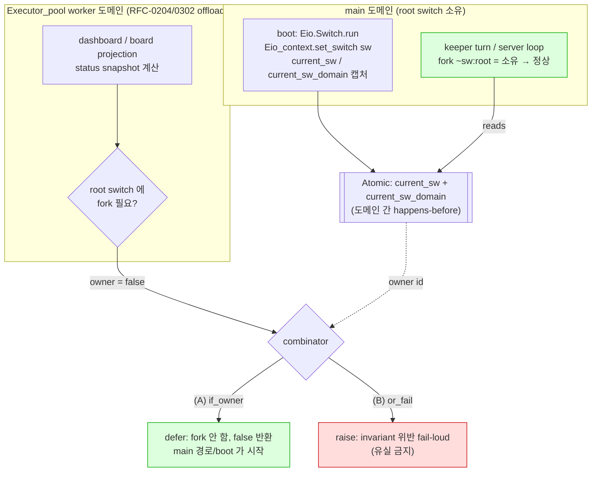

# RFC: Root-switch fork ownership — domain-local invariant as a typed combinator

## 1. Problem

masc 서버는 부팅 시 main 도메인에서 root `Eio.Switch.t` 를 열고, 그것을 **도메인 간 공유되는 `Atomic.t`** (`Eio_context.current_sw`) 에 저장한다. 그런데 Eio switch/fiber 는 **도메인-지역(domain-local)** 객체다 — 소유 도메인이 아닌 곳에서 `Eio.Fiber.fork ~sw` / `fork_daemon ~sw` 를 호출하면 런타임이 거부한다:

```
Invalid_argument("Switch accessed from wrong domain!")
```

masc 는 dashboard/board projection 등 일부 계산을 `Executor_pool`(Domain_pool) worker 도메인으로 offload 한다(RFC-0204, RFC-0302 방향). 그 worker 경로가 root switch 에 fork 를 시도하면 위 예외가 난다. 이건 이론이 아니라 프로덕션에서 두 번 관측됐다:

- **#25015 → #25033 (MERGED)**: `Keeper_board_attention_candidate.start_async` 가 worker 도메인(dashboard/status projection 이 `resume_pending`/`record_and_start` 호출)에서 root switch 에 fork → wrong-domain 거부 → catch 가 이를 `record_retryable_failure` 로 **원장에 write** → candidate 는 Pending 유지 → 매 projection 사이클마다 재시도 = **자기지속 write 폭주**(초당 수십 건, CPU/RSS 상승). judge 는 한 번도 안 돌았는데 실패로 기록한 category 오류가 flood 의 정체.
- **#25041 (MERGED)**: `Board_dispatch.ensure_flusher_actor` 가 같은 root switch 에 flusher daemon 을 fork. CAS-once + boot-order 로만 가려져 있던 잠재 결함.

두 사고 모두 **손으로 fork 사이트를 전수 추적**해야 발견됐다. invariant("root switch 는 소유 도메인에서만 fork") 가 **타입에도 구조에도 안 적혀 있고**, 인라인 주석에만 산재했다.

## 2. Root cause — 관습이지 타입이 아니다

근거(공식 문서):

- **Eio README, Multicore Support**: "Most Eio concurrency primitives (fibers, switches, basic conditions) are **not safe to share between domains**." 도메인 간 통신은 Stream/Promise(thread-safe) 로 한다.
- **OCaml 5.4 Domain**: `(Domain.self () :> int)` 는 프로그램 전체에서 재사용되지 않는 unique id. `self_index` 는 도메인 종료 후 재사용된다 → 지속 정체성 판별엔 전자.
- **OCaml Memory model**: `Atomic` 쓰기는 도메인 간 happens-before/가시성을 확립한다. 공유 plain `ref` 는 data race.

`nondeterministic-lane-analysis` 리포트 발견 ① 이 이 문제를 문자 그대로 진술한다: "10개 서브시스템 전부가 main 도메인 root switch 에 fork … **배치가 타입이 아니라 관습.**" 즉 "어느 도메인에서 실행되는가" 가 컴파일러가 강제하는 타입이 아니라, 각 호출부가 지켜야 하는 **암묵적 관습**이다. 관습은 새 호출부가 추가될 때 조용히 깨진다(#25015 가 그 실증).

## 3. Design — canonical combinator 를 SSOT 로

### 3.1 두 개의 sanctioned behavior (skip ≠ 항상 정답)

현재 worker-reachable root-switch fork 가드가 **3종 혼재**한다:

| 위치 | idiom |
|---|---|
| `start_async`, `ensure_flusher_actor` | proactive `Eio_context.root_switch_on_current_domain ()` |
| `dashboard_cache.ml`, `operator_control_snapshot_cache.ml` | reactive `try Fiber.fork with Invalid_argument _ -> inline` |
| `server_dashboard_http_runtime_info.ml` (×2) | `background_refresh_unavailable_domains` Hashtbl + `eio_switch_fork_unavailable` |

핵심 원칙: **일관성 = 메커니즘 복붙이 아니라 invariant 기준.** fork 되는 일이 어떤 성질인지에 따라 non-owning 도메인에서의 정답이 다르다:

- **(A) idempotent / restartable / singleton-at-boot** (board attention resume, dashboard refresh, flusher): non-owning 도메인에서 **defer**(fork 하지 않고 반환) 해도 안전하다. main 도메인 경로 또는 boot CAS-once 가 결국 시작하므로 유실·이중시작이 없다.
- **(B) loss-critical** (특정 persisted 요청을 처리하는 worker, 예: `keeper_msg_async` 의 background fork): non-owning 도메인에서 **defer(skip) 하면 메시지 유실**이다. 여기서 skip 은 버그를 조용히 삼키는 category (B) 오류다. → skip 이 아니라 **fail-loud(assert) 또는 main 도메인으로 라우팅(Stream/Promise)** 해야 한다.

따라서 combinator 는 하나가 아니라 **두 개의 명시적 진입점**을 제공한다:

```ocaml
(* Eio_context — 유일한 sanctioned root-switch fork 경로 *)

(* (A) idempotent/singleton: 비소유 도메인이면 fork 안 하고 false 반환.
   호출부는 반환값으로 "이번엔 안 떴다" 를 관측할 수 있어야 한다. *)
val fork_on_root_switch_if_owner :
  sw_of:(unit -> Eio.Switch.t option) -> (unit -> unit) -> bool

(* (B) loss-critical: 비소유 도메인이면 fork 하지 않고 raise (fail-loud).
   "이 fork 는 반드시 main 도메인에서만 도달해야 한다" 는 invariant 를
   런타임에서 강제한다. skip 으로 유실을 숨기지 않는다. *)
val fork_on_root_switch_or_fail :
  sw_of:(unit -> Eio.Switch.t option) -> (unit -> unit) -> unit
```

`sw_of` 를 인자로 받는 이유: 사이트마다 `get_root_switch_opt`(root) 와 `get_switch_opt`(turn-aware) 중 어느 것으로 switch 를 얻는지가 다르다. 소유권 판별(`root_switch_on_current_domain`)과 **같은 switch** 로 매칭해야 한다(#25041 의 board_dispatch 는 `get_switch_opt` 로 얻으면서 root 소유권으로 가드해 미세 불일치가 있었다 — combinator 가 이 짝을 강제한다).

### 3.2 도메인-소유 모델 (이 RFC 가 답하는 "도식화")



**과거(As-Is)**: 각 호출부가 `Fiber.fork ~sw:root` 를 직접 호출, 소유권 가드는 있으면 있고 없으면 없음(관습). **미래(To-Be)**: raw root switch 를 fork 대상으로 노출하지 않고, 위 두 combinator 만 노출. 도메인-소유는 combinator 안에 캡슐화되어 **호출부가 잊을 수 없다**.

### 3.3 왜 lint 가 아니라 combinator 인가

fork 사이트를 정규식으로 스캔하는 CI lint 는 **string/substring 분류기**(CLAUDE.md 워크어라운드 바 #2)다: fragile 하고, 새 문법 변형에 뚫리고, "가드가 근처에 있나" 를 텍스트로 추측한다. combinator 는 **모듈 경계**로 강제한다 — raw switch 를 fork 가능한 형태로 노출하지 않으면, 우회하는 코드는 애초에 컴파일되지 않는다("make illegal states unrepresentable", Parse-don't-validate).

### 3.4 강한 end-state (선택, 후속 phase)

`Eio_context` 가 `get_root_switch_opt : unit -> Eio.Switch.t option` 를 계속 노출하는 한, 누구든 raw switch 를 꺼내 직접 fork 할 수 있다. 최종형은 root switch 를 **private type 으로 감싸** fork 를 combinator 로만 허용하는 것이다. 단 이는 광범위한 호출부 변경이라 별도 phase 로 분리한다(이 RFC 의 §4 는 combinator 도입 + 기존 6사이트 라우팅까지).

## 4. Scope — 사이트 인벤토리

| # | 사이트 | 현재 idiom | 성질 | target |
|---|---|---|---|---|
| 1 | `Keeper_board_attention_candidate.start_async` | proactive (#25033) | (A) | `fork_on_root_switch_if_owner` |
| 2 | `Board_dispatch.ensure_flusher_actor` | proactive (#25041) | (A) singleton | `fork_on_root_switch_if_owner` |
| 3 | `dashboard_cache.ml` (~403) | reactive catch | (A) | `fork_on_root_switch_if_owner` |
| 4 | `operator_control_snapshot_cache.ml` (~181) | reactive catch | (A) | `fork_on_root_switch_if_owner` ⚠️ RFC-gated |
| 5 | `server_dashboard_http_runtime_info.ml` (×2) | unavailable-domains Hashtbl | (A) | `fork_on_root_switch_if_owner` |
| 6 | `keeper_msg_async.ml` (~2319) | **무가드** | **(B) loss-critical** | `fork_on_root_switch_or_fail` + invariant 문서화 |

사이트 4 (`lib/operator/operator_control*`) 는 CLAUDE.md `<agent_delegation>` 의 **RFC-게이트 subsystem** 이다. **이 RFC 가 그 게이트를 충족**한다.

## 5. Loss-critical 케이스 (`keeper_msg_async`) — skip 절대 금지

`keeper_msg_async` 의 `Eio.Fiber.fork_daemon ~sw:background_sw`(= server background = root switch) 는 특정 persisted 메시지를 처리한다. 현재는 "keeper turn 은 main 도메인에서만 돈다" 는 **미문서화 invariant** 로만 안전하다(이 invariant 를 명시하는 RFC 번호는 현재 없음 — 과거 세션이 "RFC-0059" 로 인용했으나 **실재하지 않는 참조**였다; 이 RFC 또는 companion 이 그 invariant 를 처음으로 명문화한다).

정답은 (B): `fork_on_root_switch_or_fail` 로 **비소유 도메인 도달을 fail-loud** 시키거나, 완전 검증 후 main 도메인 Stream 으로 라우팅한다. skip 가드를 붙이면 메시지가 조용히 사라진다. correctness-critical 이므로 (A) 사이트들과 **별도 PR + 완전 검증** 으로 진행한다.

## 6. Verification

- **단위**: `Eio.Domain_manager.run (Eio.Stdenv.domain_mgr env)` 로 worker 도메인을 띄워 `root_switch_on_current_domain () = false`, main 에서 `= true` 를 단언(#25033 의 `test_root_switch_ownership_is_domain_local` 패턴). combinator 도입 후 (A) 는 worker 에서 `false` 반환, (B) 는 worker 에서 raise 를 단언.
- **반사실(counterfactual)**: 가드를 되돌려 테스트가 FAIL 하는지 확인(테스트 실효성 증명).
- **TLA+ (선택)**: `KeeperOASAdvanced.tla` 스타일로 "wrong-domain fork 가 유실/폭주를 낳는다" 를 BugAction + invariant 로 모델링. clean=no error, buggy=invariant violated 양쪽 통과해야 spec 유효.

## 7. Non-goals

- Domain-pool 자체의 스케줄링/개수 정책(RFC-0302 영역).
- root switch 를 private type 으로 봉인하는 §3.4 강한 end-state(별도 phase).
- Cross-domain 통신 전반의 Stream/Promise 마이그레이션.

## 8. Appendix — nondeterministic-lane 리포트와의 관계 (후속 RFC 후보)

`reports/masc-nondeterministic-lane-analysis-2026-07-17.html` 는 이 fork 문제를 더 큰 패턴 군의 한 사례로 위치시킨다. 아래는 **리포트 주장을 그대로 옮긴 것이며, 각 항목은 착수 전 fresh read 로 재검증 필요**(confidence 표기; 이 RFC 저자는 §1~§7 만 직접 검증했다).

| 리포트 발견 | root fix 방향 | 후속 RFC 후보 | confidence |
|---|---|---|---|
| ① 배치가 관습 | **본 RFC** (domain-ownership combinator) | — | High (직접 검증) |
| ② bound idiom 3종·2개 dead | 공유 typed admission primitive(HITL claim-set 추출) | 신규 | Med (미검증) |
| ④ "영원 재시도, terminal 없음" repo-wide | 공유 FSM + typed retry-budget + `Exhausted` terminal (lane-cooldown 은 워크어라운드로 기각) | 신규 | Med (start_async defer 가 미니 사례) |
| ⑤ `run_safe` 부분 적용(3/5 judge 우회) | 예산+슬롯 가진 단일 bridge 로 LLM dispatch 통일 — **단 blast-radius 최대·bridge 자체가 bounded 여야 함**(무제한 큐를 한 층 위로 옮기지 말 것) | 신규 | Med (미검증) |
| §9 dead knob 15종 | 배선 또는 삭제(파싱-but-미사용 knob = 운영자 기만, "Unknown→Permissive" 안티패턴) | RFC-0032 확장 | Low (개별 확인 필요) |
| §6 P0 compaction summarizer가 keeper chat runtime 결합(12/16 keeper 영구 unavailable) | summarizer 를 chat runtime 에서 분리 | 신규 P0 | Low (미검증, 별건 #25051) |

**적대적 주의**: ⑤ "단일 bridge 통일 = 최고 레버리지" 는 리포트가 blast-radius/단일 병목 리스크를 언급하지 않는다. 최고 레버리지 = 최대 영향 반경. 단계적 + bridge 자체 bounded 를 전제하지 않으면 발견 ③(큐6→드레인1)을 한 층 위로 옮기는 것에 불과하다.

## 9. Rollout

1. **Phase 1** (본 RFC): `Eio_context` 에 두 combinator 도입 + (A) 사이트 1·2·3·5 라우팅. 단위 테스트 + 반사실.
2. **Phase 2**: 사이트 4(operator, RFC-gated — 본 RFC 가 게이트) 라우팅.
3. **Phase 3**: 사이트 6(`keeper_msg_async`, loss-critical) — `or_fail` + main-domain invariant 명문화. 완전 검증 후.
4. **Phase 4** (선택): §3.4 root switch private-type 봉인.
