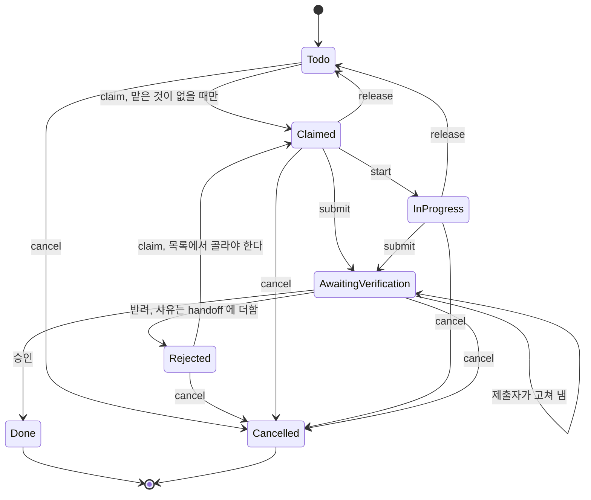

# RFC: Task 생애주기 — 판정은 제출에 답할 뿐 일을 맡기지 않는다

## 0. 요약

Task 하나에는 서로 다른 사실 세 가지가 들어 있다.

| 묻는 것 | 코드에서 | 써야 하는 쪽 |
|---|---|---|
| 이 Task 가 아직 필요한가 | `Done`·`Cancelled` 인가 아닌가 | 판정(끝났다고 닫는다), 만든 쪽과 운영자(취소한다) |
| 지금 누가 맡고 있는가 | `Claimed`·`InProgress` 의 `assignee` | 본인 |
| 끝났다는 제출이 판정을 기다리는가 | `AwaitingVerification` | 제출자(낸다), 판정(답한다) |

지금은 한 사실을 쓰는 쪽이 다른 사실까지 바꾼다. 세 군데다.

1. **판정이 일을 맡긴다.** 제출이 반려되면 Task 가 제출자의 `InProgress` 로 돌아간다. 제출자가 그사이
   무엇을 맡았는지는 보지 않는다. 지금 맡겨진 Task 17건 중 13건이 이렇게 돌아온 것이다.
2. **맡은 쪽이 Task 를 취소하려면 운영자를 기다린다.** 취소 요청 65건이 운영자 한 사람을 기다리고,
   가장 오래된 것은 345시간째다. 65건 중 49건은 GitHub 조회 한 번으로 확인되는 내용이다.
3. **그런데 그 문은 하나만 잠겨 있다.** 맡은 Task 를 놓은 다음(`release`) 취소하면(`cancel`) 아무 검사
   없이 바로 `Cancelled` 가 된다. 아무도 안 맡은 Task 는 누구나 취소할 수 있다.

이 RFC 는 사실마다 쓰는 쪽을 정한다. 상태 이름 여섯 개는 그대로 두고 전이 네 개를 바꾼다.

| # | 지금 | 바꾼 뒤 |
|---|---|---|
| 1 | 반려 판정이 Task 를 제출자의 `InProgress` 로 돌린다. handoff 는 판정 사유로 덮어쓴다 | 반려 판정은 Task 를 아무도 안 맡은 `Rejected` 로 놓는다. 제출자가 남긴 handoff 는 두고 사유를 더한다 |
| 2 | 맡은 쪽의 `Cancel` 은 판정을 기다리고 운영자만 승인한다 | 없앤다. 맡은 일을 더 하지 않게 되는 길은 §3.4 의 세 갈래다 |
| 3 | `Todo` 의 `Cancel` 은 누구나 즉시 된다 | `Cancel` 은 만든 쪽과 운영자만 한다. 어느 상태에서든 즉시 된다 |
| 4 | 제출에 `intent = Complete_task \| Cancel_task` 가 있다 | `intent` 를 지운다. 판정을 기다리는 것은 완료 제출뿐이다 |

새 상태는 `Rejected` 하나다(소유자 결정 D1). 타이머·Gate·액션 이름은 더하지 않고, 지워지는 것이 더
많다(§3.9).
목표 모델은 `specs/task-lifecycle/TaskOwnership.tla` 에 있고, 위 결함 각각을 버그 모델로 넣어
속성이 실제로 잡는지 TLC 로 확인했다(§4.1).

### 0.1 이 문서가 쓰는 말

코드에 있는 이름은 영어 그대로 쓴다. 우리말은 아래 열 개만 쓰고, 한 이름에 한 말만 붙인다.

| 이 문서의 말 | 코드 이름 | 뜻 |
|---|---|---|
| 만든 쪽 | `created_by` | 그 Task 를 만든 에이전트나 사람. 만들 때 한 번 적히고 바뀌지 않는다 |
| 맡다, 맡은 쪽, 담당 | `Claim`, `Claimed`·`InProgress` 의 `assignee` | 지금 그 일을 하고 있는 에이전트와 그 사실. 한 에이전트는 하나만 맡는다 |
| 놓다 | `Release` | 맡은 쪽이 Task 를 `Todo` 로 돌려놓는 것 |
| 제출, 제출자 | `Submit_for_verification`, `producer` | 맡은 쪽이 증거와 함께 "끝났다"고 내는 것과 낸 쪽. 제출하면 더는 맡고 있지 않다 |
| 판정 | `completion_verdict` | 제출에 대한 답. 승인(`Verdict_approved`)이거나 반려(`Verdict_rejected`)이다 |
| 반려된 Task | `Rejected` | 반려를 받고 아무도 안 맡고 있는 Task. 목록에서 골라야 맡는다 |
| 판정 에이전트, 운영자 | `System_llm_agent`, `Human_operator` | 판정을 내리는 두 쪽(`completion_authority`). Keeper 는 판정하지 못한다 |
| 취소 | `Cancel`, `Cancelled` | Task 를 없던 일로 하는 것 |
| 취소 요청 | `AwaitingVerification { intent = Cancel_task }` | 지금 코드에서 맡은 쪽이 cancel 하면 생기는 대기. 이 RFC 가 없앤다 |
| 운영자 목록 | `Operator_task_attention.item` | 운영자만 풀 수 있는 Task 를 모아 보여 주는 목록 |

`handoff` 는 `handoff_context` 를 줄여 부른 것이다.

판정의 두 값은 "승인" 과 "반려" 다. 결재 화면에서 쓰는 그 짝이고, 반려는 고쳐서 다시 낼 수 있다는
뜻까지 같다. 동작이 받아들여지지 않는 것(claim, 전이, 배포 전 검사)은 "거절" 로 따로 부른다. 코드에서도
`Verdict_rejected` 와 `Invalid_transition` 은 다른 것이다.

표준국어대사전에서 확인한 것 둘. `Release` 를 "놓다" 로 쓰는 것은 "계속해 오던 일을 그만두다"(놓다
「2」)에 기댄다. `Cancel` 을 "철회" 라 하지 않는 것은 철회가 "이미 제출하였던 것이나 주장하였던
것을 다시 회수하거나 번복함" 이라, 한 번도 제출된 적 없는 `Todo` 에는 맞지 않기 때문이다. "취소" 는
"예정된 일을 없애 버림" 이라 어느 상태에나 맞는다.

## 1. 실측 (2026-09-18 11:27Z, `<base-path>/.masc`, backlog version 6573)

Task 1,126건: `todo` 640, `done` 347, `awaiting_verification` 66, `cancelled` 56, `in_progress` 17.
열린 Task 723건 중 만든 쪽 이름이 `dashboard`·`admin`·`operator`·`masc-tui` 인 것은 4건이다. 나머지는
에이전트가 만들었다.

### 1.1 판정이 돌려보낸 Task 가 쌓인다

맡겨진 Task 17건을 누가 몇 개 맡고 있는지 보면 이렇다.

| 맡은 쪽 | 개수 | 마지막 handoff 를 쓴 쪽 | 어떻게 왔나 |
|---|---|---|---|
| `codex-mcp-client` | 9 | `verifier_exact` | 2026-09-12 판정 에이전트의 반려로 복귀 |
| `sangsu` | 3 | `masc-tui` | 2026-09-16 07:14~07:20 운영자 반려로 복귀. 사유 칸은 "no reason" 2건, "없음" 1건 |
| `polisher` | 1 | `verifier_exact` | 2026-09-18 10:43 판정 에이전트의 반려로 복귀 |
| 나머지 4명 | 각 1 | 본인 또는 없음 | 직접 claim |

한 번에 하나만 맡는다는 규칙을 어긴 12건은 전부 판정이 돌려보낸 것이다. 직접 claim 해서 둘 이상을
맡은 경우는 없다.

- 한 번에 하나만 맡는지 보는 검사는 claim 에만 있다: `workspace_task_claim.ml:20-35` 가 본인의
  `Claimed`·`InProgress` 를 세고, 적용 지점은 `claim_task_r`, `transition(Claim)`, `claim_next_r` 셋이다.
  `commit_verdict_r`(`workspace_task_transitions.ml:812-1180`) 에는 이 검사가 없다.
- 반려 판정은 `InProgress { assignee; started_at }` 와 `set_current = Some task_id` 를 돌려준다
  (`workspace_task_lifecycle.ml:291-300`). 제출자가 지금 다른 Task 를 하고 있어도 에이전트 기록의
  `current_task` 칸을 덮어쓴다(`workspace_task_transitions.ml:969-973`).
- 돌아온 Task 는 Keeper 프롬프트에 안 보인다. Current Task 블록은 하나뿐이고,
  `keeper_current_task_reconcile` 은 이미 current 인 Task 를 유지한다(`:88-131`). Keeper 는 다음 claim 에서
  처음으로 "already holds task-N" 을 본다. 한 주 claim 거절 77건 중 38건이 이 거절이었다
  (`workspace_task_claim.ml:51-55` 주석).
- 반려 커밋은 handoff 를 통째로 바꾼다. summary 와 reason 은 판정 사유가 되고 `evidence_refs` 는
  `[verification_id]` 하나가 된다(`workspace_task_transitions.ml:910-924`). 제출자가 적어 둔 브랜치·PR
  위치는 여기서 사라진다. `vrf-…` 는 Keeper 가 열 수 있는 참조 형식도 아니다. 열 수 있는 형식은
  `artifact:`, `note:`, `board:`, `fusion:` 넷이다(`workspace_verification_store.ml:904-921`).
- "취소가 안 돼서 다른 Task 를 못 한다"는 Keeper 의 말은 절반이 사실이다. 판정을 기다리는 Task 는 claim 을
  막지 않는다. 반려된 Task 는 돌아와서 막는다.

RFC-0455 §3.2 는 이 가운데 한 경우만 고쳤다. 제출자에게 Keeper 큐가 없으면 전달 단계에서 `Todo` 로
되돌린다. 제출자가 Keeper 이면 여전히 `InProgress` 로 돌아간다. 같은 자리의 두 번째 수정이므로
(#36461, RFC-0455 §3.2) 세 번째는 원인을 고친다.

### 1.2 취소 요청 65건이 운영자 한 사람을 기다린다

`awaiting_verification` 66건 중 65건이 `intent = cancel` 이다. 가장 오래된 것은 345시간, 중앙값은
161시간이다. 판정 에이전트는 취소 요청을 판정하지 않고 `Operator_routed` 로 적기만 한다
(`completion_authority_agent.ml:758-773`). 실행 기록(`verification-runs.jsonl`)의 verification id
70개를 마지막 결과로 나누면 `operator_routed` 65, `approved` 3, `rejected` 1, `not_reviewed` 1 이다.

65건이 가리키는 이슈·PR 번호를 GitHub GraphQL 한 번으로 조회했다.

| 조회 결과 | 건수 | 뜻 |
|---|---|---|
| 병합된 PR | 30 | 조회만으로 확인된다 |
| 닫힌 이슈 | 19 | 조회만으로 확인된다 |
| 병합 없이 닫힌 PR | 5 | 읽어 봐야 한다. 그중 4건은 요청문이 "닫힌 이슈"라고 적었다 |
| 아직 열린 이슈 | 7 | 읽어 봐야 한다. 다른 PR 이나 운영자 결정을 근거로 든다 |
| 번호 없음 | 4 | 운영자 결정 인용, 중복 Task, 직접 실측 |

- 취소를 요청한 쪽이 만든 쪽이 아닌 것이 50건이다. 그중 30건은 `goo-yang-bong` 이 `codex-mcp-client` 가
  만든 오래된 Task 를 정리하다 낸 것이다.
- 네 건(task-563, task-609, task-650, task-1282)은 요청문에 운영자가 `masc_ask` 로 이미 내린 결정을
  적었다. 운영자는 한 번 결정했고, 같은 결정을 검증 화면에서 한 번 더 눌러야 끝난다.
- 판정 에이전트가 쓰는 조회 도구는 `tool_read_file`, `tool_search_files`, `masc_web_fetch`,
  `masc_board_post_get`, `masc_fusion_status` 다(`verification_authority_tools.ml:7-22`).
  공개 저장소의 PR·이슈 URL 은 지금 도구로 열 수 있다.

**2026-09-19 처리.** 이 65건은 소유자 결정(§7 D3)으로 운영자 일괄 승인해 모두 `Cancelled` 이 됐다.
사유 칸에는 요청한 Keeper 가 쓴 문장을 그대로 넣었다(task-361 한 건만 기본 문구가 들어갔고, 원문은
전이 로그에 남아 있다). 판정 대기는 task-581 하나만 남았다. 아래 수치는 처리 전 상태다.

요청문을 읽고 나누면 65건 중 58건은 "하면 안 되는 일"이 아니라 "결과가 이미 있는 일"이라는 말이다.
나머지 7건은 운영자 결정을 인용한 것 3건, 전제가 틀렸다는 것 4건이다. 도구 설명이 그렇게 안내한다:
`keeper_task_cancel` 의 `when_to_use` 는 "the defect was fixed elsewhere" 다
(`config/tools/keeper_task_cancel.toml:37`).

### 1.3 그 문은 하나만 잠겨 있다

- `Cancel, Todo -> cancelled` 에는 호출자 검사가 없다(`workspace_task_lifecycle.ml:113-114`).
  전이 계층도, 도구 계층도(`tool_task.ml:134-167` 은 `Release` 만 검사), `keeper_task_cancel`
  핸들러도(`keeper_tool_task_runtime.ml:985-1030`) `created_by` 를 읽지 않는다.
- 그래서 맡은 쪽은 `release` 다음 `cancel`, 두 번의 호출로 혼자 `Cancelled` 에 닿는다. RFC-0417 이
  막으려던 바로 그 길이다. 잠긴 문으로 온 65건만 줄을 서 있다.
- 이미 취소된 56건 중 53건은 만든 쪽 본인이 취소했다. 남이 취소한 3건은 운영자 결정 1건, "이미 main 에
  고쳐져 있다" 1건, 전제가 없어진 것 1건이다.

### 1.4 검증 화면은 두 가지 대기를 구분하지 못한다

- TUI 검증 화면의 줄 타입 `verification_request` 에는 `intent` 칸이 없다(`lib/tui_decode.ml:2594-2603`,
  decoder `:5234-5250`). 운영자는 그 줄이 완료 제출인지 취소 요청인지 모르고 누른다.
- Keeper 에게 가는 알림에도 `intent` 가 없다. 승인과 반려의 payload 타입
  (`lib/keeper_runtime/keeper_event_queue.ml:114-128`, `:237-242`)에 그 칸이 없어서, 취소 승인은
  "Task … evidence approved" 로, 취소 반려는 "Completion evidence rejected for task …" 로 도착한다
  (`config/prompts/keeper.md:290`, `:296`).
- 반려에 빈 사유를 막는 검사(`Verdict_rejection_reason_required`)는 "no reason" 과 "없음" 을 통과시켰다.
  글자 수 검사로는 성의 없는 반려를 막지 못한다.

### 1.5 판정이 멈춘 완료 제출은 아무에게도 안 보인다

완료 제출 1건(task-581)이 35시간째 기다린다. 판정 에이전트는 `not_reviewed`,
gate `evaluator_unavailable` 로 끝냈다: "The admitted verifier slot cannot consume the submitted media".
`retryable` 이 없어 재시도 타이머가 서지 않고(`completion_authority_agent.ml:583-591`), 운영자 목록은
완료 제출을 일부러 뺀다(`operator_task_attention.ml:86-89`). 고칠 수 있는 사람은 운영자뿐인데
운영자에게 닿는 길이 없다.

### 1.6 지금 스펙은 이 결함을 볼 수 없다

`specs/task-lifecycle/TaskLifecycle.tla` 는 Task 하나에 변수 `state` 하나다. 에이전트가 없으므로
"제출자가 그사이 다른 Task 를 맡았다"를 표현할 수 없고, `ApplyConfiguredLlmFail` 이 `InProgress` 로
돌아가는 것을 정상 동작으로 적었다. `Cancel` 은 모든 상태에서 즉시 `Cancelled` 로 모델링돼 있어
코드와도 다르다.

### 1.7 같은 것을 부르는 이름이 여럿이고, 없어도 되는 것이 있다

| 같은 것 | 부르는 이름 | 이 RFC 가 하는 일 |
|---|---|---|
| 제출한 에이전트 | 판정 쪽 코드의 `producer`, 상태의 `assignee`, verification 레코드의 `worker`(`lib/verification.ml:40-47`) | 상태의 칸을 `producer` 로 맞춘다. 새 이름을 만들지 않는다 |
| Task 를 만든 에이전트 | 필드 `created_by`, 코드의 `self_authored`, 프롬프트의 "authored by you" 와 "Tasks You Created" | 건드리지 않는다. 이 문서는 `created_by` 하나로 부른다 |
| 에이전트가 지금 하는 Task | 에이전트 기록의 `current_task`, Keeper meta 의 `current_task_id`, planning 의 current task(`tool_task_handlers.ml:81-108`) | 건드리지 않는다. 셋 다 backlog 에서 다시 계산되는 표시다 |
| 맡고 있는 상태 | `Claimed` 와 `InProgress` | §7 D6 |
| handoff 의 글 | `summary` 와 `reason`. 반려는 둘에 같은 문장을 쓴다 | 반려가 `reason` 에만 쓰게 한다(§3.3) |

| 없어도 되는 것 | 근거 | 이 RFC 가 하는 일 |
|---|---|---|
| 액션 `Done_action` | 커밋되는 경우가 없다. 거절되거나 그대로다(`workspace_task_lifecycle.ml:100-111`) | 지운다(§3.9) |
| 제출의 `intent` | 취소 요청이 없어지면 값이 하나뿐이다 | 지운다 |
| `Claimed` | 허용 여부를 가르는 곳이 `Start` 하나다. Keeper 의 claim 은 곧바로 Start 를 보낸다(`keeper_tool_task_runtime.ml:779-806`). 지금 `claimed` 인 Task 는 0건이다 | §7 D6 |
| `cycle_count` | TUI 한 줄에만 쓰인다(`bin/masc_tui_render.ml:871`) | 건드리지 않는다 |
| `reclaim_policy`, `do_not_reclaim_reason` | 헌법이 "claim 을 막지 않는다"고 적었다. 읽는 곳은 release 와 cancel 의 기록 전달뿐이다 | 건드리지 않는다 |

## 2. 원칙

1. **사실마다 쓰는 쪽이 정해져 있다.** §0 의 첫 표가 그것이다. Task 가 닫히면 담당과 제출도 같이
   끝난다. 닫힌 Task 는 누구에게 일을 남기지도, 무엇을 기다리지도 않는다. 그래서 Task 를 닫을 수 있는
   쪽은 담당과 제출도 함께 비운다. 선을 넘는 쓰기는 이것 하나다.
2. **판정은 제출에 답할 뿐이다.** 승인은 Task 를 닫고, 반려는 Task 를 아무도 안 맡은 자리로 돌려
   놓는다. 누가 다음에 일할지는 정하지 않는다. 이 저장소의 자율성 원칙 그대로다: 원장은 사실을
   기록하고, 다음 행동은 Keeper 가 고른다.
3. **운영자만 답할 수 있는 종류의 제출을 두지 않는다.** 판정이 고장 나서 운영자가 고쳐야 하는 경우는
   남는다. 그런 자리는 목록으로 보여 준다(RFC-0455 §2).
4. **시간은 아무것도 닫지 않는다.** `no_wall_clock_death` 를 그대로 따른다.
5. **상태·필드·Gate·이름은 없을 때 사실이 망가지는 경우에만 더한다.** 이 RFC 는 필드 하나의 이름을
   코드가 이미 쓰는 말로 바꾸고 하나를 지운다. 더하는 것은 없다.

## 3. 설계

### 3.1 타입

```ocaml
(* lib/types/types_core.mli *)
type task_status =
  | Todo
  | Claimed of { assignee : string; claimed_at : string }
  | InProgress of { assignee : string; started_at : string }
  | AwaitingVerification of
      { producer : string           (* 예전 assignee. 이 Task 를 맡고 있지 않다 *)
      ; started_at : string
      ; submitted_at : string
      ; verification_id : string    (* intent 칸은 없다 *)
      }
  | Rejected of
      { producer : string           (* 반려된 제출을 낸 쪽. 지금 맡고 있지는 않다 *)
      ; verification_id : string    (* 반려된 그 제출 *)
      ; rejected_at : string
      }
  | Done of { assignee : string; completed_at : string; notes : string option }
  | Cancelled of { cancelled_by : string; cancelled_at : string; reason : string }
```

- 이름은 비어 있다. `task_status` 에 `Rejected` 는 없다. 다만 이벤트 종류에는 이미 있고
  (`event_kind.ml:11`), 줄에 `task.rejected` 로 나간다(`:23`). 반려를 기록할 이벤트 종류를 새로
  만들 필요가 없다는 뜻이다. 대신 로그에서 `rejected` 로 거르면 "판정이 반려였다"는 사건과 "Task 가
  반려된 채 있다"는 상태가 같이 걸린다. 둘은 다른 것이다.
- `assignee` 를 `producer` 로 바꾸면 이 생성자를 패턴 매치하는 자리는 컴파일러가 짚는다: orphan 점검
  (`workspace_query.ml:247-252`), Keeper 설정 제거 거절(`keeper_configuration_removal.ml:170-178`),
  대시보드 rollup(`server_dashboard_http.ml:607-613`), `task_actor_of_status`(`types_core.ml:303-309`).
- **`task_actor_of_status` 는 어느 갈래를 주느냐가 곧 설계다.** "이 Task 에 누가 있나"의 기준이 저
  함수 하나이고, 세 갈래가 거기서 파생된다. 소유(`task_assignee_of_status`, `:314`), 수행자
  (`task_performer_of_status`, `:325`), 화면 표시(`task_display_assignee`, `:331`). 있는 값 중에는
  맞는 것이 없다. `Submitter producer` 를 주면 `task_assignee_of_status` 가 `Some producer` 라고
  답하고, 아무도 안 맡은 Task 가 다시 "네 것" 이 된다. 이 RFC 가 없애려는 바로 그 문장이다.
  `Unassigned` 를 주면 낸 사람 이름이 세 갈래 모두에서 사라져서, 상태에 칸을 만든 이유가 없어진다.
  그래서 `task_actor` 에 갈래를 하나 더한다. 소유에는 `None`, 수행자에는 `Some producer`, 화면에는
  이름을 준다. 1단계에 넣는다.
- 맡은 개수를 세는 자리는 `task_status` 를 직접 보므로(`workspace_task_claim.ml:20-35`) 컴파일러가
  짚어 준다. `Rejected` 는 세지 않는다.
- 컴파일러가 못 짚는 자리가 더 크다. `task_assignee_of_status` 가 `AwaitingVerification` 에 `None` 을
  답하게 되는데 반환형이 같아서 호출자는 그대로 컴파일된다. 손으로 봐야 하는 호출자:
  `lib/fusion/fusion_decision.ml:144` 와 `lib/fusion/fusion_request_context.ml:97`(제출한 Keeper 의
  Fusion 요청이 "맡은 Task 가 아니다"로 거절되는지), `lib/server/masc_grpc_service.ml:39-49`
  (`assigned_to`), `lib/task/tool_task.ml:137`·`:268`, `workspace_task_transitions.ml:272`·`:509`,
  `lib/server/server_routes_http_runtime_fleet_scan.ml:873`. `task_performer_of_status` 는 그대로
  제출자를 답한다.
- **`=` 로 상태를 견주는 자리 세 곳은 컴파일러가 절대 못 짚는다.** `match` 가 아니라 구조적 동등
  비교라 타입이 그대로여서 조용히 지나간다. 셋 다 "열려 있고 아무도 안 맡은 일"을 세는 자리이고,
  셋 다 `Rejected` 를 빼놓는다. 이건 D1 이 기대는 바로 그 신호다.
  `lib/keeper/keeper_world_observation_inputs.ml:196-201`(Keeper 가 매 턴 읽는 프레임의 미claim 수)와
  `lib/dashboard/dashboard_attention.ml:91`(노는 에이전트와 함께 주의를 올리는 조건). 1단계에서 둘 다
  고친다. 세 번째로 같은 모양인 `lib/orchestrator.ml:43` 은 고치지 않는다. 부르는 곳은 같은 파일 `:87`
  의 소비자뿐이고, 그건 `MASC_ORCHESTRATOR_ENABLED`(기본 꺼짐, `:20-22`) 뒤에서 info 로그 한 줄만
  낸다. 동작은 이미 지워졌다. 껍데기에 새 상태를 태우지 않고 §5 로 넘긴다. 비슷해 보이는
  `workspace_task.ml:329`·`:468` 은 레코드를 짓는 자리라 해당 없다.
- **집계가 고정 튜플이면 컴파일러는 "빈칸을 채워라"까지만 시킨다.** 대시보드 rollup 은 다섯 칸짜리
  튜플로 접고 JSON 키도 다섯으로 고정이다(`server_dashboard_http.ml:604-616`, `:627-634`).
  `| Todo | Rejected _ -> todo + 1` 로 채우면 컴파일도 통과하고 키도 그대로라, 반려된 Task 가
  `todo` 로 세어진다. D1 이 없애려는 혼동이 빌드 초록인 채로 생긴다. 여섯째 칸과 새 키가 필요하다.
- **`Todo` 에 칸을 더하는 쪽이 아니라 생성자를 더하는 쪽이다.** 담는 내용은 같다. 스펙이 실제로 칸으로
  모델링하고 있고 그래도 맞는다. 코드는 다르다. `Todo` 의 칸으로 쓰면 뒤에 오는 `| Todo _ ->` 가 둘을
  말없이 같이 덮는데, 둘은 같이 굴면 안 된다. `Todo` 는 아무 이름도 안 들고 있어 운영자만 취소할 수
  있고, `Rejected` 는 낸 쪽을 들고 있어 그 사람이 취소할 수 있다(§3.5). 생성자로 쓰면 어느 arm 도
  컴파일러에게 안 물어보고 둘을 합칠 수 없다. 2026-09-19 리뷰에서 나온 물음이다.
- `Rejected` 는 열려 있고 아무도 안 맡은 자리다. `Todo` 와 다른 점은 누가 냈던 것인지를 Task 자신이
  말한다는 것 하나다. 반려 사유는 지금처럼 handoff 에 있고 여기 옮겨 적지 않는다. 한 사실을 두 곳에
  적지 않기 위해서다.
- `producer` 는 기본값 없이 디코드한다. 지금 디코더는 빠진 문자열을 `""` 로 읽는다
  (`types_core.ml:439`, `:473`). 그대로 두면 `producer` 가 없는 옛 줄이 빈 이름의 제출로 읽힌다.
  `strict_parse_no_default` 위반이고 같은 단계에서 고친다.
- `verification_intent` 와 `Cancel_task` 는 사라진다. 대신할 칸은 두지 않는다(§5).
- `Done.assignee` 는 "승인된 제출을 낸 쪽"을 뜻한다. 결과물을 직접 만들었는지, 이미 있는 것을 찾아서
  냈는지는 `Done` 에 남지 않는다. 그 차이는 제출의 증거가 말한다.
- `Cancelled.reason` 은 `string option` 에서 `string` 이 된다. 지금 56건은 모두 사유가 있어 그대로 읽힌다.
- 액션 이름 `Cancel` 과 도구 이름 `keeper_task_cancel` 은 그대로 둔다. 바뀌는 것은 누가 할 수 있는가다.

### 3.2 전이 표

`본인` 은 `same_task_actor` 가 참인 호출자다. 빈칸은 `Invalid_transition`.

| 액션 \ 상태 | `Todo` | `Claimed`·`InProgress` | `AwaitingVerification` | `Rejected` | `Done` | `Cancelled` |
|---|---|---|---|---|---|---|
| `Claim` | 맡은 것이 없으면 `Claimed` 가 된다 | 본인: 그대로. 남: 거절 | `Verification_pending_verdict` | `Todo` 와 같다. 다만 자동으로 권하지 않는다 | 그대로 | |
| `Start` | | 본인의 `Claimed` 가 `InProgress` 가 된다 | | | 그대로 | |
| `Release` | 그대로 | 본인: `Todo` 가 된다 | | | | |
| `Submit_for_verification` | | 본인: `AwaitingVerification { producer }` 가 된다 | 제출자 본인: 새 `verification_id` 로 교체 | | | |
| `Cancel` | 자격이 있으면 `Cancelled` | 자격이 있으면 `Cancelled` | 자격이 있으면 `Cancelled` | 자격이 있으면 `Cancelled` | | 그대로 |



`cancel` 은 만든 쪽과 운영자만 한다. 판정에서 나가는 화살표는 `Done` 과 `Rejected` 둘뿐이고, 어느
것도 누군가의 `InProgress` 로 가지 않는다. `Rejected` 는 `claim_next` 가 자동으로 권하지 않는다.
낸 사람이 알림에 붙은 id 로 다시 맡거나, 목록을 보고 고른 Keeper 가 맡는다(§3.7).

**"맡을 수 있다" 와 "권한다" 는 지금 같은 함수다.** id 로 맡는 길과 `claim_next` 가 고르는 길이 둘 다
`task_claim_decision_for_status` 하나를 본다(`types_core.ml:643-664`). id 로 맡는 쪽은
`resolve_claim` 이 그 답을 읽고(`workspace_task_lifecycle.ml:35-54`), `claim_next` 는 같은 답을 후보
거르개로 쓴다(`workspace_task_schedule.ml:247`). 그래서 `Rejected` 를 그 함수에 한 줄로 더하면 두 길이
같이 정해진다. 맡을 수 있게 하면 `claim_next` 도 권하고, 권하지 않게 하면 아무도 못 맡는 무덤이 된다.
D1 을 하려면 축을 갈라야 한다. `task_claim_decision_for_status` 는 `Rejected` 를 `Todo` 와 같이
받아들이고, `task_claim_next_action` 이 파생을 그만두고 자기 `match` 를 가져서 `Rejected` 만 건너뛴다.
건너뛰는 이유는 `task_claim_block` 에 없는 값이므로 그 합타입에 한 줄을 더한다. 1단계에 넣는다.

지금과 달라진 것은 `Cancel` 줄이다. 맡은 쪽의 `Cancel` 이 `AwaitingVerification` 으로 가던 칸이 없어지고,
어느 상태에서든 자격이 있는 쪽만 즉시 취소한다. `Cancel` 은 이제 상태만으로 정해지지 않으므로 `decide` 가
호출자의 자격(§3.5)을 인자로 받는다. 거절 문장에 붙는 `valid_next_actions`
(`workspace_task_lifecycle.ml:308-337`)도 호출자의 자격으로 계산한다. 그러지 않으면 모든 호출자에게
cancel 을 권하거나 만든 쪽에게도 안 보여 주게 된다.

### 3.3 판정 표

| 판정 | 결과 | `set_current` | 제출자에게 |
|---|---|---|---|
| 승인 | `Done { assignee = producer }` | `None` | 지금과 같은 승인 알림 |
| 반려(사유 필수) | **`Rejected { producer; verification_id; rejected_at }`**. handoff 는 아래 설명대로 | **`None`** | 알림 한 건(§3.6). 의무는 없다 |
| 판정하지 못함(판정 에이전트 장애, 설정 오류) | 그대로 `AwaitingVerification` | — | §3.7 |

- **반려의 handoff.** 제출자가 제출하면서 남긴 `summary` 와 `evidence_refs` 는 그대로 둔다. 다음에 맡는
  쪽이 브랜치와 PR 위치를 거기서 읽는다. 판정 사유는 `reason` 에만 넣고 `updated_by` 는 판정한 쪽이다.
  `evidence_refs` 에 `verification_id` 를 넣지 않는다. 열 수 없는 참조이기 때문이다. 그 id 는 반려 알림과
  전이 로그에 있다.
- **제출의 증거는 제출 호출이 실은 handoff 와 notes 에서만 읽는다.** 지금은 호출에 handoff 가 없으면
  Task 에 저장된 handoff 를 대신 읽는다(`workspace_task_verification.ml:29-45`). 돌아온 Task 를 남이
  이어받는 이 설계에서는 앞사람의 증거와 판정 사유가 새 제출의 증거로 들어가게 된다. 저장된 handoff 는
  증거로 읽지 않는다. 이걸 떼면 증거 없는 제출이 생기지 않느냐는 물음이 나왔는데, 안 생긴다. 제출은
  이미 그 앞에서 막힌다. `notes` 도 비고 호출에 온 handoff 의 `summary` 도 비면 `InvalidState` 로
  거절되고, 그 검사는 저장된 handoff 를 보지 않는다(`workspace_task_transitions.ml:325-337`). 그
  검사를 지나온 제출은 호출에 `notes` 나 `summary` 중 하나를 들고 있고, 둘 다 증거 목록에 들어간다.
- 판정 토큰은 그대로 `APPROVE | REJECT(reason)` 다(`config/tools/report_review_verdict.toml`).
  바뀌는 것은 반려가 **하는 일**이다. 반려는 기록이고, 일을 맡기는 행위가 아니다.
- `Verdict_cancel_requires_operator`, `admission_of_status` 의 `Operator_routed` 갈래,
  `Verification_run_registry.Operator_routed` 는 지워진다. 판정할 취소 요청이 없다.
- RFC-0455 §3.2 의 "받을 Keeper 가 없으면 `Todo` 로"(`completion_authority_wakeup.ml:141-189`)는
  일반 규칙에 흡수되어 지워진다. 전달 단계는 **알릴지**만 정하고 상태를 바꾸지 않는다.
- 판정이 도착했는데 Task 가 이미 취소됐거나 제출이 교체됐으면 멈춤으로 알리지 않는다. 지금은 커밋 오류가
  전부 `Commit_failed { detail : string }` 하나로 뭉쳐 "producer or operator must act" 글이 올라간다
  (`completion_authority_agent.ml:739-741`). 판정을 기다리는 Task 를 취소하는 길이 생기면 이 경우가
  늘어난다. "물음이 사라졌다"와 "쓰지 못했다"를 닫힌 합으로 가르고, 앞의 것은 실행 기록에만 남긴다.
- 운영자 판정 요청은 자기가 본 `verification_id` 를 실어 보낸다. 지금은 서버가 커밋 직전의 id 를 읽어
  넣어서(`server_routes_http_routes_verification.ml:134-145`), 운영자가 N번째 제출을 보는 사이
  다시 제출되면 클릭이 N+1번째에 적용된다. 판정 에이전트 쪽에는 이미 있는 검사다
  (`Verification_id_mismatch`).

### 3.4 맡은 일을 더 하지 않게 되는 세 갈래

| 맡은 쪽의 사정 | 하는 일 | 걸리는 시간 |
|---|---|---|
| 못 하겠다, 안 하겠다 | `release` 하고 어디까지 했는지 적는다 | 즉시 |
| 이미 끝나 있다 | 평소처럼 제출한다. 증거로 결과물이 있는 곳을 단다(`note:` 에 PR·이슈 URL) | 판정 한 번. 오늘 승인 3건은 88~486초 걸렸다 |
| 하면 안 되는 일이다 | 내가 만든 Task 면 `cancel`. 아니면 이유를 적어 `release` | 즉시 |

둘째 줄에 새 장치는 없다. 판정이 묻는 것은 어느 경우든 "증거가 완료 조건을 보여 주는가"이고, 판정
에이전트는 증거가 가리키는 곳을 연다. 바뀌는 것은 도구 설명이 이 길을 가리키게 하는 것뿐이다(§3.8).

셋째 줄에서 만든 쪽이 아니면 Task 를 취소하지 못한다. 놓으면서 이유를 남기고, 원하면 만든 쪽이나
운영자에게 메시지를 보낸다. 보통 메시지이고 답할 의무를 만들지 않는다. 대기 중인 65건에서 이 갈래에
드는 것은 7건이고, 그중 만든 쪽 본인이 낸 것은 바로 취소할 수 있다.

### 3.5 취소할 자격

초안은 자격을 `created_by` 로 정했다. 2026-09-19 교차 리뷰가 그걸 깼다. `created_by` 는 클라이언트가
스스로 적어 보낸 문자열이고, claim 은 서버가 중재한 원자적 사건이다. 같은 "누구냐" 인데 믿을 수 있는
정도가 다르다. 문자열로 자격을 가르면 `codex-mcp-client` 라는 한 이름을 공유하는 299건이 한꺼번에
열린다. 그래서 자격의 근거를 **상태가 들고 있는 이름**으로 옮긴다.

```ocaml
type cancel_standing =
  | Named_by_state                       (* 그 상태가 이름을 들고 있는 바로 그 에이전트 *)
  | Operator of { operator_id : string } (* 인증된 운영자 경로에서만 *)
```

`Named_by_state` 는 자기 함수를 갖는다. 있는 함수를 그대로 쓰면 안 된다는 것이 2026-09-19 리뷰에서
나왔다.

```ocaml
let cancel_standing_name = function
  | Todo -> None
  | Claimed { assignee; _ } | InProgress { assignee; _ } -> Some assignee
  | AwaitingVerification { producer; _ } | Rejected { producer; _ } -> Some producer
  | Done _ | Cancelled _ -> None
```

갈래를 다 적어서 상태가 늘면 컴파일러가 여기를 짚게 한다.

왜 있는 것을 못 쓰는지가 중요하다. `task_actor_of_status` 는 `Done` 에 `Completer name`, `Cancelled` 에
`Canceller name` 을 돌려준다. 이름을 들고 있다. 그걸 그대로 자격으로 읽으면 끝낸 사람이 자기 `Done` 을
뒤집을 수 있다. 한 칸 아래 `task_assignee_of_status` 는 그 둘에 `None` 을 답해서 그 문제가 없는데
(`types_core.ml:314-319`), 이번에는 `Rejected` 에서 갈린다. §3.1 이 `Rejected` 의 소유를 `None` 으로
정했기 때문이다. 아무도 안 맡은 Task 가 다시 "네 것" 이 되지 않게 하려는 결정이었다.

**"누가 이 일을 지고 있나" 와 "누가 이 일을 접을 수 있나" 는 다른 물음이고, `Rejected` 한 자리에서
갈린다.** 반려된 Task 를 지고 있는 사람은 없지만, 더 안 하기로 정할 수 있는 사람은 낸 쪽이다. 두 물음을
한 함수로 합치면 둘 중 하나가 틀린다.

끝 상태는 전이 표가 먼저 막는다. `Cancel` 은 `Done` 에서 `Invalid_transition` 이고
(`workspace_task_lifecycle.ml:152`), `Cancelled` 에서는 상태를 그대로 돌려주는 멱등이다(`:112`). 그래서
위 함수의 `None` 두 줄은 두 번째 자물쇠다.

| 상태 | 취소할 수 있는 쪽 | 왜 |
|---|---|---|
| `Todo` | 운영자만 | 상태가 아무 이름도 안 들고 있다 |
| `Claimed`·`InProgress` | 맡은 쪽, 운영자 | 자기가 하던 일을 접는 것이다. 남의 일을 지우는 게 아니다 |
| `AwaitingVerification` | 낸 쪽, 운영자 | 자기가 낸 제출을 물리는 것이다 |
| `Rejected` | 낸 쪽, 운영자 | 반려를 받고 더 안 하기로 하는 것이다 |
| `Done`·`Cancelled` | 아무도 | 끝났다 |

- **취소 요청이 없어진다.** 자격 있는 쪽이 어느 상태에서든 즉시 취소한다. 345시간짜리 줄은 맡은 쪽이
  **물어봐야** 해서 생겼다. 그냥 하게 하면 물어볼 일이 없으므로 줄이 구조적으로 안 생긴다.
- **`release` 다음 `cancel` 구멍이 닫힌다.** 새 칸을 만들지 않고 닫힌다. 놓고 나면 상태가 `Todo` 이고
  `Todo` 는 아무 이름도 안 들고 있으므로, 놓은 본인도 더는 취소하지 못한다. 운영자만 남는다.
- **`Operator` 는 인증된 운영자 경로에서만 만든다.** 판정의 `Human_operator` 가 만들어지는 방식과 같다
  (`server_routes_http_routes_verification.ml:134-145`). `masc_transition` 과 Keeper 도구는
  `Named_by_state` 만 만들 수 있다. 지금 TUI 의 Task 취소는 `masc_transition` MCP 호출이고
  (`bin/masc_tui.ml:3640-3646`, `bin/masc_tui_mcp.ml:293-298`) 호출자 이름은 세션이 스스로 적는다. 이름이
  `masc-tui` 면 운영자로 치는 식으로 구현하면 아무 MCP 클라이언트나 운영자가 된다. TUI 와 dashboard 의
  취소는 인증된 경로로 옮긴다.
- **`created_by` 는 자격에서 빠진다.** 자동 claim 대상에서 자기가 만든 `Todo` 를 빼는 데는 계속 쓴다.
  그건 편의이지 권한이 아니다.

**무엇이 넓어지고 무엇이 좁아지나.** 지금보다 좁아지는 쪽이 위험한 쪽이다.

| | 지금 | 바꾼 뒤 |
|---|---|---|
| 아무도 안 맡은 Task | 누구나 취소 | 운영자만 |
| 맡은 Task | 맡은 쪽이 요청하고 승인을 기다림 | 맡은 쪽이 즉시 취소 |
| 놓고 나서 | 누구나 즉시 취소(승인 우회) | 운영자만 |

**대가.** Keeper 가 판정 없이 자기 일을 끝낼 수 있다. 제출해 놓고 판정을 기다리는 중에도 그렇다. 그래도
그 끝은 `Cancelled` 이고 `Done` 이 아니므로 완료 실적으로 세탁되지는 않는다. 그리고 남의 일에는 손댈
수 없다. 지금은 `release` 다음 `cancel` 로 누구의 Task 든 끝낼 수 있으므로, 이 대가는 지금보다 작다.

**쌓인 `Todo` 를 치우는 일이 운영자에게 몰린다.** 641건이 있고, 이제 운영자만 취소할 수 있다. 그래서
**운영자 쪽은 배치로 할 수 있어야 한다.** 한 건씩 누르게 만들면 이 설계는 성립하지 않는다. §3.11 에
적는다.

- 남이 맡고 있는 Task 를 운영자가 취소하면 세 가지를 같이 한다. 맡고 있던 쪽에 알린다(§3.6). 맡고 있던
  쪽의 에이전트 기록(`current_task`)을 비운다. 지금 전이 코드는 호출자 기록만 고치고
  (`workspace_task_transitions.ml:489-498`), 모든 기록에서 그 Task 를 지우는 함수는 이미 있다
  (`Task_cache_invariant.clear_stale_agent_task_for_task_result`, `workspace_task.ml:61`). 그리고 실패 지표와
  cancel hook 은 취소한 쪽이 맡은 쪽일 때만 돌린다. 지금은 호출자 이름과 Task 의 시작 시각으로 실패 1건을
  적는데(`lib/task/tool_task.ml:328-347`), 그대로 두면 일한 적 없는 운영자가 남의 작업 시간만큼의 실패를
  얻는다.

### 3.6 알림

알림은 보이게 하는 것이지 의무가 아니다. 새 큐를 만들지 않고 있는 것을 쓴다.

| 사건 | 받는 쪽 | 지금 있는 경로 | 바뀌는 문장 |
|---|---|---|---|
| 제출이 반려됨 | 제출자 Keeper | `pending_completion_rejections` 에서 `Completion_authority_rejected` 로 | `config/prompts/keeper.md:290-293` 의 문장에 "Task 는 아무도 안 맡은 상태로 놓였다. 이어서 하려면 이 id 로 다시 claim 한다"를 더한다. 자동으로 권해지지 않으므로 id 가 반드시 붙어야 한다 |
| 제출이 승인됨 | 제출자 Keeper | `Task_outcome` | 그대로 |
| Task 가 취소됨 | 만든 쪽(본인이 아니면) | `Task_cancelled` | 그대로 |
| Task 가 취소됨 | **맡고 있던 쪽** | 없음 | 새 문장이 필요하다. 지금 문장은 "which you created" 라서 맡은 쪽에는 틀린 말이다(`keeper.md:305`) |

아직 전달되지 않은 반려 알림(`pending_completion_rejections` 의 항목)은 `(task_id, verification_id,
producer)` 로 지운다. 지금은 그 Task 의 다음 `Release`·`Submit` 등이 `task_id` 만 보고 지운다
(`workspace_task_transitions.ml:423-437`). 반려된 Task 를 남이 맡았다 놓으면 제출자의 알림이 전달되기 전에
사라진다. 지금은 반려 뒤 Task 가 제출자 것이라 생기지 않던 경우다.

### 3.7 운영자 목록

운영자 목록의 타입은 `Operator_task_attention.item` 이다(`lib/operator_task_attention.ml:1-18`).

| 지금 | 바꾼 뒤 |
|---|---|
| `Cancel_claim` | 지운다. 취소 요청이 없다 |
| `Held_without_actor` | 그대로 |
| `Producer_record_unreadable` | 그대로 |
| (완료 제출은 일부러 뺀다) | `Awaiting_verdict` — 판정을 기다리는 제출 전부. 오래 기다린 순이고, 실행 기록이 남아 있으면 마지막 결과를 붙인다 |
| (없음) | `Rejected_unclaimed` — 반려된 채 아무도 안 맡은 Task. 자동으로 권하지 않기로 했으므로(D1) 이 목록이 유일한 입구다 |

`Rejected` 는 `claim_next` 가 권하지 않으므로 이 목록이 없으면 아무에게도 안 보인다. 그래서 목록은
운영자 화면과 Keeper 의 `keeper_tasks_list` 양쪽에 있어야 하고, **`Rejected` 를 만드는 단계와 같은
단계에 나가야 한다.** 초안은 상태를 1단계에, 목록을 3단계에 두었다. 그 사이 두 단계 동안 반려된
Task 는 맡은 사람도 없고 목록에도 없어서, 낸 사람이 알림을 놓치면 아무 데서도 안 보인다. 그러면
이 RFC 가 없애려는 방치가 새 이름으로 다시 생긴다. 2026-09-19 교차 리뷰에서 나왔다. 낸 사람에게는 알림이 id 를 들고 가므로
목록을 거치지 않고 바로 맡을 수 있다(§3.6).

목록은 backlog 에서 만든다. 실행 기록에서 만들면 안 된다. 실행 기록은 끝난 줄을 최근 64개만 남기므로
(`verification_run_registry.ml:155`), 판정이 멈춘 제출이 밀려나면 목록에서 다시 사라진다. 전부 보여 주면
"멈춘 것"을 가려내는 기준도 필요 없다. 바꾼 뒤에는 판정을 기다리는 것이 몇 분짜리 완료 제출뿐이라
목록이 짧다.

### 3.8 도구와 프롬프트

| 자리 | 바꾸는 것 |
|---|---|
| `keeper_task_done` | 인자는 그대로. `when_to_use` 에 "일이 이미 다른 곳에서 끝나 있으면 그 위치를 증거로 달아 여기로 낸다"를 넣는다 |
| `keeper_task_cancel` | 이름은 그대로. 설명을 "내가 만든 Task 를 취소한다. 남이 만든 Task 면 거절되고, 거절 문장이 만든 쪽과 갈 길(release, done)을 알려 준다"로 바꾼다 |
| `keeper_task_release` | `when_to_use` 에 "하면 안 되는 일이라고 보지만 내가 만든 Task 가 아닐 때도 여기로"를 넣는다 |
| `keeper.md` | `world.current_task.status.awaiting_verification` 문구 삭제(제출하면 current 가 아니다). §3.6 의 두 문장 |
| TUI·dashboard | Task 취소를 인증된 운영자 경로로 옮긴다. 목록 행의 `assignee` 는 판정을 기다리는 줄에서 `producer` 로 보인다 |

**Keeper 가 *도구로 부르는* 목록은 안전하다. 가만히 읽는 프레임은 아니다.** 서버 쪽 두 표면은 새
상태를 저절로 따라온다.
`keeper_tasks_list` 의 상태 목록은 변형에서 뽑은 것과 같은지를 테스트가 붙잡고 있고
(`config/tools/keeper_tasks_list.toml:25-29`), 기본 목록은 `Done` 과 `Cancelled` 만 숨기는 식이라
(`workspace_query.ml:500-511`) 반려된 Task 는 손대지 않아도 목록에 나온다. 두 `match` 모두 빠짐없이
적혀 있어 컴파일러가 짚는다. 여기서 고칠 것은 `masc_tasks` 설명글의 "기본은 todo/claimed/in_progress/
awaiting_verification" 문장뿐이다(`config/tools/masc_tasks.toml:5`, `:14-16`).

그런데 Keeper 는 도구를 안 불러도 매 턴 프레임을 읽고, 그 프레임의 미claim 수는 `=` 비교로 세어진다
(`keeper_world_observation_inputs.ml:196-201`). 하필 그 값이 "열려 있는데 너한테 안 권해지는 일이
있다"를 알리는 줄의 피감수다(`keeper_unified_prompt.ml:1827-1831`, 문구는 `config/prompts/keeper.md:344-345`).
`Rejected` 를 안 세면 그 뺄셈이 0 이 되어 줄 자체가 안 나온다. 낸 사람이 세션을 닫고 떠난 뒤라면
다른 Keeper 에게는 아무 신호도 없다. D1 이 "목록이 유일한 입구" 라고 했는데, 그 목록을 열어 볼
이유가 프레임 어디에도 없게 된다. `unclaimed_task_count` 가 `Rejected` 를 세게 하면 그 줄이 저절로
알린다. `keeper_unified_prompt.ml:1827` 의 "exactly two things" 주석과 `keeper.md:345` 의 괄호에
셋째를 더한다. 1단계.

대시보드는 사정이 다르다. 타입의 상태 목록(`dashboard/src/types/core.ts:57`)과 런타임 목록
(`dashboard/src/lib/core-parsers.ts:23-33`)은 컴파일 때 서로 맞춰진다(`:34-36`). 거기까지는 걸린다.
그런데 화면을 채우는 `tasksByStatus` 는 칸이 넷뿐이고 문자열이 정확히 같은지로만 고른다
(`dashboard/src/store.ts:540-547`). 칸을 하나 더 만들라고 시키는 것은 아무것도 없다. 게다가 파서는
모르는 값에 `undefined` 를 답하므로(`core-parsers.ts:40-46`) 목록에 `rejected` 를 안 넣으면 상태가
아예 비어 버린다. 어느 쪽이든 반려된 Task 는 어느 칸에도 안 들어가고 오류 없이 사라진다.
이건 가정이 아니다. 계획 화면은 칸 셋만 꺼내 쓰므로(`dashboard/src/components/goals/planning.ts:204`)
판정을 기다리는 Task 가 지금도 거기 안 보인다. D1 로 `Rejected` 의 입구가 목록 하나가 됐으니, 칸을
더하는 것으로 끝내지 않고 모르는 상태를 조용히 버리지 않게 고친다. 1단계에 넣는다.

### 3.9 지워지는 것

- 타입과 전이: `verification_intent`, `Cancel_task`, `decide` 의 `Cancel` 이 `AwaitingVerification` 으로
  가는 두 팔, 제출 경계의 `Cancel_task` 갈래(`workspace_task_transitions.ml:351-366`), 반려 판정의
  `set_current = Some task_id`, `Verdict_cancel_requires_operator`.
- 판정 에이전트: `admission_of_status` 의 `Operator_routed`, `Verification_run_registry.Operator_routed`.
- 취소 사유를 나르던 것: `Cancellation_reason`(`types_core.ml:235`, `verification_protocol.ml:54`,
  `:68`, `:164`, `:236`), `read_cancellation_reason` 과 `cancellation_reason_read`
  (`workspace_verification_store.ml:671-689`), dashboard 줄의 `cancellation_reason` 칸
  (`dashboard_verification.ml:222-229`), 운영자 증거 JSON 의 `intent`
  (`server_routes_http_routes_verification.ml:95-123`), 운영자 목록의 `Cancel_claim`.
- 전달 단계: `release_unroutable_rejected_task_r`(`workspace_task.ml:384-508`)와 그 호출 갈래
  (`completion_authority_wakeup.ml:141-189`).
- 커밋되는 경우가 없는 액션 `Done_action` 과 닿지 않는 갈래(`workspace_task_transitions.ml:555-558`,
  `tool_task.ml:319-327`). 안내 문장은 `task_action_of_string` 이 "approve"·"reject" 에 하듯 문자열
  단계에서 준다.
- `TaskLifecycle.tla`. 새 스펙이 그 불변식 둘을 이름만 바꿔 담는다(§4.1).

### 3.10 헌법(`docs/constitution.xml`) 개정안

소유자 승인이 필요하다(§7 D4). D2 가 정해져 문안이 확정됐다. D5 는 저장 형식 키에 대한 것이라
헌법 문안에 닿지 않는다.

| 자리 | 지금 | 개정안 |
|---|---|---|
| `<task><lifecycle>` 상태 목록 | `Todo`, `Claimed`, `InProgress`, `AwaitingVerification`, `Done`, `Cancelled` | `Rejected of { producer, verification_id, rejected_at }` 를 더한다. 열려 있고 아무도 안 맡은 자리이며 `claim_next` 가 권하지 않는다 |
| `<task><lifecycle>` `AwaitingVerification` 필드 | `assignee, started_at, submitted_at, verification_id` | `producer, started_at, submitted_at, verification_id` |
| `started_at` 불변식 | "제출·거절을 관통해 원래 작업 시작 시각을 보존한다"(헌법 원문) | "제출을 관통해 보존한다. 반려된 Task 는 `Rejected` 로 놓이고 시작 시각을 들고 있지 않다. 다시 맡으면 새 시작 시각을 쓰고, 이전 시각은 전이 로그에 남는다(보존 30일)" |
| `Done` 의 `assignee` | (뜻이 적혀 있지 않다) | "승인된 제출을 낸 쪽" |
| `<task>` 규칙 추가 | — | "판정은 제출에 답할 뿐 누구에게도 Task 를 맡기지 않는다. Task 를 맡는 길은 claim 하나다" |
| `<task>` 규칙 추가 | — | "Task 를 취소하는 것은 그 상태가 이름을 들고 있는 에이전트와 인증된 운영자만 한다. 판정을 거치지 않는다" |
| `<task>` 규칙 추가 | — | "운영자만 답할 수 있는 종류의 제출을 두지 않는다" |

### 3.11 운영자가 여러 건을 한 번에

자격을 좁히면 치우는 일이 운영자에게 몰린다. `Todo` 641건을 이제 운영자만 취소할 수 있다. 한 건씩
누르게 만들면 §3.5 의 설계는 성립하지 않고, 345시간 줄이 이름만 바꿔 돌아온다.

지금 배치로 할 수 있는 것은 Task 를 **만드는** 일뿐이다(`masc_batch_add_tasks`). 취소에는 배치가 없다.
2026-09-19 에 취소 요청 65건을 승인할 때도 일회용 스크립트로 65번 POST 를 돌렸고, 그건 도구가 아니었다.

| 필요한 것 | 지금 | 하는 일 |
|---|---|---|
| 운영자의 일괄 취소 | 없다 | id 여러 개와 사유 하나를 받아 한 번에 취소한다. 건마다 성공·실패를 돌려준다 |
| 끝난 Task 를 되살리기 | 단건만 된다 | `predecessor_task_id` 로 후속 Task 를 만드는 길은 있다(`tool_task_handlers.ml:366-406`). 배치 항목 스키마에 그 칸이 없어서 한 번에 못 한다 |

되살리기는 새 전이가 아니다. `Cancelled` 는 끝 상태로 두고, 끝난 Task 를 가리키는 후속 Task 를 만든다.
그 경로는 predecessor 가 끝 상태가 아니면 거절한다(`workspace_task_create.ml:34-70`). `Done` 재실행에
대해 RFC-0323 이 이미 같은 결론을 냈다. `handoff_context` 는 상태 안이 아니라 Task 수준 필드라
(`types_core.ml:612`) 취소돼도 살아남으므로, 되살릴 때 맥락이 따라온다.

대가는 id 가 바뀌는 것이다. Goal 연결과 Board 글과 알림이 옛 id 를 가리키게 된다. `Cancelled → Todo`
전이를 새로 만들면 id 는 지키지만 끝 상태의 종결성이 깨지고, 헌법의 상태 목록과 §4.1 의
`ClosedOwesNothing` 을 같이 손봐야 한다. 후속 Task 쪽이 싸고, 저장소가 이미 그 답을 택했다.

### 3.12 기존 RFC 와의 관계

| RFC | 관계 |
|---|---|
| 0416 | `intent` 로 취소 요청을 표현한다는 결정을 대체한다. 새 상태를 만들지 않는다는 결론은 그대로다 |
| 0417 | **정면으로 어긋난다. 개정이 필요하다.** 그 문서 §0 은 "취소 판정 권한은 운영자의 클릭 하나에만 있다" 고 못박았고, §7 은 "시스템 LLM이 취소도 심사" 를 세탁 경로라고 이름 붙여 거절했다. 이 RFC 는 맡은 쪽이 자기 일을 직접 취소하게 한다. 근거는 그 문서의 전제가 실측으로 깨졌다는 것이다. §7 은 "타이머로 자동 취소" 를 거절하면서 "진짜 원인(운영자 주의)" 을 갚아야 한다고 했는데, 취소 요청 65건이 345시간까지 쌓인 것이 그 주의가 오지 않았다는 증거다. 다만 세탁 경로 자체는 이 RFC 에서도 막혀 있다. 판정 LLM 에이전트는 취소 권한을 받지 않고, 취소는 판정을 아예 거치지 않는다. 바뀌는 것은 **자기 일을 접는 데 남의 승인이 필요한가** 하나다 |
| 0455 | §3.2 를 일반 규칙으로 올리고, §3.3 의 `Cancel_claim` 을 `Awaiting_verdict` 로 바꾼다. §3.4 는 대상이 없어진다 |
| 0445, 0446 | 건드리지 않는다. `next_actor` 어휘와 계약 없는 제출 거절은 이 설계 위에서 그대로 성립한다 |
| 0221, 0365 | 그대로 따른다. 결과를 말하는 것은 `task_status` 하나이고, handoff 는 나갈 때 쓰고 들어올 때 읽는다 |

## 4. 검증

### 4.1 TLA+ (이 PR 에 포함, `scripts/tla-check.sh` 에 연결)

`specs/task-lifecycle/TaskOwnership.tla`: Task 2개, 에이전트 2명, 제출 2회. 한 에이전트가 Task 둘을
맡게 되는 가장 작은 모델이다. 변수와 액션 이름은 코드를 따른다(`created_by`, `holder`, `producer`,
`Cancel`, approved, rejected). 깨끗한 모델에는 판정 에이전트가 답하지 못하고 멈추는 경우
(`JudgeCannotAnswer`)와 운영자가 직접 답하는 경우(`OperatorReturns`)가 들어 있다. 버그 모델마다 cfg 를 따로
두고 속성을 하나만 적었다. 묶어 두면 TLC 가 가장 짧은 반례 하나만 보고해서 나머지 속성이 일을 안 한다.

| cfg | 모델 | 검사한 것 | 결과 |
|---|---|---|---|
| `TaskOwnership.cfg` | 목표 생애주기 | `Safety` 전체, `VerdictNeverAssigns`, `CancelNeedsStanding`, `TerminalOutcomeIsFinal` | 오류 없음. 서로 다른 상태 165,312개, 깊이 17 |
| `-buggy` | 반려가 제출자에게 돌려줌(지금 코드) | `OneTaskPerAgent` | 위반, 반례 6상태 |
| `-verdict-assigns-buggy` | 같은 버그 | `VerdictNeverAssigns` | 위반, 반례 5상태 |
| `-cancel-request-buggy` | 운영자만 답하는 취소 요청(지금 코드) | `NoOperatorOnlySubmissionKind` | 위반, 반례 3상태 |
| `-anyone-cancels-buggy` | 자격 없는 쪽이 아무도 안 맡은 Task 를 취소(지금 코드) | `CancelNeedsStanding` | 위반, 반례 2상태 |
| `-cancel-keeps-holder-buggy` | Task 는 닫혔는데 맡은 쪽이 남음 | `ClosedOwesNothing` | 위반, 반례 3상태 |
| `-submit-keeps-hold-buggy` | 제출하고도 놓지 않음 | `HeldOrPendingNotBoth` | 위반, 반례 3상태 |
| `-submit-without-hold-buggy` | 맡은 적 없는 쪽이 제출 | `SubmissionRequiresHold` | 위반, 반례 2상태 |
| `-rejected-forgets-producer-buggy` | 반려된 Task 를 `Todo` 로 보내 누가 냈는지를 잃음 | `RejectedNamesItsProducer` | 위반, 반례 5상태 |
| `-done-without-verdict-buggy` | 판정 없이 완료 | `DoneRequiresLiveApproval` | 위반, 반례 3상태 |
| `-superseded-verdict-buggy` | 교체된 제출에 대한 판정이 완료시킴 | `DoneRequiresLiveApproval` | 위반, 반례 6상태 |
| `-claim-keeps-returned-buggy` | 반려된 Task 를 맡으면서 반려 표시를 안 지움 | `RejectedIsOpenAndUnheld` | 위반, 반례 6상태 |
| `-rejected-reachable-buggy` | 깨끗한 모델(버그 없음) | `RejectedNeverHappens` — 깨져야 하는 것 | 위반, 반례 5상태 |
| `-rejected-resumable-buggy` | 깨끗한 모델(버그 없음) | `RejectedNeverResumed` — 깨져야 하는 것 | 위반, 반례 6상태 |
| `-done-reversed-buggy` | 끝낸 사람이 자기 `Done` 을 뒤집음 | `TerminalOutcomeIsFinal` | 위반, 반례 6상태 |

- 스펙은 `Claimed` 와 `InProgress` 를 하나로 본다. `Start` 는 누가 맡는지를 바꾸지 않는다. 운영자가
  놓아 주는 것은 `Release` 와 결과가 같아 따로 두지 않았다.
- 스펙의 `Claim` 은 아무도 안 맡은 Task 에만 걸린다. 코드에서 자기가 맡은 Task 를 다시 claim 하면
  상태가 그대로 돌아오는데(§3.2 표의 "본인: 그대로"), 상태를 바꾸지 않으므로 스펙에 넣지 않았다.
- `TaskLifecycle.tla` 의 `InProgressRequiresClaim` 은 `SubmissionRequiresHold` 로,
  `DoneRequiresConfiguredLlmVerification` 은 `DoneRequiresLiveApproval` 로 옮겼다. 버그 모델
  `BugSkipClaim` 과 `BugSupersededVerdictCompletes` 도 같이 옮겼다.
- `NoOperatorOnlySubmissionKind` 는 제출의 **종류**에 대한 말이다. 판정이 고장 나서 운영자가 고쳐야 하는
  경우는 깨끗한 모델에도 있고, 이 속성은 그것을 막지 않는다. 기다리는 시간에 대한 주장은 스펙에 없다.
- 이 절의 앞 판에는 틀린 근거가 있었다. "상태 수가 `Rejected` 전후로 128,448개 그대로이니 새 상태가
  새 경우를 만들지 않는다"고 적었는데, 그 숫자가 같았던 이유는 깨끗한 모델이 `Rejected` 에 **한 번도
  닿지 않았기** 때문이다. `ApplyRejected` 가 반려 표시를 세우지 않아서(`returned` 를 UNCHANGED 에 두고
  있었다) `RejectedIsOpenAndUnheld` 와 `RejectedNamesItsProducer` 둘 다 공허하게 참이었다. 두 속성이
  아무것도 검사하지 않는 동안 깨끗한 모델은 통과했고, 그 통과를 근거로 썼다. 2026-09-19 교차 리뷰에서
  나왔다.
- 고친 뒤 깨끗한 모델은 146,304개 상태를 돌았다. 17,856개가 늘었고, 그게 반려된 Task 가 실제로 만드는
  경우의 수다. D2 로 취소 자격을 상태가 들고 있는 이름으로 바꾼 뒤에는 165,312개다. 맡은 쪽과 낸 쪽이
  취소할 수 있게 되면서 갈 수 있는 길이 더 늘었다.
- **취소 자격은 상태 술어로 못 쓴다.** Task 가 `Cancelled` 가 되는 순간 취소한 쪽을 지목했던 상태가
  사라져서, 결과만 보고는 자격 있는 취소와 없는 취소를 구별할 수 없다. 그래서 `CancelNeedsStanding` 은
  불변식이 아니라 액션 속성이고, 전이 직전 상태의 이름과 견준다. `VerdictNeverAssigns` 와 같은 모양이다. `-claim-keeps-returned-buggy` 의 반례는 `Claim` → `Submit` → `JudgeReturns` →
  `ApplyRejected` → 버그 순으로 가므로, 깨끗한 경로를 지나 온 자리에서 속성이 깨진다. 속성이 일을
  한다는 증거는 이것이지 상태 수가 아니다.
- 코드의 `Todo` 는 낸 사람의 이름을 들고 있을 칸이 없고, `-rejected-forgets-producer-buggy` 가 그때
  무엇을 잃는지 보여 준다.
- 같은 일이 다시 생기지 않게 `-rejected-reachable` 을 뒀다. 버그를 안 섞은 깨끗한 모델에
  "반려된 Task 는 생기지 않는다"를 걸고 **깨지기를 기대한다**. 누가 `ApplyRejected` 를 다시 건드려
  반려에 닿지 못하게 만들면 이 cfg 가 조용해지고 `scripts/tla-check.sh` 가 거기서 멈춘다. 공허한
  불변식은 통과로 보이지 실패로 안 보이기 때문에, 알람을 반대로 걸어야 한다.
- 들어가는 길과 나가는 길은 다른 물음이다. 교차 리뷰가 `Claim` 에 `~returned[t]` 한 줄을 더해
  변이시켜 봤는데, 반려된 Task 를 아무도 못 맡게 되는 그 변이가 **깨끗한 모델을 통과했다**
  (104,904 상태, 오류 없음). §3.2 가 D1 의 근거로 든 실패, 곧 "권하지 않게 하면 무덤이 된다"를
  모델이 못 본 것이다. `-rejected-reachable-buggy` 는 닿는지만 지킨다. 그래서
  `-rejected-resumable-buggy` 를 따로 뒀고, 같은 변이를 걸면 이쪽이 조용해져서 러너가 멈춘다.
  직접 걸어서 확인했다. 변이 상태에서 `-rejected-resumable` 은 조용하고 `-rejected-reachable` 은
  그대로 운다.
- 다만 **이 알람은 CI 에서 울리지 않는다.** PR 검사는 구조만 본다. 짝이 있는지, cfg 에 부모가 있는지,
  하네스가 덮는지까지다. TLC 자체는 어느 PR 에서도 돌지 않는다. 그래서 위 결과는 손으로 돌린 값이고,
  누가 `ApplyRejected` 를 되돌려도 PR 은 초록으로 지나간다. cfg 이름에 `-buggy` 를 넣은 것도 그래서다.
  `scripts/tla-check.sh` 와 `specs/Makefile` 이 둘 다 그 꼬리로 "깨져야 하는 것"을 가린다. 빼면
  Makefile 쪽이 이걸 통과해야 하는 것으로 분류해서 `make check-all` 이 거꾸로 실패한다.
- `-buggy` 의 반례는 §1.1 의 실제 경로와 같다: a1 이 t1 을 맡는다. 제출한다. t2 를 맡는다. t1 이
  반려된다. a1 이 t1 과 t2 를 맡고 있다.

### 4.2 구현이 끝났는지 재는 값

| 값 | 지금 | 목표 | 어디서 읽나 |
|---|---|---|---|
| Task 를 둘 이상 맡은 에이전트 | 2명(12건) | 0 | `backlog.json` |
| 운영자만 답할 수 있는 제출 | 65 | 0 | `backlog.json` |
| 판정을 기다리는데 운영자 목록에 없는 제출 | 1 | 0 | `backlog.json` 과 운영자 목록 |
| `release` 다음 `cancel` 로 혼자 끝내기 | 가능 | 거절됨 | 전이 테스트 |
| 반려된 Task 의 handoff 에 제출자의 작업 위치가 남는가 | 안 남는다 | 남는다 | 전이 테스트 |
| claim 거절 중 "already holds" 비율 | 77건 중 38건(한 주, 코드 주석) | 줄어듦. 관찰만 한다 | 전이 로그 |
| 아무도 안 맡은 `Rejected` 의 최고 나이 | — | 관찰한다. 늘어나면 D1 을 다시 본다 | `backlog.json` |

OCaml 쪽은 임의의 액션·판정 열을 돌려 `OneTaskPerAgent` 를 확인하는 속성 테스트를 전이 계층에 둔다.
스펙의 속성과 같은 이름을 쓴다.

## 5. 하지 않는 것

| 하지 않는 것 | 이유 |
|---|---|
| 새 상태 `CancelRequested`, `Blocked` | 담을 사실이 기존 필드에 다 있다(RFC-0416 과 같은 결론). `Rejected` 는 예외이고 이유는 §3.1 과 §4.1 에 있다 |
| 제출에 근거 종류 칸(`basis = 했다 \| 찾았다`) | 초안에 있었고 뺐다. 판정이 묻는 것은 같고, 위치는 증거가 말한다. 읽는 쪽이 판정 프롬프트와 화면뿐이라 없어도 사실이 망가지지 않는다. 대가는 §8 에 적었다 |
| `Cancel` 을 `Withdraw` 로 이름 바꾸기 | 초안에 있었고 뺐다. 액션만 Withdraw 이고 상태·wire·알림은 Cancelled 로 남아 같은 것을 두 이름으로 부르게 된다. 뜻이 바뀐 것은 도구 설명과 반려 문장이 알려 준다 |
| 제출자 칸에 새 이름(`submitter`) | 초안에 있었고 뺐다. 코드가 이미 `producer` 라고 부른다(§1.7) |
| `cycle_count` 를 반려에도 올리기 | 검토 중에 넣었다가 뺐다. TUI 한 줄에만 쓰이는 값에 일을 더하는 것이다. 이 RFC 는 이 값을 건드리지 않는다 |
| `Orchestrator.should_orchestrate` 고치기 | `lib/orchestrator.ml:43` 이 `= Todo` 로 세는 자리다. 부르는 곳은 같은 파일 `:87` 의 소비자뿐이고, 그건 `MASC_ORCHESTRATOR_ENABLED`(기본 꺼짐) 뒤에서 info 로그 한 줄만 낸다. 새 상태를 태우지 않고 **`should_orchestrate`·`make_orchestrator_check_consumer`·`orchestrator_pulse`·그 환경변수 키를 함께 지울 대상으로 따로 다룬다(#37047)** |
| `scripts/tla-check.sh` 의 SKIP 고치기 | cfg 파일이 없으면 `SKIP` 찍고 0 으로 돌아온다(`:72-75`, `:96-99`). 이 RFC 가 만든 문제가 아니고, main 의 `648c2b3b0d` 가 이미 다른 쪽에서 막았다. 새 게이트 `scripts/ci/check-tla-harness-coverage.sh` 가 어느 줄에서도 이름이 불리지 않는 cfg 를 찾아 실패시킨다. 파일이 사라지는 경우는 여전히 SKIP 이지만, 등록이 빠지는 경우는 이제 빨개진다 |
| 담당에 시간 제한(lease, visibility timeout) | `no_wall_clock_death`. SQS 식 설계는 이 저장소에서 금지다 |
| 세션이 끝나면 맡은 Task 를 놓기 | 재 보니 이 경로로 생긴 방치가 17건 중 0건이다. `end_session` 은 `lib/` 와 `bin/` 에 호출하는 곳이 없고, 여러 세션이 한 이름(`codex-mcp-client`)을 쓰므로 한 세션의 종료가 다른 세션의 Task 를 놓게 된다. Keeper 종료는 이미 놓는다(`keeper_shutdown_finalize.ml:137-169`). 나머지는 `Held_without_actor` 가 보여 준다 |
| 반려된 Task 를 제출자에게 먼저 주기 | 제출자 몫으로 남겨 두는 것은 이름 없는 담당이다. 이 RFC 가 없애려는 바로 그것이다 |
| 판정 토큰을 셋으로(`REFUTED`/`UNVERIFIABLE`) | 두 반려의 결과가 같다. 판정 품질은 calibration 기록으로 따로 본다 |
| 반려 사유 글자 수·내용 검사 | "no reason" 이 통과했다. 성의는 검사로 만들 수 없고, 반려가 남에게 일을 떠넘기지 못하게 하면 성의 없는 반려의 해가 사라진다 |
| Task 를 사건 기록(event sourcing)으로 다시 짜기 | 결과는 `task_status` 하나로만 정한다(RFC-0221) |
| 쌓인 `todo` 640건 정리 | 생애주기가 아니라 Task 를 만드는 쪽의 문제다. 이 RFC 뒤에는 만든 쪽이 자기 Task 를 바로 취소할 수 있다 |

## 6. 단계

각 단계는 독립 PR 이고 앞 단계 위에 쌓는다.

| 단계 | 내용 | 끝났다는 증거 |
|---|---|---|
| 0 | 이 문서와 `TaskOwnership.tla` | `scripts/tla-check.sh` 에서 깨끗한 모델 통과, 버그 모델 12개와 도달성 검사 2개(들어가는 길·나가는 길)가 기대대로 위반 |
| 1 | **저장 형식이 바뀌는 묶음.** `Rejected` 추가, 반려 판정이 그리로 보내고 `set_current = None`. `intent` 삭제. `AwaitingVerification` 의 `assignee` 를 `producer` 로, 기본값 없는 디코드. 제출자의 handoff 를 두고 사유를 `reason` 에만 넣기. 제출 증거를 호출에서만 읽기. 전달 전 반려 알림을 세 값으로 지우기. `release_unroutable_rejected_task_r` 와 `Operator_routed` 삭제. 알림 문장에 id. 운영자 판정 요청에 `verification_id`. **맡는 축과 권하는 축 가르기**(§3.2). **`Rejected_unclaimed` 목록과 대시보드 칸**(§3.7, §3.8). **글로서리에서 1단계가 없애는 말 지우기** — `Assignee`(`:69-71`), `Intent`(`:91-93`), `Verdict`(`:103-105`) | 속성 테스트 `OneTaskPerAgent`. §4.2 첫 줄이 새 판정에서 0. `claim_next` 가 `Rejected` 를 권하지 않고 id 로는 맡아지는 테스트. 반려된 Task 가 목록과 대시보드 양쪽에 보이는 테스트 |
| 2 | `Cancel` 의 자격을 `decide` 의 인자로(`Named_by_state` 와 `Operator`). 인증된 운영자 경로와 TUI·dashboard 이전. 맡은 쪽 알림·기록·지표. 사라진 물음을 멈춤으로 알리지 않기. 도구 설명. **운영자 일괄 취소와 배치 항목의 `predecessor_task_id`**(§3.11) | `release` 다음 `cancel` 이 놓은 본인에게도 거절되는 테스트. 일괄 취소가 건마다 성공·실패를 돌려주는 테스트 |
| 3 | 운영자 목록에 `Awaiting_verdict` 추가, 헌법 개정, `docs/spec/00-glossary.md` 에 `Rejected` 항목 추가(글로서리는 코드에 있는 말만 싣는다)와 `docs/spec/02-types-and-invariants.md` 정정, `Done_action` 과 `TaskLifecycle.tla` 삭제 | §4.2 셋째 줄 0 |
| 4 | D6 을 하기로 하면: `Claimed` 와 `Start` 삭제 | `test_task_status_vocabulary` 와 화면 집계가 다섯 상태로 통과 |

초안은 1단계를 저장 형식 변경 없이 잡았는데, D1 로 `Rejected` 가 생기면서 그럴 수 없게 됐다. 새 상태
값을 쓴 줄은 옛 바이너리가 못 읽기 때문이다. 그래서 형식이 바뀌는 것을 1단계 하나로 모았다. 대신
조건을 한 번만 치르면 된다.

**1단계의 배포 전 조건.** 새 reader 는 `intent` 와 `AwaitingVerification.assignee` 를 모르고, 옛 reader 는
`Rejected` 를 모른다. 이 저장소는
과거 데이터용 reader 를 만들지 않으므로, 1단계를 배포하는 시점에 `awaiting_verification` 줄이 하나도
없어야 한다. 한 줄이라도 남으면 그 줄 하나의 디코드 실패가 backlog 전체를 못 읽게 만든다
(`types_core.ml:1236-1244`). claim, 전이, 판정, Keeper 관측이 모두 멈춘다. 그래서 순서를 지킨다.

1. 취소 요청을 비운다. 2026-09-19 에 65건을 일괄 승인해 끝났다(§1.2).
2. 남은 완료 제출에 판정이 내려지기를 기다린다. 판정이 멈춘 제출(§1.5)은 운영자가 판정한다. 운영자 복구
   도구는 `AwaitingVerification` 을 받지 않으므로(`workspace_task.ml:293-306`) 판정이 유일한 길이다.
3. 서버를 멈춘다. Keeper 만 멈추면 MCP 클라이언트가 `masc_transition` 으로 제출할 수 있다.
4. **멈춘 뒤에** 검사한다. 지금 `scripts/deploy.sh` 는 옛 서버가 살아 있을 때 검사하고(`:101`) 그 뒤에
   멈춘다(`:162`). 그 사이에 들어온 제출을 놓친다. 줄이 남아 있으면 옛 서버를 다시 올리고 2번으로 간다.
5. `verification-runs.jsonl` 을 자른다. `Operator_routed` 를 지우면 그 줄(id 70개 중 65개)이 replay 에서
   "unknown verification outcome" 으로 거절되고(`verification_run_registry.ml:225-230`), 못 읽는 줄이 있는
   동안에는 파일 압축이 돌지 않는다. 이런 때 쓰라고 있는 함수가 `cut_replay_log ~execute:true` 다
   (`run_registry_core.mli:173`).
6. 배포한다.

배포 전 검사(`bin/deployment_preflight_helper.ml:1070-1079`)는 지금 저장소 8개를 읽는데 backlog 와
`verification-runs.jsonl` 은 거기 없다. 2단계가 둘을 더한다. 바꾸지 않고 거절만 하므로 변환 코드가
아니다.

**되돌리는 쪽은 조건이 하나 더 있다.** 옛 바이너리는 새 형식의 대기 줄도 못 읽지만 `Rejected` 줄도
못 읽는다. 그런데 대기 줄은 판정을 받아 비울 수 있는 반면, `Rejected` 는 누가 맡아 주어야 비워지고
`claim_next` 가 권하지도 않는다. 더 나쁜 것은 `Todo` 로 되돌릴 도구가 없다는 점이다. 운영자 복구
도구는 `Claimed` 와 `InProgress` 만 받고 나머지는 `InvalidState` 로 거절한다
(`workspace_task.ml:230-320`). 그래서 1단계 배포 뒤 반려가 한 건이라도 나면, 되돌리려면 backlog 를
손으로 고쳐야 한다. 이건 받아들일 만한 절차가 아니다. 1단계에서 `recover_owned_task_to_todo_r` 가
`Rejected` 도 받게 한다. 이때 `expected_assignee` 는 맡은 쪽이 아니라 `producer` 와 맞춘다.

그래도 되돌리기 조건은 하나가 아니라 둘이다. 1단계는 옛 바이너리가 못 읽는 줄을 **두 종류** 만든다.
`Rejected` 줄과, `intent` 가 빠진 새 형식의 대기 줄이다(옛 디코더는 `intent` 를 필수로 본다,
`types_core.ml:462-466`). 복구 도구를 넓혀도 대기 줄은 못 빼낸다. 대기 줄을 비우는 길은 판정을
받는 것뿐이고, 그건 앞으로 갈 때의 2번과 같은 일이다. 그러니 되돌리기 조건은 `rejected` 줄 0
**그리고** 대기 줄 0 이다.

이미 `InProgress` 로 돌아와 있는 것들(2026-09-18 기준 13건)은 운영자 복구 도구
(`masc_operator_task_recovery_resolve`)로 `Todo` 에 돌린다. 그 도구는 `Rejected` 를 만들지 못하므로,
지난 반려의 흔적은 `Rejected` 가 아니라 handoff 로만 남는다. 과거 데이터를 새 모양으로 고치는 코드는
만들지 않는다.

## 7. 소유자 결정이 필요한 것

| # | 질문 | 권고 | 다른 선택 |
|---|---|---|---|
| D1 | 반려된 Task 를 어디에 두는가 | **정해짐(2026-09-19): `Rejected` 상태를 두고 `claim_next` 가 자동으로 권하지 않는다.** 낸 사람은 알림의 id 로, 다른 쪽은 목록에서 골라 맡는다 | — |
| D2 | Task 를 취소할 자격 | **정해짐(2026-09-19): 상태가 이름을 들고 있는 에이전트와 인증된 운영자.** `created_by` 문자열은 자격에서 뺀다. 판정 LLM 에이전트에게는 취소 권한을 주지 않는다. 운영자 쪽은 배치로 한다(§3.5, §3.11). RFC-0417 개정이 따라온다(§3.12) | — |
| D3 | 대기 중인 취소 요청 65건 | **정해짐(2026-09-19): 운영자 일괄 승인, 65건 모두 `Cancelled`** | — |
| D4 | §3.10 헌법 문구. `Done.assignee` 의 뜻 포함 | **정해짐(2026-09-19): 표대로.** D2 가 정해지면서 취소 자격 줄이 "상태가 이름을 들고 있는 에이전트와 인증된 운영자" 로 확정됐다 | — |
| D5 | 판정을 기다리는 줄의 `assignee` 를 저장 형식에서도 `producer` 로 바꾸는가 | 바꾼다. Keeper 가 읽는 목록 행에 제출한 Task 가 `assignee: 나` 로 보이는 것이 "아직 내 것"이라는 오해의 한 뿌리다 | 저장 키는 그대로 둔다. 그러면 배포 전에 대기 줄을 비울 필요가 없어진다. 다만 backlog 를 못 읽게 될 위험 자체는 남는다. D1 로 `Rejected` 가 생긴 이상 옛 바이너리는 그 줄에서 어차피 멈춘다 |
| D6 | `Claimed` 를 없애고 claim 이 곧바로 `InProgress` 를 만들게 하는가. `Start` 도 같이 없어진다 | 없앤다. 마지막 단계로. 허용 여부를 가르는 곳이 `Start` 하나이고, Keeper 는 이미 claim 직후 Start 를 보내며, 지금 `claimed` 줄이 0건이라 저장 형식 비용이 없다 | 둔다. 화면의 "claimed but not in-progress" 집계(`dashboard.ml:454-461`), `masc_status` 집계, 프롬프트 문구, `test_task_status_vocabulary` 를 고치는 일이 든다 |

## 8. 반론과 답

**반려된 일을 아무도 다시 안 맡으면?** 지금도 같다. 2026-09-12 와 09-16 에 돌아온 12건은 그대로다.
`Todo` 에 있으면 누구나 맡을 수 있고, 제출자도 알림을 받아 다시 맡을 수 있다. `InProgress` 에 묶여 있으면
아무도 못 맡는다.

**다른 Keeper 가 먼저 맡아서 같은 일을 다시 하면?** 그래서 `Rejected` 를 `claim_next` 가 권하지 않는다
(D1). 초안은 `Todo` 로 보냈는데, 그러면 돌아온 Task 가 priority 와 생성 시각 그대로 claim 순서 앞쪽에
서고(`workspace_task_schedule.ml:216-229`), 맥락 없는 Keeper 가 제출자보다 먼저 집을 수 있었다.
claimable 줄은 `task_id` 만 보여 주므로 사유는 맡은 뒤에야 읽힌다. 지금 설계에서는 낸 사람이 알림에
붙은 id 로 바로 다시 맡고, 그 밖에는 목록을 보고 고른 쪽만 맡는다. 어느 쪽이든 handoff 에 남은
제출자의 summary 와 evidence_refs 로 브랜치와 PR 위치를 먼저 본다(§3.3).

**아무도 목록을 안 보면 두 번째 방치 더미가 되지 않나?** 그 위험은 있다. 지금도 `todo` 640건이 쌓여
있다. 다만 `Rejected` 는 낸 사람이 알림을 받은 Task 라서 임자가 분명하고, 운영자 목록에도 올라간다
(§3.7). RFC-0455 의 규칙("끝나지 않은 상태에는 확인된 행위자가 있거나 운영자 목록에 투영이 있다")을
두 가지로 다 만족한다. 재는 값은 §4.2 에 넣었다.

**같은 Keeper 가 같은 증거로 계속 다시 내면?** 지금도 생긴다(task-174, 2시간에 59회). 그때의 답은
횟수 상한이 아니라 읽을 수 없는 증거 참조를 제출 경계에서 거절하는 것이었고, 그 검사는 그대로 있다.

**계속 반려되는 Task 가 Keeper 사이를 돌면?** 이미 돈다. `release` 로 `Todo` 에 돌아온 횟수가 3 이상인
Task 가 37건이고 최고는 30이다. 이 RFC 는 횟수 상한을 두지 않는다. 달라지는 것은 사유와 앞사람의 작업
위치가 Task 와 함께 다닌다는 점이다.

**"이미 끝났다"를 거짓으로 내면?** 판정 에이전트가 증거가 가리킨 곳을 연다. §1.2 의 5건(병합 없이 닫힌
PR 을 닫힌 이슈라고 적음)이 바로 판정이 걸러야 하는 경우다. 운영자가 65번 누르는 것보다 조회하는 쪽이
이런 것을 더 잘 잡는다.

**찾기만 한 쪽이 완료 실적을 얻는다.** 맞다. "이미 끝나 있다"가 승인되면 `Done.assignee` 는 찾은 쪽이고
완료 지표와 done hook 도 그 이름으로 돈다. 대기 중인 58건이 그대로 승인되면 그중 47건이 한 Keeper 의
실적이 된다. 이것을 가르려면 `Done` 에 칸이 하나 필요한데, 그러면 저장된 `done` 347건을 못 읽는다.
원장이 말하는 것을 "승인된 제출을 낸 쪽"으로 정하면(§3.10) 거짓은 아니다. 실적 집계가 이 차이를 필요로
하게 되면 그때 집계 쪽에서 증거를 읽어 가른다.

**제출해 놓고 취소하면 판정을 피할 수 있다.** 자기가 만든 Task 에 한해서 그렇다. 끝은 `Cancelled` 이고,
판정 기록은 원래도 Task 에 남지 않는다. 막아도 반려 직후에 취소할 수 있어서 늦출 뿐이다(§3.5).

**운영자 권한이 줄어드는가?** 늘어난다. 지금은 취소 요청이 올라와야 승인할 수 있다. 바꾼 뒤에는 어떤
열린 Task 든 직접 취소한다.

**RFC-0455 가 전달 단계에서 고친 이유(테스트 호출 자리 23곳)는?** 그때는 `commit_verdict_r` 에 인자를
더해야 했다. 이번에 `commit_verdict_r` 의 인자는 늘지 않는다. 반려가 돌려주는 값이 바뀔 뿐이고, 고치는
것은 기대값이다. 인자가 느는 곳은 `decide` 다(§3.2).

## 9. 근거

- 실측 원본: `<base-path>/.masc/tasks/backlog.json`(version 6573, 2026-09-18 11:27Z),
  `verification-runs.jsonl`, `events/2026-09/*.jsonl`, `verifications/*.json`, `keepers/*.json`(Keeper 17명).
- GitHub 조회: `repository(owner:"jeong-sik", name:"masc") { issueOrPullRequest(number: N) }` 56개 번호,
  1회 호출. 취소 요청 65건의 id 는 조회 때와 실측 때가 같다.
- 코드: `lib/workspace/workspace_task_lifecycle.ml`, `workspace_task_transitions.ml`,
  `workspace_task_claim.ml`, `workspace_task.ml`, `workspace_task_verification.ml`,
  `lib/completion_authority_agent.ml`, `lib/completion_authority_wakeup.ml`,
  `lib/verification_authority_tools.ml`, `lib/verification_run_registry.ml`,
  `lib/operator_task_attention.ml`, `lib/keeper/keeper_current_task_reconcile.ml`,
  `lib/keeper/keeper_tool_task_runtime.ml`, `lib/task/tool_task.ml`, `lib/types/types_core.ml`,
  `bin/deployment_preflight_helper.ml`, `scripts/deploy.sh`,
  `config/tools/keeper_task_{done,cancel,release,claim}.toml`. 기준 커밋 `a31a7f9dad`.
- 이 문서는 독립 적대 검토를 한 번 거쳤다. 논리 오류로 분류된 것은 없었고, 받아들인 지적은 반려의
  handoff, `basis` 삭제, 운영자 자격을 만드는 자리, 운영자 목록의 출처, 배포 절차, 스펙의 버그 모델 셋이다.
- 선행 사례: GitHub PR 리뷰는 Comment·Approve·Request changes 세 가지이고 어느 것도 담당자를 바꾸지
  않는다. Gerrit 의 Code-Review 0 은 "아직 의견 없음"이다. Jira 는 상태와 종결 사유(resolution)를
  따로 둔다. SQS 의 visibility timeout 은 시간으로 담당을 푸는 설계이고, 이 저장소의
  `no_wall_clock_death` 와 맞지 않아 쓰지 않는다.
