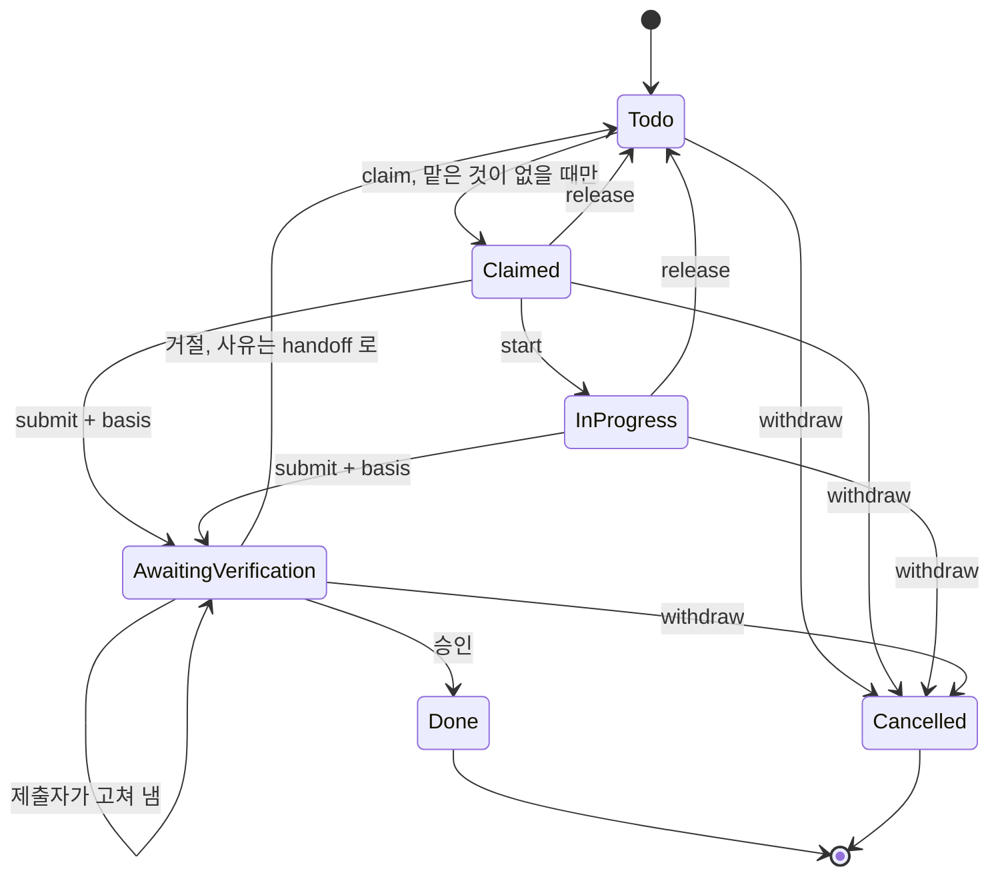

# RFC: Task 생애주기 — 요청·맡음·제출은 쓰는 쪽이 서로 다른 세 가지 사실이다

## 0. 요약

Task 하나에는 서로 다른 사실 세 가지가 들어 있다.

| 사실 | 묻는 것 | 코드에서 |
|---|---|---|
| 요청 | 이 일이 아직 필요한가 | Task 자체. 요청자는 `created_by` |
| 맡음 | 지금 누가 하고 있는가 | `Claimed`·`InProgress` 의 `assignee` |
| 제출 | "끝났다"는 말이 심사 중인가 | `AwaitingVerification` |

지금은 한 사실을 쓰는 쪽이 다른 사실까지 바꾼다. 세 군데다.

1. **판정이 일을 맡긴다.** 제출이 거절되면 Task 가 제출자의 `InProgress` 로 돌아간다. 제출자가 그사이
   무엇을 맡았는지는 보지 않는다. 지금 맡겨진 Task 16건 중 12건이 이렇게 돌아온 것이다.
2. **맡은 쪽이 요청을 거두려면 운영자를 기다린다.** 취소 청구 65건이 운영자 한 사람을 기다리고,
   가장 오래된 것은 342시간째다. 65건 중 49건은 GitHub 조회 한 번으로 확인되는 내용이다.
3. **그런데 그 문은 하나만 잠겨 있다.** 맡은 Task 를 놓은 다음(`release`) 취소하면(`cancel`) 아무 검사
   없이 바로 `Cancelled` 가 된다. 아무도 안 맡은 Task 는 누구나 취소할 수 있다.

이 RFC 는 사실마다 쓰는 쪽을 정한다. 상태 이름 여섯 개는 그대로 두고 전이 네 개를 바꾼다.

| # | 지금 | 바꾼 뒤 |
|---|---|---|
| 1 | 거절 판정 → 제출자의 `InProgress` | 거절 판정 → `Todo`. 사유는 `handoff_context` 에 남는다 |
| 2 | 맡은 쪽의 `Cancel` → 판정 대기, 운영자만 승인 | 없앤다. 손을 떼는 길은 §3.4 의 세 갈래다 |
| 3 | `Todo` 의 `Cancel` → 누구나 즉시 | 요청자나 운영자만, 어느 상태에서든 즉시 |
| 4 | 제출의 `intent = Complete_task \| Cancel_task` | `basis = Did_the_work \| Found_the_outcome`. 둘 다 같은 판정자가 심사한다 |

새 상태·새 타이머·새 Gate 는 없다. 지워지는 것이 더 많다(§3.9).
목표 모델은 `specs/task-lifecycle/TaskOwnership.tla` 에 있고, 위 결함 각각을 버그 모델로 넣어
불변식이 실제로 잡는지 TLC 로 확인했다(§4.1).

## 1. 실측 (2026-09-18, `<base-path>/.masc`, backlog version 6544)

Task 1,121건: `todo` 640, `done` 343, `awaiting_verification` 66, `cancelled` 56, `in_progress` 16.
열린 Task 722건 중 작성자가 사람으로 보이는 것은 4건이다. 나머지는 에이전트가 만든 요청이다.

### 1.1 판정이 돌려보낸 Task 가 쌓인다

맡겨진 Task 16건을 누가 몇 개 들고 있는지 보면 이렇다.

| 맡은 쪽 | 개수 | 마지막 handoff 를 쓴 쪽 | 어떻게 왔나 |
|---|---|---|---|
| `codex-mcp-client` | 9 | `verifier_exact` | 2026-09-12 시스템 판정 거절로 복귀 |
| `sangsu` | 3 | `masc-tui` | 2026-09-16 07:14~07:20 운영자 거절로 복귀. 사유 칸은 "no reason" 2건, "없음" 1건 |
| 나머지 4명 | 각 1 | 본인 또는 없음 | 직접 claim |

한 번에 하나만 맡는다는 규칙을 어긴 12건은 전부 판정이 돌려보낸 것이다. 직접 claim 해서 둘 이상을
들고 있는 경우는 없다.

- 한 번에 하나만 맡는지 보는 검사는 claim 에만 있다: `workspace_task_claim.ml:20-35` 가 본인의
  `Claimed`·`InProgress` 를 세고, 적용 지점은 `claim_task_r`, `transition(Claim)`, `claim_next_r` 셋이다.
  `commit_verdict_r`(`workspace_task_transitions.ml:812-1180`) 에는 이 검사가 없다.
- 거절 판정은 `InProgress { assignee; started_at }` 와 `set_current = Some task_id` 를 돌려준다
  (`workspace_task_lifecycle.ml:291-300`). 제출자가 지금 다른 Task 를 하고 있어도 에이전트 기록의
  `current_task` 칸을 덮어쓴다(`workspace_task_transitions.ml:969-973`).
- 돌아온 Task 는 Keeper 프롬프트에 안 보인다. Current Task 블록은 하나뿐이고,
  `keeper_current_task_reconcile` 은 이미 current 인 Task 를 유지한다(`:88-131`). Keeper 는 다음 claim 에서 처음으로
  "already holds task-N" 을 본다. 한 주 claim 거절 77건 중 38건이 이 거절이었다
  (`workspace_task_claim.ml:51-55` 주석).
- "취소가 안 돼서 다른 Task 를 못 한다"는 Keeper 의 말은 절반이 사실이다. 대기 중인 청구는 claim 을
  막지 않는다. 거절된 청구는 돌아와서 막는다.

RFC-0455 §3.2 는 이 가운데 한 경우만 고쳤다. 제출자에게 Keeper 큐가 없으면 전달 단계에서 `Todo` 로
되돌린다. 제출자가 Keeper 이면 여전히 `InProgress` 로 돌아간다. 같은 자리의 두 번째 수정이므로
(#36461, RFC-0455 §3.2) 세 번째는 원인을 고친다.

### 1.2 취소 청구 65건이 운영자 한 사람을 기다린다

`awaiting_verification` 66건 중 65건이 `intent = cancel` 이다. 가장 오래된 것은 342시간, 중앙값은
157시간이다. 시스템 판정 lane 은 취소 청구를 심사하지 않고 `Operator_routed` 로 적기만 한다
(`completion_authority_agent.ml:758-773`). 실행 기록(`verification-runs.jsonl`)의 verification id
70개를 마지막 결과로 나누면 `operator_routed` 65, `approved` 3, `rejected` 1, `not_reviewed` 1 이다.

65건이 가리키는 이슈·PR 번호를 GitHub GraphQL 한 번으로 조회했다.

| 조회 결과 | 건수 | 뜻 |
|---|---|---|
| 병합된 PR | 30 | 조회만으로 확인된다 |
| 닫힌 이슈 | 19 | 조회만으로 확인된다 |
| 병합 없이 닫힌 PR | 5 | 읽어 봐야 한다. 그중 4건은 청구문이 "닫힌 이슈"라고 적었다 |
| 아직 열린 이슈 | 7 | 읽어 봐야 한다. 다른 PR 이나 운영자 결정을 근거로 든다 |
| 번호 없음 | 4 | 운영자 결정 인용, 중복 Task, 직접 실측 |

- 청구한 쪽이 요청자가 아닌 것이 50건이다. 그중 30건은 `goo-yang-bong` 이 `codex-mcp-client` 가 만든
  오래된 요청을 정리하다 낸 것이다. 사람이 만든 Task 에 걸린 청구는 1건이다.
- 세 건(task-563, task-609, task-1282)은 청구문에 운영자가 `masc_ask` 로 이미 내린 결정을 적었다.
  운영자는 한 번 결정했고, 같은 결정을 검증 화면에서 한 번 더 눌러야 끝난다.
- 판정자가 쓰는 조회 도구는 `tool_read_file`, `tool_search_files`, `masc_web_fetch`,
  `masc_board_post_get`, `masc_fusion_status` 다(`verification_authority_tools.ml:7-22`).
  공개 저장소의 PR·이슈 URL 은 지금 도구로 열 수 있다.

청구문을 읽고 나누면 65건 중 58건은 "하면 안 되는 일"이 아니라 "결과가 이미 있는 일"이라는 말이다.
나머지 7건은 운영자 결정을 인용한 것 3건, 전제가 틀렸다는 것 4건이다. 도구 설명이 그렇게 안내한다:
`keeper_task_cancel` 의 `when_to_use` 는 "the defect was fixed elsewhere" 다
(`config/tools/keeper_task_cancel.toml:37`).

### 1.3 그 문은 하나만 잠겨 있다

- `Cancel, Todo -> cancelled` 에는 호출자 검사가 없다(`workspace_task_lifecycle.ml:113-114`).
  전이 계층도, 도구 계층도(`tool_task.ml:134-167` 은 `Release` 만 검사), `keeper_task_cancel`
  핸들러도(`keeper_tool_task_runtime.ml:985-1030`) `created_by` 를 읽지 않는다.
- 그래서 맡은 쪽은 `release` → `cancel` 두 번의 호출로 혼자 `Cancelled` 에 닿는다. RFC-0417 이 막으려던
  바로 그 길이다. 잠긴 문으로 온 65건만 줄을 서 있다.
- 이미 취소된 56건 중 53건은 요청자 본인이 취소했다. 남이 취소한 3건은 운영자 결정 1건, "이미 main 에
  고쳐져 있다" 1건, 전제 소멸 1건이다.

### 1.4 화면은 두 청구를 구분하지 못한다

- TUI 검증 화면의 줄 타입 `verification_request` 에는 `intent` 칸이 없다(`lib/tui_decode.ml:2594-2603`,
  decoder `:5234-5250`). 운영자는 그 줄이 완료 청구인지 취소 청구인지 모르고 누른다.
- Keeper 프롬프트도 `intent` 를 그리지 않는다. 취소 승인은 "evidence approved" 로, 취소 거절은
  "Completion evidence rejected" 로 전달된다(`keeper_event_queue.ml:114-128`, `:237-241`).
- 거절에 빈 사유를 막는 검사(`Verdict_rejection_reason_required`)는 "no reason" 과 "없음" 을 통과시켰다.
  글자 수 검사로는 성의 없는 거절을 막지 못한다.

### 1.5 멈춘 완료 제출은 아무에게도 안 보인다

완료 제출 1건(task-581)이 32시간째 기다린다. 판정 lane 은 `not_reviewed`,
gate `evaluator_unavailable` 로 끝냈다: "The admitted verifier slot cannot consume the submitted media".
`retryable` 이 없어 재시도 타이머가 서지 않고(`completion_authority_agent.ml:583-591`), 운영자 주의
목록은 완료 제출을 일부러 뺀다(`operator_task_attention.ml:86-89`). 고칠 수 있는 사람은 운영자뿐인데
운영자에게 닿는 길이 없다.

### 1.6 지금 스펙은 이 결함을 볼 수 없다

`specs/task-lifecycle/TaskLifecycle.tla` 는 Task 하나에 변수 `state` 하나다. 에이전트가 없으므로
"제출자가 그사이 다른 Task 를 맡았다"를 표현할 수 없고, `ApplyConfiguredLlmFail` 이 `InProgress` 로
돌아가는 것을 정상 동작으로 적었다. `Cancel` 은 모든 상태에서 즉시 `Cancelled` 로 모델링돼 있어
코드와도 다르다.

## 2. 원칙

1. **사실마다 쓰는 쪽이 정해져 있다.**

   | 사실 | 쓰는 쪽 | 쓰지 못하는 쪽 |
   |---|---|---|
   | 요청 | 요청자·운영자(거둔다), 판정(확인됐다고 닫는다) | 맡은 쪽, 지나가던 에이전트 |
   | 맡음 | 본인(claim·release·submit), 운영자(놓아 주기만) | **판정** |
   | 제출 | 제출자(낸다·고쳐 낸다), 판정(답한다) | 그 밖 |

2. **판정은 제출에 답할 뿐이다.** 확인되면 요청을 닫고, 아니면 Task 를 아무도 안 맡은 자리로 돌려
   놓는다. 누가 다음에 일할지는 정하지 않는다. 이 저장소의 자율성 원칙 그대로다: 원장은 사실을
   기록하고, 다음 행동은 Keeper 가 고른다.
3. **기다리는 제출에는 운영자 말고도 답할 쪽이 있다.** 운영자만 풀 수 있는 자리는 목록으로 보여 주되
   (RFC-0455 §2), 그런 자리로 들어가는 전이를 먼저 줄인다.
4. **시간은 아무것도 닫지 않는다.** `no_wall_clock_death` 를 그대로 따른다.
5. **상태·필드·Gate 는 없을 때 사실이 망가지는 경우에만 더한다.** 이 RFC 는 필드 하나의 뜻을 바꾸고
   하나를 교체한다. 더하는 것은 없다.

## 3. 설계

### 3.1 타입

```ocaml
(* lib/types/types_core.mli *)

(** 제출자가 "끝났다"고 말하는 근거. 판정자가 무엇을 열어 볼지가 여기서 갈린다. *)
type submission_basis =
  | Did_the_work        (* 제출자가 결과물을 만들었다 *)
  | Found_the_outcome   (* 결과물이 이미 다른 곳에 있다. 증거가 그 위치를 가리킨다 *)

type task_status =
  | Todo
  | Claimed of { assignee : string; claimed_at : string }
  | InProgress of { assignee : string; started_at : string }
  | AwaitingVerification of
      { submitter : string          (* 예전 assignee. 이 Task 를 맡고 있지 않다 *)
      ; started_at : string
      ; submitted_at : string
      ; basis : submission_basis    (* 예전 intent *)
      ; verification_id : string
      }
  | Done of { assignee : string; completed_at : string; notes : string option }
  | Cancelled of { cancelled_by : string; cancelled_at : string; reason : string }
```

- `assignee` 를 `submitter` 로 바꾸는 것은 이름 정리가 아니다. 이 칸을 "일을 빚진 사람"으로 읽던
  자리를 컴파일러가 전부 짚게 하려는 것이다. 지금 그렇게 읽는 곳: `task_assignee_of_status`
  (`types_core.ml:314-317`), orphan 점검(`workspace_query.ml:247-252`), Keeper 설정 제거 거절
  (`keeper_configuration_removal.ml:170-178`), 대시보드 rollup 의 running 집계
  (`server_dashboard_http.ml:607-613`). `task_assignee_of_status` 는 `AwaitingVerification` 에
  `None` 을 답한다. `task_performer_of_status` 는 그대로 제출자를 답한다.
- `verification_intent` 와 `Cancel_task` 는 사라진다. 요청을 거두는 것은 제출이 아니다(§3.5).
- `Done.assignee` 는 "확인된 제출을 낸 쪽"을 뜻한다. 직접 했는지 찾았는지는 `Done` 에 남기지 않는다.
  칸을 더하면 이미 저장된 `done` 343건을 읽지 못한다. `basis` 는 판정 로그 줄
  (`task_completion_verdict`)에 싣는다. 이 로그의 보존 기간은 30일이다.
- `Cancelled.reason` 은 `string option` 에서 `string` 이 된다. 거두는 쪽은 이유를 적는다.
- `task_action` 의 `Cancel` 은 `Withdraw` 로 이름을 바꾼다. 뜻이 바뀌었는데 이름이 같으면 Keeper 가
  익힌 습관("빠지고 싶으면 cancel")이 그대로 남는다. 상태 이름 `Cancelled` 와 wire 문자열
  `"cancelled"` 는 그대로 둔다. 이미 56건이 그 이름으로 저장돼 있다.

### 3.2 전이 표

`본인` 은 `same_task_actor` 가 참인 호출자다. 빈칸은 `Invalid_transition`.

| 액션 \ 상태 | `Todo` | `Claimed`·`InProgress` | `AwaitingVerification` | `Done` | `Cancelled` |
|---|---|---|---|---|---|
| `Claim` | 맡은 것이 없으면 → `Claimed` | 본인: 그대로. 남: 거절 | `Verification_pending_verdict` | 그대로 | |
| `Start` | | 본인 `Claimed` → `InProgress` | | 그대로 | |
| `Release` | 그대로 | 본인 → `Todo` | | | |
| `Submit_for_verification` | | 본인 → `AwaitingVerification { submitter; basis }` | 제출자 본인: 새 `verification_id` 로 교체 | | |
| `Withdraw` | 자격 있으면 → `Cancelled` | 자격 있으면 → `Cancelled` | 자격 있으면 → `Cancelled` | | 그대로 |
| `Done_action` | | `Verification_submission_required` | | 그대로 | |



`withdraw` 는 요청자와 운영자만 한다. 판정에서 나가는 화살표는 `Done` 과 `Todo` 둘뿐이고, 어느 것도
누군가의 `InProgress` 로 가지 않는다.

지금과 달라진 칸은 셋이다. `Withdraw` 줄 전체, `Submit` 이 `basis` 를 받는 것, 그리고 예전 `Cancel` 이
`AwaitingVerification` 으로 가던 칸이 없어진 것이다. 자격은 §3.5 에 있다.

### 3.3 판정 표

| 판정 | 결과 | `set_current` | 제출자에게 |
|---|---|---|---|
| 승인 | `Done { assignee = submitter }` | `None` | 지금과 같은 승인 알림 |
| 거절(사유 필수) | **`Todo`**. `handoff_context` = { summary·reason = 사유, evidence_refs = [verification_id], reclaim_policy = `Allow_reclaim`, updated_by = 판정자 } | **`None`** | 알림 한 건(§3.6). 의무는 없다 |
| 판정 못 함(lane 장애, 설정 오류) | 그대로 `AwaitingVerification` | — | §3.7 |

- `basis` 는 판정 결과를 가르지 않는다. 판정자가 묻는 것은 두 경우 모두 "증거가 완료 조건을 보여
  주는가"다. `Found_the_outcome` 이면 판정자는 증거가 가리키는 곳을 연다.
- 판정 토큰은 그대로 `APPROVE | REJECT(reason)` 다(`config/tools/report_review_verdict.toml`).
  바뀌는 것은 거절이 **하는 일**이다. 거절은 기록이고, 일을 맡기는 행위가 아니다.
- `Verdict_cancel_requires_operator`, `admission_of_status` 의 `Operator_routed` 갈래,
  `Verification_run_registry.Operator_routed` 는 지워진다. 심사할 취소 청구가 없다.
- RFC-0455 §3.2 의 "받을 Keeper 가 없으면 `Todo` 로"(`completion_authority_wakeup.ml:141-189`)는
  일반 규칙에 흡수되어 지워진다. 전달 단계는 **알릴지**만 정하고 상태를 바꾸지 않는다.
- 제출의 증거는 제출자가 쓴 handoff 에서만 읽는다. 지금은 제출 호출에 handoff 가 없으면 Task 에 저장된
  handoff 를 대신 읽는다(`workspace_task_verification.ml:29-45`). 거절 뒤에는 그 handoff 를 판정자가 썼으므로,
  거절 사유가 `note:` 증거로, 옛 `verification_id` 가 증거 참조로 다음 제출에 들어간다. 돌아온 Task 를 남이
  이어받는 이 설계에서는 더 자주 생길 일이라 같은 단계에서 고친다. 저장된 handoff 의 `updated_by` 가
  제출자가 아니면 읽지 않는다.
- 운영자 판정 요청은 자기가 본 `verification_id` 를 실어 보낸다. 지금은 서버가 커밋 직전의 id 를 읽어
  넣어서(`server_routes_http_routes_verification.ml:134-145`), 운영자가 N번째 제출을 보는 사이
  다시 제출되면 클릭이 N+1번째에 적용된다. 시스템 판정에는 이미 있는 검사다
  (`Verification_id_mismatch`).

### 3.4 맡은 쪽이 손을 떼는 세 갈래

| 맡은 쪽의 사정 | 하는 일 | 걸리는 시간 |
|---|---|---|
| 못 하겠다, 안 하겠다 | `release` + 어디까지 했는지 | 즉시 |
| 이미 끝나 있다 | `submit` + `basis = Found_the_outcome` + 어디에 있는지 | 시스템 판정(오늘 승인 3건은 88~486초 걸렸다) |
| 하면 안 되는 일이다 | 내가 요청한 것이면 `withdraw`. 아니면 이유를 적어 `release` | 즉시 |

세 번째 줄에서 요청자가 아닌 쪽은 요청을 거두지 못한다. 놓으면서 이유를 남기고, 원하면 요청자나
운영자에게 메시지를 보낸다. 보통 메시지이고 답할 의무를 만들지 않는다. 대기 중인 65건에서 이 갈래에
드는 것은 7건이고, 그중 요청자 본인이 낸 것은 바로 거둘 수 있다.

### 3.5 요청을 거둘 자격

```ocaml
type withdrawal_standing =
  | Requester                          (* task.created_by = 호출자 *)
  | Operator of { operator_id : string }
```

- 자격은 Task 의 상태가 아니라 **누가 요청했는가**로 정한다. 지금은 반대다. 아무도 안 맡았으면 누구나
  되고, 누가 맡았으면 맡은 쪽만 청구할 수 있고 요청자는 못 한다.
- 거두는 것은 판정을 거치지 않는다. 남의 제출을 심사하는 일이 아니라 자기 요청을 물리는 일이다.
  RFC-0417 의 원칙("일이 존재를 멈추는 허락은 시스템 LLM 이 내리지 않는다")은 그대로 지켜진다.
  시스템 판정자는 여전히 그 허락을 내리지 않는다.
- 세탁 걱정: Keeper 가 혼자 닿을 수 있는 끝 상태가 생긴다. 다만 그 끝은 `Cancelled` 이고 `Done` 이
  아니며, 자기가 낸 요청에 한정된다. 운영자나 다른 에이전트의 요청은 거두지 못하므로, 지금의
  `release` → `cancel` 보다 좁다.
- 요청자가 거두면 맡고 있던 쪽은 알림을 받는다(§3.6). 지금은 요청자만 알림을 받는다.
- `created_by` 가 비어 있는 Task 는 운영자만 거둘 수 있다. 모르는 값을 허용으로 읽지 않는다.
- 자격 검사는 이름 비교다. 다른 소유 검사(`same_task_actor`)와 강도가 같다. Keeper 도구는 서버가 아는
  이름(`keeper_agent_sender ~meta`)으로 호출되므로 속일 수 없지만, MCP 클라이언트는 이름을 스스로 적는다
  (#18965 에서 세션 결합을 뺐다). 이름을 속이는 호출자를 막는 일은 이 RFC 범위 밖이다.

### 3.6 알림

알림은 보이게 하는 것이지 의무가 아니다. 새 큐를 만들지 않고 있는 것을 쓴다.

| 사건 | 받는 쪽 | 지금 있는 경로 | 바뀌는 문장 |
|---|---|---|---|
| 제출이 거절됨 | 제출자 Keeper | `pending_completion_rejections` → `Completion_authority_rejected` | "Task 는 backlog 로 돌아갔다. 이어서 하려면 다시 claim 한다"를 덧붙인다. "returned to you, in progress" 는 지운다 |
| 제출이 승인됨 | 제출자 Keeper | `Task_outcome` | 그대로 |
| 요청이 거둬짐 | 요청자(본인이 아니면) | `Task_cancelled` | 그대로 |
| 요청이 거둬짐 | **맡고 있던 쪽** | 없음 | `Task_cancelled` 를 맡은 쪽에도 보낸다 |

### 3.7 운영자 목록

`task_awaiting_operator`(`operator_task_attention.ml`)는 세 종류를 유지한다.

| 지금 | 바꾼 뒤 |
|---|---|
| `Cancel_claim` | 지운다. 그런 제출이 없다 |
| `Held_without_actor` | 그대로 |
| `Producer_record_unreadable` | 그대로 |
| (없음) | `Review_stalled { gate }` — 판정 lane 이 재시도 없이 멈춘 제출(§1.5) |

`Review_stalled` 는 새 상태가 아니다. `AwaitingVerification` 인데 마지막 실행 기록이 재시도 없는
`not_reviewed`·`infrastructure_unavailable`·`commit_failed`·`raised` 인 Task 를 읽어서 만든다.

### 3.8 도구와 프롬프트

| 자리 | 바꾸는 것 |
|---|---|
| `keeper_task_done` | `basis` 인자(기본값 없음, 필수). `when_to_use` 에 "이미 다른 곳에서 끝나 있으면 `found` 로 내고 위치를 증거로 단다"를 넣는다 |
| `keeper_task_cancel` | `keeper_task_withdraw` 로 교체. "내가 만든 요청을 거둔다. 남의 요청이면 거절되고, 거절 문장이 요청자를 알려 준다" |
| `keeper_task_release` | `when_to_use` 에 "하면 안 되는 일이라고 보지만 내 요청이 아닐 때도 여기로"를 넣는다 |
| `keeper.md` | `world.current_task.status.awaiting_verification` 문구 삭제(제출하면 current 가 아니다). 판정 행에 `basis` 를 그린다 |
| TUI·dashboard 검증 화면 | 줄마다 `basis` 를 보여 준다 |

### 3.9 지워지는 것

`verification_intent`, `Cancel_task`, `Verdict_cancel_requires_operator`, `admission_of_status` 의
`Operator_routed`, `Verification_run_registry.Operator_routed`, `Cancel_claim`,
`release_unroutable_rejected_task_r`(`workspace_task.ml:384-508`)와 그 호출 갈래
(`completion_authority_wakeup.ml:141-189`), `decide` 의
`Cancel → AwaitingVerification` 두 팔, 거절 판정의 `set_current = Some task_id`,
`TaskLifecycle.tla`(새 스펙이 같은 불변식을 포함한다).

### 3.10 헌법(`docs/constitution.xml`) 개정안

소유자 승인이 필요하다(§7 D4).

| 자리 | 지금 | 개정안 |
|---|---|---|
| `<task><lifecycle>` `AwaitingVerification` 필드 | `assignee, started_at, submitted_at, verification_id` | `submitter, started_at, submitted_at, basis, verification_id` |
| `started_at` 불변식 | "제출·거절을 관통해 원래 작업 시작 시각을 보존한다" | "제출을 관통해 보존한다. 거절된 Task 는 `Todo` 로 돌아가고, 다시 맡으면 새 시작 시각을 쓴다. 이전 시각은 전이 로그에 남는다(보존 30일)" |
| `<task>` 규칙 추가 | — | "판정은 제출에 답할 뿐 누구에게도 Task 를 맡기지 않는다. Task 를 맡는 길은 claim 하나다" |
| `<task>` 규칙 추가 | — | "요청을 거두는 것은 요청자와 운영자만 한다. 판정을 거치지 않는다" |
| `<task>` 규칙 추가 | — | "기다리는 제출에는 운영자 말고도 답할 수 있는 판정자가 있다" |

### 3.11 기존 RFC 와의 관계

| RFC | 관계 |
|---|---|
| 0416 | `intent` 로 취소 청구를 표현한다는 결정을 대체한다. 새 상태를 만들지 않는다는 결론은 그대로다 |
| 0417 | 원칙은 유지, 수단은 대체. 취소 **판정**이 없어지므로 운영자 전용 승인도 없어진다. 운영자는 어떤 요청이든 직접 거둘 수 있다 |
| 0455 | §3.2 를 일반 규칙으로 올리고, §3.3 의 `Cancel_claim` 을 `Review_stalled` 로 바꾼다. §3.4 는 대상이 없어진다 |
| 0445, 0446 | 건드리지 않는다. `next_actor` 어휘와 계약 없는 제출 거절은 이 설계 위에서 그대로 성립한다 |
| 0221, 0365 | 그대로 따른다. 결과의 권위는 `task_status` 하나이고, handoff 는 나갈 때 쓰고 들어올 때 읽는다 |

## 4. 검증

### 4.1 TLA+ (이 PR 에 포함, `scripts/tla-check.sh` 에 연결)

`specs/task-lifecycle/TaskOwnership.tla`: Task 2개 × 에이전트 2명 × 제출 2회. 한 에이전트가 Task 둘을
들게 되는 가장 작은 모델이다. 버그 모델마다 cfg 를 따로 두고 불변식을 하나만 적었다. 묶어 두면 TLC 가
가장 짧은 반례 하나만 보고해서 나머지 불변식이 일을 안 한다.

| cfg | 모델 | 검사한 것 | 결과 |
|---|---|---|---|
| `TaskOwnership.cfg` | 목표 생애주기 | `Safety` 전체 + `VerdictNeverAssigns` | 오류 없음. 서로 다른 상태 16,450개, 깊이 13 |
| `-buggy` | 거절이 제출자에게 돌려줌(지금 코드) | `OneTaskPerAgent` | 위반, 6단계 |
| `-verdict-assigns-buggy` | 같은 버그 | `VerdictNeverAssigns` | 위반, 5단계 |
| `-stop-submission-buggy` | 운영자만 답하는 중단 청구(지금 코드) | `PendingNeverNeedsOperator` | 위반, 3단계 |
| `-anyone-withdraws-buggy` | 남의 요청을 거둠(지금 코드) | `WithdrawnRequiresStanding` | 위반, 3단계 |
| `-accept-without-verdict-buggy` | 판정 없이 완료 | `AcceptedRequiresLiveConfirmation` | 위반, 3단계 |
| `-superseded-verdict-buggy` | 교체된 제출에 대한 판정이 완료시킴 | `AcceptedRequiresLiveConfirmation` | 위반, 6단계 |

스펙은 `Claimed` 와 `InProgress` 를 하나로 본다. `Start` 는 누가 맡는지를 바꾸지 않는다. 운영자가
놓아 주는 것은 `Release` 와 결과가 같아 따로 두지 않았다.

`-buggy` 의 반례는 §1.1 의 실제 경로와 같다: a1 이 t1 을 맡는다 → 제출한다 → t2 를 맡는다 → t1 이
거절된다 → a1 이 t1 과 t2 를 든다.

### 4.2 구현이 끝났는지 재는 값

| 값 | 지금 | 목표 | 어디서 읽나 |
|---|---|---|---|
| Task 를 둘 이상 맡은 에이전트 | 2명(12건) | 0 | `backlog.json` |
| 운영자만 답할 수 있는 제출 | 65 | 0 | `backlog.json` + 실행 기록 |
| 재시도 없이 멈췄는데 아무 목록에도 없는 제출 | 1 | 0 | 실행 기록 + 운영자 목록 |
| 가장 오래 기다린 제출 | 342시간 | 판정 한 번 걸리는 시간. 넘으면 운영자 목록에 있다 | `backlog.json` |
| `release` → `cancel` 로 혼자 끝내기 | 가능 | 거절됨 | 전이 테스트 |
| claim 거절 중 "already holds" 비율 | 77건 중 38건(주간, 코드 주석) | 줄어듦. 관찰만 한다 | 전이 로그 |

OCaml 쪽은 임의의 액션·판정 열을 돌려 `OneTaskPerAgent` 를 확인하는 속성 테스트를 전이 계층에 둔다.
스펙의 불변식과 같은 이름을 쓴다.

## 5. 하지 않는 것

| 하지 않는 것 | 이유 |
|---|---|
| 새 상태(`Rejected`, `CancelRequested`, `Blocked`) | 담을 사실이 기존 필드에 다 있다(RFC-0416 과 같은 결론) |
| 맡음에 시간 제한(lease, visibility timeout) | `no_wall_clock_death`. SQS 식 설계는 이 저장소에서 금지다 |
| 세션이 끝나면 맡은 Task 를 놓기 | 재 보니 이 경로로 생긴 방치가 16건 중 0건이다. `end_session` 은 `lib/` 와 `bin/` 에 호출하는 곳이 없고, 여러 세션이 한 이름(`codex-mcp-client`)을 쓰므로 한 세션의 종료가 다른 세션의 Task 를 놓게 된다. Keeper 종료는 이미 놓는다(`keeper_shutdown_finalize.ml:137-169`). 나머지는 `Held_without_actor` 가 보여 준다 |
| 판정 토큰을 셋으로(`REFUTED`/`UNVERIFIABLE`) | 두 거절의 결과가 같다. 판정 품질은 calibration 기록으로 따로 본다 |
| 거절 사유 글자 수·내용 검사 | "no reason" 이 통과했다. 성의는 검사로 만들 수 없고, 거절이 남에게 일을 떠넘기지 못하게 하면 성의 없는 거절의 해가 사라진다 |
| `Claimed`·`InProgress` 합치기 | Keeper 는 claim 직후 자동으로 Start 하므로 구분이 정보를 주지 않는다. 다만 MCP 클라이언트와 화면 집계가 쓰고, 사실을 해치지 않는다 |
| `Done_action` 액션 지우기 | 커밋되는 경우가 없는 액션이지만 거절 문장이 올바른 길을 알려 준다 |
| Task 를 사건 기록(event sourcing)으로 다시 짜기 | 결과의 권위는 `task_status` 하나다(RFC-0221) |
| 쌓인 `todo` 640건 정리 | 생애주기가 아니라 요청을 만드는 쪽의 문제다. 이 RFC 뒤에는 요청자가 자기 요청을 바로 거둘 수 있다 |

## 6. 단계

각 단계는 독립 PR 이고 앞 단계 위에 쌓는다.

| 단계 | 내용 | 끝났다는 증거 |
|---|---|---|
| 0 | 이 문서와 `TaskOwnership.tla` | `scripts/tla-check.sh` 에서 깨끗한 모델 통과, 버그 모델 6개 위반 |
| 1 | 거절 판정 → `Todo`. `set_current = None`. `release_unroutable_rejected_task_r` 삭제. 알림 문장. 운영자 판정 요청에 `verification_id`. 남이 쓴 handoff 를 제출 증거로 읽지 않기 | 속성 테스트 `OneTaskPerAgent`. §4.2 첫 줄이 새 판정에서 0 |
| 2 | `intent` → `basis`. `assignee` → `submitter`. `keeper_task_done` 의 `basis`. 판정 프롬프트. `Operator_routed` 삭제 | `Found_the_outcome` 제출이 시스템 판정을 받는 테스트 |
| 3 | `Cancel` → `Withdraw`. 자격 검사. `keeper_task_withdraw`. 맡은 쪽 알림 | `release` → `withdraw` 가 요청자 아닌 쪽에서 거절되는 테스트 |
| 4 | 운영자 목록(`Review_stalled`), TUI·dashboard 의 `basis`, 헌법 개정, `docs/spec/02-types-and-invariants.md` 정정, `TaskLifecycle.tla` 삭제 | §4.2 셋째 줄 0 |

2와 3은 같이 배포한다. 2만 나가면 "하면 안 되는 일" 갈래가 잠시 `release` 하나로 줄어든다.

**배포 전 조건(2단계).** 새 reader 는 `intent` 와 `AwaitingVerification.assignee` 를 모른다. 이 저장소는
과거 데이터용 reader 를 만들지 않으므로, 2단계를 배포하는 시점에 `awaiting_verification` 줄이 하나도
없어야 한다. 2단계는 배포 전 검사(`bin/deployment_preflight_helper.ml`)에 backlog 읽기를 더해서, 새
reader 가 못 읽는 줄이 남아 있으면 배포를 거절하게 한다. 지금 이 검사는 turn record 만 읽는다
(`:972-1019`). 바꾸지 않고 거절만 하므로 변환 코드가 아니다. 비우는 순서는 이렇다.

1. 취소 청구 65건을 비운다. 방법은 소유자 결정이다(§7 D3).
2. Keeper 를 멈춰 새 제출이 들어오지 않게 한다.
3. 남은 완료 제출에 판정이 내려지기를 기다린다. 오늘 기준 한 건에 88~486초다.
4. 멈춘 제출(§1.5)은 운영자가 판정한다. 운영자 복구 도구는 `AwaitingVerification` 을 받지 않으므로
   (`workspace_task.ml:293-306`) 판정이 유일한 길이다.
5. 배포한다.

1단계는 저장 형식을 바꾸지 않으므로 이 조건이 없다. 이미 `InProgress` 로 돌아와 있는 12건은 운영자 복구
도구(`masc_operator_task_recovery_resolve`)로 `Todo` 에 돌린다.

## 7. 소유자 결정이 필요한 것

| # | 질문 | 권고 | 다른 선택 |
|---|---|---|---|
| D1 | 제출자가 Keeper 여도 거절된 Task 를 `Todo` 로 돌리는가 | 그렇다. 예외를 두면 §1.1 이 Keeper 에게만 남는다 | Keeper 에게는 지금처럼 돌려주되 한-Task 검사를 판정에도 건다. 그러면 검사에 걸린 판정을 어디로 보낼지가 다시 문제다 |
| D2 | 요청을 거둘 자격 | 요청자 + 운영자 | 운영자만(지금의 줄이 그대로 남는다). 또는 운영자가 설정으로 지정한 정리 담당 Keeper 추가(에이전트가 만든 640건을 정리할 길이 넓어진다) |
| D3 | 대기 중인 취소 청구 65건 | 지금 화면에서 승인한다. 49건은 조회로 확인됐고, 나머지 16건은 목록을 붙인다 | `Todo` 로 되돌려 새 규칙에서 다시 제출하게 한다. 판정 58회분의 토큰이 든다 |
| D4 | §3.10 헌법 문구 | 표대로 | — |

## 8. 반론과 답

**거절된 일을 아무도 다시 안 잡으면?** 지금도 같다. 돌아온 Task 12건은 돌아온 지 49~148시간째 그대로다.
`Todo` 에 있으면 claimable 목록에 사유와 함께 뜨고, 제출자도 알림을 받아 다시 잡을 수 있다.
`InProgress` 에 묶여 있으면 아무도 못 잡는다.

**맥락 없는 Keeper 가 잡으면?** 거절 사유와 이전 제출의 `verification_id` 가 handoff 로 따라간다.
Keeper 가 내려가며 놓은 Task 를 남이 이어받는 것과 같은 길이다(RFC-0365).

**계속 거절되는 Task 가 Keeper 사이를 돌면?** 이미 돈다. `release` 로 돌아온 횟수(`cycle_count`)가 3 이상인
Task 가 37건이고 최고는 30이다. `cycle_count` 는 화면에만 쓰이고 claim 순서를 바꾸지 않는다. 이 RFC 는
횟수 상한을 두지 않는다. 달라지는 것은 거절 사유가 Task 와 함께 다닌다는 점이다.

**같은 Keeper 가 같은 증거로 계속 다시 내면?** 지금도 생긴다(task-174, 2시간에 59회). 그때의 답은
횟수 상한이 아니라 읽을 수 없는 증거 참조를 제출 경계에서 거절하는 것이었고, 그 검사는 그대로 있다.

**"이미 끝났다"를 거짓으로 내면?** 판정자가 가리킨 곳을 연다. §1.2 의 5건(병합 없이 닫힌 PR 을 닫힌
이슈라고 적음)이 바로 판정자가 걸러야 하는 경우다. 운영자가 65번 누르는 것보다 조회하는 쪽이 이런
것을 더 잘 잡는다.

**운영자 권한이 줄어드는가?** 늘어난다. 지금은 취소 청구가 올라와야 승인할 수 있다. 바꾼 뒤에는 어떤
열린 요청이든 직접 거둔다.

**RFC-0455 가 전달 단계에서 고친 이유(테스트 호출 자리 23곳)는?** 그때는 `commit_verdict_r` 에 인자를
더해야 했다. 이번에는 인자가 늘지 않는다. 거절이 돌려주는 값이 바뀔 뿐이고, 고치는 것은 기대값이다.

## 9. 근거

- 실측 원본: `<base-path>/.masc/tasks/backlog.json`(version 6544), `verification-runs.jsonl`,
  `events/2026-09/*.jsonl`, `verifications/*.json`. 조회일 2026-09-18.
- GitHub 조회: `repository(owner:"jeong-sik", name:"masc") { issueOrPullRequest(number: N) }` 56개 번호,
  1회 호출.
- 코드: `lib/workspace/workspace_task_lifecycle.ml`, `workspace_task_transitions.ml`,
  `workspace_task_claim.ml`, `workspace_task.ml`, `lib/completion_authority_agent.ml`,
  `lib/completion_authority_wakeup.ml`, `lib/verification_authority_tools.ml`,
  `lib/operator_task_attention.ml`, `lib/keeper/keeper_current_task_reconcile.ml`,
  `lib/keeper/keeper_tool_task_runtime.ml`, `lib/task/tool_task.ml`, `lib/types/types_core.ml`,
  `config/tools/keeper_task_{done,cancel,release,claim}.toml`. 기준 커밋 `a31a7f9dad`.
- 선행 사례: GitHub PR 리뷰는 Comment·Approve·Request changes 세 가지이고 어느 것도 담당자를 바꾸지
  않는다. Gerrit 의 Code-Review 0 은 "아직 의견 없음"이다. Jira 는 상태와 종결 사유(resolution)를
  따로 둔다. SQS 의 visibility timeout 은 시간으로 맡음을 푸는 설계이고, 이 저장소의
  `no_wall_clock_death` 와 맞지 않아 쓰지 않는다.
