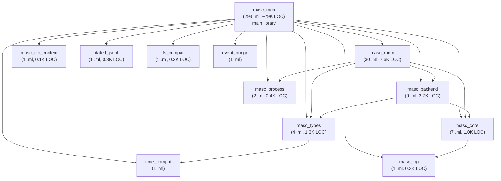

# 01. System Overview

> Part of: [SPEC-INDEX](./SPEC-INDEX.md)
> Status: Draft
> Last Updated: 2026-03-23

---

## 1. Problem Statement

여러 AI 에이전트(Claude Code, Gemini CLI, Codex CLI, 로컬 LLM 등)가 동일 코드베이스에서 동시에 작업할 때, 다음 문제가 발생한다:

1. **충돌**: 두 에이전트가 같은 파일을 동시에 수정하면 git conflict가 발생하고, 한쪽 작업이 소실된다.
2. **중복**: 동일한 CI 실패를 여러 에이전트가 독립적으로 수정 시도하면, 중복 PR이 생성된다.
3. **맥락 단절**: 에이전트 A가 만든 변경사항을 에이전트 B가 인지하지 못하면, 잘못된 가정 위에 작업이 쌓인다.
4. **생명주기 불투명**: 어떤 에이전트가 어떤 task를 잡고 있는지, heartbeat가 끊긴 에이전트는 무엇인지 파악할 수단이 없다.
5. **오케스트레이션 부재**: 큰 작업을 여러 에이전트에게 분배하고, 진행 상황을 추적하고, 실패 시 재배정하는 메커니즘이 없다.

MASC는 이 문제들을 MCP(Model Context Protocol) 서버로 해결한다. AI IDE/CLI가 MCP 클라이언트로 연결하면, Room에 참여하고, Task를 claim/complete하고, Broadcast로 상태를 공유하고, Heartbeat로 생존을 증명한다.

## 2. Non-Goals

MASC가 명시적으로 **하지 않는 것**:

| Non-Goal | 근거 |
|----------|------|
| Production multi-tenant SaaS | 단일 머신, localhost-trust 모델. 인증/격리/과금 미구현. |
| 범용 오케스트레이션 프레임워크 (Temporal/Airflow 대체) | 대상은 AI 에이전트 협업에 한정. DAG 스케줄링, 재시도 정책, 워커 풀 관리는 범위 밖. |
| 모델 추론 서버 | LLM 호출은 Cascade를 통해 외부 서버(llama-server, GLM Cloud)로 위임. 자체 GPU 추론 없음. |
| OAS Agent SDK 대체 | MASC는 OAS에 의존한다. Agent 생명주기(run, checkpoint, context reduction)는 OAS 책임. MASC는 coordination layer. |
| 범용 채팅/메시징 시스템 | Broadcast와 Board는 에이전트 간 조율 목적. 사람 간 커뮤니케이션 도구가 아님. |

## 3. Deployment Model

```
┌─────────────────────────────────────────────────┐
│                  Single Machine                  │
│                                                  │
│  ┌──────────┐    ┌──────────┐    ┌──────────┐   │
│  │ Claude   │    │ Gemini   │    │ Codex    │   │
│  │ Code     │    │ CLI      │    │ CLI      │   │
│  └────┬─────┘    └────┬─────┘    └────┬─────┘   │
│       │ MCP           │ MCP           │ MCP      │
│       └───────────────┼───────────────┘          │
│                       │                          │
│              ┌────────▼────────┐                 │
│              │   MASC-MCP      │                 │
│              │   :8935         │                 │
│              └────────┬────────┘                 │
│                       │                          │
│         ┌─────────────┼─────────────┐            │
│         │             │             │            │
│    ┌────▼────┐  ┌─────▼────┐  ┌────▼────┐       │
│    │ .masc/  │  │ PostgreSQL│  │ Neo4j   │       │
│    │ (local) │  │ (Supabase)│  │(Railway)│       │
│    └─────────┘  └──────────┘  └─────────┘       │
└─────────────────────────────────────────────────┘
         │
         │ Cloudflare Tunnel
         ▼
   masc.crying.pictures (remote access)
```

- **Trust model**: localhost 전제. 모든 MCP 클라이언트는 신뢰할 수 있다고 가정.
- **Persistence**: 로컬 파일(.masc/ 디렉토리)과 원격 DB(PostgreSQL, Neo4j) 병용.
- **Remote access**: Cloudflare Tunnel을 통해 원격 브라우저에서 dashboard 접근 가능. Origin은 HTTP/1.1, Cloudflare가 브라우저에 HTTP/2를 제공.
- **단일 인스턴스**: MASC 서버는 한 대만 실행. 수평 확장 미지원.

## 4. Technology Stack

| 영역 | 기술 | 비고 |
|------|------|------|
| Runtime | OCaml 5.x + Eio | Effect-based cooperative concurrency. Stdlib.Mutex 사용 금지 (EDEADLK). |
| HTTP/1.1 | httpun-eio | 기본 transport. Cloudflare Tunnel 호환. |
| HTTP/2 | h2-eio (h2c) | `MASC_USE_H2=1`로 활성화. SSE 멀티플렉싱 (브라우저 6-conn 제한 회피). |
| TLS | mirage-crypto + tls-eio | 인증서: `SSL_CERT_FILE` 환경변수. |
| JSON | yojson | JSON 파싱/생성. `Yojson.Safe.t` 표준 사용. |
| PostgreSQL | caqti + caqti-eio | Board, session 상태 저장. Supabase Transaction Pooler (port 6543) preferred, session pooler is fallback. |
| SQLite | sqlite3 | 로컬 경량 저장 (일부 모듈). |
| Protocol | MCP JSON-RPC | `tools/call`, `tools/list` over SSE + POST. |
| gRPC | grpc-direct (h2-eio) | Agent-to-Agent 통신. proto 정의: `proto/`. |
| GraphQL | HTTP client | Neo4j 접근은 Railway GraphQL API 경유. |
| AI | agent_sdk (OAS) | Agent.run, Context_reducer, Swarm engine. |
| Inference | Cascade | llama (local) -> GLM Cloud (fallback) -> skip. |
| Build | dune 3.13+ | `dune-project` 기반. opam package: `masc_mcp`. |
| Coverage | bisect_ppx | `BISECT_FILE` 환경변수 필수. |
| Dashboard | Preact + HTM + Vite | TypeScript SPA. `dashboard/` 소스, `assets/dashboard/` 빌드 산출물. |

## 5. Sub-library Dependency Graph

MASC는 1개 main library(`masc_mcp`)와 11개 sub-library로 구성된다. main library가 sub-library를 참조하며, sub-library 간 의존은 단방향이다.



### Main Library 내부 하위 디렉토리

main library(`lib/`) 내에 기능별 하위 디렉토리가 있다. 이들은 별도 dune library가 아니라 `masc_mcp` library의 일부다.

| Directory | Files | LOC | 역할 |
|-----------|-------|-----|------|
| `lib/keeper/` | 53 | 33,940 | Keeper 자율 에이전트 엔진 |
| `lib/dashboard/` | 33 | 22,248 | Dashboard 렌더링, API |
| `lib/server/` | 39 | 22,108 | MCP server, HTTP transport, SSE |
| `lib/operator/` | 10 | 7,842 | Operator 인터페이스 |
| `lib/swarm/` | 11 | 5,490 | Swarm 오케스트레이션 |
| `lib/voice/` | 6 | 4,470 | Voice/TTS |
| `lib/local/` | 5 | 4,450 | 로컬 LLM runtime pool |
| `lib/grpc/` | 5 | 2,286 | gRPC transport |
| `lib/goal/` | 4 | 1,304 | Goal 관리 |
| `lib/memory/` | 2 | 764 | Memory stream |
| `lib/` (root) | 293 | 78,894 | Tool modules, config, types, utilities |

## 6. Executable Inventory

| Executable | Public Name | Entry Point | 역할 |
|------------|-------------|-------------|------|
| `main_eio` | `masc-mcp` | `bin/main_eio.ml` | HTTP 서버. 기본 진입점. httpun-eio(HTTP/1.1) 또는 h2-eio(HTTP/2). Dashboard 서빙, SSE, MCP JSON-RPC, gRPC, REST API. |
| `main_stdio_eio` | `masc-mcp-stdio` | `bin/main_stdio_eio.ml` | Stdio 기반 MCP 서버. Claude Code `--mcp` 모드 연동. |
| `masc_cost` | `masc-cost` | `bin/masc_cost.ml` | Token 사용량 집계, 비용 계산 CLI. |
| `masc_tui` | `masc-tui` | `bin/masc_tui.ml` | Terminal UI. Keeper 목록, 상태, 연결 인터페이스. |

## 7. Canonical Front Door and Internal Supporting Substrates

MASC의 현재 canonical front door는 3가지다.

### 7.1 Repo Coordination

가장 기본적인 경로. project scope, task backlog, worktree, heartbeat를 다룬다.

- **대상**: repo-local coding coordination
- **핵심 도구**: `masc_start`, `masc_status`, `masc_transition`, `masc_plan_set_task`, `masc_heartbeat`
- **설명**: 여러 에이전트가 같은 repo에서 충돌 없이 일하도록 namespace/task/worktree truth를 유지한다.

### 7.2 Keeper Runtime

장기 실행과 연속성을 위한 경로.

- **대상**: keeper lifecycle, long-running execution, OAS-backed autonomy
- **핵심 도구**: `masc_keeper_up`, `masc_keeper_msg`, `masc_keeper_status`, `masc_keeper_down`
- **설명**: keeper는 OAS `Agent.run` 기반으로 실행되며, historical compatibility lane과 독립적으로 동작한다.

### 7.3 Dashboard and Operator Read Visibility

운영 상태를 읽고 개입 포인트를 파악하는 read-mostly 경로.

- **대상**: dashboard monitoring, operator digest/action, namespace truth
- **핵심 코드**: `lib/dashboard/`, `lib/server/server_dashboard_http*.ml`, `dashboard/`, `lib/operator/`
- **핵심 surface**: `/api/v1/dashboard/*`, `/api/v1/operator*`, `/api/v1/activity/*`
- **설명**: write-heavy orchestration을 새 front door로 약속하지 않고, 운영자가 현재 runtime truth를 읽고 제한된 개입을 하는 surface다.

Historical compatibility lane(team-session / command-plane HTTP)은 migration context로만 남아 있으며, supported front door로 취급하지 않는다.

## 8. External Integrations

| Service | Location | Protocol | 용도 | 비고 |
|---------|----------|----------|------|------|
| Neo4j | Railway (`turntable.proxy.rlwy.net:11490`) | Bolt (via GraphQL) | Agent 그래프, COLLABORATED_WITH 관계, Person 노드 | 직접 Cypher 접근 금지. GraphQL API 경유. |
| Supabase pgvector | Supabase Cloud | PostgreSQL | Vector search (wiki, retrospectives) | `$SUPABASE_DB_URL` |
| PostgreSQL | Supabase Transaction Pooler (`:6543`) preferred | caqti-eio | Board 게시판, session 상태, 구조화 데이터 | MASC는 `oneshot` query policy로 prepared statement 충돌을 피한다. Session Pooler (`:5432`)는 legacy fallback. |
| OAS Agent SDK | In-process (OCaml library) | Function call | Agent.run, Context_reducer, Swarm engine, Cascade | MASC의 agent lifecycle은 OAS에 위임. |
| Langfuse | Cloud API | HTTP | LLM 호출 tracing, cost attribution | 선택적 활성화. |
| GraphQL API | Railway (`second-brain-graphql-production.up.railway.app`) | HTTP | Agent 정보 로드, collaboration edge 기록 | `$GRAPHQL_API_KEY` 인증. Query cost limit 2000. |
| Cloudflare Tunnel | `masc.crying.pictures` | HTTP -> HTTPS | 원격 dashboard 접근 | Origin HTTP/1.1. Cloudflare가 HTTP/2 변환. |
| local runtime | configured local endpoint | OpenAI-compatible API | 로컬 LLM 추론 (Cascade 1순위) | OAS discovery endpoint. |
| GLM Cloud | ZAI API | HTTP | Cloud LLM 추론 (Cascade 2순위) | `sb glm-text` 경로. |

## 9. Invariants (System-Level)

| ID | 불변식 | 검증 방법 |
|----|--------|----------|
| INV-SYS-001 | Sub-library 의존성은 단방향이다. masc_room -> masc_types는 허용되지만, masc_types -> masc_room은 금지. | dune dependency graph (`dune describe`). |
| INV-SYS-002 | Eio context 내에서 Stdlib.Mutex를 사용하지 않는다. Eio.Mutex만 허용. | AST structural test + `rg 'Stdlib.Mutex'`. |
| INV-SYS-003 | MCP tool dispatch는 match 패턴을 사용한다. dict/map 라우팅 금지. | Code review. |
| INV-SYS-004 | 모든 외부 LLM 호출은 Cascade를 경유한다. 직접 HTTP 호출 금지. | `rg` for direct curl/HTTP calls to LLM endpoints. |
| INV-SYS-005 | MASC는 모델명을 MASC 레벨에 노출하지 않는다. Cascade가 추상화. | Code review, log audit. |
| INV-SYS-006 | Agent lifecycle (run, checkpoint, context reduction)은 OAS Agent SDK에 위임한다. MASC에서 재구현 금지. | Architecture review. |

## 10. Open Questions

| ID | 질문 | 관련 코드 | 상태 |
|----|------|----------|------|
| OQ-SYS-001 | Sub-library 추출을 어디까지 진행할 것인가? keeper(33K LOC)와 chain(30K LOC)은 별도 sub-library 후보. | `lib/keeper/`, `lib/chain/` | Open |
| OQ-SYS-002 | HTTP/2 h2c를 기본 transport로 전환할 시점은? Cloudflare Tunnel이 cleartext h2를 지원하지 않는 제약. | `bin/main_eio.ml` | Open |
| OQ-SYS-003 | MASC -> OAS 이관 완료 후 MASC의 최종 범위는? 순수 coordination layer만 남길 것인지. | — | Open |
| OQ-SYS-004 | Multi-protocol transport(SSE/gRPC/WebSocket/WebRTC) 중 어디를 canonical으로 수렴할 것인가? | `lib/grpc/`, `lib/server/` | Open |
