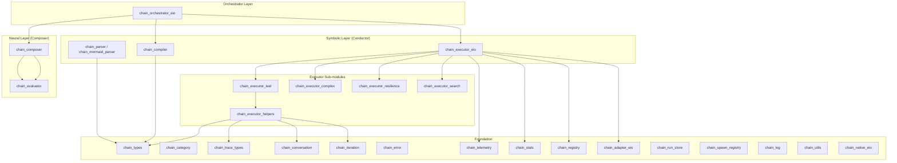

# Chain Engine — ARCHIVED

> **이 spec은 chain subsystem이 존재하던 시절의 historical reference입니다.**
>
> `lib/chain/` 디렉토리와 `tool_command_plane_chain_*.ml` 모듈은 purge되었습니다. `masc_chain_snapshot` / `masc_chain_run_get` MCP tool도 등록되지 않습니다. 본 문서의 module / LOC / tool 숫자는 purge 이전 기준이며, 현재 runtime truth를 반영하지 않습니다.
>
> 이 spec은 migration 과정과 chain DSL 개념의 역사 기록으로만 남겨둡니다. 새 코드가 이 내용을 참조하지 않도록 주의하십시오.

| 항목 | 값 |
|------|-----|
| Status | Archived |
| Team | Chain (dissolved) |
| Maps to | `lib/chain/` (removed) |
| Dependencies | 02-types-and-invariants |
| Modules | 47 (36 `.ml` + 11 `.mli`) — historical |
| LOC | ~17,150 — historical |
| MCP Tools | `masc_chain_snapshot`, `masc_chain_run_get` — not registered |

---

## 1. Purpose

Chain Engine은 다중 LLM 호출과 도구 실행을 방향성 비순환 그래프(DAG)로 조합하여 실행하는 오케스트레이션 엔진이다. 27가지 노드 타입(21 core + 3 MASC + 3 extended)으로 파이프라인, 팬아웃, 합의, 폴백, 탐색 등 다양한 실행 패턴을 표현한다.

핵심 설계 원리:

- **Neuro-Symbolic**: Composer(Neural)가 LLM으로 Chain DSL을 설계하고, Conductor(Symbolic)가 결정론적으로 실행한다.
- **Category Theory 기반**: Functor, Applicative, Monad, Monoid, Kleisli Arrow, Profunctor 추상화로 노드 조합의 수학적 정합성을 보장한다.
- **Eio Fiber 기반 동시성**: Fanout/Merge/Race 등 병렬 노드는 Eio fiber로 실행되며, OS thread 없이 cooperative scheduling으로 동작한다.

---

## 2. Architecture



### 2.1 레이어 구조

| 레이어 | 모듈 | 역할 |
|--------|------|------|
| **Orchestrator** | `chain_orchestrator_eio` | Design-Compile-Execute-Verify 루프 통합 |
| **Neural (Composer)** | `chain_composer`, `chain_evaluator` | LLM 기반 Chain DSL 설계, 완료 검증, 평가 타이밍 제어 |
| **Symbolic (Conductor)** | `chain_parser`, `chain_compiler`, `chain_executor_eio` | JSON/Mermaid 파싱, DAG 컴파일, 결정론적 실행 |
| **Foundation** | `chain_types`, `chain_category`, `chain_error` 외 | 타입 정의, 카테고리 이론 추상화, 에러, 텔레메트리 |

### 2.2 Orchestrator 라이프사이클

```
Design(Composer) -> Compile(Parser+Compiler) -> Execute(Conductor) -> Verify(Composer)
    ^                                                                      |
    +----------------------------- Replan Loop ----------------------------+
```

`orchestration_config.max_replans` (기본 3)까지 재계획을 허용한다. 전체 타임아웃은 `timeout_ms` (기본 300,000ms = 5분).

---

## 3. Node Type Catalog

Chain Engine은 27가지 노드 타입을 지원한다. 기능별로 6개 카테고리로 분류된다.

### 3.1 Leaf Nodes (단말 노드)

| Node Type | 의미 | 주요 파라미터 | 실행 모듈 |
|-----------|------|-------------|----------|
| **Model** | LLM 호출. prompt를 모델에 전달하고 응답을 받는다 | `model`, `prompt`, `system`, `timeout`, `tools`, `thinking` | `chain_executor_leaf` |
| **Tool** | MCP tool 호출. 이름과 JSON 인자로 외부 도구를 실행한다 | `name`, `args` | `chain_executor_leaf` |

### 3.2 Structural Nodes (구조 노드)

| Node Type | 의미 | 주요 파라미터 | 실행 모듈 |
|-----------|------|-------------|----------|
| **Pipeline** | 순차 실행. 자식 노드를 순서대로 실행하고 마지막 출력을 반환한다 | `node list` | `chain_executor_eio` |
| **Fanout** | 병렬 실행. 모든 자식 노드를 Eio fiber로 동시 실행한다 | `node list` | `chain_executor_eio` |
| **Gate** | 조건 분기. condition 평가 결과에 따라 then/else 노드를 실행한다 | `condition`, `then_node`, `else_node` | `chain_executor_eio` |
| **Subgraph** | 중첩 체인. 전체 chain 정의를 하위 노드로 실행한다 | `chain` | `chain_executor_eio` |
| **ChainRef** | 등록된 체인 참조. Registry에서 ID로 체인을 조회하여 실행한다 | `ref_id` | `chain_executor_eio` |
| **Map** | 함수 매핑. inner 노드 결과에 func를 적용한다 (Functor) | `func`, `inner` | `chain_executor_eio` |
| **Bind** | 모나드 바인드. inner 노드 결과를 func에 전달하여 새 계산을 생성한다 | `func`, `inner` | `chain_executor_eio` |

### 3.3 Consensus and Merge Nodes (합의/병합 노드)

| Node Type | 의미 | 주요 파라미터 | 실행 모듈 |
|-----------|------|-------------|----------|
| **Quorum** | N/K 합의. 병렬 실행 후 consensus_mode에 따라 합의를 판정한다 | `consensus`, `nodes`, `weights` | `chain_executor_eio` |
| **Merge** | 결과 병합. 복수 노드 결과를 merge_strategy에 따라 하나로 합친다 | `strategy`, `nodes` | `chain_executor_eio` |
| **StreamMerge** | 스트리밍 병합. 노드들이 완료되는 순서대로 reducer를 적용한다 | `nodes`, `reducer`, `initial`, `min_results`, `timeout` | `chain_executor_complex` |

### 3.4 Quality and Evaluation Nodes (품질/평가 노드)

| Node Type | 의미 | 주요 파라미터 | 실행 모듈 |
|-----------|------|-------------|----------|
| **Threshold** | 임계값 검사. 입력 노드 결과의 metric을 측정하여 pass/fail 분기한다 | `metric`, `operator`, `value`, `input_node`, `on_pass`, `on_fail` | `chain_executor_eio` |
| **GoalDriven** | 목표 기반 반복. 목표 metric에 도달할 때까지 action_node를 반복 실행한다 | `goal_metric`, `goal_operator`, `goal_value`, `action_node`, `measure_func`, `max_iterations`, `conversational`, `relay_models` | `chain_executor_complex` |
| **Evaluator** | 후보 평가. 복수 후보 노드를 실행하고 scoring_func으로 점수를 매겨 선택한다 | `candidates`, `scoring_func`, `scoring_prompt`, `select_strategy`, `min_score` | `chain_executor_search` |
| **FeedbackLoop** | 피드백 루프. generator -> evaluator -> improver 사이클을 score_threshold까지 반복한다 | `generator`, `evaluator_config`, `improver_prompt`, `max_iterations`, `score_threshold`, `score_operator`, `conversational`, `relay_models` | `chain_executor_complex` |
| **Mcts** | Monte Carlo Tree Search. 전략 트리를 탐색하며 시뮬레이션과 평가를 반복한다 | `strategies`, `simulation`, `evaluator`, `policy`, `max_iterations`, `max_depth`, `expansion_threshold`, `early_stop`, `parallel_sims` | `chain_executor_search` |

### 3.5 Resilience Nodes (복원력 노드)

| Node Type | 의미 | 주요 파라미터 | 실행 모듈 |
|-----------|------|-------------|----------|
| **Retry** | 재시도. 실패 시 backoff 전략에 따라 max_attempts까지 재시도한다 | `node`, `max_attempts`, `backoff`, `retry_on` | `chain_executor_resilience` |
| **Fallback** | 폴백. primary 실패 시 fallbacks 목록을 순서대로 시도한다 | `primary`, `fallbacks` | `chain_executor_resilience` |
| **Race** | 경쟁 실행. 복수 노드를 동시 실행하고 가장 먼저 성공한 결과를 반환한다 | `nodes`, `timeout` | `chain_executor_resilience` |
| **Cache** | 캐싱. key_expr 기반 캐시 히트 시 inner 노드 실행을 건너뛴다 | `key_expr`, `ttl_seconds`, `inner` | `chain_executor_resilience` |
| **Batch** | 배치 처리. inner 노드를 batch_size 단위로 분할 실행한다 | `batch_size`, `parallel`, `inner`, `collect_strategy` | `chain_executor_resilience` |
| **Spawn** | 격리 실행. clean context에서 inner 노드를 실행하여 상태 오염을 방지한다 | `clean`, `inner`, `pass_vars`, `inherit_cache` | `chain_executor_resilience` |
| **ChainExec** | 동적 체인 실행. chain_source에서 체인을 로드하여 런타임에 실행한다 | `chain_source`, `validate`, `max_depth`, `sandbox`, `context_inject`, `pass_outputs` | `chain_executor_resilience` |

### 3.6 Data Transform Nodes (데이터 변환 노드)

| Node Type | 의미 | 주요 파라미터 | 실행 모듈 |
|-----------|------|-------------|----------|
| **Adapter** | 데이터 변환. input_ref 출력에 transform을 적용한다 (Profunctor) | `input_ref`, `transform`, `on_error` | `chain_executor_leaf` |

### 3.7 Cascade Node (단계적 에스컬레이션)

| Node Type | 의미 | 주요 파라미터 | 실행 모듈 |
|-----------|------|-------------|----------|
| **Cascade** | 단계적 LLM 에스컬레이션. 저비용 tier부터 시작하여 confidence가 부족하면 상위 tier로 올린다 | `tiers`, `confidence_prompt`, `max_escalations`, `context_mode`, `task_hint`, `default_threshold` | `chain_executor_complex` |

### 3.8 MASC Coordination Nodes (MASC 연동 노드)

| Node Type | 의미 | 주요 파라미터 | 실행 모듈 |
|-----------|------|-------------|----------|
| **Masc_broadcast** | MASC 브로드캐스트 발행 | `message`, `room`, `mention` | `chain_executor_leaf` |
| **Masc_listen** | MASC 이벤트 대기 | `filter`, `timeout_sec`, `room` | `chain_executor_leaf` |
| **Masc_claim** | MASC task claim | `task_id`, `room` | `chain_executor_leaf` |

---

## 4. Types

### 4.1 Core Types

**소스**: `lib/chain/chain_types.mli`

```ocaml
(* Chain configuration *)
type chain_config = {
  max_depth : int;        (* 서브그래프 최대 재귀 깊이 *)
  max_concurrency : int;  (* 모델당 최대 병렬 실행 수 *)
  timeout : int;          (* 기본 타임아웃 (초) *)
  trace : bool;           (* 실행 추적 활성화 *)
  direction : direction;  (* Mermaid 다이어그램 방향 *)
}

(* 실행 결과 *)
type chain_result = {
  chain_id : string;
  output : string;
  success : bool;
  trace : trace_entry list;
  token_usage : token_usage;
  duration_ms : int;
  metadata : (string * string) list;
}

(* 컴파일러 출력 *)
type execution_plan = {
  chain : chain;
  execution_order : string list;     (* 위상 정렬 순서 *)
  parallel_groups : string list list; (* 병렬 실행 그룹 *)
  depth : int;                       (* 최대 중첩 깊이 *)
}
```

### 4.2 Strategy Types

```ocaml
(* Quorum 합의 모드 *)
type consensus_mode =
  | Count of int       (* 최소 N개 성공 *)
  | Majority           (* 과반수 성공 (> n/2) *)
  | Unanimous          (* 전원 성공 *)
  | Weighted of float  (* 가중 합산 >= threshold *)

(* Merge 전략 *)
type merge_strategy =
  | First | Last | Concat | WeightedAvg | Custom of string

(* Evaluator 선택 전략 *)
type select_strategy =
  | Best | Worst | AboveThreshold of float | WeightedRandom

(* Retry backoff 전략 *)
type backoff_strategy =
  | Constant of float | Exponential of float | Linear of float
  | Jitter of float * float

(* MCTS 탐색 정책 *)
type mcts_policy =
  | UCB1 of float | Greedy | EpsilonGreedy of float | Softmax of float

(* Threshold 비교 연산자 *)
type threshold_op = Gt | Gte | Lt | Lte | Eq | Neq

(* Cascade confidence 수준 *)
type confidence_level = High | Medium | Low
type context_mode = CM_None | CM_Summary | CM_Full
```

### 4.3 Adapter Transform (재귀 타입)

```ocaml
type adapter_transform =
  | Extract of string           (* JSON 필드 추출 *)
  | Template of string          (* 템플릿 적용 *)
  | Summarize of int            (* max_tokens 요약 *)
  | Truncate of int             (* max_chars 절단 *)
  | JsonPath of string          (* JSONPath 쿼리 *)
  | Regex of string * string    (* 정규식 치환 *)
  | ValidateSchema of string    (* JSON Schema 검증 *)
  | ParseJson                   (* 문자열 -> JSON *)
  | Stringify                   (* JSON -> 문자열 *)
  | Chain of adapter_transform list  (* 순차 변환 체인 *)
  | Conditional of { condition; on_true; on_false }  (* 조건부 *)
  | Split of { delimiter; chunk_size; overlap }      (* 분할 *)
  | Custom of string            (* 사용자 정의 함수 *)
```

`Chain` variant가 `adapter_transform list`를 포함하므로 재귀 타입이다. `Conditional`의 `on_true`/`on_false`도 `adapter_transform`이므로 트리 구조를 형성한다.

### 4.4 Cascade Tier

```ocaml
type cascade_tier = {
  tier_node : node;              (* 해당 tier에서 실행할 노드 *)
  tier_index : int;              (* tier 순서 (0부터) *)
  confidence_threshold : float;  (* 이 tier의 confidence 기준 *)
  cost_weight : float;           (* 비용 가중치 *)
  pass_context : bool;           (* 이전 tier 컨텍스트 전달 여부 *)
}
```

### 4.5 Execution Context

```ocaml
type exec_context = {
  outputs: (string, string) Hashtbl.t;        (* 노드 ID -> 출력 매핑 *)
  traces: internal_trace list ref;            (* 실행 추적 이벤트 *)
  start_time: float;
  trace_enabled: bool;
  timeout: int;
  mutable iteration_ctx: iteration_ctx option; (* GoalDriven 반복 컨텍스트 *)
  mutable conversation: conversation_ctx option; (* 대화 컨텍스트 *)
  cache: (string, string * float) Hashtbl.t;  (* 캐시: key -> (value, timestamp) *)
  mutable total_tokens: token_usage;
  langfuse_trace: Langfuse.trace option;       (* Langfuse 연동 *)
  checkpoint: checkpoint_config;               (* 체크포인트 설정 *)
  node_status: (string, exec_phase) Hashtbl.t; (* 노드별 실행 상태 *)
  node_attempts: (string, int) Hashtbl.t;      (* 노드별 시도 횟수 *)
  chain_id: string;
}
```

### 4.6 Trace and Telemetry Types

```ocaml
(* 노드 실행 추적 이벤트 *)
type trace_event =
  | NodeStart of { node_type : string; attempt : int }
  | NodeComplete of { duration_ms : int; success : bool; node_type : string; attempt : int }
  | NodeError of { message : string; error_class : string option; node_type : string; attempt : int }
  | ChainStart of { chain_id : string; mermaid_dsl : string option }
  | ChainComplete of { chain_id : string; success : bool }

(* 노드 실행 단계 *)
type exec_phase = Planned | Running | Completed | Failed | Skipped
```

### 4.7 Diagram Direction

```ocaml
type direction = LR | RL | TB | BT
```

Mermaid 다이어그램 렌더링 방향. `LR`(좌->우)이 기본값.

---

## 5. Category Theory Foundations

**소스**: `lib/chain/chain_category.ml`, `lib/chain/chain_category.mli`

Chain Engine은 노드 조합의 정합성을 카테고리 이론 추상화로 보장한다. 각 module signature는 법칙(laws)을 명시하고, `Laws` 모듈이 런타임 검증을 제공한다.

| 추상화 | 대응 노드 패턴 | 법칙 |
|--------|--------------|------|
| **Functor** (`map`) | Map, Adapter (출력 변환) | `map id = id`, `map (f . g) = map f . map g` |
| **Applicative** (`ap`, `sequence`) | Fanout (독립적 병렬 실행) | `pure id <*> v = v`, 결합법칙 |
| **Monad** (`bind`, `>>=`, `>=>`) | Pipeline (순차 의존성) | 좌항등, 우항등, 결합법칙 |
| **Monoid** (`empty`, `concat`) | Merge, Token 집계, Trace 누적 | `concat empty x = x`, 결합법칙 |
| **Kleisli Arrow** (`>>>`, `&&&`, `***`) | 에러 핸들링 파이프라인 | Arrow 법칙 |
| **Profunctor** (`dimap`, `lmap`, `rmap`) | Adapter (입출력 양방향 변환) | `dimap id id = id` |

### 5.1 Monoid Instances

| Instance | 타입 | 용도 |
|----------|------|------|
| `Verdict_monoid` | `verdict` | 검증 결과 합산 (fail-fast) |
| `Confidence_monoid` | `float` | confidence 점수 조합 (geometric, harmonic, weighted) |
| `Trace_monoid` | `(string * float) list` | 실행 추적 누적 |
| `Token_monoid` | `token_usage` | 토큰 사용량 합산 |

---

## 6. State Machines

### 6.1 Chain Orchestration Lifecycle

```
                    Design Failed
                        |
Start -> Design -> Compile -> Execute -> Verify -> Complete
            ^                              |
            |          Replan (count < max) |
            +------------------------------+
            |
            v
       MaxReplansExceeded / Timeout -> Abort
```

`orchestration_error` variant로 각 단계의 실패를 구분한다:
- `DesignFailed` -- Composer가 Chain DSL 생성에 실패
- `CompileFailed` -- Parser/Compiler가 유효하지 않은 DSL을 거부
- `ExecutionFailed` -- Conductor 실행 중 에러
- `VerificationFailed` -- 완료 검증 실패
- `MaxReplansExceeded` -- 재계획 횟수 초과
- `Timeout` -- 전체 타임아웃

### 6.2 Node Execution Lifecycle

```
Planned -> Running -> Completed
                  |-> Failed -> (Retry?) -> Running
                  |-> Skipped (Gate condition false)
```

`exec_phase` 타입이 상태를 표현하고, `node_status` Hashtbl이 노드별 상태를 추적한다.

### 6.3 Cascade Escalation Flow

```
Tier 0 (low-cost) -> assess confidence
    |-- confidence >= threshold -> return result
    |-- confidence < threshold -> Tier 1 (mid-cost)
        |-- confidence >= threshold -> return result
        |-- confidence < threshold -> Tier 2 (high-cost)
            |-- ... -> return result (or exhausted)
```

`max_escalations`에 도달하면 마지막 결과를 반환한다. `context_mode`에 따라 이전 tier의 출력이 다음 tier의 입력에 주입된다 (`CM_None`, `CM_Summary`, `CM_Full`).

---

## 7. DSL and Parser

### 7.1 입력 형식

Chain Engine은 두 가지 입력 형식을 지원한다.

**JSON DSL** (`chain_parser`): 표준 입력 형식. JSON 객체로 chain, nodes, config를 정의한다.

```json
{
  "id": "example_chain",
  "nodes": [
    { "id": "step1", "type": "model", "model": "llama", "prompt": "..." },
    { "id": "step2", "type": "model", "model": "glm", "prompt": "{{step1.output}}" }
  ],
  "output": "step2",
  "config": { "max_depth": 5, "timeout": 60 }
}
```

**Mermaid DSL** (`chain_mermaid_parser`, `chain_mermaid_graph`, `chain_mermaid_parse`, `chain_mermaid_node_content`): Mermaid graph 문법으로 체인을 정의한다. 4개 모듈로 분할되어 있다.

```mermaid
graph LR
    A[model:llama "Summarize the input"] --> B[model:glm "Refine: {{A.output}}"]
```

### 7.2 파싱 파이프라인

```
Input (JSON or Mermaid) -> Parser -> chain (AST)
                                        |
                                        v
                                    Validator -> (Ok | Error)
                                        |
                                        v
                                    Compiler -> execution_plan
```

### 7.3 Input Mapping

노드 간 데이터 전달은 `{{node_id.output}}` 템플릿 문법을 사용한다. Parser가 prompt 문자열에서 이 패턴을 추출하여 `input_mapping` 리스트를 생성한다.

### 7.4 Validation

두 수준의 검증을 제공한다:

- `validate_chain` (기본): 출력 노드 존재, 중복 ID 없음, 미해결 placeholder 없음
- `validate_chain_strict` (엄격): 기본 + 중첩 노드 ID 중복 검사, 필수 필드 확인, input_mapping 참조 해소, config 값 범위 검사

### 7.5 Serialization

양방향 변환을 지원한다:
- `parse_chain` / `chain_to_json`: JSON <-> chain AST
- `chain_to_mermaid`: chain AST -> Mermaid 문자열
- Mermaid 파싱: `chain_mermaid_graph` -> `chain_mermaid_parse` -> `chain_mermaid_node_content`

---

## 8. Compiler

**소스**: `lib/chain/chain_compiler.ml`, `lib/chain/chain_compiler.mli`

Compiler는 chain AST를 `execution_plan`으로 변환한다.

### 8.1 컴파일 단계

1. **의존성 그래프 구축** (`build_dependency_graph`): `input_mapping`과 중첩 노드 참조를 분석하여 `(string, string list) Hashtbl.t` 형태의 그래프를 생성한다.
2. **위상 정렬** (`topological_sort`): Kahn's algorithm으로 DAG 순서를 결정한다. 순환이 감지되면 에러를 반환한다.
3. **병렬 그룹 식별** (`identify_parallel_groups`): 상호 의존성이 없는 노드들을 같은 그룹에 배치한다. Fanout 최적화의 기반이 된다.
4. **깊이 계산** (`calculate_depth`): 중첩 노드의 최대 깊이를 재귀적으로 계산한다. `chain_config.max_depth` 제한에 사용된다.

### 8.2 출력

```ocaml
type execution_plan = {
  chain : chain;
  execution_order : string list;       (* 위상 정렬 순서 *)
  parallel_groups : string list list;  (* 동시 실행 가능한 노드 그룹 *)
  depth : int;                         (* 최대 중첩 깊이 *)
}
```

### 8.3 Readiness Check

`is_ready completed node`는 노드의 모든 의존성이 `completed` 목록에 포함되어 있는지 확인한다. Executor가 런타임에 노드 실행 가능 여부를 판단할 때 사용한다.

---

## 9. Executor Architecture

**소스**: `lib/chain/chain_executor_eio.ml` + 4개 서브 모듈

### 9.1 모듈 분할

Executor는 상호 재귀(mutual recursion) 구조로 인해 5개 모듈로 분할되어 있다.

| 모듈 | 역할 | 노드 타입 |
|------|------|----------|
| `chain_executor_helpers` | 타입, 컨텍스트, trace, 입력 해소, 치환 | (공통 기반) |
| `chain_executor_leaf` | 단말 노드 실행 (재귀 불필요) | Model, Tool, Adapter, Masc_* |
| `chain_executor_eio` | 최상위 dispatch + 구조 노드 (상호 재귀 진입점) | Pipeline, Fanout, Gate, Quorum, Merge, Subgraph, ChainRef, Map, Bind |
| `chain_executor_complex` | 복합 반복/에스컬레이션 노드 | GoalDriven, FeedbackLoop, StreamMerge, Cascade |
| `chain_executor_resilience` | 복원력/인프라 노드 | Retry, Fallback, Race, Cache, Batch, Spawn, ChainExec |
| `chain_executor_search` | 탐색/평가 노드 | Mcts, Evaluator |

### 9.2 Dispatch 구조

`execute_node`는 `chain_executor_eio.ml`에 정의된 `let rec ... and ...` 블록의 진입점이다. `node_type` pattern match로 27개 variant를 분기하고, 서브 모듈 함수에 `execute_node` 자신을 인자로 전달하여 재귀 실행을 가능하게 한다.

```ocaml
(* chain_executor_eio.ml의 핵심 dispatch *)
let rec execute_node ctx ~sw ~clock ~exec_fn ~tool_exec node =
  match node.node_type with
  | Model _ -> execute_model_node ...       (* leaf *)
  | Pipeline nodes -> execute_pipeline ...  (* structural, recursive *)
  | Retry { ... } -> execute_retry ...      (* resilience, delegates to sub-module *)
  ...
```

서브 모듈 함수 시그니처에 `execute_node_fn` 타입이 포함되어 재귀를 허용한다:

```ocaml
type execute_node_fn =
  exec_context -> sw:Eio.Switch.t -> clock:... -> exec_fn:... -> tool_exec:... ->
  Chain_types.node -> (string, string) result
```

### 9.3 동시성 모델

- **Fanout/Merge**: `Eio.Fiber.all`로 병렬 실행. 각 fiber가 독립적으로 `execute_node`를 호출한다.
- **Race**: `Eio.Fiber.any`로 경쟁 실행. 첫 성공 결과를 반환하고 나머지를 취소한다.
- **Quorum**: 병렬 실행 후 `consensus_mode`에 따라 합의를 판정한다. `Weighted` 모드는 노드별 `weights`를 적용한다.
- **StreamMerge**: 노드가 완료될 때마다 `reducer`를 적용하고, `min_results` 이상 도착하면 조기 반환할 수 있다.
- **Batch**: `parallel=true`일 때 `batch_size`개씩 병렬로 inner 노드를 실행한다.

### 9.4 입력 해소 (Input Resolution)

`resolve_inputs ctx input_mapping`은 `{{node_id.output}}` 참조를 `ctx.outputs` Hashtbl에서 실제 값으로 치환한다. 해소 순서:

1. `input_mapping`의 각 `(ref, node_id)` 쌍에 대해 `ctx.outputs`에서 조회
2. `substitute_prompt`로 prompt 문자열 내 `{{...}}`를 치환
3. `substitute_iteration_vars`로 GoalDriven 반복 변수(`{{iteration}}`, `{{progress}}` 등)를 치환
4. JSON 인자의 경우 `substitute_json`으로 중첩 구조까지 재귀 치환

### 9.5 Retry and Backoff

`backoff_strategy`별 지연 시간 계산:

| 전략 | 지연 공식 |
|------|----------|
| `Constant(d)` | `d` (매 시도 동일) |
| `Exponential(d)` | `d * 2^(attempt-1)` |
| `Linear(d)` | `d * attempt` |
| `Jitter(min, max)` | `Random.float (max - min) + min` |

`retry_on` 리스트가 비어있으면 모든 에러에 대해 재시도한다. 비어있지 않으면 에러 메시지에 해당 문자열이 포함된 경우에만 재시도한다.

### 9.6 Checkpoint/Resume

`checkpoint_config`로 실행 중간 상태를 저장하고 복구할 수 있다.

```ocaml
type checkpoint_config = {
  checkpoint_store: Checkpoint_store.checkpoint_store option;
  checkpoint_enabled: bool;
  resume_from: string option;  (* 이전 run_id에서 복구 *)
  run_id: string;
  fs: Eio.Fs.dir_ty Eio.Path.t option;
}
```

- `save_checkpoint`: 노드 완료 시 중간 결과를 저장
- `restore_from_checkpoint`: 이전 실행의 중간 결과를 복원
- `node_completed_in_checkpoint`: 이미 완료된 노드를 건너뛰기

### 9.7 Conversational Mode

GoalDriven과 FeedbackLoop는 `conversational=true` 설정 시 대화 컨텍스트를 유지한다.

```ocaml
type conversation_ctx = {
  mutable history: conv_message list;  (* 대화 기록 *)
  models: string list;                 (* 릴레이 모델 목록 *)
  token_threshold: int;                (* 요약 트리거 임계값 *)
  window_size: int;                    (* 유지할 최근 메시지 수 *)
  ...
}
```

- `estimate_tokens`: 문자열 길이 기반 토큰 추정 (~4 chars/token)
- `needs_summarization`: `total_tokens > token_threshold`이면 true
- `maybe_summarize_and_rotate`: 임계값 초과 시 LLM으로 요약하고 모델을 rotate
- `relay_models`: 반복마다 모델을 교체하여 다양한 관점을 확보

---

## 10. Telemetry and Tracing

### 10.1 Chain Telemetry

**소스**: `lib/chain/chain_telemetry.ml`, `lib/chain/chain_telemetry.mli`

구독 기반 이벤트 시스템. Eio.Mutex로 fiber-safe하게 구독자를 관리한다.

**이벤트 타입**: `ChainStart`, `NodeStart`, `NodeComplete`, `ChainComplete`, `Error`

**API**:
- `emit event` -- 모든 활성 구독자에게 이벤트 발행
- `subscribe handler` / `unsubscribe sub` -- 구독/해지
- `subscribe_filtered ~filter handler` -- 필터링된 구독
- `enable_logging ?max_size` -- 내장 이벤트 버퍼 (기본 10,000건)
- `get_running_chains ()` -- 실행 중인 체인 목록과 진행률

**필터**: `chain_events_only`, `node_events_only`, `errors_only`, `for_chain chain_id`, `for_node node_id`

### 10.2 Chain Stats

**소스**: `lib/chain/chain_stats.ml`

Mutex로 보호되는 전역 통계 수집기.

| 메트릭 | 설명 |
|--------|------|
| `total_chains` / `total_nodes` | 총 실행 수 |
| `avg_duration_ms`, `p50`, `p95`, `p99` | 실행 시간 분포 |
| `tokens_by_model` | 모델별 토큰 사용량 |
| `estimated_cost_usd` | 비용 추정 |
| `success_rate` | 성공률 |
| `failure_reasons` | 실패 원인별 횟수 |
| `hourly_tokens` / `hourly_chains` | 시간별 추이 |

### 10.3 Chain Run Store

**소스**: `lib/chain/chain_run_store.ml`

최근 체인 실행 이력을 인메모리 + JSONL 파일로 저장한다. 디버깅과 Dashboard UI용.

| 환경변수 | 기본값 | 설명 |
|----------|--------|------|
| `MASC_CHAIN_RUN_HISTORY` | 50 | 최대 보관 이력 수 |
| `MASC_CHAIN_OUTPUT_MAX_CHARS` | 4000 | 출력 저장 최대 문자 수 |
| `MASC_CHAIN_OUTPUT_PREVIEW_CHARS` | 240 | 출력 미리보기 문자 수 |
| `MASC_CHAIN_RUN_STORE_PATH` | `~/logs/masc_chain_run_store.jsonl` | 저장 경로 |

### 10.4 Trace Pairing

`chain_trace_types.ml`의 `traces_to_entries`는 `NodeStart`와 `NodeComplete` 이벤트를 node_id 기준으로 쌍으로 묶어 `trace_entry`를 생성한다. `start_time`과 `end_time`이 올바르게 설정된다.

---

## 11. Error Handling

**소스**: `lib/chain/chain_error.ml`

### 11.1 Structured Error Hierarchy

```ocaml
type t =
  | Model of model_error     (* LLM 제공자 에러 *)
  | Chain of chain_error     (* 체인 실행 에러 *)
  | Mcp of mcp_error         (* MCP 프로토콜 에러 *)
  | Process of process_error (* 프로세스/CLI 에러 *)
  | Io of io_error           (* I/O/네트워크 에러 *)
  | Internal of string       (* 예상치 못한 내부 에러 *)
```

### 11.2 Recoverability

`is_recoverable`로 재시도 가능 여부를 판단한다:
- Recoverable: `GeminiFunctionCallSync`, `*RateLimit`, `ProcessTimeout`, `NetworkError`
- Non-recoverable: `*Auth`, `*ContextTooLong`, `ChainCycleDetected`, `Internal`

### 11.3 Severity

| Severity | 해당 에러 |
|----------|----------|
| Warning | `GeminiFunctionCallSync`, `*RateLimit`, `ChainParseError`, `McpMethodNotFound`, `ProcessTimeout` |
| Error | 대부분의 도메인 에러 |
| Critical | `Internal` |

---

## 12. Supporting Modules

### 12.1 Chain Registry

**소스**: `lib/chain/chain_registry.ml`

ChainRef 노드가 참조하는 체인을 저장/조회하는 레지스트리. Eio.Mutex로 보호되는 인메모리 Hashtbl 기반. 선택적으로 파일 시스템 영속화를 지원한다.

```ocaml
val register : chain -> unit
val lookup : string -> chain option
val list_all : unit -> (string * registry_entry) list
val init : ?persist_dir:string -> unit -> unit
```

### 12.2 Chain Spawn Registry

**소스**: `lib/chain/chain_spawn_registry.ml`

Spawn 노드의 동시 실행 상태를 추적한다. `MASC_SPAWN_MAX_INFLIGHT` (기본 16)으로 최대 동시 실행 수를 제한한다.

주요 메트릭: `inflight`, `total`, `failed`, `max_inflight`, latency 분포 (avg, p50, p95, p99).

### 12.3 Chain Log

**소스**: `lib/chain/chain_log.ml`

구조화된 레벨 로깅. `MASC_CHAIN_LOG_LEVEL` (debug|info|warn|error), `MASC_CHAIN_LOG_FORMAT` (text|json).

### 12.4 Chain Utils

**소스**: `lib/chain/chain_utils.ml`

예외 없는 안전한 헬퍼 함수: `list_nth_opt`, `list_hd_opt`, `starts_with`, `truncate_with_ellipsis`, `is_empty_response`, `is_complex_prompt`, `is_glm_model` 등.

### 12.5 Chain Native Eio

**소스**: `lib/chain/chain_native_eio.ml`

MCP tool dispatch에서 체인 실행까지 연결하는 Runtime 브릿지. `runtime` 레코드에 `config`, `agent_name`, Eio `sw`/`clock`, `mcp_state`를 담아 체인 실행 환경을 구성한다.

---

## 13. MCP Tool Surface

| Tool | 설명 |
|------|------|
| `masc_chain_snapshot` | 실행 중인 체인 목록과 상태 조회 |
| `masc_chain_run_get` | 특정 run_id의 실행 결과 상세 조회 |

Command Plane의 `tool_command_plane_chain_query.ml`과 `tool_command_plane_chain_common.ml`이 MCP tool dispatch를 처리한다. 체인 실행은 `orchestration_kind` 파라미터로 `native` (기본) 또는 `chain_dsl` (Chain DSL 직접 실행) 중 선택한다.

---

## 14. Invariants

### INV-CHAIN-001: DAG Acyclicity
체인 그래프는 반드시 DAG(방향성 비순환 그래프)여야 한다. `chain_compiler.topological_sort`가 순환을 감지하면 `ChainCycleDetected` 에러를 반환한다.

### INV-CHAIN-002: Output Node Existence
`chain.output`에 명시된 노드 ID는 `chain.nodes`에 반드시 존재해야 한다. `validate_chain`이 검사한다.

### INV-CHAIN-003: Unique Node IDs
동일 체인 내에서 노드 ID는 중복될 수 없다. `validate_chain_strict`가 중첩 노드 포함 전체를 검사한다.

### INV-CHAIN-004: Depth Limit
서브그래프 중첩 깊이는 `chain_config.max_depth`를 초과할 수 없다. `calculate_depth`가 컴파일 타임에 검사한다.

### INV-CHAIN-005: Input Reference Resolution
`{{node_id.output}}` 참조는 실행 시점에 반드시 해소되어야 한다. 위상 정렬 순서가 의존성 노드의 선행 실행을 보장한다.

### INV-CHAIN-006: Consensus Quorum
Quorum 노드에서 `Count(n)`의 n은 `0 < n <= len(nodes)`를 만족해야 한다. n=0이면 항상 성공, n > len(nodes)이면 항상 실패하므로 무의미하다.

### INV-CHAIN-007: Cascade Tier Ordering
Cascade의 `tiers`는 `tier_index` 순으로 정렬되어 실행된다. 0이 가장 저비용 tier이다.

### INV-CHAIN-008: Retry Bound
Retry 노드의 `max_attempts`는 유한해야 한다. 무한 재시도를 방지한다.

### INV-CHAIN-009: Placeholder Resolution
Mermaid 파싱 중 생성된 placeholder 노드는 실행 전에 모두 해소되어야 한다. `has_placeholder_node`가 검사한다.

### INV-CHAIN-010: Token Usage Monotonicity
`total_tokens`는 실행 중 단조 증가한다. `Token_monoid.concat`이 합산만 수행하고 감산하지 않는다.

### INV-CHAIN-011: Trace Pairing
모든 `NodeStart` 이벤트는 대응하는 `NodeComplete` 또는 `NodeError` 이벤트를 가져야 한다. 누락 시 `traces_to_entries`가 `start_time = end_time`인 부분 trace를 생성한다.

### INV-CHAIN-012: Spawn Inflight Limit
동시 실행 중인 Spawn 노드 수는 `MASC_SPAWN_MAX_INFLIGHT` (기본 16)을 초과할 수 없다. `chain_spawn_registry`가 제한한다.

---

## 15. Known Issues / Technical Debt

1. **executor mutual recursion 크기**: `chain_executor_eio.ml`의 `let rec ... and ...` 블록이 27-arm으로 확장되었다. 서브 모듈 분할(leaf, complex, resilience, search)로 완화했으나, 최상위 dispatch 함수의 match 절은 여전히 단일 파일에 있다.

2. **token 추정 정밀도**: `estimate_tokens`가 `String.length / 4`로 근사한다. BPE tokenizer 기반 정확한 추정이 아니므로 `token_threshold` 판단에 오차가 발생할 수 있다.

3. **checkpoint persistence**: `Checkpoint_store`가 인터페이스만 정의되어 있고, 파일 시스템 구현에 의존한다. 분산 환경에서의 checkpoint 공유 메커니즘이 없다.

4. **Mermaid parser 복잡도**: 4개 모듈(graph, parse, node_content, parser)로 분할되어 있지만 총 ~120K LOC로, Str 기반 regex 파싱의 edge case가 존재할 수 있다.

5. **GoalDriven/FeedbackLoop 수렴 보장 없음**: `max_iterations`로 상한을 두지만, 목표 metric에 수렴하지 않는 경우 마지막 결과를 반환한다. 발산 감지 로직이 없다.

6. **Chain category laws 런타임 검증만**: `Laws` 모듈이 런타임 property test를 제공하지만, 컴파일 타임 보장은 OCaml 타입 시스템의 한계로 불가능하다. CI에서 정기 실행해야 한다.

---

## 16. References

| 문서 | 경로 |
|------|------|
| chain_types.mli (타입 정의 SSOT) | `lib/chain/chain_types.mli` |
| chain_category.mli (카테고리 추상화) | `lib/chain/chain_category.mli` |
| chain_compiler.mli (컴파일러 인터페이스) | `lib/chain/chain_compiler.mli` |
| chain_executor_eio.mli (실행기 인터페이스) | `lib/chain/chain_executor_eio.mli` |
| chain_telemetry.mli (텔레메트리 인터페이스) | `lib/chain/chain_telemetry.mli` |
| chain_error.ml (에러 타입 정의) | `lib/chain/chain_error.ml` |
| chain_parser.mli (파서 인터페이스) | `lib/chain/chain_parser.mli` |
| chain_orchestrator_eio.ml (오케스트레이터) | `lib/chain/chain_orchestrator_eio.ml` |
| 02-types-and-invariants.md (상위 타입 명세) | `docs/spec/02-types-and-invariants.md` |
