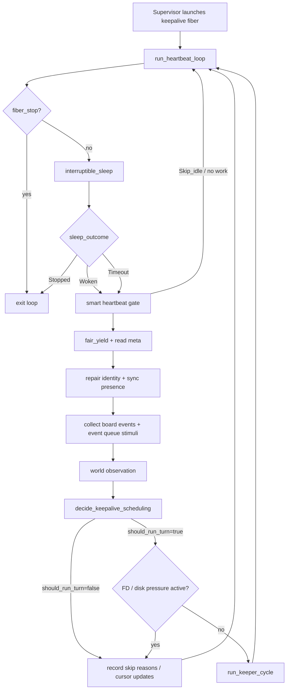
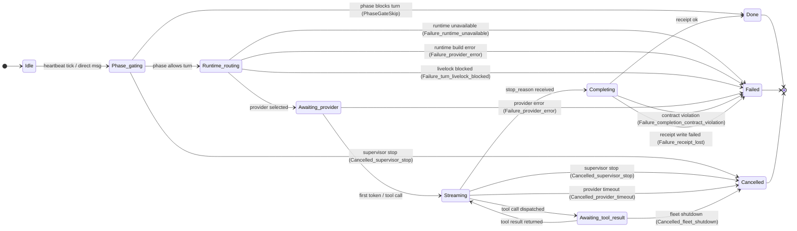
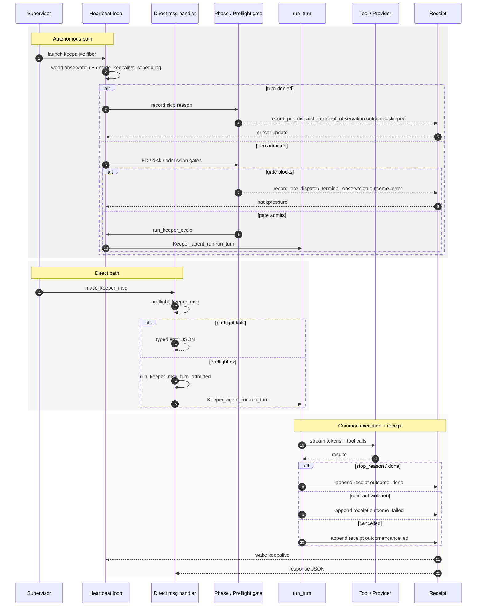

# 04. Turn Lifecycle

> Part of: [SPEC-INDEX](./SPEC-INDEX.md)
> Status: Draft
> Last Updated: 2026-06-13
> Supersedes: `docs/keeper-turn-lifecycle.md` (which becomes historical/tooling notes)

---

## 1. Problem Statement

MASC keeper는 장기 실행(long-running) 자율 에이전트다. 한 keeper가 "턴(turn)"을 시작하고 끝내는 경로는 여러 채널을 거친다:

- **Heartbeat-scheduled autonomous cycle**: keeper의 주기적 heartbeat 루프가 스케줄링 결정을 낸다.
- **Direct keeper message**: `masc_keeper_msg` 도구 호출이 heartbeat 루프를 우회해 즉시 턴을 실행한다.
- **Wakeup/polling**: board mention, broadcast, operator resume, directive, approval queue 등 외부 자극이 keeper를 깨운다.

이 경로들이 코드상 `lib/keeper/`의 여러 모듈과 OAS `Agent.run()` 경계에 걸쳐 있어, "턴이 어떻게 시작되고 종료되는가"를 설명하는 단일 권위 문서가 없으면 다음 문제가 생긴다:

1. **디버깅 어려움**: turn skip, livelock, cancel, receipt 누락의 원인을 추적할 때 파일을 여러 개 봐야 한다.
2. **prompt/instruction drift**: `config/prompts/`와 runbook이 서로 다른 turn 모델을 서술한다.
3. **OAS 경계 모호**: MASC가 OAS에 위임하는 지점과 MASC가 직접 관리하는 지점이 문서에 흩어져 있다.

이 문서는 turn lifecycle의 **단일 진실 원본(SSOT)**이 되어, 위 문제를 해결한다.

---

## 2. Non-Goals

| Non-Goal | 근거 |
|----------|------|
| OAS 내부 파이프라인 상세 | OAS SDK(`agent_sdk`) 문서와 [`13-oas-integration.md`](./13-oas-integration.md)가 담당. |
| keeper 행동 정책(페르소나, 도구 선택, 기억) | [`05-keeper-agent.md`](./05-keeper-agent.md), [`17-keeper-behavioral-regime.md`](./17-keeper-behavioral-regime.md)가 담당. |
| task 실행/PR 가시성 상세 | [`docs/audit/2026-06-04-keeper-task-execution-visibility-audit.md`](../audit/2026-06-04-keeper-task-execution-visibility-audit.md) 참조. |
| 외부 제품 비교 | MASC-specific 설계만 다룬다. |

---

## 3. Module Inventory

| Module | Role | Key Entry Point |
|--------|------|-----------------|
| `lib/keeper/keeper_keepalive.ml` | keeper lifecycle facade; directive/wakeup | `start_keepalive` |
| `lib/keeper/keeper_heartbeat_loop.ml` | heartbeat loop body, scheduling, unified turn dispatch | `run_heartbeat_loop` (`lib/keeper/keeper_heartbeat_loop.ml:592`), `run_keepalive_unified_turn` (`lib/keeper/keeper_heartbeat_loop.ml:123`) |
| `lib/keeper/keeper_heartbeat_loop_scheduling.ml` | pure scheduling decision | `decide_keepalive_scheduling` (`lib/keeper/keeper_heartbeat_loop_scheduling.ml:27`) |
| `lib/keeper/keeper_heartbeat_loop_cycle.ml` | admitted cycle wrapper + error classification | `run_keeper_cycle` (`lib/keeper/keeper_heartbeat_loop_cycle.ml:126`) |
| `lib/keeper/keeper_keepalive_signal.ml` | interruptible sleep, wakeup | `interruptible_sleep` (`lib/keeper/keeper_keepalive_signal.ml:163`), `wakeup_keeper` (`lib/keeper/keeper_keepalive_signal.ml:200`) |
| `lib/keeper/keeper_unified_turn.ml` | unified turn entry, phase gate, pre-dispatch | `run_keeper_cycle` (`lib/keeper/keeper_unified_turn.ml:24`) |
| `lib/keeper/keeper_unified_turn_phase_gate.ml` | phase gate + FSM transition | `decide_and_record` (`lib/keeper/keeper_unified_turn_phase_gate.ml:18`) |
| `lib/keeper/keeper_unified_turn_pre_dispatch.ml` | runtime execution builder | `build_runtime_execution` (`lib/keeper/keeper_unified_turn_pre_dispatch.ml:25`) |
| `lib/keeper/keeper_agent_run.ml` | single-turn OAS facade | `run_turn` (`lib/keeper/keeper_agent_run.ml:78`) |
| `lib/keeper/keeper_turn_driver.ml` | named-runtime dispatch to OAS | `run_named` (`lib/keeper/keeper_turn_driver.ml:41`) |
| `lib/keeper/keeper_turn.ml` | direct `masc_keeper_msg` handler | `preflight_keeper_msg` (`lib/keeper/keeper_turn.ml:127`), `run_keeper_msg_turn_admitted` (`lib/keeper/keeper_turn.ml:183`) |
| `lib/keeper/keeper_execution_receipt.ml` | receipt I/O + operator disposition | `append` |
| `lib/keeper/keeper_turn_fsm.ml` | keeper-coupled FSM transition emitter | `emit_transition` |
| `lib/turn_fsm/turn_fsm.mli` | pure typed FSM ADT | `_ turn_state` |
| `lib/eio_context/eio_context.ml` | fiber-local turn switch | `with_turn_switch` (`lib/eio_context/eio_context.ml:101`), `get_switch_opt` (`lib/eio_context/eio_context.ml:124`) |
| `lib/server/server_bootstrap_loops.ml` | fiber launch / supervision | `start_keeper_loops` |

---

## 4. Key Types

### 4.1 Sleep outcome

```ocaml
(* lib/keeper/keeper_keepalive_signal.ml:156 *)
type sleep_outcome =
  | Stopped   (* fiber_stop atomic was true *)
  | Woken     (* wakeup atomic transitioned true -> false via CAS *)
  | Timeout   (* duration elapsed without stop or wakeup *)
```

### 4.2 Scheduling decision

```ocaml
(* lib/keeper/keeper_heartbeat_loop_scheduling.ml:18 *)
type keepalive_scheduling_decision = {
  turn_decision : Keeper_world_observation.keeper_cycle_decision;
  requested_should_run_turn : bool;
  runtime_backpressure : runtime_backpressure_decision;
  should_run_turn : bool;
  verdict_reasons : string list;
  channel : string;
}
```

### 4.3 Turn FSM states

```ocaml
(* lib/turn_fsm/turn_fsm.mli:52 *)
type _ turn_state =
  | Idle : [`Idle] turn_state
  | Phase_gating : [`Phase_gating] turn_state
  | Runtime_routing : [`Runtime_routing] turn_state
  | Awaiting_provider : [`Awaiting_provider] turn_state
  | Streaming : [`Streaming] turn_state
  | Awaiting_tool_result : [`Awaiting_tool_result] turn_state
  | Completing : [`Completing] turn_state
  | Done : [`Done] turn_state
  | Failed : failure_reason -> [`Failed] turn_state
  | Cancelled : cancel_reason -> [`Cancelled] turn_state
```

### 4.4 Receipt outcome

Receipt의 `outcome` 필드는 pre-dispatch/execution 단계를 통틀어 다음 값을 가진다:

| Outcome | Meaning |
|---------|---------|
| `done` | OAS run이 정상 종료(stop_reason 수신) 후 receipt 기록 |
| `failed` | OAS run 실패, contract violation, 또는 livelock |
| `cancelled` | supervisor stop 등 외부 취소 |
| `skipped` | phase gate에 의해 turn이 실행되지 않음 |
| `error` | runtime unavailable, pre-dispatch 실패, registry phase missing 등 |

---

## 5. State Machines

### 5.1 Heartbeat loop flow



### 5.2 Turn lifecycle FSM



### 5.3 Autonomous vs direct path convergence



---

## 6. Lifecycle in Detail

### 6.1 Fiber launch

`lib/server/server_bootstrap_loops.ml`가 `start_keeper_loops`를 통해 keeper당 하나의 supervised Eio fiber를 띄운다. `Keeper_keepalive.start_keepalive`가 registry에 keeper를 등록하고, `Keeper_supervisor_launch.launch_supervised_fiber`가 `run_heartbeat_loop`를 감싸서 실행한다. fiber가 crash하면 supervisor가 recovery sweep을 통해 재시작할 수 있다.

### 6.2 Interruptible sleep and wakeup

`run_heartbeat_loop`는 매 cycle `interruptible_sleep` (`lib/keeper/keeper_keepalive_signal.ml:163`)을 호출한다. `stop` atomic이 `true`면 `Stopped`, `wakeup` atomic이 `true → false`로 CAS되면 `Woken`, 시간이 지나면 `Timeout`을 반환한다.

Wakeup은 다음 source에서 올 수 있다:

- `wakeup_keeper` (`lib/keeper/keeper_keepalive_signal.ml:200`): board mention, broadcast, `masc_keeper_msg`, operator resume 등이 호출.
- gRPC directive: `process_directive`에서 `resume`/`wakeup`/`claim:<task_id>` 처리 시 `fiber_wakeup` 설정.
- Event Layer queue: `?stimulus`를 함께 enqueue할 수 있어, 단순 hint가 아닌 payload도 전달.

### 6.3 Smart heartbeat gate

`run_smart_heartbeat_gate`는 visibility gate와 heartbeat interval을 조합해 cycle이 계속 평가할지, 아니면 idle sleep할지 결정한다. `Skip_idle`은 단순히 다시 sleep하고, `Skip_busy`는 cycle 평가를 계속한다(claim-holding keeper starvation 버그 회귀 방지).

### 6.4 Scheduling decision

`decide_keepalive_scheduling` (`lib/keeper/keeper_heartbeat_loop_scheduling.ml:27`)은:

1. `Keeper_world_observation.keeper_cycle_decision`을 계산(should_run, channel, verdict, cooldown, idle gate 등).
2. `stop` atomic과 결합해 `requested_should_run_turn`을 계산.
3. runtime backpressure(`Runtime_admitted` | `Runtime_backpressured`)를 확인.
4. 최종 `should_run_turn`과 `verdict_reasons`를 반환.

`should_run_turn=false`면 skip reason metric을 기록하고 다음 cycle로 돌아간다.

### 6.5 Admission gates

`should_run_turn=true`라도 다음 gate가 차면 turn은 실행되지 않는다:

- `fiber_stop` atomic (`lib/keeper/keeper_heartbeat_loop.ml:297`)
- FD pressure circuit breaker (`Keeper_fd_pressure.active`)
- Disk pressure circuit breaker (`Keeper_disk_pressure.active`)
- Projected FD budget exhaustion (`Keeper_fd_pressure.admit_turn`)
- Disk free-space budget (`Keeper_disk_pressure.admit_turn`)

이들은 backpressure/skip으로 처리되며, registry에 기록된다.

### 6.6 Admitted cycle wrapper

`run_keeper_cycle` (`lib/keeper/keeper_heartbeat_loop_cycle.ml:126`)은 `Keeper_turn_admission.run_if_free`로 한 번에 하나의 turn만 실행되도록 한다. `Busy`면 skip하고, `Ran`이면 `run_keeper_cycle_admitted`를 실행한다.

`run_keeper_cycle_admitted`는 `with_in_turn_liveness_pulse`로 in-turn liveness pulse fiber를 띄우고, 그 안에서 `Keeper_unified_turn.run_keeper_cycle`를 호출한다. Error 발생 시 fatal environment error면 `Keeper_fiber_crash`를 raise하고, provider timeout이면 strike counter를 갱신한다.

### 6.7 Unified turn entry

`Keeper_unified_turn.run_keeper_cycle` (`lib/keeper/keeper_unified_turn.ml:24`)은:

1. `keeper_turn_id = meta.runtime.usage.total_turns + 1`로 할당.
2. runtime manifest context를 만들고 `Turn_started` manifest를 append.
3. FSM transition `Idle → Phase_gating` emit.
4. Phase gate 호출.
5. Proceed path에서 pre-dispatch runtime execution을 build.
6. Livelock guard 통과 후 prompt를 build.
7. `Keeper_agent_run.run_turn` 호출.

### 6.8 Phase gate

`Keeper_unified_turn_phase_gate.decide_and_record` (`lib/keeper/keeper_unified_turn_phase_gate.ml:18`)은:

- `fiber_stop`이 설정되어 있으면 `Cancelled_supervisor_stop`.
- registry phase가 non-executable이면 `skipped` outcome + `Done`.
- registry phase가 `None`이면 `error` outcome + `Failed`.
- executable phase면 `Runtime_routing`으로 transition.

모든 terminal path는 `record_pre_dispatch_terminal_observation`을 통해 receipt/observation을 남긴다.

### 6.9 Pre-dispatch runtime build

`Keeper_unified_turn_pre_dispatch.build_runtime_execution` (`lib/keeper/keeper_unified_turn_pre_dispatch.ml:25`)은:

- effective model labels 조회
- API key 확인
- local discovery readiness 확인
- `max_context`, `temperature`, `max_tokens` resolve/validate

실패 시 `Failure_runtime_unavailable` 또는 `Failure_provider_error`로 FSM transition. 성공 시 `pre_dispatch_success` observation을 기록하고 `Awaiting_provider`로 transition.

### 6.10 Livelock guard

`Keeper_turn_livelock.guard_and_record_turn_start`는 동일 turn이 반복해서 stuck되지 않도록 한다. `Blocked`면 `Failure_turn_livelock_blocked`. `Started`면 계속 진행.

### 6.11 Agent run

`Keeper_agent_run.run_turn` (`lib/keeper/keeper_agent_run.ml:78`)은 OAS를 호출하기 위한 facade다.

1. input sanitize.
2. turn start observation emit.
3. cancel-safe finally(`safe_emit_turn_end`) 등록.
4. `Eio.Switch.run` + `Eio_context.with_turn_switch`로 turn-scoped switch 설정.
5. `Keeper_run_context.prepare_run_context`로 checkpoint, inference params, base prompt 준비.
6. `prepare_agent_setup`으로 tools, hooks, reducer 준비.
7. `Keeper_turn_driver.run_named`로 OAS dispatch.

### 6.12 Turn-scoped Eio switch

`Eio_context.with_turn_switch` (`lib/eio_context/eio_context.ml:101`)은 현재 fiber에 turn-scoped switch를 바인딩한다. `Eio_context.get_switch_opt` (`lib/eio_context/eio_context.ml:124`)은 fiber-local binding이 있으면 그것을, 없으면 server root switch를 반환한다. 덕분에 turn 중에 열린 HTTP 연결이나 sandbox handle은 turn 종료 시 함께 정리된다.

### 6.13 Driver and OAS dispatch

`Keeper_turn_driver.run_named` (`lib/keeper/keeper_turn_driver.ml:41`)은:

1. `Runtime.get_runtime_by_id`로 runtime profile을 찾는다(없으면 fail-fast, RFC-0207).
2. `Runtime_candidate.of_provider_config`로 단일 execution candidate를 만든다.
3. transport를 resolve하고, `Keeper_turn_driver_try_provider`를 통해 OAS `Agent.run()`을 호출한다.

MASC keeper hot path는 단일 provider run만 사용하며(`oas_dispatch_mode = Single_provider_agent_run`), OAS internal runtime으로 fallback하지 않는다. 이는 `Keeper_runtime_engine.guard_keeper_hot_path`와 `test/test_keeper_runtime_engine_guard.ml`로 강제된다.

### 6.14 Direct keeper message path

`Keeper_turn.handle_keeper_msg` → `preflight_keeper_msg` (`lib/keeper/keeper_turn.ml:127`)은:

- name/message validation
- keeper existence check
- runtime id resolve
- API key / local discovery check

통과하면 `run_keeper_msg_turn_admitted` (`lib/keeper/keeper_turn.ml:183`)이 `Keeper_agent_run.run_turn`을 직접 호출한다. 이 경로는 heartbeat scheduling과 phase gate를 우회하지만, keeper 존재 여부와 runtime preflight는 동일하게 수행한다.

턴 종료 후 direct path는 결과 JSON을 반환하고, keepalive를 깨워 다음 cycle에서 상태 변화를 pick up한다.

### 6.15 Receipt

모든 terminal path는 `Keeper_execution_receipt`에 row를 append한다. Pre-dispatch terminal observation(`record_pre_dispatch_terminal_observation`)과 execution 완료 시 `append`는 모두 `keeper_turn_id`를 correlation으로 포함한다. Operator disposition(`operator_disposition`)은 `(outcome, terminal_reason_code, error_kind, runtime_outcome)`을 기준으로 `pass`/`pause_human`/`alert_exhausted`/`skipped`/`cancelled` 등으로 분류한다.

---

## 7. Invariants

| ID | Invariant | Enforcement |
|----|-----------|-------------|
| INV-TURN-001 | 모든 turn 시도는 `keeper_turn_id`를 할당받는다. | `Keeper_unified_turn.run_keeper_cycle` entry에서 `total_turns + 1` 할당. |
| INV-TURN-002 | 모든 terminal path는 receipt 또는 pre-dispatch observation을 남긴다. | `record_pre_dispatch_terminal_observation`이 phase skip/error/cancel/livelock 경로에서 호출; execution 종료 시 `Keeper_execution_receipt.append`. |
| INV-TURN-003 | Turn 중 열린 리소스는 turn-scoped `Eio.Switch`에 묶인다. | `Keeper_agent_run.run_turn` → `Eio.Switch.run` + `Eio_context.with_turn_switch`. |
| INV-TURN-004 | Direct message는 heartbeat scheduling을 우회해도 keeper existence와 runtime preflight를 반드시 거친다. | `Keeper_turn.preflight_keeper_msg`이 name validation, `ensure_keeper_exists`, `resolve_turn_runtime_id`, API key, local discovery를 체크. |
| INV-TURN-005 | Wakeup은 단일 fiber에서 CAS로 소비되며, `interruptible_sleep`은 `Woken`/`Timeout`/`Stopped`를 명확히 구분한다. | `Keeper_keepalive_signal.interruptible_sleep`의 `Atomic.compare_and_set wakeup true false`. |
| INV-TURN-006 | Keeper hot path는 단일 provider OAS run만 사용하고, OAS internal runtime fallback을 허용하지 않는다. | `Keeper_runtime_engine.guard_keeper_hot_path`, `Keeper_turn_driver.run_named` 단일 candidate, `test/test_keeper_runtime_engine_guard.ml`. |
| INV-TURN-007 | 한 keeper의 turn은 admission slot이 free할 때만 시작된다. | `Keeper_turn_admission.run_if_free` in `Keeper_heartbeat_loop_cycle.run_keeper_cycle`. |
| INV-TURN-008 | Phase gate는 turn 실행 전 stop signal과 non-executable phase를 선제적으로 확인한다. | `Keeper_unified_turn_phase_gate.decide_and_record`. |

---

## 8. Failure Modes

| Failure | Where detected | Receipt outcome | FSM terminal |
|---------|---------------|-----------------|--------------|
| Non-executable phase | Phase gate | `skipped` | `Done` |
| Registry phase missing | Phase gate | `error` | `Failed` |
| Supervisor stop at turn entry | Phase gate | `cancelled` | `Cancelled supervisor_stop` |
| API key / local discovery failure | Pre-dispatch | `error` | `Failed` |
| Runtime unavailable / config error | Pre-dispatch | `error` | `Failed` |
| Turn livelock blocked | Livelock guard | `error` | `Failed` |
| Provider error during streaming | OAS run | `failed`/`error` | `Failed` |
| Completion contract violation | Post-run | `failed` | `Failed` |
| Receipt write failure | Post-run | `failed` | `Failed` |
| Provider timeout | OAS run | `cancelled`/`failed` | `Cancelled provider_timeout` |
| Fleet shutdown during tool wait | OAS run | `cancelled` | `Cancelled fleet_shutdown` |

---

## 9. Dependencies

### Upstream
- `lib/keeper/keeper_registry.ml` — keeper meta, phase, failure reason SSOT.
- `lib/keeper/keeper_world_observation.ml` — world observation, scheduling verdict.
- `lib/keeper/keeper_meta_contract.ml` — runtime id, phase contract.
- `lib/eio_context/eio_context.ml` — server root switch, fiber-local turn switch.
- `lib/keeper/keeper_turn_admission.ml` — per-keeper turn slot.

### Downstream
- OAS `Agent_sdk` — `Agent.run`, checkpoint, context reducer, hooks.
- `lib/keeper/keeper_execution_receipt.ml` — durable receipt row.
- `lib/keeper/keeper_event_publisher.ml` / `Keeper_event_bus.ml` — lifecycle events.
- `lib/keeper/keeper_turn_fsm.ml` — typed transition telemetry.

---

## 10. Open Questions

| ID | Question | Related code | Status |
|----|----------|--------------|--------|
| OQ-TURN-001 | `Cancelled_*` cancel reason이 run_turn 내부에서 `safe_emit_turn_end` catch-all로 소비되는 부분을 `Switch.on_release`로 명시적으로 FSM에 연결할 것인가? | `lib/keeper/keeper_agent_run.ml:148` | Open (RISKY) |
| OQ-TURN-002 | `Awaiting_provider → Streaming` 및 `Streaming ⇄ Awaiting_tool_result` transition을 run_turn 내부에서 emit할 것인가? | `lib/keeper/keeper_agent_run.ml` | Open |
| OQ-TURN-003 | Direct message path도 FSM transition을 emit할 것인가? 현재는 autonomous path 위주로 기록된다. | `lib/keeper/keeper_turn.ml` | Open |

---

## 11. References

- `docs/spec/05-keeper-agent.md` — keeper engine 전반.
- `docs/spec/13-oas-integration.md` — OAS bridge, runtime config, boundary rules.
- `docs/keeper-turn-lifecycle.md` — historical diagrams, open-work table, tooling notes.
- `specs/keeper-turn-fsm/KeeperTurnFSM.tla` — formal FSM spec.
- `specs/keeper-state-machine/KeeperHeartbeat.tla` — heartbeat loop spec.
- `specs/keeper-state-machine/KeeperTaskAcquisition.tla` — task acquisition spec.
