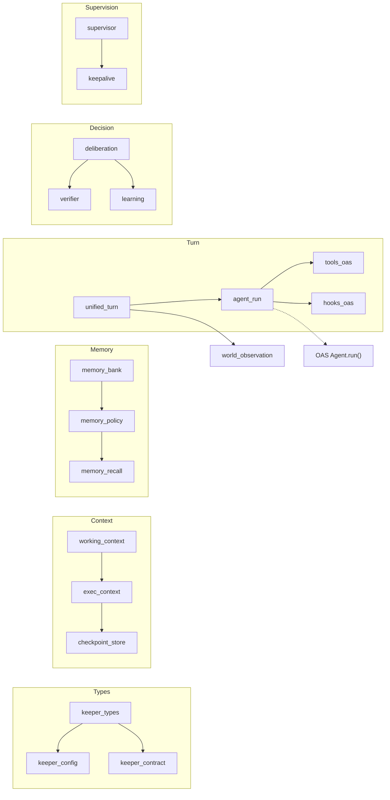
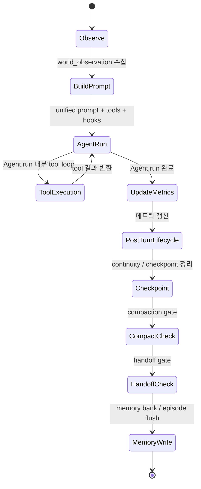
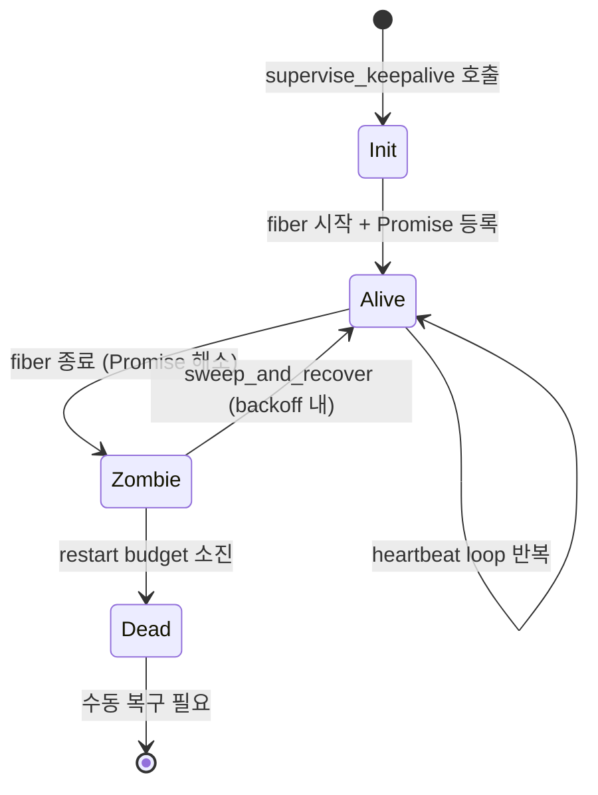
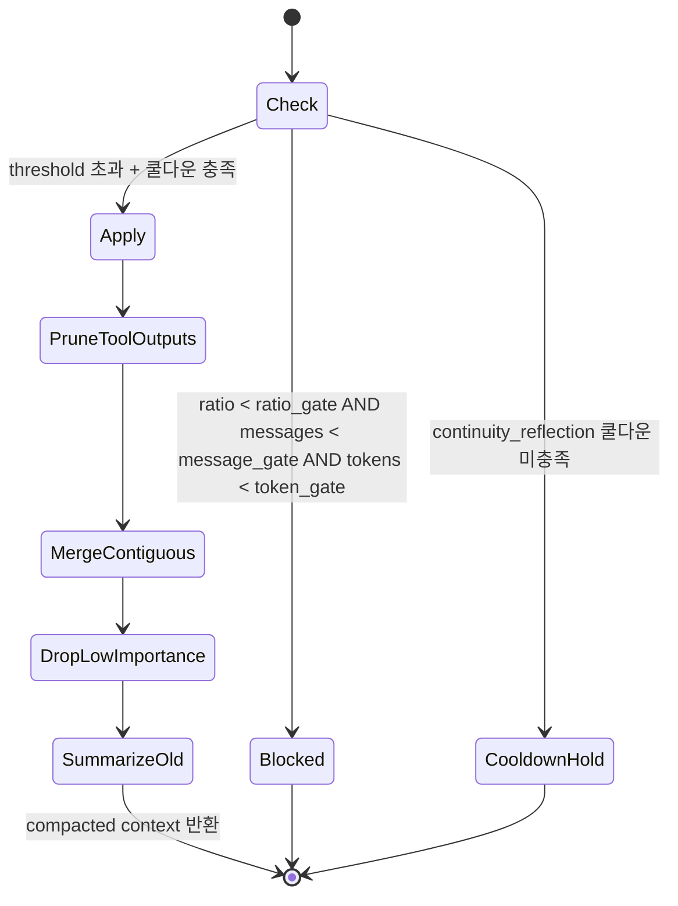

# Keeper Agent System

| 항목 | 값 |
|------|-----|
| Status | Draft |
| Team | Keeper |
| Maps to | `lib/keeper/` (72 files) |
| Dependencies | 02-types-and-invariants, 13-oas-integration |
| Modules | 67 (.ml) + 5 (.mli-only) |
| LOC | ~17.8K |
| MCP Tools | `tool_keeper` |
| External Deps | `Agent_sdk` (OAS), `Llm_provider`, `Room`, `Cascade_inference`, `Verifier_oas` |

---

## 1. Purpose

Keeper는 MASC의 자율 에이전트 하네스(harness)다. OAS `Agent.run` 위에서 동작하며, 장기 실행(perpetual) 루프, 컨텍스트 관리, 메모리 계층, 심의(deliberation), 승계(succession), 검증(verification)을 담당한다.

Keeper 하나는 다음을 소유한다:
- **identity**: `keeper_meta` 레코드 (이름, 목표, will/needs/desires)
- **context**: `working_context` (system prompt + messages + token count + OAS context)
- **memory**: memory bank + memory policy + recall scoring
- **lifecycle**: heartbeat fiber + supervisor + checkpoint store

Keeper는 외부 세계를 관찰(`world_observation`)하고, 프롬프트를 구성하고, OAS `Agent.run`에 위임하고, 결과로부터 메트릭을 갱신하는 루프를 반복한다.

---

## 2. Architecture



### 2.1 모듈 분류 (12 범주)

| 범주 | 대표 파일 | 파일 수 |
|------|----------|--------|
| Types | `keeper_types.ml`, `keeper_types_profile.ml`, `keeper_types_support.ml` | 3 |
| Config | `keeper_config.ml`, `keeper_toml_loader.ml` | 2 |
| Context | `keeper_context_core.ml`, `keeper_exec_context.ml`, `keeper_checkpoint_store.ml` | 3 |
| Memory | `keeper_memory*.ml` (bank, policy, recall) | 4 |
| Prompt / Skill | `keeper_prompt.ml`, `keeper_unified_prompt.ml`, `keeper_skill_routing.ml` | 3 |
| Turn Execution | `keeper_agent_run.ml`, `keeper_unified_turn.ml`, `keeper_tools_oas.ml`, `keeper_hooks_oas.ml`, `keeper_extend_turns.ml` | 5 |
| Decision | `keeper_deliberation.ml` | 1 |
| Supervision | `keeper_supervisor.ml`, `keeper_keepalive.ml`, `keeper_world_observation.ml` | 3 |
| MCP Surface | `keeper_turn.ml`, `keeper_status.ml`, `keeper_persona.ml`, `keeper_schema.ml` | 4 |
| Alerting / Metrics | `keeper_alerting*.ml`, `keeper_exec_status*.ml`, `keeper_status_detail.ml` | 6+ |

---

## 3. Types

### 3.1 keeper_meta

Keeper의 전체 상태를 담는 레코드. `lib/keeper/keeper_types.ml`에 정의되며, 약 100개 필드를 가진다.

**소스**: `keeper_types.ml` (lines 9-106)

주요 필드 군:

- **Identity**: `name`, `agent_name`, `trace_id`, `trace_history`
- **Lineage**: `generation`, `trace_id`, `trace_history`, `last_handoff_ts`
- **Goal (3-horizon)**: `goal`, `short_goal`, `mid_goal`, `long_goal`
- **Model**: `cascade_name`, `last_model_used`, derived `active_model`
- **Capability**: `policy_voice_enabled`, `allowed_paths`
- **Scope**: `mention_targets`, `joined_room_ids`
- **Proactive**: `proactive_enabled`, `proactive_idle_sec`, `proactive_cooldown_sec`
- **Compaction**: `compaction_profile`, `compaction_ratio_gate`, `compaction_message_gate`
- **Handoff**: `auto_handoff`, `handoff_threshold`, `handoff_cooldown_sec`
- **Metrics**: `total_turns`, `total_tokens`, `total_cost_usd`, `last_turn_ts` 등
- **Team/Autonomy**: `active_goal_ids`, `autonomous_turn_count`, `board_reactive_turn_count`, `mention_reactive_turn_count`

직렬화: `meta_to_json` / `meta_of_json`로 JSON 왕복. `validate_name`이 역직렬화 시점에 이름/trace_id를 검증한다.

Generation semantics are operational, not genealogical: a successful rollover keeps the same keeper identity but commits a new `trace_id`, increments `generation`, and appends the old trace to `trace_history`.

### 3.2 working_context

**소스**: `keeper_context_core.ml` (working_context type는 이 모듈에 inline됨; 구 `keeper_working_context.ml`은 #4393에서 제거)

```ocaml
type working_context = {
  system_prompt : string;
  messages : Agent_sdk.Types.message list;
  token_count : int;
  max_tokens : int;
  importance_scores : (int * float) list;
  oas_context : Agent_sdk.Context.t;
}
```

Keeper의 실행 중 대화 컨텍스트. `oas_context`는 OAS Context 모듈과 동기화된다(`sync_oas_context`).

토큰 추정: `msg_tokens = (String.length text / 4) + 4` (문자 기반 근사치).

### 3.3 checkpoint / session_context

```ocaml
type checkpoint = {
  checkpoint_id : string;
  timestamp : float;
  generation : int;
  message_count : int;
  token_count : int;
  serialized : string;      (* JSON-serialized working_context *)
}

type session_context = {
  session_id : string;
  session_dir : string;
  mutable checkpoints : checkpoint list;
}
```

세션당 최대 3개 체크포인트가 유지된다(`max_checkpoints_retained = 3`). 세션 메시지는 `history.jsonl`에 영속화.

### 3.4 Coordination Boundary

Legacy room-targeting typed aliases were removed during single-room flattening.
JSON/MCP 경계에는 `mention_targets`, `joined_room_ids` 같은 coordination 값만 남고, 별도 scope enum은 더 이상 유지하지 않는다.
`policy_mode`, `policy_shell_mode`, `trigger_mode`, `initiative_*`는 제거되었다.

### 3.5 fiber_health

```ocaml
type fiber_health =
  | Fiber_alive     (* fiber 실행 중, promise 미해소 *)
  | Fiber_zombie    (* registry 존재하나 fiber 종료 *)
  | Fiber_dead      (* 재시작 예산 소진, 수동 복구 필요 *)
  | Fiber_unknown   (* supervised registry에 없음 *)
```

Supervisor가 keeper fiber의 건강 상태를 추적하는 데 사용.

---

## 4. State Machines

### 4.1 Unified Turn Lifecycle



단계 설명:

1. **Observe**: `keeper_world_observation.observe`로 room 상태, 멘션, board 이벤트, idle 시간, 경제 압력 등을 수집
2. **BuildPrompt**: `keeper_unified_prompt.build_prompt`로 keeper identity + observation을 단일 (system_prompt, user_message) 쌍으로 조립
3. **AgentRun**: `keeper_agent_run.run_turn`이 OAS `Agent.run`에 위임. tools + hooks + context_reducer + memory 전달
4. **ToolExecution**: Agent가 tool을 호출하면 `keeper_tools_oas`가 `keeper_exec_tools.execute_keeper_tool_call`로 디스패치
5. **UpdateMetrics**: `keeper_unified_turn.update_metrics_from_result`가 turn count, token 사용량, cost 등을 keeper_meta에 반영
6. **PostTurnLifecycle**: `keeper_post_turn.apply_post_turn_lifecycle`가 compaction, handoff rollover, continuity summary를 single-writer로 처리
7. **Checkpoint / Compact / Handoff**: checkpoint 저장 후 gate에 따라 compaction 또는 handoff rollover를 실행
8. **MemoryWrite**: `keeper_agent_run` tail에서 memory bank note append와 episodic flush를 수행. hebbian은 task lifecycle에서만 기록

### 4.1.1 Post-turn Persistence Matrix

| 경계 | OCaml owner | 저장소 | TLA/FSM |
|------|-------------|--------|---------|
| compaction | `keeper_post_turn.ml` | 현재 trace checkpoint | `KeeperContextLifecycle.tla` |
| handoff rollover | `keeper_post_turn.ml` + `keeper_rollover.ml` | 새 trace checkpoint + keeper meta lineage | `KeeperGenerationLineage.tla`, keeper FSM `Handoff_*` events |
| continuity summary | `keeper_post_turn.ml` | keeper meta | keeper post-turn contract |
| memory bank | `keeper_agent_run.ml` | `.masc/keepers/<name>.memory.jsonl` | memory policy / bank compaction |
| episode flush | `keeper_agent_run.ml` | `.masc/institution_episodes.jsonl` | episode schema / JSONL cap |
| hebbian learning | `coord_task.ml` | `.masc/synapses/graph.json` | task lifecycle + hebbian rules |

### 4.2 Keeper Supervisor Lifecycle



- `supervise_keepalive`: keeper heartbeat loop을 supervised fiber로 실행
- `sweep_and_recover`: 주기적으로 zombie 감지, exponential backoff로 재시작
- Backoff: `MASC_KEEPER_SUPERVISOR_BACKOFF_BASE_S` * 2^attempt (최대 `_MAX_S`)
- 최근 5건의 crash log 유지

### 4.3 Compaction Policy



Compaction은 OAS `Context_compact_oas` 모듈에 위임하며, 4단계 전략을 순차 적용:
1. `PruneToolOutputs` -- 도구 출력 축소
2. `MergeContiguous` -- 연속 메시지 병합
3. `DropLowImportance` -- 중요도 낮은 메시지 제거
4. `SummarizeOld` -- 오래된 메시지 요약

Compaction profile별 gate 기본값:

| Profile | ratio_gate | message_gate | token_gate |
|---------|-----------|--------------|------------|
| `aggressive` | 0.35 | 120 | 60,000 |
| `balanced` | 0.50 | 240 | 120,000 |
| `conservative` | 0.70 | 480 | 250,000 |
| `custom` | env 기반 | env 기반 | env 기반 |

### 4.4 Deliberation Pipeline

Triage -> BudgetCheck -> (ModelDeliberation | DeterministicBaseline) -> Execute -> RecordDecision

9가지 triage 트리거: `DirectMention`, `NewUnclaimedTask`, `FailedTask`, `AgentJoinedOrLeft`, `GoalDeadline`, `BoardActivity(string)`, `IdleTimeout`, `MetricsAnomaly(string)`, `StrategicReview`. 트리거가 없으면 Skip.

---

## 5. Protocol / Data Flow

### 5.1 keeper_msg (메시지 턴)

1. `handle_keeper_msg` -> `run_turn` 호출
2. `load_context_from_checkpoint`로 세션/컨텍스트 복원
3. `build_keeper_system_prompt` + `build_turn_prompt` callback으로 프롬프트 구성
4. `make_tools` (keeper tool bridge) + `make_hooks` (safety gates) 생성
5. `Oas_worker.run_named` -> OAS `Agent.run` loop (tool calls -> hooks -> response)
6. `persist_message` (assistant 응답 영속화)
7. 결과 반환: `run_result { response_text, model_used, turn_count, tool_calls_made, usage, tools_used }`

### 5.2 Unified Keeper Turn (heartbeat 경로)

1. `keeper_keepalive` heartbeat tick
2. `world_observation.observe` -> 세계 상태 수집
3. `unified_turn.run_unified_turn` -> `build_prompt` + `run_turn`
4. `update_metrics_from_result` -> keeper_meta 갱신
5. `write_meta` -> 메타데이터 영속화

### 5.3 OAS 통합 구성

`run_turn`이 OAS에 전달: `cascade_name`(모델 선택), `tools`(keeper_tools_oas + extend_turns), `hooks`(cost/destructive guard), `context_reducer`(keep_last 30 + Prune_tool_outputs + Merge_contiguous), `memory`(institution + procedures + bank + episodes), `initial_messages`(checkpoint 복원).

---

## 6. Memory Subsystem

### 6.1 계층 구조

```
keeper_memory.ml (facade)
  |-- keeper_memory_recall.ml (recall scoring, cost calculation)
       |-- keeper_memory_bank.ml (bank persistence, dedup, filtering)
            |-- keeper_memory_policy.ml (retention caps, profile-based selection)
```

### 6.2 Memory Bank

- 저장 경로: `.masc/keeper-memory/{name}/memory_bank.jsonl`
- 레코드 형식: `(kind, text, priority)` 튜플
- Kind 예시: `"goal"`, `"observation"`, `"reflection"`, `"procedure"`
- Dedup: `normalize_memory_text_key`로 공백/구두점 제거 후 비교
- Placeholder 필터: `"none"`, `"null"`, `"없음"` 등은 무의미로 간주하여 제외

### 6.3 Memory Policy

Profile별 종류당 보존 상한:

| Profile | Total cap | Kind caps |
|---------|----------|-----------|
| `aggressive` | 낮음 | 종류별 상한 타이트 |
| `balanced` | 중간 | 기본 |
| `conservative` | 높음 | 종류별 상한 느슨 |

`select_memory_candidates_by_profile`이 profile에 맞게 메모리를 필터링.

### 6.4 Memory Recall

- `is_memory_recall_query`: 사용자 메시지가 기억 관련 질의인지 감지 (한국어 + 영어 needle 매칭)
- `expected_topic_hint`: 질의에서 기대 토픽 추출
- `read_keeper_memory_summary`: memory bank에서 최근 N개 라인 읽어 요약
- Cost 계산: `cost_usd_of_usage`로 모델별 가격 추정

### 6.5 OAS Memory Bridge

`run_turn`에서 `Memory_oas_bridge.create_memory`로 institution / procedures / memory bank / episodes 계층을 seed한다. 턴 후 영속화는 분리된다: memory bank는 `append_memory_notes_from_reply`, episode는 `store_episode_from_snapshot` + `flush_incremental`, hebbian은 별도의 task lifecycle에서 기록된다.

---

## 7. Evaluation and Verification

### 7.1 Keeper Verifier (Generator-Verifier Loop)

**소스**: `lib/verifier_core.ml`, `lib/verifier_oas.ml`; guards는 `lib/keeper/keeper_guards.ml`에 분리됨 (구 `keeper_verifier.ml`은 #2589에서 제거)

파이프라인: `evaluate_next_action` -> `generate_action_plan` -> `verify_action`

```
proposed_action
  |-- cost_guard: estimated_cost > $0.10 -> Block
  |-- risk_guard: `Dangerous -> Block
  |-- Verifier_oas.verify -> Pass/Warn/Fail -> Proceed/Caution/Block
```

판정 결과:

| Verdict | 의미 |
|---------|------|
| `Proceed` | 실행 진행 |
| `ProceedWithCaution(reason)` | 실행하되 trajectory에 경고 기록 |
| `Block(reason)` | 실행 거부, broadcast 알림 |

Risk 추정: goal의 horizon + priority 조합으로 `Safe` / `Moderate` / `Dangerous` 결정.

### 7.2 Eval Harness (`lib/eval_harness.ml`)

시나리오 기반 행동 평가. `scenario`(goal + graders + tool expectations) -> `Deterministic`(Exact/Contains/Regex) 또는 `ModelBased`(MODEL 채점) grader -> weight 합산 점수.

### 7.3 Anti-Fake (retired)

테스트 코드 품질 점수화 모듈(`lib/anti_fake.ml`)은 #2848 dead-code sweep에서 제거됐다. 테스트 품질은 현재 alcotest + QCheck assertion 및 CI의 `test_ci_hardening_source.ml` contract test가 담당한다.

### 7.4 Trajectory (`lib/trajectory.ml`)

Tool call을 `.masc/trajectories/{name}/{trace_id}.jsonl`에 JSONL 기록. 용도: replay, cost 추적, entropy 감지, eval 입력.

---

## 8. Hooks (OAS Integration)

**소스**: `lib/keeper/keeper_hooks_oas.ml`

OAS Agent.run의 hook lifecycle에 keeper 동작을 주입:

### 8.1 pre_tool_use

| 검사 | 동작 |
|------|------|
| Cost budget | 누적 cost가 한도 초과 시 tool call 거부 |
| Destructive pattern | `rm -rf`, `drop table`, `force push` 등 위험 패턴 감지 시 거부 |
| Autonomy filter | autonomy_level에 따라 허용 tool 목록 필터링 |

Destructive check 대상 도구: `keeper_bash`, `keeper_fs_edit`, `keeper_edit`, `keeper_github`

### 8.2 Autonomy Level Tool Gating

| Level | 허용 도구 |
|-------|----------|
| `l3_guided` | board ops + read-only shell + code navigation |
| `l4_autonomous` | l3 + `keeper_bash` + `keeper_fs_edit` + `keeper_edit` |
| `l5_independent` | 제한 없음 (AllowAll) |

---

## 9. Configuration

### 9.1 keeper_config.ml 핵심 파라미터

모든 환경변수는 `MASC_KEEPER_` 접두사를 사용한다. 전체 목록은 `lib/keeper/keeper_config.ml` 참조.

**Compaction**: `COMPACT_RATIO`(0.5), `COMPACT_MAX_MESSAGES`(240), `COMPACT_MAX_TOKENS`(0), `CONTINUITY_COMPACTION_COOLDOWN_SEC`(90)

**Proactive**: `PROACTIVE_TEMP_LOW/MID/HIGH`(0.55/0.75/0.9), `PROACTIVE_SIMILARITY`(0.72), `PROACTIVE_MAX_TOKENS`(1024)

**Cost Gates**: `TOOL_COST_MAX_USD`(disabled by default; set a positive USD value to enable the live unified-turn accumulated cost ceiling, `0` keeps it disabled), `COST_GATE_USD`(0.10, legacy compatibility knob; not used by the unified turn cost guard)

**Unified Turn**: `UNIFIED_TEMP`(0.4), `UNIFIED_MAX_TOKENS`(2048), `UNIFIED_MAX_TURNS`(1000)

**Execution**: `MAX_TOOL_ROUNDS`(3), `AUTONOMOUS_MAX_TOKENS`(4000), `DELIBERATION_MAX_TOKENS`(1024), `DELIBERATION_DAILY_BUDGET_USD`

**Other**: `DEBUG`(0), `SKILL_SELECTION`(agent), `BOOTSTRAP_PROACTIVE_WARMUP_SEC`(60)

**Rule Engine**: `RULE_REFLECT_REPETITION`(0.86), `RULE_GUARDRAIL_REPETITION`(0.90), `RULE_GUARDRAIL_CONTEXT_MIN`(0.70)

### 9.2 TOML Configuration

`config/keepers/*.toml`로 keeper를 선언적으로 정의. 파일명이 keeper 이름. 지원 타입: string, int, float, bool, string array. 테이블은 dotted key로 평탄화. 예시: `config/keepers/janitor.toml`.

### 9.3 Keeper Runtime Spec

Canonical file model:

```text
<basepath>/.masc/config/personas/{name}/profile.json
<basepath>/.masc/config/keepers/{name}.toml
<basepath>/.masc/keepers/{name}.json
<basepath>/.masc/keepers/{name}/...
```

- `profile.json`: identity / persona blueprint
- `keepers/{name}.toml`: deployment declaration for this basepath
- `.masc/keepers/{name}.json`: durable runtime state
- `.masc/keepers/{name}/...`: metrics, decisions, trajectories, checkpoints, and other high-cardinality runtime artifacts

keeper는 durable always-on으로 취급되며, `keeper_up`은 inline args, TOML, persona defaults를 합쳐 초기 `keeper_meta`를 생성한다. runtime 중지 여부는 `paused` 또는 `keeper_down`으로 표현한다.

Current implementation note: compatibility reasons may still cause some authored fields to be materialized into `.masc/keepers/{name}.json`, but the intended edit surfaces remain persona profile and keeper TOML.

---

## 10. Proactive Behavior

Keeper는 idle 상태에서 주기적으로 자발적 행동을 생성한다.

### 10.1 Quality Gate

`proactive_quality_check`가 생성된 텍스트를 검증:

1. `extract_checkin_text`: `CHECKIN:` 접두사 추출 또는 전체 텍스트 사용
2. `proactive_looks_fragmentary`: 미완성 문장 감지 (`"`, `(`, `:`, `-` 등으로 끝남)
3. `proactive_has_terminal_ending`: 종결 구두점 또는 한국어 종결 어미(`다`, `요`, `니다`, `습니다`) 확인
4. Similarity check: 이전 출력과 Jaccard 유사도 >= threshold(0.72) 시 재생성

실패 시 최대 3회 재시도, temperature를 점진적으로 상승(0.55 -> 0.75 -> 0.9).

### 10.2 Fallback Reply

3회 모두 실패하면 deterministic fallback 템플릿을 사용한다. 모든 keeper에 동일한 통합 fallback 문구가 적용된다.

---

## 11. Self-Model Drift

**소스**: `keeper_config.ml` (`compact_self_model_text`)

Keeper는 자기 모델(will, needs, desires)의 텍스트를 상한 내로 유지한다.

- `drift_enabled`: 드리프트 활성화 여부
- `drift_max_clauses`: 최대 절 수 (기본 6개)
- `drift_max_chars`: 최대 문자 수 (기본 320자)

`compact_self_model_text`가 semicolon으로 구분된 절 목록을 상한 내로 유지하며, 초과 시 오래된 절을 제거(`take_last`).

---

## 12. Learning System (retired)

전용 learning 모듈(`lib/keeper/keeper_learning.ml`, `keeper_feedback_tool.ml`)은 #2589 dead-module sweep에서 제거됐다. decision_record JSONL 스키마와 `record_decision`/`record_outcome`/`record_feedback` 파이프라인도 runtime에서 사라졌다. 심의 기록은 현재 `keeper_deliberation.ml` + trajectory(`lib/trajectory.ml`) + procedural memory(`lib/procedural_memory.ml`)가 나눠 담당한다.

---

## 13. Skill Routing

**소스**: `lib/keeper/keeper_skill_routing.ml`

Keeper turn에서 어떤 "skill" 경로를 사용할지 결정:

허용 skill 목록: `masc-heartbeat`, `masc-keeper-autonomy`

선택 모드:
- `SkillSelectAgent`: MODEL에 skill 선택을 위임하는 단일 모드

---

## 14. Invariants

### INV-KEEPER-001: keeper_meta.name 유효성

`validate_name`이 `^[A-Za-z0-9._-]+$` 정규식으로 이름을 검증한다. 빈 문자열 또는 특수문자 포함 시 `meta_of_json`이 `Error`를 반환한다.

### INV-KEEPER-002: trace_id 유일성

`generate_trace_id`는 `trace-{ms_timestamp}-{5hex_hash}` 형식으로 생성된다. 동일 밀리초 내에서도 `gettimeofday` hash가 달라 충돌 가능성이 낮다.

### INV-KEEPER-003: checkpoint 최대 3개

`max_checkpoints_retained = 3`. `save` 후 `prune`이 호출되어 초과분을 삭제한다.

### INV-KEEPER-004: compaction cooldown 강제

`compact_if_needed`에서 `last_reflection_ts`가 `continuity_compaction_cooldown_sec` 이내면 compaction을 건너뛴다. 이는 reflexion 직후 context가 즉시 압축되어 반성 내용이 손실되는 것을 방지한다.


### INV-KEEPER-006: proactive quality gate

`proactive_quality_check`가 fragmentary 텍스트, 종결 어미 미포함 텍스트, 빈 텍스트를 거부한다. 3회 실패 시 deterministic fallback을 사용하여 빈 proactive 출력이 발생하지 않는다.

### INV-KEEPER-007: cost guard

`keeper_verifier.cost_guard`가 `estimated_cost_usd > 0.10` 초과 시 자율 행동을 차단한다. Hooks의 `pre_tool_use`에서도 누적 cost를 확인한다.

### INV-KEEPER-008: risk guard

`Dangerous` risk level의 행동은 자동 차단된다. `Moderate`는 verifier를 거쳐 Proceed/Caution/Block으로 분류된다.

### INV-KEEPER-009: fiber_health 정합성

`supervised_state.fiber_health`는 Promise 해소 여부와 동기화된다. Promise resolved + registry에 존재 = Zombie. Promise resolved + restart budget 소진 = Dead.

### INV-KEEPER-010: UTF-8 안전성

`utf8_safe_prefix_bytes`가 max_bytes에서 UTF-8 코드포인트 경계를 지키며 절단한다. `utf8_repair_string`이 잘못된 바이트를 U+FFFD로 치환한다. Checkpoint 직렬화 시 `sanitize_text_utf8`이 적용된다.

### INV-KEEPER-011: self-model drift 상한

`compact_self_model_text`가 semicolon 절을 최대 `drift_max_clauses`(6)개, `drift_max_chars`(320자)로 제한한다. 상한 초과 시 오래된 절부터 제거한다.

### INV-KEEPER-012: destructive pattern screening

`keeper_hooks_oas`가 `keeper_bash`, `keeper_fs_edit`, `keeper_edit`, `keeper_github` 도구에 대해 `rm -rf`, `drop table`, `force push` 등 위험 패턴을 검사한다. 감지 시 tool call을 거부한다.

---

## 15. Known Issues / Technical Debt

### 15.1 keeper_meta 필드 수 (~100)

`keeper_meta` 레코드가 약 100개 필드를 가지며 `meta_to_json`/`meta_of_json`이 각각 ~200줄이다. 필드 군(group)별 sub-record 분할이 필요하다.

### 15.2 keeper_types.ml include chain

`keeper_types.ml`이 `include Keeper_types_profile`과 `include Keeper_types_support`를 연쇄적으로 포함하여, 실제 타입 정의가 3개 파일에 분산된다. 순환 의존 회피를 위한 구조이지만 가독성이 낮다.

### 15.3 keeper_memory 계층의 include chain

`keeper_memory.ml` -> `keeper_memory_recall.ml` -> `keeper_memory_bank.ml` -> `keeper_memory_policy.ml` 순서로 `include`가 연쇄된다. 각 모듈의 경계가 불명확하다.

### 15.4 Proactive similarity의 Jaccard 한계

현재 `proactive_similarity_score`는 단어 수준 Jaccard 유사도를 사용한다. 의미적 유사성(semantic similarity)은 감지하지 못하므로, 동일 의미를 다른 단어로 표현하면 통과한다.

### 15.5 Token estimation 정밀도

`msg_tokens = (String.length text / 4) + 4`는 영어 기준 근사치이며, 한국어/CJK 문자에서는 과소 추정한다. BPE 기반 정밀 추정으로의 전환이 필요하다.

### 15.6 OAS Memory Bridge 부분 통합

MASC 자체 memory 4개(memory_stream, institution, procedural, context_manager)가 OAS Memory.t(3-tier: Scratchpad/Working/Long_term)와 별도로 운영된다. `long_term_backend` callback 연결이 미완.

---

## 16. References

| 문서 | 경로 |
|------|------|
| Keeper Types | `lib/keeper/keeper_types.ml` |
| Context Core | `lib/keeper/keeper_context_core.ml` (구 `keeper_working_context.ml` 흡수) |
| Execution Context | `lib/keeper/keeper_exec_context.ml` |
| Agent Run | `lib/keeper/keeper_agent_run.ml` |
| Unified Turn | `lib/keeper/keeper_unified_turn.ml` |
| Deliberation | `lib/keeper/keeper_deliberation.ml` |
| Verifier Core | `lib/verifier_core.ml`, `lib/verifier_oas.ml` |
| Guards | `lib/keeper/keeper_guards.ml` |
| Eval Harness | `lib/eval_harness.ml` |
| Trajectory | `lib/trajectory.ml` |
| Supervisor | `lib/keeper/keeper_supervisor.ml` |
| Config | `lib/keeper/keeper_config.ml` |
| TOML Example | `config/keepers/janitor.toml` |
| Memory: MASC-OAS 통합 | `memory/masc-oas-memory-integration.md` |
| Memory: keeper 재설계 | `memory/project_dashboard-keeper-detail-redesign.md` |
