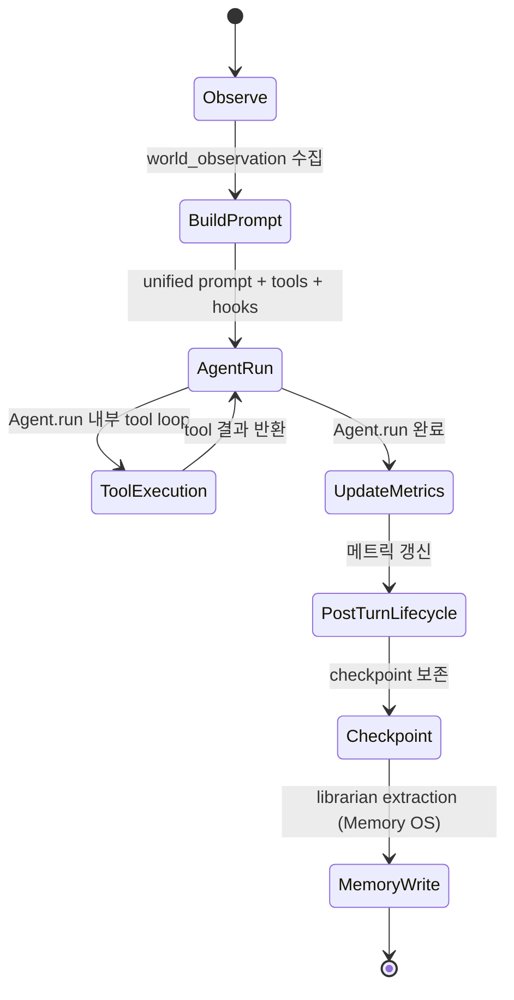
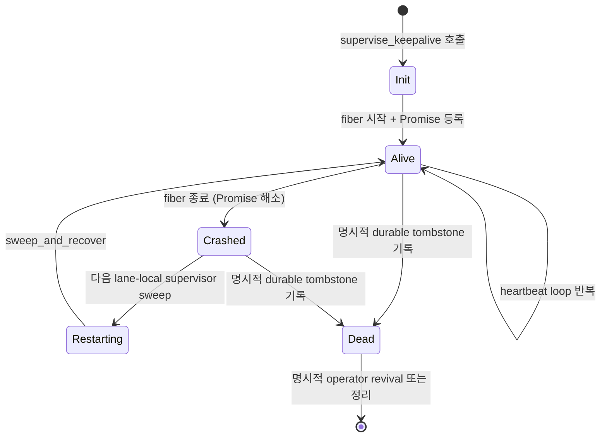

# Keeper Agent System

| 항목 | 값 |
|------|-----|
| Status | Draft |
| Team | Keeper |
| Maps to | `lib/keeper/` |
| Dependencies | 02-types-and-invariants, 13-agent-core-integration |
| Modules | `lib/keeper/` source tree is the inventory SSOT |
| LOC | Derived from the source tree, not duplicated here |
| MCP Tools | `tool_keeper` |
| External Deps | `Agent_core` (agent core), `Llm_provider`, `Workspace`, `Runtime_inference` |

---

## 1. Purpose

Keeper는 MASC의 자율 에이전트 하네스(harness)다. agent core `Agent.run` 위에서 동작하며, 장기 실행 루프, 컨텍스트 관리, 메모리 계층, 심의(deliberation), 승계(succession)을 담당한다. Task verification verdict는 Keeper lifecycle 밖의 application-owned system LLM agent 또는 authenticated HITL authority가 typed completion-authority 경계에서 결정한다. Keeper는 evidence를 제출할 수 있지만 verifier가 되지 않는다.

Keeper 하나는 다음을 소유한다:
- **identity**: `keeper_meta` 레코드 (이름, keeper, instructions, typed goal/task links)
- **context**: `working_context` (system prompt + messages + token count + agent core context)
- **memory**: Memory OS fact/episode store (legacy memory bank 제거 — RFC keeper-memory-consolidation Stage 4)
- **lifecycle**: heartbeat fiber + supervisor + checkpoint store

Keeper는 외부 세계를 관찰(`world_observation`)하고, 프롬프트를 구성하고, agent core `Agent.run`에 위임하고, 결과로부터 메트릭을 갱신하는 루프를 반복한다.

---

## 2. Architecture

```mermaid
graph LR
  subgraph Types
    KT[keeper_types] --> KC[keeper_config]
  end
  subgraph Context
    KCC[context_core] --> KCR[context_runtime] --> KCS[checkpoint_store]
  end
  subgraph Memory
    KMO[memory_os_current] --> KMR[memory_os_recall]
  end
  subgraph Turn
    KUT[unified_turn] --> KAR[agent_run] --> KTO[tools_oas]
    KAR --> KHO[hooks_oas]
  end
  subgraph Completion Authority
    CA[system LLM agent] --> CV[typed verdict]
    HO[authenticated HITL] --> CV
  end
  subgraph Supervision
    KRS[supervisor] --> KKA[keepalive]
  end
  KUT --> KWO[world_observation]
  KAR -.-> agent core["agent core Agent.run()"]
```

### 2.1 모듈 분류 (12 범주)

| 범주 | 대표 파일 | 파일 수 |
|------|----------|--------|
| Types | `keeper_types.ml`, `keeper_types_profile.ml`, `keeper_types_support.ml` | 3 |
| Config | `keeper_config.ml`, `keeper_toml_loader.ml` | 2 |
| Context | `keeper_context_core.ml`, `keeper_context_runtime.ml`, `keeper_checkpoint_store.ml` | 3 |
| Memory | `keeper_memory*.ml` (bank, policy, recall) | 4 |
| Prompt | `keeper_prompt.ml`, `keeper_unified_prompt.ml` | 2 |
| Turn Execution | `keeper_agent_run.ml`, `keeper_unified_turn.ml`, `keeper_tools_agent_core.ml`, `keeper_hooks_agent_core.ml` | 4 |
| Supervision | `keeper_supervisor.ml`, `keeper_keepalive.ml`, `keeper_world_observation.ml` | 3 |
| MCP Surface | `keeper_turn.ml`, `keeper_status.ml`, `keeper_keeper.ml`, `keeper_schema.ml` | 4 |
| Alerting / Metrics | `keeper_alerting*.ml`, `keeper_status_runtime*.ml`, `keeper_status_detail.ml` | 6+ |

---

## 3. Types

### 3.1 keeper_meta

Keeper의 전체 상태를 담는 레코드. `lib/keeper_types/keeper_types.ml`에 정의되며, 약 100개 필드를 가진다.

**소스**: `keeper_types.ml` (lines 9-106)

주요 필드 군:

- **Identity**: `name`, `agent_name`, `trace_id`, `trace_history`
- **Lineage**: `generation`, `trace_id`, `trace_history`, `last_handoff_ts`
- **Goal/Task links**: `current_task_id`, typed goal/task transitions
- **Model**: `runtime_id`, `last_model_used`, derived `active_model`
- **Capability boundary**: the flat Tool catalog plus the sandbox path
  boundary; external effects pass through the Gate.
- **Scope**: `mention_targets`
- **Proactive**: `proactive_enabled`
- **Metrics**: `total_turns`, `total_tokens`, `total_cost_usd`, `last_turn_ts` 등

직렬화: `meta_to_json` / `meta_of_json`로 JSON 왕복. `validate_name`이 역직렬화 시점에 이름/trace_id를 검증한다.

Generation semantics are operational, not genealogical: a successful rollover keeps the same keeper identity but commits a new `trace_id`, increments `generation`, and appends the old trace to `trace_history`.

### 3.2 working_context

**소스**: `keeper_context_core.ml` (working_context type는 이 모듈에 inline됨; 구 `keeper_working_context.ml`은 #4393에서 제거)

```ocaml
type working_context = {
  system_prompt : string;
  messages : Agent_core.Types.message list;
  token_count : int;
  max_tokens : int;
  importance_scores : (int * float) list;
  agent_core_context : Agent_core.Context.t;
}
```

Keeper의 실행 중 대화 컨텍스트. `agent_core_context`는 agent core Context 모듈과 동기화된다(`sync_agent_core_context`).

토큰 추정: `msg_tokens = (String.length text / 4) + 4` (문자 기반 근사치).

### 3.3 checkpoint / session_context

```ocaml
type checkpoint = {
  checkpoint_id : string;
  timestamp : float;
  generation : int;
  message_count : int;
  token_count : int;
  serialized : string;      (* JSON-serialized working_context *)
}

type session_context = {
  session_id : string;
  session_dir : string;
  mutable checkpoints : checkpoint list;
}
```

세션당 최대 3개 체크포인트가 유지된다(`max_checkpoints_retained = 3`). 세션 메시지는 `history.jsonl`에 영속화.

### 3.4 Workspace Boundary

Legacy workspace-targeting typed aliases were removed during single-workspace flattening.
JSON/MCP 경계에는 `mention_targets` 같은 workspace collaboration 값만 남고, 별도 scope enum은 더 이상 유지하지 않는다.
`policy_mode`, `policy_shell_mode`, `trigger_mode`, `initiative_*`는 제거되었다.

### 3.5 fiber_health

```ocaml
type fiber_health =
  | Fiber_alive     (* fiber 실행 중, promise 미해소 *)
  | Fiber_zombie    (* registry 존재하나 fiber 종료 *)
  | Fiber_dead      (* 재시작 예산 소진, 수동 복구 필요 *)
  | Fiber_unknown   (* supervised registry에 없음 *)
```

Supervisor가 keeper fiber의 건강 상태를 추적하는 데 사용.

---

## 4. State Machines

### 4.1 Unified Turn Lifecycle


```mermaid
stateDiagram-v2
  [*] --> Observe
  Observe --> BuildPrompt : world_observation 수집
  BuildPrompt --> AgentRun : unified prompt + tools + hooks
  AgentRun --> ToolExecution : Agent.run 내부 tool loop
  ToolExecution --> AgentRun : tool 결과 반환
  AgentRun --> UpdateMetrics : Agent.run 완료
  UpdateMetrics --> PostTurnLifecycle : 메트릭 갱신
  PostTurnLifecycle --> Checkpoint : checkpoint 보존
  Checkpoint --> MemoryWrite : librarian extraction (Memory OS)
  MemoryWrite --> [*]
```

단계 설명:

1. **Observe**: `keeper_world_observation.observe`로 workspace 상태, 멘션, board 이벤트, idle 시간, 경제 압력 등을 수집
2. **BuildPrompt**: `keeper_unified_prompt.build_prompt`로 keeper identity + observation을 단일 (system_prompt, user_message) 쌍으로 조립
3. **AgentRun**: `keeper_agent_run.run_turn`이 agent core `Agent.run`에 위임. tools + hooks + context_reducer를 전달하며 memory object는 전달하지 않는다
4. **ToolExecution**: Agent가 tool을 호출하면 `keeper_tools_agent_core`가 `agent_tool_dispatch_runtime.execute_keeper_tool_call`로 디스패치
5. **UpdateMetrics**: `keeper_unified_turn.update_metrics_from_result`가 turn count, token 사용량, cost 등을 keeper_meta에 반영하고 `observation.idle_seconds`를 `masc_keeper_idle_seconds{keeper_name}` OTel metric-store gauge로 노출
6. **PostTurnLifecycle / Checkpoint**: `keeper_post_turn.apply_post_turn_lifecycle`이 checkpoint를 보존하고 그 결과를 keeper meta와 대시보드 표면에 반영한다. keeper 자율성은 heartbeat/turn lane이 계속 쥔다
7. **MemoryWrite**: `keeper_agent_run` tail에서 Memory OS librarian extraction을 memory lane에 제출한다 (legacy bank append는 제거됨)

### 4.1.1 Post-turn Persistence

turn 끝에서 쓰는 것은 typed checkpoint metadata 하나다. `keeper_post_turn.ml`이
keeper meta에 쓰며, 계약은 keeper post-turn contract가 정한다.
| Memory OS current snapshot | `keeper_memory_os_current.ml` + `keeper_librarian.ml` | `.masc/keepers/<name>.memory-current.json` | revision-CAS librarian contract |
| collaboration activity signal | `workspace_task.ml` + `workspace.ml` | `.masc/activity-events/YYYY-MM/YYYY-MM-DD.jsonl` | task lifecycle + activity graph event contract |

### 4.2 Keeper Supervisor Lifecycle


```mermaid
stateDiagram-v2
  [*] --> Init : supervise_keepalive 호출
  Init --> Alive : fiber 시작 + Promise 등록
  Alive --> Alive : heartbeat loop 반복
  Alive --> Crashed : fiber 종료 (Promise 해소)
  Crashed --> Restarting : 다음 lane-local supervisor sweep
  Restarting --> Alive : sweep_and_recover
  Alive --> Dead : 명시적 durable tombstone 기록
  Crashed --> Dead : 명시적 durable tombstone 기록
  Dead --> [*] : 명시적 operator revival 또는 정리
```

- `supervise_keepalive`: keeper heartbeat loop을 supervised fiber로 실행
- `sweep_and_recover`: crash가 관측된 정확한 Keeper lane만 재시작
- 재시작에는 fleet-wide 정지나 exponential backoff admission을 두지 않는다.
- 최근 5건의 crash log 유지

### 4.3 Deliberation Pipeline

Triage -> BudgetCheck -> (ModelDeliberation | DeterministicBaseline) -> Execute -> RecordDecision

9가지 triage 트리거: `DirectMention`, `NewUnclaimedTask`, `FailedTask`, `AgentJoinedOrLeft`, `GoalDeadline`, `BoardActivity(string)`, `IdleTimeout`, `MetricsAnomaly(string)`, `StrategicReview`. 트리거가 없으면 Skip.

---

## 5. Protocol / Data Flow

### 5.1 keeper_msg (메시지 턴)

1. `handle_keeper_msg` -> `run_turn` 호출
2. `load_context_from_checkpoint`로 세션/컨텍스트 복원
3. `build_keeper_system_prompt` + `build_turn_prompt` callback으로 프롬프트 구성
4. `make_tools` (keeper tool bridge) + `make_hooks` (passive timing/usage/tool-result observation) 생성
5. `Keeper_turn_driver.run_named` -> agent core `Agent.run` loop. agent core Guardrails는 permissive이며 실제 외부 효과 adapter가 실행 직전에 Keeper Gate를 호출
6. `persist_message` (assistant 응답 영속화)
7. 결과 반환: `run_result { response_text, model_used, turn_count, tool_calls_made, usage, tools_used }`

### 5.2 Unified Keeper Turn (heartbeat 경로)

1. `keeper_keepalive` heartbeat tick
2. `world_observation.observe` -> 세계 상태 수집
3. `unified_turn.run_keeper_cycle` -> `build_prompt` + `run_turn`
4. `update_metrics_from_result` -> keeper_meta 갱신
5. `write_meta` -> 메타데이터 영속화

### 5.3 agent core 통합 구성

`run_turn`은 agent core에 `runtime_id`, model-visible `tools`, passive observation
`hooks`, configured `context_reducer`, `initial_messages`를 전달한다. agent core
Guardrails는 permissive이고 hooks는 timing, usage, trajectory, tool outcome을
기록할 뿐 실행 권한을 만들지 않는다. 외부 효과는 MASC adapter가 실제
effect sink 직전에 opaque operation + normalized input으로 Keeper Gate를
호출한다. MASC-owned memory object는 agent core에 투영하지 않는다.

---

## 6. Memory Subsystem

### 6.1 계층 구조

```
keeper_memory.ml (facade)
  |-- keeper_memory_recall.ml (history/tail JSONL reading)
```

### 6.2 Memory Bank (제거됨)

legacy per-keeper memory bank(`.memory.jsonl`, kind/horizon 어휘)는 제거됐다
(RFC keeper-memory-consolidation Stage 4). durable 기억은 Memory OS fact
store가 단일 경로다. profile별 kind cap을 정의하던 memory policy 계층도 bank와
함께 제거됐다.

### 6.3 Memory Recall (키워드 휴리스틱 제거됨)

키워드 분류기 기반 recall eval(`is_memory_recall_query`,
`expected_topic_hint`, `evaluate_memory_recall`)은 제거됐다. 무엇을 회상할지는
keeper가 `keeper_memory_search` 도구 호출로 스스로 판단한다 — substring 매칭이
판단을 대신하지 않는다. `keeper_memory_recall.ml`에는 그 도구 경로가 공유하는
typed history/tail 읽기 기반만 남아 있다.

### 6.4 MASC-Owned Memory

`run_turn`은 agent core memory object를 만들거나 memory hook을 설치하지 않는다. 기억 기록은 명시적 `keeper_memory_write` 도구와 librarian 추출 경로에서만 수행하고, ordinary-current 사실 철회는 정확한 `memory_id`와 이유를 받는 `keeper_memory_retract` 도구가 담당한다.

---

## 7. Evaluation and Verification

### 7.1 Task verification and product judgments

Task completion evidence is assembled by
`lib/workspace/workspace_task_verification.ml` and persisted through the
typed verification-request protocol. Evidence strings are observations; local
substring classifiers do not decide completion.

Task verification is not Keeper work. After a producer Keeper submits the
typed evidence snapshot, the application-owned system LLM agent receives the
persisted request and evidence and may emit the typed verdict. An authenticated
HITL operator is the separate authority path. Neither authority enters Keeper
registration, claims a Keeper lane, or becomes a Keeper; a rejection wakes only
the producer Keeper.

Model judgment belongs to the product operation that consumes it. Fusion,
Keeper failure judgment, board attention, and Task completion review each own
their prompt, structured schema, and result type. There is no generic
Pass/Warn/Fail action-verifier gate shared across these domains. Cost, token,
turn, and latency values remain observations.

### 7.2 Eval Harness (`lib/eval_harness.ml`)

시나리오 기반 행동 평가. `scenario`(goal + graders + tool expectations) -> `Deterministic`(Exact/Contains/Regex) 또는 `ModelBased`(MODEL 채점) grader -> weight 합산 점수.

### 7.3 Trajectory (`lib/trajectory/trajectory.ml`)

Tool call을 `.masc/trajectories/{name}/{trace_id}.jsonl`에 JSONL 기록. 용도: replay, cost 추적, eval 입력.

---

## 8. Hooks (agent core Integration)

**소스**: `lib/keeper/keeper_hooks_agent_core.ml`

agent core Agent.run의 hook lifecycle에 keeper 동작을 주입:

### 8.1 pre_tool_use

| 검사 | 동작 |
|------|------|
| Tool timing | 호출 시작 시각을 기록하고 항상 `Continue`한다. |
| Tool observation | 호출, 결과, latency, cost를 trajectory/ledger/dashboard에 기록한다. |
| External effect | hook에서 명령 의미를 분류하지 않는다. normalized Gate 경계가 판정한다. |

`pre_tool_use` hook은 tool 이름과 input 의미를 검사하거나
`Override`/`Block`/`ApprovalRequired`를 반환하지 않는다.

### 8.2 Tool surface projection

`Keeper_tool_descriptor.model_visible_descriptors`가 선언한 모델 이름과 schema는
매 turn 실제 agent core `Tool.t`로 전부 materialize된다. Keeper, runtime, provider,
credential 상태는 이 목록을 줄이지 않으며 per-turn ranking, Top-K, allow/deny
list, affinity, discovery overlay를 적용하지 않는다.

비노출은 동일 capability를 이미 가리키는 exact transport alias와 유효한 canonical
schema가 없는 descriptor에만 허용된다. transport alias는 자신을 대신해 노출되는
정확한 model name을 descriptor evidence에 기록한다.

이 경계가 하는 일은 descriptor/registered handler의 존재와 schema join을 exact
검증하는 것뿐이다. 외부 효과는 tool을 숨겨 예방하지 않고 호출 시 normalized
Gate가 Always Allowed, LLM Auto Judge, 비차단 HITL 중 하나로 결정한다. 외부
dependency가 unavailable이면 해당 handler가 명시적 typed failure를 반환한다.

#### 8.x HITL 판정 맥락에서 thinking 을 뺀다

Auto Judge 와 HITL 이 읽는 맥락 묶음(`Hitl_summary_worker.build_context_bundle`)
에서 Keeper 의 `thinking` 블록을 제거한다. `text`·`tool_use`·`tool_result` 는
그대로 남는다 — 판정자는 Keeper 가 **무엇을 했는지**를 보고, 그렇게 하기로
스스로를 설득한 과정은 보지 않는다.

두 가지 이유가 있다.

크기: 2026-08-27 라이브 큐 실측에서 `thinking` 이 메시지 블록의 51%(rondo 기준
85.6 kB 중 23.2 kB)였고, 정작 판정 대상인 호출은 2.5 kB였다. 승인마다 자기
사본을 들고 있어 같은 Keeper 의 5건이 같은 이력을 5번 보냈다.

독립성: `thinking` 은 Keeper 가 하려는 일을 스스로에게 변호하는 자리다. 같은
샘플에 `"I MUST STOP this immediately"` 같은 자기 지시가 그대로 들어 있었고, 그걸
읽은 판정자는 요청이 아니라 Keeper 의 자기 서사를 저울에 올리게 된다.

durable 항목은 턴이 실어온 것을 그대로 보존하고 프롬프트만 좁힌다. 제거 개수는
`thinking_blocks_omitted` 로 묶음에 함께 실어, 판정자가 얇은 맥락을 보고 "잘라낸
것"과 "원래 사고가 없던 턴"을 구분할 수 있게 한다.

**반대 방향의 증거도 있다.** 같은 날 판정 80건 중 거부 6건의 근거를 읽으면,
판정자가 Keeper 의 자기 진술을 인용해 거부한다 — "the agent's own memory notes
... explicitly state 'Do NOT retry task-366'". Keeper 가 스스로 세운 제약이
`thinking` 안에 있고, 그것이 거부의 근거가 된다. 전부 빼면 그 근거도 사라진다.

그래서 개수를 `keeper.hitl.thinking_blocks`
(`MASC_KEEPER_HITL_THINKING_BLOCKS`) 로 조절한다. 기본값 `0` 은 전부 제거이며,
올리면 **가장 최근** 블록부터 남는다 — 자기 제약은 방금 쓴 것이고, 용량의
대부분은 이미 지나간 사고다. 두 설정을 같은 durable 큐에 대고 비교할 수 있으므로,
어느 값이 맞는지는 측정으로 정한다.

#### 8.x Auto Judge 는 Keeper 별로 bounded parallel 이다

durable approval queue의 owner는 `(base_path, keeper_name)`이다. Auto Judge는
owner 하나당 기본 4개의 worker를 durable sequence 순서로 동시에 시작한다. 한
Keeper의 `ls`나 `gh auth status` 판정이 끝날 때까지 같은 Keeper의 서로 독립적인
다음 판정을 직렬로 기다리게 하지 않는다. 다른 Keeper는 별도 owner이므로 서로의
slot을 점유하지 않는다.

한도는 runtime parameter `keeper.hitl.max_concurrent_per_keeper`
(`MASC_KEEPER_HITL_MAX_CONCURRENT_PER_KEEPER`, 범위 1..16)로 조절한다. 이 값은
owner별 fan-out 한도이고, runtime/provider의 전역 concurrency 제한은 그대로 최종
backpressure다. 이미 provider 응답이 끝났지만 durable completion이 확정되지 않은
exact-output 행은 예외다. 이 persistence finalization barrier는 먼저 fsync-confirm한
뒤 같은 owner의 뒤 작업을 시작한다.

#### 8.x Keeper별 exact-output lane 우선순위

Keeper가 명확한 exact-output 작업은 workspace 공통 lane을 그대로 복제하지 않고,
공통 admitted slot 집합 안에서 Keeper별 첫 slot을 정할 수 있다. canonical key는
`(keeper_name, lane_id)`이며 현재 소비자는 `hitl_auto_judge`,
`board_attention_exact`, `librarian_exact`이다. 나머지 slot은 선언 순서대로 남아
failover를 유지한다.

설정은 `POST /api/v1/dashboard/runtime/keeper-exact-lane`에
`keeper_name`, `lane_id`, `slot_id`를 보낸다. `slot_id: null`은 해당 owner의
명시적 우선순위를 지운다. 저장소는
`.masc/gate/keeper-exact-lane-preferences.json` 하나이며 Dashboard Gate 응답의
`keeper_exact_lanes`가 같은 canonical row를 투영한다. 이 설정은 lane에 없는
slot을 새로 admit하지 못하며 runtime exact-output registry가 유일한 admission
authority다.

`verifier_exact`은 작업이 Keeper 소유라는 보장이 없으므로 이 축을 적용하지 않는다.
Fusion은 exact-output registry가 아니라 preset이 model topology를 직접 소유하므로
별도 계약이다.

---

## 9. Configuration

### 9.1 keeper_config.ml 핵심 파라미터

모든 환경변수는 `MASC_KEEPER_` 접두사를 사용한다. 전체 목록은 `lib/keeper/keeper_config.ml` 참조.


**Proactive**: `PROACTIVE_TEMP_LOW/MID/HIGH`(0.55/0.75/0.9), `PROACTIVE_SIMILARITY`(0.72), `PROACTIVE_MAX_TOKENS`(1024)

**Cost Gates**: `TOOL_COST_MAX_USD`(disabled by default; set a positive USD value to enable the live unified-turn accumulated cost ceiling, `0` keeps it disabled), `COST_GATE_USD`(0.10, legacy compatibility knob; not used by the unified turn cost guard)

**Unified Turn**: runtime/provider capabilities determine temperature and output
token intent. agent core `max_turns = 0` and Keeper `max_idle_turns = 0` are the
unbounded sentinels; MASC observes turn/token/cost usage but does not impose a
Keeper work budget.

**Execution**: `MAX_TOOL_ROUNDS`(3), `AUTONOMOUS_MAX_TOKENS`(4000), `DELIBERATION_MAX_TOKENS`(1024), `DELIBERATION_DAILY_BUDGET_USD`

**Other**: `DEBUG`(0), `SKILL_SELECTION`(agent), `BOOTSTRAP_PROACTIVE_WARMUP_SEC`(60)

**Evidence 상한** (task tooling, `lib/keeper/keeper_tool_task_runtime.ml`): `evidence_total_bytes_limit` = 51,200바이트 — `keeper_task_done`이 `artifact:` evidence 전체 합계로 거절하는 상한. 초과 시 전환 전에 즉시 거절되며 총 바이트 수와 `note:` 대안이 안내된다. 코드 상수이며 환경변수·TOML 로 바꾸지 않는다.

**Context capacity**: handoff decisions are typed capacity signals. They do not classify model text or infer goals; semantic decisions remain at the model boundary.

### 9.2 TOML Configuration

`config/keepers/*.toml`로 keeper를 선언적으로 정의. 파일명이 keeper 이름. 지원 타입: string, int, float, bool, string array. 테이블은 dotted key로 평탄화. 예시: `config/keepers/code-reviewer.toml`.

### 9.3 Keeper Runtime Spec

Canonical file model:

```text
<basepath>/.masc/config/keepers/{name}.toml
<basepath>/.masc/config/keepers/{name}.toml
<basepath>/.masc/keepers/{name}.json
<basepath>/.masc/keepers/{name}/...
```

- `keeper.instructions`: complete Keeper prompt
- `keepers/{name}.toml`: deployment declaration for this basepath
- `.masc/keepers/{name}.json`: durable runtime state
- `.masc/keepers/{name}/...`: metrics, decisions, trajectories, checkpoints, and other high-cardinality runtime artifacts

keeper는 durable always-on으로 취급되며, `keeper_up`은 inline args, TOML, Keeper prompt를 합쳐 초기 `keeper_meta`를 생성한다. runtime 중지 여부는 `paused` 또는 `keeper_down`으로 표현한다.

---

## 10. Proactive Behavior

Keeper는 idle 상태에서 주기적으로 자발적 행동을 생성한다.

---

## 14. Invariants

### INV-KEEPER-001: keeper_meta.name 유효성

`validate_name`이 공유 portable-name 계약(`[A-Za-z0-9._-]+`, 경로 예약값 `.`/`..` 제외)으로 이름을 검증한다. 빈 문자열, 예약값 또는 특수문자 포함 시 `meta_of_json`이 `Error`를 반환한다.

### INV-KEEPER-002: trace_id 유일성

`generate_trace_id`는 `trace-{ms_timestamp}-{5hex_hash}` 형식으로 생성된다. 동일 밀리초 내에서도 `gettimeofday` hash가 달라 충돌 가능성이 낮다.

### INV-KEEPER-003: checkpoint 최대 3개

`max_checkpoints_retained = 3`. `save` 후 `prune`이 호출되어 초과분을 삭제한다.

### INV-KEEPER-006: proactive judgment boundary

proactive 행동의 의미와 품질은 configured LLM이 판단한다. 문장 종결어미, 단어 목록, 유사도, 재시도 횟수 같은 로컬 휴리스틱은 최종 판정이나 의미 있는 fallback을 만들 수 없다. 빈 출력과 모델 실패는 관측 가능한 오류로 남으며 Keeper의 다른 활동을 중단시키지 않는다.

### INV-KEEPER-007: cost observation

cost, token, turn은 집계와 관측 대상이다. MASC의 임의 임계값이 Keeper 행동을 차단하거나 pause/stop으로 전이시키지 않는다.

Provider가 보고한 token/cache/cost 값은 원값 그대로 ledger, runtime aggregate,
최근 inference entry에 남긴다. `0`과 큰 값은 정상적인 관측이며 로컬 상한으로
누락시키지 않는다. 음수 counter는 원값과 `negative_*` anomaly를 함께 노출한다.
`usage_trust`는 provenance일 뿐 수치를 `0`/`null`로 바꾸거나 cost/token 집계를
건너뛰는 권한이 없다. Provider가 usage 자체를 보내지 않은 경우만 명시적
`usage_missing`/`null`로 표현한다.

### INV-KEEPER-008: non-hierarchical effect Gate

외부 효과는 exact Always Allowed, configured LLM Auto Judge, non-blocking HITL 중 하나로 판정하며, 한 요청의 대기는 다른 Keeper나 작업을 차단하지 않는다.

Gate 입력은 제품·도구·명령·위험 등급을 해석하지 않는 opaque operation과 완전히 정규화된 입력이다. 판정은 exact rule/profile, configured LLM, durable HITL 응답, exact one-shot grant만으로 이루어지고, HITL 완료는 해당 Keeper lane만 깨운다. Executor가 Gate 판정을 뒤집거나 추가로 거부할 수 있는 근거는 typed input, capability identity, path jail, sandbox confinement처럼 실행 시점에 직접 증명되는 불변식뿐이다.

한 번 admit한 User 입력 뒤 `ToolCompleted`가 관측된 같은 턴을 다시 실행하려면, 최신 ToolResult checkpoint를 보존하면서 User 입력을 다시 append하지 않는 typed continuation이 있어야 한다. continuation이 없는 runtime 후보 교체는 현재 턴의 명시적 실패로 끝내고 Keeper lane과 다음 cycle은 계속 사용할 수 있게 한다. 이 조건은 tool 이름, read/write 분류, 명령 의미로 추론하지 않는다.

Filesystem capability는 같은 부모에 동등한 쓰기 권한을 이미 가진 독립 same-UID hostile writer와의 MAC 격리를 제공한다고 주장하지 않는다. 그런 격리가 필요하면 Gate 분류를 추가하지 않고 UID, mount namespace, 또는 exclusive writer 경계에서 제공한다.

### INV-KEEPER-009: fiber_health 정합성

`supervised_state.fiber_health`는 Promise 해소 여부와 동기화된다. Promise resolved + registry에 존재하면 Crashed로 관측하며 해당 lane의 재시작을 계속 시도한다. Dead는 실패 횟수가 아니라 명시적 durable tombstone으로만 성립한다.

### INV-KEEPER-010: UTF-8 안전성

`utf8_safe_prefix_bytes`가 max_bytes에서 UTF-8 코드포인트 경계를 지키며 절단한다. `utf8_repair_string`이 잘못된 바이트를 U+FFFD로 치환한다. Checkpoint 직렬화 시 `sanitize_text_utf8`이 적용된다.

### INV-KEEPER-012: structural execution invariants

실행 경계는 typed argv/input, path jail, sandbox confinement와 같이 객관적으로 검증 가능한 불변식만 강제한다. 명령 문자열이나 도구 이름을 destructive pattern으로 분류하지 않으며, 주관적 실행 판정은 Gate의 LLM 또는 HITL 경계가 담당한다.

---

## 15. Known Issues / Technical Debt

### 15.1 keeper_meta 필드 수 (~100)

`keeper_meta` 레코드가 약 100개 필드를 가지며 `meta_to_json`/`meta_of_json`이 각각 ~200줄이다. 필드 군(group)별 sub-record 분할이 필요하다.

### 15.2 keeper_types.ml include chain

`keeper_types.ml`이 `include Keeper_types_profile`과 `include Keeper_types_support`를 연쇄적으로 포함하여, 실제 타입 정의가 3개 파일에 분산된다. 공개 `keeper_types.mli`는 JSONL/history-source/metrics/API-key/alert-path/rotation/delete-action/trace-path/memory/decision-log support helper를 `Keeper_types_support` 소유로 돌렸지만, 구현 include chain 자체는 남아 있어 가독성이 낮다.

### 15.3 keeper_memory 계층의 include chain

`keeper_memory.ml` -> `keeper_memory_recall.ml` 단층 facade만 남았다 (bank/policy 계층은 제거됨).

### 15.4 Proactive similarity의 Jaccard 한계

현재 `proactive_similarity_score`는 단어 수준 Jaccard 유사도를 사용한다. 의미적 유사성(semantic similarity)은 감지하지 못하므로, 동일 의미를 다른 단어로 표현하면 통과한다.

### 15.5 Token estimation 정밀도

`msg_tokens = (String.length text / 4) + 4`는 영어 기준 근사치이며, 한국어/CJK 문자에서는 과소 추정한다. BPE 기반 정밀 추정으로의 전환이 필요하다.

### 15.6 Memory Boundary

External memory projection은 제거됐다. 남은 경계 이슈는 keeper context/checkpoint nativeization과 raw marker leakage이며, memory storage 자체는 Memory OS fact store가 소유한다.

---

## 16. References

| 문서 | 경로 |
|------|------|
| Keeper Types | `lib/keeper_types/keeper_types.ml` |
| Context Core | `lib/keeper/keeper_context_core.ml` (구 `keeper_working_context.ml` 흡수) |
| Execution Context | `lib/keeper/keeper_context_runtime.ml` |
| Agent Run | `lib/keeper/keeper_agent_run.ml` |
| Unified Turn | `lib/keeper/keeper_unified_turn.ml` |
| Task verification evidence | `lib/workspace/workspace_task_verification.ml` |
| Agent Core hook observations | `lib/keeper/keeper_hooks_agent_core.ml` |
| Eval Harness | `lib/eval_harness.ml` |
| Trajectory | `lib/trajectory/trajectory.ml` |
| Supervisor | `lib/keeper/keeper_supervisor.ml` |
| Config | `lib/keeper/keeper_config.ml` |
| TOML Example | `config/keepers/code-reviewer.toml` |
| Memory: keeper 재설계 | `memory/project_dashboard-keeper-detail-redesign.md` |
