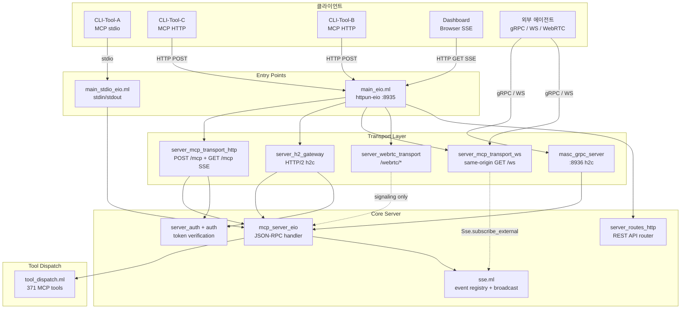
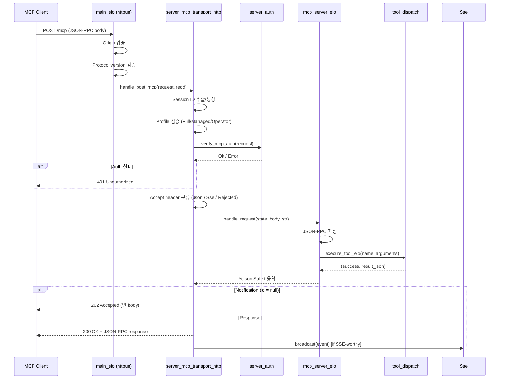
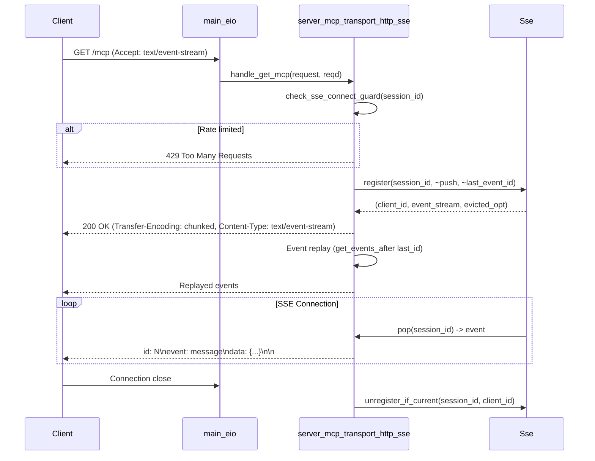

# Server & Transport

| 항목 | 값 |
|------|-----|
| Status | Draft |
| Team | Server |
| Maps to | `lib/server/`, `lib/sse.ml`, `lib/transport.ml`, `lib/http_server_eio.ml`, `lib/http_server_h2.ml`, `lib/mcp_server_eio*.ml`, `bin/main_eio.ml`, `bin/main_stdio_eio.ml` |
| Dependencies | 02-types-and-invariants |
| Modules | 61 |
| LOC | ~17,700 |

---

## 1. Purpose

MCP(Model Context Protocol)를 다중 트랜스포트(HTTP/1.1, HTTP/2 h2c, WebSocket, gRPC, WebRTC, stdio)로 제공하는 서버 레이어. JSON-RPC 2.0 기반 MCP 요청을 받아 도구 디스패치로 라우팅하고, SSE(Server-Sent Events)로 이벤트를 스트리밍한다.

핵심 설계 결정:

- **httpun-eio** 기반 HTTP/1.1이 canonical transport. Eio direct-style async.
- SSE는 per-session `Eio.Stream.t` mailbox 패턴. broadcast 시 global write-lock 없음.
- HTTP/2는 `h2-eio` 기반이며 `MASC_USE_H2=auto|1|0`로 listener mode를 제어한다. 기본값 `auto`는 HTTP/1.1과 h2c를 같은 포트에서 자동 감지한다.
- gRPC, WebSocket, WebRTC는 보조 transport다. gRPC listener는 기본 비활성이며
  `MASC_GRPC_ENABLED=1`로만 opt-in한다. WebSocket과 WebRTC의 활성화 조건은
  아래 Transport Matrix의 각 feature-flag SSOT를 따른다.
- stdio 모드는 CLI-Tool-A MCP 클라이언트의 표준 연결 방식.

---

## 2. Architecture



---

## 3. Transport Matrix

| Transport | Protocol Stack | Module | Port | 활성화 조건 | Status |
|-----------|---------------|--------|------|------------|--------|
| HTTP/1.1 | httpun-eio | `server_mcp_transport_http` | 8935 | 기본값 | Canonical |
| HTTP/2 (h2c) | h2-eio | `server_h2_gateway` | 8935 | `MASC_USE_H2=auto` (기본) 또는 `1` | Available |
| WebSocket | ws-direct + httpun-eio upgrade | `server_mcp_transport_ws` | HTTP listener와 동일한 origin/port의 `/ws` | HTTP/1.1/auto 모드에서 기본 활성, `MASC_WS_ENABLED=0`으로 비활성화; H2-only는 명시적 미지원 | **Experimental** |
| gRPC | grpc-direct (h2c) | `masc_grpc_server` | 8936 | `MASC_GRPC_ENABLED=1` 명시적 opt-in | **Experimental / advisory** |
| WebRTC | ocaml-webrtc | `server_webrtc_transport` | 8935 `/webrtc/*` | 기본값, `MASC_WEBRTC_ENABLED=0`으로 비활성화 | **Experimental** (local interop only; live env-gated) |
| stdio | Eio stdin/stdout | `main_stdio_eio` + `mcp_server_eio.run_stdio` | N/A | `masc-stdio` 실행 | Available |

**Experimental** 상태의 의미: 해당 transport는 코드가 존재하지만 프로덕션
interop 검증이 미완료이며 API/프로토콜에 breaking change가 발생할 수 있다.
활성화 기본값은 각 feature flag의 SSOT를 따른다.

### 3.1 에이전트 측 gRPC 선택 경계

`lib/config/masc_grpc_transport.ml`은 다음 설정값을 파싱한다:

```ocaml
type t = Http | Grpc | Ws | Webrtc | Local
```

현재 `MASC_AGENT_TRANSPORT=grpc`의 실제 효과는 서버 부트스트랩에서
optional Keeper heartbeat client를 초기화하는 것이다. 일반 Workspace/MCP/OAS
호출을 gRPC로 라우팅하거나 다른 transport를 대체하지 않는다. 값이 없거나
알 수 없는 값이면 `Local`로 해석하며, gRPC 이외 값은 heartbeat sidecar를
시작하지 않는다. 서버 listener 자체는 별도의 `MASC_GRPC_ENABLED`가 제어한다.

---

## 4. MCP Protocol

### 4.1 JSON-RPC 2.0 Wire Format

MCP는 JSON-RPC 2.0 위에 구축된다. 모든 요청은 동일한 구조를 따른다:

```json
{
  "jsonrpc": "2.0",
  "id": 1,
  "method": "tools/call",
  "params": {
    "name": "masc_status",
    "arguments": {}
  }
}
```

응답:

```json
{
  "jsonrpc": "2.0",
  "id": 1,
  "result": {
    "content": [{"type": "text", "text": "..."}]
  }
}
```

에러 응답:

```json
{
  "jsonrpc": "2.0",
  "id": null,
  "error": {
    "code": -32601,
    "message": "Method not found"
  }
}
```

### 4.2 표준 JSON-RPC 에러 코드

| Code | 이름 | 설명 |
|------|------|------|
| -32700 | Parse Error | JSON 파싱 실패 |
| -32600 | Invalid Request | 유효하지 않은 JSON-RPC 요청 |
| -32601 | Method Not Found | 존재하지 않는 메서드 |
| -32602 | Invalid Params | 유효하지 않은 파라미터 |
| -32603 | Internal Error | 서버 내부 오류 |
| -32000 | Server Error | 범용 서버 오류 |
| -32001 | Not Initialized | 서버 미초기화 |
| -32002 | Task Not Found | Task ID 없음 |
| -32003 | Permission Denied | 권한 부족 |

### 4.3 MCP Protocol Version

지원 버전은 `Mcp_server.supported_protocol_versions`에 정의된다. 세션 생성 시 `initialize` 요청의 `params.protocolVersion` 필드로 버전을 협상한다.

- `mcp_protocol_versions`: 지원 버전 목록
- `mcp_protocol_version_default`: 기본 버전
- 세션별 버전은 `protocol_version_by_session` Hashtbl에 기록된다.
- 동일 세션에서 버전 변경 시도는 `validate_protocol_version_continuity`가 거부한다.

### 4.4 MCP Session Management

HTTP MCP 세션은 `Mcp-Session-Id` 헤더로 식별된다. 세션 ID는 `Mcp_session.generate()`로 UUID-like 문자열을 생성한다.

```
mcp_session_record = {
  id: string;
  agent_name: string option;
  created_at: float;
  last_seen: float;
}
```

세션 생명주기:

1. **생성**: `initialize` 요청 시 새 session ID 발급. 서버가 `Mcp-Session-Id` 응답 헤더로 반환.
2. **유지**: 이후 모든 요청에 `Mcp-Session-Id` 헤더 포함 필수 (initialize/ping 제외).
3. **삭제**: `DELETE /mcp` 요청 시 세션 종료. SSE 연결 해제 + 리소스 구독 정리.

### 4.5 Tool Profile (Endpoint 분리)

MCP 엔드포인트별로 노출되는 도구 집합이 다르다:

```ocaml
type tool_profile =
  | Full              (* /mcp - 전체 도구 *)
  | Managed_agent     (* /mcp/managed - 제한된 도구 세트 *)
  | Operator_remote   (* /mcp/operator - operator 전용 도구 *)
```

동일 session ID로 다른 profile의 엔드포인트에 접근하면 `409 Conflict`를 반환한다 (`validate_mcp_session_profile`).

---

## 5. SSE Event Streaming

**소스**: `lib/sse.ml` (474 LOC)

### 5.1 동시성 모델

SSE는 per-session `Eio.Stream.t` mailbox 패턴으로 구현된다:

1. SSE 연결 시 `Sse.register`가 session당 `Eio.Stream.t`(capacity=1024)를 생성한다.
2. `broadcast`는 registry의 읽기 스냅샷을 잡고, 각 client의 stream에 이벤트를 push한다.
3. 각 SSE connection fiber는 `Sse.pop`으로 자기 stream을 drain하며, transport writer에 write한다.
4. broadcast 중 global write-lock을 잡지 않으므로, 느린 client가 다른 client의 broadcast를 지연시키지 않는다.

```
broadcast() --> [registry snapshot under read-lock]
            --> for each client: Eio.Stream.add client.event_stream event
            --> notify_external_subscribers(event)  // gRPC, WS 등

SSE fiber --> loop: Sse.pop session_id --> send_raw to HTTP body writer
```

### 5.2 Session Kind

SSE 세션은 두 종류로 분류된다:

| Kind | 대상 | 수신 이벤트 |
|------|------|-----------|
| `Observer` | Dashboard, 읽기 전용 뷰어 | dashboard snapshot |
| `Agent stream` | MCP 에이전트 연결 | heartbeat, task event |

`broadcast_to` 함수로 대상을 지정할 수 있다:

```ocaml
type broadcast_target = All | Observers | Agent streams
```

`broadcast json`은 `broadcast_to All json`과 동일하다 (하위 호환).

### 5.3 Event Format

SSE 이벤트는 MCP Spec 2025-03-26을 따른다:

```
id: 42
event: message
data: {"jsonrpc":"2.0","method":"notifications/message","params":{...}}

```

- `id`: 단조 증가하는 정수 (`Atomic.fetch_and_add event_counter 1 + 1`)
- `event`: 항상 `"message"`
- `data`: JSON-RPC notification 또는 응답

### 5.4 Resumability

MCP Spec에서 MUST인 event replay를 지원한다:

- 최근 100개 이벤트를 ring buffer에 저장 (`event_buffer`, 300초 TTL)
- 클라이언트가 `Last-Event-Id` 헤더로 마지막 수신 ID를 전달하면, `get_events_after`로 누락분을 replay

### 5.5 Connection Guard

SSE 재연결 폭주(connection storm)를 방지하는 rate limiter:

| 환경변수 | 기본값 | 설명 |
|---------|--------|------|
| `MASC_SSE_RECONNECT_MIN_INTERVAL_S` | 0.0 (비활성) | session별 최소 재연결 간격 |
| `MASC_SSE_CONNECT_WINDOW_S` | 0.0 (비활성) | sliding window 크기 |
| `MASC_SSE_CONNECT_MAX_IN_WINDOW` | 0 (비활성) | window 내 최대 연결 수 |

제한 초과 시 `429 Too Many Requests` + `Retry-After` 헤더를 반환한다.

### 5.6 External Subscriber Hook

SSE가 아닌 소비자(gRPC Subscribe stream, WebSocket 등)가 broadcast 이벤트를 수신할 수 있다:

```ocaml
Sse.subscribe_external ~id:"ws-123"
  ~is_alive:(fun () -> not session.closed)
  ~callback:(fun sse_event -> send_text session sse_event)
  ()
```

- `is_alive`가 `false`를 반환하면 자동 제거 (리소스 누수 방지)
- broadcast 완료 후 동기적으로 호출됨

### 5.7 Capacity & Limits

| 상수 | 값 | 근거 |
|------|-----|------|
| `max_clients` | 200 | Agent-LLM-A.ai MCP 클라이언트 재연결 대응. 초과 시 oldest eviction |
| `stream_capacity` | 1024 | 0이면 동기 rendez-vous가 됨. 1024 미만이면 broadcast 블로킹 위험 |
| `push_timeout_s` | 5.0 | 로컬 TCP write에 5초. 초과 시 client drop |
| `max_buffer_size` | 100 | event replay buffer 크기 |
| `buffer_ttl_seconds` | 300.0 | 5분 이상 된 이벤트 자동 삭제 |
| `cleanup_stale max_age_s` | 1800.0 | 30분 이상 idle client 자동 evict |

---

## 6. HTTP Route Map

### 6.1 MCP 엔드포인트 (main_eio.ml에서 직접 매칭)

| Method | Path | Handler | 설명 |
|--------|------|---------|------|
| POST | `/mcp` | `handle_post_mcp ~profile:Full` | MCP JSON-RPC (전체 도구) |
| GET | `/mcp` | `handle_get_mcp` | SSE 스트림 (Agent stream) |
| DELETE | `/mcp` | `handle_delete_mcp` | MCP 세션 종료 |
| POST | `/mcp/managed` | `handle_post_mcp ~profile:Managed_agent` | 관리 에이전트 MCP |
| GET | `/mcp/managed` | `handle_get_mcp` | 관리 에이전트 SSE |
| DELETE | `/mcp/managed` | `handle_delete_mcp ~profile:Managed_agent` | 관리 에이전트 세션 종료 |
| POST | `/mcp/operator` | `handle_post_mcp ~profile:Operator_remote` | Operator MCP |
| GET | `/mcp/operator` | `handle_get_operator_mcp` | Operator SSE |
| DELETE | `/mcp/operator` | `handle_delete_mcp ~profile:Operator_remote` | Operator 세션 종료 |
| GET | `/sse` | `sse_simple_handler` | 단순 SSE (Observer) |
| GET | `/ws` | `websocket_handler` | 일반 GET은 same-origin discovery JSON, HTTP/1.1 Upgrade 요청은 WebSocket 101 |
| POST | `/webrtc/offer` | `handle_offer_request` | WebRTC offer signaling |
| POST | `/webrtc/answer` | `handle_answer_request` | WebRTC answer signaling |
| OPTIONS | `*` | `options_handler` | CORS preflight |

### 6.2 REST API 라우트 (server_routes_http 조립)

`make_routes`가 HTTP Router를 조립한다:

```ocaml
let make_routes ~port ~host ~sw ~clock =
  Http.Router.empty
  |> Server_routes_http_routes_frontend.add_routes ~port ~host
  |> Server_routes_http_routes_workspace.add_routes
  |> Server_routes_http_routes_dashboard.add_routes ~sw ~clock
  |> Server_routes_http_routes_provider_runs.add_routes ~sw
  |> Server_routes_http_routes_runtime.add_routes
  |> Server_routes_http_routes_activity.add_routes ~sw ~clock
  |> Server_routes_http_routes_channel_gate.add_routes ~sw ~clock
```

주요 REST 라우트 그룹:

| 그룹 | Prefix | 모듈 | 예시 경로 |
|------|--------|------|----------|
| Frontend | `/`, `/health` | `_frontend` | `GET /health`, `GET /.well-known/agent.json` |
| Dashboard | `/api/v1/dashboard/*` | `_dashboard` | `GET /api/v1/dashboard/shell` |
| Workspace | `/api/v1/status`, `/api/v1/tasks`, `/api/v1/agents`, `/api/v1/messages` | `_workspace` | `GET /api/v1/status` |
| Provider Runs | `/api/v1/chains/*` | `_provider_runs` | `GET /api/v1/chains/summary` |
| Runtime | `/api/v1/runtime/*` | `_runtime` | `GET /api/v1/runtime/health` |
| Activity | `/api/v1/activity/*` | `_activity` | `GET /api/v1/activity/events` |
| Channel Gate | `/api/v1/gate/*` | `_channel_gate` | `GET /api/v1/gate/health` |
| Board | `/api/v1/board/*` | main_eio 직접 | `GET /api/v1/board/{id}` |
| GraphQL | `/graphql` | main_eio 직접 | `POST /graphql` |
| OpenAPI | `/api/v1/openapi.json` | `Transport.Rest` | OpenAPI 3.1 문서 자동 생성 |

### 6.3 Dashboard Static Files

| Path | 제공 방식 |
|------|----------|
| `/dashboard`, `/dashboard/` | `assets/dashboard/index.html` (SPA entry) |
| `/dashboard/assets/*` | Vite 빌드 산출물 정적 파일 |
| `/dashboard/credits` | OCaml 렌더링 HTML (`Credits_dashboard.html`) |

---

## 7. Authentication

**소스**: `lib/auth/auth.ml` (435 LOC), `lib/server/server_auth.ml` (491 LOC)

### 7.1 인증 모델

파일 기반 토큰 인증. `.masc/auth/` 디렉토리에 상태를 저장한다.

```
.masc/auth/
  config.json          -- auth_config (enabled, require_token, token_expiry_hours)
  workspace_secret.hash     -- workspace-level secret (SHA256 해시)
  initial_admin        -- 최초 admin agent 이름
  agents/
    agent-llm-a.json        -- credential JSON (agent_name, token_hash, admin, expires_at)
    provider-f.json
```

### 7.2 인증 흐름

1. **토큰 생성**: agent 이름과 admin 여부를 바탕으로 raw token과 credential을 만든다. raw token은 한 번만 반환, 서버는 SHA256 해시만 저장한다.
2. **요청 인증**: `Authorization: Bearer <raw_token>` 헤더로 전달. 서버가 해시 비교.
3. **만료 검사**: `expires_at` ISO 문자열 비교 (`now > exp_str`).

### 7.3 인증 계층

| 계층 | 조건 | 검증 함수 |
|------|------|----------|
| **비활성** | auth disabled | 모든 요청 허용 |
| **선택 토큰** | auth enabled, `require_token=false` | 토큰 있으면 검증, 없으면 anonymous worker 권한으로 처리 |
| **토큰 필수** | auth enabled, `require_token=true` | 토큰 없으면 401 |
| **Strict HTTP** | `MASC_HTTP_AUTH_STRICT=1` 또는 non-loopback bind | `/mcp` 등 경로에 토큰 필수 |

`MASC_HTTP_AUTH_STRICT`는 서버가 non-loopback 주소(예: `0.0.0.0`)에 bind되면 자동 활성화된다.

### 7.4 권한 체계 (RBAC)

| Role | 권한 범위 |
|------|----------|
| `Admin` | 모든 작업 (auth enable/disable, tool grant/revoke 포함) |
| `Worker` | 도구 호출, broadcast, task claim/complete |
| `Observer` | 읽기 전용 (status, messages 조회) |

도구 인증은 `Tool_catalog`의 per-tool `required_permission`을 SSOT로 사용한다.
등록되지 않은 도구와 permission이 선언되지 않은 도구는 서로 구분해 관측한 뒤
모두 fail closed한다. 이름 prefix나 기본 `CanBroadcast` fallback으로 권한을
추론하지 않으며, 이 경계는 환경변수로 완화할 수 없다.

### 7.5 Admin 인증

`MASC_ADMIN_TOKEN` 환경변수로 admin-only API를 보호한다. 타이밍 사이드채널 공격 방지를 위해 XOR 기반 constant-time 비교를 사용한다.

### 7.6 CORS

```
Access-Control-Allow-Origin: <origin>
Access-Control-Allow-Methods: GET, POST, DELETE, OPTIONS
Access-Control-Allow-Headers: Content-Type, Accept, Origin, Authorization,
  Idempotency-Key, Mcp-Session-Id, Mcp-Protocol-Version, Last-Event-Id,
  X-MASC-Agent, X-MASC-Agent-Name
Access-Control-Expose-Headers: Mcp-Session-Id, Mcp-Protocol-Version
Access-Control-Allow-Credentials: true
```

MCP 경로(`/mcp`, `/sse`)에서 Origin 검증을 수행한다. 유효하지 않은 origin은 `403 Forbidden`.

---

## 8. HTTP/2 Gateway

**소스**: `lib/server/server_h2_gateway.ml` (740 LOC) + helpers/routes (814 LOC)

### 8.1 활성화

`MASC_USE_H2=1` 환경변수로 opt-in. 설정 시 HTTP/1.1과 HTTP/2 서버가 동시에 시작된다 (동일 포트, ALPN 협상 아님 - h2c cleartext).

### 8.2 동작 방식

H2 gateway는 HTTP/2 요청을 받아 내부적으로 `Httpun.Request`로 변환하여 기존 handler 함수를 재사용한다:

```ocaml
let httpun_headers = httpun_headers_of_h2 h2_headers in
let httpun_request = Httpun.Request.create ~headers:httpun_headers httpun_meth h2_req.target in
```

`httpun_headers_of_h2`는 H2 `:authority`를 공통 Httpun `Host` 계약으로 투영한다.
따라서 H1/H2의 parsed Origin, CORS, auth 판단이 동일한 host/port SSOT를 사용한다.

모든 REST API, MCP, Dashboard 경로를 HTTP/2로도 제공한다. H2 고유 기능:
- 무제한 SSE stream per connection (브라우저 6-connection 제한 해소)
- `flush_headers_immediately:true`로 streaming response 지원

### 8.3 Cloudflare Tunnel 제약

```
Browser --[HTTPS/HTTP2]--> Cloudflare --[HTTP/1.1]--> MASC :8935
```

Cloudflare tunnel origin은 cleartext h2(h2c)를 지원하지 않는다. 따라서 Cloudflare 경유 시 origin은 반드시 HTTP/1.1. Cloudflare가 브라우저에 HTTP/2를 제공하여 SSE 멀티플렉싱의 이점은 유지된다.

---

## 9. WebSocket Transport

**소스**: `lib/server/server_mcp_transport_ws.ml`

### 9.1 활성화

기본값은 활성이다. `MASC_WS_ENABLED=0` 또는 `false`일 때 비활성화된다. HTTP/1.1 및 `auto` listener에서는 `GET /ws`가 discovery와 Upgrade를 함께 제공한다. H2-only listener는 RFC 8441 Extended CONNECT를 구현하지 않았으므로 discovery에 `h2_only_unsupported`를 명시하고 URL을 광고하지 않는다.

### 9.2 동작 방식

1. 일반 `GET /ws`로 `enabled`, `listening`, `listen_status`, `ws_url`, `session_count`를 discovery한다. 별도 WS port/URL 필드는 없다.
2. 클라이언트는 discovery가 반환한 동일 origin의 `/ws`에 HTTP/1.1 101 Upgrade를 요청한다.
3. 비브라우저 클라이언트는 `Authorization: Bearer ...`를, 브라우저는 `masc.bearer.hex.<UTF-8 token hex>` 전용 subprotocol을 사용한다. 서버는 credential을 URL이나 `dashboard/hello` body에서 받지 않고, 101 응답에는 credential subprotocol을 echo하지 않는다.
4. admission에서 확인된 credential owner가 세션에 불변으로 결합되고, 이후 JSON-RPC tool call은 같은 credential로 다시 권한 검사를 거친다.
5. 연결 성공 후 `Sse.subscribe_external`로 broadcast 이벤트 수신을 등록하고, ws-direct가 message reassembly/UTF-8/size cap/Ping-Pong을 담당한다.
6. 연결 종료 시 `cleanup_session`이 SSE 구독 해제와 세션 제거를 수행한다.

WebSocket 세션은 `ws-{timestamp_ms}-{counter}` 형식 ID를 사용한다. SHA1은 httpun-ws 핸드셰이크에 Digestif.SHA1을 사용한다.

---

## 10. gRPC Service

**계약 SSOT**: `proto/masc_workspace.proto`

**소스**: `lib/server/masc_grpc_server.ml`, `lib/server/masc_grpc_service.ml`, `lib/server/masc_grpc_client.ml`, `lib/server/masc_grpc_types.ml`, `lib/config/masc_grpc_transport.ml`

### 10.1 활성화

listener는 기본 비활성이다. `MASC_GRPC_ENABLED=1`로 명시적으로 opt-in하며,
포트는 `MASC_GRPC_PORT` (기본값: 8936)다. listener가 떠 있고 health check가
`SERVING`인 것은 연결 준비 상태일 뿐, Keeper heartbeat의 production 승격을
뜻하지 않는다. 현재 heartbeat는 canonical workspace freshness와 분리된
optional advisory signal이며 production-ready 범위 밖이다.

### 10.2 Service 정의

```
Service: masc.workspace.v1.MascWorkspace

RPCs:
  Heartbeat(stream HeartbeatPing) -> stream HeartbeatAck // Bidirectional streaming
  Subscribe(SubscribeRequest) -> stream Event            // Server streaming
  ToolCall(ToolCallRequest) -> ToolCallResponse           // Unary
  Broadcast(BroadcastRequest) -> BroadcastResponse       // Unary
  GetStatus(StatusRequest) -> StatusResponse              // Unary
```

`Join`, `Leave`, `CallTool`, gRPC `LspCall`은 현재 서비스에 없다. Dashboard IDE의
LSP transport SSOT는 same-origin WebSocket `/api/v1/ide/lsp` (`masc.ide.v1`)다.

### 10.3 Wire Format

`proto/masc_workspace.proto`에서 `ocaml-protoc-plugin`으로 생성한 타입을
Protobuf binary로 직렬화하고 gRPC framing으로 전송한다. workload RPC 요청은
`auth_token`을 포함하며, `agent_name`을 함께 받는 요청은 credential owner와
claimed agent가 일치해야 한다. `StatusRequest`는 token owner를 caller identity로
사용한다.

### 10.4 Subscribe Streaming

`Subscribe` RPC는 server-streaming으로 backlog와 SSE broadcast 이벤트를 gRPC
스트림으로 전달한다. `Sse.subscribe_external`을 통해 live 이벤트를 받아 gRPC
응답 스트림에 기록한다. 인증된 harness는
`scripts/harness/transport/verify_grpc_subscribe.sh`에서 별도 agent credential로
이 경로를 검증한다.

현재 pinned `grpc-direct`/`h2` 조합은 peer `RST_STREAM`을 handler-owned stream
cleanup으로 전달하지 못하며, handler가 올린 typed gRPC status도 모든 wire path에서
보존하지 못한다. 따라서 disconnect 시 즉시 unsubscribe되거나 terminal status가
정확히 전파된다고 간주하면 안 된다. 이 제약 때문에 listener 기본값을 비활성으로
유지하며, TTL이나 문자열 payload 같은 MASC-side heuristic으로 production-ready를
가장하지 않는다. Upstream root-fix와 수용 기준은
[`grpc-direct#76`](https://github.com/jeong-sik/grpc-direct/issues/76)에서 추적한다.

### 10.5 현재 실제 사용 범위

- in-tree production client callsite는 `MASC_AGENT_TRANSPORT=grpc`일 때 시작되는
  optional Keeper `Heartbeat` sidecar뿐이다.
- `GetStatus`, `ToolCall`, `Broadcast`, `Subscribe` client wrapper에는 현재 in-tree
  production callsite가 없다. `Subscribe`는 transport harness에서 검증한다.
- Dashboard Keeper/IDE 트래픽은 gRPC로 라우팅되지 않는다.
- health/reflection과 짧은 harness 성공은 long-lived stream lifecycle 및 wire-level
  terminal status의 production proof를 대신하지 않는다.

### 10.6 Health & Reflection

- `grpc.health.v1.Health/Check` 지원
- `grpc.reflection.v1.ServerReflection` 지원
- transport harness는 `grpc_health_v1.proto`를 사용해 health check를 검증한다

---

## 11. WebRTC Transport

**소스**: `lib/server/server_webrtc_transport.ml` (183 LOC)

### 11.1 활성화

기본값은 활성이다. `MASC_WEBRTC_ENABLED=0` 또는 `false`일 때만 비활성화된다. 로컬 signaling + server-side peer 경로는 hermetic harness로 검증하고, live ICE/TURN/browser interop은 env-gated로 분리한다.

### 11.2 Signaling Flow

```
Agent A                    MASC Server                    Agent B
   |                           |                             |
   |-- POST /webrtc/offer ---->|                             |
   |   {agent_name, ice, dtls} |                             |
   |<-- {offer_id} ------------|                             |
   |                           |                             |
   |                           |<-- POST /webrtc/answer -----|
   |                           |    {offer_id, agent_name}   |
   |                           |--- {peer_id, channel} ----->|
   |                           |                             |
   |<======= "masc-events" DataChannel (P2P) =============>|
```

ICE + DTLS 완료 후 `"masc-events"` DataChannel을 통해 JSON-RPC 메시지를 P2P로 교환한다. 서버는 signaling만 중계하고, 데이터 전송은 서버를 경유하지 않는다.

만료된 offer는 60초 후 자동 정리 (`cleanup_expired_offers`).

### 11.3 ICE Server Configuration

서버 측 ICE server는 다음 우선순위로 읽는다.

1. `MASC_WEBRTC_ICE_SERVERS_JSON`
2. `MASC_WEBRTC_ICE_URLS` + 선택적 `MASC_WEBRTC_ICE_USERNAME` / `MASC_WEBRTC_ICE_CREDENTIAL` / `MASC_WEBRTC_ICE_TLS_CA`
3. `ocaml-webrtc` 기본 ICE server (기본 STUN)

운영자는 `/health`의 `transport.webrtc.ice_server_urls`로 현재 적용된 URL 목록을 확인할 수 있다.

### 11.4 Env-Gated Live Interop Proof

hermetic CI는 signaling + peer lifecycle만 검증한다. 실제 인터넷 상호운용성은 env-gated proof lane으로 분리한다.

- local/manual entrypoint: `bash scripts/harness/transport/verify_webrtc_live_env.sh`
- GitHub Actions entrypoint: `.github/workflows/webrtc-live-interop.yml`
- browser-side env:
  - `MASC_WEBRTC_LIVE_ICE_URLS`
  - 선택적 `MASC_WEBRTC_LIVE_ICE_USERNAME`
  - 선택적 `MASC_WEBRTC_LIVE_ICE_CREDENTIAL`
- server-side env:
  - `MASC_WEBRTC_ICE_URLS`
  - 선택적 `MASC_WEBRTC_ICE_USERNAME`
  - 선택적 `MASC_WEBRTC_ICE_CREDENTIAL`

현재 proof lane은 다음을 보장한다.

- 브라우저가 실제 ICE candidate를 gather한다.
- `/health`가 서버 ICE server URL 구성을 노출한다.
- 서버가 브라우저가 생성한 candidate 문자열을 받아 offer/answer signaling을 완료한다.

현재 proof lane이 아직 보장하지 않는 것:

- 브라우저와 서버 사이의 완전한 SDP answer 교환
- end-to-end DataChannel 메시지 교환

---

## 12. Stdio Transport

**소스**: `bin/main_stdio_eio.ml` (50 LOC), `lib/mcp_server_eio.ml` (`run_stdio`), `lib/mcp_server_eio_protocol.ml` (`detect_mode`)

### 12.1 Protocol Detection

```ocaml
type transport_mode = Framed | LineDelimited
```

stdin의 첫 바이트를 읽어 Content-Length 프레이밍 여부를 판단한다:
- `Content-Length:` 로 시작: `Framed` 모드 (표준 MCP)
- 그 외: `LineDelimited` 모드 (한 줄 = 한 JSON-RPC 메시지)

### 12.2 동작

- stdin에서 JSON-RPC 요청을 읽고, `mcp_server_eio.handle_request`로 처리한 후 stdout으로 응답을 쓴다.
- 서버 상태 초기화는 HTTP 서버와 동일하게 `Server_runtime_bootstrap`를 통해 수행한다.
- Keeper bootstrap, background maintenance, board flush 등 모든 부트스트랩 절차를 거친다.

---

## 13. Request Flow

### 13.1 HTTP/1.1 POST /mcp 처리 흐름



### 13.2 SSE 연결 흐름



---

## 14. Server Bootstrap

**소스**: `lib/server/server_runtime_bootstrap.ml` (688 LOC)

부트스트랩 순서 (`run_server` -> `Server_runtime_bootstrap.run`):

1. `init_runtime_context`: Eio 환경(clock, net, proc_mgr, fs) 추출
2. `create_server_state`: 서버 상태 생성 (Workspace config, Eio context 설정)
3. `bootstrap_server_state`: Workspace 초기화, Chain bootstrap, Tool registry warm-up, JSONL pruning
4. `bootstrap_keepers`: Keeper 에이전트 부트스트랩
5. `init_task_backend`: 태스크 백엔드 초기화
6. `start_background_maintenance`: 주기적 cleanup fiber 시작
7. HTTP 서버 listen 시작

### 14.1 Graceful Shutdown

`main_eio.ml`에서 SIGTERM/SIGINT 핸들러로 구현:

1. `notifications/shutdown` SSE broadcast -> 200ms 대기
2. `Shutdown_hooks.run_all()` 실행 (orchestrator 취소, SSE 닫기 등)
3. `Board_dispatch.flush()` (dirty 데이터 저장)
4. `close_all_sse_connections()`
5. `Eio.Switch.fail sw Shutdown` -> Switch 종료
6. 5초 타임아웃 후 강제 종료 (별도 Thread)

### 14.2 Port Bind Retry

포트 사용 중(`EADDRINUSE`)이면 exponential backoff로 최대 5회 재시도한다 (`2^attempt` 초, 최대 30초).

---

## 15. Configuration

### 15.1 서버 설정

| 환경변수 | 기본값 | 설명 |
|---------|--------|------|
| `MASC_HOST` | `127.0.0.1` | 바인드 주소 |
| `--port` / `-p` | `8935` | 리스닝 포트 |
| `--base-path` | `$MASC_BASE_PATH` or `cwd` | workspace/base 경로. runtime root는 `<base-path>/.masc` |

### 15.2 트랜스포트 설정

| 환경변수 | 기본값 | 설명 |
|---------|--------|------|
| `MASC_USE_H2` | `auto` | HTTP listener mode (`auto`, `1`=`h2_only`, `0`=`h1_only`) |
| `MASC_WS_ENABLED` | 1 | WebSocket 활성화 (`0`으로 비활성화) |
| `MASC_GRPC_ENABLED` | 0 | 실험적 gRPC 활성화 (`1`로 opt-in) |
| `MASC_GRPC_PORT` | 8936 | gRPC 포트 |
| `MASC_GRPC_UNARY_TIMEOUT_SEC` | 30 | finite unary RPC deadline; streaming RPC에는 상속하지 않음 |
| `MASC_WEBRTC_ENABLED` | 1 | WebRTC 활성화 (`0`으로 비활성화) |
| `MASC_AGENT_TRANSPORT` | `local` | `grpc`일 때 optional Keeper heartbeat sidecar 초기화; 일반 호출 transport를 바꾸지 않음 |

### 15.3 인증 설정

| 환경변수 | 기본값 | 설명 |
|---------|--------|------|
| `MASC_HTTP_AUTH_STRICT` | non-loopback시 자동 | MCP 경로 토큰 인증 강제 |
| `MASC_ADMIN_TOKEN` | (미설정) | Admin API 토큰 |

### 15.4 SSE 설정

| 환경변수 | 기본값 | 설명 |
|---------|--------|------|
| `MASC_SSE_RECONNECT_MIN_INTERVAL_S` | 0.0 | 최소 재연결 간격 |
| `MASC_SSE_CONNECT_WINDOW_S` | 0.0 | Rate limit window |
| `MASC_SSE_CONNECT_MAX_IN_WINDOW` | 0 | Window 내 최대 연결 수 |

### 15.5 HTTP Compression

`Http_server_eio.Compression` 모듈이 zstd + dictionary 압축을 지원한다:

- `zstd`: 표준 zstd (256바이트 이상)
- `zstd-dict`: MASC 전용 사전 기반 압축 (32-2048바이트에서 +70%p 향상)
- `Accept-Encoding: zstd` 또는 `zstd-dict` 요청 시 적용

---

## 16. OpenAPI Document Generation

`Transport.Rest.generate_openapi_document`가 OpenAPI 3.1 문서를 런타임에 생성한다:

- `GET /api/v1/openapi.json`으로 접근
- 모든 REST-바인딩된 MCP 도구를 OpenAPI path로 변환
- `x-mcp-operations`: MCP 도구 카탈로그 (inputSchema, tags, help entry)
- `x-agent-sdk-tools`: SDK alias 바인딩
- `/mcp` POST 엔드포인트에 전체 operation catalog 첨부

---

## 17. Invariants

**INV-SERVER-001**: HTTP/1.1 서버는 항상 활성. H2와 실험적 gRPC는
명시적 opt-in이고, same-origin WS와 WebRTC는 각 feature flag 정책을 따른다.

**INV-SERVER-002**: 모든 MCP POST 요청은 `initialize`/`ping` 제외 `Mcp-Session-Id` 헤더 필수. 없으면 `validate_session_requirement`가 거부한다.

**INV-SERVER-003**: 동일 session ID로 다른 tool_profile의 엔드포인트 접근 불가 (`validate_mcp_session_profile` -> 409 Conflict).

**INV-SERVER-004**: 동일 세션에서 protocol version 변경 불가 (`validate_protocol_version_continuity`).

**INV-SERVER-005**: SSE broadcast는 registry에 global write-lock을 잡지 않는다. Read snapshot -> per-client stream add -> external subscriber notify 순서.

**INV-SERVER-006**: `Sse.register`가 `max_clients` (200) 도달 시 oldest client를 evict한다. 신규 client 등록은 항상 성공한다.

**INV-SERVER-007**: SSE event ID는 `Atomic.fetch_and_add`로 단조 증가한다. 동일 ID가 두 번 발급되지 않는다.

**INV-SERVER-008**: Non-loopback bind 시 `MASC_HTTP_AUTH_STRICT`가 자동 활성화되어, 토큰 없는 MCP 접근을 차단한다.

**INV-SERVER-009**: 토큰 저장은 SHA256 해시만. Raw token은 `create_token` 반환 시 한 번만 노출되고 서버에 저장되지 않는다.

**INV-SERVER-010**: WebSocket/gRPC는 `Sse.subscribe_external`로 broadcast를 수신한다. SSE 레지스트리와 독립적인 세션 관리를 유지하면서 이벤트 통합은 external subscriber hook으로 달성한다.

**INV-SERVER-011**: SIGTERM/SIGINT 수신 시 5초 내 graceful shutdown. 타임아웃 초과 시 `exit 1`. Shutdown notification이 모든 SSE 클라이언트에 broadcast된 후 종료한다.

**INV-SERVER-012**: Admin API는 `MASC_ADMIN_TOKEN`과의 constant-time 비교(`with_admin_auth`)로 보호한다. 타이밍 사이드채널 차단.

---

## 18. Module Inventory

### 18.1 Core Server (lib/)

| Module | LOC | 역할 |
|--------|-----|------|
| `mcp_server_eio.ml` | 220 | JSON-RPC 핸들러 조립 (include 기반) |
| `mcp_server_eio_protocol.ml` | 637 | initialize/ping/tools 메서드 디스패치 |
| `mcp_server_eio_execute.ml` | 587 | 도구 실행 엔진 |
| `mcp_server_eio_call_tool.ml` | 361 | 도구 호출 래퍼 |
| `mcp_server_eio_tool_profile.ml` | 508 | Profile별 도구 필터링 |
| `mcp_server_eio_resource.ml` | 335 | MCP Resource/Prompt 핸들러 |
| `mcp_server_eio_governance.ml` | 110 | Governance 설정 |
| `sse.ml` | 474 | SSE event registry + broadcast |
| `sse_workspace_filter.ml` | 63 | Workspace별 SSE 필터링 |
| `oas_event_bridge.ml` | 56 | OAS -> SSE 이벤트 브릿지 |
| `transport.ml` | 674 | 프로토콜 바인딩 추상화 + OpenAPI 생성 |
| `http_server_eio.ml` | 675 | httpun-eio 래퍼 (Router, Compression) |
| `http_server_h2.ml` | 325 | h2-eio 래퍼 |
| `auth.ml` | 435 | 인증/인가 코어 |

### 18.2 Server Sub-library (lib/server/)

| Module | LOC | 역할 |
|--------|-----|------|
| `server_runtime_bootstrap.ml` | 688 | 서버 부트스트랩 전체 |
| `server_mcp_transport_http.ml` | 924 | HTTP MCP 트랜스포트 통합 |
| `server_mcp_transport_http_mcp_handlers.ml` | 451 | POST/GET/DELETE /mcp 핸들러 |
| `server_mcp_transport_http_session.ml` | 225 | MCP 세션 상태 관리 |
| `server_mcp_transport_http_sse.ml` | 158 | SSE 연결 관리 + rate limiter |
| `server_mcp_transport_http_headers.ml` | 204 | HTTP 헤더 유틸리티 |
| `server_mcp_transport_http_protocol.ml` | 135 | 프로토콜 버전/세션 유효성 |
| `server_h2_gateway.ml` | 740 | HTTP/2 게이트웨이 (전체 라우팅) |
| `server_h2_gateway_routes_extra.ml` | 171 | H2 추가 라우트 |
| `server_mcp_transport_ws.ml` | 160 | WebSocket 트랜스포트 |
| `server_webrtc_transport.ml` | 183 | WebRTC signaling |
| `server_auth.ml` | 491 | HTTP 레벨 인증/권한 |
| `server_routes_http.ml` | 17 | 라우트 조립 진입점 |
| `server_dashboard_http.ml` | 566 | Dashboard API 핸들러 |
| `server_utils.ml` | 120 | 공용 유틸리티 |

### 18.3 gRPC

| Module | LOC | 역할 |
|--------|-----|------|
| `lib/server/masc_grpc_types.ml` | 426 | 생성된 Protobuf 타입과 domain adapter |
| `lib/server/masc_grpc_service.ml` | 638 | gRPC 서비스 핸들러 |
| `lib/server/masc_grpc_server.ml` | 507 | gRPC 서버, health, reflection |
| `lib/server/masc_grpc_client.ml` | 249 | gRPC 클라이언트 wrapper |
| `lib/config/masc_grpc_transport.ml` | 24 | 트랜스포트 선택 로직 |

---

## 19. References

| 문서 | 위치 |
|------|------|
| MCP Specification | https://modelcontextprotocol.io/specification |
| httpun-eio | https://github.com/anmonteiro/httpun |
| h2-eio | https://github.com/anmonteiro/ocaml-h2 |
| httpun-ws | https://github.com/anmonteiro/httpun-ws |
| grpc-direct | `workspace/yousleepwhen/grpc-direct` |
| Cloudflare Tunnel | `docs/spec/01-system-overview.md` |
| QUICK-START.md | `docs/QUICK-START.md` |
| COMMON-PITFALLS.md | `docs/COMMON-PITFALLS.md` |
| 02-types-and-invariants | `docs/spec/02-types-and-invariants.md` |
