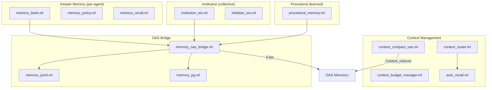

# Memory Systems

| 항목 | 값 |
|------|-----|
| Status | Draft |
| Team | Keeper |
| Maps to | `lib/keeper/keeper_memory*.ml`, `lib/institution_eio.ml`, `lib/procedural_memory.ml`, `lib/context_*.ml`, `lib/memory_*.ml`, `lib/auto_recall.ml`, `lib/hebbian_eio.ml` |
| Dependencies | 05-keeper-agent, 13-oas-integration |

---

## 1. Purpose

MASC의 메모리 시스템은 에이전트의 장기 기억, 조직 지식, 학습된 절차, 컨텍스트 예산을 관리한다. 4개 독립 서브시스템으로 구성되며, OAS Memory.t 5-tier 모델과 bridge를 통해 연결된다.

메모리 시스템이 해결하는 문제:
- 에이전트 세션 간 연속성 유지 (memory bank)
- 조직 수준의 집단 지식 전달 (institution)
- 반복 행동의 패턴 결정화 (procedural)
- 컨텍스트 윈도우 한계 내에서 정보 우선순위 관리 (context budget)
- 세대 교체 시 학습된 행동의 상속 (DNA injection)

---

## 2. Architecture



---

## 3. Keeper Memory Bank

### 3.1 개요

Keeper memory bank는 개별 에이전트의 세션 기억을 JSONL 파일로 저장한다. 각 keeper는 자신의 메모리 파일을 소유한다.

파일 경로: `.masc/keepers/<keeper_name>.memory.jsonl`

별도 recovery cache:
- progress log: `.masc/keepers/<keeper_name>/progress.md`
- continuity summary: `keeper_meta.continuity_summary`

원칙:
- memory bank는 typed recall store다.
- progress log는 restart/handoff용 filesystem-first cache다.
- continuity summary는 마지막 fallback cache다.
- truth는 checkpoint / raw history / live repo state다.

### 3.2 Memory Note 구조

각 note는 JSONL 한 줄로 저장된다:

```json
{"ts":"2026-03-23T...","ts_unix":1774500000.0,"name":"keeper-name",
 "trace_id":"...","generation":3,"turn":12,
 "kind":"decision","horizon":"mid_term","source":"reply_state_block",
 "schema_version":2,
 "priority":86,"text":"API 변경 시 backward compat 필수"}
```

**필드**:
- `kind`: goal, progress, next, decision, open_question, constraints
- `horizon`: `short_term`, `mid_term`, `long_term`
- `source`: `reply_state_block`, `meta_goal_fallback`, `progress_consolidation`, `cross_trace_recurrence`
- `schema_version`: 현재 `2`
- `priority`: 1-100, kind에 따라 통합 기본 우선순위가 결정됨
- `ts_unix`: 시간순 정렬에 사용

### 3.3 통합 우선순위

`keeper_memory_policy.ml`의 `priority_for_kind`가 kind별 기본 우선순위를 반환한다. 모든 keeper에 동일한 통합 정책이 적용된다.

| kind | 기본 priority |
|------|-------------|
| constraints | 90 |
| decision | 86 |
| long_term | 95 |
| next | 80 |
| open_question | 76 |
| goal | 72 |
| progress | 66 |
| (기타) | 60 |

기본 horizon 매핑:
- `next`, `open_question`, `progress` → `short_term`
- `goal`, `decision`, `constraints` → `mid_term`
- `long_term` → `long_term`

`total_cap`은 12로 고정. `signal_bonus`가 텍스트 내 도메인 키워드 존재 시 추가 보너스를 부여한다 (최대 +8). 불확실성 키워드는 -8 페널티.

### 3.4 Compaction

`compact_memory_bank_if_needed`가 메모리 파일 크기가 트리거를 초과하면 자동 압축한다.

| 설정 | 기본값 | 환경변수 |
|------|-------|---------|
| target_notes | 220 | `MASC_KEEPER_MEMORY_MAX_NOTES` |
| trigger_bytes | 120,000 | `MASC_KEEPER_MEMORY_COMPACT_TRIGGER_BYTES` |

압축 단계:
1. JSONL 파싱, 유효하지 않은 행 제거
2. `ts_unix` 기준 정렬 (최신 우선)
3. 중복 제거 (kind:text 정규화 키 기준)
4. 최근 `recent_floor`개 (target/5, 16-64 범위) 무조건 보존
5. horizon-aware priority 순으로 kind별 cap까지 채움
6. 미달 시 kind cap 무시하고 recency 순으로 추가 채움
7. 원자적 파일 교체 (.tmp -> rename)

환경변수 오버라이드:
- `MASC_KEEPER_MEMORY_MAX_NOTES`: target_notes (범위: 40-4000)
- `MASC_KEEPER_MEMORY_COMPACT_TRIGGER_BYTES`: trigger bytes (범위: 60KB-20MB)

### 3.5 Recall Scoring

`keeper_memory_recall.ml`은 기억 회상 품질을 평가한다:

- `is_memory_recall_query`: 사용자 메시지가 기억 회상 요청인지 판별 (한/영 키워드 매칭)
- `jaccard_similarity`: word token + character n-gram (3-byte, 6-byte) Jaccard 유사도
  - 한국어 형태소 부분 매칭 지원 (6-byte gram이 2음절 형태소 포착)
- `evaluate_memory_recall`: 후보군에서 최적 매칭 + topic-specific 보너스 계산
- `recall_candidates_with_history`: checkpoint 메시지 + history.jsonl 병합 (교차 세대 회상)

### 3.6 Recovery Order And Prompt Injection

복구/주입 순서는 다음과 같다:
1. `progress.md`
2. latest checkpoint `[STATE]`
3. `keeper_meta.continuity_summary`
4. memory bank의 `long_term`
5. `history.jsonl`

prompt 주입 규칙:
- short-term: `NEXT`, `OpenQuestions`, `next_items`
- mid-term: `Goal`, `Decisions`, `Constraints`
- long-term: memory bank의 `horizon=long_term`

`progress.md`는 `Generation:` 헤더를 가진다. progress log의 generation이 현재 keeper generation과 다르면:
- mid-term은 유지
- short-term은 prompt에 주입하지 않는다

즉, 이전 generation의 `NEXT:`가 새 generation prompt에 직접 재주입되지 않는다. short-term carry는 explicit promotion 또는 handoff artifact를 통해서만 허용한다.

### 3.7 Auto Rules

`evaluate_keeper_auto_rules`가 5개 자동 규칙을 평가한다:

| 규칙 | 조건 | 동작 |
|------|------|------|
| reflect | repetition_risk >= threshold | 반복 방지 성찰 |
| plan | goal_alignment AND response_alignment 모두 threshold 이하 | 목표 드리프트 교정 |
| compact | context_ratio >= gate OR message >= gate OR token >= gate | 컨텍스트 압축 |
| handoff | auto_handoff AND context_ratio >= handoff_threshold | 세대 승계 |
| guardrail_stop | 4개 조건 AND gate (rep, goal, response, ctx) | 안전 정지 |

우선순위: guardrail_stop > reflect > plan > compact > handoff > none

---

## 4. Institution Memory

### 4.1 개요

`institution_eio.ml`은 조직 수준의 집단 기억을 관리한다. 개별 에이전트가 아니라 에이전트 사회 전체의 지식을 담는다.

파일 경로:
- 구조: `.masc/institution.json` (전체 institution 상태)
- 에피소드: `.masc/institution_episodes.jsonl` (JSONL append-only)

### 4.2 데이터 모델

```
institution
  identity: { id, name, mission, founded_at, generation }
  memory: long_term_memory
    episodic: episode list      -- 사건 기록
    semantic: knowledge list    -- 개념/지식
    procedural: pattern list    -- 행동 패턴
  culture: cultural_value list  -- 가치/규범
  succession: succession_policy -- 온보딩/멘토링 규칙
  current_agents: string list
  alumni: string list
```

### 4.3 Cultural Inheritance

`format_for_injection`이 institution 상태를 에이전트 프롬프트 주입용 텍스트로 변환한다:
- mission statement
- 상위 3개 cultural values (weight 기준)
- 상위 N개 procedural patterns (success rate 기준, effectiveness score >= 0.2 필터)
- onboarding steps
- alumni network

`format_for_welcome`은 `masc_join` 응답에 포함되는 축약 버전.

### 4.4 Pattern Effectiveness

Institution pattern은 effectiveness 추적을 갖는다:
- `record_effectiveness`: 패턴 주입 후 실제 사용 여부 기록
- `effectiveness_score`: (used / total) * exp(-elapsed / 30일) -- 30일 시간 감쇠
- `prune_ineffective`: score가 threshold 미만이고 effectiveness 데이터가 있는 패턴 제거

---

## 5. Procedural Memory

### 5.1 개요

`procedural_memory.ml`은 반복되는 에이전트 행동으로부터 패턴을 결정화(crystallize)한다.

파일 경로: `.masc/procedures/<agent_name>/procedures.jsonl`

### 5.2 데이터 모델

```ocaml
type procedure = {
  id : string;
  agent_name : string;
  pattern : string;          (* "When X, do Y" *)
  evidence : string list;    (* 지지하는 decision ID 목록 *)
  success_count : int;
  failure_count : int;
  confidence : float;        (* success / (success + failure) *)
  created_at : float;
  last_applied : float;
}
```

### 5.3 Adaptive Crystallization

`is_crystallized`가 두 가지 경로로 결정화 여부를 판정한다:

| 경로 | 조건 | 용도 |
|------|------|------|
| Standard | evidence >= 3 AND confidence >= 0.7 | 일반 패턴 |
| Rare-but-perfect | evidence >= 2 AND confidence = 1.0 | 드물지만 중요한 패턴 |

임계값은 환경변수로 조정 가능:
- `MASC_PROC_MIN_EVIDENCE` (기본: 3)
- `MASC_PROC_MIN_CONFIDENCE` (기본: 0.7)

### 5.4 DNA Injection

`format_for_dna`가 결정화된 절차를 `[PROCEDURES]...[/PROCEDURES]` 블록으로 포맷하여 후속 세대 에이전트의 시스템 프롬프트에 주입한다.

---

## 6. Context Budget Manager

### 6.1 개요

`context_budget_manager.ml`은 세션 수준의 컨텍스트 윈도우 토큰 예산을 추적하고, 사용량 비율에 따라 압축 단계를 결정한다.

### 6.2 Compression Phases

| Phase | usage_ratio | 동작 | tool_budget |
|-------|-------------|------|-------------|
| None_phase | 0-50% | 전체 설명, 압축 없음 | 제한 없음 |
| Compact_tools | 50-70% | 도구 설명 1줄 축약 | max_budget / 10 |
| Drop_low | 70-85% | 낮은 중요도 메시지 제거 | max_budget / 20 |
| Summarize | 85%+ | 오래된 턴 요약 | max_budget / 40 |

기본 max_budget: `MASC_CONTEXT_BUDGET_MAX` 환경변수 (기본값: 100,000 tokens)

### 6.3 OAS Context Compaction

`context_compact_oas.ml`은 OAS `Context_reducer`에 직접 위임한다.

4개 전략:

| 전략 | OAS 매핑 | 설명 |
|------|---------|------|
| PruneToolOutputs | `Prune_tool_outputs { max_output_len = 500 }` | 도구 출력 잘라내기 |
| MergeContiguous | `Merge_contiguous` | 연속 동일 역할 메시지 병합 |
| DropLowImportance | `Custom` (importance scoring closure) | 0.3 미만 score 메시지 제거 |
| SummarizeOld | `Custom` (`keep_recent = 5`) | 오래된 일반 메시지를 extractive 요약하고, 오래된 tool result는 structured stub으로 마스킹해 pairing을 보존 |

Importance scoring (`score_messages`):
- 가중치: recency 40% + role 25% + content_length 20% + tool_content 15%
- `[MASC_MEMORY_SUMMARY v1]` 또는 goal prefix로 시작하는 메시지는 최소 0.95 보장

SummarizeOld의 `summarizer`는 LLM을 호출하지 않는다. 각 메시지의 첫 문장(최대 120자)을 추출하는 결정론적 extractive 방식.

---

## 7. Context Router

### 7.1 개요

`context_router.ml`은 쿼리에 대한 사전 검색 결정 게이트다. 불필요한 vector DB / Neo4j 호출을 방지한다.

### 7.2 Retrieval Depth

| Depth | 대상 소스 | 적용 상황 |
|-------|----------|----------|
| Skip | 없음 | Conversational, Task_command |
| Light | Recent_broadcasts, Masc_cache | Status_check, Coordination, 답이 broadcast에 있는 Knowledge_query |
| Full | Recent_broadcasts, Masc_cache, File_context | Knowledge_query |

### 7.3 Intent Classification

3가지 모드 (`MASC_CONTEXT_ROUTER_MODE`):
- `heuristic` (기본): 패턴 매칭, 0-latency
- `model`: OAS `run_named(cascade_name="context_router")` 호출
- `hybrid`: model 시도, 실패 시 heuristic fallback

Heuristic 분류는 ~80% 정확도를 보인다 (개발자 추정).

---

## 8. Auto Recall

### 8.1 개요

`auto_recall.ml`은 에이전트 프롬프트에 자동으로 관련 컨텍스트를 주입한다.

### 8.2 Sources

| Source | 설명 |
|--------|------|
| `Masc_cache` | 공유 컨텍스트 스토어 |
| `Recent_broadcasts` | 방 내 최근 N개 broadcast |
| `File_context` | 최근 수정 파일 (mtime scan 기반 구현 완료) |

Keeper turn path는 이것과 별도로 `git status --porcelain` delta를 추적한다.
즉:
- `File_context` = 최근 파일 내용을 recall source로 가져오는 것
- live worktree delta = 지난 keeper turn 이후 바뀐 파일 목록을 다음 turn에 직접 주입하는 것

### 8.3 Configuration

```ocaml
type recall_config = {
  enabled: bool;
  sources: recall_source list;
  max_tokens: int;
  max_broadcasts: int;
  cache_tags: string list;
}
```

`fetch_context_smart`가 쿼리 기반 relevance boosting을 적용한다. Context Router와 통합 시 `to_recall_config`가 routing decision에 맞는 config를 생성한다.

---

## 9. OAS Memory Bridge

### 9.1 5-Tier 매핑

`memory_oas_bridge.ml`이 MASC 메모리 시스템을 OAS `Memory.t`의 5-tier 모델에 연결한다.

| OAS Tier | MASC 소스 | 연결 방식 |
|----------|----------|----------|
| Scratchpad | OAS 내부 관리 | bridge 불필요 |
| Working | OAS 내부 관리 | bridge 불필요 |
| Long_term | PostgreSQL (`Memory_pg`) 또는 JSONL (`Memory_jsonl`) | `make_backend` |
| Episodic | `Institution_eio` JSONL episodes | `seed_episodes` / `flush_episodes` |
| Procedural | `Procedural_memory` | `seed_procedures_as_oas` / `flush_procedures` |

### 9.2 Storage Backends

**PostgreSQL** (`memory_pg.ml`):
- 테이블: `oas_memory_store (agent_name, key, value_json)`
- UPSERT on `(agent_name, key)` unique constraint
- Caqti_eio pool 사용 (Board_pg와 동일 pool)
- `MASC_POSTGRES_URL` 설정 시 자동 선택

**JSONL** (`memory_jsonl.ml`):
- 파일: `.masc/memory/<agent_name>/<session_id>.jsonl`
- Append-only, latest entry wins on read
- Tombstone: `{"key":"...","value":null,"ts":...}` -- 삭제 표시
- 50MB 파일 크기 경고, 1MB 단일 값 경고 + 잘라내기
- PostgreSQL 미사용 시 fallback

### 9.3 Lifecycle

```
create_memory_full
  1. make_backend (PG 또는 JSONL)
  2. seed_episodes (Institution JSONL -> OAS Episodic, 기본 50개)
  3. seed_procedures_as_oas (crystallized procedures -> OAS Procedural, 기본 20개)
  4. seed_institution (institution.json -> OAS Long_term, 선택)

Agent.run 완료 후:
  flush_all
    1. flush_episodes (OAS -> Institution JSONL, 중복 ID 제거)
    2. flush_procedures (OAS -> Procedural_memory, 변경된 count만)
```

### 9.4 Episode Conversion

Institution episode <-> OAS episode 변환 시:
- `salience` 자동 계산: Success 0.75, Failure 0.95, Partial 0.6, + learning bonus (최대 0.15)
- 메타데이터에 `event_type`, `institution_summary`, `learnings`, `context` 보존
- Round-trip 시 원본 `institution_outcome` 문자열이 metadata에서 복원됨

---

## 10. Hebbian Learning

### 10.1 개요

`hebbian_eio.ml`은 "함께 활동한 에이전트는 연결이 강화된다" 원칙의 협업 패턴 학습이다.

파일 경로: `.masc/synapses/graph.json`

### 10.2 시냅스 모델

```ocaml
type synapse = {
  from_agent: string;
  to_agent: string;
  weight: float;        (* 0.0-1.0 *)
  success_count: int;
  failure_count: int;
  last_updated: float;
  created_at: float;
}
```

| 파라미터 | 기본값 | 설명 |
|---------|--------|------|
| strengthen_rate | 0.1 | 성공 시 증가량 |
| weaken_rate | 0.1 | 실패 시 감소량 |
| decay_rate | 0.01 | 일별 감쇠율 (consolidation) |
| min_weight | 0.05 | 이 미만이면 pruning |
| max_weight | 1.0 | 상한 |

---

## 11. Invariants

1. **Compaction은 원자적이다**: memory bank 재작성은 .tmp 파일에 쓰고 rename한다. 실패 시 원본 불변.
2. **Dedup은 정규화 기반이다**: `normalize_memory_text_key`가 공백/구두점 제거 + lowercase 후 비교한다.
3. **kind가 우선순위를 결정한다**: 동일 kind + text는 항상 동일한 priority를 받는다. `signal_bonus`가 키워드 기반 보정을 추가한다.
4. **OAS bridge는 비파괴적이다**: flush 시 기존 데이터를 제거하지 않고 append 또는 update-in-place만 한다.
5. **Context compaction은 LLM을 호출하지 않는다**: SummarizeOld를 포함한 모든 전략이 결정론적이다.
6. **PostgreSQL은 primary, JSONL은 fallback이다**: `MASC_POSTGRES_URL` 유무로 자동 결정된다.
7. **Procedural crystallization은 비가역적이다**: 일단 결정화되면 evidence가 줄어도 상태가 변하지 않는다.
8. **Episode ID dedup이 flush boundary를 보호한다**: 이미 JSONL에 존재하는 ID는 다시 쓰지 않는다.

---

## 12. Environment Variables

| 변수 | 기본값 | 용도 |
|------|--------|------|
| `MASC_KEEPER_MEMORY_MAX_NOTES` | profile별 상이 | Memory bank compaction target |
| `MASC_KEEPER_MEMORY_COMPACT_TRIGGER_BYTES` | target * 360 | Compaction 트리거 크기 |
| `MASC_CONTEXT_BUDGET_MAX` | 100,000 | Context budget 상한 (tokens) |
| `MASC_CONTEXT_ROUTER_MODE` | heuristic | Intent classification 모드 |
| `MASC_MEMORY_OAS_DEFAULT_IMPORTANCE` | 5 | OAS Memory store 기본 importance |
| `MASC_PROC_MIN_EVIDENCE` | 3 | Crystallization 최소 증거 수 |
| `MASC_PROC_MIN_CONFIDENCE` | 0.7 | Crystallization 최소 신뢰도 |
| `MASC_OAS_SSE_DRAIN_INTERVAL_SEC` | 0.25 | Event_bus SSE relay 간격 |

---

## 13. Future Work

- `File_context` recall source 구현 (Auto_recall에서 TODO 상태)
- Broader memory unification: MASC 자체 4개 메모리와 OAS Memory.t 완전 통합
- Vector DB 기반 semantic recall 도입 (현재 Jaccard 유사도만 사용)
- Memory bank에 대한 cross-keeper sharing 메커니즘
