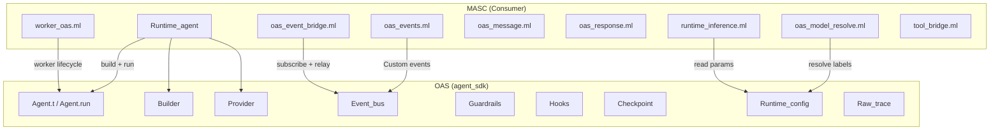

# OAS Integration

| 항목 | 값 |
|------|-----|
| Status | Draft |
| Team | OAS Bridge |
| Maps to | `lib/oas_*.ml`, `lib/worker_oas.ml`, `lib/runtime_inference.ml`, `lib/keeper/keeper_compact_policy.ml` |
| Dependencies | 02-types-and-invariants |
| OAS Version | `agent_sdk` library (OCaml, in-tree dependency) |

---

## 1. Purpose

OAS (OCaml Agent SDK)는 MASC 외부의 범용 에이전트 런타임 라이브러리다. MASC는 OAS를 소비자(consumer)로서 사용하며, OAS는 MASC를 알지 못한다.

이 문서는 MASC가 OAS에 의존하는 모든 접점(bridge, adapter, wrapper)을 정의한다. MASC 측 turn lifecycle(heartbeat → scheduling → `Agent.run` → receipt)의 권위 정의는 [`04-turn-lifecycle.md`](./04-turn-lifecycle.md)에 있으며, 이 문서는 OAS bridge 본연의 역할에 집중한다.

**의존 방향** (불변):
```
MASC ──depends on──> OAS (agent_sdk)
OAS  ──does not know──> MASC
```

MASC 전용 요구가 생기면 MASC adapter/bridge로 먼저 해결하고, OAS 공개 API 확장은 모든 OAS 소비자에게 유익한 경우에만 제안한다.

---

## 1.1 Document Ownership

- `/home/runner/work/masc/masc/docs/OAS-MASC-BOUNDARY.md` is the boundary contract SSOT.
- This spec keeps the implementation map, bridge inventory, and open structural gaps.
- `/home/runner/work/masc/masc/docs/KEEPER-STATE-OWNERSHIP.md` defines checkpoint, lane, domain-state, and receipt ownership.
- `/home/runner/work/masc/masc/docs/design/checkpoint-truth-and-replay-rfc.md` keeps checkpoint truth hierarchy, replay semantics, and side-effect boundary language.
- `/home/runner/work/masc/masc/docs/qa/OAS-BOUNDARY-HEALTHCHECK-2026-03-31.md` is evidence, not contract.
- `/home/runner/work/masc/masc/docs/qa/OAS-OBSERVABILITY-TRUTH-AUDIT-2026-04-15.md` records the OAS observability producer -> bridge -> durable store -> dashboard consumer chain.

---

## 2. Architecture



---

## 3. Boundary Rules

`docs/OAS-MASC-BOUNDARY.md`에 정의된 역할 분리:

| 관심사 | OAS 담당 | MASC 담당 |
|--------|---------|----------|
| 단일 에이전트 실행 | `Agent.run`, `Builder`, `Hooks`, `Guardrails`, `Checkpoint` | 언제/왜/어떤 agent를 돌릴지 결정 |
| 멀티에이전트 실행 | `Orchestrator`, `Agent_sdk_swarm.Runner` | workspace, board, workflow, policies |
| 도구 실행 | `Tool.t`, hook lifecycle, raw trace | tool schema 정의, dispatch, auth |
| 컨텍스트 축약 | 없음; exact message history를 실행 | Keeper compaction, persisted-history repair, provider-bound artifact projection |
| 이벤트 전달 | `Event_bus` | 어떤 MASC 사건을 publish할지, SSE/dashboard 연결 |
| 장기 메모리 | 없음 | `Masc.Memory.t`, keeper memory bank, institution/procedural stores |
| 조율 상태 | 없음 | workspace, tasks, board, keeper Gate |

---

## 4. Runtime_agent (Unified Agent Runner)

### 4.1 개요

`lib/runtime/runtime_agent.mli`는 MASC가 OAS Agent를 구성하고 실행하는 public
facade다. Keeper의 provider 후보 순회는 `Keeper_turn_driver`, team-session worker
adapter는 `Worker_oas`가 소유하며, 둘 다 OAS 실행 계약을 복제하지 않고
`Runtime_agent`/`Agent_sdk.Agent.run`을 소비한다.

### 4.2 config 타입

형식의 SSOT는 `Runtime_agent.config = Runtime_agent_context.config`다. 이 문서는
record 정의를 복제하지 않고 의미만 분류한다.

| 그룹 | 현재 계약 |
|------|-----------|
| 필수 실행 identity | `name`, `provider_cfg`, `model_id`, `system_prompt`, `tools` |
| provider request 파라미터 | `temperature`, `top_p`, `top_k`, `min_p`, `max_tokens`는 모두 option이며 `None`은 wire field 자체를 생략 |
| thinking | `enable_thinking`, `preserve_thinking`, `thinking_budget`는 provider/OAS typed option |
| liveness | `stream_idle_timeout_s`, `body_timeout_s`는 호출자가 명시할 때만 적용하는 request-local I/O deadline |
| continuity | `initial_messages`, `checkpoint_sidecar`, `checkpoint_sink`, `context`, `context_injector` |
| observation | `hooks`, `event_bus`, `raw_trace`, `trace_link`, `on_run_complete` |
| transport/projection | `transport`, `model_input_projection`, `cache_system_prompt`, `yield_on_tool` |

`Runtime_agent.default_config`에는 turn-count limit가 없다. `max_tokens=None`이
기본이며 Keeper core turn도 이를 명시적으로 유지한다. `Some n`은 non-Keeper
caller가 의도적으로 요청한 provider output parameter일 뿐 Keeper Stop/Pause,
recurrence, retry admission 권한이 아니다.

### 4.3 실행 흐름

```
default_config -> caller-owned record projection -> Runtime_agent.run
  |
  v
Agent_sdk.Agent.run / Agent_sdk.Agent.Advanced.run_until_boundary
  1. session_id 생성 또는 caller identity 사용
  2. Event_bus에 "build" 이벤트 publish
  3. Builder 패턴으로 Agent.t 구성
  4. Agent.run 또는 typed cooperative-yield boundary 호출
  5. OAS turn boundary에서 caller-owned checkpoint_sink 호출
  6. typed stop reason과 runtime observation 구성
  7. Event_bus에 "completed"/"failed" publish
  8. Agent.close
```

### 4.4 run_result

형식의 SSOT는 `lib/runtime/runtime_agent.mli`다. 결과는 response와 optional
checkpoint, session identity, observed turn count, raw-trace reference와
validation, runtime observation, typed `stop_reason`을 함께 반환한다.

`turns`는 완료 후의 관측값이다. 완료 조건이나 다음 Keeper cycle의 admission
budget으로 읽지 않는다.

### 4.5 Runtime Execution

`run_named`가 runtime 이름 기반 MODEL 호출을 제공한다:

1. `runtime.toml`의 `[routes.*]` 대상 또는 호출자가 지정한 runtime 이름을 active runtime config에서 해석한다.
2. 대상은 `[tier.<name>]` / `[runtime.<name>]` / binding alias로 resolve되고, runtime resolution이 ordered weighted entries를 `Provider_config.t list`로 변환한다.
3. MASC가 `Runtime_fsm.decide`로 runtime FSM을 직접 구동한다.
4. 각 provider에 대해 OAS single-provider `Agent.run`을 호출한다.
5. `accept` 콜백으로 응답 유효성을 검증한다.

관측 경계:
- MASC는 configured labels, resolved candidate models, 최종 selected model은 관측 가능
- `Llm_provider.Metrics` callback을 통해 actual request attempt와 runtime fallback event는 관측 가능하다
- `raw_trace`에는 아직 provider attempt record가 없으므로 raw-trace만으로는 opaque 하다
- 따라서 attempt details source는 `oas_metrics_callbacks` 또는 `no_oas_observation`처럼 경계를 명시한다

Runtime catalog는 configured default가 없거나 requested runtime id가 해석되지
않으면 typed config error로 실패한다. 명시적 runtime intent를 다른 provider나
default runtime으로 조용히 치환하지 않는다.

### 4.6 Termination Semantics

현재 OAS bridge에는 `MaxTurnsExceeded`, `AgentExecutionTimeout`,
`AgentExecutionIdleTimeout`, `IdleDetected`, `ExitConditionMet` 계약이 없다.
Keeper는 그런 값을 sentinel이나 성공 observation으로 되살리지 않는다.

정상/협력적 중단은 `Runtime_agent.stop_reason`으로 분리된다:

| stop reason | 의미 | Keeper lifecycle 권한 |
|-------------|------|-----------------------|
| `Completed` | 정상 OAS 완료 | 현재 activity 결과 |
| `Yielded_to_chat_waiting` | Tool boundary에서 대기 chat에 lane 양보 | checkpoint를 보존하고 후속 activity가 재개 |
| `Yielded_to_durable_stimulus` | durable event에 lane 양보 | checkpoint를 보존하고 후속 activity가 재개 |
| `InputRequired` | typed elicitation | 실패가 아닌 HITL/입력 대기 continuation |

실제 SDK error는 `Keeper_agent_error.sdk_termination_semantics`의 닫힌 합으로
receipt에 투영한다:

| SDK error class | MASC semantic | Receipt outcome |
|-----------------|---------------|-----------------|
| API/provider typed timeout | `provider_wall_clock_timeout` | `cancelled` |
| typed input-required의 defensive error path | `oas_input_required` | `cancelled` |
| guardrail violation | `oas_guardrail_violation` | `error` |
| tripwire violation | `oas_tripwire_violation` | `error` |
| other SDK/API/provider failure | `sdk_error_failure` | `error` |

일반 실행에서 `InputRequired`는 error receipt에 도달하기 전에 typed
`Runtime_agent.stop_reason` 성공 결과로 승격된다. Token/cost/turn counters는
관측값이며 이 terminal mapping이나 Keeper admission에 참여하지 않는다.

### 4.7 MASC Tool Bridge

`run_with_masc_tools`와 `run_named_with_masc_tools`가 MASC 도구 스키마를 OAS `Tool.t`로 변환한다.

```
MASC Types.tool_schema
  -> Tool_bridge.oas_tool_of_masc
  -> Agent_sdk.Tool.t
```

변환: `name`, `description`, `input_schema`를 복사하고 dispatch 클로저를 래핑한다.

---

## 5. Worker_oas (Team Session Worker Bridge)

### 5.1 개요

`worker_oas.ml`은 MASC team session의 worker를 OAS Agent로 매핑한다.

### 5.2 Key Mappings

| MASC 필드 | OAS 매핑 |
|-----------|---------|
| `worker_container_meta.effective_model` | `Agent_sdk.Provider.config` model_id |
| `runtime_backend` | description metadata + spawn/runtime routing |
| `timeout_seconds` | worker-container lifecycle metadata; OAS Agent turn-count limit가 아님 |
| fixed `session_min` MCP surface + fixed shell surface | `Tool.t list` |
| heartbeat | periodic callback |
| team_session description | `Builder.with_description` metadata |

---

## 6. Runtime Configuration

### 6.1 Runtime Name Resolution

MASC owns runtime name resolution. The keeper path resolves `runtime_id`
through active MASC runtime resolution and then calls OAS as a single-provider runtime
for each selected attempt. OAS provider registry and capability manifests are
generic execution contracts; they are not the MASC runtime plane.

```
runtime_id (e.g. "keeper", "verifier", "context_router")
  -> config/runtime.toml [routes] / profile lookup
  -> MASC runtime labels
  -> MASC/OAS adapter resolves labels against OAS Provider_registry
  -> Provider_config.t list (ordered by MASC policy)
  -> OAS Agent.run single provider per attempt
```

Provider/model-free here means MASC policy code does not branch on vendor or
model literals. Provider/model ids remain operator-authored config data and may
come from an OAS provider registry for cloud APIs, local Provider-D-compatible
servers, or non-interactive subscription CLI runtimes.

### 6.2 Runtime Inference Parameters

`Runtime_inference`는 loaded `runtime.toml`의 model declaration에서 sampling
temperature와 typed thinking capability를 투영한다. `Runtime_adapter`는
`top-p` 등 provider config 필드를 그대로 보존한다.

Checked-in runtime defaults should prefer explicit `provider:model_id` labels.
Provider-specific `auto` aliases are runtime convenience paths, not stable
repository defaults.

MASC는 model capability의 `max-output-tokens` ceiling이나 임의 fallback에서
request `max_tokens`를 합성하지 않는다. Keeper dispatch는 `None`을 전달하며,
OAS가 provider/model capability validation을 소유한다. 이 ceiling과 실제
usage token 관측값은 Keeper lifecycle budget이 아니다.

### 6.3 Model Label Resolution

`oas_model_resolve.ml`이 모델 레이블 문자열을 OAS `Provider_registry`를 통해 해석한다:

- `provider_name_of_label`: "llama:qwen3.5" -> Some "llama"
- `max_context_of_label`: label -> Provider_registry.find -> entry.max_context (fallback: 128,000)
- `resolve_primary_max_context`: label list에서 available한 첫 모델의 max_context
- `ensure_api_keys_for_labels`: 사용 가능한 API key 존재 여부 검증

---

## 7. Message/Response Conversion

### 7.1 Oas_message

`oas_message.ml`은 OAS 메시지 생성 헬퍼를 제공한다. 다른 MASC 코드가 provider-specific 이름을 직접 참조하지 않도록 한다.

```ocaml
val tool_result : ?is_error:bool -> tool_use_id:string -> content:string
  -> unit -> Agent_sdk.Types.message
```

### 7.2 Agent_sdk_response

`oas_response.ml`은 OAS 응답 읽기 헬퍼:

```ocaml
type api_response = Agent_sdk.Types.api_response
val text_of_response : api_response -> string
val model_used : api_response -> string option
val usage_or_zero : api_response -> Agent_sdk.Types.api_usage
```

### 7.3 Type Compatibility

MASC와 OAS는 `Agent_sdk.Types.message` 타입을 공유한다. 4개 역할(System,
User, Assistant, Tool)과 ToolUse/ToolResult content block이 동일하므로,
provider-specific role conversion이나 extra tagging은 필요하지 않다.

---

## 8. Event Bus Bridge

### 8.1 Publishing (oas_events.ml)

MASC 조율 이벤트를 OAS `Event_bus`에 `Custom("masc:<type>", json)` 형식으로 publish한다.

| Event Type | 발생 시점 |
|-----------|----------|
| `masc:broadcast` | agent broadcast 전송 |
| `masc:heartbeat` | keeper heartbeat |
| `masc:board_post` | board post 생성 |
| `masc:task_transition` | task 상태 변경 |
| `masc:heartbeat_recovered` | timeout 복구 |
| `masc:keeper:snapshot` | keeper 상태 스냅샷 |
| `masc:keeper:lifecycle` | keeper 시작/중단/충돌/재시작 |
| `masc:institution_episode` | institution 에피소드 기록 |

### 8.2 SSE Relay (oas_event_bridge.ml)

`oas_event_bridge.ml`이 Event_bus의 native OAS events와 `masc:*` custom events를 모두 SSE로 중계하고 durable JSONL로도 기록한다.

동작:
1. `Event_bus.subscribe`로 전체 OAS event bus를 구독
2. 배경 fiber가 `drain_interval_s` (기본 0.25초) 간격으로 poll
3. native/custom event를 `oas:*` envelope JSON으로 직렬화하고 `correlation_id`, `run_id`, `ts_unix`를 포함
4. `.masc/oas-events/`에 durable append
5. `Sse.broadcast_to Agent streams`로 dashboard 클라이언트에 전달

환경변수: `MASC_OAS_SSE_DRAIN_INTERVAL_SEC` (범위: 0.05-5.0초)

### 8.3 Dashboard Observability Read Path

Dashboard OAS runtime health is not a live-only counter.

Read path:

1. durable replay source: `/api/v1/dashboard/telemetry?source=oas_event`
2. client runtime ledger: `dashboard/src/oas-runtime-store.ts`
3. live overlay: `dashboard/src/sse.ts` -> same `applyOasRuntimeEvent()` ingestion path
4. UI consumer: `dashboard/src/components/oas-health-chip.ts`

SSOT rules:

- OAS runtime health = `durable oas_event replay + live SSE tail`
- dashboard `counts` = active runtime truth
- dashboard `configured_keepers` = configured keeper inventory

---

## 9. Product Judgment Boundaries

판단이 필요한 MASC 기능은 각 제품 경계가 입력 타입, prompt, structured output
schema, 결과 소비 방식을 소유한다. OAS는 generic model/agent execution과 typed
failure만 제공한다.

```
MASC typed request
  -> owner-specific prompt + schema
  -> ordinary OAS execution
  -> typed model output | explicit error
  -> owner-specific transition, wake, or observation
```

Fusion, Keeper failure judgment, board attention, Task completion review는 서로 다른
도메인 계약이다. 공통 문자열 verdict, hidden budget, caller registry로 이들을
하나의 verifier policy에 합치지 않는다.

### 9.1 Keeper and Worker Guardrails

Keeper lane과 MASC worker adapter는 모두
`Agent_sdk.Guardrails.permissive`를 고정 사용한다. Keeper public API는 OAS
guardrails를 caller override로 노출하지 않는다. 외부 효과의 권한은 local
command classifier가 아니라 MASC의 normalized Gate 경계에서 exact Always
Allowed, LLM Auto Judge, 비차단 HITL 중 하나로 결정된다.

---

## 10. Context Compaction

Keeper compaction and persisted-history repair are MASC-owned. OAS receives the
resulting exact message history without an implicit reducer. Provider-bound
artifact hydration is a caller-owned `model_input_projection`; it changes only
the request projection, while agent state and checkpoints retain their
content-addressed markers.

---

## 11. Memory Boundary

Former memory projection is removed. MASC no longer creates or passes OAS
memory objects; keeper memory bank, institution episodes, and procedural memory
remain MASC-owned under `Masc.Memory.t` and the `Keeper_memory_*` modules.

---

## 12. Integration Status

| 영역 | 상태 | 설명 |
|------|------|------|
| Agent 실행 | Complete | `Runtime_agent`와 `Worker_oas`가 MODEL 호출을 OAS Agent.run으로 라우팅 |
| Context compaction | Partial | Keeper compaction is MASC-owned and OAS receives exact messages without an implicit reducer; durable owner operation, source CAS, and reinjection proof remain |
| Event_bus bridge | Complete | OAS native/custom events are relayed to SSE and persisted under `.masc/oas-events/` |
| Dashboard OAS runtime health | Complete | dashboard health uses `durable replay + live tail`, not live-only counters |
| Dashboard runtime counts | Complete | dashboard `counts` carries active runtimes and `configured_keepers` carries inventory |
| Checkpoint | Partial | shared worker/runtime paths는 OAS Checkpoint를 사용한다. Public `Runtime_agent` surface의 extra checkpoint JSON은 neutral `checkpoint_sidecar` 이름을 쓰지만 keeper 경로는 여전히 `lib/keeper/keeper_context_runtime.ml`의 wrapper + serialized context를 유지 |
| Memory projection | Removed | MASC memory is not projected into OAS; runtime memory storage remains MASC-owned |
| Team-session swarm | Partial | OAS Swarm runner 활성, bridge fidelity 불완전 |
| Runtime config | Complete | runtime_id -> MASC runtime config/profile -> OAS Provider_registry -> Provider_config.t |
| Verifier | Complete | configured structured-judge call; no local tool/effect classifier |
| Model resolution | Complete | oas_model_resolve.ml이 Provider_Registry SSOT 사용 |
| Tool bridge | Complete | MASC tool_schema -> OAS Tool.t 변환 |

### 12.1 Open Boundary Ledger

| Item | Status | Notes |
|------|--------|-------|
| `keeper_meta` runtime split | Partial | runtime-heavy fields are grouped under `keeper_meta.runtime`, but keeper persistence still owns them |
| keeper `working_context` wrapper | Open | keeper runtime still wraps OAS context/checkpoint state |
| keeper checkpoint nativeization | Open | keeper path still serializes MASC-owned context |
| prose/domain-state separation | Complete for Keeper replies | model-authored prose is context only; domain transitions require typed MASC tools and receipts |
| memory projection hooks/callbacks | Removed | memory callbacks and post-turn OAS flush paths were removed |
| team-session bridge fidelity | Open | healthcheck still calls out projection/resource-health gaps |

Checkpoint truth / replay semantics for the first three ledger items are
further constrained by `docs/design/checkpoint-truth-and-replay-rfc.md`.

### 12.1.1 Checkpoint Truth / Replay Phases

Phase ordering follows `docs/design/checkpoint-truth-and-replay-rfc.md`.

| Phase | Scope | Primary modules | Expected output |
|------|-------|-----------------|-----------------|
| A | truth surface cleanup | `keeper_checkpoint_store`, `keeper_agent_run`, `keeper_post_turn` | native OAS checkpoint is documented and treated as runtime truth |
| B | replay semantics + checkpoint boundary | `keeper_agent_run`, `keeper_post_turn`, `agent_tool_command_runtime`, `retired_file_write_tool` | typed replay target facts and checkpoint rules |
| C | wrapper reduction | `keeper_context_runtime`, `keeper_agent_run`, `keeper_post_turn`, `keeper_compact_policy` | `working_context` dependency inventory and exact checkpoint/reinjection backlog |
| D | optional delta path | `keeper_checkpoint_store`, `delta-checkpoint-read-path` | delta restore remains subordinate to full checkpoint truth |

### 12.1.2 Active Tasks

- **A1** native OAS checkpoint truth wording and legacy fallback removal
- **A2** canonical vs derived continuity read-surface labeling
- **B1** checkpoint-boundary typed fact inventory
- **B2** external-effect adapter inventory against the product-neutral Keeper Gate
- **C1** `working_context` dependency inventory
- **C2** prose/domain-state separation audit
- **D1** delta restore remains optimization-only

Validation steps live in `docs/KEEPER-CONTINUITY-VALIDATION.md`.

### 12.2 Boundary Audit Snapshot

| Surface | Classification | Notes |
|---------|----------------|-------|
| `Runtime_agent` / `Worker_oas` | Correct | MASC consumes OAS runtime/build/hook contracts without teaching OAS about workspace/task semantics |
| `keeper_compact_policy` / `keeper_manual_compaction` | Correct owner, incomplete durability | MASC owns configured-LLM planning and checkpoint mutation; durable owner operation, source CAS, and reinjection proof remain |
| keeper context/checkpoint continuity path | Open | exact checkpoint identity, durable operation references, and restart reconciliation remain incomplete |

### 12.3 Priority Order

1. keeper runtime state ownership
2. marker/text leakage
3. doc truth alignment

---

## 13. Invariants

1. **의존 방향은 단방향이다**: MASC -> OAS. OAS 코드에 MASC import가 존재하면 설계 위반이다.
2. **MASC는 finite OAS Agent.run을 조합한다**: OAS run lifecycle을
   복제하지 않는다. Keeper lifecycle과 durable product continuation은
   MASC가 소유한다.
3. **Message 타입은 공유한다**: `Agent_sdk.Types.message`가 MASC와 OAS 모두의 메시지 타입이다. 변환 레이어 없음.
4. **Runtime name이 model을 추상화한다**: MASC policy code에 구체적 provider/model 이름이 하드코딩되지 않는다. runtime_id -> runtime.toml runtime config -> Provider_registry 체인.
5. **Event_bus prefix는 `masc:`이다**: MASC 이벤트는 반드시 이 prefix를 사용한다. SSE bridge가 이 prefix로 필터링한다.
6. **Verifier는 도구 이름으로 건너뛰지 않는다**: read/grep/search/status 같은 이름이나 로컬 effect label은 MODEL 호출을 생략하거나 Pass를 만들 권한이 없다.
7. **Checkpoint는 session_id로 네임스페이스된다**: 동일 agent의 다른 세션 checkpoint와 충돌하지 않는다.
8. **OAS API 확장 제안 전에 adapter를 먼저 시도한다**: MASC-specific 개념을 OAS public contract에 밀어넣지 않는다.

---

## 14. Environment Variables

활성 환경변수와 기본값의 SSOT는 생성된
[`docs/runtime-tunables.md`](../runtime-tunables.md)와 이를 생성하는 typed config
registry다. 이 통합 문서는 변수명이나 기본값을 복제하지 않는다.

Provider/model credential binding은 `runtime.toml` catalog가 소유한다. 과거
`MASC_CONTEXT_BUDGET_MAX`/`MASC_CONTEXT_ROUTER_MODE` 같은 MASC-side context budget
또는 heuristic router 변수는 active runtime 계약이 아니다.

---

## 15. Future Work

- Team-session swarm bridge fidelity 완성
- provider별 structured thinking/tool/multimodal fidelity matrix를 fixture로 확장
- marker/text leakage를 구조화된 metadata 또는 hook path로 축소
