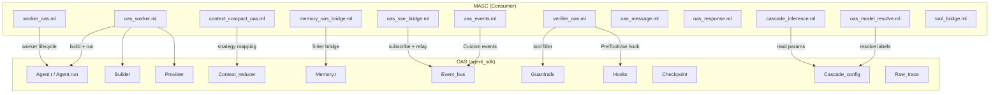

# OAS Integration

| 항목 | 값 |
|------|-----|
| Status | Draft |
| Team | OAS Bridge |
| Maps to | `lib/oas_*.ml`, `lib/worker_oas.ml`, `lib/verifier_oas.ml`, `lib/cascade_inference.ml`, `lib/context_compact_oas.ml`, `lib/memory_oas_bridge.ml` |
| Dependencies | 02-types-and-invariants |
| OAS Version | `agent_sdk` library (OCaml, in-tree dependency) |

---

## 1. Purpose

OAS (OCaml Agent SDK)는 MASC 외부의 범용 에이전트 런타임 라이브러리다. MASC는 OAS를 소비자(consumer)로서 사용하며, OAS는 MASC를 알지 못한다.

이 문서는 MASC가 OAS에 의존하는 모든 접점(bridge, adapter, wrapper)을 정의한다.

**의존 방향** (불변):
```
MASC ──depends on──> OAS (agent_sdk)
OAS  ──does not know──> MASC
```

MASC 전용 요구가 생기면 MASC adapter/bridge로 먼저 해결하고, OAS 공개 API 확장은 모든 OAS 소비자에게 유익한 경우에만 제안한다.

---

## 1.1 Document Ownership

- `/home/runner/work/masc-mcp/masc-mcp/docs/OAS-MASC-BOUNDARY.md` is the boundary contract SSOT.
- This spec keeps the implementation map, bridge inventory, and open structural gaps.
- `/home/runner/work/masc-mcp/masc-mcp/docs/design/oas-masc-state-boundary.md` is a historical audit / migration backlog, not the primary boundary contract.
- `/home/runner/work/masc-mcp/masc-mcp/docs/design/checkpoint-truth-and-replay-rfc.md` keeps checkpoint truth hierarchy, replay semantics, and side-effect boundary language.
- `/home/runner/work/masc-mcp/masc-mcp/docs/qa/OAS-BOUNDARY-HEALTHCHECK-2026-03-31.md` is evidence, not contract.
- `/home/runner/work/masc-mcp/masc-mcp/docs/qa/OAS-OBSERVABILITY-TRUTH-AUDIT-2026-04-15.md` records the OAS observability producer -> bridge -> durable store -> dashboard consumer chain.

---

## 2. Architecture



---

## 3. Boundary Rules

`docs/OAS-MASC-BOUNDARY.md`에 정의된 역할 분리:

| 관심사 | OAS 담당 | MASC 담당 |
|--------|---------|----------|
| 단일 에이전트 실행 | `Agent.run`, `Builder`, `Hooks`, `Guardrails`, `Memory`, `Checkpoint` | 언제/왜/어떤 agent를 돌릴지 결정 |
| 멀티에이전트 실행 | `Orchestrator`, `Agent_sdk_swarm.Runner` | room, board, workflow, policies |
| 도구 실행 | `Tool.t`, hook lifecycle, raw trace | tool schema 정의, dispatch, auth |
| 컨텍스트 축약 | `Context_reducer` | 어떤 전략을 언제 적용할지 결정 |
| 이벤트 전달 | `Event_bus` | 어떤 MASC 사건을 publish할지, SSE/dashboard 연결 |
| 장기 메모리 | `Memory.t` tiers | institutional memory, pg/jsonl backends |
| 조율 상태 | 없음 | room, tasks, team sessions, governance |

---

## 4. Oas_worker (Unified Agent Runner)

### 4.1 개요

`oas_worker.ml`은 MASC에서 OAS Agent를 실행하는 단일 진입점이다. 모든 MASC 모듈이 OAS Agent를 필요로 할 때 이 모듈을 사용한다.

### 4.2 config 타입

```ocaml
type config = {
  name : string;
  provider : Agent_sdk.Provider.config;
  model_id : string;
  system_prompt : string;
  tools : Agent_sdk.Tool.t list;
  max_turns : int;
  max_tokens : int;
  temperature : float;
  hooks : Agent_sdk.Hooks.hooks option;
  context_reducer : Agent_sdk.Context_reducer.t option;
  guardrails : Agent_sdk.Guardrails.t option;
  event_bus : Agent_sdk.Event_bus.t option;
  checkpoint_dir : string option;
  session_id : string option;
  description : string option;
  memory : Agent_sdk.Memory.t option;
  initial_messages : Agent_sdk.Types.message list;
  raw_trace : Agent_sdk.Raw_trace.t option;
  transport : Masc_grpc_transport.t;
}
```

### 4.3 실행 흐름

```
build(~net, ~config) -> Agent.t
  |
  v
run(~sw, ~net, ~config, goal) -> run_result
  1. session_id 생성 (없으면 "{name}-{timestamp}-{hash}")
  2. Event_bus에 "build" 이벤트 publish
  3. Builder 패턴으로 Agent.t 구성
  4. Agent.run 또는 Agent.run_stream 호출
  5. checkpoint 저장 (checkpoint_dir 설정 시)
  6. Event_bus에 "completed"/"failed" publish
  7. Agent.close
```

### 4.4 run_result

```ocaml
type run_result = {
  response : Agent_sdk.Types.api_response;
  checkpoint : Agent_sdk.Checkpoint.t option;
  session_id : string;
  turns : int;
  trace_ref : Agent_sdk.Raw_trace.run_ref option;
  cascade_observation : cascade_observation option;
}
```

### 4.5 Cascade Execution

`run_named`가 cascade 이름 기반 MODEL 호출을 제공한다:

1. `cascade.json`에서 `{name}_models` 목록 조회 (hot-reloadable)
2. `Cascade_config.parse_model_strings`로 `Provider_config.t list` 생성
3. MASC가 `Cascade_fsm.decide`로 cascade FSM을 직접 구동
4. 각 provider에 대해 OAS single-provider `Agent.run` 호출
5. `accept` 콜백으로 응답 유효성 검증

관측 경계:
- MASC는 configured labels, resolved candidate models, 최종 selected model은 관측 가능
- `Llm_provider.Metrics` callback을 통해 actual request attempt와 cascade fallback event는 관측 가능하다
- `raw_trace`에는 아직 provider attempt record가 없으므로 raw-trace만으로는 opaque 하다
- 따라서 attempt details source는 `oas_metrics_callbacks` 또는 `no_oas_observation`처럼 경계를 명시한다

Hardcoded fallback (cascade.json 없을 때):
- `llama:{MASC_DEFAULT_MODEL}` (로컬)
- `glm:auto` (ZAI_API_KEY 존재 시)

이 fallback은 runtime failsafe다. 저장소에 커밋되는 `config/cascade.json`
기본값과 동일시하지 않는다.

### 4.6 MASC Tool Bridge

`run_with_masc_tools`와 `run_named_with_masc_tools`가 MASC 도구 스키마를 OAS `Tool.t`로 변환한다.

```
MASC Types.tool_schema
  -> Tool_bridge.oas_tool_of_masc
  -> Agent_sdk.Tool.t
```

변환: `name`, `description`, `input_schema`를 복사하고 dispatch 클로저를 래핑한다.

---

## 5. Worker_oas (Team Session Worker Bridge)

### 5.1 개요

`worker_oas.ml`은 MASC team session의 worker를 OAS Agent로 매핑한다.

### 5.2 Key Mappings

| MASC 필드 | OAS 매핑 |
|-----------|---------|
| `worker_container_meta.effective_model` | `Agent_sdk.Provider.config` model_id |
| `execution_scope` | `max_turns` cap (Observe_only: 12, Limited: 20, Autonomous: 30) |
| `tool_profile` / `shell_profile` | `Tool.t list` 필터링 |
| heartbeat | periodic callback |
| team_session description | `Builder.with_description` metadata |

---

## 6. Cascade Configuration

### 6.1 Cascade Name Resolution

MASC는 직접 model_spec을 관리하지 않는다. `cascade_name`을 OAS에 넘기고, OAS `Cascade_config`가 실제 provider 선택을 수행한다.

```
cascade_name (e.g. "keeper", "verifier", "context_router")
  -> config/cascade.json 에서 "{name}_models" 목록 조회
  -> OAS Cascade_config.resolve_model_strings
  -> OAS Cascade_config.parse_model_strings
  -> Provider_config.t list (ordered by priority)
```

### 6.2 Cascade Inference Parameters

`cascade_inference.ml`이 cascade.json에서 per-cascade 추론 파라미터를 읽는다:

```json
{
  "keeper_models": ["llama:qwen3.5", "glm:glm-5.1"],
  "keeper_temperature": 0.7,
  "keeper_max_tokens": 4096,
  "default_temperature": 0.5,
  "default_max_tokens": 2048
}
```

Checked-in cascade defaults should prefer explicit `provider:model_id` labels.
Provider-specific `auto` aliases are runtime convenience paths, not stable
repository defaults.

Resolution 순서:
1. `{name}_temperature` / `{name}_max_tokens`
2. `default_temperature` / `default_max_tokens`
3. 호출자 제공 fallback 값

### 6.3 Model Label Resolution

`oas_model_resolve.ml`이 모델 레이블 문자열을 OAS `Provider_registry`를 통해 해석한다:

- `provider_name_of_label`: "llama:qwen3.5" -> Some "llama"
- `max_context_of_label`: label -> Provider_registry.find -> entry.max_context (fallback: 128,000)
- `resolve_primary_max_context`: label list에서 available한 첫 모델의 max_context
- `ensure_api_keys_for_labels`: 사용 가능한 API key 존재 여부 검증

---

## 7. Message/Response Conversion

### 7.1 Oas_message

`oas_message.ml`은 OAS 메시지 생성 헬퍼를 제공한다. 다른 MASC 코드가 provider-specific 이름을 직접 참조하지 않도록 한다.

```ocaml
val tool_result : ?is_error:bool -> tool_use_id:string -> content:string
  -> unit -> Agent_sdk.Types.message
```

### 7.2 Oas_response

`oas_response.ml`은 OAS 응답 읽기 헬퍼:

```ocaml
type api_response = Agent_sdk.Types.api_response
val text_of_response : api_response -> string
val model_used : api_response -> string option
val usage_or_zero : api_response -> Agent_sdk.Types.api_usage
```

### 7.3 Type Compatibility

MASC와 OAS는 `Agent_sdk.Types.message` 타입을 공유한다. 4개 역할(System, User, Assistant, Tool)과 ToolUse/ToolResult content block이 동일하므로, message 변환이 불필요하다. `context_compact_oas.ml` 주석에서 명시하듯 별도 role conversion이나 extra tagging은 필요하지 않다.

---

## 8. Event Bus Bridge

### 8.1 Publishing (oas_events.ml)

MASC 조율 이벤트를 OAS `Event_bus`에 `Custom("masc:<type>", json)` 형식으로 publish한다.

| Event Type | 발생 시점 |
|-----------|----------|
| `masc:broadcast` | agent broadcast 전송 |
| `masc:heartbeat` | keeper heartbeat |
| `masc:board_post` | board post 생성 |
| `masc:task_transition` | task 상태 변경 |
| `masc:heartbeat_recovered` | timeout 복구 |
| `masc:autonomy:agent_selected` | Thompson Sampling 선택 |
| `masc:autonomy:agent_decision` | MODEL 행동 결정 |
| `masc:autonomy:agent_action_executed` | 행동 실행 완료 |
| `masc:keeper:snapshot` | keeper 상태 스냅샷 |
| `masc:keeper:lifecycle` | keeper 시작/중단/충돌/재시작 |
| `masc:trust_updated` | 신뢰 점수 갱신 |
| `masc:reputation_changed` | 평판 변경 |
| `masc:institution_episode` | institution 에피소드 기록 |

### 8.2 SSE Relay (oas_sse_bridge.ml)

`oas_sse_bridge.ml`이 Event_bus의 native OAS events와 `masc:*` custom events를 모두 SSE로 중계하고 durable JSONL로도 기록한다.

동작:
1. `Event_bus.subscribe`로 전체 OAS event bus를 구독
2. 배경 fiber가 `drain_interval_s` (기본 0.25초) 간격으로 poll
3. native/custom event를 `oas:*` envelope JSON으로 직렬화하고 `correlation_id`, `run_id`, `ts_unix`를 포함
4. `.masc/oas-events/`에 durable append
5. `Sse.broadcast_to Coordinators`로 dashboard 클라이언트에 전달

환경변수: `MASC_OAS_SSE_DRAIN_INTERVAL_SEC` (범위: 0.05-5.0초)

### 8.3 Dashboard Observability Read Path

Dashboard OAS runtime health is not a live-only counter.

Read path:

1. durable replay source: `/api/v1/dashboard/telemetry?source=oas_event`
2. client runtime ledger: `dashboard/src/oas-runtime-store.ts`
3. live overlay: `dashboard/src/sse.ts` -> same `applyOasRuntimeEvent()` ingestion path
4. UI consumer: `dashboard/src/components/oas-health-chip.ts`

SSOT rules:

- OAS runtime health = `durable oas_event replay + live SSE tail`
- dashboard `counts` = active runtime truth
- dashboard `configured_keepers` = configured keeper inventory

---

## 9. Verifier Integration

### 9.1 개요

`verifier_oas.ml`은 cheap-model 기반 action verification 엔진이다. OAS Hooks와 Guardrails에 bridge된다.

### 9.2 Verification Flow

```
PreToolUse event
  -> should_skip? (read-only 패턴 매칭)
    -> Yes: Pass (MODEL 호출 없음)
    -> No: build_prompt -> Oas_worker.run_named(cascade="verifier")
      -> parse_verdict (PASS/WARN/FAIL)
```

Read-only 패턴: read, glob, grep, search, find, list, ls, cat, git status, git log, git diff, status, view, get, fetch, query

Budget: max 200 output tokens per verification.

### 9.3 Verdict to Hook Decision

| Verdict | Hook Decision | 동작 |
|---------|--------------|------|
| Pass | Continue | 도구 실행 진행 |
| Warn | Continue | 경고 로그, 실행 진행 |
| Fail | Skip | 도구 실행 차단 |

### 9.4 Eval_gate -> Guardrails Bridge

`eval_gate_to_oas_guardrails`가 MASC의 `Eval_gate.gate_config`를 OAS `Guardrails.t`로 변환한다:

| MASC Eval_gate 상태 | OAS Guardrails.tool_filter |
|--------------------|---------------------------|
| allowlist_enabled + allowed_tools | AllowList |
| denied_tools only | DenyList |
| 둘 다 enabled | AllowList (stricter) |
| 둘 다 없음 | AllowAll |

`max_tool_calls_per_turn`도 함께 매핑된다.

Static pre-filtering은 OAS Guardrails가, stateful per-call checks는 Eval_gate가 담당한다. Defense-in-depth.

---

## 10. Context Compaction

`context_compact_oas.ml`은 MASC 컨텍스트 전략을 OAS `Context_reducer`에 위임한다. 상세는 12-memory-systems.md 6.3절 참조.

핵심: MASC `strategy` variant -> OAS `Context_reducer.strategy` 매핑. MASC-specific 로직(importance scoring, extractive summarizer)은 OAS `Custom` closure로 주입된다.

---

## 11. Memory Bridge

`memory_oas_bridge.ml`은 MASC 메모리를 OAS `Memory.t` 5-tier에 연결한다. 상세는 12-memory-systems.md 9절 참조.

핵심 API:
- `create_memory_full`: 5-tier 전체를 seed하는 팩토리
- `flush_all`: Agent.run 완료 후 episodic + procedural flush
- `make_backend`: filesystem-first JSONL long_term_backend 선택

---

## 12. Integration Status

| 영역 | 상태 | 설명 |
|------|------|------|
| Agent 실행 | Complete | `oas_worker.ml`이 모든 MODEL 호출을 Agent.run으로 라우팅 |
| Context compaction | Complete | OAS Context_reducer 직접 위임, MASC Custom closure 주입 |
| Event_bus bridge | Complete | OAS native/custom events are relayed to SSE and persisted under `.masc/oas-events/` |
| Dashboard OAS runtime health | Complete | dashboard health uses `durable replay + live tail`, not live-only counters |
| Dashboard runtime counts | Complete | dashboard `counts` carries active runtimes and `configured_keepers` carries inventory |
| Checkpoint | Partial | shared worker/runtime paths는 OAS Checkpoint를 사용한다. Public `Oas_worker` surface의 extra checkpoint JSON은 neutral `checkpoint_sidecar` 이름을 쓰지만 keeper 경로는 여전히 `lib/keeper/keeper_exec_context.ml`의 wrapper + serialized context를 유지 |
| Memory bridge | Partial | Long_term + Episodic + Procedural bridged. Working/Scratchpad는 OAS 내부. 전체 통합은 미완 |
| Team-session swarm | Partial | OAS Swarm runner 활성, bridge fidelity 불완전 |
| Cascade config | Complete | cascade_name -> OAS Provider_registry -> Provider_config.t |
| Verifier | Complete | PreToolUse hook + Guardrails adapter |
| Model resolution | Complete | oas_model_resolve.ml이 Provider_Registry SSOT 사용 |
| Tool bridge | Complete | MASC tool_schema -> OAS Tool.t 변환 |

### 12.1 Open Boundary Ledger

| Item | Status | Notes |
|------|--------|-------|
| `keeper_meta` runtime split | Partial | runtime-heavy fields are grouped under `keeper_meta.runtime`, but keeper persistence still owns them |
| keeper `working_context` wrapper | Open | keeper runtime still wraps OAS context/checkpoint state |
| keeper checkpoint nativeization | Open | keeper path still serializes MASC-owned context |
| message marker leakage | Open | `[STATE]`, `[GOAL]`, memory-summary markers still carry domain semantics in raw text |
| memory bridge hooks/callbacks | Open | seeding/flushing remains imperative in `memory_oas_bridge.ml` |
| team-session bridge fidelity | Open | healthcheck still calls out projection/resource-health gaps |

Checkpoint truth / replay semantics for the first three ledger items are
further constrained by `docs/design/checkpoint-truth-and-replay-rfc.md`.

### 12.1.1 Checkpoint Truth / Replay Phases

Phase ordering follows `docs/design/checkpoint-truth-and-replay-rfc.md`.

| Phase | Scope | Primary modules | Expected output |
|------|-------|-----------------|-----------------|
| A | truth surface cleanup | `keeper_checkpoint_store`, `keeper_agent_run`, `keeper_post_turn` | native OAS checkpoint is documented and treated as runtime truth |
| B | replay semantics + side-effect boundary | `keeper_agent_run`, `keeper_post_turn`, `keeper_exec_shell`, `tool_code_write` | typed replay target facts and mutation-boundary rules |
| C | wrapper reduction | `keeper_exec_context`, `keeper_agent_run`, `keeper_post_turn`, `context_compact_oas` | `working_context` dependency inventory and marker-leakage backlog |
| D | optional delta path | `keeper_checkpoint_store`, `delta-checkpoint-read-path` | delta restore remains subordinate to full checkpoint truth |

### 12.1.2 Active Tasks

- **A1** native OAS checkpoint truth wording and fallback ordering
- **A2** canonical vs derived continuity read-surface labeling
- **B1** mutation-boundary typed fact inventory
- **B2** side-effect class mapping against current write-gate behavior
- **C1** `working_context` dependency inventory
- **C2** raw marker leakage inventory (`[STATE]`, `[GOAL]`, memory-summary)
- **D1** delta restore remains optimization-only

Detailed implementation checklist lives in
`docs/design/checkpoint-truth-replay-implementation-checklist.md`.

### 12.2 Boundary Audit Snapshot

| Surface | Classification | Notes |
|---------|----------------|-------|
| `oas_worker` / `worker_oas` / `verifier_oas` | Correct | MASC consumes OAS runtime/build/hook contracts without teaching OAS about room/task semantics |
| `context_compact_oas` | Acceptable but lossy | OAS reducer is authoritative, but MASC marker heuristics still influence scoring |
| `memory_oas_bridge` | Acceptable but lossy | consumer adapter is correct; lifecycle is still seed/flush driven rather than hook-first |
| keeper context/checkpoint continuity path | Boundary violation | duplicate runtime ownership + raw text continuity markers remain |

### 12.3 Priority Order

1. keeper runtime state ownership
2. marker/text leakage
3. memory bridge hardening
4. doc truth alignment

---

## 13. Invariants

1. **의존 방향은 단방향이다**: MASC -> OAS. OAS 코드에 MASC import가 존재하면 설계 위반이다.
2. **MASC는 OAS Agent.run을 사용한다**: 에이전트 생명주기를 자체 재구현하지 않는다. `Cascade.call` 직접 사용은 금지.
3. **Message 타입은 공유한다**: `Agent_sdk.Types.message`가 MASC와 OAS 모두의 메시지 타입이다. 변환 레이어 없음.
4. **Cascade name이 model을 추상화한다**: MASC 코드에 구체적 모델 이름이 하드코딩되지 않는다. cascade_name -> cascade.json -> Provider_Registry 체인.
5. **Event_bus prefix는 `masc:`이다**: MASC 이벤트는 반드시 이 prefix를 사용한다. SSE bridge가 이 prefix로 필터링한다.
6. **Verifier는 read-only를 건너뛴다**: read/grep/search/status 류 도구는 MODEL 호출 없이 Pass를 반환한다.
7. **Checkpoint는 session_id로 네임스페이스된다**: 동일 agent의 다른 세션 checkpoint와 충돌하지 않는다.
8. **OAS API 확장 제안 전에 adapter를 먼저 시도한다**: MASC-specific 개념을 OAS public contract에 밀어넣지 않는다.

---

## 14. Environment Variables

| 변수 | 기본값 | 용도 |
|------|--------|------|
| `MASC_OAS_SSE_DRAIN_INTERVAL_SEC` | 0.25 | Event_bus -> SSE relay poll 간격 |
| `MASC_CONTEXT_BUDGET_MAX` | 100,000 | Context budget 상한 |
| `MASC_CONTEXT_ROUTER_MODE` | heuristic | Intent classification 모드 |
| `MASC_MEMORY_OAS_DEFAULT_IMPORTANCE` | 5 | OAS Memory store 기본 importance |
| `ZAI_API_KEY` | (없음) | GLM Cloud cascade fallback 활성화 |

cascade.json 기반 변수는 환경변수가 아니라 config 파일에서 관리된다.

---

## 15. Future Work

- Team-session swarm bridge fidelity 완성
- keeper runtime state ownership을 OAS checkpoint/context 쪽으로 더 이동
- marker/text leakage를 구조화된 metadata 또는 hook path로 축소
- memory bridge를 hook/callback seam 쪽으로 더 일반화
