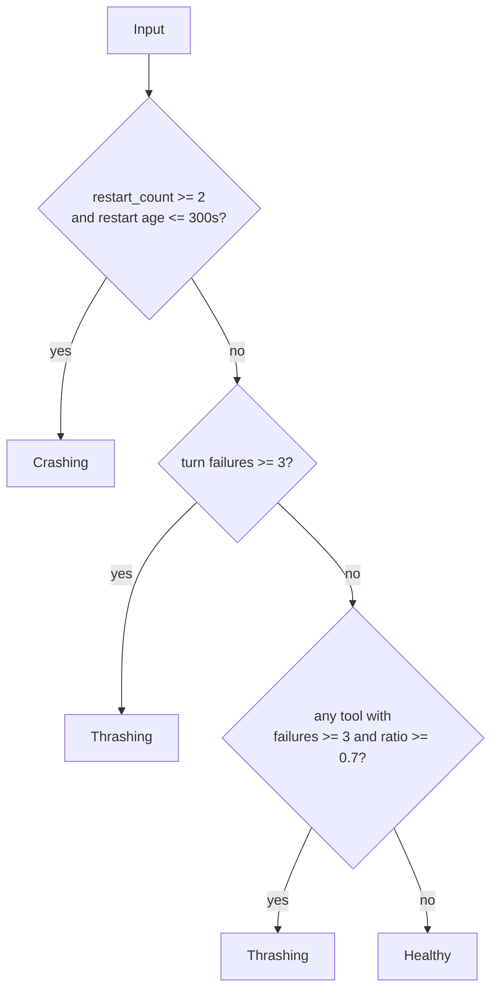

# Keeper Behavioral Regime

## Problem Statement

`Keeper_behavioral_regime` is the 7th FSM axis for keeper behavior. It does not describe where execution is in the mechanical pipeline. It classifies what mode the keeper is observably in right now from a small, pure input record.

This document fixes three things as a stable reference:

1. Regime transition rules and precedence.
2. `tool_aggregate` counting semantics.
3. Snapshot / JSON contract consumed by dashboard surfaces.

## Non-Goals

- This is not provider health or token-budget classification. The module explicitly excludes provider names, token counts, and context bytes.
- This is not the full registry-entry schema. The deriver only accepts the reduced `input` record.
- This is not the future multi-regime design (`Ruminating`, `Avoiding`, `Saturated`, `Echoing`). MVP is only `Crashing`, `Thrashing`, `Healthy`.

## Source Modules

| Module | Role |
|---|---|
| `lib/keeper/keeper_behavioral_regime.mli` | Public contract, threshold constants, JSON shape |
| `lib/keeper/keeper_behavioral_regime.ml` | Pure derivation rules |
| `lib/keeper/keeper_behavioral_regime_observer.ml` | Projects live registry entries into minimal `input` |
| `test/test_keeper_behavioral_regime.ml` | Executable threshold / precedence / JSON evidence |

## Input Contract

The deriver input is intentionally minimal:

```ocaml
type tool_aggregate = {
  count : int;
  failures : int;
}

type input = {
  turn_consecutive_failures : int;
  restart_count : int;
  last_restart_ts : float;
  tool_aggregates : (string * tool_aggregate) list;
}
```

### Input Semantics

- `turn_consecutive_failures`: current streak of failed keeper turns.
- `restart_count`: number of recent restarts considered by the caller.
- `last_restart_ts`: Unix timestamp of the last restart, or `0.0` if there has been no restart.
- `tool_aggregates`: one entry per tool name observed by the caller. Empty means no tool usage yet.

## Regime Set

| Regime | Meaning | Precedence |
|---|---|---|
| `Crashing` | Recent restart instability | 1 |
| `Thrashing` | Repeated failed turns or saturated tool failure ratio | 2 |
| `Healthy` | None of the above | 3 |

Precedence is strict. The derivation is not additive. The first matching rule wins.

## Transition Rules

### 1. Crashing

`Crashing` fires when both conditions hold:

- `restart_count >= 2`
- `now - last_restart_ts <= 300.0`

Reason payload:

- `rule_id = "recent_restart_streak"`
- evidence includes:
  - `restart_count=<n>`
  - `last_restart_age_sec=<age>`

### 2. Thrashing by Turn Failures

`Thrashing` fires when:

- `turn_consecutive_failures >= 3`

Reason payload:

- `rule_id = "turn_fail_streak"`
- evidence includes:
  - `turn_consecutive_failures=<n>`

### 3. Thrashing by Tool Saturation

If no higher-precedence rule fired, `Thrashing` also fires when any tool aggregate satisfies both:

- `failures >= 3`
- `failures / count >= 0.7`

Reason payload:

- `rule_id = "tool_failure_saturation"`
- evidence includes:
  - `tool=<name>`
  - `failures=<failures>/<count>`
  - `ratio=<ratio>`

### 4. Healthy

If none of the above rules fire:

- `regime = Healthy`
- `rule_id = "default_healthy"`
- `evidence = []`

## Transition Diagram



## `tool_aggregate` Semantics

`tool_aggregate` is deliberately small. The behavioral regime deriver only depends on two counters:

- `count`: total attempts recorded for the tool.
- `failures`: failed attempts recorded for the tool.

### Counting Rules

- Ratio is computed as `float failures / float count`.
- If `count <= 0`, ratio is forced to `0.0` rather than throwing or dividing by zero.
- A tool is not considered saturated by ratio alone. It must cross both the count threshold (`>= 3`) and ratio threshold (`>= 0.7`).
- The deriver uses only the first saturated tool in list order to explain the reason payload.

### Consequences

- `2/2` failures does not trip `Thrashing` because the count threshold is not met.
- `5/10` failures does not trip `Thrashing` because the ratio threshold is not met.
- `8/10` failures trips `Thrashing`.

## Snapshot Contract

The derived snapshot is:

```ocaml
type reason = {
  rule_id : string;
  evidence : string list;
}

type snapshot = {
  regime : regime;
  reason : reason;
  updated_at : float;
}
```

### Snapshot Invariants

- `updated_at` is injected by the caller (`derive ~now`) and preserved verbatim.
- `reason.rule_id` must always be populated, including `default_healthy`.
- `reason.evidence` must be human-readable strings, not opaque IDs.
- `Crashing` always beats `Thrashing` when both would match.
- JSON shape is stable and flat.

### JSON Contract

```json
{
  "regime": "thrashing",
  "rule_id": "turn_fail_streak",
  "evidence": ["turn_consecutive_failures=5"],
  "updated_at": 1234567890.0
}
```

Required fields:

- `regime`
- `rule_id`
- `evidence`
- `updated_at`

## Observer Boundary

`keeper_behavioral_regime_observer` is the stateful wrapper. Its job is to:

- project a live registry entry into `input`
- produce per-keeper snapshots
- produce fleet-wide snapshot lists

The observer does not change derivation rules. It only supplies inputs.

## Test-Backed Examples

The current executable tests lock these examples:

- default empty input -> `Healthy`
- `turn_consecutive_failures = 3` -> `Thrashing`
- `restart_count = 2`, restart age `60s` -> `Crashing`
- simultaneous restart streak + turn failure streak -> `Crashing`
- `tool_aggregates = [("read_file", {count=10; failures=8})]` -> `Thrashing`

## Operator Reading Guide

- `Crashing`: restart stability first. Fix lifecycle or transport churn before interpreting failed turns.
- `Thrashing`: the keeper is staying alive but repeatedly failing.
- `Healthy`: absence of regime risk only. It does not imply semantic correctness, CI health, or provider quality.

## Open Questions

- Future regimes (`Ruminating`, `Avoiding`, `Saturated`, `Echoing`) are not specified here.
- If multiple tools saturate at once, only the first one is surfaced today. A richer multi-tool explanation is future work.
