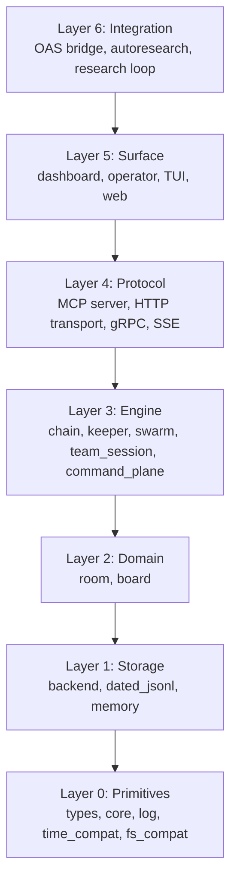

# MASC Specification Index

> Supersedes: `docs/SPEC.md`, `docs/MERGED-ARCHITECTURE-SSOT.md`
> Status: Living draft
> Last Updated: 2026-04-11
> Snapshot baseline: `dune-project` version `0.5.2`

MASC (Multi-Agent Streaming Coordination)는 OCaml 5.x / Eio 기반 MCP 서버로, 여러 AI 에이전트(Claude, Gemini, Codex, 로컬 LLM 등)가 동일 코드베이스에서 동시에 작업할 때 발생하는 조율 문제를 해결한다. Room 기반 세션 관리, Task 할당, Heartbeat 모니터링, Keeper 자율 에이전트, Command Plane 오케스트레이션을 제공하며, MCP JSON-RPC 프로토콜을 통해 모든 주요 AI IDE/CLI와 통합된다.

## Snapshot Metadata

| 항목 | 값 |
|------|-----|
| Release baseline | 0.5.2 |
| Language | OCaml 5.x (Eio-native, effect-based concurrency) |
| LOC (lib, `.ml` + `.mli`) | ~192K |
| LOC (test, `.ml` + `.mli`) | ~97K |
| OCaml modules under `lib/` (`.ml`) | 642 |
| `.mli` interfaces under `lib/` | 176 |
| MCP tool modules (`tool_*.ml`) | 125 |
| Test files (`test/*.ml`) | 346 |
| Executables | 4 (main_eio, main_stdio_eio, masc_cost, masc_tui) |

숫자는 repo snapshot 기준이며 drift 가능하다. 최신 truth는 `dune-project`, `git ls-files`, `rg --files`로 다시 계산한다.

## Layer Diagram

## Specification Files

| File | Title | Description | Status |
|------|-------|-------------|--------|
| `00-glossary.md` | Glossary | 용어 정의, 약어 목록 | Draft |
| `01-system-overview.md` | System Overview | 문제 정의, 배포 모델, 기술 스택, sub-library 의존성 | Draft |
| `02-types-and-invariants.md` | Types and Invariants | 핵심 타입 정의, 상태 전이, 불변식 | Draft |
| `03-room-coordination.md` | Room Coordination | Room 생명주기, session 관리, agent join/leave | Draft |
| `04-chain-engine.md` | Chain Engine | Multi-step chain DSL, execution, snapshot | Draft |
| `05-keeper-agent.md` | Keeper Engine | 자율 에이전트 루프, succession, context 관리 | Draft |
| `06-command-plane.md` | Command Plane v2 | Units, operations, search fabric, detachments, policy, orchestra | Draft |
| `09-server-transport.md` | Server and Transport | HTTP transport, SSE, JSON-RPC dispatch, routing | Draft |
| `10-dashboard.md` | Dashboard | Web UI, API endpoints, SSE real-time updates | Draft |
| `11-board.md` | Board System | Posts, comments, votes, PG/JSONL backend | Draft |
| `12-memory-systems.md` | Memory Systems | Memory bank, institution, procedural, context budget, OAS Memory bridge | Draft |
| `13-oas-integration.md` | OAS Integration | OAS Agent SDK bridge, cascade config, verifier, event bus, boundary rules | Draft |
| `14-configuration.md` | Configuration | env, profile, prompt, runtime 설정 | Draft |
| `15-testing.md` | Testing | 검증 계층, contract suites, fixture/manual 분리 | Draft |
| `A-existing-doc-index.md` | Existing Doc Index | 현재 문서 inventory와 cleanup ledger | Draft |
| `B-migration-targets.md` | Migration Targets | OAS 이관 대상 모듈, deprecation 일정 | Draft |
| `C-implementation-status.md` | Implementation Status | 구현 상태와 coverage snapshot | Draft |

## Active Design Documents

이 spec suite 외에 `docs/design/`와 `docs/rfc/`에 위치한 활성 설계 문서들:

| Document | Description | Related Spec |
|----------|-------------|--------------|
| `docs/ADR-002-DASHBOARD-OPERATOR-CONTROL-SURFACE.md` | Dashboard operator control surface and review queue UX | `10-dashboard.md` |
| `docs/design/keeper-continuity-product-rfc.md` | Keeper continuity contract and promise level | `05-keeper-agent.md` |
| `docs/design/check-evaluation-spec.md` | Deterministic check evaluation for contract verification | `15-testing.md` |
| `docs/design/contract-driven-agent-loop-rfc.md` | Contract-driven agent loop (CDAL) framework | `05-keeper-agent.md` |

## Conventions

### Document Structure

각 spec 파일은 아래 섹션을 따른다:
1. Problem Statement
2. Non-Goals
3. Module Inventory (table)
4. Key Types (OCaml signatures)
5. State Machines (Mermaid)
6. Invariants (INV-{SUBSYSTEM}-NNN)
7. Failure Modes
8. Dependencies (upstream/downstream)
9. Open Questions

### Invariant Naming

`INV-{SUBSYSTEM}-{NNN}` 형식을 사용한다.

| Prefix | Subsystem |
|--------|-----------|
| `INV-ROOM` | Room lifecycle |
| `INV-TASK` | Task state machine |
| `INV-KPR` | Keeper engine |
| `INV-CHAIN` | Chain execution |
| `INV-CP` | Command Plane |
| `INV-SRV` | Server/transport |
| `INV-DASH` | Dashboard |
| `INV-BRD` | Board |
| `INV-CSC` | Cascade |
| `INV-MEM` | Memory |
| `INV-OAS` | OAS Integration |

### Cross-Reference Format

- Spec 간: `./NN-filename.md#section-anchor`
- 코드: `lib/<module_name>.ml:L123`
- Invariant: `INV-ROOM-001`
- 외부 문서: `docs/<document-name>.md`

### Supersession

이 spec suite가 최종 진실 원본(SSOT)이다.

| 이전 문서 | 상태 |
|----------|------|
| `docs/SPEC.md` | Historical snapshot. 이 suite로 대체. |
| `docs/MERGED-ARCHITECTURE-SSOT.md` | Layer map과 canonical paths는 `01-system-overview.md`로 이관. |
| `docs/GLOSSARY.md` | `00-glossary.md`로 통합. |
