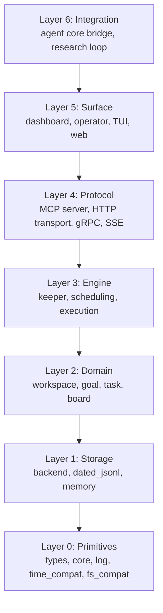

# MASC Specification Index

> Supersedes: `docs/SPEC.md`, `docs/MERGED-ARCHITECTURE-SSOT.md`
> Status: Living draft
> Last Updated: 2026-08-30
> Snapshot baseline: `dune-project` version `0.28.0`

MASC (Multi-Agent Shared Context)는 OCaml 5.x / Eio 기반 MCP 서버로, 여러 Keeper/MCP client가 동일 workspace에서 Goal, Task, Board, Schedule을 통해 작업하고 현재 실행 상태를 관찰·조정할 수 있게 한다. Keeper turn과 dashboard/operator visibility를 제공하며 MCP JSON-RPC 프로토콜을 통해 주요 AI IDE/CLI와 통합된다.

## Snapshot Metadata

The version line above is current as of the last doc touch. The size/count rows
below are an older inventory snapshot and should be recalculated before being
used as evidence.

| 항목 | 값 |
|------|-----|
| Release baseline | 0.19.54 |
| Language | OCaml 5.x (Eio-native, effect-based concurrency) |
| LOC (lib, `.ml` + `.mli`) | ~248K |
| LOC (test, `.ml` + `.mli`) | ~155K |
| OCaml modules under `lib/` (`.ml`) | 713 |
| `.mli` interfaces under `lib/` | 401 |
| MCP tool modules (`tool_*.ml`) | 109 |
| Test files (`test/*.ml`) | 449 |
| Executables | 6 public (`masc`, `masc-stdio`, `masc-cost`, `masc-trace`, `masc-tui`, `masc-fusion-run`) + 3 internal (`public_tool_manifest`, `gen_tool_descriptors`, `deployment_preflight_helper`) |

숫자는 2026-04-23 repo snapshot 기준. `rg --files lib/ test/ bin/` 및 `wc -l`로 재계산. 최신 truth는 다시 계산해야 한다.

## Layer Diagram

```mermaid
graph TB
    L6["Layer 6: Integration<br/>agent core bridge, research loop"]
    L5["Layer 5: Surface<br/>dashboard, operator, TUI, web"]
    L4["Layer 4: Protocol<br/>MCP server, HTTP transport, gRPC, SSE"]
    L3["Layer 3: Engine<br/>keeper, scheduling, execution"]
    L2["Layer 2: Domain<br/>workspace, goal, task, board"]
    L1["Layer 1: Storage<br/>backend, dated_jsonl, memory"]
    L0["Layer 0: Primitives<br/>types, core, log, time_compat, fs_compat"]

    L6 --> L5
    L5 --> L4
    L4 --> L3
    L3 --> L2
    L2 --> L1
    L1 --> L0
```

## Specification Files

| File | Title | Description | Status |
|------|-------|-------------|--------|
| `00-glossary.md` | Glossary | 용어 정의, 약어 목록 | Draft |
| `01-system-overview.md` | System Overview | 문제 정의, 배포 모델, 기술 스택, sub-library 의존성 | Draft |
| `02-types-and-invariants.md` | Types and Invariants | 핵심 타입 정의, 상태 전이, 불변식 | Draft |
| `03-workspace-state collaboration.md` | Workspace State | Workspace 생명주기, session 관리, agent join/leave | Draft |
| `04-turn-lifecycle.md` | Turn Lifecycle | Keeper turn 시작/종료, heartbeat/polling/waiting, direct msg, FSM, receipt | Draft |
| `05-keeper-agent.md` | Keeper Engine | 자율 에이전트 루프, succession, context 관리 | Draft |
| `09-server-transport.md` | Server and Transport | HTTP transport, SSE, JSON-RPC dispatch, routing | Draft |
| `10-dashboard.md` | Dashboard | Web UI, API endpoints, SSE real-time updates | Draft |
| `11-board.md` | Board System | Posts, comments, votes, filesystem/JSONL backend | Draft |
| `12-memory-systems.md` | Memory Systems | Memory OS fact store, context budget | Draft |
| `13-agent-core-integration.md` | agent core Integration | agent core Agent SDK bridge, runtime config, completion authority/evaluator, event bus, boundary rules | Draft |
| `14-configuration.md` | Configuration | env, profile, prompt, runtime 설정 | Draft |
| `15-testing.md` | Testing | 검증 계층, contract suites, fixture/manual 분리 | Draft |
| `16-root-cause-rubric.md` | Root-Cause Rubric | Markers behind the `root/*` values declared in a `masc-triage` block | Reference |
| `17-keeper-behavioral-regime.md` | Keeper Behavioral Regime | 7th FSM axis rules, `tool_aggregate` semantics, snapshot invariants | Reference |
| `18-log-severity-taxonomy.md` | Log Severity Taxonomy | 4-level contract for `Log.{debug,info,warn,error}` callsites + anti-pattern catalog + lint rules | Reference |

## Active Design Documents

이 spec suite 외에 `docs/design/`와 `docs/rfc/`에 위치한 활성 설계 문서들:

| Document | Description | Related Spec |
|----------|-------------|--------------|
| `docs/design/checkpoint-truth-and-replay-rfc.md` | Checkpoint truth hierarchy, replay semantics, side-effect boundary | `13-agent-core-integration.md` |
| `docs/KEEPER-STATE-OWNERSHIP.md` | Keeper lane, checkpoint, domain state, and receipt ownership | `05-keeper-agent.md`, `13-agent-core-integration.md` |

## Conventions

### Document Structure

각 spec 파일은 아래 섹션을 따른다:
1. Problem Statement
2. Non-Goals
3. Module Inventory (table)
4. Key Types (OCaml signatures)
5. State Machines (Mermaid)
6. Invariants (INV-{SUBSYSTEM}-NNN)
7. Failure Modes
8. Dependencies (upstream/downstream)
9. Open Questions

### Invariant Naming

`INV-{SUBSYSTEM}-{NNN}` 형식을 사용한다.

| Prefix | Subsystem |
|--------|-----------|
| `INV-WORKSPACE` | Workspace lifecycle |
| `INV-TASK` | Task state machine |
| `INV-KPR` | Keeper engine |
| `INV-SRV` | Server/transport |
| `INV-DASH` | Dashboard |
| `INV-BRD` | Board |
| `INV-CSC` | Runtime |
| `INV-MEM` | Memory |
| `INV-agent core` | agent core Integration |

### Cross-Reference Format

- Spec 간: `./NN-filename.md#section-anchor`
- 코드: `lib/<module_name>.ml:L123`
- Invariant: `INV-WORKSPACE-001`
- 외부 문서: `docs/<document-name>.md`

### SSOT

이 spec suite가 최종 진실 원본이다.
