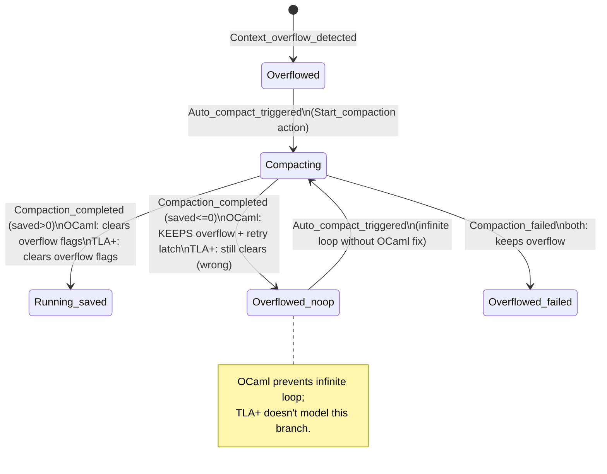

# KSM `Compaction_completed` Divergence Audit (2026-05-12)

**Spec**: `specs/keeper-state-machine/KeeperStateMachine.tla` (`CompactionCompleted` action)
**OCaml**: `lib/keeper/keeper_state_machine.ml` (lines 559-588, `update_conditions` for `Compaction_completed`)
**Iteration**: 7 (Phase A-5 잔여, `/loop` plan)
**Cross-ref**: Iter 4 #14707 (KNOWN_FAILURES skip), Iter 6 #14720 (first real semantic drift fix), GitHub #9988, #9935, #8710.

## TL;DR

OCaml `Compaction_completed`이 *조건부*로 overflow 플래그를 클리어 (`saved_tokens > 0`에서만)하지만 TLA+ `CompactionCompleted`는 *무조건* 클리어. OCaml은 production *#9935 noop-loop bug* 차단을 위해 의도적으로 conditional 도입 (#9988); TLA+ spec이 이 reality 모델링 못 함.

이 divergence는 *OCaml이 옳고 spec이 미흡*. 동시에 #8710 (`CompactionClearsOverflow` invariant fail → KeeperStateMachine `KNOWN_FAILURES` 등록)의 동일 root cause — invariant가 saved_tokens 기반 분기를 표현 못 함.

audit memo only. spec split 제안 (RFC 후보) + #8710 해결 경로 명시.

## Side-by-side

### TLA+ `CompactionCompleted` (단일 action, unconditional)

```tla
CompactionCompleted ==
    /\ NotTerminal /\ compaction_active
    /\ compaction_active' = FALSE
    /\ context_overflow' = FALSE
    /\ compact_retry_exhausted' = FALSE
    /\ UNCHANGED <<...>>
```

### OCaml `Compaction_completed` (조건부)

```ocaml
| Compaction_completed { before_tokens; after_tokens } ->
    let saved_tokens = before_tokens - after_tokens in
    if saved_tokens > 0
    then
      { c with
        compaction_active = false
      ; context_overflow = false
      ; compact_retry_exhausted = false
      }
    else (
      Log.Keeper.warn
        "[fsm] compaction_completed with no savings (before=%d after=%d); keeping
         context_overflow=true to avoid noop re-trigger loop"
        before_tokens after_tokens;
      { c with compaction_active = false })
```

OCaml 주석 (line 560-573, #9988 핵심):
> "completed" alone does not mean the overflow was resolved.
> In production 98.4% of [Compaction_completed] events arrive with [before_tokens = after_tokens] because the checkpoint reducers produced no savings...
> Clearing [context_overflow] unconditionally created an infinite loop with [Context_overflow_detected]: the next turn re-measures the same context, re-fires overflow, re-attempts a noop compaction, and clears the flag again. #9935 observed 45-71 imminent events/day with zero observable reduction action.

## Mermaid



## #8710 cross-reference

`CompactionClearsOverflow` invariant (spec line 532-537):
```
CompactionClearsOverflow ==
    [][CompactionCompleted => context_overflow' = FALSE /\ ...]
```

이 invariant는 *모든* `CompactionCompleted` action이 context_overflow를 clear한다고 주장. OCaml의 saved_tokens=0 noop path를 따르면 위반.

→ specs/Makefile의 `KNOWN_FAILURES ?= ... KeeperStateMachine`. 30+ PR 동안 spec 전체 CI skip. iter 4 #14707의 새 properties (ZombieIsForever, ZombieRequiresTerminalFailureLatched)도 active verify 안 됨.

## Findings

### F-7.1 (HIGH risk strategic): spec missing two-arm CompactionCompleted

TLA+가 OCaml의 saved_tokens 분기를 표현 못 해 #8710 invariant 충돌 + spec 전체 KNOWN_FAILURES skip.

**Suggested fix (RFC 후보, follows iter 4 R-A-8)**:
```tla
CompactionCompletedWithSavings ==
    /\ NotTerminal /\ compaction_active
    /\ compaction_active' = FALSE
    /\ context_overflow' = FALSE
    /\ compact_retry_exhausted' = FALSE
    /\ UNCHANGED <<...>>

CompactionCompletedNoSavings ==
    /\ NotTerminal /\ compaction_active
    /\ compaction_active' = FALSE
    \* context_overflow / compact_retry_exhausted UNCHANGED — reality of #9988
    /\ UNCHANGED <<context_overflow, compact_retry_exhausted, ...>>

Next == ... \/ CompactionCompletedWithSavings \/ CompactionCompletedNoSavings \/ ...
```

`CompactionClearsOverflow` invariant도 같이 update:
```tla
CompactionClearsOverflow ==
    [][CompactionCompletedWithSavings =>
       context_overflow' = FALSE /\ compact_retry_exhausted' = FALSE]
```

분할 후 `make check-clean` 실행 시 (a) 새 invariant 통과, (b) spec을 KNOWN_FAILURES에서 제거 가능, (c) iter 4의 ZombieIsForever 등도 active verify 시작.

### F-7.2 (MID risk doc): #9988 root cause는 코드뿐, spec에 흔적 0

OCaml line 560-573 주석이 #9988/#9935 production incident를 명시하지만 TLA+에는 이 reality (98.4% noop) 어떤 자취도 없음. spec reader가 *왜* CompactionCompleted를 분할해야 하는지 알 수 없음.

**Suggested fix (F-7.1 spec split에 동반)**:
- TLA+ 주석 추가: production-grounded design note (`#9935`/`#9988` 인용)
- `docs/tla-audit/` audit memo (이 파일)에서 cross-link

### F-7.3 (LOW risk operational): `Log.Keeper.warn`의 string formatting

OCaml line 583-587의 warn 메시지가 `Printf.sprintf`-style — `before_tokens` / `after_tokens`만 변수. 일관성 측면 OK. 단 prometheus counter (e.g., `keeper_compaction_noop_total`) 부재 → 운영자가 *시간당 발화 빈도*를 grafana로 못 봄. iter 5 PR #14713의 telemetry-as-fix 거부 기준에 닿음 — 이건 *기존 warn 보강*이지 *fix 자체*는 아니므로 OK. counter 추가는 별도 PR.

## Verification

- [x] TLA+ `CompactionCompleted` 본문 cross-check (specs/.../KeeperStateMachine.tla §CompactionCompleted)
- [x] OCaml `Compaction_completed` 본문 cross-check (lib/keeper/keeper_state_machine.ml:559-588)
- [x] #8710 dependency 확인 (specs/Makefile:60 KeeperStateMachine in KNOWN_FAILURES)
- [x] iter 4 #14707 ZombieIsForever / ZombieRequiresTerminalFailureLatched가 #8710 해결 대기 중임 확인 (PR body §"KNOWN limitation")

## Trade-off

- **단점**: 본 PR 코드/스펙 0건 변경. F-7.1 fix (spec split)는 10분 budget 초과 + TLC re-verify 필요 + #8710의 invariant 동시 update 필요 → 별도 RFC.
- **장점**: 6 iteration 만에 spec coverage gap의 *진짜 root cause* (#8710과 동일) 식별. 누적된 KNOWN_FAILURES 등록 *왜 일어났는지* 명문화. iter 4-6의 follow-up과 통합.

## RFC

`RFC-WAIVED: audit-only memo. F-7.1 (spec split for CompactionCompleted) is a separate RFC candidate that addresses #8710 + iter 4 R-A-8 simultaneously. F-7.2 doc note will accompany that RFC.`

## 진행 추적

다음 iteration: **Phase A-5 잔여 (계속)** — Context_overflow_detected / Operator_clear_requested / Auto_compact_triggered conditional 분기 검증. 또는 **R-A-8 본격 fix** (CompactionCompleted spec split + #8710 invariant fix + KNOWN_FAILURES 제거).

R-A-8 fix는 6-8 iteration 더 걸릴 가능성 (TLA+ split + invariant update + TLC re-verify + 의존 spec property들 active verify 확인). 점진 진행 가능.
