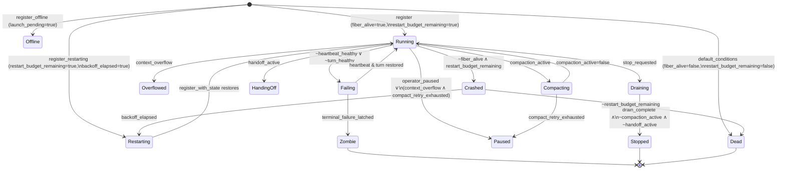
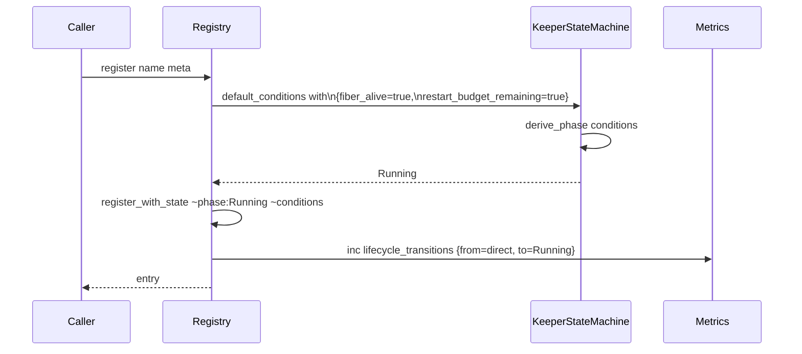

# KSM Init Mapping Audit (2026-05-12)

**Spec**: `specs/keeper-state-machine/KeeperStateMachine.tla` (lines 19-100, VARIABLES + Init)
**OCaml**: `lib/keeper/keeper_state_machine.ml` (lines 56-100, conditions/default_conditions) + `lib/keeper/keeper_registry.ml` (lines 750-775, register*)
**Iteration**: 1 (Phase A-1, `/loop` plan `.claude/plans/breezy-napping-sketch.md`)

## TL;DR

세 가지 spec coverage gap 발견. 둘은 OCaml ↔ TLA+ 비대칭(코드 우위), 하나는 OCaml 내부 명명 모호함. 모두 *런타임 버그가 아닌* refinement gap. 후속 RFC 후보로 적재 — 본 PR은 audit memo only.

## State Diagram: KSM Init → 12 phases

> TLA+ `Init` only models the `[*] --> Running` arrow. OCaml has 4 startup paths (register, register_offline, register_restarting, plus default_conditions → Dead sentinel).

## Field-by-field comparison

| Variable | TLA+ Init (line 82-100) | OCaml `default_conditions` | OCaml `register` overlay |
|---|---|---|---|
| `launch_pending` | FALSE | false | (unchanged) false |
| `fiber_alive` | TRUE | **false** ← Dead-state sentinel | true |
| `heartbeat_healthy` | TRUE | true | true |
| `turn_healthy` | TRUE | true | true |
| `context_within_budget` | TRUE | true | true |
| `context_handoff_needed` | FALSE | false | false |
| `compaction_active` | FALSE | false | false |
| `handoff_active` | FALSE | false | false |
| `operator_paused` | FALSE | false | false |
| `stop_requested` | FALSE | false | false |
| `restart_budget_remaining` | TRUE | **false** ← Dead-state sentinel | true |
| `backoff_elapsed` | FALSE | false | false |
| `guardrail_triggered` | FALSE | false | false |
| `drain_complete` | FALSE | false | false |
| `context_overflow` | FALSE | false | false |
| `compact_retry_exhausted` | FALSE | false | false |
| `restart_count` | 0 | (in entry, not conditions) | 0 |
| `terminal_failure_latched` | FALSE | false | false |
| **`credential_archived`** | **(absent)** | false | false |
| **`zombie_timeout_reached`** | **(absent)** | false | false |

Verification: `register` overlay reconstructs TLA+ `Init` faithfully (all overlay diffs match).

## Findings

### Gap-1 (LOW risk, naming clarity)
`Keeper_state_machine.default_conditions`는 의미상 *Dead state* (test 주석 `test/test_keeper_state_machine.ml:50`: `default_conditions: fiber_alive=false, restart_budget_remaining=false -> Dead`). "default"라는 이름이 *"이 record로 시작하면 Dead가 된다"* 라는 핵심 사실을 가림. `register` 매번 두 필드를 overlay하는 호출 패턴이 같은 의도를 매번 다시 적음.

**Root cause**: OCaml의 record field-overlay 패턴을 spec semantics 없이 *bare default* 로 노출.

**Possible fix (다음 PR 후보)**: `default_conditions` 그대로 두고 `init_conditions_running`, `init_conditions_offline`, `init_conditions_restarting` 명명 helper 추가 (registry 호출자가 사용). 또는 `default_conditions`를 private으로 좁히고 위 3개만 export.

### Gap-2 (MID risk, spec under-models startup paths)
OCaml은 4 가지 시작 경로:
| 함수 | derive_phase 결과 | TLA+ Init에 해당? |
|---|---|---|
| `register` | Running | ✅ (모델링) |
| `register_offline` | Offline | ❌ |
| `register_restarting` | Restarting | ❌ |
| (`default_conditions` 직접 사용) | Dead | ❌ (terminal 도달, but spec은 terminal를 Init에서 모델링하지 않음) |

TLA+ `Init`이 single live keeper만 모델링하면, "offline launch", "warm-restart from snapshot" 시나리오의 invariant가 검증되지 않음. 예: `register_offline` 후 `Manual_resume` 처리 경로가 spec coverage 밖.

**Possible fix (RFC 후보)**: TLA+ `Init` 을 disjunction으로 확장: `InitRunning \/ InitOffline \/ InitRestarting`. 또는 *startup invariant* 별도 정의 (`StartPhaseInvariant: phase ∈ {Running, Offline, Restarting, Dead}`). 모든 temporal property 재검증 필요 (TLC 시간 비용 ~5-15분 per spec).

### Gap-3 (MID risk, OCaml conditions superset)
OCaml `conditions` record는 18 + 2 = **19 booleans** (TLA+: 18 VARIABLES).
- `credential_archived` — 2025-?? 추가, credential archival pipeline용으로 보임 (호출처 grep 필요).
- `zombie_timeout_reached` — Zombie phase의 timeout 측면 모델링용으로 보임.

이 둘이 TLA+ VARIABLES에 부재 → spec이 OCaml 모델의 *abstraction* 임을 명시하지 않으면 *refinement violation*. 즉 OCaml이 spec과 *다른 정보*를 가지고 다른 transition을 trigger할 수 있는데 spec은 이 transition을 검증하지 못함.

**Possible fix (RFC 후보)**: 두 condition을 TLA+ VARIABLES에 추가하고 derive_phase priority chain에 어떻게 영향 주는지 명시. 또는 `credential_archived` / `zombie_timeout_reached`를 *observable only*로 strict하게 격리 (phase derive에 절대 안 쓰는 invariant 추가) + OCaml 측에 같은 격리 lint 추가.

## Mermaid sequence: register → Running

## Verification

- [x] 18 TLA+ VARIABLES vs 19 OCaml fields — diff 확정.
- [x] `register` overlay → TLA+ Init isomorphism — 1:1 일치.
- [x] test/test_keeper_state_machine.ml:50 주석으로 `default_conditions → Dead` 의도 확인.
- [ ] `credential_archived`/`zombie_timeout_reached` 변경 시 phase 영향 — 후속 iteration에서 검증.
- [ ] TLA+ spec extension (Gap-2, Gap-3) — RFC 후보, 본 PR 범위 밖.

## Trade-off

본 PR은 spec/OCaml 변경 0건. *"발견했지만 다음 iteration에 미루기로"* 한 항목 둘:
1. `init_conditions_*` helper 도입 (Gap-1 fix) → A-1.b iteration.
2. TLA+ Init disjunction 확장 (Gap-2) → RFC 후보.

Audit-only 결정 근거: 본 변경(특히 TLA+ Init 확장)이 코드 컴파일/스펙 PR 양쪽에서 10분 budget 초과 위험. 누적 효과로 main FSM 정교화는 후속 iteration이 담당.

## RFC 참조

`RFC-WAIVED: audit-only memo, no code change. Subsystem subset (lib/keeper/) but no surface modification.`

## 진행 추적

- 다음 iteration: Phase **A-2** (`entry_actions_for` line 748 catch-all `_ -> []` exhaustive 변환).
- 다음 iteration의 spec 영역: `specs/keeper-state-machine/KeeperStateMachine.tla` 의 entry actions 또는 lifecycle event matrix (현재 spec 명시 없음 — OCaml-only fix 가능성 높음).
- Phase A-1 follow-up RFC 후보 2건 (Gap-2 Init 확장, Gap-3 superset condition) → `memory/project_fsm_tla_loop_progress.md`에 등록.
