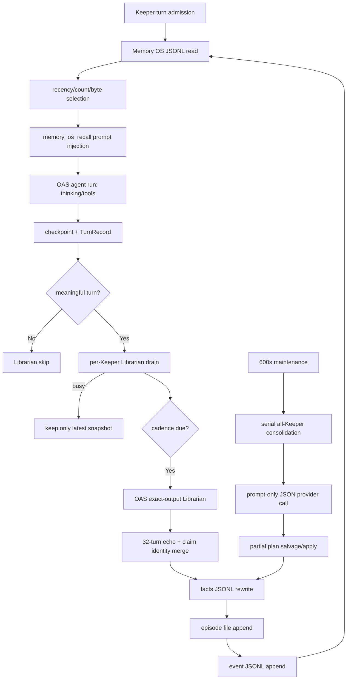

# MASC Librarian / Memory OS 적대적 감사 보고서

작성일: 2026-07-30

대상 저장소: `/Users/dancer/me/workspace/yousleepwhen/masc`

라이브 상태 루트: `/Users/dancer/me/.masc`
판정: **BLOCK / NO-GO**

## 1. Executive Summary

Librarian과 Memory OS는 라이브 런타임에서 실제로 동작한다.

- Keeper turn마다 `memory_os_recall` 블록이 prompt에 주입된다.
- post-turn Librarian이 episode와 fact를 기록한다.
- merge 전 runtime에서는 periodic consolidation이 실제 store를 축소했다.
- 일부 Keeper가 recovering이어도 다른 Keeper의 turn은 계속 진행한다.

> 2026-07-30 15:25 KST 갱신: periodic consolidation 삭제 PR #26324는
> `a8683ea2ccc26c168664e114dbc0b01b8e1ed770`으로 merge됐다. 아래 runtime
> 관측은 merge 전 배포의 역사 증거이며, 현재 source가 배포됐다는 증거가 아니다.

그러나 현재 구현을 production-correct로 승인할 수 없다. 사용자 계약을 기준으로
**P0 9개, P1 7개**가 확인됐다.

후속 current-only worktree는 dead Store와 Memory `claim_kind`/persisted
`schema_version`/episode 사망 field를 삭제하고, 모든 public Memory reader,
exact journal과 dashboard wire/health decoder를 fail-closed로 강화했다. 최근 prompt
slice의 `source_turn=0`을 원본 전체 메시지 0번과 잘못 대조하던 내부 snapshot
불일치는 수정했지만, 저장되는 provenance는 여전히 prompt-local turn과 current
trace를 사용하므로 canonical TurnRef가 아니다. 파일 I/O는 production entrypoint마다
`config.base_path`에서 한 번 해석한 `keepers_dir`로 통일하고
`episode-bundle → facts` 락 순서를 적용했다. 두 번째 hard-cut은
`valid_for_days`/`valid_until`/`Ephemeral`, expiry GC·sanity sweep·maintenance
fiber와 dashboard TTL projection까지 삭제했다. retired TTL 입력과 persisted field는
closed decoder가 명시적으로 거부한다. 이 개선은 아직 새 PR CI·배포·fresh-state
cutover가 증명되지 않았고, canonical TurnRef·recency selection·latest-wins·
echo/dedupe 휴리스틱·비원자 publication이 남으므로 최종 판정은 계속 NO-GO다.

가장 중요한 차단 사유는 다음과 같다.

1. 사용되지 않는 canonical store와 실제 JSONL store가 병존한다.
2. schema migration과 legacy row 수용 코드가 명시적으로 존재한다.
3. 동일 TurnRef가 서로 다른 context를 가리키며 user input에는 TurnRef가 없다.
4. 손상된 fact row가 recall/search/dashboard에서 무음으로 사라진다.
5. recall과 search가 recency, byte budget, substring, 고정 window로 의미를 결정한다.
6. consolidation이 부분 파싱된 모델 출력을 사용해 거의 전체 memory를 삭제할 수 있다.
7. `claim_kind`, `valid_until`과 여러 episode field가 context에는 기여하지 않으면서
   Gate·expiry·merge authority로 동작한다.
8. `park`/`lease`가 별도 lifecycle 개념으로 증식해 waiting chat이 autonomous Keeper를
   종료시키고, Turn attempt identity와 중복되는 authority를 만든다.
9. `settlement`가 canonical terminal request 위에 두 번째 projection contract를 만든다.

따라서 새 Gate나 retrieval 기능을 추가하기 전에 다음 순서로 기반을 바로잡아야 한다.

`Fresh-state persistence SSOT → Turn identity SSOT → per-Keeper durable Librarian FIFO
→ atomic revision/failure contract → semantic context projection`

## 2. 감사 범위와 증거 계층

### 2.1 Source

- 집중 정적 감사 SHA:
  `8c4dae264e6b1d03708029718f868efbb3c2613b`
- 2026-07-30 16:17 KST current `origin/main` 및 rebase base:
  `407ae5bb92509f06bfb6fc5614e8539e230b2902`
- 후속 구현 branch:
  `refactor/memory-current-only-hard-cut-20260730`
- current-only 1차 source slice:
  `6f8bf76a816d822ca0165b6a8c42986b3d466e5c`
- TTL authority 제거 2차 source slice:
  `b9c338da4d4230ae05783090d5c32727312b5d99`
- 닫힌 PR #26436의 remote head는 1차 slice 뒤 deterministic fix
  `6a5d575629a12bac12bc9c6758ba2dc3a561e14c`로 갈라져 있다. 같은 fix는 2차
  slice에도 이미 포함되어 있으므로 닫힌 branch를 merge/reopen하지 않고 새 branch와
  Draft PR로 증명한다. 어느 slice도 main/CI/runtime 상태로 간주하지 않는다.

### 2.2 Runtime

- PID: `25820`
- listener: `127.0.0.1:8935`
- command base path: `/Users/dancer/me`
- canonical runtime state root: `/Users/dancer/me/.masc`
- `/health?full=1`의 startup repo HEAD: `8c4dae264e`
- release version: `0.21.2`
- executable:
  `/Users/dancer/me/workspace/yousleepwhen/masc/_build/default/bin/main_eio.exe`

`health.build.commit_source=runtime_repo_head`이므로 이 값은 binary-embedded commit
증거가 아니다. 실행 시작 시 repo HEAD와 binary mtime은 일치하지만 정확한 deployed
binary SHA는 미증명으로 남긴다.

### 2.3 CI / 변경

- 최초 감사에서는 코드 수정이나 runtime mutation을 하지 않았다.
- 후속 구현 worktree에서는 dead Store, Memory `claim_kind`, persisted
  `schema_version`, serialization-only episode fields를 제거했다. strict reader,
  current-only exact journal, explicit BasePath I/O, current-only dashboard/health
  decoder도 추가했다. 2차 slice는 61 files, +372/-4,077로 TTL producer/schema/
  persistence/recall/GC/maintenance/dashboard를 함께 제거했다. prompt/validator는 동일
  immutable snapshot을 보지만 canonical TurnRef provenance는 아직 구현하지 않았다.
  live runtime은 수정하지 않았다.
- 로컬 Dune build는 실행하지 않았다. OCaml type/build 권위는 PR CI로 남아 있다.
- 변경 후 현존 OCaml 전체 `ocamlformat --check`와 parse-only 검증,
  `scripts/ci/check-determinism-contract.sh`, `git diff --check`,
  `scripts/check-doc-code-refs.sh`는 통과했다.
- dashboard `tsc --noEmit`과 focused Vitest 7 files / 255 tests,
  Python judge eval 24 tests, Ruff, Pyright는 통과했다.
- `scripts/ci_verify_linked_modules.sh`는 worktree에 CI build artifact가 없어 실행할 수
  없었다. 이를 위해 로컬 Dune build를 하지 않으며 새 PR CI에서 증명한다.
- source, CI, merge, deployment, runtime 증거를 서로 분리했다.

## 3. 현재 Open PR과의 관계

확인 시각: 2026-07-30 16:05 KST

| PR | 관련도 | 현재 상태 | 보고서 findings에 대한 효과 | 판정 |
|---|---|---|---|---|
| [#26324](https://github.com/jeong-sik/masc/pull/26324) `remove periodic full-store consolidation` | 직접 관련 | **Merged**, head `5adc5e7759f83143d12c3170db1835800f3601eb`, merge commit `a8683ea2ccc26c168664e114dbc0b01b8e1ed770` | periodic destructive consolidation 전체를 삭제했다. Librarian input의 ignored `schema_version`, unknown category, retired `kind` decoder 일부도 제거했다. | **P0-6 직접 해결. 나머지 P0/P1은 미해결** |
| [#26410](https://github.com/jeong-sik/masc/pull/26410) `park chat before claiming receipt` | 직접 재검토 필요 | **Merged**, head `bde47167ea442db9e91b91a61c27832d66485e10`, 2026-07-30 16:03 KST merge | lease-before-admission을 줄이고 pending receipt를 admission 뒤 claim하는 ordering은 개선한다. 그러나 `park`를 공식 흐름으로 만들고 별도 `lease_id` lifecycle을 유지한다. | **merge됐어도 숙청 기준과 충돌. TurnRef/AttemptId 단일 FSM으로 재구성 필요** |
| [#26428](https://github.com/jeong-sik/masc/pull/26428) `make current memory and provider input observable` | 직접 충돌 | **Draft**, head `508d77896e12f26652950d68c040830e0cb34691`, `MERGEABLE/BLOCKED`, `status:do-not-merge`, `reviewed:adversarial-non-pass` | immutable current snapshot/CAS와 provider-input observability 방향은 유효하다. 그러나 current head에도 TTL/`claim_kind`/dead episode fields/latest-wins/cadence/prompt-local provenance가 그대로다. | **전체 채택 금지. atomic snapshot/관측성만 분리 재구성** |
| [#26435](https://github.com/jeong-sik/masc/pull/26435) `collapse compaction commit onto source CAS` | 직접 인접 | **Merged**, head `5866b26c14b91088349d21033a884ab6f1c65136`, merge commit `07a3d4f19d1f0c9563be01b8b6f8b4c90da14841`; exact-head `Build and Test`/`CI Gate`는 merge 뒤 취소 | compaction terminal projection을 source CAS에 접어 settlement 중복 authority를 줄인다. | **exact-head full CI green 없이 admin merge. Memory facts→episode→event publication/TurnRef/FIFO는 해결하지 않음** |
| [#26440](https://github.com/jeong-sik/masc/pull/26440) `hard-cut retired Memory OS authority` | 본 감사 후속 구현 | **Draft**, branch `refactor/memory-current-only-hard-cut-20260730`, current `origin/main` rebase 뒤 `MERGEABLE/BLOCKED`; CI 생성 대기 | 1·2차 hard-cut과 본 보고서, wire v2/dead facade 보완을 함께 검증한다. | **cold cutover·CI·runtime 증명 전 do-not-merge** |
| [#26436](https://github.com/jeong-sik/masc/pull/26436) `enforce current-only Memory OS contracts` | 본 감사 1차 구현 | **Closed**, head `1c4692b806dd34e948afa99ea34d627092e880cc`, `status:do-not-merge`, `reviewed:adversarial-non-pass` | 1차 hard-cut의 CI Meta Guard 문제는 local 2차 slice에서 수정됐고 TTL authority도 추가 삭제했다. | **reopen 금지. 새 exact-head Draft PR로 다시 증명** |
| [#26389](https://github.com/jeong-sik/masc/pull/26389) `separate Keeper context from turn usage` | 원칙상 인접 | **Merged**, head `bc4ab6d0fde691a4c43e588d549b4a3389e5d31e`, merge commit `407ae5bb92509f06bfb6fc5614e8539e230b2902` | producer 없는 context 추정과 legacy metric surface를 제거한다. | Memory OS persistence/context flow의 직접 수정은 아님 |
| [#26392](https://github.com/jeong-sik/masc/pull/26392) `cost ledger exact runtime identity` | 원칙상 인접 | **Merged**, head `a332706ec04f49d8ac03e5de684dcf0e11003e3d`, merge commit `e19a05f6ca926eed0de054bd1371ae6f34a075e2` | timestamp/token heuristic 대신 exact identity를 사용한다. | 좋은 선례지만 Memory Turn identity는 수정하지 않음 |

### 3.1 PR #26324가 해결하는 부분

현재 exact-head patch에서 확인한 직접 개선:

- `keeper_memory_os_consolidation_runtime.ml` 전체 삭제
- 600초 fleet-wide serial consolidation fiber 삭제
- partial consolidation plan parsing/apply 경로 삭제
- consolidation runtime/env/dashboard surface 삭제
- Librarian provider 응답에서 ignored `schema_version` 수용 제거
- unknown category와 duplicate/unknown JSON field fail-closed 강화
- retired `kind` argument compatibility rejection surface 일부 삭제

따라서 본 보고서의 **P0-6 destructive consolidation**은 #26324 merge로 제거됐다.

### 3.2 PR #26324가 해결하지 않는 부분

merge된 main에 그대로 남는 항목:

- `Keeper_memory_os_store`와 JSONL store의 이중 authority
- persisted record의 `schema_version`
- `Persisted_claim_kind_absent` legacy row 수용
- optional `claim_kind`
- 사용되지 않는 `MASC_KEEPER_MEMORY_OS_LIBRARIAN_GLOBAL_SLOT`
- lenient `read_facts_all`의 malformed-row `filter_map`
- 500/500/65,536-byte recall truncation
- recency selection
- 32-turn recall echo window
- cadence/message-window/inert-turn skip
- substring search와 first-100-byte dedupe
- Librarian `Replace_latest` coalescing
- TurnRef 중복과 null user TurnRef
- facts → episode → event 비원자 publication
- spatial namespace/ACL 부재

후속 audit worktree는 이 목록 중 dead `Keeper_memory_os_store`, Memory
`claim_kind`, persisted Memory `schema_version`, serialization-only episode fields,
global slot facade, lenient reader뿐 아니라 `valid_for_days`/`valid_until`/`Ephemeral`,
expiry GC·sanity sweep·maintenance·TTL dashboard를 삭제했다. retired row/field는
current decoder가 명시적으로 거부한다. 이는 아직 main/CI/runtime 증거가 아니며,
recall budget/recency, echo/dedupe, latest-wins, production Memory authority·atomic
receipt·Turn identity 문제는 그대로 남는다.

### 3.3 PR #26410의 정확한 경계

#26410은 다음 측면에서 유용하다.

- chat/autonomous admission authority를 turn mutex 하나로 축소
- lease보다 admission을 먼저 확정
- exact FIFO head receipt를 admission 이후 claim
- exact claim 이후 cancellation을 typed terminal outcome으로 처리

하지만 changed-file 목록에 다음 핵심 파일이 없다.

- `keeper_turn_record_writer.ml`
- `keeper_chat_store.ml`
- `keeper_memory_lane.ml`
- `keeper_librarian_runtime.ml`
- `keeper_memory_os_*`

따라서 본 보고서의 TurnRef SSOT와 Librarian loss 문제를 #26410이 해결한다고
간주하면 안 된다.

추가 숙청 기준으로 보면 더 근본적인 문제가 있다.

- `park`는 별도 OCaml variant가 아니라 Eio mutex 대기를 설명하는 서술어지만,
  `chat_waiting`을 model runtime exit condition으로 승격한다.
- 실제 stop reason인 `Yielded_to_chat_waiting`이 autonomous Keeper run을 종료한다.
- queue receipt에는 stable `Receipt_id`가 있는데 별도 `lease_id`가
  `Inflight/Recovery_required/finalize/nack` authority로 다시 존재한다.
- #26410은 lease-before-admission 문제를 줄이지만 `lease_observed`로 lease 개념 자체는
  유지한다.

따라서 필요한 것은 “더 정확한 park/lease”가 아니라 다음 단일 FSM이다.

```text
Receipt.Pending
  -> Receipt.Running { turn_ref; attempt_id; started_at }
  -> Receipt.Completed outcome
```

waiting은 queue state로 관측할 수 있지만 현재 Keeper를 stop/pause하는 별도 domain
concept가 되어서는 안 된다. Busy Keeper는 현재 활동을 계속하고, 수신 acknowledgement
또는 다음 event tail로 입력을 소비해야 한다.

## 4. 실제 호출 흐름



## 5. P0 Findings

### P0-1. Persistence authority가 둘이다

`lib/keeper/keeper_memory_os_store.mli:1`은 자신을
`Canonical, fresh-state-only Memory OS persistence`로 선언하고 HEAD를 sole mutable
authority로 규정한다.

그러나 `lib/`와 `bin/` production caller가 없다. 실제 Librarian, recall, search, GC,
consolidation은 `Keeper_memory_os_io` JSONL을 사용한다.

이는 다음 두 문제가 동시에 존재하는 상태다.

- 3,850줄짜리 canonical store가 미통합 stub다.
- live JSONL store와 별개 authority가 선언돼 SSOT가 둘이다.

**Required resolution**

- migration 없이 fresh root hard cut
- canonical store를 유일한 runtime authority로 연결하거나 모듈 전체 삭제
- facts, episodes, memory events를 하나의 commit/receipt로 publish

**구현 진행:** production caller가 0인 `Keeper_memory_os_store`와 전용 test/stanza를
후속 worktree에서 삭제했다. 이로써 거짓 canonical authority는 제거됐지만,
`Keeper_memory_os_io`의 facts/episode/event publication이 아직 하나의 atomic
commit/receipt가 아니므로 G0 완료는 아니다.

### P0-2. Legacy/migration surface가 명시적으로 존재한다

`lib/keeper/keeper_memory_os_types.mli:5`:

> All records carry a schema_version to support future migrations.

추가 확인:

- `Persisted_claim_kind_absent`를 current row로 수용
- Librarian provider-supplied `schema_version`을 받아 무시
- `librarian-exact-state-v2` journal
- retired fleet gate인 `MASC_KEEPER_MEMORY_OS_LIBRARIAN_GLOBAL_SLOT`
- 2026-07-30 16:05 KST live 174 facts 전부가 retired `schema_version`을 보유

**Required resolution**

- 현행 schema 외 수용 branch 삭제
- migration reader/writer/repairer 추가 금지
- optional legacy field 삭제
- fresh-state operational cut만 허용

**구현 진행:** 후속 worktree는 fact/episode persisted `schema_version`,
`Persisted_claim_kind_absent`, provider raw-output compatibility wrapper, global slot을
삭제했다. exact journal도 `-v2-` filename과 version field를 제거하고, 각 state마다
허용 field가 다른 closed typed shape로 바꿨다. journal의 trace/generation 불일치,
unknown/duplicate field, malformed candidate evidence는 provider dispatch 전에 typed
setup failure로 거부한다. 과거 journal을 읽거나 옮기는 compatibility/migration 경로는
없다. 다만 live root가 모두 retired schema이므로 fresh-state cold reset/reseed와
새 schema write→restart→recall 증거 전에는 배포할 수 없다.

### P0-3. Turn identity SSOT가 실제 데이터에서 깨진다

동일 `(trace_id, absolute_turn)`에 서로 다른 prompt block digest가 여러 번 append됐다.

- rondo: 중복 absolute turn 7개
- sangsu: 중복 absolute turn 다수, 일부 3회
- rondo user rows: 29/29 `turn_ref=null`
- sangsu user rows: 63/64 `turn_ref=null`
- sangsu Discord user rows: 15/15 `turn_ref=null`

Turn transcript/API는 TurnRef를 exact join key로 선언하지만 다음 연결을 재구성할 수 없다.

`accepted input → queue receipt → attempt → prompt blocks → decision → assistant output`

**Required resolution**

- input admission 시 typed `Input_ref` 발급
- canonical `Turn_ref`와 retry용 `Attempt_id` 분리
- user/chat queue/TurnRecord/decision/assistant에 동일 identity 전파
- timestamp fuzzy join 금지

### P0-4. 손상된 fact가 무음으로 사라진다

`lib/keeper/keeper_memory_os_io.ml:489-506`:

- JSON parse error → `None`
- `List.filter_map`으로 손상 row 제거

이 reader를 recall, search, dashboard가 사용한다. 결과적으로 저장소 손상이
“기억이 없음”으로 위장되고 dashboard에 `read_errors=[]`가 나올 수 있다.

**Required resolution**

- authoritative read는 모두 strict typed `Result`
- 한 row라도 손상되면 `Memory_unavailable (Corrupt_row ...)`
- Keeper는 계속 진행하되 prompt/health/dashboard에 degraded 상태 명시
- 마지막 성공 projection을 사용할 경우 stale generation과 실패 원인을 함께 노출

**구현 진행:** 후속 worktree는 fact/episode의 public list reader가 invalid row를
부분 목록으로 반환하지 않고 typed decode exception을 발생시키도록 변경했다. recall은
이를 explicit unavailable context로 렌더링하고, dashboard와 fleet health는
`read_errors`에 Keeper별 실패를 노출한다. dashboard consumer도 item을
`filter`하지 않고 closed payload 전체를 거부한다. 마지막 성공 projection과
stale generation/commit receipt는 아직 없으므로 G5/G6 전체 완료는 아니다.

### P0-5. Context management가 고정 수치와 문자열 휴리스틱이다

현재 recall:

- max facts 500
- max episodes 500
- byte budget 65,536
- newest-first recency selection
- facts 우선, 오래된 episode 탈락

라이브에서 `memory os recall truncated episodes over byte budget` 1,872회가 관찰됐다.

예:

| Keeper | Store | Injected | Dropped |
|---|---:|---:|---:|
| taskmaster | 366 | 174 | 192 |
| sangsu | 222 | 165 | 57 |
| lane-smith | 221 | 140 | 81 |
| full-cycle-probe | 282 | 177 | 105 |

추가 휴리스틱:

- 32-turn in-memory recall echo window
- cadence 3
- message window `24 × cadence`
- inert autonomous turn이면 Librarian skip
- substring token hit ratio를 semantic search score로 사용
- history의 첫 100 bytes로 dedupe
- `valid_for_days` 1–365, self observation 1–3, external state 7–30

이는 이름만 다를 뿐 short/mid/long/horizon/heat와 같은 의미 결정 정책이다.

**Required resolution**

- deterministic code는 event range, IDs, namespace, ACL, cursor만 소유
- semantic recall/retain/update/forget은 typed LLM decision
- derived recall projection은 source IDs, generation, stale/error를 포함
- 원 ledger/store를 수정하거나 대체하지 않음

### P0-6. Consolidation이 부분 모델 출력을 파괴적으로 적용한다

`lib/keeper/keeper_memory_os_consolidation.ml:108-190`:

- malformed index item을 `filter_map`
- malformed group을 개별 삭제
- missing groups는 `[]`
- valid `drop_indices`는 별도로 적용
- 전체 삭제만 거부, N-1 삭제 허용

라이브에서는 한 Keeper fact store가 `32 → 2`로 축소된 사례가 있다.

추가 문제:

- defined output schema를 사용하지 않음
- invalid/empty/domain failure에는 다음 runtime failover 없음
- fleet 전체를 한 loop에서 직렬 처리
- rollback 가능한 immutable memory revision 없음

**Current PR interaction**

#26324는 이 subsystem 전체를 삭제하므로 이 finding의 직접 해결 후보다. 그러나
#26324가 merge되기 전에는 live P0이며, merge 이후에도 나머지 P0는 그대로다.

### P0-7. `claim_kind`, `valid_until`과 사망 field가 context와 분리된 authority다

`claim_kind`와 `valid_until`은 dead field는 아니다. 오히려 더 위험하게 load-bearing
policy field다.

| Field | Producer | 실제 consumer/effect | 자동 recall context | 판정 |
|---|---|---|---|---|
| `claim_kind` | Librarian, explicit memory write | merge/echo classification, consolidation, search/API | fact recall renderer가 생략 | context-invisible semantic Gate — 삭제 |
| `valid_until` | `valid_for_days` 변환, persisted fact/episode | current filtering, expiry GC, dashboard | fact/episode recall renderer가 생략 | horizon authority — 삭제 |
| `valid_for_days` | Librarian prompt, memory tool argument | `valid_until` 생성 | 직접 주입 안 됨 | 임의 TTL 입력 — 삭제 |
| `open_items` | Librarian output | serialization/deserialization 외 production consumer 없음 | 생략 | 사망 field — 삭제 |
| `constraints` | Librarian output | serialization/deserialization 외 production consumer 없음 | 생략 | 사망 field — 삭제 |
| `preserved_tool_refs` | Librarian output | serialization/deserialization 외 production consumer 없음 | 생략 | 사망 field — 삭제 |
| episode `valid_until` | Librarian은 항상 `None` 생성 | GC/API | 생략 | live 2,023 rows에서 사용 0 — 삭제 |

즉 `claim_kind`와 `valid_until`은 “context에 도움을 주는 metadata”가 아니다. 모델이
보지 못하는 상태가 merge, expiry, truth-anchor에 영향을 주는 hidden policy다.

`claim_kind`를 recall text에 추가해서 살리는 것도 해결이 아니다. category와 source
event 자체를 모델에 제공하고, 보존/갱신/망각 decision을 typed LLM operation으로
받으면 별도 epistemic tag가 필요 없다.

`valid_until`도 더 정교한 TTL로 개선할 대상이 아니다. source event와 현재 external
state를 다시 판단하여 `Keep|Supersede|Forget`을 명시하도록 해야 한다.

**PR #26324 interaction**

#26324는 unknown category와 일부 retired field를 제거하지만 다음을 유지한다.

- optional `claim_kind`
- `Persisted_claim_kind_absent`
- persisted `valid_until`
- exact expiry GC

따라서 #26324는 이 finding과 충돌하며 추가 숙청 없이는 Memory schema hard cut으로
볼 수 없다.

**구현 진행:** 후속 worktree는 `claim_kind`를 prompt/schema/parser/fact codec/search
API/dashboard에서 제거하고, 과거 유효값 `durable_knowledge`의 재등장을 current
decoder가 거부하는 회귀를 추가했다. `open_items`, episode `constraints`,
`preserved_tool_refs`도 producer/codec/test에서 삭제했다. 두 번째 hard-cut은
`valid_for_days`, fact/episode `valid_until`, `Ephemeral`, expiry GC, dry-run,
sanity sweep, maintenance fiber와 TTL dashboard를 삭제했다. retired TTL field와
category는 current decoder에서 거부된다. 따라서 **source finding은 해결**됐지만,
fresh-state cutover와 새 exact-head CI/runtime 증거가 없어 release finding은 아직
해결되지 않았다.

### P0-8. `park`와 `lease`가 Keeper 진행을 제약하는 별도 lifecycle이 됐다

현재 흐름:

- chat fiber가 turn mutex에서 대기하면 `chat_waiting=true`
- autonomous agent loop가 이를 보고 `Yielded_to_chat_waiting`
- current Keeper run이 종료되고 slot을 chat에 양도
- queue는 별도 `lease_id`를 발급해 `Inflight` 또는 `Recovery_required`를 표현

이는 사용자 요구인 “Busy면 하던 일을 계속하거나 나중에 답한다고 반응”과 다르다.
waiting input 때문에 autonomous runtime을 종료하는 것은 event prioritization이 아니라
stop Gate다.

추가로 `chat_waiting_since`는 구현과 테스트 외 production caller가 0이다. 명백한
사망 projection이다.

**Required resolution**

- `Yielded_to_chat_waiting` stop reason 삭제
- `chat_waiting`, `chat_waiting_since`를 model/runtime exit authority에서 제거
- `Park`라는 persisted/typed domain concept를 만들지 않음
- 별도 lease identity 삭제
- `Receipt_id + Turn_ref + Attempt_id` 단일 lifecycle로 통합
- incoming chat은 immutable event tail에 쌓고 current turn을 강제 종료하지 않음

### P0-9. `settlement`가 canonical terminal state 위에 두 번째 Facade를 만든다

`Keeper_msg_async.worker_settlement`은 다음 variant를 가진다.

- `Status_settlement { entry; durability; origin }`
- `Settlement_projection_error { attempted_entry; poll_result }`

그 결과 stream과 Fusion이 canonical request entry를 직접 소비하지 않고 다시
settlement를 해석한다.

- `durability = Durable | Volatile_persistence_failure`
- `origin = Transition_commit | Canonical_reconciliation`
- stream은 `(durability, origin, status)` 조합으로 terminal outcome을 다시 계산
- Fusion은 durability에 따라 delivery projection 여부를 다시 결정

이 정보는 완전히 dead하지는 않지만 canonical request의 terminal entry/persist result를
중복 표현한다. 즉 Facade-from-canonical-state에 해당하며 새 policy 분기 표면을 만든다.

삭제 시 terminal truth 자체를 없애면 안 된다. 다음처럼 canonical commit 결과 하나로
축소해야 한다.

```text
Async_request.commit_terminal
  -> Committed canonical_terminal_entry
  | Not_committed typed_persistence_error
  | Canonical_conflict exact_lookup_result
```

Stream과 Fusion은 이 결과를 직접 소비한다. `settlement`, `settlement_durability`,
`settlement_origin`, `Settlement_projection_error`라는 별도 vocabulary와 callback
Facade는 삭제한다.

## 6. P1 Findings

### P1-1. Librarian snapshot coalescing으로 의미 있는 turn이 유실될 수 있다

`keeper_memory_lane.ml:279-295`는 in-flight 1개와 latest 1개만 유지한다.
세 번째 submission은 기존 latest closure를 `Replace_latest`로 덮어쓴다.

라이브 발생:

- sangsu 28회
- full-cycle-probe 6회
- rondo 1회

post-turn caller는 `Submitted/Coalesced/Dropped` 결과를 버린다. 각 meaningful turn이
`committed | intentionally skipped | retryable failure` 중 무엇이 됐는지 증명할 수 없다.

### P1-2. Memory publication이 transaction이 아니다

현재 순서:

1. facts rewrite
2. episode append
3. memory event append

중간 crash, cancellation, ENOSPC에서 다음 상태가 가능하다.

- fact-only
- orphan episode
- missing event
- cursor와 실제 store 불일치

### P1-3. Librarian prompt 계약이 서로 모순된다

`config/prompts/keeper.librarian.episode_extraction.md`:

- cross-Keeper store라고 설명하지만 production store/recall은 per-Keeper
- current blocker/intent/task state는 무조건 omit
- 동시에 `self_observation`, `blocker`, `goal`, short TTL을 요구
- source code/git/board에서 derivable한지 판단하라고 하지만 Librarian input에는
  해당 source authority가 없음

### P1-4. Provenance와 multimodal 정보가 손실된다

- tool result는 id/error placeholder
- tool call은 id/name placeholder
- Image/Document/Audio는 omitted string
- `source_turn`은 actual TurnRef가 아니라 sliding prompt index
- parser가 source turn/tool ID가 실제 input manifest에 존재하는지 검증하지 않음
- connector/server/channel/thread/actor namespace가 provenance에 없음

**구현 진행:** 후속 worktree는 `source_turn`이 supplied message snapshot 안에 있고,
`source_tool_call_id`가 정확히 그 message의 tool call/result에 있을 때만 claim을
수용한다. 이 과정에서 prompt는 recent-message slice를 사용하지만 validator는 원본
input을 사용해 동일 숫자가 다른 메시지를 가리키던 결함을 발견했다. 이제 prompt
render와 validator가 동일한 immutable `source_input`을 공유하며, capacity+1 메시지와
ToolResult ID를 사용한 회귀가 이를 고정한다. actual `Turn_ref`, multimodal payload,
spatial namespace는 아직 없으므로 finding은 부분 해결이다.

### P1-5. Fleet-wide serial maintenance가 Keeper 독립성을 침해한다

모든 Keeper consolidation을 같은 runtime 후보열에 대해 순차 실행한다. 한 Keeper/provider가
느리면 뒤 Keeper 전체가 지연된다. 이는 Lane Per Keeper와 “하나가 멈추면 모두 멈추지
않는다”는 계약에 어긋난다.

#26324가 periodic consolidation을 제거하면 해당 serial loop는 사라진다.

### P1-6. Ledger 관측 필드가 실제 의미와 다르다

`keeper_recall_injection_ledger.ml:383`:

```ocaml
~n_episodes_in_store:(List.length injected_episode_keys)
```

필드명은 store count지만 실제 값은 injected count다. 예를 들어 dashboard는 sangsu
episode 223개를 보고했지만 ledger는 166개를 `n_episodes_in_store`라고 기록했다.

후속 worktree는 health의 다른 오표기였던 `events_to_facts_ratio`를 실제 계산인
`events_bytes_to_facts_bytes_ratio`로, `near_duplicate`를 exact
`duplicate_claim_identity_rows`로 current-only rename했다. 구 wire는 decoder가
거부하며, Keeper/read-error identity 중복과 두 집합의 교차도 거부한다. 위
`n_episodes_in_store` ledger 오표기는 아직 남아 있으므로 이 finding은 부분 해결이다.

### P1-7. Librarian 실패가 typed turn/health 상태가 아니다

`run_best_effort`는 실패를 log/metric에 남기지만 caller에 typed terminal result를
반환하지 않는다.

라이브 집계:

- Librarian success 107
- Librarian failure 9
- consolidation transport failure 16

그러나 `/health`에 per-Keeper Librarian pending/failure/oldest-age 상태가 없다.
로그 수준에서는 보이지만 runtime contract 수준에서는 사실상 silent하다.

## 7. N → N+3 라이브 흐름

민감한 원문은 읽거나 보고서에 기록하지 않았다. prompt block size와 digest, typed
outcome, store count만 비교했다.

### 7.1 Rondo autonomous turns 1772–1775

| Turn | Before context | Turn outcome | After memory |
|---|---|---|---|
| N=1772 | dynamic 594B `184af0…`, recall 66,058B `1bee4b…` | scheduled autonomous / success | 41초 뒤 episode g206, claims 0 |
| N+1=1773 | dynamic 643B `bf0a05…`, recall 65,957B `ed8132…` | scheduled autonomous / success | recall digest 변경 |
| N+2=1774 | dynamic 동일, recall 66,112B `4f123c…` | scheduled autonomous / success | 43초 뒤 g207, claim 1 |
| N+3=1775 | dynamic 동일, recall 66,129B `e32b1a…` | checkpoint/yield | repeated Read 3회 |

이 흐름으로 증명된 것:

- Memory recall은 실제 prompt에 주입된다.
- Librarian 결과가 후속 recall을 변경한다.
- Keeper main turn은 Librarian을 기다리지 않고 진행한다.

증명되지 않은 것:

- 각 event가 어느 memory revision에 포함됐는지
- claims=0 episode가 왜 생성됐는지
- coalescing된 turn의 정보가 후속 snapshot에 완전히 존재하는지
- user input과 assistant turn의 exact identity
- failover 후 어느 runtime 결과가 authoritative한지

### 7.2 User input 주변

Rondo 1686–1689에서 dashboard user input 직후 persona/dynamic digest가 direct-chat 값으로
바뀌고 다음 turn에서 autonomous 값으로 돌아오는 흐름은 확인했다.

하지만 user row가 `turn_ref=null`이므로 “이 입력이 정확히 turn #1687을 열었다”는
계약 수준 증명은 불가능하다.

## 8. 확인된 양호점

- scoped Memory hot path에서 MASC → OAS 의존만 확인했다.
- OAS → MASC 역방향 참조는 발견되지 않았다.
- per-Keeper Librarian lane key와 Mutex 보호가 있다.
- 일부 Keeper가 recovering이어도 다른 Keeper의 autonomous turn은 증가했다.
- destructive rewrite 일부에는 strict read와 snapshot CAS가 있다.
- 명백한 Facade-from-Facade hot-path chain은 발견되지 않았다.
- `short_goal`, `mid_goal`, `long_goal` 이름의 field/variant는 발견되지 않았다.

단, 마지막 항목은 horizon policy가 제거됐다는 의미가 아니다. `valid_for_days`, TTL,
recency, 32-turn window가 같은 역할을 수행한다.

## 9. OCaml 5.5 / Eio 기준

OCaml 5.5 공식 문서 기준:

- Domain은 OS thread와 1:1인 heavyweight parallel unit이다.
- immutable value는 domain 사이에서 자유롭게 공유할 수 있다.
- mutable ref/array/field는 동기화가 필요하다.
- DRF 코드에만 sequential consistency가 보장된다.

따라서 Keeper마다 Domain을 만드는 것보다 다음 구조가 적절하다.

`runtime root → per-Keeper supervisor fiber/switch → per-job child switch`

Eio 기준:

- blocking 가능 critical section은 `Eio.Mutex` 또는 owner-fiber actor
- 짧고 yield 없는 state mutation만 `Stdlib.Mutex`
- `Eio.Cancel.Cancelled`를 catch하고 잊지 않음
- failure blast radius를 Keeper supervisor 단위로 제한
- LLM/network/file I/O는 lock 밖에서 실행
- commit은 짧은 atomic revision swap/rename

공식 근거:

- [OCaml 5.5 Parallel Programming](https://ocaml.org/manual/5.5/parallelism.html)
- [Eio Mutex](https://ocaml-multicore.github.io/eio/eio/Eio/Mutex/index.html)
- [Eio Cancel](https://ocaml-multicore.github.io/eio/eio/Eio/Cancel/index.html)
- [Eio Fiber](https://ocaml-multicore.github.io/eio/eio/Eio/Fiber/index.html)

## 10. 시장 구현 비교

### 10.1 채택할 원칙

Hermes Agent:

- post-turn single-worker FIFO
- N write가 N+1 write보다 먼저 commit
- session rotation과 write를 같은 ordered task로 처리
- bounded shutdown drain과 abandoned-work count

[Hermes MemoryManager](https://github.com/NousResearch/hermes-agent/blob/646761c7831ff4c4cd0d6ac711ed791d487fb665/agent/memory_manager.py)

OpenClaw:

- Gateway가 session state SSOT
- channel/room/peer 분리
- cross-channel identity는 explicit `identityLinks`
- append-only transcript와 persistent compaction successor
- tool call/result pairing 보존

[OpenClaw session architecture](https://github.com/openclaw/openclaw/blob/d5e3c68632326e1768536b55d6b867fdf7966473/docs/concepts/session.md)
[OpenClaw compaction architecture](https://github.com/openclaw/openclaw/blob/main/docs/reference/session-management-compaction.md)

로컬 Claude Code:

- forked LLM이 semantic update-vs-new 판단
- 성공 commit 후에만 cursor advance
- main-agent direct writer와 background writer authority 분리

### 10.2 복제하면 안 되는 것

- Hermes prefetch failure의 empty context/log-only degrade
- OpenClaw score/recency/threshold dreaming과 legacy migration
- Claude Code `alreadySurfaced`, max 5, 10k/5k/3 threshold
- MemoryOS 논문의 short/mid/long, heat, top-k

시장 구현은 invariant의 참고 자료일 뿐 MASC의 사용자 계약보다 상위 authority가 아니다.

## 11. 목표 아키텍처

### 11.1 유일한 조립 수식

```text
Prompt(N) =
  latest_committed_memory_revision
  + immutable_turn_events(memory_revision.covers_through_seq + 1 .. N)
```

이 수식은 다음을 동시에 보장한다.

- memory revision 이전 event의 중복 주입 방지
- revision 이후 미처리 event의 유실 방지
- Librarian이 느리거나 실패해도 Keeper main turn 진행
- restart 후 같은 cursor/watermark에서 재개

### 11.2 결정론 코드의 권한

- event identity와 ordering
- namespace와 ACL
- cursor와 idempotency
- tool call/result pairing
- atomic commit
- explicit typed failure

### 11.3 LLM의 권한

```text
Create
Update existing_fact_id
Supersede existing_fact_id
Forget existing_fact_id
Noop
```

모든 decision은 다음을 포함해야 한다.

- source event IDs
- exact spatial namespace
- Librarian job/range ID
- runtime/provider/model
- policy revision
- created/committed timestamp

### 11.4 Spatial namespace

최소 exact tuple:

```text
keeper
× connector
× account/server
× channel/room
× thread
× actor
```

다른 공간의 기억 공유는 typed explicit relation으로만 허용한다. 동일 문구 또는 유사
embedding만으로 namespace를 합치지 않는다.

## 12. 개선 Goals와 측정 가능한 Tasks

### G0. Fresh-state persistence SSOT

Tasks:

1. `Keeper_memory_os_store` 채택 또는 삭제 결정
2. production read/write authority를 하나로 축소
3. schema compatibility, optional legacy field, dead global slot 삭제
4. migration 없이 fresh root만 허용

Acceptance:

- production Memory authority 1개
- compatibility/migration branch 0개
- facts/episodes/events commit receipt 1개

### G1. Turn Ledger SSOT

Tasks:

1. `Input_ref`, `Turn_ref`, `Attempt_id` 정의
2. dashboard/Discord/Board/Scheduler entrypoint에서 identity 선발급
3. user row, queue receipt, prompt, decision, tool blocks, assistant row에 전파
4. duplicate TurnRef fail-closed

Acceptance:

- autonomous/user/reactive 혼합 100 turn exact join 100%
- null user TurnRef 0
- duplicate TurnRef 0

### G2. Context Assembler

Tasks:

1. `memory revision + uncovered event tail` 단일 조립
2. tool call/result adjacency 보존
3. Thinking/Tool/Audio/Image/Document typed block 보존
4. namespace/ACL을 조립 entrypoint에서 정확히 한 번 적용

Acceptance:

- N→N+3 event ID 누락 0
- duplicate event 0
- tool call/result 분리 0
- private channel leakage 0

### G3. Per-Keeper Librarian Lane

Tasks:

1. `Replace_latest` 제거
2. durable per-Keeper FIFO outbox
3. job identity:
   `(keeper, from_seq, through_seq, policy_revision, runtime_revision)`
4. success commit 후 cursor advance
5. job별 typed terminal receipt
6. G1 identity 이후 Memory-owned durable Librarian outbox를 별도 slice로 구현
7. `Yielded_to_chat_waiting`과 chat-waiting exit authority를 별도 slice로 삭제
8. queue lease identity를 `Receipt_id → Attempt_id → Turn_ref` FSM으로 대체
9. async `settlement` facade를 canonical terminal commit 결과로 대체

Acceptance:

- provider 429/timeout/restart에서 dropped/coalesced 0
- 모든 meaningful turn range에 terminal receipt 존재
- Librarian stall 중 Keeper turn 계속 증가
- 다른 Keeper lane progress 유지
- waiting chat 때문에 current autonomous run이 종료되는 경우 0
- separate lease/settlement identity 0

### G4. Semantic Memory Policy

Tasks:

1. typed `Create|Update|Supersede|Forget|Noop`
2. stable fact ID와 explicit source edges
3. 32-turn echo window 삭제
4. substring score/first-100-byte dedupe 삭제
5. `valid_for_days`/TTL/horizon 제거
6. `claim_kind`, `open_items`, `constraints`, `preserved_tool_refs` 삭제

Acceptance:

- 모든 semantic deletion/update에 LLM receipt 존재
- fixed semantic top-k/heat/half-life/window branch 0
- `claim_kind`, `valid_until`, `valid_for_days` production reference 0
- serialization-only episode field 0
- paraphrase, contradiction, correction fixture 통과
- restart 전후 동일 causal decision

### G5. Atomic Failure and Failover

Tasks:

1. authoritative strict reader
2. immutable revision commit
3. write-before/after crash recovery
4. exact-output all-or-nothing validation
5. configured OAS fallback provenance 기록

Acceptance:

- corrupt row가 memory absence로 위장되는 경우 0
- ENOSPC/crash-between-phases partial publication 0
- provider failure 시 cursor advance 0
- invalid candidate 이후 configured fallback 동작과 provenance 증명

### G6. Observability

Tasks:

1. TurnRecord에 memory revision ID, source range, Librarian receipt ID 추가
2. `/health`에 per-Keeper pending/failed/oldest-age/stale generation
3. store count와 injected count 분리
4. raw memory content 없이 N→N+3 재구성

Acceptance:

- 한 API snapshot으로 before/after/failover/commit 재구성 가능
- misleading store count field 0
- log-only Librarian terminal failure 0

### 12.1 2026-07-30 후속 구현 상태

| Goal | 현재 증거 | 판정 |
|---|---|---|
| G0 | dead `Keeper_memory_os_store`/전용 test/stanza 삭제, production Memory file entrypoint를 explicit `keepers_dir` 하나로 통일, Recall/search/status/write/Librarian/dashboard/maintenance GC의 `episode-bundle → facts` 순서 정합화 | **부분 완료** — facts/episode/event atomic commit/receipt 미구현; test-only ambient IO facade 정리 필요 |
| G1 | duplicate/null TurnRef 원인과 admission-time durable binding 위치 추적 완료; dashboard TurnRecord는 canonical `${trace_id}#${absolute_turn}`을 강제 | **미완료** — Librarian source provenance는 prompt-local turn/current trace라 canonical TurnRef가 아님 |
| G2 | 목표 수식과 N→N+3 acceptance 정의, 구현 없음 | **미완료** |
| G3 | latest-wins와 park/lease/settlement를 서로 다른 SSOT로 분해; Librarian exact journal은 current-only closed state/trace/generation, trace-scoped restart fence, canonical path identity로 강화 | **부분 완료** — lossless per-Keeper FIFO/outbox 미구현 |
| G4 | Memory `claim_kind`, `open_items`, episode `constraints`, `preserved_tool_refs`, `valid_for_days`/`valid_until`/`Ephemeral`와 expiry authority 제거 | **부분 완료** — echo window, recency/byte cap, substring score, first-100-byte dedupe 잔존 |
| G5 | public fact/episode reader partial-drop 제거, recall unavailable 및 dashboard read error 노출, publication phase failure를 typed result로 분류 | **부분 완료** — journal terminal이 publication보다 앞서고 facts→episode→event partial commit/rollback이 없어 atomic revision/failover receipt 미구현 |
| G6 | stale claim-kind projection 제거, 축소된 dashboard wire를 새 `keeper.memory_os.recall_observability.v2` closed contract로 고정, per-Keeper read error 추가 | **부분 완료** — receipt/age/stale generation 미구현 |

Focused verification:

- 2차 slice 61 files, +372/-4,077
- 2차 slice의 변경 후 현존 OCaml `.ml/.mli` 전체:
  `ocamlformat --check`, `ocamlc -stop-after parsing` 통과
- dashboard: `tsc --noEmit` 통과
- dashboard focused Vitest: 7 files, 255 tests 통과
- Python judge eval: 24 tests, Ruff, Pyright 통과
- `git diff --check` 통과
- `scripts/check-doc-code-refs.sh` 통과
- `scripts/ci/check-determinism-contract.sh` 통과
- removed Memory `claim_kind`/TTL/dead episode field/Store production symbol scan 0
- retention sweep 전용 episode enumeration/strict-file-reader와 dead
  `keeper_memory_write_json → handle_memory_write` facade production symbol scan 0
- 실제 descriptor admission이 retired `valid_for_days`를 거부하는 회귀 추가
- retired `MASC_KEEPER_MEMORY_OS_LIBRARIAN_GLOBAL_SLOT` config/snapshot/docs/test
  symbol scan 0
- `scripts/ci_verify_linked_modules.sh`는 worktree에 CI build artifact가 없어 미실행
- 로컬 Dune 미실행; OCaml type/link/build/test는 **CI 미증명**

Fresh-state cutover blocker:

- 2026-07-30 16:05 KST live `*.facts.jsonl`은 10 files/174 rows이며 **174 rows
  전부** `schema_version`, 68 rows가 `valid_until`을 갖는다.
- live episode JSON은 1,957 files이며 전부 `schema_version`과
  `open_items|constraints|preserved_tool_refs` 중 적어도 하나를 갖는다.
- 새 closed decoder는 10/10 fact store와 1,957/1,957 episode files를 거부한다.
  호환 reader나 migration을 추가하지 않는다.
- old runtime이 계속 retired row를 쓰므로 reset-before-stop은 race다. 배포 승인은
  `old runtime stop → exact <base_path>/.masc/config/keepers cold archive/reset →
  new binary start → health/recall/write/restart proof`의 한 cold-cut 절차가 필요하다.
- 이 operational proof/runbook은 아직 diff에 없다. 따라서 source hard-cut과 별개로
  release는 **P0 BLOCK**이다.

## 13. 권장 실행 순서

1. G0 Fresh-state SSOT
2. G1 Turn identity
3. G3 per-Keeper durable Librarian FIFO
4. G5 atomic failure/failover
5. G2 Context Assembler
6. G4 semantic memory policy
7. G6 namespace/ACL과 observability

G0/G1 이전에 새로운 retrieval, dedupe, Gate, TTL을 추가하면 잘못된 authority와 identity
위에 기능을 더 쌓게 된다.

## 14. 최종 결론

현재 MASC Librarian/Memory OS는 “실제로 호출되는 prototype” 단계를 넘었고,
후속 source slice에서 TTL/horizon authority까지 제거했지만,
다음 조건을 충족하지 못한다.

- fresh-state-only
- single persistence authority
- exact Turn identity
- lossless per-Keeper async processing
- strict failure
- heuristic-free semantic boundary
- atomic memory revision
- spatially scoped provenance
- context-invisible policy field 0
- park/lease/settlement 중복 lifecycle 0

#26324는 destructive periodic consolidation 제거라는 중요한 P0 slice이며
`a8683ea2ccc26c168664e114dbc0b01b8e1ed770`으로 merge됐다. 그러나 본 보고서의
나머지 P0/P1을 해결하지 않는다.

#26410은 lease-before-admission ordering을 개선한 채 merge됐지만 `park`와 별도 lease
lifecycle을 공식화한다. Memory Turn identity와 Librarian FIFO의 직접 해결책이 아니며,
추가 숙청 기준상 `Receipt/Turn/Attempt` 단일 FSM으로 후속 재구성이 필요하다.

#26428 current head는 atomic current snapshot/CAS와 provider-input 관측성이라는 좋은
재사용 후보가 있으나, 감사로 제거한 TTL/legacy/dead fields/latest-wins/cadence를
다시 포함한다. 120 PR files 중 감사 worktree와 60 files가 겹치므로 전체 stack이나
cherry-pick이 아니라 snapshot/observability만 좁은 slice로 다시 구현해야 한다.

#26435는 checkpoint compaction source CAS의 중복 terminal projection을 줄였지만
Memory OS publication domain과 무관하고, exact-head `Build and Test`/`CI Gate`가
merge 뒤 취소되어 full green 증거가 없다. 이를 Memory atomicity 증거로 사용하지
않는다.

따라서 Memory OS 개선은 하나의 거대한 호환 PR이 아니라, 위 Goal 순서대로
fresh-state hard cut을 적용한 좁고 독립적인 PR들로 진행해야 한다.

## 15. Evidence Record

### 15.1 공통 헤더

- `날짜(ISO8601)`: `2026-07-30T16:05:00+09:00`
- `작성자`: `Codex`
- `결정 ID`: `masc-memory-os-adversarial-audit-20260730`
- `적용 대상`: `/Users/dancer/me/workspace/yousleepwhen/masc`,
  `/Users/dancer/me/.masc`
- `결정 상태`: `보류 — BLOCK / NO-GO`

### 15.2 근거 (Evidence)

#### Source

- `항목`: Librarian/Memory OS current source contract
- `출처`: `git rev-parse origin/main`, `git diff HEAD`, production caller scan
- `확인일시`: `2026-07-30T16:14:00+09:00`
- `신뢰도`: `High`
- `제한조건`: 후속 2개 source slice와 report update는 아직 새 Draft PR CI 전

#### Runtime

- `항목`: live recall, Librarian, consolidation, Turn identity
- `출처`: `/health?full=1`, Keeper TurnRecord, decision/event JSONL,
  recall injection ledger, dashboard logs API
- `확인일시`: `2026-07-30T11:06:00+09:00`
- `신뢰도`: runtime behavior `High`, exact deployed binary SHA `Medium`
- `제한조건`: health commit은 binary-embedded SHA가 아니라 startup repo HEAD

#### Pull Requests

- `항목`: 현재 open PR의 finding coverage
- `출처`: `gh pr list`, `gh pr view`, GitHub changed-file 및 exact file patch
- `확인일시`: `2026-07-30T16:05:00+09:00`
- `신뢰도`: `High`
- `제한조건`: PR head/check 상태는 이후 push에 따라 변경 가능

#### OCaml / Eio

- `항목`: OCaml 5.5 memory model과 Eio cancellation/mutex 기준
- `출처`: OCaml 5.5 official manual, Eio official API docs
- `확인일시`: `2026-07-30T10:53:00+09:00`
- `신뢰도`: `High`
- `제한조건`: MASC-specific architecture 판정은 공식 언어/runtime 계약의 적용 결과

#### Market comparison

- `항목`: Hermes/OpenClaw/local claude-code memory/context implementation
- `출처`: Hermes main `646761c…`, OpenClaw main `d5e3c68…`,
  local claude-code `261739a…`
- `확인일시`: `2026-07-30T10:53:00+09:00`
- `신뢰도`: `High`
- `제한조건`: 로컬 claude-code는 upstream-current 주장 아님

### 15.3 검증 (Verification)

- `1차`: current source entrypoint, producer, typed consumer, caller 추적
- `2차`: live `/health`, dashboard APIs, JSONL/SQLite aggregate 확인
- `3차`: N→N+3 prompt block digest와 Memory revision 변화 비교
- `재현 결과`: P0/P1 findings 재현. source와 runtime에서 동일 heuristic/identity
  결함 확인. 후속 worktree의 dead Store/field/BasePath hard cut은 변경 OCaml
  전체 format/parse, dashboard typecheck, focused 7 files/255 tests, Python
  24 tests와 static check를 통과했다. TTL/expiry authority production reference도
  제거됐다. Dune/CI와 runtime cutover는 미검증.

### 15.4 불확실성 (Uncertainty)

- `미확인 항목`: 실행 binary에 embedded된 exact git SHA
- `영향`: source HEAD와 runtime behavior는 일치하지만 cryptographic deployment
  identity라고 단정할 수 없음
- `추가 확인 필요`: build artifact에 commit SHA를 embed하고 health가 그 값을 직접 반환

- `미확인 항목`: Draft PR #26440 exact-head CI와 #26428 current-head fresh CI
- `영향`: 후속 source finding coverage는 정적 검증됐지만 merge/deployment readiness는
  아직 증명되지 않음
- `추가 확인 필요`: draft PR push 후 head SHA, required checks, unresolved review
  threads 재확인

### 15.5 적용범위 (Scope)

- `영향 받는 영역`: Keeper turn identity, Librarian lane, Memory persistence,
  recall/context assembly, chat admission, async terminal projection
- `제약/배제`: Board/Goal/HITL/Fusion 전체 기능 구현의 완전성은 별도 감사 대상
- `롤백 조건`: legacy/migration/heuristic Gate를 보존해야만 가능한 설계라면 해당
  change를 중단하고 fresh-state authority부터 재설계
