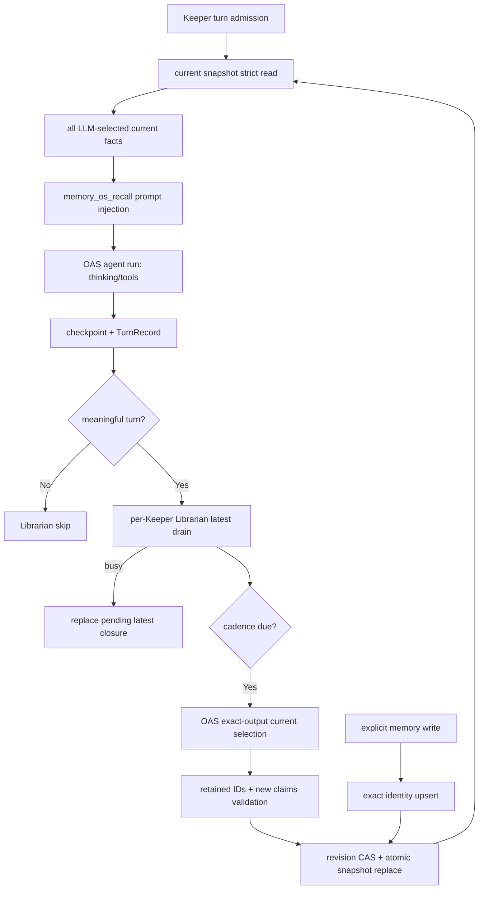

# MASC Librarian / Memory OS 적대적 감사 보고서

작성일: 2026-07-30

대상 저장소: `/Users/dancer/me/workspace/yousleepwhen/masc`

라이브 상태 루트: `/Users/dancer/me/.masc`
판정: **BLOCK / NO-GO**

## 0. 문서 상태와 evidence 분리 규칙

본 문서의 목적은 **현재 Memory OS 구현의 baseline 감사**다. 닫힌 PR #26483의
종결 verdict(P1: 제거된 구조를 current로 서술, P2: MD/HTML 이중 SSOT, P3: HTML
중복 H1)에 따라 아래 규칙으로 재구성했다.

- 본문 §1~§14는 **현재 source(`*.memory-current.json` 단일 snapshot + fact-only
  recall, #26500 merge 이후)**만 서술한다.
- 제거된 구조(다단 publication, 500/65536 recency, TTL recall, episode prompt,
  fleet consolidation, `n_episodes_in_store` 등)를 다루는 원문은 전부
  **부록 A. pre-#26500 history**로 이동했다. 부록은 현재 상태의 증거가 아니다.
- SSOT는 이 MD 하나다. HTML은 추적하지 않는다(generate-on-read).
- 현재 baseline SHA: `b7cddd3309c12f3343feca6155059eccd8e1e25c`
  (2026-07-31 00:27 KST `git rev-parse origin/main` 확인, 신뢰도 High).

## 1. Executive Summary

현재 Memory OS의 구조는 다음과 같다(2026-07-31 00:27 KST, baseline
`b7cddd3309c12f3343feca6155059eccd8e1e25c`의 production code로 확인).

- Keeper마다 단일 `<keeper_id>.memory-current.json` snapshot이 유일한 Memory
  persistence authority다(`Keeper_memory_os_current`). fact schema는 exact
  `claim`/`category`/`first_seen`의 closed decoder이며, revision CAS
  (`replace`의 `expected_revision`)와 lock+atomic file replace로 쓴다.
- 자동 recall은 LLM이 선택한 current snapshot의 **전체 fact를 그대로** prompt에
  주입한다(`Keeper_memory_os_recall.render_snapshot`). fact 수 cap, byte
  budget, recency ranking, TTL 필터는 존재하지 않는다.
- post-turn Librarian은 cadence gate 뒤 OAS exact-output current selection을
  만들고 revision CAS로 commit한다. explicit memory write는 exact identity
  upsert(`upsert_fact`)로 같은 snapshot에 쓴다.
- episode store, JSONL facts/event authority, consolidation, TTL/expiry,
  `claim_kind`는 production tree에 없다.

최초 감사에서는 사용자 계약 기준 **P0 9개, P1 7개**를 확인했다. #26500 merge 뒤
current `origin/main` `0d193fe1422bc943d079ffe12e4b527db5acaff3`을
2026-07-30 22:59 KST에, 그리고 baseline `b7cddd3309…`을 2026-07-31 00:27
KST에 다시 추적한 source 판정은 P0 9개 중 **해결 5, 부분 해결 1, 미해결 3**,
P1 7개 중 **해결 4, 미해결 3**이다. 따라서 현재 source blocker는 P0 4개(부분
해결 포함), P1 3개이며 production-correct 승인은 여전히 불가하다.

가장 중요한 차단 사유는 다음과 같다(모두 현재 source 기준, §5/§6 참조).

1. fact가 canonical source TurnRef/event edge를 보존하지 않고 user input의 exact
   TurnRef 증거도 닫히지 않았다(P0-3).
2. prompt recall은 LLM-selected current snapshot 전체 주입으로 고쳐졌지만
   explicit search와 history 조립에는 substring/token match와 first-100-byte
   dedupe가 남는다(P0-5 부분).
3. `park`/`lease`가 별도 lifecycle 개념으로 증식해 waiting chat이 autonomous
   Keeper를 종료시키고, Turn attempt identity와 중복되는 authority를
   만든다(P0-8).
4. `settlement`가 canonical terminal request 위에 두 번째 projection contract를
   만든다(P0-9).

따라서 새 Gate나 retrieval 기능을 추가하기 전에 다음 순서로 기반을 바로잡아야 한다.

`Fresh-state persistence SSOT → Turn identity SSOT → per-Keeper durable Librarian FIFO
→ atomic revision/failure contract → semantic context projection`

### 1.1 OAS 경계와 CI evidence(재검증 완료)

2026-07-30 20:02 KST OAS 경계 재검토에서는 G5를 막는 OAS 결함 두 개를 확인했다.
이 둘은 본 Memory 감사의 P0-1~P0-9 finding count에 추가하지 않고 cross-boundary
supporting defect로 분류한다. 기존 `flow_evidence`는 성공한 `before_advance`
전이를 보존하지 않아 failover 경로를 복원할 수 없고, HTTP 400 provider 오류
문구를 문자열 문법으로 해석해 typed context-overflow 사실로 승격했다. MASC
shadow codec은 OAS private invariant의 두 번째 SSOT가 되므로 전량 폐기했다. OAS
PR [#2892](https://github.com/jeong-sik/oas/pull/2892)는 성공한 transport
advance를 동일 atomic progress snapshot에 포함하고 문자열 기반 분류와 사망
`Context_window_refused`를 제거했다. 후속
[#2896](https://github.com/jeong-sik/oas/pull/2896)은 OAS-owned current-only
validated-flow evidence와 direct `Agent_sdk.Exact_output` adapter를 추가했다.
실제 caller 역추적 중 `No_measurement_dispatch` rejection의 terminal outcome과
optional measurement receipt가 살아 있는 증거임을 확인해 과도한 숙청을
되돌렸다. [#2899](https://github.com/jeong-sik/oas/pull/2899)는 canonical
JSON을 `Yojson.Safe.t`로 닫았고,
[#2903](https://github.com/jeong-sik/oas/pull/2903)은 godfile 증가를 private
one-way leaf DAG로 제거했다. 그러나 #2903 merge commit
`a923fc3889ba62a89cd42d91956d62dc0b674311`의 exact-main CI run
[`30535040210`](https://github.com/jeong-sik/oas/actions/runs/30535040210)은
`rejected.measurement`/`visit.ordinal` shared record label 추론 오류로
Build(OCaml 5.4.1/5.5.0)·Lint·Eio 1.3/1.4가 실패했다. 후속
[#2904](https://github.com/jeong-sik/oas/pull/2904)(exact-head PR run
[`30535494954`](https://github.com/jeong-sik/oas/actions/runs/30535494954))와
[#2906](https://github.com/jeong-sik/oas/pull/2906)(run
[`30535658586`](https://github.com/jeong-sik/oas/actions/runs/30535658586))도
exact-head Build/Lint/Eio가 실패했고, #2901 head
`5597da1ba3b1667779f70d6323b0fa886c0bb15d`의 PR run
[`30534846121`](https://github.com/jeong-sik/oas/actions/runs/30534846121)은
OCaml 5.4.1에 없는 `Option.exists` unbound와 `flow_visit_ordinal` 타입 오류로
실패한 채 merge됐다. `v0.231.9` 태그
`b70b35bb117af1c0597c28f619c187c7fb387bfb`의 exact-main CI run
[`30534931823`](https://github.com/jeong-sik/oas/actions/runs/30534931823)은
취소됐고 Code Smell Ratchet run
[`30534931829`](https://github.com/jeong-sik/oas/actions/runs/30534931829)이
실패해 green release 증거가 없었다.
[#2907](https://github.com/jeong-sik/oas/pull/2907),
[#2908](https://github.com/jeong-sik/oas/pull/2908)이 실제 domain boundary에
record 타입을 명시하고 5.4-compatible option match로 교체했다. 이를 모두 포함한
`v0.231.10` exact release SHA
`1fa61251936758d37c3a33eac07b8d95c5f26d35`는 CI run
[`30536256908`](https://github.com/jeong-sik/oas/actions/runs/30536256908)에서
OCaml 5.4.1/5.5.0 Build & Test, Eio 1.3/1.4, Lint, Format을 포함한 13개 job을
모두 통과했다(2026-07-30 22:10 KST `gh run view`/`gh release list` 확인,
2026-07-31 00:27 KST `gh run view 30536256908`/`gh release view v0.231.10`
재확인: conclusion success, 13/13 jobs, headSha 일치, 신뢰도 High). 이것이
최종 green release SHA다. MASC
[#26489](https://github.com/jeong-sik/masc/pull/26489)는 exact pin을 main에
반영했고(merge 시점 exact-head Build/CI Gate는 merge 뒤 취소),
[#26491](https://github.com/jeong-sik/masc/pull/26491)은 그 pin 위에서 typed
advance consumer와 serialized-request evidence를 구현해 2026-07-30 21:53 KST에
merge됐다. #26491 exact-head
`41561bd0220fc6afdd1a732ed217f9616ee61a26`의 CI(Build and Test/Dashboard/
CI Gate 포함)는 전부 green이다. 또한
[#26500](https://github.com/jeong-sik/masc/pull/26500)(`hard-cut minimal
current contract`, merge commit
`101d9efa1623e62b16b90f4011ff877e5eb49e65`)이 2026-07-30 22:01 KST에 merge돼
main의 current Memory contract를 `*.memory-current.json`으로 hard cut했다
(2026-07-31 00:27 KST `gh pr view 26500` 재확인: MERGED, merge commit 일치,
신뢰도 High). 실패 chain run `30535040210`/`30535494954`/`30535658586`/
`30534846121`의 failure conclusion도 같은 시각 `gh run view`로 재확인했다.

## 2. 감사 범위와 증거 계층

### 2.1 Source

- 현재 baseline `origin/main`:
  `b7cddd3309c12f3343feca6155059eccd8e1e25c`
  (2026-07-31 00:27 KST 확인)
- 2026-07-30 22:59 KST #26500 post-merge 재감사 `origin/main`:
  `0d193fe1422bc943d079ffe12e4b527db5acaff3`
- 최초 집중 정적 감사 SHA(pre-#26500 history):
  `8c4dae264e6b1d03708029718f868efbb3c2613b`
- 2026-07-30 16:17 KST current `origin/main` 및 rebase base:
  `407ae5bb92509f06bfb6fc5614e8539e230b2902`
- 후속 구현 branch:
  `refactor/memory-current-only-hard-cut-20260730`
- 사망 필드/원자 publication 후속 branch:
  `refactor/memory-atomic-publication-20260730`
- OAS evidence 선행 branch:
  `fix/exact-output-evidence-boundary-20260730`
- current-only 1차 source slice:
  `6f8bf76a816d822ca0165b6a8c42986b3d466e5c`
- TTL authority 제거 2차 source slice:
  `b9c338da4d4230ae05783090d5c32727312b5d99`
- 닫힌 PR #26436의 remote head는 1차 slice 뒤 deterministic fix
  `6a5d575629a12bac12bc9c6758ba2dc3a561e14c`로 갈라져 있다. 같은 fix는 2차
  slice에도 이미 포함되어 있으므로 닫힌 branch를 merge/reopen하지 않고 새 branch와
  Draft PR로 증명한다. 어느 slice도 main/CI/runtime 상태로 간주하지 않는다.

### 2.2 Runtime

아래는 **pre-#26500 runtime** 관측이며, 현재 배포나 현재 source의 증거가 아니다.
해당 runtime의 상세 행동 증거는 부록 A.4로 이동했다.

- PID: `25820`
- listener: `127.0.0.1:8935`
- command base path: `/Users/dancer/me`
- canonical runtime state root: `/Users/dancer/me/.masc`
- `/health?full=1`의 startup repo HEAD: `8c4dae264e`
- release version: `0.21.2`
- executable:
  `/Users/dancer/me/workspace/yousleepwhen/masc/_build/default/bin/main_eio.exe`

`health.build.commit_source=runtime_repo_head`이므로 이 값은 binary-embedded commit
증거가 아니다. 실행 시작 시 repo HEAD와 binary mtime은 일치하지만 정확한 deployed
binary SHA는 미증명으로 남긴다.

### 2.3 CI / 변경

- 최초 감사에서는 코드 수정이나 runtime mutation을 하지 않았다.
- 후속 구현 worktree에서는 dead Store, Memory `claim_kind`, persisted
  `schema_version`, serialization-only episode fields를 제거했다. strict reader,
  current-only exact journal, explicit BasePath I/O, current-only dashboard/health
  decoder도 추가했다. 2차 slice는 61 files, +372/-4,077로 TTL producer/schema/
  persistence/recall/GC/maintenance/dashboard를 함께 제거했다. prompt/validator는 동일
  immutable snapshot을 보지만 canonical TurnRef provenance는 아직 구현하지 않았다.
  live runtime은 수정하지 않았다.
- 로컬 Dune build는 실행하지 않았다. OCaml type/build 권위는 PR CI로 남아 있다.
- 변경 후 현존 OCaml 전체 `ocamlformat --check`와 parse-only 검증,
  `scripts/ci/check-determinism-contract.sh`, `git diff --check`,
  `scripts/check-doc-code-refs.sh`는 통과했다.
- dashboard `tsc --noEmit`과 focused Vitest 7 files / 255 tests,
  Python judge eval 24 tests, Ruff, Pyright는 통과했다.
- `scripts/ci_verify_linked_modules.sh`는 worktree에 CI build artifact가 없어 실행할 수
  없었다. 이를 위해 로컬 Dune build를 하지 않으며 새 PR CI에서 증명한다.
- source, CI, merge, deployment, runtime 증거를 서로 분리했다.

## 3. PR과의 관계

확인 시각: 2026-07-30 22:10 KST(#26491/#26500 merge와 OAS CI chain을 `gh`로
확인; 2026-07-31 00:27 KST #26500 merge commit과 OAS run chain 재확인)

| PR | 관련도 | 현재 상태 | 보고서 findings에 대한 효과 | 판정 |
|---|---|---|---|---|
| [#26324](https://github.com/jeong-sik/masc/pull/26324) `remove periodic full-store consolidation` | 직접 관련 | **Merged**, head `5adc5e7759f83143d12c3170db1835800f3601eb`, merge commit `a8683ea2ccc26c168664e114dbc0b01b8e1ed770` | periodic destructive consolidation 전체를 삭제했다. Librarian input의 ignored `schema_version`, unknown category, retired `kind` decoder 일부도 제거했다. | **P0-6 직접 해결. 나머지 P0/P1은 미해결** |
| [#26410](https://github.com/jeong-sik/masc/pull/26410) `park chat before claiming receipt` | 직접 재검토 필요 | **Merged**, head `bde47167ea442db9e91b91a61c27832d66485e10`, 2026-07-30 16:03 KST merge | lease-before-admission을 줄이고 pending receipt를 admission 뒤 claim하는 ordering은 개선한다. 그러나 `park`를 공식 흐름으로 만들고 별도 `lease_id` lifecycle을 유지한다. | **merge됐어도 숙청 기준과 충돌. TurnRef/AttemptId 단일 FSM으로 재구성 필요** |
| [#26428](https://github.com/jeong-sik/masc/pull/26428) `make current memory and provider input observable` | 직접 충돌 | **Closed**, head `06764bdd9244409f162a03bf4cdafc5f2d5e79a2`, `status:do-not-merge`, `reviewed:adversarial-non-pass`; exact-head CI는 green | immutable current snapshot/CAS와 provider-input observability 방향은 유효하다. 그러나 TTL/`claim_kind`/dead episode fields/latest-wins/cadence/prompt-local provenance를 포함한 잘못된 authority가 남았다. | **전체 채택 금지. atomic snapshot/관측성만 분리 재구성** |
| [#26435](https://github.com/jeong-sik/masc/pull/26435) `collapse compaction commit onto source CAS` | 직접 인접 | **Merged**, head `5866b26c14b91088349d21033a884ab6f1c65136`, merge commit `07a3d4f19d1f0c9563be01b8b6f8b4c90da14841`; exact-head `Build and Test`/`CI Gate`는 merge 뒤 취소 | compaction terminal projection을 source CAS에 접어 settlement 중복 authority를 줄인다. | **exact-head full CI green 없이 admin merge. Memory facts→episode→event publication/TurnRef/FIFO는 해결하지 않음** |
| [#26440](https://github.com/jeong-sik/masc/pull/26440) `hard-cut retired Memory OS authority` | 본 감사 후속 구현 | **Merged**, head `120dcc8fbc905aa3ea0c4651dc1f0a19fcfb7767`, squash merge `8701b4a9e4cec823c535912374ae11759125f596` | 1·2차 hard-cut과 본 보고서를 main에 반영했다. 그러나 merge 시점에 exact-head `Build and Test`, Dashboard, ocamlformat, CI Gate가 아직 실행 중이었고 merge 뒤 취소됐다. | **source hard cut은 병합됐으나 exact-head full CI green 증거 없음. cold cutover·runtime 증명 전 NO-GO** |
| [#26450](https://github.com/jeong-sik/masc/pull/26450) `prepare current-only atomic publication` | 본 감사 후속 구현 | **Merged**, head `3cf500c78b16e80c17ee1867ac6c4eb3512d27ba`, merge commit `1910149d9e42c7e91b79915157506d695be72f18`; `Build and Test`/Dashboard 등 full CI skipped, 다수 check cancelled | `terminal_marker`/versioned dashboard schema를 숙청하고 Librarian input을 `TurnRef`로 key했다. atomic revision은 구현하지 않았다. | **사망 필드 제거는 유효. CI·atomic commit·production caller 증거 없음** |
| [#26489](https://github.com/jeong-sik/masc/pull/26489) `pin agent sdk v0.231.10` | OAS release pin | **Merged**, head `c146ee46773f1813257dfad18060a679017bc31e`, merge commit `163f375010311b1798faeb42718439adfc1e4a41`; exact-head Build/CI Gate 취소 | OAS v0.231.10 SHA `1fa61251936758d37c3a33eac07b8d95c5f26d35`를 manifest/API-surface SSOT에 반영한다. | **source pin은 main 반영. exact-head MASC CI와 runtime proof 전 NO-GO** |
| [#26491](https://github.com/jeong-sik/masc/pull/26491) `bind turn evidence to serialized requests` | typed consumer/observability 후속 | **Merged**, head `41561bd0220fc6afdd1a732ed217f9616ee61a26`, merge commit `8c84975577338aa2a78f21161c0c121b1038b531`, 2026-07-30 21:53 KST merge; exact-head Build and Test/Dashboard/CI Gate 등 전부 green(2026-07-30 22:10 KST 확인) | #26489 pin 위에서 HITL summary가 typed advance를 직접 소비한다. request wire/prompt blocks/messages를 같은 serialized-request snapshot으로 묶고 unavailable composition을 `null`로 보존한다. | **source 병합 + exact-head CI green. durable evidence production caller/runtime proof 전 NO-GO** |
| [#26500](https://github.com/jeong-sik/masc/pull/26500) `hard-cut minimal current contract` | 본 감사 후속 구현 | **Merged**, head `ae2f017ed462024f8fe07928d33bbf07af5f6724`, merge commit `101d9efa1623e62b16b90f4011ff877e5eb49e65`, 2026-07-30 22:01 KST merge | current Memory contract를 exact `claim`/`category`/`first_seen`의 `*.memory-current.json`으로 hard cut하고 model-authored identity/TTL/recency ranking/`score`를 제거한다. migration/compat reader 없음 | **main 반영. 22:59 KST post-merge source 재감사 완료: P0 5건/P1 4건 해결, P0 1건 부분 해결, P0 3건/P1 3건 미해결** |
| [OAS #2892](https://github.com/jeong-sik/oas/pull/2892) `preserve typed advance evidence` | G5 선행 경계 | **Merged**, head `d2a56f315fc452d00a5ed55ea729746c800adfb2`, merge commit `7ce45ee3aa218b49dc13aaaebba1e2698aa22e2c`; exact-head CI 완료 전 merge | 성공한 `before_advance`를 동일 atomic flow progress에 기록하고 HTTP 400 오류 문구 기반 context-overflow 승격과 dead variant를 제거한다. | **source P0 없음. MASC/masc-mcp의 제거된 variant 소비자 hard cut 전 pin 금지** |
| [OAS #2896](https://github.com/jeong-sik/oas/pull/2896) `persist validated flow evidence` | G5 durable evidence | **Merged**, head `e89c5d9e57b5e8cd2077468cc2e04fa21d0b09f6`, merge commit `f6cc38056`; 최초 CI는 `Yojson.Safe.t` 추론 오류와 godfile `+1`로 실패 | actual mixed flow의 admission rejection → invalid JSON advance → semantic rejection → acceptance를 current-only canonical snapshot으로 보존한다. projector exactly-once, strict decode, integrity 및 re-hashed structural tamper test를 추가한다. | **기능 경계 유효. 최초 head는 compile/ratchet 불합격; #2899/#2903 후속 필수** |
| [OAS #2899](https://github.com/jeong-sik/oas/pull/2899) `constrain canonical JSON to Safe.t` | #2896 compile repair | **Merged**, merge commit `b1fe0ec06`; OAS main `0.231.8` release 전 포함 | canonicalizer 입력/출력을 명시적 `Yojson.Safe.t`로 닫아 `Floatlit`/`Tuple`/`Variant` polymorphic variant 추론 오류를 제거한다. | **정확한 compiler root fix. full downstream proof는 #2903 CI와 pin 이후** |
| [OAS #2903](https://github.com/jeong-sik/oas/pull/2903) `split durable evidence codec leaves` | #2896 godfile root fix | **Merged**, head `22b9f0a07d5d28be81ad73d6899f225b0c9ee0c2`, merge commit `a923fc3889ba62a89cd42d91956d62dc0b674311`; ratchet PASS, exact-main CI run [`30535040210`](https://github.com/jeong-sik/oas/actions/runs/30535040210) FAIL | root가 create/decode/integrity orchestration을 직접 소유하고 types → canonical → validation → codec private DAG로 분리한다. pure alias facade와 godfile `+1`을 제거했지만 shared record label 추론(`rejected.measurement`, `visit.ordinal`)이 닫히지 않았다. | **구조 방향은 유효하나 exact head는 compile 불합격. 단독 pin 금지** |
| [OAS #2904/#2906/#2907/#2908](https://github.com/jeong-sik/oas/pull/2908) `evidence type repairs` | #2903 compile repair chain | **Merged**, final merge `8d5d30b6a0f1a5175232533a7f5be5f18110ff44`; 중간 #2904/#2906 exact-head PR CI(run [`30535494954`](https://github.com/jeong-sik/oas/actions/runs/30535494954)/[`30535658586`](https://github.com/jeong-sik/oas/actions/runs/30535658586))는 실패. 선행 #2901 head `5597da1b…`의 PR run [`30534846121`](https://github.com/jeong-sik/oas/actions/runs/30534846121)도 `Option.exists`(OCaml 5.4.1 unbound)·`flow_visit_ordinal` 오류로 실패한 채 merge됐고, `v0.231.9` 태그 `b70b35bb…`의 exact-main CI run [`30534931823`](https://github.com/jeong-sik/oas/actions/runs/30534931823)은 취소·ratchet run [`30534931829`](https://github.com/jeong-sik/oas/actions/runs/30534931829) 실패로 green 없음 | canonical/codec/validation/consumer의 실제 domain 타입을 명시하고 OCaml 5.4에 없는 `Option.exists`를 typed match로 교체한다. | **중간 merge는 불합격. 네 repair와 #2903을 포함한 v0.231.10 exact release CI만 green proof** |
| [OAS v0.231.10](https://github.com/jeong-sik/oas/releases/tag/v0.231.10) | release/pin 후보 | SHA `1fa61251936758d37c3a33eac07b8d95c5f26d35`; CI run [`30536256908`](https://github.com/jeong-sik/oas/actions/runs/30536256908) SUCCESS(13/13 jobs, 2026-07-30 22:10 KST 확인, 2026-07-31 00:27 KST 재확인) | #2903/#2904/#2906/#2907/#2908 전체를 포함하며 public `.mli` surface 변화 없이 codec leaf와 compile repair를 묶는다. | **OAS release PASS — 최종 green release SHA. MASC #26489 pin과 #26491 exact-head CI는 green, production caller/runtime proof 전 NO-GO 유지** |
| [#26436](https://github.com/jeong-sik/masc/pull/26436) `enforce current-only Memory OS contracts` | 본 감사 1차 구현 | **Closed**, head `1c4692b806dd34e948afa99ea34d627092e880cc`, `status:do-not-merge`, `reviewed:adversarial-non-pass` | 1차 hard-cut의 CI Meta Guard 문제는 local 2차 slice에서 수정됐고 TTL authority도 추가 삭제했다. | **reopen 금지. 새 exact-head Draft PR로 다시 증명** |
| [#26389](https://github.com/jeong-sik/masc/pull/26389) `separate Keeper context from turn usage` | 원칙상 인접 | **Merged**, head `bc4ab6d0fde691a4c43e588d549b4a3389e5d31e`, merge commit `407ae5bb92509f06bfb6fc5614e8539e230b2902` | producer 없는 context 추정과 legacy metric surface를 제거한다. | Memory OS persistence/context flow의 직접 수정은 아님 |
| [#26392](https://github.com/jeong-sik/masc/pull/26392) `cost ledger exact runtime identity` | 원칙상 인접 | **Merged**, head `a332706ec04f49d8ac03e5de684dcf0e11003e3d`, merge commit `e19a05f6ca926eed0de054bd1371ae6f34a075e2` | timestamp/token heuristic 대신 exact identity를 사용한다. | 좋은 선례지만 Memory Turn identity는 수정하지 않음 |

### 3.0A 폐기한 prototype과 OAS 경계 결정

다음 prototype은 적대 검토에서 모두 **do-not-ship**으로 판정해 commit 전에
전량 삭제했다.

- single-file current snapshot: 최소 receipt 위조, codec exception 누출, duplicate
  identity 수용, rename 뒤 durability 세탁, path escape, O(n²) rewrite
- immutable revision/CURRENT prototype: canonical multi-turn source를 표현하지 못하는
  episode provenance, ancestry replay, nested symlink escape, production caller 부재
- MASC exact-evidence adapter: 약 1,780줄의 OAS shadow codec, OAS에서 생성 불가능한
  상태 decode 허용, selected/admission provenance 결합 누락, production caller 0

결론은 OAS가 자기 private typed invariant에서 **한 번** current-only durable
projection을 만들고, MASC는 `Agent_sdk.Exact_output`을 직접 소비해야 한다는 것이다.
Decoder는 live execution 타입을 재구성하지 않고 immutable abstract snapshot만
복원해야 한다. accepted/rejection polymorphic 값은 caller가 digest를 임의 전달하지
않고, OAS가 실제 typed 값에 caller-owned projector를 정확히 한 번 적용해 결합해야
한다. final flow ledger는 한 번만 저장하고 prior rejection prefix는 파생해야 하며,
rejection마다 전체 prefix를 중복하면 O(n²)·SSOT 위반이다.

이 경계는 #2896/#2899/#2903과 #2904/#2906/#2907/#2908 compile repair로
source 구현됐고 v0.231.10 exact release CI에서 증명됐다. 특히 처음 leaf가
`Rejected = No_measurement_dispatch + Measurement_not_required + receipt=None`으로
상태를 과도하게 축소했으나 실제 `admit_candidate_request` caller는 no-dispatch
terminal outcome(`local_invalid`, `unsupported` 등)과 optional terminal receipt를
생성할 수 있었다. 이것은 죽은 상태가 아니므로 복원했다. 반대로 measurement
phase/version/visit-count처럼 valid successful transcript에서 항상 파생되거나
도달 불가능한 durable field는 저장하지 않는다.

### 3.1 #26500 post-merge source 재감사

1차 대상은 `origin/main`
`0d193fe1422bc943d079ffe12e4b527db5acaff3`이며 2026-07-30 22:59 KST에
entrypoint → typed store → recall/search/dashboard consumer → caller를 추적했다.
2026-07-31 00:27 KST에는 baseline `b7cddd3309…`의
`keeper_memory_os_current.ml`, `keeper_memory_os_types.ml`,
`keeper_memory_os_recall.ml`, `keeper_tool_memory_runtime.ml`,
`keeper_librarian_runtime.ml`, `keeper_memory_lane.ml`을 다시 읽어 아래 분류가
유지됨을 확인했다.

해결된 source finding(원문은 부록 A.2/A.3):

- **P0-1:** dead `Keeper_memory_os_store`와 JSONL facts/episode/event authority가
  사라지고 production read/write/Librarian/dashboard가
  `Keeper_memory_os_current` 한 snapshot을 사용한다.
- **P0-2/P0-7:** Memory `schema_version`, `claim_kind`, TTL/expiry, episode 사망
  field와 compatibility reader가 current contract에서 제거됐다.
- **P0-4:** snapshot은 closed whole-object decode이며 한 fact 오류도 전체 typed
  read error로 노출된다.
- **P0-6:** destructive consolidation producer/caller가 삭제됐다.
- **P1-2/P1-3/P1-5/P1-6:** facts/episode/event 다단 publication과 모순된 episode
  prompt, fleet consolidation, episode/store 오표기 ledger가 current path에서
  제거됐다. revision CAS와 atomic snapshot replace가 실제 writer에 연결됐다.

남은 source finding(본문 §5/§6):

- **P0-3:** Librarian input에는 typed `Turn_ref`가 있지만 fact schema에는 source
  TurnRef/event edge가 없고 user input exact join 증거도 닫히지 않았다.
- **P0-5(부분):** automatic recall은 LLM-selected current facts 전체를 그대로
  주입하도록 고쳐졌다. 그러나 `keeper_memory_search`는 substring/token match를,
  history 조립은 first-100-byte dedupe를 사용한다.
- **P0-8/P0-9:** `Yielded_to_chat_waiting`, chat waiting authority, queue
  `lease_id`, `worker_settlement`/`Status_settlement`/
  `Settlement_projection_error`가 그대로 남는다.
- **P1-1/P1-4/P1-7:** Librarian `Replace_latest` coalescing, tool/multimodal
  placeholder와 fact provenance 손실, log/metric-only Librarian failure가 남는다.

[근거] `git rev-parse origin/main`, `rg` production caller scan, 위 exact files;
확인일시 2026-07-30T22:59:03+09:00, 재확인 2026-07-31T00:27:05+09:00; 신뢰도 High.

### 3.2 PR #26410의 정확한 경계

#26410은 다음 측면에서 유용하다.

- chat/autonomous admission authority를 turn mutex 하나로 축소
- lease보다 admission을 먼저 확정
- exact FIFO head receipt를 admission 이후 claim
- exact claim 이후 cancellation을 typed terminal outcome으로 처리

하지만 changed-file 목록에 다음 핵심 파일이 없다.

- `keeper_turn_record_writer.ml`
- `keeper_chat_store.ml`
- `keeper_memory_lane.ml`
- `keeper_librarian_runtime.ml`
- `keeper_memory_os_*`

따라서 본 보고서의 TurnRef SSOT와 Librarian loss 문제를 #26410이 해결한다고
간주하면 안 된다.

추가 숙청 기준으로 볼 때의 근본 문제는 현재 source에도 그대로다(P0-8 참조).

- `park`는 별도 OCaml variant가 아니라 Eio mutex 대기를 설명하는 서술어지만,
  `chat_waiting`을 model runtime exit condition으로 승격한다.
- 실제 stop reason인 `Yielded_to_chat_waiting`이 autonomous Keeper run을 종료한다
  (`lib/runtime/runtime_agent.ml:774`에서 현재도 생성).
- queue receipt에는 stable `Receipt_id`가 있는데 별도 `lease_id`가
  `Inflight/Recovery_required/finalize/nack` authority로 다시 존재한다.
- #26410은 lease-before-admission 문제를 줄이지만 `lease_observed`로 lease 개념 자체는
  유지한다.

따라서 필요한 것은 “더 정확한 park/lease”가 아니라 다음 단일 FSM이다.

```text
Receipt.Pending
  -> Receipt.Running { turn_ref; attempt_id; started_at }
  -> Receipt.Completed outcome
```

waiting은 queue state로 관측할 수 있지만 현재 Keeper를 stop/pause하는 별도 domain
concept가 되어서는 안 된다. Busy Keeper는 현재 활동을 계속하고, 수신 acknowledgement
또는 다음 event tail로 입력을 소비해야 한다.

## 4. 현재 호출 흐름

아래는 baseline `b7cddd3309…`의 production code로 확인한 현재 흐름이다
(`keeper_librarian_runtime.ml`의 cadence gate와
`Keeper_memory_os_current.replace` CAS, `keeper_memory_lane.ml`의
`Replace_latest` drain, `keeper_run_tools_hooks.ml`의 recall injection 경로로
확인, 2026-07-31 00:27 KST).



## 5. 현재 미해결 P0 Findings

아래 네 항목만이 현재 source(`b7cddd3309…`)에서 유효한 P0다. 해결된
P0-1/P0-2/P0-4/P0-6/P0-7의 원문은 부록 A.2에 있다.

### P0-3. Turn identity SSOT가 실제 데이터에서 깨진다

현재 source 수준의 문제는 그대로다. fact schema(`Keeper_memory_os_types.fact`)는
exact `claim`/`category`/`first_seen` 세 field뿐이며 source TurnRef/event
edge가 없다. Turn transcript/API는 TurnRef를 exact join key로 선언하지만 다음
연결을 재구성할 수 없다.

`accepted input → queue receipt → attempt → prompt blocks → decision → assistant output`

사전 #26500 runtime에서 관측된 duplicate absolute turn과 `turn_ref=null` user
row의 수치 증거는 부록 A.4에 있다. 그 증거는 현재 배포의 상태가 아니라,
identity 계약 부재가 실제 데이터 손상으로 이어진 사례 기록이다.

**Required resolution**

- input admission 시 typed `Input_ref` 발급
- canonical `Turn_ref`와 retry용 `Attempt_id` 분리
- user/chat queue/TurnRecord/decision/assistant에 동일 identity 전파
- timestamp fuzzy join 금지

### P0-5(부분). Context management에 문자열 휴리스틱이 남는다

**해결된 부분:** 고정 수치 recall authority는 제거됐다. 현재
`Keeper_memory_os_recall.render_snapshot`은 LLM이 선택한 current snapshot의
전체 fact를 cap·byte budget·recency ranking 없이 그대로 주입한다(500 facts /
65,536 bytes budget / newest-first selection / 32-turn echo window는 현재
production tree에 없다).

**남은 부분:**

- `keeper_memory_search`의 durable fact 검색은
  `String_util.contains_substring_ci` substring match다
  (`keeper_tool_memory_runtime.ml:78`).
- history 검색은 `contains_all_tokens_ci` token match다
  (`keeper_tool_memory_runtime.ml:168`).
- history 조립 dedupe는 각 user message의 첫 100 bytes를 key로 사용한다
  (`keeper_tool_memory_runtime.ml:143-146`).

이는 deterministic code가 semantic relevance를 결정하는 잔여 heuristic이다.

**Required resolution**

- deterministic code는 event range, IDs, namespace, ACL, cursor만 소유
- semantic recall/retain/update/forget은 typed LLM decision
- derived recall projection은 source IDs, generation, stale/error를 포함
- 원 ledger/store를 수정하거나 대체하지 않음

### P0-8. `park`와 `lease`가 Keeper 진행을 제약하는 별도 lifecycle이다

현재 흐름(2026-07-31 00:27 KST 재확인: `Yielded_to_chat_waiting`은
`lib/runtime/runtime_agent.ml:774`에서 여전히 생성되고,
`worker_settlement` 소비자도 그대로다):

- chat fiber가 turn mutex에서 대기하면 `chat_waiting=true`
- autonomous agent loop가 이를 보고 `Yielded_to_chat_waiting`
- current Keeper run이 종료되고 slot을 chat에 양도
- queue는 별도 `lease_id`를 발급해 `Inflight` 또는 `Recovery_required`를 표현

이는 사용자 요구인 “Busy면 하던 일을 계속하거나 나중에 답한다고 반응”과 다르다.
waiting input 때문에 autonomous runtime을 종료하는 것은 event prioritization이 아니라
stop Gate다.

추가로 `chat_waiting_since`는 구현과 테스트 외 production caller가 0이다. 명백한
사망 projection이다.

**Required resolution**

- `Yielded_to_chat_waiting` stop reason 삭제
- `chat_waiting`, `chat_waiting_since`를 model/runtime exit authority에서 제거
- `Park`라는 persisted/typed domain concept를 만들지 않음
- 별도 lease identity 삭제
- `Receipt_id + Turn_ref + Attempt_id` 단일 lifecycle로 통합
- incoming chat은 immutable event tail에 쌓고 current turn을 강제 종료하지 않음

### P0-9. `settlement`가 canonical terminal state 위에 두 번째 Facade를 만든다

`Keeper_msg_async.worker_settlement`은 다음 variant를 가진다(2026-07-31
00:27 KST 재확인: `lib/fusion/fusion_delivery_projector.ml`과
`lib/server/server_routes_http_keeper_stream.ml`이 두 variant를 그대로 소비).

- `Status_settlement { entry; durability; origin }`
- `Settlement_projection_error { attempted_entry; poll_result }`

그 결과 stream과 Fusion이 canonical request entry를 직접 소비하지 않고 다시
settlement를 해석한다.

- `durability = Durable | Volatile_persistence_failure`
- `origin = Transition_commit | Canonical_reconciliation`
- stream은 `(durability, origin, status)` 조합으로 terminal outcome을 다시 계산
- Fusion은 durability에 따라 delivery projection 여부를 다시 결정

이 정보는 완전히 dead하지는 않지만 canonical request의 terminal entry/persist result를
중복 표현한다. 즉 Facade-from-canonical-state에 해당하며 새 policy 분기 표면을 만든다.

삭제 시 terminal truth 자체를 없애면 안 된다. 다음처럼 canonical commit 결과 하나로
축소해야 한다.

```text
Async_request.commit_terminal
  -> Committed canonical_terminal_entry
  | Not_committed typed_persistence_error
  | Canonical_conflict exact_lookup_result
```

Stream과 Fusion은 이 결과를 직접 소비한다. `settlement`, `settlement_durability`,
`settlement_origin`, `Settlement_projection_error`라는 별도 vocabulary와 callback
Facade는 삭제한다.

## 6. 현재 미해결 P1 Findings

아래 세 항목만이 현재 source에서 유효한 P1이다. 해결된
P1-2/P1-3/P1-5/P1-6의 원문은 부록 A.3에 있다. 아래 live 발생 수치는
pre-#26500 runtime 관측(부록 A.4)이며 현재 배포의 수치가 아니다.

### P1-1. Librarian snapshot coalescing으로 의미 있는 turn이 유실될 수 있다

`keeper_memory_lane.ml`의 `librarian_reserve`는 in-flight 1개와 latest 1개만
유지한다. 세 번째 submission은 기존 latest closure를 `Replace_latest`로
덮어쓴다(2026-07-31 00:27 KST 재확인).

pre-#26500 runtime 발생:

- sangsu 28회
- full-cycle-probe 6회
- rondo 1회

post-turn caller는 `Submitted/Coalesced/Dropped` 결과를 버린다. 각 meaningful turn이
`committed | intentionally skipped | retryable failure` 중 무엇이 됐는지 증명할 수 없다.

### P1-4. Provenance와 multimodal 정보가 손실된다

- tool result는 id/error placeholder
- tool call은 id/name placeholder
- Image/Document/Audio는 omitted string
- `source_turn`은 actual TurnRef가 아니라 sliding prompt index
- parser가 source turn/tool ID가 실제 input manifest에 존재하는지 검증하지 않음
- connector/server/channel/thread/actor namespace가 provenance에 없음

**구현 진행:** 후속 worktree는 `source_turn`이 supplied message snapshot 안에 있고,
`source_tool_call_id`가 정확히 그 message의 tool call/result에 있을 때만 claim을
수용한다. 이 과정에서 prompt는 recent-message slice를 사용하지만 validator는 원본
input을 사용해 동일 숫자가 다른 메시지를 가리키던 결함을 발견했다. 이제 prompt
render와 validator가 동일한 immutable `source_input`을 공유하며, capacity+1 메시지와
ToolResult ID를 사용한 회귀가 이를 고정한다. actual `Turn_ref`, multimodal payload,
spatial namespace는 아직 없으므로 finding은 부분 해결이다.

### P1-7. Librarian 실패가 typed turn/health 상태가 아니다

`keeper_librarian_runtime.ml`의 `run_best_effort`는 실패를 log/metric에 남기지만
caller에 typed terminal result를 반환하지 않는다(2026-07-31 00:27 KST 재확인,
#26528 merge 이후에도 반환 계약은 unit으로 동일).

관측 표면은 #26528(2026-07-31 merge)이 해소했다.

- keeper-memory-health endpoint가 configured keeper(`discover_keepers_toml`) ∪
  snapshot union을 열거해 스냅샷 없는 keeper도 행을 갖고, `snapshot_present`와
  `librarian_failures`(site `memory_os_librarian` + `memory_os_current_read`
  합산)를 노출하며, `librarian_starvation`(error) / `librarian_failures`(warn)
  alert를 계산한다.
- 실패 로그는 `Flow_exact_execution_failed` / `Flow_candidates_exhausted`
  payload를 per-slot typed cause + redacted raw_response 발췌로 렌더하고,
  current snapshot 부재 상태의 실패는 WARN이 아니라 ERROR로 남는다.

동작 수치의 신선도 주의: 아래 pre-#26500 집계는 폐기된 JSONL/episode
아키텍처의 것이다. current 아키텍처(`*.memory-current.json`) 라이브 실측
(2026-07-31, #26527)은 Librarian 성공 snapshot commit이 sangsu 1회
(2026-07-30, fact 1)뿐이고, 2026-07-31 시도 15회는 전부 실패했다
(10 Keeper 중 7 memory absent). 슬롯별 원인은 ollama 3슬롯 weekly limit
소진이 확정, 잔여 2슬롯(local llama-server, glm)은 #26528 배포 후 per-slot
로그로 확정한다.

pre-#26500 runtime 집계(참고용, 위 주의 참조):

- Librarian success 107
- Librarian failure 9
- consolidation transport failure 16

미해소 잔여: `run_best_effort`의 typed terminal result 반환(turn 상태로의
연결). 로그/health 수준에서는 보이지만 runtime contract 수준에서는 여전히
silent하다.

## 7. 확인된 양호점

- scoped Memory hot path에서 MASC → OAS 의존성만 확인했다.
- OAS → MASC 역방향 참조는 발견되지 않았다.
- per-Keeper Librarian lane key와 Mutex 보호가 있다.
- 일부 Keeper가 recovering이어도 다른 Keeper의 autonomous turn은 증가했다
  (pre-#26500 runtime 관측).
- 현재 snapshot writer에는 strict read와 revision CAS가 있다.
- 명백한 Facade-from-Facade hot-path chain은 발견되지 않았다.
- `short_goal`, `mid_goal`, `long_goal` 이름의 field/variant는 발견되지 않았다.

마지막 항목과 별개로, #26500 이후 `valid_for_days`/TTL/recency/32-turn window도
production tree에서 제거됐으므로, deterministic horizon policy는 현재 source에
존재하지 않는다. 남은 문자열 휴리스틱은 P0-5(부분)에 한정된다.

## 8. OCaml 5.4 / Eio 기준

OCaml 5.4 공식 문서 기준:

- Domain은 OS thread와 1:1인 heavyweight parallel unit이다.
- immutable value는 domain 사이에서 자유롭게 공유할 수 있다.
- mutable ref/array/field는 동기화가 필요하다.
- DRF 코드에만 sequential consistency가 보장된다.

따라서 Keeper마다 Domain을 만드는 것보다 다음 구조가 적절하다.

`runtime root → per-Keeper supervisor fiber/switch → per-job child switch`

Eio 기준:

- blocking 가능 critical section은 `Eio.Mutex` 또는 owner-fiber actor
- 짧고 yield 없는 state mutation만 `Stdlib.Mutex`
- `Eio.Cancel.Cancelled`를 catch하고 잊지 않음
- failure blast radius를 Keeper supervisor 단위로 제한
- LLM/network/file I/O는 lock 밖에서 실행
- commit은 짧은 atomic revision swap/rename

공식 근거:

- [OCaml 5.5 Parallel Programming](https://ocaml.org/manual/5.5/parallelism.html)
- [Eio Mutex](https://ocaml-multicore.github.io/eio/eio/Eio/Mutex/index.html)
- [Eio Cancel](https://ocaml-multicore.github.io/eio/eio/Eio/Cancel/index.html)
- [Eio Fiber](https://ocaml-multicore.github.io/eio/eio/Eio/Fiber/index.html)

## 9. 시장 구현 비교

### 9.1 채택할 원칙

Hermes Agent:

- post-turn single-worker FIFO
- N write가 N+1 write보다 먼저 commit
- session rotation과 write를 같은 ordered task로 처리
- bounded shutdown drain과 abandoned-work count

[Hermes MemoryManager](https://github.com/NousResearch/hermes-agent/blob/646761c7831ff4c4cd0d6ac711ed791d487fb665/agent/memory_manager.py)

OpenClaw:

- Gateway가 session state SSOT
- channel/room/peer 분리
- cross-channel identity는 explicit `identityLinks`
- append-only transcript와 persistent compaction successor
- tool call/result pairing 보존

[OpenClaw session architecture](https://github.com/openclaw/openclaw/blob/d5e3c68632326e1768536b55d6b867fdf7966473/docs/concepts/session.md)
[OpenClaw compaction architecture](https://github.com/openclaw/openclaw/blob/main/docs/reference/session-management-compaction.md)

로컬 Claude Code:

- forked LLM이 semantic update-vs-new 판단
- 성공 commit 후에만 cursor advance
- main-agent direct writer와 background writer authority 분리

### 9.2 복제하면 안 되는 것

- Hermes prefetch failure의 empty context/log-only degrade
- OpenClaw score/recency/threshold dreaming과 legacy migration
- Claude Code `alreadySurfaced`, max 5, 10k/5k/3 threshold
- MemoryOS 논문의 short/mid/long, heat, top-k

시장 구현은 invariant의 참고 자료일 뿐 MASC의 사용자 계약보다 상위 authority가 아니다.

## 10. 목표 아키텍처

### 10.1 유일한 조립 수식

```text
Prompt(N) =
  latest_committed_memory_revision
  + immutable_turn_events(memory_revision.covers_through_seq + 1 .. N)
```

이 수식은 다음을 동시에 보장한다.

- memory revision 이전 event의 중복 주입 방지
- revision 이후 미처리 event의 유실 방지
- Librarian이 느리거나 실패하는 경우에도 Keeper main turn 진행
- restart 후 같은 cursor/watermark에서 재개

### 10.2 결정론 코드의 권한

- event identity와 ordering
- namespace와 ACL
- cursor와 idempotency
- tool call/result pairing
- atomic commit
- explicit typed failure

### 10.3 LLM의 권한

```text
Create
Update existing_fact_id
Supersede existing_fact_id
Forget existing_fact_id
Noop
```

모든 decision은 다음을 포함해야 한다.

- source event IDs
- exact spatial namespace
- Librarian job/range ID
- runtime/provider/model
- policy revision
- created/committed timestamp

### 10.4 Spatial namespace

최소 exact tuple:

```text
keeper
× connector
× account/server
× channel/room
× thread
× actor
```

다른 공간의 기억 공유는 typed explicit relation으로만 허용한다. 동일 문구 또는 유사
embedding만으로 namespace를 합치지 않는다.

## 11. 개선 Goals와 측정 가능한 Tasks

### G0. Fresh-state persistence SSOT

Tasks:

1. `Keeper_memory_os_store` 채택 또는 삭제 결정
2. production read/write authority를 하나로 축소
3. schema compatibility, optional legacy field, dead global slot 삭제
4. migration 없이 fresh root만 허용

Acceptance:

- production Memory authority 1개
- compatibility/migration branch 0개
- facts/episodes/events commit receipt 1개

### G1. Turn Ledger SSOT

Tasks:

1. `Input_ref`, `Turn_ref`, `Attempt_id` 정의
2. dashboard/Discord/Board/Scheduler entrypoint에서 identity 선발급
3. user row, queue receipt, prompt, decision, tool blocks, assistant row에 전파
4. duplicate TurnRef fail-closed

Acceptance:

- autonomous/user/reactive 혼합 100 turn exact join 100%
- null user TurnRef 0
- duplicate TurnRef 0

### G2. Context Assembler

Tasks:

1. `memory revision + uncovered event tail` 단일 조립
2. tool call/result adjacency 보존
3. Thinking/Tool/Audio/Image/Document typed block 보존
4. namespace/ACL을 조립 entrypoint에서 정확히 한 번 적용

Acceptance:

- N→N+3 event ID 누락 0
- duplicate event 0
- tool call/result 분리 0
- private channel leakage 0

### G3. Per-Keeper Librarian Lane

Tasks:

1. `Replace_latest` 제거
2. durable per-Keeper FIFO outbox
3. job identity:
   `(keeper, from_seq, through_seq, policy_revision, runtime_revision)`
4. success commit 후 cursor advance
5. job별 typed terminal receipt
6. G1 identity 이후 Memory-owned durable Librarian outbox를 별도 slice로 구현
7. `Yielded_to_chat_waiting`과 chat-waiting exit authority를 별도 slice로 삭제
8. queue lease identity를 `Receipt_id → Attempt_id → Turn_ref` FSM으로 대체
9. async `settlement` facade를 canonical terminal commit 결과로 대체

Acceptance:

- provider 429/timeout/restart에서 dropped/coalesced 0
- 모든 meaningful turn range에 terminal receipt 존재
- Librarian stall 중 Keeper turn 계속 증가
- 다른 Keeper lane progress 유지
- waiting chat 때문에 current autonomous run이 종료되는 경우 0
- separate lease/settlement identity 0

### G4. Semantic Memory Policy

Tasks:

1. typed `Create|Update|Supersede|Forget|Noop`
2. stable fact ID와 explicit source edges
3. 32-turn echo window 삭제
4. substring score/first-100-byte dedupe 삭제
5. `valid_for_days`/TTL/horizon 제거
6. `claim_kind`, `open_items`, `constraints`, `preserved_tool_refs` 삭제

Acceptance:

- 모든 semantic deletion/update에 LLM receipt 존재
- fixed semantic top-k/heat/half-life/window branch 0
- `claim_kind`, `valid_until`, `valid_for_days` production reference 0
- serialization-only episode field 0
- paraphrase, contradiction, correction fixture 통과
- restart 전후 동일 causal decision

### G5. Atomic Failure and Failover

Tasks:

1. authoritative strict reader
2. immutable revision commit
3. write-before/after crash recovery
4. exact-output all-or-nothing validation
5. configured OAS fallback provenance 기록

Acceptance:

- corrupt row가 memory absence로 위장되는 경우 0
- ENOSPC/crash-between-phases partial publication 0
- provider failure 시 cursor advance 0
- invalid candidate 이후 configured fallback 동작과 provenance 증명

### G6. Observability

Tasks:

1. TurnRecord에 memory revision ID, source range, Librarian receipt ID 추가
2. `/health`에 per-Keeper pending/failed/oldest-age/stale generation
3. store count와 injected count 분리
4. raw memory content 없이 N→N+3 재구성

Acceptance:

- 한 API snapshot으로 before/after/failover/commit 재구성 가능
- misleading store count field 0
- log-only Librarian terminal failure 0

### 11.1 2026-07-30 후속 구현 상태

| Goal | 현재 증거 | 판정 |
|---|---|---|
| G0 | #26500에서 dead Store/JSONL facts·episode·event를 삭제하고 read/write/Librarian/dashboard를 exact `*.memory-current.json` snapshot 하나로 연결. closed decoder, revision CAS, atomic replace 사용 | **source 완료** — fresh-state deployment/runtime proof는 별도 미완료 |
| G1 | Librarian input과 snapshot source는 typed `${trace_id}#${absolute_turn}`/trace/generation을 사용 | **미완료** — 개별 fact source TurnRef/event edge와 user input exact join 없음 |
| G2 | 목표 수식과 N→N+3 acceptance 정의, 구현 없음 | **미완료** |
| G3 | latest-wins와 park/lease/settlement를 서로 다른 SSOT로 분해; Librarian writer는 closed current snapshot과 revision CAS를 사용 | **부분 완료** — lossless per-Keeper FIFO/outbox 미구현 |
| G4 | claim/TTL/episode authority와 deterministic recall ranking·byte cap·echo window 제거. LLM current selection을 그대로 recall | **부분 완료** — explicit search substring/token match와 first-100-byte history dedupe 잔존 |
| G5 | current snapshot closed read, revision CAS/atomic replace, unavailable/dashboard read error, OAS typed evidence chain과 MASC direct consumer | **부분 완료** — OAS v0.231.10 exact release와 #26491 exact-head CI green. power-loss durability receipt와 production runtime proof 미구현 |
| G6 | stale claim-kind projection 제거, versioned `schema`와 사망 `terminal_marker`/`terminal_markers`를 제거한 unversioned closed dashboard contract, per-Keeper read error 추가 | **부분 완료** — receipt/age/stale generation 미구현 |

Focused verification:

- 2차 slice 61 files, +372/-4,077
- 2차 slice의 변경 후 현존 OCaml `.ml/.mli` 전체:
  `ocamlformat --check`, `ocamlc -stop-after parsing` 통과
- dashboard: `tsc --noEmit` 통과
- dashboard focused Vitest: 7 files, 255 tests 통과
- 사망 필드 후속 slice: dashboard `tsc --noEmit`, focused Vitest
  5 files / 231 tests 통과
- production tree의 `terminal_marker`/`terminal_markers` 및 versioned
  `keeper.memory_os.recall_observability.v2` symbol scan 0; dashboard 회귀 test는
  retired `schema` 입력을 unknown field로 거부함을 고정
- Python judge eval: 24 tests, Ruff, Pyright 통과
- `git diff --check` 통과
- `scripts/check-doc-code-refs.sh` 통과
- `scripts/ci/check-determinism-contract.sh` 통과
- removed Memory `claim_kind`/TTL/dead episode field/Store production symbol scan 0
- retention sweep 전용 episode enumeration/strict-file-reader와 dead
  `keeper_memory_write_json → handle_memory_write` facade production symbol scan 0
- 실제 descriptor admission이 retired `valid_for_days`를 거부하는 회귀 추가
- retired `MASC_KEEPER_MEMORY_OS_LIBRARIAN_GLOBAL_SLOT` config/snapshot/docs/test
  symbol scan 0
- `scripts/ci_verify_linked_modules.sh`는 worktree에 CI build artifact가 없어 미실행
- 로컬 Dune 미실행; OCaml type/link/build/test는 **CI 미증명**
- OAS #2892 local: touched OCaml 전부 `ocamlformat`, parse-only,
  `git diff --check` 통과. Dune 미실행. head `d2a56f315...`은 full CI 전 merge
- OAS #2896 local: mixed four-candidate loopback test, projector cardinality,
  canonical roundtrip, stale-integrity tamper와 re-hashed structural tamper를 추가.
  최초 CI는 `Yojson.Safe.t` 타입 추론과 godfile `+1`로 실패
- OAS #2899: canonical JSON을 명시적 `Yojson.Safe.t`로 닫는 compiler root fix
- OAS #2903 local: root 125L, types 217L, canonical 243L, validation primitives
  284L, validation 192L, codec 403L; parser/format/diff/boundary gate와
  code-smell ratchet `godfile 11 → 11` 통과. exact-main CI
  [`30535040210`](https://github.com/jeong-sik/oas/actions/runs/30535040210)은
  `rejected.measurement`/`visit.ordinal` record-label 추론 오류로
  Build(5.4.1/5.5.0)·Lint·Eio 1.3/1.4 실패
- OAS #2904/#2906 중간 exact-head Build/Lint/Eio 실패(PR run
  [`30535494954`](https://github.com/jeong-sik/oas/actions/runs/30535494954),
  [`30535658586`](https://github.com/jeong-sik/oas/actions/runs/30535658586))와
  선행 #2901 head `5597da1b…`의 PR run
  [`30534846121`](https://github.com/jeong-sik/oas/actions/runs/30534846121)
  실패(`Option.exists` OCaml 5.4.1 unbound, `flow_visit_ordinal` 타입 오류)를
  확인한 뒤 #2907/#2908에서 consumer·codec·validation leaf의 typed boundary와
  OCaml 5.4 option match를 닫음. `v0.231.9` 태그 `b70b35bb…`의 exact-main CI
  run [`30534931823`](https://github.com/jeong-sik/oas/actions/runs/30534931823)은
  취소, Code Smell Ratchet run
  [`30534931829`](https://github.com/jeong-sik/oas/actions/runs/30534931829)
  실패로 green release 증거 없음
- OAS v0.231.10 SHA `1fa61251936758d37c3a33eac07b8d95c5f26d35`:
  CI [`30536256908`](https://github.com/jeong-sik/oas/actions/runs/30536256908)에서
  OCaml 5.4.1/5.5.0 Build & Test, Eio 1.3/1.4, Lint, Format 포함 13/13 jobs
  성공 — 최종 green release SHA(2026-07-30 22:10 KST `gh run view`/
  `gh release list` 확인, 2026-07-31 00:27 KST `gh run view 30536256908`/
  `gh release view v0.231.10` 재확인, 신뢰도 High)
- MASC #26489가 OAS v0.231.10 exact pin을 main에 반영했으나 merge 시점
  exact-head Build/CI Gate는 merge 뒤 취소. 이후 #26491 exact-head green CI가
  동일 pin 포함 tree의 Build/Dashboard를 증명
- MASC #26491은 2026-07-30 21:53 KST merge(head
  `41561bd0220fc6afdd1a732ed217f9616ee61a26`, merge commit `8c849755…`).
  exact-head CI(Build and Test/Dashboard/CI Gate 등) 전부 green(2026-07-30
  22:10 KST `gh pr view 26491` 확인). 로컬 Dune 미실행
- MASC #26500(`hard-cut minimal current contract`)은 2026-07-30 22:01 KST
  merge(merge commit `101d9efa1623e62b16b90f4011ff877e5eb49e65`). current
  Memory contract를 `*.memory-current.json`으로 hard cut. 잔여 source
  pin/caller/heuristic은 2026-07-30 22:59 KST post-merge 재감사 결과를 사용한다.

Current-snapshot deployment proof:

- 2026-07-30 16:05 KST에 관측한 `*.facts.jsonl`과 episode/event 파일은 merge 전
  runtime의 역사 증거다. #26500 이후 current source에는 해당 reader가 없으므로
  이 파일들의 존재는 decoder failure나 Keeper 디렉터리 reset 조건이 아니다.
- 호환 reader, migration, repairer는 추가하지 않는다. retired 파일을 current
  authority로 복구하거나 변환하는 운영 단계도 두지 않는다.
- 배포 승인은 `old runtime stop → new binary start → exact
  <base_path>/.masc/config/keepers/*.memory-current.json write → restart → health/recall
  proof`로 확인한다. unrelated Keeper state 삭제는 금지한다.
- 이 current-path runtime proof는 아직 없다. 따라서 source hard-cut과 별개로
  release는 **P0 BLOCK**이지만, blocker는 cold reset이 아니라 미검증 deployment다.

## 12. 권장 실행 순서

1. G0 Fresh-state SSOT
2. G1 Turn identity
3. G3 per-Keeper durable Librarian FIFO
4. G5 atomic failure/failover
5. G2 Context Assembler
6. G4 semantic memory policy
7. G6 namespace/ACL과 observability

G0/G1 이전에 새로운 retrieval, dedupe, Gate, TTL을 추가하면 잘못된 authority와 identity
위에 기능을 더 쌓게 된다.

## 13. 최종 결론

현재 MASC Librarian/Memory OS는 “실제로 호출되는 prototype” 단계를 넘었고,
#26500 hard cut으로 persistence authority·legacy schema·TTL/horizon·episode
authority·deterministic recall ranking은 제거됐다. 그러나 현재 source는 다음
조건을 아직 충족하지 못한다.

- exact Turn identity(P0-3)
- heuristic-free semantic boundary(P0-5 잔여 substring/token/first-100-byte)
- park/lease/settlement 중복 lifecycle 0(P0-8, P0-9)
- lossless per-Keeper async processing(P1-1)
- spatially scoped provenance(P1-4)
- typed Librarian failure(P1-7)
- current-path runtime deployment proof

따라서 판정은 계속 **BLOCK / NO-GO**다. 단, blocker의 성격이 바뀌었다.
persistence/legacy/TTL 같은 authority 숙청은 source에서 완료됐고, 남은 것은
Turn identity, coalescing 없는 Librarian lane, settlement 단일화, provenance,
typed failure, 그리고 fresh-state deployment/runtime 증명이다.

Memory OS 개선은 하나의 거대한 호환 PR이 아니라, 위 Goal 순서대로
fresh-state hard cut을 적용한 좁고 독립적인 PR들로 진행해야 한다.

## 14. Evidence Record

### 14.1 공통 헤더

- `날짜(ISO8601)`: `2026-07-31T00:27:05+09:00`(current-state-only 재구성:
  pre-#26500 history를 부록 A로 분리, HTML SSOT 제거, baseline
  `b7cddd3309…` 재검증)
- `작성자`: `Codex`
- `결정 ID`: `masc-memory-os-adversarial-audit-20260730`
- `적용 대상`: `/Users/dancer/me/workspace/yousleepwhen/masc`,
  `/Users/dancer/me/.masc`
- `결정 상태`: `보류 — BLOCK / NO-GO`

### 14.2 근거 (Evidence)

#### Source

- `항목`: Librarian/Memory OS current source contract
- `출처`: `git rev-parse origin/main`(`b7cddd3309c12f3343feca6155059eccd8e1e25c`),
  `lib/keeper/keeper_memory_os_current.ml`, `keeper_memory_os_types.ml`,
  `keeper_memory_os_recall.ml`, `keeper_tool_memory_runtime.ml`,
  `keeper_librarian_runtime.ml`, `keeper_memory_lane.ml` 직접 판독,
  `rg` production caller scan
- `확인일시`: `2026-07-31T00:27:05+09:00`(1차: `2026-07-30T22:59:03+09:00`,
  `0d193fe1422bc943d079ffe12e4b527db5acaff3`)
- `신뢰도`: `High`
- `제한조건`: 후속 2개 source slice와 report update는 아직 새 Draft PR CI 전

#### Runtime

- `항목`: pre-#26500 live recall, Librarian, consolidation, Turn identity
  (현재 배포 증거 아님 — 부록 A.4)
- `출처`: `/health?full=1`, Keeper TurnRecord, decision/event JSONL,
  recall injection ledger, dashboard logs API
- `확인일시`: `2026-07-30T11:06:00+09:00`
- `신뢰도`: runtime behavior `High`, exact deployed binary SHA `Medium`
- `제한조건`: health commit은 binary-embedded SHA가 아니라 startup repo HEAD.
  #26500 이후 current-path runtime proof는 없음

#### Pull Requests / CI

- `항목`: PR의 finding coverage와 OAS CI chain
- `출처`: `gh pr list`, `gh pr view`, GitHub changed-file 및 exact file patch;
  MASC #26428/#26440/#26450/#26489/#26491/#26500,
  OAS #2892/#2896/#2899/#2901/#2903/#2904/#2906/#2907/#2908,
  OAS CI `30535040210`/`30535494954`/`30535658586`/`30534846121`/
  `30534931823`/`30534931829`/`30536256908`
- `확인일시`: `2026-07-30T22:10:00+09:00`, 재확인
  `2026-07-31T00:27:05+09:00`(`gh run view`로 `30536256908` success 13/13 jobs
  및 `30535040210`/`30535494954`/`30535658586`/`30534846121` failure 확인,
  `gh release view v0.231.10`으로 tag SHA `1fa61251…` 확인, `gh pr view 26500`으로
  merge commit `101d9efa…` 확인)
- `신뢰도`: `High`
- `제한조건`: PR head/check 상태는 이후 push에 따라 변경 가능

#### OCaml / Eio

- `항목`: OCaml 5.4 memory model과 Eio cancellation/mutex 기준
- `출처`: [OCaml 5.4 official manual](https://ocaml.org/manual/5.4/index.html),
  [OCaml 5.4 parallel programming](https://ocaml.org/manual/5.4/parallelism.html),
  Eio official API docs
- `확인일시`: `2026-07-30T18:29:00+09:00`
- `신뢰도`: `High`
- `제한조건`: MASC-specific architecture 판정은 공식 언어/runtime 계약의 적용 결과

#### Market comparison

- `항목`: Hermes/OpenClaw/local claude-code memory/context implementation
- `출처`: Hermes main `646761c…`, OpenClaw main `d5e3c68…`,
  local claude-code `261739a…`
- `확인일시`: `2026-07-30T10:53:00+09:00`
- `신뢰도`: `High`
- `제한조건`: 로컬 claude-code는 upstream-current 주장 아님

### 14.3 검증 (Verification)

- `1차`: current source entrypoint, producer, typed consumer, caller 추적
- `2차`: live `/health`, dashboard APIs, JSONL/SQLite aggregate 확인(pre-#26500)
- `3차`: N→N+3 prompt block digest와 Memory revision 변화 비교(pre-#26500)
- `4차`: #26500 post-merge 재감사(`0d193fe14…`, 2026-07-30 22:59 KST)와
  current-state-only 문서 재구성 시 baseline `b7cddd3309…` 재판독
  (2026-07-31 00:27 KST)
- `재현 결과`: P0/P1 findings 재현. source와 runtime에서 동일 heuristic/identity
  결함 확인. 후속 worktree의 dead Store/field/BasePath hard cut은 변경 OCaml
  전체 format/parse, dashboard typecheck, focused 7 files/255 tests, Python
  24 tests와 static check를 통과했다. TTL/expiry authority production reference도
  제거됐다. OAS #2892/#2896/#2899/#2903과 #2904/#2906/#2907/#2908은 advance
  evidence, provider prose hard cut, validated-flow durable snapshot, Safe.t compiler
  root fix, private leaf split, typed compile repair까지 진행했다. 중간 exact CI
  chain(#2903 main run `30535040210`, #2904/#2906 PR run `30535494954`/
  `30535658586`, #2901 PR run `30534846121`, `v0.231.9` main run `30534931823`
  취소 + ratchet `30534931829` 실패)은 모두 불합격이었고, v0.231.10 exact
  release CI `30536256908`만 13/13 jobs green이다(2026-07-30 22:10 KST 확인,
  2026-07-31 00:27 KST 재확인). MASC #26489는 exact pin을 main에 반영했고
  #26491은 typed advance consumer를 green exact-head CI로 merge했다(2026-07-30
  21:53 KST). #26500 minimal current contract도 merge됐다(2026-07-30 22:01
  KST). #26500 이후 source를 재감사해 original P0 5건/P1 4건 해결, P0 1건
  부분 해결, P0 3건/P1 3건 미해결로 재분류했고, 본 revision에서는 해결된
  finding 원문을 부록 A로 분리해 current-state-only 본문을 구성했다. durable
  evidence production caller/runtime cutover는 미검증이다.

### 14.4 불확실성 (Uncertainty)

- `미확인 항목`: 실행 binary에 embedded된 exact git SHA
- `영향`: source HEAD와 runtime behavior는 일치하지만 cryptographic deployment
  identity라고 단정할 수 없음
- `추가 확인 필요`: build artifact에 commit SHA를 embed하고 health가 그 값을 직접 반환

- `미확인 항목`: merge된 MASC #26440/#26450/#26489의 exact-head full CI,
  durable evidence production caller/runtime proof
- `영향`: MASC source hard cut은 병합됐지만 #26440/#26450/#26489의
  Build/Dashboard가 취소 또는 skipped됐고(#26491 exact-head CI는 2026-07-30
  22:10 KST 기준 green), failover evidence와 exact pin은 source에 들어왔지만
  MASC runtime의 durable production caller로 연결됐다는 증거는 없음. #26500
  post-merge source 재감사는 완료했지만 deployed runtime proof는 아님
- `추가 확인 필요`: production caller/N→N+3 restart 및 deployed-runtime proof

### 14.5 적용범위 (Scope)

- `영향 받는 영역`: Keeper turn identity, Librarian lane, Memory persistence,
  recall/context assembly, chat admission, async terminal projection
- `제약/배제`: Board/Goal/HITL/Fusion 전체 기능 구현의 완전성은 별도 감사 대상
- `롤백 조건`: legacy/migration/heuristic Gate를 보존해야만 가능한 설계라면 해당
  change를 중단하고 fresh-state authority부터 재설계

## 부록 A. pre-#26500 history(현재 상태 아님)

> **경고:** 이 부록의 모든 구조 서술은 #26500 merge(2026-07-30 22:01 KST,
> merge commit `101d9efa1623e62b16b90f4011ff877e5eb49e65`) **이전** 구현과
> runtime에 대한 기록이다. `*.memory-current.json` 단일 snapshot +
> fact-only recall이 current source of truth인 현재 구현의 증거로 사용할 수
> 없다. 현재 상태는 본문 §1~§14만 참조한다.

### A.1 PR #26324가 해결한 범위(pre-#26500 구조 기준)

당시 exact-head patch에서 확인한 직접 개선:

- `keeper_memory_os_consolidation_runtime.ml` 전체 삭제
- 600초 fleet-wide serial consolidation fiber 삭제
- partial consolidation plan parsing/apply 경로 삭제
- consolidation runtime/env/dashboard surface 삭제
- Librarian provider 응답에서 ignored `schema_version` 수용 제거
- unknown category와 duplicate/unknown JSON field fail-closed 강화
- retired `kind` argument compatibility rejection surface 일부 삭제

따라서 본 보고서의 **P0-6 destructive consolidation**은 #26324 merge로 제거됐다.

### A.2 해결된 P0 findings 원문(pre-#26500 구조)

#### P0-1. Persistence authority가 둘이었다 — 해결됨

당시 `lib/keeper/keeper_memory_os_store.mli:1`은 자신을
`Canonical, fresh-state-only Memory OS persistence`로 선언하고 HEAD를 sole mutable
authority로 규정했다.

그러나 `lib/`와 `bin/` production caller가 없었다. 실제 Librarian, recall, search,
GC, consolidation은 `Keeper_memory_os_io` JSONL을 사용했다.

이는 다음 두 문제가 동시에 존재하는 상태였다.

- 3,850줄짜리 canonical store가 미통합 stub
- live JSONL store와 별개 authority가 선언돼 SSOT가 둘

**Required resolution(당시)**

- migration 없이 fresh root hard cut
- canonical store를 유일한 runtime authority로 연결하거나 모듈 전체 삭제
- facts, episodes, memory events를 하나의 commit/receipt로 publish

**해결:** production caller가 0인 `Keeper_memory_os_store`와 전용 test/stanza를
후속 worktree에서 삭제했고, #26500에서 read/write/Librarian/dashboard가
`Keeper_memory_os_current` 단일 snapshot으로 통합됐다.

#### P0-2. Legacy/migration surface가 명시적으로 존재했다 — 해결됨

당시 `lib/keeper/keeper_memory_os_types.mli:5`:

> All records carry a schema_version to support future migrations.

추가 확인(당시):

- `Persisted_claim_kind_absent`를 current row로 수용
- Librarian provider-supplied `schema_version`을 받아 무시
- `librarian-exact-state-v2` journal
- retired fleet gate인 `MASC_KEEPER_MEMORY_OS_LIBRARIAN_GLOBAL_SLOT`
- 2026-07-30 16:05 KST live 174 facts 전부가 retired `schema_version`을 보유

**Required resolution(당시)**

- 현행 schema 외 수용 branch 삭제
- migration reader/writer/repairer 추가 금지
- optional legacy field 삭제
- fresh-state operational cut만 허용

**해결:** 후속 worktree는 fact/episode persisted `schema_version`,
`Persisted_claim_kind_absent`, provider raw-output compatibility wrapper, global slot을
삭제했다. exact journal도 `-v2-` filename과 version field를 제거하고, 각 state마다
허용 field가 다른 closed typed shape로 바꿨다. journal의 trace/generation 불일치,
unknown/duplicate field, malformed candidate evidence는 provider dispatch 전에 typed
setup failure로 거부한다. 과거 journal을 읽거나 옮기는 compatibility/migration 경로는
없다. #26500 이후 production reader는 retired fact/episode/event 파일을 읽지 않으므로
기존 Keeper 디렉터리 reset이나 migration은 필요하지 않다. 배포 승인은 old runtime을
정지한 뒤 새 binary가 exact `*.memory-current.json`만 write→restart→recall하는지
확인하는 current-path runtime proof로 제한한다.

#### P0-4. 손상된 fact가 무음으로 사라졌다 — 해결됨

당시 `lib/keeper/keeper_memory_os_io.ml:489-506`:

- JSON parse error → `None`
- `List.filter_map`으로 손상 row 제거

이 reader를 recall, search, dashboard가 사용했다. 결과적으로 저장소 손상이
“기억이 없음”으로 위장되고 dashboard에 `read_errors=[]`가 나올 수 있었다.

**Required resolution(당시)**

- authoritative read는 모두 strict typed `Result`
- 한 row라도 손상되면 `Memory_unavailable (Corrupt_row ...)`
- Keeper는 계속 진행하되 prompt/health/dashboard에 degraded 상태 명시
- 마지막 성공 projection을 사용할 경우 stale generation과 실패 원인을 함께 노출

**해결:** 후속 worktree는 fact/episode의 public list reader가 invalid row를
부분 목록으로 반환하지 않고 typed decode exception을 발생시키도록 변경했다. recall은
이를 explicit unavailable context로 렌더링하고, dashboard와 fleet health는
`read_errors`에 Keeper별 실패를 노출한다. dashboard consumer도 item을
`filter`하지 않고 closed payload 전체를 거부한다. 현재 snapshot은 closed
whole-object decode(`Keeper_memory_os_current.of_json`)이며 한 fact 오류도 전체
typed read error다. 마지막 성공 projection과 stale generation/commit receipt는
아직 없다(G5/G6 참조).

#### P0-5(원문). Context management가 고정 수치와 문자열 휴리스틱이었다 — 부분 해결

당시 recall:

- max facts 500
- max episodes 500
- byte budget 65,536
- newest-first recency selection
- facts 우선, 오래된 episode 탈락

라이브에서 `memory os recall truncated episodes over byte budget` 1,872회가 관찰됐다.

예:

| Keeper | Store | Injected | Dropped |
|---|---:|---:|---:|
| taskmaster | 366 | 174 | 192 |
| sangsu | 222 | 165 | 57 |
| lane-smith | 221 | 140 | 81 |
| full-cycle-probe | 282 | 177 | 105 |

추가 휴리스틱(당시):

- 32-turn in-memory recall echo window
- cadence 3
- message window `24 × cadence`
- inert autonomous turn이면 Librarian skip
- substring token hit ratio를 semantic search score로 사용
- history의 첫 100 bytes로 dedupe
- `valid_for_days` 1–365, self observation 1–3, external state 7–30

이는 이름만 다를 뿐 short/mid/long/horizon/heat와 같은 의미 결정 정책이었다.

**해결/잔여:** 고정 수치·recency·echo window·TTL은 #26500에서 제거됐다. 현재
recall은 LLM-selected snapshot 전체 주입이다. 잔여 substring/token match와
first-100-byte dedupe는 본문 P0-5(부분)를 참조한다.

#### P0-6. Consolidation이 부분 모델 출력을 파괴적으로 적용했다 — 해결됨

당시 `lib/keeper/keeper_memory_os_consolidation.ml:108-190`:

- malformed index item을 `filter_map`
- malformed group을 개별 삭제
- missing groups는 `[]`
- valid `drop_indices`는 별도로 적용
- 전체 삭제만 거부, N-1 삭제 허용

라이브에서는 한 Keeper fact store가 `32 → 2`로 축소된 사례가 있다.

추가 문제(당시):

- defined output schema를 사용하지 않음
- invalid/empty/domain failure에는 다음 runtime failover 없음
- fleet 전체를 한 loop에서 직렬 처리
- rollback 가능한 immutable memory revision 없음

**해결:** #26324가 이 subsystem 전체를 삭제했다.

#### P0-7. `claim_kind`, `valid_until`과 사망 field가 context와 분리된 authority였다 — 해결됨

당시 `claim_kind`와 `valid_until`은 dead field는 아니었다. 오히려 더 위험하게
load-bearing policy field였다.

| Field | Producer | 실제 consumer/effect | 자동 recall context | 판정 |
|---|---|---|---|---|
| `claim_kind` | Librarian, explicit memory write | merge/echo classification, consolidation, search/API | fact recall renderer가 생략 | context-invisible semantic Gate — 삭제 |
| `valid_until` | `valid_for_days` 변환, persisted fact/episode | current filtering, expiry GC, dashboard | fact/episode recall renderer가 생략 | horizon authority — 삭제 |
| `valid_for_days` | Librarian prompt, memory tool argument | `valid_until` 생성 | 직접 주입 안 됨 | 임의 TTL 입력 — 삭제 |
| `open_items` | Librarian output | serialization/deserialization 외 production consumer 없음 | 생략 | 사망 field — 삭제 |
| `constraints` | Librarian output | serialization/deserialization 외 production consumer 없음 | 생략 | 사망 field — 삭제 |
| `preserved_tool_refs` | Librarian output | serialization/deserialization 외 production consumer 없음 | 생략 | 사망 field — 삭제 |
| episode `valid_until` | Librarian은 항상 `None` 생성 | GC/API | 생략 | live 2,023 rows에서 사용 0 — 삭제 |

즉 `claim_kind`와 `valid_until`은 “context에 도움을 주는 metadata”가 아니었다.
모델이 보지 못하는 상태가 merge, expiry, truth-anchor에 영향을 주는 hidden
policy였다.

`claim_kind`를 recall text에 추가해서 살리는 것도 해결이 아니다. category와 source
event 자체를 모델에 제공하고, 보존/갱신/망각 decision을 typed LLM operation으로
받으면 별도 epistemic tag가 필요 없다.

`valid_until`도 더 정교한 TTL로 개선할 대상이 아니다. source event와 현재 external
state를 다시 판단하여 `Keep|Supersede|Forget`을 명시하도록 해야 한다.

**해결:** 후속 worktree는 `claim_kind`를 prompt/schema/parser/fact codec/search
API/dashboard에서 제거하고, 과거 유효값 `durable_knowledge`의 재등장을 current
decoder가 거부하는 회귀를 추가했다. `open_items`, episode `constraints`,
`preserved_tool_refs`도 producer/codec/test에서 삭제했다. 두 번째 hard-cut은
`valid_for_days`, fact/episode `valid_until`, `Ephemeral`, expiry GC, dry-run,
sanity sweep, maintenance fiber와 TTL dashboard를 삭제했다. retired TTL field와
category는 current decoder에서 거부된다. source finding은 해결됐으며, release
finding은 current-path runtime proof에 귀속된다.

### A.3 해결된 P1 findings 원문(pre-#26500 구조)

#### P1-2. Memory publication이 transaction이 아니었다 — 해결됨

당시 순서:

1. facts rewrite
2. episode append
3. memory event append

중간 crash, cancellation, ENOSPC에서 다음 상태가 가능했다.

- fact-only
- orphan episode
- missing event
- cursor와 실제 store 불일치

**해결:** #26500 이후 publication은 단일 snapshot의 lock + revision CAS +
atomic file replace다. facts/episode/event 다단 publication은 존재하지 않는다.

#### P1-3. Librarian prompt 계약이 서로 모순됐다 — 해결됨

당시 `config/prompts/keeper.librarian.episode_extraction.md`:

- cross-Keeper store라고 설명하지만 production store/recall은 per-Keeper
- current blocker/intent/task state는 무조건 omit
- 동시에 `self_observation`, `blocker`, `goal`, short TTL을 요구
- source code/git/board에서 derivable한지 판단하라고 하지만 Librarian input에는
  해당 source authority가 없음

**해결:** episode extraction prompt는 삭제됐고, 현재 Librarian prompt는
`config/prompts/keeper.librarian.current_selection.md`와
`keeper.librarian.system.md` 두 개다.

#### P1-5. Fleet-wide serial maintenance가 Keeper 독립성을 침해했다 — 해결됨

당시 모든 Keeper consolidation을 같은 runtime 후보열에 대해 순차 실행했다. 한
Keeper/provider가 느리면 뒤 Keeper 전체가 지연됐다. 이는 Lane Per Keeper와
“하나가 멈추면 모두 멈추지 않는다”는 계약에 어긋났다.

**해결:** #26324가 periodic consolidation과 serial loop를 제거했다.

#### P1-6. Ledger 관측 필드가 실제 의미와 달랐다 — 해결됨

당시 `keeper_recall_injection_ledger.ml:383`:

```ocaml
~n_episodes_in_store:(List.length injected_episode_keys)
```

필드명은 store count지만 실제 값은 injected count였다. 예를 들어 dashboard는
sangsu episode 223개를 보고했지만 ledger는 166개를 `n_episodes_in_store`라고
기록했다.

**해결:** episode는 current contract에서 제거됐고, 현재 ledger schema v4는
모든 episode-era field를 제거한 closed wire다. 후속 worktree는 health의 다른
오표기였던 `events_to_facts_ratio`를 실제 계산인
`events_bytes_to_facts_bytes_ratio`로, `near_duplicate`를 exact
`duplicate_claim_identity_rows`로 current-only rename했다. 구 wire는 decoder가
거부하며, Keeper/read-error identity 중복과 두 집합의 교차도 거부한다.

### A.4 pre-#26500 live runtime evidence

아래 관측은 모두 #26500 merge 전 runtime(PID 25820, §2.2)의 기록이다.

당시 live runtime에서 Librarian과 Memory OS가 실제로 동작한 것은 확인했다.

- Keeper turn마다 `memory_os_recall` 블록이 prompt에 주입된다.
- post-turn Librarian이 episode와 fact를 기록한다.
- merge 전 runtime에서는 periodic consolidation이 실제 store를 축소했다.
- 일부 Keeper가 recovering이어도 다른 Keeper의 turn은 계속 진행한다.

> periodic consolidation 삭제 PR #26324는
> `a8683ea2ccc26c168664e114dbc0b01b8e1ed770`으로 merge됐다. 위 runtime
> 관측은 merge 전 배포의 역사 증거이며, 현재 source가 배포됐다는 증거가 아니다.

Turn identity 손상 수치(P0-3의 runtime 사례):

- rondo: 중복 absolute turn 7개
- sangsu: 중복 absolute turn 다수, 일부 3회
- rondo user rows: 29/29 `turn_ref=null`
- sangsu user rows: 63/64 `turn_ref=null`
- sangsu Discord user rows: 15/15 `turn_ref=null`

N → N+3 라이브 흐름. 민감한 원문은 읽거나 보고서에 기록하지 않았다. prompt
block size와 digest, typed outcome, store count만 비교했다.

Rondo autonomous turns 1772–1775:

| Turn | Before context | Turn outcome | After memory |
|---|---|---|---|
| N=1772 | dynamic 594B `184af0…`, recall 66,058B `1bee4b…` | scheduled autonomous / success | 41초 뒤 episode g206, claims 0 |
| N+1=1773 | dynamic 643B `bf0a05…`, recall 65,957B `ed8132…` | scheduled autonomous / success | recall digest 변경 |
| N+2=1774 | dynamic 동일, recall 66,112B `4f123c…` | scheduled autonomous / success | 43초 뒤 g207, claim 1 |
| N+3=1775 | dynamic 동일, recall 66,129B `e32b1a…` | checkpoint/yield | repeated Read 3회 |

이 흐름으로 증명된 것:

- Memory recall은 실제 prompt에 주입된다.
- Librarian 결과가 후속 recall을 변경한다.
- Keeper main turn은 Librarian을 기다리지 않고 진행한다.

증명되지 않은 것:

- 각 event가 어느 memory revision에 포함됐는지
- claims=0 episode가 왜 생성됐는지
- coalescing된 turn의 정보가 후속 snapshot에 완전히 존재하는지
- user input과 assistant turn의 exact identity
- failover 후 어느 runtime 결과가 authoritative한지

User input 주변: Rondo 1686–1689에서 dashboard user input 직후 keeper instructions/dynamic
digest가 direct-chat 값으로 바뀌고 다음 turn에서 autonomous 값으로 돌아오는
흐름은 확인했다. 하지만 user row가 `turn_ref=null`이므로 “이 입력이 정확히
turn #1687을 열었다”는 계약 수준 증명은 불가능하다.
