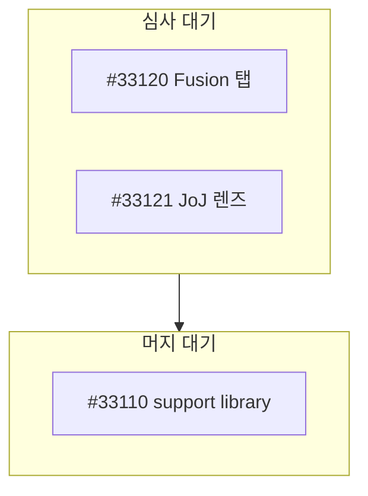

# 채팅에 그림을 그린다

```` ```mermaid ```` 펜스는 채팅에서 그림이 된다. 대시보드는 브라우저의 mermaid
라이브러리로 그리고, TUI 는 자기 렌더러(`bin/masc_tui_mermaid.ml`)로 상자와 선을 그린다.
운영자가 어느 쪽으로 읽을지 모르니 TUI 가 그릴 수 있는 범위 안에서 쓴다.

TUI 가 그리는 것은 세 종류다. `graph`/`flowchart`, `sequenceDiagram`, 그리고 `stateDiagram`/`stateDiagram-v2`. 나머지
(`classDiagram`, `erDiagram`, `gantt`, `pie` …)는 그리지 않고, 소스를 그대로
보여주면서 그 위에 이렇게 한 줄 적는다.

```
mermaid: classDiagram is not drawn here; the source follows
```

상태 머신은 `stateDiagram-v2` 로 쓰거나 `graph TD` 로 쓴다. `[*]` 는 시작/종료 상태로 그려진다.
전이 화살표는 `-->` 하나다. `note` 는 읽기만 하고 TUI 에 그려지지 않으니, 꼭 보여야 하는 말은
전이 라벨이나 상태 설명(`상태 : 설명`)에 넣는다.

## 폭이 제일 자주 문제다

터미널 창은 대개 80칸 언저리다. 옆으로 늘어놓은 사슬은 같은 사슬을 아래로 놓은 것보다
몇 배 넓다. **세로가 기본이다.** `graph TD` 로 쓰고, 정말 가로가 나은 것만 `LR` 로 쓴다.

안 들어가면 그림 대신 이런 줄과 소스가 나온다.

```
mermaid: the drawing needs 150 cells and this pane has 81 (as TD it fits); the source follows
```

`(as TD it fits)` 나 `(as LR it fits)` 가 붙으면 그 방향으로 다시 쓰면 들어간다. 괄호가 없으면
반대 방향으로도 안 들어간다는 뜻이니 라벨을 줄이거나 그림을 쪼갠다. `sequenceDiagram` 은
모양이 하나뿐이라 괄호가 붙지 않는다.

## 모양

| 쓰는 법 | 나오는 것 |
|---|---|
| `A[사각]` · `A[[사각]]` | 각진 상자 |
| `A(둥금)` · `A((원))` · `A([둥금])` | 모서리 둥근 상자 (모두 같다) |
| `A{판단}` · `A{{판단}}` | `⟨판단⟩` 을 담은 상자 |
| `A --> B` | 화살표 |
| `A --- B` | 머리 없는 선 |
| `A -.-> B` | 점선 |
| `A ==> B` | 굵은 선 |
| `A -->\|라벨\| B` · `A -- 라벨 --> B` | 선 옆에 글자 |
| `A & B --> C` | 두 노드에서 한 노드로 |

`<br/>` 은 공백이 된다. 상자는 한 줄짜리다. `%%` 로 시작하는 줄은 주석으로 건너뛴다.

## 묶음



제목 붙은 상자가 나오고, 중첩도 된다. `direction LR` 을 subgraph 안에 쓰면 그 상자만
가로로 눕는다. 맨 위에 쓴 `direction` 은 무시된다. 헤더가 이미 방향을 정했기 때문이다.

**묶음끼리 잇는 선은 묶음 이름으로 쓴다** (`Review --> Ready`). 한쪽 끝은 묶음 안, 다른
쪽 끝은 묶음 밖에 있는 선은 그리지 않는다. 상자가 하나의 항목이라, 그 선을 그리면 상자
테두리를 넘어 어느 노드로 가는지 틀리게 보인다. 거절 문구에 양쪽 이름이 나온다
(`an edge that crosses a subgraph boundary, A to PR1`). 같은 묶음 안의 노드끼리 잇는 선은
그린다. 앞에서 노드로 쓴 이름을 subgraph 이름으로 다시 쓰면 읽기 오류가 난다.

## 라벨에 괄호가 들어가면 따옴표로 감싼다

`A["고침 [HOLD: #1 참고]"]` 는 대괄호를 글자로 읽는다. 따옴표 없이 쓰면 첫 `]` 에서
라벨이 끊긴다.

## 안 그리는 것

`classDef`, `class`, `style`, `linkStyle`, `click` 은 읽고 버린다. 이 화면에는 색도
클릭도 없다. 색으로 뜻을 실으려 하지 말고 라벨에 적는다.

노드가 자기 자신으로 가는 선은 그리지 않는다(`an edge from A to itself`).

## 그리기 전에

- 노드가 열 개를 넘으면 대개 그림보다 표가 낫다.
- 순서가 정보가 아니면 화살표를 쓰지 않는다. 묶음만 보이면 되면 `subgraph` 로 충분하다.
- 라벨은 짧게. 라벨 폭이 곧 상자 폭이고, 상자 폭이 곧 그림 폭이다.
